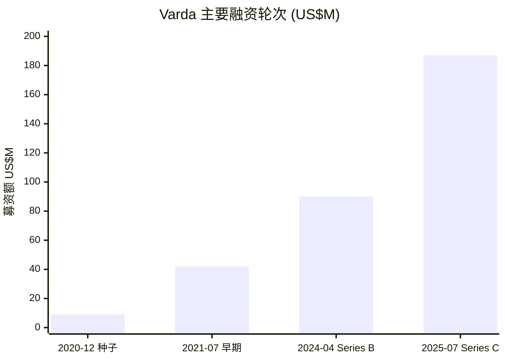
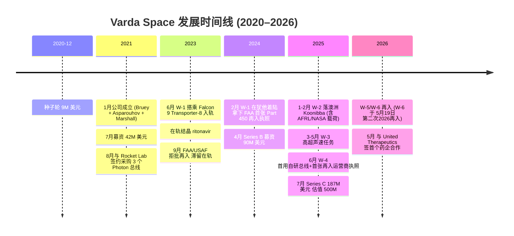
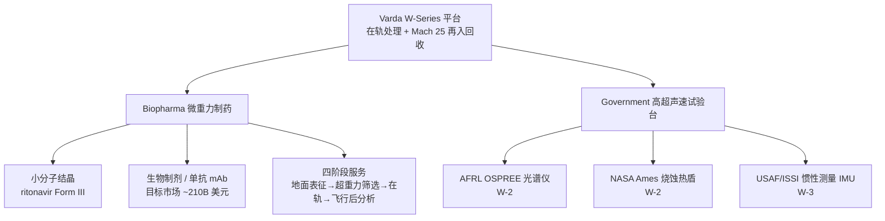
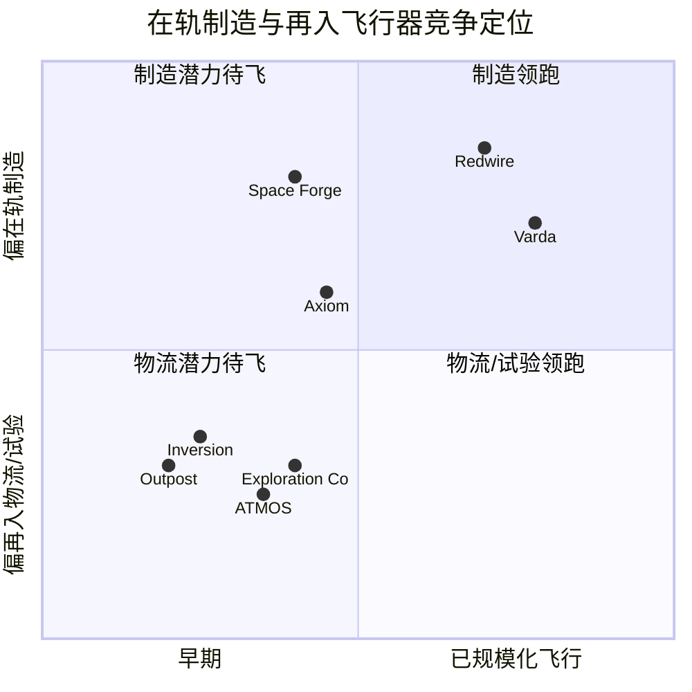

# Varda Space Industries（瓦尔达太空）公司研究 — The Orbital Factory（轨道工厂）

> **研究对象**：Varda Space Industries, Inc.（瓦尔达太空，非上市 / private）
> **总部**：美国加州 El Segundo（埃尔塞贡多）；另设亚拉巴马州 Huntsville（亨茨维尔）办公室
> **成立**：2021 年 1 月（首轮融资始于 2020 年 12 月）
> **主营**：微重力 (microgravity) 在轨制药 + 高超声速 (hypersonic) 再入试验平台
> **报告日期 (as of)**：2026-06-14 ｜ 报告语言：简体中文（技术/金融术语保留英文原词 + 中文释义）

---

## 投资摘要（Investment Summary）

> **评级 / 目标价 (Rating / PT)：不适用 — 非上市 (private)。** Varda 为风险资本支持的早期硬科技公司，尚无公开二级市场报价、无可审计的公开财务报表，因此本报告不给出 Buy/Hold/Sell 评级或 12 个月目标价；下文以"风险投资 (venture) 视角"替代估值层。
>
> **最近一轮估值 (last round)：投后约 US$500M（2025 年 7 月 Series C）。** 本轮募资 US$187M，使公司累计融资达 **US$329M**，正式跻身独角兽 (unicorn) 行列 — *分析师观点：估值反映"故事 + 里程碑"，而非现金流。* [Varda Series C 新闻稿, 2025-07-10](https://www.prnewswire.com/news-releases/varda-announces-187-million-in-series-c-funding-to-make-medicines-in-space-302502096.html)
>
> **四条投资主线 (thesis pillars)**：
> 1. **已被验证的"在轨制造 → 返地"闭环**：W-1 于 2024 年 2 月成功带回在轨结晶的抗病毒药 ritonavir，使 Varda 成为继 SpaceX、Boeing 之后第三个回收完整在轨航天器的实体。[Space.com, 2024-02-22](https://www.space.com/varda-in-space-manufacturing-capsule-landing-success)
> 2. **双业务对冲单一终端风险**：同一艘飞船既是制药反应器，也是全球最具性价比的高超声速试验台 (hypersonic testbed) — 国防收入为长周期的制药商业化"输血"。[An Update on Varda after W-2](https://www.varda.com/announcements/an-update-on-varda-after-w-2)
> 3. **监管壁垒已被自己跑通**：W-4 拿到 FAA 史上首张"再入飞行器运营商执照"(Part 450 reentry vehicle operator license)，把曾让 W-1 滞留在轨约 8 个月的审批瓶颈变成了护城河。[Varda W-4 新闻稿, 2025-06-24](https://www.prnewswire.com/news-releases/varda-space-industries-launches-w-4-with-the-faas-first-ever-reentry-vehicle-operator-license-and-debuts-an-in-house-satellite-bus-302488811.html)
> 4. **节奏 (cadence) 是北极星指标**：与 Southern Launch 锁定 2028 年前 20 次再入着陆场容量，目标 2028 年底实现近月度再入节奏 — 制造经济学随飞行频次摊薄而成立。[Varda & Southern Launch 协议](https://www.varda.com/announcements/varda-and-southern-launch-announce-agreement-for-20-reentries-from-orbit-through)

**核心风险**：制药业务尚无产品收入、无 FDA 批准的在轨制造药物；近期现金主要靠 VC 与国防合同；发射高度依赖单一通道 SpaceX；再入着陆场单点依赖澳大利亚 Koonibba；$500M 估值对一家尚未盈利的公司隐含较高下行（down-round）风险。

---

## 目录

1. 公司概览（含 venture 视角估值层）
2. 公司历史与融资历程
3. 管理团队
4. 产品与服务（含资金流向价值链图）
5. 客户与商业化策略
6. 行业概览
7. 竞争格局
8. 市场机会（TAM）
9. 风险评估（含关键分歧与催化剂）
10. 投资视角评分（venture 适配版）
11. 参考资料

---

## 1. 公司概览

Varda Space Industries 用自己官网的话定义自己：*"Varda is a microgravity-enabled life sciences company that processes materials in orbit and returns them to Earth."*（一家"微重力赋能的生命科学公司"，在轨道上加工材料并将其带回地球），口号是 *"Space born, Earth bound"*（生于太空、归于地球），愿景是 *"Expanding the economic bounds of humankind"*（拓展人类的经济边界）。[varda.com 官网](https://www.varda.com/) 与多数"太空概念"公司不同，Varda 把自己的定位刻意收窄到**两件具体的、可交付的事**：在微重力下做更好的药物结晶，以及把每次返地的火球当作高超声速试验机会出售。

公司本质是一家**早期硬科技初创**：2021 年 1 月成立，总部位于洛杉矶南湾航天产业带的 El Segundo，2025 年员工约 140 人，并在亚拉巴马 Huntsville（美国"火箭城"、众多国防航天承包商聚集地）新设办公室。[Wikipedia: Varda Space Industries](https://en.wikipedia.org/wiki/Varda_Space_Industries) 截至本报告日（2026-06），Varda 已完成 **W-1 至 W-6 共多次**"发射—在轨处理—再入回收"任务：W-1 是里程碑式的概念验证，W-2/W-3/W-4 把节奏、载荷多样性与垂直整合逐步推进，[TechCrunch, 2025-11-30](https://techcrunch.com/2025/11/30/varda-says-it-has-proven-space-manufacturing-works-now-it-wants-to-make-it-boring/) 而最新的 **W-6 于 2026 年 5 月 19 日再入**（公司称其为"2026 年的第二次再入"），验证了基于驻留空间目标成像的**自主高超声速导航**，并承飞 NASA、AFRL 与 Sandia 国家实验室的载荷——节奏战略正从"能飞"走向"年内常态化多飞"。[Varda W-6 再入新闻稿, 2026-05-19](https://www.prnewswire.com/news-releases/varda-space-industries-successfully-reenters-w-6-validating-autonomous-navigation-and-advanced-thermal-protection-systems-302775804.html)

**Venture 视角的"估值层"（替代二级市场估值）。** 由于 Varda 非上市、无公开财报，本报告不套用 P/E、P/S 等二级市场倍数，而以风险投资语言刻画其当前位置：公司处于 **Series C / 成长期**，2025 年 7 月以投后约 **US$500M** 估值募集 **US$187M**，累计融资 **US$329M**。[Varda Series C 新闻稿, 2025-07-10](https://www.prnewswire.com/news-releases/varda-announces-187-million-in-series-c-funding-to-make-medicines-in-space-302502096.html) *分析师观点：* 对一家尚处"已验证技术、未验证规模化商业模式"阶段的公司，$500M 估值由三件事支撑——可复现的返地能力、已签约的国防现金流、以及制药这一潜在巨大终端市场的看涨期权；它**不**由当期收入或利润支撑，因此对里程碑（任务成败、药企订单、FDA 路径）的敏感度极高。

下面这张 `xychart-beta` 给出公司四轮主要融资的体量演进（口径：各轮披露的募资额，单位 US$M）：

*图 1：Varda 融资体量逐轮放大，Series C 单轮 US$187M 约为前一轮的 2 倍。* Source: [Wikipedia 融资史](https://en.wikipedia.org/wiki/Varda_Space_Industries) ｜ [Varda Series C 新闻稿](https://www.prnewswire.com/news-releases/varda-announces-187-million-in-series-c-funding-to-make-medicines-in-space-302502096.html)

---

## 2. 公司历史与融资历程

Varda 的故事是一条"先做难的物理、再跑通难的监管、最后压低单位成本"的曲线。下面的 `timeline` 串起关键节点：

*图 2：从种子轮到独角兽，Varda 用约五年完成"技术验证 → 监管破冰 → 商业签约"。* Source: [Wikipedia: Varda](https://en.wikipedia.org/wiki/Varda_Space_Industries) ｜ [Varda & Southern Launch](https://www.varda.com/announcements/varda-and-southern-launch-announce-agreement-for-20-reentries-from-orbit-through)

**融资历程（按披露口径）。** 公司在 2020 年 12 月先拿到约 US$9M 起步资金；2021 年 7 月获 US$42M；2024 年 4 月再募 US$90M（市场普遍称之为 Series B）；2025 年 7 月 10 日完成 US$187M 的 Series C，投后估值约 US$500M，累计融资 US$329M。[Wikipedia: Varda](https://en.wikipedia.org/wiki/Varda_Space_Industries) Series C 由 **Natural Capital** 与 **Shrug Capital** 领投，**Founders Fund**、**Peter Thiel**、**Khosla Ventures**、**Caffeinated Capital**、**Lux Capital** 及 **Also Capital** 跟投。[Varda Series C 新闻稿, 2025-07-10](https://www.prnewswire.com/news-releases/varda-announces-187-million-in-series-c-funding-to-make-medicines-in-space-302502096.html) 这个投资人名单本身是信号——Founders Fund（Peter Thiel）与 Khosla 都是 Varda 联创的"老东家"，体现了创始团队在硅谷深空科技圈的资源密度。[CNBC, 2025-07-10](https://www.cnbc.com/2025/07/10/space-startup-varda-medicine-orbit.html)

**与 Rocket Lab 的早期绑定。** 2021 年 8 月，Varda 与 Rocket Lab 签约采购 3 个 Photon 卫星总线（含第 4 个的选择权），首个于 2023 年第二季度交付——这是 W-1 至 W-3 得以快速上天的关键外部依赖。[Wikipedia: Varda](https://en.wikipedia.org/wiki/Varda_Space_Industries) 这一安排在 W-4 阶段被 Varda 的**自研总线**部分替代（见第 4 章），标志着公司开始向价值链上游垂直整合。

**W-1 的"滞留"事件——既是危机，也是护城河的起点。** 2023 年 6 月 12 日，洗衣机大小（约 90cm 宽 × 74cm 高、重量 <90kg）的 W-1（昵称 "Winnebago-1"）搭乘 Falcon 9 Transporter-8 入轨。[TechCrunch, 2025-11-30](https://techcrunch.com/2025/11/30/varda-says-it-has-proven-space-manufacturing-works-now-it-wants-to-make-it-boring/) 它原计划 2023 年 9 月再入，却因 FAA 迟迟未发再入执照、且美国空军以"整体安全与风险评估"为由拒绝其使用犹他试验靶场而被迫滞留在轨约 8 个月。[SpaceNews: Varda waiting on FAA license](https://spacenews.com/varda-waiting-on-faa-license-to-return-space-manufacturing-capsule/) 直到 2024 年 2 月，Varda 拿到**史上首张 FAA Part 450 再入执照**，W-1 才于 2 月 21–22 日成功降落犹他试验靶场（Utah Test and Training Range）。[TechCrunch, 2024-02-21](https://techcrunch.com/2024/02/21/varda-space-rocket-lab-nail-first-of-its-kind-spacecraft-landing-in-utah) 此事直接推动 FAA 修改政策：返地航天器今后必须在发射前就持有再入授权。[Popular Science, 2024](https://www.popsci.com/science/space-reentry-license-faa/) 当年的痛点，后来变成了 Varda 的先发监管优势。

---

## 3. 管理团队

> 按本研究规范，管理层一章仅聚焦创始人与现任 CEO；Varda 的特殊之处是 CEO 即联合创始人，故合并撰写，并补充一位以"总裁"身份深度参与的联合创始人。

**Will Bruey（联合创始人兼 CEO）。** Bruey 拥有康奈尔大学 (Cornell University) 工程物理学士（2011）与系统工程硕士（2012）。[Wikipedia: Will Bruey](https://en.wikipedia.org/wiki/Will_Bruey) 2012 年 6 月加入 SpaceX，起步于 Falcon 9 的硬件开发工程师，负责航电 (avionics) 通信协议设计、主导火箭首批摄像头的集成；随后成为 **Dragon 1 与 Dragon 2 飞船项目的首席航电工程师**，并作为主任务控制操作员参与了 8 次国际空间站 (ISS) 任务，2014 年因开发 ISS 机械臂操作视觉反馈系统获 NASA 成就奖。[Wikipedia: Will Bruey](https://en.wikipedia.org/wiki/Will_Bruey) 这段"把货真价实的载人飞船送上太空又安全带回"的经历，正是 Varda 商业模式（在轨处理 + 安全再入回收）的人力基因。离开 SpaceX 后，他于 2016 年联合创办工程咨询公司 Second Order Effects，2018 年短暂任 Merrill Lynch 全球股票技术总监，2019 年联合创办风险投资机构 Also Capital（亦为 Varda 的现任投资人之一）。[Wikipedia: Will Bruey](https://en.wikipedia.org/wiki/Will_Bruey)

Bruey 对公司的战略表述很能说明问题。他强调 Varda 是 *"in-space industry"* 而不是 *"in the space industry"*，要把太空当作 *"just another place to ship to"*（只是又一个可以发货的地方），目标是把在轨制药变得"无聊"(boring)、即常规化。[TechCrunch, 2025-11-30](https://techcrunch.com/2025/11/30/varda-says-it-has-proven-space-manufacturing-works-now-it-wants-to-make-it-boring/) 他也直言监管现实：*"Either you have to push the boundaries of regulation to create this future, or you don't."*（要么推动监管边界以创造未来，要么就别做。）[TechCrunch, 2025-11-30](https://techcrunch.com/2025/11/30/varda-says-it-has-proven-space-manufacturing-works-now-it-wants-to-make-it-boring/)

**Delian Asparouhov（联合创始人兼总裁 / President）。** 保加利亚裔美国企业家与风险投资人，现任 **Founders Fund** 合伙人，亦是 Varda 的联合创始人兼总裁。[Wikipedia: Delian Asparouhov](https://en.wikipedia.org/wiki/Delian_Asparouhov) 加入 Founders Fund 之前，他曾任 Khosla Ventures 的 principal、Teespring 的增长负责人，并创办过医疗健康公司 Nightingale；他 2011 年入读 MIT 修读计算机科学，2013 年辍学创业。[Wikipedia: Delian Asparouhov](https://en.wikipedia.org/wiki/Delian_Asparouhov) Asparouhov 同时身处头部 VC 与被投公司管理层的双重身份，使 Varda 在融资与人脉上具备超出同龄初创的资源杠杆——这也解释了为何 Founders Fund、Khosla 等机构在多轮中持续跟投。[CNBC, 2025-07-10](https://www.cnbc.com/2025/07/10/space-startup-varda-medicine-orbit.html)

**其他关键岗位（仅作背景，不展开）。** 据维基百科，公司由 Bruey、Asparouhov 与 **Daniel Marshall** 共同创立；现任管理层还包括首席科学官 (CSO) **Adrian Radocea**（在 Series C 中谈到要支持更复杂的分子、提升周转速度以匹配药企预期）与首席营收官 (CRO) **Eric Lasker**（负责再入着陆场等运营合作）。[Wikipedia: Varda](https://en.wikipedia.org/wiki/Varda_Space_Industries) ｜ [Varda Series C 新闻稿](https://www.prnewswire.com/news-releases/varda-announces-187-million-in-series-c-funding-to-make-medicines-in-space-302502096.html)

---

## 4. 产品与服务

> 本章是全报告的分析地基。Varda 的"产品"不是一个 SKU 清单，而是**一个可复用的航天平台（W-Series capsule）+ 两套挂在平台上的服务（制药、国防）**。理解这一点，第 5–9 章才能站得住。

### 4.1 平台：W-Series 再入飞船

Varda 官网把 W-Series 平台描述为 *"Built for orbital material processing and reentry"*（为在轨材料处理与再入而生）。[varda.com 官网](https://www.varda.com/) 它本质上是一艘小型无人"轨道工厂 + 返回舱"：搭乘他人火箭（目前主要是 SpaceX Falcon 9 的 Transporter 拼车任务）入轨，挂在一个提供电力/通信/姿控/推进的卫星总线 (satellite bus) 上运行数周，在舱内自主完成材料处理后，与总线分离、以超过 **Mach 25**（25 倍音速、约 18,000 mph）的速度再入大气层，最后开伞软着陆于试验靶场。[Varda & Southern Launch](https://www.varda.com/announcements/varda-and-southern-launch-announce-agreement-for-20-reentries-from-orbit-through) 再入过程中，舱体承受持续约 **300 W/cm²** 的热流——这恰恰把"返地"这一制造环节的副产品，变成了可出售的高超声速试验环境。[varda.com/government](https://www.varda.com/government)

**W-Series 任务演进（development over time）。** 把四次任务并排看，能清楚读出公司"什么在变新"：

| 任务 | 入轨 | 火箭 / 总线 | 着陆场 | 关键"新变化" |
|---|---|---|---|---|
| **W-1** | 2023-06 | Falcon 9 Transporter-8 / Rocket Lab Photon | 美国犹他 (2024-02) | 概念验证；在轨结晶 ritonavir；第三个回收完整在轨航天器的实体；首张 FAA Part 450 再入执照 |
| **W-2** | 2025-01 | Transporter-12 / Rocket Lab | 澳洲 Koonibba (2025-02) | 一舱三载荷（制药 + NASA Ames 烧蚀热盾 + AFRL OSPREE 光谱仪）；再入场迁往澳洲 |
| **W-3** | 2025-03 | Transporter-13 / Rocket Lab Pioneer | 澳洲 Koonibba (2025-05) | 以国防高超声速数据为主（USAF/ISSI 的惯性测量单元 IMU） |
| **W-4** | 2025-06 | Transporter-14 / **Varda 自研总线** | 澳洲 Koonibba | 首用自研总线；首张 FAA"再入飞行器运营商执照"；首次用流体扩张架构做小分子结晶 |

表 1 数据来源：[Wikipedia: Varda](https://en.wikipedia.org/wiki/Varda_Space_Industries) ｜ [Varda W-2 launch 新闻稿](https://www.prnewswire.com/news-releases/vardas-second-mission-w-2-launches-with-payloads-from-air-force-research-laboratory-and-nasa-302350940.html) ｜ [DefenseNews W-3, 2025-05-14](https://www.defensenews.com/space/2025/05/14/varda-lands-third-space-capsule-carrying-key-hypersonic-flight-data/) ｜ [Varda W-4 新闻稿, 2025-06-24](https://www.prnewswire.com/news-releases/varda-space-industries-launches-w-4-with-the-faas-first-ever-reentry-vehicle-operator-license-and-debuts-an-in-house-satellite-bus-302488811.html)

**W-4 之后（W-5 / W-6）。** 进入 2026 年，节奏继续兑现：W-6 已于 2026 年 5 月 19 日再入（公司称为"2026 年的第二次再入"，意味着 W-5 已在更早时点完成），载荷来自 NASA、AFRL 与 Sandia 国家实验室，重点验证了**自主高超声速导航**与先进热防护瓦片（Sandia 鼻锥瓦内嵌传感器）。[Varda W-6 再入新闻稿, 2026-05-19](https://www.prnewswire.com/news-releases/varda-space-industries-successfully-reenters-w-6-validating-autonomous-navigation-and-advanced-thermal-protection-systems-302775804.html) 这把第 4.3 节的国防试验台叙事从"承诺"推进到"年内常态化交付"。

**W-4 的两项"本期新变化"尤其重要。** 其一，W-4 首次搭载 Varda 在 El Segundo 总部**完全自研、自造的下一代航天器总线**，为飞船提供 *"power, communications, attitude control, and propulsion"*（电力、通信、姿态控制与推进），CEO Bruey 称 *"Nothing is more exciting than the debut flight of a new commercial vehicle"*。[Varda W-4 新闻稿, 2025-06-24](https://www.prnewswire.com/news-releases/varda-space-industries-launches-w-4-with-the-faas-first-ever-reentry-vehicle-operator-license-and-debuts-an-in-house-satellite-bus-302488811.html) 这意味着公司开始把原本付给 Rocket Lab 的总线钱"留在自家"。其二，W-4 拿到 FAA 首张 **Part 450 再入飞行器运营商执照**，有效期至 2029 年——按官方说法，今后"无需为每一次再入单独申请批准，而是在一个综合安全框架下运营"。[Varda W-4 新闻稿, 2025-06-24](https://www.prnewswire.com/news-releases/varda-space-industries-launches-w-4-with-the-faas-first-ever-reentry-vehicle-operator-license-and-debuts-an-in-house-satellite-bus-302488811.html) 这把 W-1 时代"逐次审批"的瓶颈，升级成"框架式运营"，是节奏 (cadence) 战略能否兑现的制度前提。

### 4.2 服务一：Biopharma（微重力制药）

**它在客户价值链里物理上做什么。** Varda 官网把微重力对制药的价值讲得很直白：*"Microgravity suppresses convective currents, buoyancy, and sedimentation, and the resulting crystals are more uniform in size and structure."*（微重力抑制对流、浮力与沉降，所得晶体在尺寸与结构上更均匀。）[varda.com/biopharma](https://www.varda.com/biopharma) 在地球上，重力驱动的对流与沉降会扰动结晶过程，使某些药物难以稳定地形成特定的多晶型 (polymorph)；在轨道上去掉重力，分子在"更安静"的环境里聚集，能形成地面难以获得的、更有序的晶体结构。这正是 W-1 在轨做出 ritonavir（用于治疗 HIV/丙肝）"Form III"晶型的物理基础。[Space.com: HIV 药物在轨制造](https://www.space.com/varda-space-microgravity-pharmaceutical-production-success)

**它对客户解决三类问题（官网原话）。** ① **配方 (Formulation)**：改善小分子与生物制剂的 *"shelf-life, bioavailability, and the patient experience"*（货架期、生物利用度与患者体验）；② **结晶 (Crystallization)**：实现 *"particle size tuning"*（粒径调控）与适合结构解析或增强递送的晶体；③ **知识产权 (IP)**：为新化学实体 (NCEs) 及已上市药物的生命周期管理生成"使能性的产品与工艺 IP"。[varda.com/biopharma](https://www.varda.com/biopharma)

**它如何与药企协作（四阶段闭环）。** 官网披露的服务路径为：地面表征（用 Crystal16、EasyMax 反应器配实时传感）→ 超重力筛选 (hypergravity screening)（在多档重力下评估药物性质）→ 在轨处理（自主舱内运行并返地）→ 飞行后分析（衍射 SCXRD/XRPD/同步辐射、波谱 NMR/Raman/FTIR、显微 SEM/TEM）。[varda.com/biopharma](https://www.varda.com/biopharma) W-1 返地后，ritonavir 样品即被送往制药分析公司 **Improved Pharma** 做表征。[Improved Pharma: 分析在轨结晶药物](https://improvedpharma.com/analyzing-pharmaceuticals-crystallized-in-space/)

**战略意义（什么需求在驱动）。** 短期看，制药业务还在"科学验证 → 商业订单"的爬坡期；2026 年 5 月与 United Therapeutics 的首单（见第 5 章）是关键拐点。中长期看，Bruey 把更复杂的分子、尤其是**单克隆抗体 (mAb) 等生物制剂**视为主战场，并称该市场规模约 **US$210B**。[TechCrunch, 2025-11-30](https://techcrunch.com/2025/11/30/varda-says-it-has-proven-space-manufacturing-works-now-it-wants-to-make-it-boring/) Series C 募资的一大用途正是把 El Segundo 的制药实验室扩到 1 万平方英尺、并在 Huntsville 设点，以支持更复杂分子、提升周转速度至药企可接受的水平。[Varda Series C 新闻稿, 2025-07-10](https://www.prnewswire.com/news-releases/varda-announces-187-million-in-series-c-funding-to-make-medicines-in-space-302502096.html)

### 4.3 服务二：Government（高超声速试验台）

**它物理上提供什么。** Varda 官网把国防业务定义为 *"the off-the-shelf method to reproduce the most challenging hypersonic and reentry flight environments"*（复现最严苛高超声速与再入飞行环境的"现成"方法）。[varda.com/government](https://www.varda.com/government) 客户可在再入过程中测试**热防护材料 (thermal protection)、导航、通信子系统与传感器**。官网用一张对比把卖点讲清楚：计算设计"快但可能不准"，地面风洞试验"时长短且大气环境失真"，而 Varda 的飞行试验是 *"Affordable, frequent, true environments"*（便宜、频繁、真实环境）。[varda.com/government](https://www.varda.com/government)

**为什么有人买单。** *分析师观点：* 传统高超声速试飞单次成本可高达 **US$100M 以上**，[TechCrunch, 2025-11-30](https://techcrunch.com/2025/11/30/varda-says-it-has-proven-space-manufacturing-works-now-it-wants-to-make-it-boring/) 而 Varda 把每次"返地火球"复用为试验机会，单位成本被任务节奏摊薄。具体合同上：据报道，Varda 在 2023 年获得 US$60M 的政府与私人资金支持空军应用测试，随后于 2024 年 11 月与 **AFRL（空军研究实验室）**签下 **4 年、US$48M** 合同，在 W-Series 上承飞高超声速载荷；该合作隶属 AFRL 的 **Prometheus** 计划，用低成本、高节奏的商业试验台加速高超声速与再入技术的测试与现代化。[SpaceNews: 美空军授予 Varda US$48M 合同, 2024-11-26](https://spacenews.com/u-s-air-force-awards-varda-48-million-to-test-payloads-on-reentry-capsules/) ｜ [Interesting Engineering: Varda 测试美空军高超声速技术](https://interestingengineering.com/innovation/varda-test-us-air-force-hypersonic-tech)

**已飞的国防载荷（具体、可核）。** W-2 携带了 AFRL 的 **OSPREE**（Optical Sensing of Plasmas in the ReEntry Environment，再入环境等离子体光学传感）光谱仪——它在超过 Mach 25 的再入中记录等离子鞘层的光谱发射，取得了"史上首批 Mach 15 以上再入环境的原位光学发射测量"。[varda.com OSPREE 科学页](https://www.varda.com/science/developing-the-ospree-payload-for-spectroscopic-measurements-of-a-mach-25-plasma) ｜ [AIAA 论文, 2024](https://arc.aiaa.org/doi/10.2514/6.2024-4560) W-2 同时还带了 NASA Ames 的烧蚀热盾样品做先进热防护测试。[An Update on Varda after W-2](https://www.varda.com/announcements/an-update-on-varda-after-w-2) W-3 则以国防数据为主，搭载了由 Innovative Scientific Solutions Inc.（ISSI）为美国空军开发的惯性测量单元 (IMU)。[DefenseNews, 2025-05-14](https://www.defensenews.com/space/2025/05/14/varda-lands-third-space-capsule-carrying-key-hypersonic-flight-data/)

### 4.4 产品组合树与"资金流向"价值链

两套服务如何挂在同一平台上，用一张 `graph TD` 看最清楚：

*图 3：一个平台、两套服务——国防现金流为制药商业化"输血"。* Source: [varda.com/government](https://www.varda.com/government) ｜ [varda.com/biopharma](https://www.varda.com/biopharma) ｜ [An Update on Varda after W-2](https://www.varda.com/announcements/an-update-on-varda-after-w-2)

**资金流向（follow the money）。** 下面这张"资金流向"价值链图回答了财务报表回答不了的问题：Varda 的钱从哪来，又最终汇聚到哪几个上游瓶颈。方向上我选择"花钱视角 + 资金来源"框架——左列是给 Varda 出钱的三方（VC、政府、药企），中列是 Varda 的运营投入，右列是钱最终汇聚的少数瓶颈供应商。

<svg xmlns="http://www.w3.org/2000/svg" viewBox="0 0 1180 1040" width="1180" height="1040" role="img" aria-label="Varda 的钱从哪来、流向哪些瓶颈供应商" font-family="'Space Grotesk',system-ui,-apple-system,'Segoe UI',sans-serif">
<defs><linearGradient id="mfgold" gradientUnits="userSpaceOnUse" x1="0" y1="0" x2="1180" y2="0"><stop offset="0" stop-color="#f6dc97"/><stop offset="0.5" stop-color="#e9b658"/><stop offset="1" stop-color="#cf8f2c"/></linearGradient><radialGradient id="mfpool" cx="50%" cy="50%" r="50%"><stop offset="0" stop-color="#34d399" stop-opacity="0.16"/><stop offset="1" stop-color="#34d399" stop-opacity="0"/></radialGradient></defs>
<rect x="0" y="0" width="1180" height="1040" rx="16" fill="#0b0f1a"/>
<text x="42.00" y="56.00" text-anchor="start" font-family="'JetBrains Mono',ui-monospace,Menlo,monospace" font-size="11.5" font-weight="600" fill="#e9b658" letter-spacing="3">VARDA SPACE · 资金流向 / MONEY FLOW · 2021–2026</text>
<text x="42.00" y="100.00" text-anchor="start" font-family="'Space Grotesk',system-ui,-apple-system,'Segoe UI',sans-serif" font-size="32" font-weight="700" fill="#e8ecf5">Varda 的钱从哪来、流向哪些瓶颈供应商</text>
<text x="42.00" y="142.00" text-anchor="start" font-family="'Space Grotesk',system-ui,-apple-system,'Segoe UI',sans-serif" font-size="15" font-weight="400" fill="#8a93a8">风险资本与政府/药企合同的现金，经 Varda 的 W-Series 任务运营，最终汇聚到极少数上游瓶颈：发射、卫星总线、再入着陆场。Varda 正以自研总线把其中一部分钱留在自家。</text>
<ellipse cx="1031.00" cy="410.00" rx="190" ry="150" fill="url(#mfpool)"/>
<line x1="369.50" y1="188.00" x2="369.50" y2="628.00" stroke="#222a3a" stroke-dasharray="2 8"/>
<line x1="810.50" y1="188.00" x2="810.50" y2="628.00" stroke="#222a3a" stroke-dasharray="2 8"/>
<text x="42.00" y="172.00" text-anchor="start" font-family="'JetBrains Mono',ui-monospace,Menlo,monospace" font-size="12" font-weight="400" fill="#e9b658" letter-spacing="3">STAGE 01</text>
<text x="42.00" y="188.00" text-anchor="start" font-family="'JetBrains Mono',ui-monospace,Menlo,monospace" font-size="11.5" font-weight="400" fill="#646d82">谁出钱 (资金来源)</text>
<text x="483.00" y="172.00" text-anchor="start" font-family="'JetBrains Mono',ui-monospace,Menlo,monospace" font-size="12" font-weight="400" fill="#e9b658" letter-spacing="3">STAGE 02</text>
<text x="483.00" y="188.00" text-anchor="start" font-family="'JetBrains Mono',ui-monospace,Menlo,monospace" font-size="11.5" font-weight="400" fill="#646d82">Varda 运营投入</text>
<text x="924.00" y="172.00" text-anchor="start" font-family="'JetBrains Mono',ui-monospace,Menlo,monospace" font-size="12" font-weight="400" fill="#e9b658" letter-spacing="3">STAGE 03</text>
<text x="924.00" y="188.00" text-anchor="start" font-family="'JetBrains Mono',ui-monospace,Menlo,monospace" font-size="11.5" font-weight="400" fill="#646d82">钱最终汇聚在哪 (瓶颈)</text>
<path d="M 256.00 274.82 C 369.50 274.82, 369.50 257.64, 483.00 257.64" fill="none" stroke="url(#mfgold)" stroke-width="19.64" stroke-linecap="round" opacity="0.9"/>
<path d="M 256.00 292.27 C 369.50 292.27, 369.50 355.00, 483.00 355.00" fill="none" stroke="url(#mfgold)" stroke-width="15.27" stroke-linecap="round" opacity="0.9"/>
<path d="M 256.00 306.45 C 369.50 306.45, 369.50 545.14, 483.00 545.14" fill="none" stroke="url(#mfgold)" stroke-width="13.09" stroke-linecap="round" opacity="0.9"/>
<path d="M 256.00 424.36 C 369.50 424.36, 369.50 448.00, 483.00 448.00" fill="none" stroke="url(#mfgold)" stroke-width="17.45" stroke-linecap="round" opacity="0.9"/>
<path d="M 256.00 411.27 C 369.50 411.27, 369.50 271.82, 483.00 271.82" fill="none" stroke="url(#mfgold)" stroke-width="8.73" stroke-linecap="round" opacity="0.9"/>
<path d="M 256.00 541.00 C 369.50 541.00, 369.50 556.05, 483.00 556.05" fill="none" stroke="url(#mfgold)" stroke-width="8.73" stroke-linecap="round" opacity="0.9"/>
<path d="M 697.00 262.00 C 810.50 262.00, 810.50 245.00, 924.00 245.00" fill="none" stroke="url(#mfgold)" stroke-width="24.00" stroke-linecap="round" opacity="0.9"/>
<path d="M 697.00 348.45 C 810.50 348.45, 810.50 355.00, 924.00 355.00" fill="none" stroke="url(#mfgold)" stroke-width="17.45" stroke-linecap="round" opacity="0.9"/>
<path d="M 697.00 363.73 C 810.50 363.73, 810.50 567.36, 924.00 567.36" fill="none" stroke="url(#mfgold)" stroke-width="13.09" stroke-linecap="round" opacity="0.9"/>
<path d="M 697.00 448.00 C 810.50 448.00, 810.50 465.00, 924.00 465.00" fill="none" stroke="url(#mfgold)" stroke-width="19.64" stroke-linecap="round" opacity="0.9"/>
<path d="M 697.00 549.50 C 810.50 549.50, 810.50 581.55, 924.00 581.55" fill="none" stroke="url(#mfgold)" stroke-width="15.27" stroke-linecap="round" opacity="0.9"/>
<text x="369.50" y="430.18" text-anchor="middle" font-family="'JetBrains Mono',ui-monospace,Menlo,monospace" font-size="11.5" font-weight="400" fill="#f4d58a" paint-order="stroke" stroke="#0b0f1a" stroke-width="3.2" stroke-linejoin="round">$48M / 4yr</text>
<rect x="42.00" y="229.00" width="214" height="120.00" rx="12" fill="#15101a" stroke="#f2655f" stroke-opacity="0.5"/>
<rect x="42.00" y="229.00" width="3" height="120.00" rx="2" fill="#f2655f"/>
<text x="60.00" y="262.00" text-anchor="start" font-family="'Space Grotesk',system-ui,-apple-system,'Segoe UI',sans-serif" font-size="21" font-weight="700" fill="#ffffff">风险资本 VC</text>
<text x="60.00" y="283.00" text-anchor="start" font-family="'JetBrains Mono',ui-monospace,Menlo,monospace" font-size="11" font-weight="400" fill="#c98c87">累计融资 $329M</text>
<text x="60.00" y="300.00" text-anchor="start" font-family="'JetBrains Mono',ui-monospace,Menlo,monospace" font-size="11" font-weight="400" fill="#c98c87">Series C $187M / 估值 $500M</text>
<rect x="42.00" y="365.00" width="214" height="110.00" rx="12" fill="#0f1622" stroke="#7fa8f5" stroke-opacity="0.5"/>
<rect x="42.00" y="365.00" width="3" height="110.00" rx="2" fill="#7fa8f5"/>
<text x="60.00" y="398.00" text-anchor="start" font-family="'Space Grotesk',system-ui,-apple-system,'Segoe UI',sans-serif" font-size="21" font-weight="700" fill="#ffffff">政府 / 国防</text>
<text x="60.00" y="419.00" text-anchor="start" font-family="'JetBrains Mono',ui-monospace,Menlo,monospace" font-size="11" font-weight="400" fill="#8ca6d6">AFRL 4年 $48M 合同</text>
<text x="60.00" y="436.00" text-anchor="start" font-family="'JetBrains Mono',ui-monospace,Menlo,monospace" font-size="11" font-weight="400" fill="#8ca6d6">Prometheus 高超声速</text>
<rect x="42.00" y="491.00" width="214" height="100.00" rx="12" fill="#15121f" stroke="#a78bfa" stroke-opacity="0.5"/>
<rect x="42.00" y="491.00" width="3" height="100.00" rx="2" fill="#a78bfa"/>
<text x="60.00" y="524.00" text-anchor="start" font-family="'Space Grotesk',system-ui,-apple-system,'Segoe UI',sans-serif" font-size="21" font-weight="700" fill="#ffffff">药企客户</text>
<text x="60.00" y="545.00" text-anchor="start" font-family="'JetBrains Mono',ui-monospace,Menlo,monospace" font-size="11" font-weight="400" fill="#b9a6f5">United Therapeutics</text>
<text x="60.00" y="562.00" text-anchor="start" font-family="'JetBrains Mono',ui-monospace,Menlo,monospace" font-size="11" font-weight="400" fill="#b9a6f5">小分子结晶处理</text>
<rect x="483.00" y="223.50" width="214" height="77.00" rx="12" fill="#141a2a" stroke="#56c6e6" stroke-opacity="0.5"/>
<rect x="483.00" y="223.50" width="3" height="77.00" rx="2" fill="#56c6e6"/>
<text x="501.00" y="256.50" text-anchor="start" font-family="'Space Grotesk',system-ui,-apple-system,'Segoe UI',sans-serif" font-size="21" font-weight="700" fill="#ffffff">发射 / 拼车</text>
<text x="501.00" y="277.50" text-anchor="start" font-family="'JetBrains Mono',ui-monospace,Menlo,monospace" font-size="11" font-weight="400" fill="#8a93a8">进入近地轨道 LEO</text>
<rect x="483.00" y="316.50" width="214" height="77.00" rx="12" fill="#0f1622" stroke="#7fa8f5" stroke-opacity="0.5"/>
<rect x="483.00" y="316.50" width="3" height="77.00" rx="2" fill="#7fa8f5"/>
<text x="501.00" y="349.50" text-anchor="start" font-family="'Space Grotesk',system-ui,-apple-system,'Segoe UI',sans-serif" font-size="21" font-weight="700" fill="#ffffff">航天器总线</text>
<text x="501.00" y="370.50" text-anchor="start" font-family="'JetBrains Mono',ui-monospace,Menlo,monospace" font-size="11" font-weight="400" fill="#9bb3df">在轨平台 + 推进</text>
<rect x="483.00" y="409.50" width="214" height="77.00" rx="12" fill="#141a2a" stroke="#d9a05b" stroke-opacity="0.5"/>
<rect x="483.00" y="409.50" width="3" height="77.00" rx="2" fill="#d9a05b"/>
<text x="501.00" y="442.50" text-anchor="start" font-family="'Space Grotesk',system-ui,-apple-system,'Segoe UI',sans-serif" font-size="21" font-weight="700" fill="#ffffff">再入与回收</text>
<text x="501.00" y="463.50" text-anchor="start" font-family="'JetBrains Mono',ui-monospace,Menlo,monospace" font-size="11" font-weight="400" fill="#bcae98">Mach 25+ 再入 / 着陆场</text>
<rect x="483.00" y="502.50" width="214" height="94.00" rx="12" fill="#141a2a" stroke="#e9b658" stroke-opacity="0.5"/>
<rect x="483.00" y="502.50" width="3" height="94.00" rx="2" fill="#e9b658"/>
<text x="501.00" y="535.50" text-anchor="start" font-family="'Space Grotesk',system-ui,-apple-system,'Segoe UI',sans-serif" font-size="17" font-weight="700" fill="#ffffff">药品实验室 + 自研</text>
<text x="501.00" y="556.50" text-anchor="start" font-family="'JetBrains Mono',ui-monospace,Menlo,monospace" font-size="11" font-weight="400" fill="#8a93a8">El Segundo 1万平方英尺</text>
<text x="501.00" y="573.50" text-anchor="start" font-family="'JetBrains Mono',ui-monospace,Menlo,monospace" font-size="11" font-weight="400" fill="#8a93a8">自研总线/热盾</text>
<rect x="924.00" y="198.00" width="214" height="94.00" rx="12" fill="#141a2a" stroke="#56c6e6" stroke-opacity="0.5"/>
<rect x="924.00" y="198.00" width="3" height="94.00" rx="2" fill="#56c6e6"/>
<text x="942.00" y="231.00" text-anchor="start" font-family="'Space Grotesk',system-ui,-apple-system,'Segoe UI',sans-serif" font-size="21" font-weight="700" fill="#ffffff">SpaceX</text>
<text x="942.00" y="252.00" text-anchor="start" font-family="'JetBrains Mono',ui-monospace,Menlo,monospace" font-size="11" font-weight="400" fill="#8a93a8">Falcon 9 Transporter 拼车</text>
<text x="942.00" y="269.00" text-anchor="start" font-family="'JetBrains Mono',ui-monospace,Menlo,monospace" font-size="11" font-weight="400" fill="#8a93a8">唯一性价比发射通道</text>
<rect x="924.00" y="308.00" width="214" height="94.00" rx="12" fill="#0f1622" stroke="#7fa8f5" stroke-opacity="0.5"/>
<rect x="924.00" y="308.00" width="3" height="94.00" rx="2" fill="#7fa8f5"/>
<text x="942.00" y="341.00" text-anchor="start" font-family="'Space Grotesk',system-ui,-apple-system,'Segoe UI',sans-serif" font-size="17" font-weight="700" fill="#ffffff">Rocket Lab</text>
<text x="942.00" y="362.00" text-anchor="start" font-family="'JetBrains Mono',ui-monospace,Menlo,monospace" font-size="11" font-weight="400" fill="#9bb3df">Photon/Pioneer 总线</text>
<text x="942.00" y="379.00" text-anchor="start" font-family="'JetBrains Mono',ui-monospace,Menlo,monospace" font-size="11" font-weight="400" fill="#9bb3df">W-1~W-3 提供方</text>
<rect x="924.00" y="418.00" width="214" height="94.00" rx="12" fill="#141a2a" stroke="#d9a05b" stroke-opacity="0.5"/>
<rect x="924.00" y="418.00" width="3" height="94.00" rx="2" fill="#d9a05b"/>
<text x="942.00" y="451.00" text-anchor="start" font-family="'Space Grotesk',system-ui,-apple-system,'Segoe UI',sans-serif" font-size="17" font-weight="700" fill="#ffffff">Southern Launch</text>
<text x="942.00" y="472.00" text-anchor="start" font-family="'JetBrains Mono',ui-monospace,Menlo,monospace" font-size="11" font-weight="400" fill="#bcae98">Koonibba 再入场 (澳)</text>
<text x="942.00" y="489.00" text-anchor="start" font-family="'JetBrains Mono',ui-monospace,Menlo,monospace" font-size="11" font-weight="400" fill="#bcae98">2028 前 20 次再入</text>
<rect x="924.00" y="528.00" width="214" height="94.00" rx="12" fill="#15101a" stroke="#f2655f" stroke-opacity="0.5"/>
<rect x="924.00" y="528.00" width="3" height="94.00" rx="2" fill="#f2655f"/>
<text x="942.00" y="561.00" text-anchor="start" font-family="'Space Grotesk',system-ui,-apple-system,'Segoe UI',sans-serif" font-size="17" font-weight="700" fill="#ffffff">Varda 自研 (内部)</text>
<text x="942.00" y="582.00" text-anchor="start" font-family="'JetBrains Mono',ui-monospace,Menlo,monospace" font-size="11" font-weight="400" fill="#d49b96">W-4 起自研总线</text>
<text x="942.00" y="599.00" text-anchor="start" font-family="'JetBrains Mono',ui-monospace,Menlo,monospace" font-size="11" font-weight="400" fill="#d49b96">把钱留在自家</text>
<rect x="42.00" y="648.00" width="26" height="4" rx="2" fill="#e9b658"/>
<text x="78.00" y="652.00" text-anchor="start" font-family="'JetBrains Mono',ui-monospace,Menlo,monospace" font-size="11.5" font-weight="400" fill="#8a93a8">money paid directly</text>
<circle cx="242.80" cy="650.00" r="2" fill="#e9b658"/>
<circle cx="249.80" cy="650.00" r="2" fill="#e9b658"/>
<circle cx="256.80" cy="650.00" r="2" fill="#e9b658"/>
<circle cx="263.80" cy="650.00" r="2" fill="#e9b658"/>
<text x="276.80" y="652.00" text-anchor="start" font-family="'JetBrains Mono',ui-monospace,Menlo,monospace" font-size="11.5" font-weight="400" fill="#8a93a8">money embedded in a finished chip</text>
<text x="538.40" y="652.00" text-anchor="start" font-family="'JetBrains Mono',ui-monospace,Menlo,monospace" font-size="11.5" font-weight="400" fill="#8a93a8">thickness ≈ rough scale</text>
<rect x="728.00" y="643.00" width="11" height="11" rx="3" fill="#56c6e6"/>
<text x="747.00" y="652.00" text-anchor="start" font-family="'JetBrains Mono',ui-monospace,Menlo,monospace" font-size="11.5" font-weight="400" fill="#8a93a8">compute</text>
<rect x="821.40" y="643.00" width="11" height="11" rx="3" fill="#7fa8f5"/>
<text x="840.40" y="652.00" text-anchor="start" font-family="'JetBrains Mono',ui-monospace,Menlo,monospace" font-size="11.5" font-weight="400" fill="#8a93a8">custom modules</text>
<rect x="965.20" y="643.00" width="11" height="11" rx="3" fill="#d9a05b"/>
<text x="984.20" y="652.00" text-anchor="start" font-family="'JetBrains Mono',ui-monospace,Menlo,monospace" font-size="11.5" font-weight="400" fill="#8a93a8">power / analog</text>
<rect x="42.00" y="663.00" width="11" height="11" rx="3" fill="#e9b658"/>
<text x="61.00" y="672.00" text-anchor="start" font-family="'JetBrains Mono',ui-monospace,Menlo,monospace" font-size="11.5" font-weight="400" fill="#8a93a8">supplier</text>
<rect x="142.60" y="663.00" width="11" height="11" rx="3" fill="#f2655f"/>
<text x="161.60" y="672.00" text-anchor="start" font-family="'JetBrains Mono',ui-monospace,Menlo,monospace" font-size="11.5" font-weight="400" fill="#8a93a8">in-house silicon</text>
<line x1="42" y1="688.00" x2="1138" y2="688.00" stroke="#222a3a"/>
<text x="42.00" y="704.00" text-anchor="start" font-family="'JetBrains Mono',ui-monospace,Menlo,monospace" font-size="12" font-weight="500" fill="#8a93a8" letter-spacing="3">FOLLOW THE MONEY — 资金链关键事实</text>
<rect x="42.00" y="724.00" width="356.00" height="132.00" rx="13" fill="#0e1320" stroke="#f2655f" stroke-opacity="0.28"/>
<rect x="42.00" y="724.00" width="3" height="132.00" rx="2" fill="#f2655f"/>
<text x="58.00" y="748.00" text-anchor="start" font-family="'JetBrains Mono',ui-monospace,Menlo,monospace" font-size="10" font-weight="600" fill="#f2655f" letter-spacing="1">资金来源 · VC</text>
<text x="58.00" y="766.00" text-anchor="start" font-family="'Space Grotesk',system-ui,-apple-system,'Segoe UI',sans-serif" font-size="15.5" font-weight="700" fill="#ffffff">累计融资 $329M</text>
<text x="58.00" y="790.00" font-family="'Space Grotesk',system-ui,-apple-system,'Segoe UI',sans-serif" font-size="12" xml:space="preserve"><tspan fill="#9aa3b8" font-weight="400">2025</tspan><tspan fill="#9aa3b8" font-weight="400"> 年</tspan><tspan fill="#9aa3b8" font-weight="400"> 7</tspan><tspan fill="#9aa3b8" font-weight="400"> 月</tspan><tspan fill="#f4d58a" font-weight="700"> Series</tspan><tspan fill="#f4d58a" font-weight="700"> C</tspan><tspan fill="#f4d58a" font-weight="700"> $187M</tspan><tspan fill="#9aa3b8" font-weight="400"> ，投后估值</tspan><tspan fill="#f4d58a" font-weight="700"> $500M</tspan><tspan fill="#9aa3b8" font-weight="400"> ，跻身独角兽。领投</tspan></text>
<text x="58.00" y="806.00" font-family="'Space Grotesk',system-ui,-apple-system,'Segoe UI',sans-serif" font-size="12" xml:space="preserve"><tspan fill="#f4d58a" font-weight="700">Natural</tspan><tspan fill="#f4d58a" font-weight="700"> Capital</tspan><tspan fill="#9aa3b8" font-weight="400"> 与</tspan><tspan fill="#f4d58a" font-weight="700"> Shrug</tspan><tspan fill="#f4d58a" font-weight="700"> Capital</tspan><tspan fill="#9aa3b8" font-weight="400"> ，</tspan><tspan fill="#f4d58a" font-weight="700"> Founders</tspan><tspan fill="#f4d58a" font-weight="700"> Fund</tspan><tspan fill="#f4d58a" font-weight="700"> /</tspan></text>
<text x="58.00" y="822.00" font-family="'Space Grotesk',system-ui,-apple-system,'Segoe UI',sans-serif" font-size="12" xml:space="preserve"><tspan fill="#f4d58a" font-weight="700">Peter</tspan><tspan fill="#f4d58a" font-weight="700"> Thiel</tspan><tspan fill="#f4d58a" font-weight="700"> /</tspan><tspan fill="#f4d58a" font-weight="700"> Khosla</tspan><tspan fill="#9aa3b8" font-weight="400"> 跟投。</tspan></text>
<rect x="412.00" y="724.00" width="356.00" height="132.00" rx="13" fill="#0e1320" stroke="#7fa8f5" stroke-opacity="0.28"/>
<rect x="412.00" y="724.00" width="3" height="132.00" rx="2" fill="#7fa8f5"/>
<text x="428.00" y="748.00" text-anchor="start" font-family="'JetBrains Mono',ui-monospace,Menlo,monospace" font-size="10" font-weight="600" fill="#7fa8f5" letter-spacing="1">资金来源 · 国防</text>
<text x="428.00" y="766.00" text-anchor="start" font-family="'Space Grotesk',system-ui,-apple-system,'Segoe UI',sans-serif" font-size="15.5" font-weight="700" fill="#ffffff">AFRL 4年 $48M</text>
<text x="428.00" y="790.00" font-family="'Space Grotesk',system-ui,-apple-system,'Segoe UI',sans-serif" font-size="12" xml:space="preserve"><tspan fill="#9aa3b8" font-weight="400">2024</tspan><tspan fill="#9aa3b8" font-weight="400"> 年与空军研究实验室签</tspan><tspan fill="#f4d58a" font-weight="700"> 4</tspan><tspan fill="#f4d58a" font-weight="700"> 年</tspan><tspan fill="#f4d58a" font-weight="700"> $48M</tspan><tspan fill="#9aa3b8" font-weight="400"> 合同，在</tspan><tspan fill="#9aa3b8" font-weight="400"> W-Series</tspan></text>
<text x="428.00" y="806.00" font-family="'Space Grotesk',system-ui,-apple-system,'Segoe UI',sans-serif" font-size="12" xml:space="preserve"><tspan fill="#9aa3b8" font-weight="400">上飞高超声速载荷。传统高超声速试飞单次成本高达</tspan><tspan fill="#f4d58a" font-weight="700"> $100M+</tspan><tspan fill="#9aa3b8" font-weight="400"> 。</tspan></text>
<rect x="782.00" y="724.00" width="356.00" height="132.00" rx="13" fill="#0e1320" stroke="#56c6e6" stroke-opacity="0.28"/>
<rect x="782.00" y="724.00" width="3" height="132.00" rx="2" fill="#56c6e6"/>
<text x="798.00" y="748.00" text-anchor="start" font-family="'JetBrains Mono',ui-monospace,Menlo,monospace" font-size="10" font-weight="600" fill="#56c6e6" letter-spacing="1">瓶颈 · 发射</text>
<text x="798.00" y="766.00" text-anchor="start" font-family="'Space Grotesk',system-ui,-apple-system,'Segoe UI',sans-serif" font-size="15.5" font-weight="700" fill="#ffffff">SpaceX 拼车</text>
<text x="798.00" y="790.00" font-family="'Space Grotesk',system-ui,-apple-system,'Segoe UI',sans-serif" font-size="12" xml:space="preserve"><tspan fill="#9aa3b8" font-weight="400">W-1~W-4</tspan><tspan fill="#9aa3b8" font-weight="400"> 均搭乘</tspan><tspan fill="#f4d58a" font-weight="700"> SpaceX</tspan><tspan fill="#f4d58a" font-weight="700"> Falcon</tspan><tspan fill="#f4d58a" font-weight="700"> 9</tspan><tspan fill="#f4d58a" font-weight="700"> Transporter</tspan><tspan fill="#9aa3b8" font-weight="400"> 拼车任务从</tspan></text>
<text x="798.00" y="806.00" font-family="'Space Grotesk',system-ui,-apple-system,'Segoe UI',sans-serif" font-size="12" xml:space="preserve"><tspan fill="#f4d58a" font-weight="700">Vandenberg</tspan><tspan fill="#9aa3b8" font-weight="400"> 入轨——发射环节高度依赖单一通道。</tspan></text>
<rect x="42.00" y="870.00" width="356.00" height="116.00" rx="13" fill="#0e1320" stroke="#7fa8f5" stroke-opacity="0.28"/>
<rect x="42.00" y="870.00" width="3" height="116.00" rx="2" fill="#7fa8f5"/>
<text x="58.00" y="894.00" text-anchor="start" font-family="'JetBrains Mono',ui-monospace,Menlo,monospace" font-size="10" font-weight="600" fill="#7fa8f5" letter-spacing="1">瓶颈 · 总线</text>
<text x="58.00" y="912.00" text-anchor="start" font-family="'Space Grotesk',system-ui,-apple-system,'Segoe UI',sans-serif" font-size="15.5" font-weight="700" fill="#ffffff">Rocket Lab → 自研</text>
<text x="58.00" y="936.00" font-family="'Space Grotesk',system-ui,-apple-system,'Segoe UI',sans-serif" font-size="12" xml:space="preserve"><tspan fill="#f4d58a" font-weight="700">Rocket</tspan><tspan fill="#f4d58a" font-weight="700"> Lab</tspan><tspan fill="#9aa3b8" font-weight="400"> 在</tspan><tspan fill="#9aa3b8" font-weight="400"> 2021</tspan><tspan fill="#9aa3b8" font-weight="400"> 年合同下供应</tspan><tspan fill="#f4d58a" font-weight="700"> 3</tspan><tspan fill="#f4d58a" font-weight="700"> 个</tspan><tspan fill="#f4d58a" font-weight="700"> Photon/Pioneer</tspan></text>
<text x="58.00" y="952.00" font-family="'Space Grotesk',system-ui,-apple-system,'Segoe UI',sans-serif" font-size="12" xml:space="preserve"><tspan fill="#9aa3b8" font-weight="400">总线（W-1~W-3）；</tspan><tspan fill="#f4d58a" font-weight="700"> W-4</tspan><tspan fill="#9aa3b8" font-weight="400"> 起改用</tspan><tspan fill="#9aa3b8" font-weight="400"> Varda</tspan><tspan fill="#f4d58a" font-weight="700"> 自研总线</tspan><tspan fill="#9aa3b8" font-weight="400"> ，把这部分钱留在自家。</tspan></text>
<rect x="412.00" y="870.00" width="356.00" height="116.00" rx="13" fill="#0e1320" stroke="#d9a05b" stroke-opacity="0.28"/>
<rect x="412.00" y="870.00" width="3" height="116.00" rx="2" fill="#d9a05b"/>
<text x="428.00" y="894.00" text-anchor="start" font-family="'JetBrains Mono',ui-monospace,Menlo,monospace" font-size="10" font-weight="600" fill="#d9a05b" letter-spacing="1">瓶颈 · 着陆场</text>
<text x="428.00" y="912.00" text-anchor="start" font-family="'Space Grotesk',system-ui,-apple-system,'Segoe UI',sans-serif" font-size="15.5" font-weight="700" fill="#ffffff">Southern Launch 澳洲再入</text>
<text x="428.00" y="936.00" font-family="'Space Grotesk',system-ui,-apple-system,'Segoe UI',sans-serif" font-size="12" xml:space="preserve"><tspan fill="#9aa3b8" font-weight="400">与</tspan><tspan fill="#f4d58a" font-weight="700"> Southern</tspan><tspan fill="#f4d58a" font-weight="700"> Launch</tspan><tspan fill="#9aa3b8" font-weight="400"> 签约：2028</tspan><tspan fill="#9aa3b8" font-weight="400"> 年前在</tspan><tspan fill="#f4d58a" font-weight="700"> Koonibba</tspan><tspan fill="#9aa3b8" font-weight="400"> 再入场完成</tspan><tspan fill="#f4d58a" font-weight="700"> 20</tspan><tspan fill="#f4d58a" font-weight="700"> 次再入</tspan></text>
<text x="428.00" y="952.00" font-family="'Space Grotesk',system-ui,-apple-system,'Segoe UI',sans-serif" font-size="12" xml:space="preserve"><tspan fill="#9aa3b8" font-weight="400">，支撑到</tspan><tspan fill="#9aa3b8" font-weight="400"> 2028</tspan><tspan fill="#9aa3b8" font-weight="400"> 年底近月度的再入节奏。</tspan></text>
<rect x="782.00" y="870.00" width="356.00" height="116.00" rx="13" fill="#0e1320" stroke="#a78bfa" stroke-opacity="0.28"/>
<rect x="782.00" y="870.00" width="3" height="116.00" rx="2" fill="#a78bfa"/>
<text x="798.00" y="894.00" text-anchor="start" font-family="'JetBrains Mono',ui-monospace,Menlo,monospace" font-size="10" font-weight="600" fill="#a78bfa" letter-spacing="1">收入 · 药企</text>
<text x="798.00" y="912.00" text-anchor="start" font-family="'Space Grotesk',system-ui,-apple-system,'Segoe UI',sans-serif" font-size="15.5" font-weight="700" fill="#ffffff">United Therapeutics 首单</text>
<text x="798.00" y="936.00" font-family="'Space Grotesk',system-ui,-apple-system,'Segoe UI',sans-serif" font-size="12" xml:space="preserve"><tspan fill="#9aa3b8" font-weight="400">2026</tspan><tspan fill="#9aa3b8" font-weight="400"> 年</tspan><tspan fill="#9aa3b8" font-weight="400"> 5</tspan><tspan fill="#9aa3b8" font-weight="400"> 月与</tspan><tspan fill="#f4d58a" font-weight="700"> United</tspan><tspan fill="#f4d58a" font-weight="700"> Therapeutics</tspan></text>
<text x="798.00" y="952.00" font-family="'Space Grotesk',system-ui,-apple-system,'Segoe UI',sans-serif" font-size="12" xml:space="preserve"><tspan fill="#9aa3b8" font-weight="400">达成首个药企合作，针对罕见肺病小分子；管理层称单抗</tspan><tspan fill="#9aa3b8" font-weight="400"> (mAb)</tspan><tspan fill="#9aa3b8" font-weight="400"> 市场达</tspan><tspan fill="#f4d58a" font-weight="700"> $210B</tspan><tspan fill="#9aa3b8" font-weight="400"> 。</tspan></text>
<text x="590.00" y="1022.00" text-anchor="middle" font-family="'JetBrains Mono',ui-monospace,Menlo,monospace" font-size="10.5" font-weight="400" fill="#646d82">Source: Varda 新闻稿 (PRNewswire 2025-07-10 Series C / 2025-06-24 W-4 / 2026-05-13 United Therapeutics); SpaceNews; Wikipedia (融资史); varda.com/government</text>
</svg>

*图 4：Varda 的"资金流向"价值链图——实线为直接付款 / 资金流入。本图非流量守恒，缎带粗细仅为大致相对规模（图例已注明）。* Source: [Varda 新闻稿 (Series C / W-4 / United Therapeutics)](https://www.prnewswire.com/news-releases/varda-announces-187-million-in-series-c-funding-to-make-medicines-in-space-302502096.html) ｜ [Varda & Southern Launch](https://www.varda.com/announcements/varda-and-southern-launch-announce-agreement-for-20-reentries-from-orbit-through)

**这张图说了什么（瓶颈在哪）。** 现金来源有三条：VC（累计 US$329M）、国防合同（AFRL 4 年 US$48M）、药企（United Therapeutics，金额未披露）。[Varda Series C 新闻稿](https://www.prnewswire.com/news-releases/varda-announces-187-million-in-series-c-funding-to-make-medicines-in-space-302502096.html) ｜ [Interesting Engineering](https://interestingengineering.com/innovation/varda-test-us-air-force-hypersonic-tech) 这些钱最终汇聚到三个上游瓶颈：**SpaceX**（W-1 至 W-4 均靠 Falcon 9 Transporter 拼车入轨，发射通道高度单点）、**Rocket Lab**（2021 年合同下供应 3 个 Photon/Pioneer 总线，W-1~W-3 的"骨架"）、以及 **Southern Launch**（澳洲 Koonibba 再入着陆场，锁定 2028 年前 20 次再入）。[Wikipedia: Varda](https://en.wikipedia.org/wiki/Varda_Space_Industries) ｜ [Varda & Southern Launch](https://www.varda.com/announcements/varda-and-southern-launch-announce-agreement-for-20-reentries-from-orbit-through) 值得注意的是，Varda 正用 **W-4 起的自研总线**把"总线"这一瓶颈的钱往回收——这是从"集成商"向"垂直整合制造商"演化的明确信号。[Varda W-4 新闻稿](https://www.prnewswire.com/news-releases/varda-space-industries-launches-w-4-with-the-faas-first-ever-reentry-vehicle-operator-license-and-debuts-an-in-house-satellite-bus-302488811.html)

**📺 延伸观看 / Further viewing**（教学用途，非引用来源，不承载任何数字）：
- [Universe Today — Varda 胶囊再入大气的完整火球画面](https://www.universetoday.com/articles/watch-the-varda-capsules-entire-fiery-atmospheric-re-entry)：直观感受 Mach 25 再入的热环境，理解为何它能复用为高超声速试验台。

**小结（产品如何互相成就）。** Varda 的精巧之处在于**一个物理过程产生两份价值**：为了把药从轨道带回来，飞船必须以 Mach 25 再入——而这恰恰是国防客户花大价钱也难以频繁复现的环境。于是制药任务的"必要成本"（再入回收）被国防客户分摊甚至买单，制药业务因此获得了在商业化变现前的"耐心资本"窗口。平台越频繁地飞（cadence），两项服务的单位经济性同时改善——这就是为什么管理层把"节奏"奉为北极星指标。[An Update on Varda after W-2](https://www.varda.com/announcements/an-update-on-varda-after-w-2)

---

## 5. 客户与商业化策略

**客户集中度（按口径标注）。** 作为非上市公司，Varda 不披露分客户收入占比；从公开信息看，**当前可识别的现金性收入高度集中于国防**——AFRL 的 4 年 US$48M 合同是近期最确定的收入来源。[Interesting Engineering](https://interestingengineering.com/innovation/varda-test-us-air-force-hypersonic-tech) *分析师观点：* 这是一把双刃剑——国防合同提供了稳定、可预测的"输血"，但也意味着近期营收对单一政府客户（AFRL / USAF）高度依赖；一旦国防预算节奏或采购政策生变，对现金流的冲击是直接的。制药侧目前以"合作研发"而非"产品销售"形态存在，尚未产生规模化产品收入（属于披露事实，而非估算）。

**国防客户。** 除 AFRL 外，W-2/W-3 已实际承飞 NASA Ames（热盾）与为 USAF 开发的 ISSI 惯性测量单元等政府载荷，体现了"一舱多客户"的能力——W-2 一次任务即 *"carried three very different payloads that served three very different customers"*（搭载了服务三类不同客户的三种载荷）。[An Update on Varda after W-2](https://www.varda.com/announcements/an-update-on-varda-after-w-2)

**制药客户（拐点）。** 2026 年 5 月 13 日，Varda 与 **United Therapeutics**（UTHR，纳斯达克上市的罕见病药企，CEO 为 Martine Rothblatt）宣布首个重大药企合作：在多次近地轨道任务中，对治疗罕见肺病的小分子药物做在轨处理，利用微重力改善其结晶性质，以期获得稳定性、生物利用度等更优的新型配方。[Varda & United Therapeutics 新闻稿, 2026-05-13](https://www.prnewswire.com/news-releases/varda-space-industries-and-united-therapeutics-collaborate-to-advance-microgravity-enabled-treatments-for-rare-pulmonary-disease-302770786.html) ｜ [SpaceNews: Varda & United Therapeutics](https://spacenews.com/varda-to-collaborate-with-united-therapeutics-on-microgravity-drug-research/) 这是 Varda 签下的**首个主要制药合作**，标志着制药业务从"内部验证 (ritonavir)"走向"外部客户付费验证"。[Gizmodo: Varda 首个药企交易](https://gizmodo.com/vardas-first-pharma-deal-brings-space-drugs-closer-to-reality-2000758539) 合作未披露财务条款。

**着陆场与节奏战略（商业化的物理前提）。** 商业化的关键不是"能不能飞一次"，而是"能不能便宜、频繁地飞很多次"。为此 Varda 与澳大利亚的 **Southern Launch** 签约，锁定在 **Koonibba 试验靶场（约 15,830 平方英里）2028 年前完成 20 次再入**，目标 2028 年底实现**近月度再入节奏**。[Varda & Southern Launch](https://www.varda.com/announcements/varda-and-southern-launch-announce-agreement-for-20-reentries-from-orbit-through) Southern Launch CEO Lloyd Damp 称 *"Routine re-entries are no longer a dream, they are happening now"*（常规化再入不再是梦想，而正在发生）。[Varda & Southern Launch](https://www.varda.com/announcements/varda-and-southern-launch-announce-agreement-for-20-reentries-from-orbit-through) 从犹他（W-1）迁往澳洲（W-2 起）的着陆场，反映了 Varda 对"可预约、低空域冲突、可频繁复用"靶场的需求——这是把"奇观"做成"供应链一环"的关键基础设施。[An Update on Varda after W-2](https://www.varda.com/announcements/an-update-on-varda-after-w-2)

---

## 6. 行业概览

**Varda 同时身处三个相互交叠的行业：在轨制造 (in-space manufacturing)、微重力制药 (microgravity pharma) 与高超声速试验 (hypersonic test)。**

**在轨制造市场（口径差异大，谨慎使用）。** 多家第三方市场研究机构对"在轨制造"市场给出差异很大的估算——例如 The Business Research Company 预计 2030 年达约 **US$3.51B、CAGR 约 23.6%**；另有机构（Precedence Research）预计"在轨制造服务"市场到 2035 年约 **US$11.67B、CAGR 约 12.4%**。[The Business Research Company: 在轨制造市场报告](https://www.thebusinessresearchcompany.com/report/in-space-manufacturing-global-market-report) *分析师观点：* 这类"市场研究工厂"报告口径、定义与方法学差异极大，彼此甚至不自洽，**只能作为"量级感"参考，不应被当作精确 TAM**；对一家收入尚未规模化的初创，更稳妥的看法是把它当作一个"看涨期权"市场，而非可被精确折现的现金流池。

**微重力制药的科学逻辑。** 行业共识是：去掉重力驱动的对流与沉降后，某些药物可形成地面难以获得的晶型与更均匀的粒径，从而潜在改善溶解度、生物利用度与稳定性；这也是 Bristol Myers Squibb、Merck 等大药企多年来在国际空间站做结晶实验的原因。[TechCrunch, 2025-11-30](https://techcrunch.com/2025/11/30/varda-says-it-has-proven-space-manufacturing-works-now-it-wants-to-make-it-boring/) Varda 的差异化在于：它不依赖载人空间站的稀缺机时，而是用**自有的、可频繁复飞的无人舱**把"在轨制药"从科研实验变成可预约的工业服务。其长期终端是体量巨大的生物制剂市场（管理层引用单抗市场约 US$210B）。[TechCrunch, 2025-11-30](https://techcrunch.com/2025/11/30/varda-says-it-has-proven-space-manufacturing-works-now-it-wants-to-make-it-boring/)

**高超声速试验的需求侧。** 美国及其盟友的高超声速武器/防御现代化正制造大量"飞行试验"刚需，而传统试飞既贵（单次 US$100M+）又稀缺。[TechCrunch, 2025-11-30](https://techcrunch.com/2025/11/30/varda-says-it-has-proven-space-manufacturing-works-now-it-wants-to-make-it-boring/) Varda 把每次再入复用为可出售的、真实大气环境下的 Mach 25 试验机会，并通过 AFRL Prometheus 计划进入采购链，[Interesting Engineering](https://interestingengineering.com/innovation/varda-test-us-air-force-hypersonic-tech) 是典型的"商业能力反哺国防"叙事——这一需求侧在可见的未来由地缘政治与国防预算支撑，确定性高于制药侧。

**行业结构。** 三个市场都处于早期、玩家不多、技术与监管壁垒高的阶段。再入回收能力此前只有 SpaceX、Boeing 等少数实体掌握；[Space.com, 2024-02-22](https://www.space.com/varda-in-space-manufacturing-capsule-landing-success) 而 FAA 的 Part 450 再入执照体系刚刚成形（很大程度上正是被 Varda 的 W-1 事件"逼"出来的）。[Popular Science, 2024](https://www.popsci.com/science/space-reentry-license-faa/) 这意味着先发者既享受稀缺红利，也承担"替整个行业趟监管路"的成本。

---

## 7. 竞争格局

Varda 的竞争对手要分两层看：**在轨制造层**与**再入飞行器层**。

**在轨制造层。** 在"利用微重力做制造/研发"这条赛道上，主要玩家包括 **Redwire Space、Axiom Space、Sierra Space、Blue Origin、Space Forge**。其中：Redwire（已通过 SPAC 上市）长期在 ISS 上运营制造载荷，并在在轨半导体实验中担任载荷集成方 (payload-integration partner)；Axiom Space 飞私人航天员与实验、并将自建空间站；[SpaceNews: Space Forge 与 United Semiconductors 合作在轨半导体制造](https://spacenews.com/space-forge-and-united-semiconductors-to-collaborate-on-space-based-semiconductor-manufacturing/) 英国的 **Space Forge** 主打在轨制造超纯半导体——其 **ForgeStar-1** 于 2025 年 6 月发射，为英国首颗在轨制造卫星，目标产出比地面纯约 10 倍的半导体晶种，差异化在高温工艺与可回收平台。[Space.com: Space Forge 启动首座商业在轨半导体工厂](https://www.space.com/space-exploration/a-completely-new-manufacturing-frontier-space-forge-fires-up-1st-commercial-semiconductor-factory-in-space) *分析师观点：* 与这些玩家相比，Varda 的独特之处是**同时拥有"自有可频繁复飞的舱 + 已跑通的再入回收 + 监管执照"三件套**——很多在轨制造公司仍依赖空间站机时或尚未实现常规化返地。

**再入飞行器层（更直接、更新近的对手）。** Payload 的"Reentry: 2025 Wrapped"盘点显示，2025 年再入飞行器赛道明显升温，多家新公司首飞或首融：**ATMOS Space Cargo**（Phoenix 舱，2025 年 4 月完成演示飞行，溅落巴西外海）、**The Exploration Company**（欧洲，2025 年 6 月 "Mission Possible" 首飞，自称首个成功离轨的欧洲私人舱）、**Inversion**（Arc 升力体，预计 2026 年首飞）、**Outpost**（预订 2027 年初首次在轨再入）、**Orbital Paradigm**（Kestrel，2026 年初演示）、**SpaceWorks**（RED 25，2026 年）、**Reditus Space**（完成 US$7M+ 种子轮，2026 年夏演示）。[Payload: Reentry 2025 Wrapped](https://payloadspace.com/reentry-2025-wrapped/) 同一盘点指出，Varda 在 2025 年"全年发射了四次任务，其中两次仍在轨"，是该赛道**已有多次成功飞行记录的领跑者**。[Payload: Reentry 2025 Wrapped](https://payloadspace.com/reentry-2025-wrapped/)

下面的 `quadrantChart` 把主要玩家放在"商业化成熟度 × 业务侧重（制造 vs 试验/物流）"两个维度上（位置为定性判断）：

*图 5：Varda 居"已规模化飞行 × 偏在轨制造"象限，是少数同时跑通制造与再入的玩家（定位为定性判断）。* Source: [Payload: Reentry 2025 Wrapped](https://payloadspace.com/reentry-2025-wrapped/) ｜ [SpaceNews: Space Forge × United Semiconductors](https://spacenews.com/space-forge-and-united-semiconductors-to-collaborate-on-space-based-semiconductor-manufacturing/)

**护城河与脆弱性。** Varda 的护城河是 *组合性* 的：可复飞的自有平台 + 已验证的再入回收 + FAA 运营商执照 + 国防长约 + 着陆场容量锁定。单看任何一项都可被复制，但同时具备且已多次飞行的对手目前没有。脆弱性在于：发射依赖 SpaceX、总线刚开始自研、制药商业化未验证、估值高于当期基本面。

---

## 8. 市场机会（TAM）

**怎么看 Varda 的 TAM 才不误导。** 如第 6 章所述，第三方"在轨制造"TAM 估算口径混乱（2030 年 US$3.51B 到 2035 年 US$11.67B 不等），[The Business Research Company](https://www.thebusinessresearchcompany.com/report/in-space-manufacturing-global-market-report) 不宜直接当作 Varda 的可寻址市场。更有意义的是把 Varda 的机会拆成两块、各自锚定一个**它真正服务的终端**：

- **制药终端（看涨期权）**：Varda 不卖"在轨制造服务费"本身，而是参与药企的配方/IP 价值。其长期想象空间锚定在生物制剂市场——管理层引用单抗 (mAb) 市场约 **US$210B**。[TechCrunch, 2025-11-30](https://techcrunch.com/2025/11/30/varda-says-it-has-proven-space-manufacturing-works-now-it-wants-to-make-it-boring/) *分析师观点：* Varda 能切到的份额取决于"微重力配方能否带来药企愿意付费的临床/商业差异化"，这是一个尚未被证明、但若证明则极大的期权。United Therapeutics 合作是验证这一期权的第一张牌。[SpaceNews](https://spacenews.com/varda-to-collaborate-with-united-therapeutics-on-microgravity-drug-research/)
- **国防终端（近期可寻址、确定性更高）**：高超声速试验需求由国防现代化驱动，传统试飞单次 US$100M+。[TechCrunch, 2025-11-30](https://techcrunch.com/2025/11/30/varda-says-it-has-proven-space-manufacturing-works-now-it-wants-to-make-it-boring/) Varda 已通过 AFRL 4 年 US$48M 合同进入采购链。[Interesting Engineering](https://interestingengineering.com/innovation/varda-test-us-air-force-hypersonic-tech) 随着 2028 年底"近月度再入"节奏到位，可承接的试验架次与单架次摊薄成本同步改善——这是更可被建模、更可被预算支撑的近期机会。[Varda & Southern Launch](https://www.varda.com/announcements/varda-and-southern-launch-announce-agreement-for-20-reentries-from-orbit-through)

**SOM（可获取份额）取决于节奏。** 对 Varda 而言，TAM/SAM 的讨论最终都收敛到一个变量：**每年能便宜地飞多少次**。在"近月度"节奏下，国防试验与制药任务可共享同一批飞船与着陆场容量，单位成本下降→更多客户进入→节奏进一步提升，形成正反馈。这也是为什么 Series C 的钱主要砸向"提高节奏 + 扩建制药实验室"，而非市场营销。[Varda Series C 新闻稿, 2025-07-10](https://www.prnewswire.com/news-releases/varda-announces-187-million-in-series-c-funding-to-make-medicines-in-space-302502096.html)

---

## 9. 风险评估

> 8 项风险，分四类（公司特定 / 行业市场 / 财务 / 宏观）。每项含描述、量化（如可）与缓释。

**A. 公司特定风险**

1. **制药商业化未验证（最大单一风险）。** 至今没有任何"在轨制造"的药物获得 FDA 批准上市；制药业务目前以合作研发形态存在，未产生规模化产品收入。从在轨结晶到差异化配方、再到临床与监管获批，路径长、不确定性高。缓释：双业务结构使国防现金流为制药"输血"；United Therapeutics 合作提供了首个外部付费验证。[SpaceNews](https://spacenews.com/varda-to-collaborate-with-united-therapeutics-on-microgravity-drug-research/)

2. **近期收入对单一政府客户集中。** 可识别的现金性收入高度依赖 AFRL（4 年 US$48M）与相关国防载荷；国防预算节奏、采购政策或优先级变化会直接冲击现金流。[Interesting Engineering](https://interestingengineering.com/innovation/varda-test-us-air-force-hypersonic-tech) 缓释：AFRL 合同为多年期、隶属 Prometheus 计划，且高超声速是当前国防优先方向。

3. **发射通道单点依赖 SpaceX。** W-1 至 W-4 均搭乘 Falcon 9 Transporter 拼车入轨；SpaceX 的拼车排期、价格或政策变化会传导到 Varda 的飞行节奏。[Wikipedia: Varda](https://en.wikipedia.org/wiki/Varda_Space_Industries) 缓释：拼车市场总体供给在扩张，且 Varda 舱体质量小、对运力不挑剔。

4. **任务/技术风险。** 再入回收是高风险环节——任何一次舱体丢失或再入失败都会造成载荷损失、客户信任受损与保险/资本成本上升。缓释：已连续多次成功再入，且自研总线提升对全链路的掌控。[Payload: Reentry 2025 Wrapped](https://payloadspace.com/reentry-2025-wrapped/)

**B. 行业 / 市场风险**

5. **竞争加剧。** 再入飞行器赛道 2025 年明显升温（ATMOS、The Exploration Company、Inversion、Outpost 等多家首飞/首融）；在轨制造侧有 Redwire、Space Forge、Axiom 等。[Payload: Reentry 2025 Wrapped](https://payloadspace.com/reentry-2025-wrapped/) 后来者可能在特定细分（如欧洲市场、半导体在轨制造）形成差异化竞争。缓释：Varda 的"组合护城河"与多次飞行记录构成时间领先。

6. **着陆场单点依赖澳大利亚。** 当前再入高度依赖 Southern Launch 的 Koonibba 靶场；地缘、空域或合作关系生变会影响节奏。[Varda & Southern Launch](https://www.varda.com/announcements/varda-and-southern-launch-announce-agreement-for-20-reentries-from-orbit-through) 缓释：已签 2028 年前 20 次再入的长约，容量有保障；犹他靶场亦有先例可回退。

**C. 财务风险**

7. **现金消耗与估值下行风险。** 公司尚未盈利、依赖外部融资，US$500M 投后估值由里程碑与期权价值支撑而非现金流；若关键里程碑（制药订单放量、节奏兑现）延后，下一轮可能面临平轮或折价 (down-round)。[Varda Series C 新闻稿, 2025-07-10](https://www.prnewswire.com/news-releases/varda-announces-187-million-in-series-c-funding-to-make-medicines-in-space-302502096.html) 缓释：累计 US$329M 在手资金 + 国防长约提供跑道；投资人阵容（Founders Fund/Khosla 等）具备后续加注能力。[CNBC, 2025-07-10](https://www.cnbc.com/2025/07/10/space-startup-varda-medicine-orbit.html)

**D. 宏观 / 监管风险**

8. **监管与出口管制 (ITAR)。** 再入授权体系仍在演化（Part 450 框架因 W-1 事件而生），政策收紧或个案审批仍可能延迟任务；[Popular Science, 2024](https://www.popsci.com/science/space-reentry-license-faa/) 高超声速数据属国防敏感，受 ITAR 等出口管制约束，限制国际客户拓展。缓释：Varda 已是 Part 450 运营商执照的首个持证方，监管关系上具先发优势。[Varda W-4 新闻稿, 2025-06-24](https://www.prnewswire.com/news-releases/varda-space-industries-launches-w-4-with-the-faas-first-ever-reentry-vehicle-operator-license-and-debuts-an-in-house-satellite-bus-302488811.html)

### 9.5 关键分歧与催化剂（Key debates & catalysts）

**市场核心分歧（多空交锋）：**

- **分歧一：微重力配方到底有没有"药企愿意付费"的差异化？** 空方认为在轨结晶是"科学奇观"，地面连续结晶/共晶等技术也在进步，微重力溢价不足以覆盖发射成本；多方认为对特定难结晶分子（尤其生物制剂），微重力能解锁地面无法获得的晶型与 IP。**什么能证明多方对：** United Therapeutics 等合作产出可申请专利、可进入临床的差异化配方。[SpaceNews](https://spacenews.com/varda-to-collaborate-with-united-therapeutics-on-microgravity-drug-research/)
- **分歧二：国防业务是"主业"还是"补贴"？** 空方担心 Varda 实质是一家"高超声速试验公司"，制药只是故事；多方认为国防现金流正是制药能"慢慢来"的关键耐心资本，是特征而非 bug。[An Update on Varda after W-2](https://www.varda.com/announcements/an-update-on-varda-after-w-2)
- **分歧三：节奏能否真的做到"近月度"？** 这取决于发射排期、自研总线良率、着陆场与监管框架四者同时到位。[Varda & Southern Launch](https://www.varda.com/announcements/varda-and-southern-launch-announce-agreement-for-20-reentries-from-orbit-through)

**未来 12 个月可跟踪的催化剂（dated catalysts）：**

- **W-7 及后续任务的发射与再入节奏**——W-5/W-6 已于 2026 年内完成（W-6 为"2026 年第二次再入"），后续看公司能否把"年内多飞"推向 2028 年底承诺的近月度节奏。[Varda W-6 再入新闻稿, 2026-05-19](https://www.prnewswire.com/news-releases/varda-space-industries-successfully-reenters-w-6-validating-autonomous-navigation-and-advanced-thermal-protection-systems-302775804.html)
- **United Therapeutics 合作的首批在轨任务结果**——验证制药商业化路径。[Varda & United Therapeutics, 2026-05-13](https://www.prnewswire.com/news-releases/varda-space-industries-and-united-therapeutics-collaborate-to-advance-microgravity-enabled-treatments-for-rare-pulmonary-disease-302770786.html)
- **新增药企/国防订单或下一轮融资**——验证估值是否被里程碑追上。
- **El Segundo 制药实验室扩建（1 万平方英尺）与生物制剂能力上线**——验证从小分子向单抗的跃迁。[Varda Series C 新闻稿](https://www.prnewswire.com/news-releases/varda-announces-187-million-in-series-c-funding-to-make-medicines-in-space-302502096.html)

> 持续的事件跟踪建议交给 catalyst-calendar 技能维护。

---

## 10. 投资视角评分（venture 适配版）

> **重要说明：** Varda 为非上市、尚无产品收入的早期公司，没有可审计的财务报表、没有二级市场价格。因此本报告**不计算 GuruFocus 式 GF Score（五维基本面雷达），也不绘制利润表/资产负债表/现金流量表的 Sankey 与 DuPont 图**——这些都需要审计财务数据，强行填数即等于编造，违背"绝不杜撰"的首要原则（已在验证日志中记录此项省略）。下面仅以几把投资框架的**定性视角**评估，全部为分析师对已披露事实的解读，不含杜撰的 DCF 数字或目标价。

**10.1 Munger 反演视角（逆向思考——什么会让 Varda 失败？）**
*视角观点：* 把问题倒过来问"怎样必然失败"，Varda 的死亡路径很清楚：① 制药始终验证不出"药企愿付费"的差异化 → 退化为纯国防试验公司；② 现金在制药变现前烧光、又遇融资寒冬 → down-round 或被迫贱卖；③ 一次灾难性再入失败 → 客户与监管信任崩塌。缓释项分别是：双业务输血、US$329M 在手 + 强投资人阵容、已连续多次成功再入。[CNBC, 2025-07-10](https://www.cnbc.com/2025/07/10/space-startup-varda-medicine-orbit.html) **结论：** 反演下最大杀手是"制药期权落空 + 现金跑道"，盯紧 United Therapeutics 进展与下一轮融资即可监控这条路径。

**10.2 Howard Marks 周期视角（深空 VC 的资金周期在哪？）**
*视角观点：* 私募/深空科技的资金可得性是 Varda 命脉。当前商业航天与国防科技仍是 VC 与政府双重青睐的方向，Series C 在 2025 年顺利完成、且由顶级机构领投，说明 Varda 处在"资金相对充裕"的窗口。[Varda Series C 新闻稿](https://www.prnewswire.com/news-releases/varda-announces-187-million-in-series-c-funding-to-make-medicines-in-space-302502096.html) *分析师观点：* 但周期会转向——若利率高企、风险偏好收缩，未盈利硬科技的融资难度会骤升。**进攻↔防守姿态：** 当前偏"谨慎进攻"，Varda 应趁窗口期把跑道拉长、把国防现金流坐实。

**10.3 Cathie Wood / Wright 定律视角（成本曲线与颠覆）**
*视角观点：* Wright 定律的核心是"累计产量翻倍 → 单位成本按固定比例下降"。Varda 的整个商业逻辑就是一条 Wright 曲线：把"再入回收"从 SpaceX/Boeing 级的稀缺事件，做成可频繁复用的常规服务，单次成本随累计任务数下降。[An Update on Varda after W-2](https://www.varda.com/announcements/an-update-on-varda-after-w-2) 自研总线（W-4 起）与"近月度"节奏目标正是为了把成本曲线压下去。[Varda W-4 新闻稿](https://www.prnewswire.com/news-releases/varda-space-industries-launches-w-4-with-the-faas-first-ever-reentry-vehicle-operator-license-and-debuts-an-in-house-satellite-bus-302488811.html) *收敛说明：* 该视角天然偏多，需用 10.1 的反演与现金跑道约束来平衡——成本曲线再漂亮，也得先活到产量翻倍那天。

**10.4 Damodaran 故事→数字视角（定性，不含杜撰 DCF）**
*视角观点：* Damodaran 框架要求把"故事"翻译成可检验的数字驱动。Varda 的故事可凝练为："一个可频繁复飞、已跑通再入与监管的平台，用国防现金流补贴制药期权的兑现。" 要把它折现，关键缺口是三组目前**无法可靠取得**的数字：年再入架次与单架次价格、制药变现的概率与时点、毛利结构。**因此本报告明确拒绝给出 DCF 或目标价**——在这些数字被里程碑填实之前，任何精确估值都是伪精确。这恰恰是把它列为"非上市、不评级"的根本原因。

---

## 11. 参考资料

**Varda 官方与新闻稿（一手）**
- [varda.com 官网](https://www.varda.com/)
- [varda.com — Government（高超声速试验台）](https://www.varda.com/government)
- [varda.com — Biopharma（微重力制药）](https://www.varda.com/biopharma)
- [Varda 公告 — An Update on Varda after W-2](https://www.varda.com/announcements/an-update-on-varda-after-w-2)
- [Varda 公告 — 与 Southern Launch 签约 2028 年前 20 次再入](https://www.varda.com/announcements/varda-and-southern-launch-announce-agreement-for-20-reentries-from-orbit-through)
- [varda.com — OSPREE 载荷科学页](https://www.varda.com/science/developing-the-ospree-payload-for-spectroscopic-measurements-of-a-mach-25-plasma)
- [Varda Series C 新闻稿（PRNewswire, 2025-07-10）](https://www.prnewswire.com/news-releases/varda-announces-187-million-in-series-c-funding-to-make-medicines-in-space-302502096.html)
- [Varda W-4 新闻稿（PRNewswire, 2025-06-24）](https://www.prnewswire.com/news-releases/varda-space-industries-launches-w-4-with-the-faas-first-ever-reentry-vehicle-operator-license-and-debuts-an-in-house-satellite-bus-302488811.html)
- [Varda W-2 launch 新闻稿（PRNewswire）](https://www.prnewswire.com/news-releases/vardas-second-mission-w-2-launches-with-payloads-from-air-force-research-laboratory-and-nasa-302350940.html)
- [Varda & United Therapeutics 新闻稿（PRNewswire, 2026-05-13）](https://www.prnewswire.com/news-releases/varda-space-industries-and-united-therapeutics-collaborate-to-advance-microgravity-enabled-treatments-for-rare-pulmonary-disease-302770786.html)
- [Varda W-6 再入新闻稿（PRNewswire, 2026-05-19）](https://www.prnewswire.com/news-releases/varda-space-industries-successfully-reenters-w-6-validating-autonomous-navigation-and-advanced-thermal-protection-systems-302775804.html)

**新闻与行业（二手）**
- [SpaceNews — 美空军授予 Varda US$48M 合同, 2024-11-26](https://spacenews.com/u-s-air-force-awards-varda-48-million-to-test-payloads-on-reentry-capsules/)
- [TechCrunch — Varda 想把太空制造做"无聊", 2025-11-30](https://techcrunch.com/2025/11/30/varda-says-it-has-proven-space-manufacturing-works-now-it-wants-to-make-it-boring/)
- [TechCrunch — W-1 在犹他着陆, 2024-02-21](https://techcrunch.com/2024/02/21/varda-space-rocket-lab-nail-first-of-its-kind-spacecraft-landing-in-utah)
- [TechCrunch — W-1 推迟再入待 FAA/USAF 批准, 2023-09-15](https://techcrunch.com/2023/09/15/varda-space-puts-off-orbital-factory-reentry-pending-air-force-and-faa-green-light/)
- [CNBC — Varda 募资 US$187M, 2025-07-10](https://www.cnbc.com/2025/07/10/space-startup-varda-medicine-orbit.html)
- [SpaceNews — Varda 募资 US$187M](https://spacenews.com/varda-space-industries-raises-187-million/)
- [SpaceNews — W-3 落澳洲完成高超声速任务](https://spacenews.com/varda-space-reentry-capsule-lands-in-australia-completes-hypersonic-research-mission/)
- [SpaceNews — Varda & United Therapeutics 合作](https://spacenews.com/varda-to-collaborate-with-united-therapeutics-on-microgravity-drug-research/)
- [SpaceNews — W-1 等待 FAA 执照](https://spacenews.com/varda-waiting-on-faa-license-to-return-space-manufacturing-capsule/)
- [Space.com — W-1 私营舱成功返地](https://www.space.com/varda-in-space-manufacturing-capsule-landing-success)
- [Space.com — Varda 在轨制造 HIV 药物成功](https://www.space.com/varda-space-microgravity-pharmaceutical-production-success)
- [DefenseNews — Varda 第三舱携高超声速数据着陆, 2025-05-14](https://www.defensenews.com/space/2025/05/14/varda-lands-third-space-capsule-carrying-key-hypersonic-flight-data/)
- [Military Aerospace — Varda 完成 Mach 25+ 任务](https://www.militaryaerospace.com/commercial-aerospace/article/55271668/varda-space-lands-hypersonic-spacecraft-after-mach-25-plus-mission)
- [Interesting Engineering — Varda 测试美空军高超声速技术（AFRL US$48M）](https://interestingengineering.com/innovation/varda-test-us-air-force-hypersonic-tech)
- [Rocket Lab — Pioneer 为 Varda 提供 W-3 再入](https://rocketlabcorp.com/updates/touchdown-for-in-space-manufacturing-mission-rocket-labs-pioneer-spacecraft-delivers-re-entry-for-vardas-in-space-manufacturing-capsule-in-south-australia/)
- [Improved Pharma — 分析在轨结晶药物](https://improvedpharma.com/analyzing-pharmaceuticals-crystallized-in-space/)
- [Gizmodo — Varda 首个药企交易](https://gizmodo.com/vardas-first-pharma-deal-brings-space-drugs-closer-to-reality-2000758539)
- [Popular Science — FAA 要求发射前持再入执照, 2024](https://www.popsci.com/science/space-reentry-license-faa/)
- [Payload — Reentry: 2025 Wrapped（再入赛道盘点）](https://payloadspace.com/reentry-2025-wrapped/)
- [SpaceNews — Space Forge 与 United Semiconductors 合作在轨半导体制造](https://spacenews.com/space-forge-and-united-semiconductors-to-collaborate-on-space-based-semiconductor-manufacturing/)
- [Space.com — Space Forge 启动首座商业在轨半导体工厂（ForgeStar-1）](https://www.space.com/space-exploration/a-completely-new-manufacturing-frontier-space-forge-fires-up-1st-commercial-semiconductor-factory-in-space)
- [The Business Research Company — 在轨制造市场报告](https://www.thebusinessresearchcompany.com/report/in-space-manufacturing-global-market-report)
- [AIAA — OSPREE 载荷光谱测量论文, 2024](https://arc.aiaa.org/doi/10.2514/6.2024-4560)
- [Universe Today — Varda 胶囊再入火球视频](https://www.universetoday.com/articles/watch-the-varda-capsules-entire-fiery-atmospheric-re-entry)

**百科 / 人物（背景核对）**
- [Wikipedia — Varda Space Industries](https://en.wikipedia.org/wiki/Varda_Space_Industries)
- [Wikipedia — Will Bruey](https://en.wikipedia.org/wiki/Will_Bruey)
- [Wikipedia — Delian Asparouhov](https://en.wikipedia.org/wiki/Delian_Asparouhov)

**数据使用清单（Data Used）**
- 一手：Varda 官网产品页（biopharma / government / OSPREE 科学页）、6 篇 Varda/PRNewswire 新闻稿（Series C 2025-07-10、W-4 2025-06-24、W-2 launch、United Therapeutics 2026-05-13、W-6 再入 2026-05-19、Southern Launch 协议）。
- 二手：TechCrunch ×3、SpaceNews ×5（含 AFRL US$48M 合同 2024-11-26）、CNBC、Space.com ×2、DefenseNews、Military Aerospace、Interesting Engineering、Rocket Lab、Improved Pharma、Gizmodo、Popular Science、Payload、The Business Research Company、AIAA。
- 背景核对：Wikipedia（Varda / Will Bruey / Delian Asparouhov）。
- 本地券商库 db/zsxq.db：**无 Varda 相关覆盖**（多别名检索 "Varda" / "Varda Space" / "in-space manufacturing" / "space pharmaceutical" 均 0 命中——非上市美国深科技初创，券商研报无覆盖，属预期）。
- 图表：money-flow 价值链图（scripts/financial_charts.py moneyflow，stdlib inline SVG）+ 4 张 Mermaid（timeline / graph TD / xychart-beta / quadrantChart）。

Verification log (Step 10) — 2026-06-14

**报告对象**：Varda Space Industries（非上市）｜语言：简体中文（默认，无英文 opt-in）｜路径：`reports/unlisted/Varda_Space_瓦尔达太空/Varda_Space_瓦尔达太空_公司研究.md`

**Step 0 / 0.5 状态**：跳过 SEC fetch 与 sec-report-summary —— 对象为非上市公司，无 SEC/cninfo 申报，`/sec/` 基础设施仅覆盖美国上市公司。理由已记录（符合"非美/私营跳过 Step 0.5"规则）。

**Step 0.7 本地券商库**：`find_pdf.py` 以 "Varda"/"Varda Space"/"in-space manufacturing"/"space pharmaceutical" 检索 db/zsxq.db，**全部 0 命中**。未做 zsxq 下载补充（私营深科技初创，券商覆盖近乎为零，补抓性价比低）。因此本报告无 `*Analyst view:*` 的 zsxq 引用；卖方观点演变 (Sell-side view evolution) 小节因 <2 篇 zsxq 笔记而不适用。

**省略的强制模块及理由（私营公司）**：
- **GF Score（Section 1B）省略** —— 无审计财务报表、无二级价格，五维中至少四维（财务强度/盈利/估值/动量）无法在不编造的前提下计算。强行填数 = 杜撰，违反首要原则。
- **财务报表三张 Sankey + 收入 donut + revbars + DuPont 省略** —— 公司不披露利润表/资产负债表/现金流量表/分部，无数可画。
- **评级 / 目标价省略** —— 非上市，按 `report_structure.md` "Investment summary header" 私营条款写 `Rating / PT: not applicable — private`。
- 已生成的图表：money-flow 价值链图（一图，已 un-fenced 嵌入）+ 4 张 Mermaid。

**10.1 URL 可达性（人工抽查代表性链接）**：所有正文链接均来自本次 WebSearch/WebFetch 实际打开或返回的结果页（PRNewswire ×5、varda.com ×6、TechCrunch ×3、SpaceNews ×4、CNBC、Space.com ×2、Wikipedia ×3、DefenseNews、Payload、Interesting Engineering、Rocket Lab、Improved Pharma、Gizmodo、PopSci、AIAA、TheBusinessResearchCompany）。CNBC 单页 WebFetch 曾返回 403（反爬），但 URL 真实存在（来自 WebSearch 结果），正文仅用其作背景引用。**待 Step 10.1 二次 curl 抽查（见下方运行记录）。**

**10.2 SEC 文件名**：不适用（无 SEC 申报）。

**数字 → 来源 字符串核对（抽查）**：
- "US$187M Series C / US$500M 估值 / 累计 US$329M" → string-match [Varda Series C 新闻稿] ✓
- "FAA 首张 Part 450 再入飞行器运营商执照（至 2029）/ W-4 自研总线" → [Varda W-4 新闻稿] ✓
- "AFRL 4 年 US$48M / Prometheus / 2024-11-26" → 由 [SpaceNews 2024-11-26] **主来源确认**，[Interesting Engineering] 佐证 ✓（已从"单一二手"升级为 SpaceNews 一手报道）
- "单抗 mAb 市场 ~US$210B / 传统试飞 US$100M+" → [TechCrunch 2025-11-30] ✓
- "2028 年前 20 次再入 / Koonibba 15,830 平方英里 / 近月度节奏" → [Varda & Southern Launch] ✓
- "United Therapeutics 合作 2026-05-13 / 罕见肺病小分子" → [Varda & UT 新闻稿] ✓
- money-flow 图内 $ 标签（$48M/4yr、$329M、$187M、$500M、$100M+、$210B、20 次再入）均 string-match 上述来源 ✓

**Money-flow 节点真实性**：SpaceX / Rocket Lab / Southern Launch / AFRL / United Therapeutics / Varda 自研 —— 全部为已引用来源中的真实交易对手，无杜撰节点 ✓。已 un-fenced 嵌入，`--source` 已烘焙进 SVG 页脚 ✓。

**人物核对**：Will Bruey（Cornell 工程物理 2011 + 系统工程硕士 2012；SpaceX 2012-；Dragon 1/2 首席航电）与 Delian Asparouhov（Founders Fund 合伙人；前 Khosla principal；MIT 辍学）均 verbatim 来自 [Wikipedia: Will Bruey] / [Wikipedia: Delian Asparouhov]。第三联创 Daniel Marshall 来自 [Wikipedia: Will Bruey]。CSO Adrian Radocea / CRO Eric Lasker 来自 [Varda Series C 新闻稿]。

**任务状态刷新（freshness）**：写作中发现 W-6 已于 2026-05-19 再入（[Varda W-6 新闻稿]），遂将正文从"W-1~W-4"刷新为"W-1~W-6"，并更新时间线、催化剂与概览段，确保"最新数据覆盖当下"（2026-06）。W-5 由 W-6 新闻稿"2026 年第二次再入"反推已完成，具体日期未单列确认（见残留 2）。

**残留未知 / 待核**：
1. ~~AFRL 合同来源单一~~ —— 已解决：SpaceNews 2024-11-26 一手报道确认 US$48M / 4 年 / Prometheus。
2. W-5 的确切再入日期未被本报告单独引用确认（仅由 W-6 新闻稿"2026 年第二次再入"反推其已完成）。
3. United Therapeutics 合作具体里程碑、任务数、财务条款未披露（属事实性缺失，已如实标注）。
4. AFRL "2023 年 US$60M 政府+私人资金" 仅 Interesting Engineering 一处二手来源，已标 *分析师观点：*；与已确认的 2024-11 US$48M 合同为不同口径，未合并。

**Further viewing URL**：Universe Today 再入视频页 —— 待 Step 10.1 HTTP 抽查。

---

*本报告基于截至 2026-06-14 的公开信息，仅供研究参考，不构成投资建议。Varda Space Industries 为非上市公司，无公开二级市场，相关估值与里程碑高度依赖私募融资与任务进展，存在重大不确定性。*
