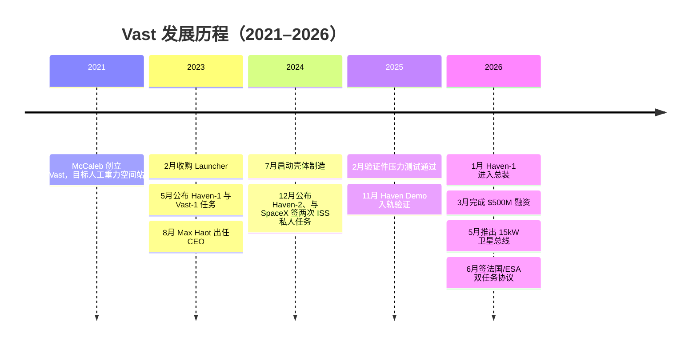
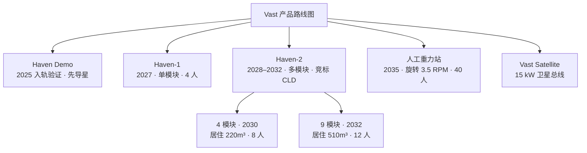
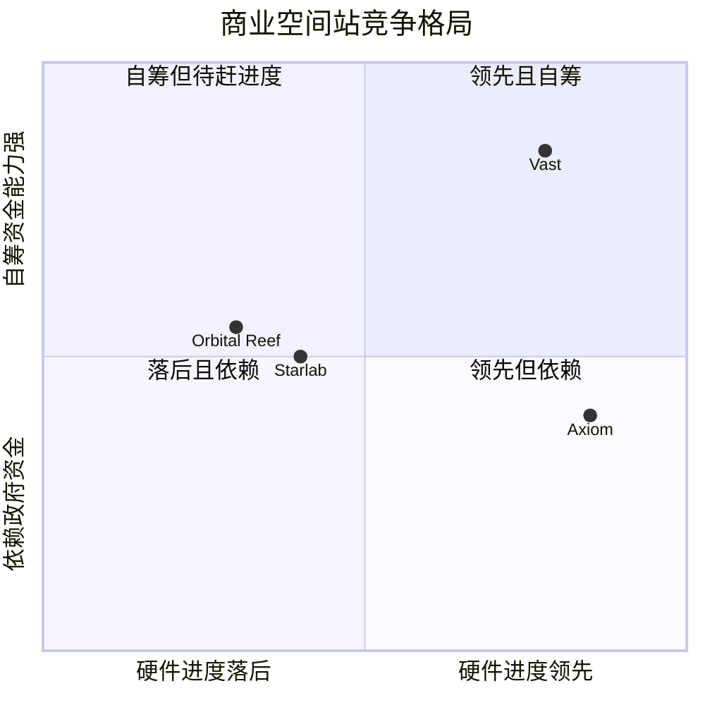
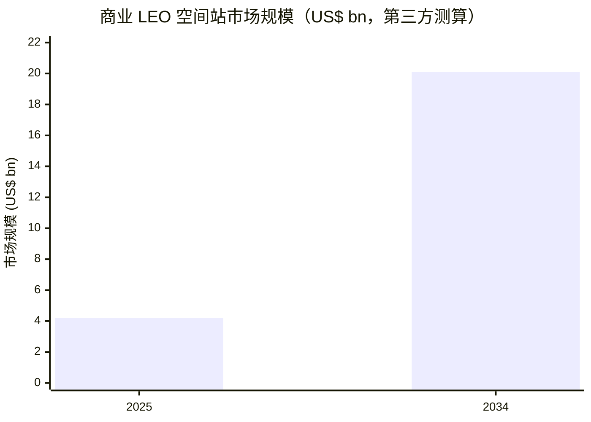

# Vast（韦斯特航天）公司研究报告
### 私人商业空间站赛道 · The Private Space Station Race

**报告日期（as of）：2026-06-14** ｜ 标的：Vast（私人公司，pre-revenue，未上市）｜ 总部：美国加州 Long Beach

---

> **近期里程碑提示（状态更新 / Status banner）**
> 过去 12 个月 Vast 完成了三件实质性大事：① 2025-11-02 先导星 **Haven Demo** 成功入轨、完成 49 项在轨验证后于 2026-02-04 受控离轨，使 Vast 成为「首家自研、制造、发射、运营并离轨航天器的商业空间站公司」（[Vast — Haven Demo 任务完成](https://www.vastspace.com/updates/haven-demo-mission-complete-successful-deorbit-validates-path-to-haven-1)）；② 2026-03-05 完成 **$500M** 融资（$300M 股权 Series A + $200M 债务），首次引入外部机构资本（[Vast — $500M 融资公告](https://www.vastspace.com/updates/vast-secures-500m-in-funding-to-accelerate-production-of-haven-space-stations)）；③ 2026-06-01 与**法国政府 / CNES / ESA** 签订两次载人任务协议，锁定首个主权客户（[Vast — 法国双任务协议](https://www.vastspace.com/updates/france-vast-two-mission-agreement-iss-haven-1)）。与此同时，旗舰 Haven-1 发射目标已从最初的 2025 年 8 月数次推迟至 **2027 年第一季度**（[Vast — Haven-1 进入总装阶段](https://www.vastspace.com/updates/vast-advances-haven-1-into-integration-phase)）。

---

## 投资摘要（Investment summary header）

| 项目 | 内容 |
|---|---|
| **评级 / 目标价（Rating / PT）** | **不适用 — 私人公司、尚无可交易证券**（pre-revenue） |
| **公司性质** | 私人控股美国航天公司；未上市；无公开财务报表 |
| **最近融资** | 2026-03-05：$500M（$300M Series A 股权 + $200M 债务），Balerion Space Ventures 领投 |
| **累计投入** | 创始人 Jed McCaleb 累计投入 **逾 $1B** 自有资本（此前为唯一出资人） |
| **公开估值** | 未披露（McCaleb 仍为最大股东） |
| **成立 / 总部 / 员工** | 2021 年成立；加州 Long Beach；**1,000+** 员工 |
| **创始人 / CEO** | Jed McCaleb（创始人、董事长、Tech Fellow）/ Max Haot（CEO，2023-08 起） |
| **核心产品** | Haven-1（2027，全球首座商业空间站）、Haven-2（ISS 继任者，竞标 NASA CLD）、Vast Satellite（15 kW 卫星平台） |

**本报告观点（house view，*分析师观点 / Analyst view*，下同）—— 四条主线：**

1. **「先飞硬件、再谈合同」的差异化打法已见成效。** 在 Axiom、Starlab、Orbital Reef 仍多停留在评审与设计阶段时，Vast 以 Haven Demo 真实入轨 + Haven-1 飞行件壳体通过验证压力测试，成为赛道上**唯一已有飞行硬件背书**的新进者（[SpaceScout — 2025 美国商业空间站盘点](https://www.spacescout.info/2025/06/where-are-americas-commercial-space-stations-in-2025/)）。
2. **NASA 2025-08 改用「资助型 Space Act Agreement（SAA）+ 阶段性载人演示」的新采购方式，恰好匹配 Vast 的快节奏、垂直整合模式**（[CSIS — NASA 改变商业空间站路线](https://www.csis.org/analysis/nasa-changes-course-commercial-space-stations)）。
3. **资金来源高度集中是双刃剑：** McCaleb 的加密财富让 Vast 得以不依赖政府输血快速推进，但也意味着公司命运与单一出资人、以及尚未到来的收入深度绑定（[Bloomberg，2025-03-20](https://www.bloomberg.com/news/features/2025-03-20/crypto-windfall-is-funding-vast-s-space-station-ambitions)）。
4. **对 SpaceX 的单点依赖是结构性风险：** 发射（Falcon 9）、载人（Crew Dragon）、通信（Starlink）三项关键环节全部外包给同一家、且本身也在自研空间站的供应商（[SpaceNews — Vast 与 SpaceX 私人宇航员任务协议](https://spacenews.com/vast-signs-agreement-with-spacex-for-private-astronaut-missions-to-the-iss/)）。

---

## 目录

1. 公司概览（含 1A 私募估值与融资、1B 基本面评分说明）
2. 公司历史
3. 管理团队
4. 产品与服务（最重要章节，含资金流向图）
5. 客户与商业化策略
6. 行业概览
7. 竞争格局
8. 市场机会（TAM）
9. 风险评估（含 9.5 关键争议与催化剂）
10. 投资视角（私募 / 战略框架）
11. 参考资料与 Data Used 清单

---

## 1. 公司概览

**一句话论点（BLUF）：** Vast 是一家由加密企业家 Jed McCaleb 以逾 $1B 自有资本驱动、总部位于加州 Long Beach 的私人航天公司，目标是接棒国际空间站（ISS）成为低地轨道（LEO，low-Earth orbit）的商业基础设施运营商；其差异化在于「自掏腰包、垂直整合、先飞硬件」，已凭 Haven Demo 入轨与 Haven-1 飞行件验证跑在新进竞争者前面，但仍是一家尚无收入、命运系于 NASA 商业 LEO 目的地（CLD，Commercial LEO Destinations）合同与单一出资人的高风险长周期标的（[Vast 公司主页](https://www.vastspace.com/)；[Wikipedia — Vast (company)](https://en.wikipedia.org/wiki/Vast_(company))）。

Vast 成立于 2021 年，由 McCaleb 创立，最初的对外使命表述是「研发全球首批人工重力（artificial-gravity）空间站」，让人类能长期在太空生活而不受微重力（microgravity）副作用影响（[Vast — 公司成立公告](https://www.vastspace.com/updates/vast-launches-with-mission-to-develop-the-worlds-first-artificial-gravity-space-stations)）。公司总部设在加州 Long Beach，并规划迁入一处新建的 **115,000 平方英尺（square-foot）** 总部兼制造设施（位于 Long Beach 的 Globemaster Corridor），员工规模已超过 **1,000 人**（[Wikipedia — Vast (company)](https://en.wikipedia.org/wiki/Vast_(company))）。这种「研发—制造—试验」一体化的垂直整合（vertical integration）布局，是 Vast 区别于以系统集成为主的部分竞争对手的关键特征。

公司的近期战略目标十分聚焦：CEO Max Haot 多次公开表示，「本十年我们的重心是赢得 NASA 商业 LEO 目的地（CLD）合同」，并在 Haven-1 验证能力后推出 NASA 认证版的 Haven-2 作为 ISS 继任者（[Vast — Haven-2 公告](https://www.vastspace.com/updates/vast-announces-haven-2-its-proposed-space-station-designed-to-succeed-the-international-space-station-iss)）。围绕这一目标，Vast 把整条价值链拆成可逐级验证的台阶——先以小型先导星 Haven Demo 验证核心系统，再以单模块 Haven-1 抢「全球首座商业空间站」头衔，最后以多模块 Haven-2 竞标 NASA 替代 ISS 的服务合同。

### 1A. 私募估值与融资（替代公开估值快照）

由于 Vast 为未上市私人公司，无可交易股票、无 TTM P/E、P/S 等公开市场倍数，本节以**融资历史与私募资本**替代常规估值快照。要点如下：

- **自筹起步：** 在 2026 年 3 月之前，Vast 完全由创始人 McCaleb 一人出资，累计向公司的空间站技术与设施投入**逾 $1B**（[Vast — $500M 融资公告](https://www.vastspace.com/updates/vast-secures-500m-in-funding-to-accelerate-production-of-haven-space-stations)）。这在新太空（NewSpace）赛道极为罕见——多数同行依赖政府合同或风险资本输血。
- **首轮外部融资：** 2026-03-05，Vast 宣布完成 **$500M** 融资，其中 **$300M** 为 Series A 股权、**$200M** 为债务，由 **Balerion Space Ventures** 领投，跟投方包括 **IQT、Qatar Investment Authority（QIA，卡塔尔主权基金）、Mitsui & Co.、MUFG、Nikon、Stellar Ventures、Space Capital、Earthrise Ventures**，McCaleb 本人亦参与（[Vast — $500M 融资公告](https://www.vastspace.com/updates/vast-secures-500m-in-funding-to-accelerate-production-of-haven-space-stations)；[SpaceNews — Vast 融资 $500M](https://spacenews.com/vast-raises-500-million-for-commercial-space-station-development/)）。资金用途为「扩建设施、扩充团队，并推进拟议的 ISS 继任者 Haven-2」。
- **估值未披露：** 本轮 post-money 估值未公开。作为同业参照，*分析师观点：* 私募一级市场对成熟度最高的 Axiom Space 给出过约 $2B 量级的估值预期，可作为「同赛道、不同阶段」的粗略锚，但不能直接套用于 Vast（[Wikipedia — Vast (company)](https://en.wikipedia.org/wiki/Vast_(company))）。

### 1B. 基本面评分（GF Score）—— 本报告标注「不适用」

常规 company-research 报告会给出 GuruFocus 风格的五维基本面评分（Financial Strength / Profitability / Growth / GF Value / Momentum）。**Vast 为 pre-revenue 私人公司，无经审计财务报表、无利润率、无投资回报率、亦无公开市场价格与动量数据，五个维度中至少四个无可计算的客观输入**，强行打分将违背本项目「每个指标都必须可溯源到一个真实数据」的硬规则。因此本报告**不给出 GF Score 数值**，仅定性说明：公司处于「重资本投入、零营收、技术里程碑驱动」的早期阶段，财务健康度完全取决于融资能力与 NASA 合同前景（依据见第 1A 与第 9 节）。该省略已记入文末验证日志。

---

## 2. 公司历史

Vast 的历史很短但密度极高——五年内从一个「人工重力空间站」的愿景，走到拥有飞行硬件、主权客户与机构资本的赛道领跑者之一。下图为关键节点时间线：

*图 1：Vast 发展时间线。* Source: [Vast Updates](https://www.vastspace.com/updates) ｜ [TechCrunch，2023-02-21](https://techcrunch.com/2023/02/21/vast-acquires-launcher-in-quest-to-build-artificial-gravity-space-stations/)

**2021—初创愿景。** McCaleb 在退出加密行业后于 2021 年创立 Vast，长期愿景是「让数十亿人在太空生活与繁荣」，技术路径上押注旋转产生人工重力的大型空间站（[Vast — 成立公告](https://www.vastspace.com/updates/vast-launches-with-mission-to-develop-the-worlds-first-artificial-gravity-space-stations)）。

**2023-02—收购 Launcher，团队三倍扩张。** 这是 Vast 的首笔收购，也是其历史转折点：Vast 收购了由 Max Haot 于 2017 年创立、总部位于加州 Hawthorne 的小型火箭公司 Launcher，将 Launcher 约 **80 名**员工并入 Vast 原有约 **40 人**的团队，并获得 Launcher 在研的 **Orbiter「太空拖船」（space tug）** 与 **E-2 液体火箭发动机**，以及其与 Velo3D、AMCM 等增材制造（additive manufacturing）公司合作的高性能发动机经验；Haot 出任总裁（President）（[TechCrunch，2023-02-21](https://techcrunch.com/2023/02/21/vast-acquires-launcher-in-quest-to-build-artificial-gravity-space-stations/)；[3DPrint，2023](https://3dprint.com/298162/a-big-move-for-space-3d-printing-vast-acquires-launcher/)）。这笔交易把 Vast 从一个「愿景型」初创直接补齐为有推进、增材制造与工程团队的实体。

**2023-05—公布 Haven-1 与 Vast-1 任务。** Vast 与 SpaceX 一同宣布将由 Falcon 9 发射 Haven-1，并由 Crew Dragon 执行首次载人任务 Vast-1，公开「全球首座商业空间站」的目标（[CNN，2023-05-10](https://www.cnn.com/2023/05/10/world/spacex-vast-private-space-station-launch-scn/index.html)）。

**2023-08—管理层重组。** 2023-08-16，Max Haot 出任 CEO，McCaleb 转任**创始人、董事长兼 Tech Fellow**，他在公告中称「随着运营加速与扩张，是时候让我转向更具战略性的角色、并授权领导团队主导日常运营」（[ExterraJSC — Max Haot 出任 Vast CEO](https://www.exterrajsc.com/p/max-haot-named-ceo-at-vast-space)）。

**2023-11 至 2025—工程化推进。** 2023-11 公司在并行评估后选定**铝（aluminum）**而非不锈钢作为主结构材料；2024-07 在 Long Beach 同时启动验证件与飞行件壳体制造；2025-02 验证件运抵 Mojave 后完成主结构验证压力测试（以干氮气分别加压 5 小时与 48 小时，泄漏率达到 NASA 载人航天器认证标准）——也正是在这次测试后，发射目标从原定 2025-08 推迟到「不早于 2026-05」（[Vast — 通过 Haven-1 关键测试里程碑](https://www.vastspace.com/updates/vast-passes-critical-haven-1-test-milestone)；[Space.com — Vast 调整 Haven-1 发射时间](https://www.space.com/space-exploration/private-spaceflight/vast-space-now-aims-for-2026-launch-of-haven-1-space-station-after-key-milestone-photos)）。

**2024-12—公布 Haven-2。** Vast 正式发布拟作为 ISS 继任者、面向 NASA CLD 的 Haven-2；同月与 SpaceX 再签协议，将执行最多两次飞往 ISS 的私人宇航员任务（PAM，private astronaut mission）（[Vast — Haven-2 公告](https://www.vastspace.com/updates/vast-announces-haven-2-its-proposed-space-station-designed-to-succeed-the-international-space-station-iss)；[SpaceNews — Vast 与 SpaceX PAM 协议](https://spacenews.com/vast-signs-agreement-with-spacex-for-private-astronaut-missions-to-the-iss/)）。

**2025-11 至 2026-06—硬件入轨、机构资本、主权客户。** 2025-11-02 先导星 Haven Demo 入轨；2026-01-20 Haven-1 进入总装阶段（飞行件主结构已在 2025 年底于 Mojave 完成全尺寸压力测试）；2026-01-31 验证件再通过 1.8 barD（26 psig）验证压力试验，公司称创下「从零铝材到通过验证压力结构仅 15 个月」的纪录；2026-03-05 完成 $500M 融资；2026-05-19 推出 15 kW 级卫星总线产品；2026-06-01 与法国签订两次任务协议（[Vast — Haven-1 进入总装](https://www.vastspace.com/updates/vast-advances-haven-1-into-integration-phase)；[Vast — 通过关键测试里程碑](https://www.vastspace.com/updates/vast-passes-critical-haven-1-test-milestone)）。

---

## 3. 管理团队

**创始人：Jed McCaleb（董事长、Tech Fellow，前 CEO）。** McCaleb 是美国程序员与连续创业者，以加密货币领域的多次开创性项目闻名：他在 2010 年创办了早期最大的比特币交易所之一 **Mt. Gox**（2011 年出售给 Mark Karpelès），随后联合创办支付网络 **Ripple** 并任 CTO（至 2013 年），离开后又联合创办专注跨境支付与金融普惠的区块链网络 **Stellar** 并任 CTO（[Wikipedia — Jed McCaleb](https://en.wikipedia.org/wiki/Jed_McCaleb)；[CryptoSlate — Jed McCaleb](https://cryptoslate.com/people/jed-mccaleb/)）。其财富主要来自早期 XRP 持仓与 Stellar，2025 年净资产估计约 **$2.9B**（[Social Life Magazine，2025](https://sociallifemagazine.com/technology/jed-mccaleb-net-worth-2025/)）。2021 年他创立 Vast 并以个人资本驱动，自陈对 Vast 投入约 $1B 量级，使其成为极少数「以加密财富自筹一座空间站」的案例（[Bloomberg，2025-03-20](https://www.bloomberg.com/news/features/2025-03-20/crypto-windfall-is-funding-vast-s-space-station-ambitions)）。2023-08 起他卸任 CEO、转任董事长兼 Tech Fellow，但作为最大股东与技术决策者仍深度参与。*分析师观点：* McCaleb 既是 Vast 最大的资产（耐心资本、长期愿景），也是其最大的单点风险（公司财务前景与一个人的意愿和加密资产价值挂钩）。

**CEO：Max Haot（2023-08 起）。** Haot 是航天、消费电子与互联网连续创业者。他于 2017 年创立小型火箭公司 **Launcher**（研发 E-2 发动机与 Orbiter 太空拖船，并率先大量采用增材制造工艺），并通过 2023 年 Vast 收购 Launcher 加入公司，先任总裁、后于 2023-08-16 升任 CEO（[ExterraJSC — Max Haot 出任 Vast CEO](https://www.exterrajsc.com/p/max-haot-named-ceo-at-vast-space)；[TechCrunch，2023-02-21](https://techcrunch.com/2023/02/21/vast-acquires-launcher-in-quest-to-build-artificial-gravity-space-stations/)）。Haot 在 Launcher 时期积累的「硬件快速迭代 + 增材制造 + 在轨运营」经验，正是 Vast 后来「先飞硬件」打法的工程底色。他在 2026 年公开表态中强调 Haven-1「不是一个概念，而是真实的、经过飞行验证的硬件」（[Vast — Haven-1 进入总装](https://www.vastspace.com/updates/vast-advances-haven-1-into-integration-phase)），并把「赢得 NASA CLD 合同」定为本十年的核心目标（[Vast — Haven-2 公告](https://www.vastspace.com/updates/vast-announces-haven-2-its-proposed-space-station-designed-to-succeed-the-international-space-station-iss)）。

---

## 4. 产品与服务

> 本章是全报告最重要的章节。Vast 的产品不是「一座空间站」，而是一条**逐级验证、互为台阶**的产品阶梯：用 Haven Demo 验证系统 → 用 Haven-1 抢「首座商业空间站」头衔 → 用 Haven-2 竞标 NASA 替代 ISS 的服务合同 → 用旋转人工重力站实现长期愿景；2026 年又横向衍生出 Vast Satellite 高功率卫星平台作为近端现金流。下图为产品路线图，随后逐一拆解。

*图 2：Vast 产品与任务路线图。* Source: [Vast — Roadmap](https://www.vastspace.com/roadmap)

### 4.1 Haven Demo —— 先导星（2025，已完成）

Haven Demo 是 Vast 为 Haven-1 铺路的在轨验证平台（in-orbit testbed），2025-11-02 搭乘 SpaceX 的 **Bandwagon-4** 拼车任务从卡纳维拉尔角发射入轨。在约三个月的任务中，它完成了 **49 项**测试目标，全程保持「功率为正（power-positive）」，并搭载了射频通信、制导导航与控制（GNC，guidance, navigation and control）硬件与算法、太阳能与电源系统，以及代表 Haven-1 拟用方案的推进系统；2026-02-04 受控离轨（[Vast — Haven Demo 任务完成](https://www.vastspace.com/updates/haven-demo-mission-complete-successful-deorbit-validates-path-to-haven-1)；[Space.com — SpaceX 发射 Haven Demo](https://www.space.com/space-exploration/launches-spacecraft/spacex-launches-private-space-station-pathfinder-haven-demo-17-other-satellites-to-orbit)）。**战略意义：** 这一任务使 Vast 成为「首家自研、制造、发射、运营并离轨航天器的商业空间站公司」，把电源、航电、地面系统、推进、GNC 等核心系统在真实太空环境中验证，直接为 Haven-1 的最终设计定型，也成为后来 Vast Satellite 卫星总线的「飞行血统（flight heritage）」背书。

### 4.2 Haven-1 —— 全球首座商业空间站（2027 目标）

Haven-1 是一座单模块（single-module）空间站，是 Vast 抢「全球首座商业空间站」头衔的旗舰产品。**官方技术规格（逐项引自 Vast 官网）：**

| 参数 | 数值 |
|---|---|
| 直径（diameter） | 4.4 m |
| 高度（height） | 10.1 m |
| 质量（mass） | 14,600 kg |
| 可居住容积（habitable volume） | 45 m³ |
| 增压容积（pressurized volume） | 80 m³ |
| 乘员（crew） | 4 人 |
| 任务时长 | 约两周（two-week missions） |
| 发电功率 | 13,200 W |
| 轨道 | 倾角 51.6°，高度 425 km |
| 发射载具 | SpaceX Falcon 9 |
| 载人运输 | SpaceX Crew Dragon |
| 对接 | 被动对接硬件（passive docking hardware） |
| 舷窗 | 1.1 m 穹顶舷窗（domed window） |
| 通信 | 经激光终端接入 Starlink |
| 目标发射 | 2027 |

数据来源：[Vast — Haven-1 产品页](https://www.vastspace.com/haven-1)。

**它在轨道上具体「做什么」：** Haven-1 本质是一个可供 4 名乘员停留约两周的增压居住舱——靠在轨自研的生命支持（life support）系统维持氧气补充（oxygen replenishment）、痕量污染物控制（trace contaminant control）与环境循环；靠 DHV Technology 的可展开太阳能翼发出 13.2 kW 电力；靠 Impulse Space 的 **Saiph** 推进器维持轨道与姿态；靠那扇 1.1 m 穹顶舷窗供乘员观景与对地观测；靠 Starlink 激光终端实现高带宽通信。乘员经 Crew Dragon 与被动对接硬件登站（[Vast — Haven-1 产品页](https://www.vastspace.com/haven-1)）。

**与同级产品的区分 & 战略意义：** 相较 Haven Demo（无人、纯系统验证），Haven-1 是首个真正载人的产品；相较后续的 Haven-2（多模块、面向 NASA 长期服务合同），Haven-1 的定位是「最小可行的商业空间站」——用最快的时间、最低的复杂度把人送上去停留两周，既抢头衔、又把全套载人系统在真实任务中跑通，为 Haven-2 的认证铺路。当前状态：飞行件主结构已于 2025 年底在 Mojave 完成全尺寸压力测试，2026-01-20 进入总装，下一步将于 2026 年夏在 NASA 的 Neil Armstrong 试验设施进行系统级环境测试（[Vast — Haven-1 进入总装](https://www.vastspace.com/updates/vast-advances-haven-1-into-integration-phase)）。

### 4.3 Haven-2 —— ISS 继任者，竞标 NASA CLD（2028–2032）

Haven-2 是 Vast 真正的「商业模型」所在——一座可扩展的多模块站，作为 ISS 退役后的微重力实验室竞标 NASA 的 CLD 服务合同。**官方规格与部署节奏（引自 Vast 官网与路线图）：**

- **首个 Haven-2 模块**比 Haven-1 长 5 m，可居住容积接近翻倍，沿用 Haven-1 已验证的全部系统；若 2026 年获选，首模块计划 **2028** 年在轨运营（[Vast — Haven-2 公告](https://www.vastspace.com/updates/vast-announces-haven-2-its-proposed-space-station-designed-to-succeed-the-international-space-station-iss)）。
- **4 模块构型（2030）：** 可居住 220 m³、增压 500 m³、乘员 8 人；
- **9 模块 + 核心舱构型（2032）：** 可居住 510 m³、增压 1,160 m³、乘员 12 人；核心舱直径 7 m，全站到 2032 年共 16 扇舷窗（含一扇 3.8 m 穹顶/cupola）（[Vast — Roadmap](https://www.vastspace.com/roadmap)）。

Haven-2 被设计为满足 NASA CLD 的「基础实验室能力（Basic Laboratory Capabilities）」，并强调与国际伙伴的兼容性（[Vast — Haven-2 公告](https://www.vastspace.com/updates/vast-announces-haven-2-its-proposed-space-station-designed-to-succeed-the-international-space-station-iss)）。**战略意义：** Haven-2 的「积木式扩展」正好契合 NASA 2025-08 新规对「4 人乘员、单次驻留一个月」的要求（详见第 6 节），这使 Vast 不必一步到位建成巨型站，而能边交付边扩容、边产生服务收入。

### 4.4 人工重力站 —— 长期愿景（2035 目标）

这是 Vast 的初心与终局：一座通过整体**端对端旋转（rotating end over end）**、转速 **3.5 RPM** 产生人工重力的大型站，规划可居住 950 m³、增压 2,160 m³、乘员 **40 人**（[Vast — Roadmap](https://www.vastspace.com/roadmap)）。更长期，公司设想一座 100 m 级、由 SpaceX **Starship** 发射的多模块旋转人工重力站。**中文释义 / Plain-language gloss：** 人工重力（artificial gravity）指通过旋转产生的离心力模拟地表重力，以缓解长期失重对人体（骨密度、肌肉、体液分布）的损害——这是把「太空旅馆」升级为「可长期定居」的关键技术跳跃。*分析师观点：* 这是远期、高不确定性的目标，依赖 Starship 成熟与前序产品先赚到钱；当前对投资判断的权重应低，更多是理解 Vast「为什么这么做」的方向感。

### 4.5 Vast Satellite —— 高功率卫星总线（2026 新增）

2026-05-19，Vast 宣布横向拓展到**无人轨道基础设施**：推出一款 **15 kW 级**卫星平台（satellite bus），复用其空间站与 Haven Demo 的在轨血统。**官方规格：** 两组可展开卷式太阳能阵提供 15 kW 功率；**逾 350 kg** 有效载荷能力；尺寸 2.2 m × 3.6 m；干重 700 kg；设计寿命 5 年；6–10 kW 总线热耗散；6–14.5 kW 轨道平均载荷功率；运行高度 350–1,200 km；至少 500 m/s 的 delta-V（速度增量）能力。目标市场为通信运营商、对地观测（Earth observation）、国防应用与**在轨数据中心（orbital data center）星座**；已有一家保密客户承诺采购 **4 颗**并可选购**至多 200 颗**（[New Space Economy — Vast 高功率卫星总线，2026-05-19](https://newspaceeconomy.ca/2026/05/19/vast-high-power-satellite-buses-extend-a-space-station-company-into-orbital-infrastructure/)）。**战略意义：** 空间站需要巨额资本、政府信心、发射通道、安全认证与微重力需求等多重前提、回报周期极长；卫星总线则销售周期更短、确定性更高，是 Vast 把站用技术变现为「近端现金流」的现实之举——其「在轨数据中心」用例也让 Vast 间接接入了 AI 算力需求外溢的叙事。

### 4.6 资金流向：钱从哪来、流向谁的口袋

作为 pre-revenue 公司，理解 Vast 最直观的方式不是看损益表（没有），而是「跟着钱走」——下图为 Vast 的资金流向价值链图（实线为直接付款，虚线为隐含在外购成品中的间接支出）：

<svg xmlns="http://www.w3.org/2000/svg" viewBox="0 0 1180 1172" width="1180" height="1172" role="img" aria-label="Vast 的钱从哪来、又流向谁的口袋" font-family="'Space Grotesk',system-ui,-apple-system,'Segoe UI',sans-serif">
<defs><linearGradient id="mfgold" gradientUnits="userSpaceOnUse" x1="0" y1="0" x2="1180" y2="0"><stop offset="0" stop-color="#f6dc97"/><stop offset="0.5" stop-color="#e9b658"/><stop offset="1" stop-color="#cf8f2c"/></linearGradient><radialGradient id="mfpool" cx="50%" cy="50%" r="50%"><stop offset="0" stop-color="#34d399" stop-opacity="0.16"/><stop offset="1" stop-color="#34d399" stop-opacity="0"/></radialGradient></defs>
<rect x="0" y="0" width="1180" height="1172" rx="16" fill="#0b0f1a"/>
<text x="42.00" y="56.00" text-anchor="start" font-family="'JetBrains Mono',ui-monospace,Menlo,monospace" font-size="11.5" font-weight="600" fill="#e9b658" letter-spacing="3">VAST 资金流向 · 2021–2026</text>
<text x="42.00" y="100.00" text-anchor="start" font-family="'Space Grotesk',system-ui,-apple-system,'Segoe UI',sans-serif" font-size="32" font-weight="700" fill="#e8ecf5">Vast 的钱从哪来、又流向谁的口袋</text>
<text x="42.00" y="142.00" text-anchor="start" font-family="'Space Grotesk',system-ui,-apple-system,'Segoe UI',sans-serif" font-size="15" font-weight="400" fill="#8a93a8">作为一家 pre-revenue（尚无收入）的私人公司，Vast 的资金主要来自 McCaleb 自有资本与 2026 年 Series A；这些钱流出后，绝大部分关键支出（发射 / 载人 / 通信）最终归集到唯一的外部枢纽 SpaceX。</text>
<ellipse cx="1031.00" cy="476.00" rx="190" ry="150" fill="url(#mfpool)"/>
<line x1="369.50" y1="188.00" x2="369.50" y2="760.00" stroke="#222a3a" stroke-dasharray="2 8"/>
<line x1="810.50" y1="188.00" x2="810.50" y2="760.00" stroke="#222a3a" stroke-dasharray="2 8"/>
<text x="42.00" y="172.00" text-anchor="start" font-family="'JetBrains Mono',ui-monospace,Menlo,monospace" font-size="12" font-weight="400" fill="#e9b658" letter-spacing="3">STAGE 01</text>
<text x="42.00" y="188.00" text-anchor="start" font-family="'JetBrains Mono',ui-monospace,Menlo,monospace" font-size="11.5" font-weight="400" fill="#646d82">资本从哪来</text>
<text x="483.00" y="172.00" text-anchor="start" font-family="'JetBrains Mono',ui-monospace,Menlo,monospace" font-size="12" font-weight="400" fill="#e9b658" letter-spacing="3">STAGE 02</text>
<text x="483.00" y="188.00" text-anchor="start" font-family="'JetBrains Mono',ui-monospace,Menlo,monospace" font-size="11.5" font-weight="400" fill="#646d82">Vast 花在哪</text>
<text x="924.00" y="172.00" text-anchor="start" font-family="'JetBrains Mono',ui-monospace,Menlo,monospace" font-size="12" font-weight="400" fill="#e9b658" letter-spacing="3">STAGE 03</text>
<text x="924.00" y="188.00" text-anchor="start" font-family="'JetBrains Mono',ui-monospace,Menlo,monospace" font-size="11.5" font-weight="400" fill="#646d82">钱最终归集到谁</text>
<path d="M 256.00 412.00 C 369.50 412.00, 369.50 469.00, 483.00 469.00" fill="none" stroke="url(#mfgold)" stroke-width="20.00" stroke-linecap="round" opacity="0.9"/>
<path d="M 256.00 398.00 C 369.50 398.00, 369.50 380.00, 483.00 380.00" fill="none" stroke="url(#mfgold)" stroke-width="8.00" stroke-linecap="round" opacity="0.9"/>
<path d="M 256.00 544.50 C 369.50 544.50, 369.50 486.00, 483.00 486.00" fill="none" stroke="url(#mfgold)" stroke-width="14.00" stroke-linecap="round" opacity="0.9"/>
<path d="M 256.00 534.50 C 369.50 534.50, 369.50 387.00, 483.00 387.00" fill="none" stroke="url(#mfgold)" stroke-width="6.00" stroke-linecap="round" opacity="0.9"/>
<path d="M 256.00 554.00 C 369.50 554.00, 369.50 569.00, 483.00 569.00" fill="none" stroke="url(#mfgold)" stroke-width="5.00" stroke-linecap="round" opacity="0.9"/>
<path d="M 697.00 383.00 C 810.50 383.00, 810.50 270.50, 924.00 270.50" fill="none" stroke="url(#mfgold)" stroke-width="24.00" stroke-linecap="round" opacity="0.9"/>
<path d="M 697.00 476.00 C 810.50 476.00, 810.50 411.00, 924.00 411.00" fill="none" stroke="url(#mfgold)" stroke-width="18.00" stroke-linecap="round" opacity="0.9"/>
<path d="M 697.00 487.50 C 810.50 487.50, 810.50 707.00, 924.00 707.00" fill="none" stroke="url(#mfgold)" stroke-width="5.00" stroke-linecap="round" opacity="0.9"/>
<path d="M 697.00 566.50 C 810.50 566.50, 810.50 512.50, 924.00 512.50" fill="none" stroke="url(#mfgold)" stroke-width="5.00" stroke-linecap="round" opacity="0.9"/>
<path d="M 697.00 571.50 C 810.50 571.50, 810.50 605.50, 924.00 605.50" fill="none" stroke="url(#mfgold)" stroke-width="5.00" stroke-linecap="round" opacity="0.9"/>
<path d="M 697.00 464.50 C 810.50 464.50, 810.50 285.00, 924.00 285.00" fill="none" stroke="url(#mfgold)" stroke-width="5.00" stroke-linecap="round" opacity="0.78" stroke-dasharray="0.1 11"/>
<text x="369.50" y="509.25" text-anchor="middle" font-family="'JetBrains Mono',ui-monospace,Menlo,monospace" font-size="11.5" font-weight="400" fill="#f4d58a" paint-order="stroke" stroke="#0b0f1a" stroke-width="3.2" stroke-linejoin="round">$500M</text>
<text x="810.50" y="320.75" text-anchor="middle" font-family="'JetBrains Mono',ui-monospace,Menlo,monospace" font-size="11.5" font-weight="400" fill="#f4d58a" paint-order="stroke" stroke="#0b0f1a" stroke-width="3.2" stroke-linejoin="round">Falcon 9 + Dragon</text>
<text x="810.50" y="368.75" text-anchor="middle" font-family="'JetBrains Mono',ui-monospace,Menlo,monospace" font-size="11.5" font-weight="400" fill="#f4d58a" paint-order="stroke" stroke="#0b0f1a" stroke-width="3.2" stroke-linejoin="round">Starlink</text>
<rect x="42.00" y="348.00" width="214" height="120.00" rx="12" fill="#15101a" stroke="#f2655f" stroke-opacity="0.5"/>
<rect x="42.00" y="348.00" width="3" height="120.00" rx="2" fill="#f2655f"/>
<text x="60.00" y="381.00" text-anchor="start" font-family="'Space Grotesk',system-ui,-apple-system,'Segoe UI',sans-serif" font-size="17" font-weight="700" fill="#ffffff">JED McCALEB</text>
<text x="60.00" y="402.00" text-anchor="start" font-family="'JetBrains Mono',ui-monospace,Menlo,monospace" font-size="11" font-weight="400" fill="#c98c87">创始人自有资本 累计 &gt;$1B</text>
<rect x="42.00" y="484.00" width="214" height="120.00" rx="12" fill="#0f1622" stroke="#7fa8f5" stroke-opacity="0.5"/>
<rect x="42.00" y="484.00" width="3" height="120.00" rx="2" fill="#7fa8f5"/>
<text x="60.00" y="517.00" text-anchor="start" font-family="'Space Grotesk',system-ui,-apple-system,'Segoe UI',sans-serif" font-size="17" font-weight="700" fill="#ffffff">SERIES A 投资人</text>
<text x="60.00" y="538.00" text-anchor="start" font-family="'JetBrains Mono',ui-monospace,Menlo,monospace" font-size="11" font-weight="400" fill="#8ca6d6">$300M 股权 + $200M 债务 (2026/3)</text>
<text x="60.00" y="555.00" text-anchor="start" font-family="'JetBrains Mono',ui-monospace,Menlo,monospace" font-size="11" font-weight="400" fill="#8ca6d6">Balerion 领投 · QIA · Mitsui · MUFG</text>
<rect x="483.00" y="344.50" width="214" height="77.00" rx="12" fill="#141a2a" stroke="#e9b658" stroke-opacity="0.5"/>
<rect x="483.00" y="344.50" width="3" height="77.00" rx="2" fill="#e9b658"/>
<text x="501.00" y="377.50" text-anchor="start" font-family="'Space Grotesk',system-ui,-apple-system,'Segoe UI',sans-serif" font-size="21" font-weight="700" fill="#ffffff">发射与载人运输</text>
<text x="501.00" y="398.50" text-anchor="start" font-family="'JetBrains Mono',ui-monospace,Menlo,monospace" font-size="11" font-weight="400" fill="#8a93a8">Falcon 9 发射 + Crew Dragon 送人</text>
<rect x="483.00" y="437.50" width="214" height="77.00" rx="12" fill="#15101a" stroke="#f2655f" stroke-opacity="0.5"/>
<rect x="483.00" y="437.50" width="3" height="77.00" rx="2" fill="#f2655f"/>
<text x="501.00" y="470.50" text-anchor="start" font-family="'Space Grotesk',system-ui,-apple-system,'Segoe UI',sans-serif" font-size="21" font-weight="700" fill="#ffffff">空间站自研制造</text>
<text x="501.00" y="491.50" text-anchor="start" font-family="'JetBrains Mono',ui-monospace,Menlo,monospace" font-size="11" font-weight="400" fill="#d49b96">Long Beach 自造铝制壳体</text>
<rect x="483.00" y="530.50" width="214" height="77.00" rx="12" fill="#141a2a" stroke="#d9a05b" stroke-opacity="0.5"/>
<rect x="483.00" y="530.50" width="3" height="77.00" rx="2" fill="#d9a05b"/>
<text x="501.00" y="563.50" text-anchor="start" font-family="'Space Grotesk',system-ui,-apple-system,'Segoe UI',sans-serif" font-size="21" font-weight="700" fill="#ffffff">分系统采购</text>
<text x="501.00" y="584.50" text-anchor="start" font-family="'JetBrains Mono',ui-monospace,Menlo,monospace" font-size="11" font-weight="400" fill="#bcae98">推进 · 太阳能 · 生命支持</text>
<rect x="924.00" y="198.00" width="214" height="150.00" rx="12" fill="#0f1622" stroke="#7fa8f5" stroke-opacity="0.5"/>
<rect x="924.00" y="198.00" width="3" height="150.00" rx="2" fill="#7fa8f5"/>
<text x="942.00" y="231.00" text-anchor="start" font-family="'Space Grotesk',system-ui,-apple-system,'Segoe UI',sans-serif" font-size="21" font-weight="700" fill="#ffffff">SpaceX</text>
<text x="942.00" y="252.00" text-anchor="start" font-family="'JetBrains Mono',ui-monospace,Menlo,monospace" font-size="11" font-weight="400" fill="#8ca6d6">Falcon 9 · Crew Dragon</text>
<text x="942.00" y="269.00" text-anchor="start" font-family="'JetBrains Mono',ui-monospace,Menlo,monospace" font-size="11" font-weight="400" fill="#8ca6d6">Starlink 激光通信</text>
<text x="942.00" y="286.00" text-anchor="start" font-family="'JetBrains Mono',ui-monospace,Menlo,monospace" font-size="11" font-weight="400" fill="#8ca6d6">→ 头号资金枢纽</text>
<rect x="924.00" y="364.00" width="214" height="94.00" rx="12" fill="#15101a" stroke="#f2655f" stroke-opacity="0.5"/>
<rect x="924.00" y="364.00" width="3" height="94.00" rx="2" fill="#f2655f"/>
<text x="942.00" y="397.00" text-anchor="start" font-family="'Space Grotesk',system-ui,-apple-system,'Segoe UI',sans-serif" font-size="14" font-weight="700" fill="#ffffff">Long Beach 团队 + 铝材</text>
<text x="942.00" y="418.00" text-anchor="start" font-family="'JetBrains Mono',ui-monospace,Menlo,monospace" font-size="11" font-weight="400" fill="#d49b96">1,000+ 员工</text>
<text x="942.00" y="435.00" text-anchor="start" font-family="'JetBrains Mono',ui-monospace,Menlo,monospace" font-size="11" font-weight="400" fill="#d49b96">115,000 sq ft 厂房</text>
<rect x="924.00" y="474.00" width="214" height="77.00" rx="12" fill="#141a2a" stroke="#d9a05b" stroke-opacity="0.5"/>
<rect x="924.00" y="474.00" width="3" height="77.00" rx="2" fill="#d9a05b"/>
<text x="942.00" y="507.00" text-anchor="start" font-family="'Space Grotesk',system-ui,-apple-system,'Segoe UI',sans-serif" font-size="17" font-weight="700" fill="#ffffff">Impulse Space</text>
<text x="942.00" y="528.00" text-anchor="start" font-family="'JetBrains Mono',ui-monospace,Menlo,monospace" font-size="11" font-weight="400" fill="#bcae98">Saiph 推进器</text>
<rect x="924.00" y="567.00" width="214" height="77.00" rx="12" fill="#141a2a" stroke="#d9a05b" stroke-opacity="0.5"/>
<rect x="924.00" y="567.00" width="3" height="77.00" rx="2" fill="#d9a05b"/>
<text x="942.00" y="600.00" text-anchor="start" font-family="'Space Grotesk',system-ui,-apple-system,'Segoe UI',sans-serif" font-size="17" font-weight="700" fill="#ffffff">DHV Technology</text>
<text x="942.00" y="621.00" text-anchor="start" font-family="'JetBrains Mono',ui-monospace,Menlo,monospace" font-size="11" font-weight="400" fill="#bcae98">可展开太阳能翼 (西班牙)</text>
<rect x="924.00" y="660.00" width="214" height="94.00" rx="12" fill="#141a2a" stroke="#e9b658" stroke-opacity="0.5"/>
<rect x="924.00" y="660.00" width="3" height="94.00" rx="2" fill="#e9b658"/>
<text x="942.00" y="693.00" text-anchor="start" font-family="'Space Grotesk',system-ui,-apple-system,'Segoe UI',sans-serif" font-size="17" font-weight="700" fill="#ffffff">NASA 试验设施</text>
<text x="942.00" y="714.00" text-anchor="start" font-family="'JetBrains Mono',ui-monospace,Menlo,monospace" font-size="11" font-weight="400" fill="#8a93a8">Marshall / Armstrong</text>
<text x="942.00" y="731.00" text-anchor="start" font-family="'JetBrains Mono',ui-monospace,Menlo,monospace" font-size="11" font-weight="400" fill="#8a93a8">偿付式 SAA 测试</text>
<rect x="42.00" y="780.00" width="26" height="4" rx="2" fill="#e9b658"/>
<text x="78.00" y="784.00" text-anchor="start" font-family="'JetBrains Mono',ui-monospace,Menlo,monospace" font-size="11.5" font-weight="400" fill="#8a93a8">money paid directly</text>
<circle cx="242.80" cy="782.00" r="2" fill="#e9b658"/>
<circle cx="249.80" cy="782.00" r="2" fill="#e9b658"/>
<circle cx="256.80" cy="782.00" r="2" fill="#e9b658"/>
<circle cx="263.80" cy="782.00" r="2" fill="#e9b658"/>
<text x="276.80" y="784.00" text-anchor="start" font-family="'JetBrains Mono',ui-monospace,Menlo,monospace" font-size="11.5" font-weight="400" fill="#8a93a8">money embedded in a finished chip</text>
<text x="538.40" y="784.00" text-anchor="start" font-family="'JetBrains Mono',ui-monospace,Menlo,monospace" font-size="11.5" font-weight="400" fill="#8a93a8">thickness ≈ rough scale</text>
<rect x="728.00" y="775.00" width="11" height="11" rx="3" fill="#e9b658"/>
<text x="747.00" y="784.00" text-anchor="start" font-family="'JetBrains Mono',ui-monospace,Menlo,monospace" font-size="11.5" font-weight="400" fill="#8a93a8">supplier</text>
<rect x="828.60" y="775.00" width="11" height="11" rx="3" fill="#f2655f"/>
<text x="847.60" y="784.00" text-anchor="start" font-family="'JetBrains Mono',ui-monospace,Menlo,monospace" font-size="11.5" font-weight="400" fill="#8a93a8">in-house silicon</text>
<rect x="986.80" y="775.00" width="11" height="11" rx="3" fill="#d9a05b"/>
<text x="1005.80" y="784.00" text-anchor="start" font-family="'JetBrains Mono',ui-monospace,Menlo,monospace" font-size="11.5" font-weight="400" fill="#8a93a8">power / analog</text>
<rect x="42.00" y="795.00" width="11" height="11" rx="3" fill="#7fa8f5"/>
<text x="61.00" y="804.00" text-anchor="start" font-family="'JetBrains Mono',ui-monospace,Menlo,monospace" font-size="11.5" font-weight="400" fill="#8a93a8">buyer</text>
<line x1="42" y1="820.00" x2="1138" y2="820.00" stroke="#222a3a"/>
<text x="42.00" y="836.00" text-anchor="start" font-family="'JetBrains Mono',ui-monospace,Menlo,monospace" font-size="12" font-weight="500" fill="#8a93a8" letter-spacing="3">FOLLOW THE MONEY — 资金流向五条主线</text>
<rect x="42.00" y="856.00" width="356.00" height="132.00" rx="13" fill="#0e1320" stroke="#f2655f" stroke-opacity="0.28"/>
<rect x="42.00" y="856.00" width="3" height="132.00" rx="2" fill="#f2655f"/>
<text x="58.00" y="880.00" text-anchor="start" font-family="'JetBrains Mono',ui-monospace,Menlo,monospace" font-size="10" font-weight="600" fill="#f2655f" letter-spacing="1">资本来源 · 自有+股权</text>
<text x="58.00" y="898.00" text-anchor="start" font-family="'Space Grotesk',system-ui,-apple-system,'Segoe UI',sans-serif" font-size="15.5" font-weight="700" fill="#ffffff">McCaleb + Series A</text>
<text x="58.00" y="922.00" font-family="'Space Grotesk',system-ui,-apple-system,'Segoe UI',sans-serif" font-size="12" xml:space="preserve"><tspan fill="#9aa3b8" font-weight="400">创始人</tspan><tspan fill="#9aa3b8" font-weight="400"> McCaleb</tspan><tspan fill="#9aa3b8" font-weight="400"> 累计投入</tspan><tspan fill="#f4d58a" font-weight="700"> 逾</tspan><tspan fill="#f4d58a" font-weight="700"> $1B</tspan><tspan fill="#9aa3b8" font-weight="400"> 自有资本；2026</tspan><tspan fill="#9aa3b8" font-weight="400"> 年</tspan><tspan fill="#9aa3b8" font-weight="400"> 3</tspan><tspan fill="#9aa3b8" font-weight="400"> 月再融</tspan><tspan fill="#f4d58a" font-weight="700"> $500M</tspan><tspan fill="#9aa3b8" font-weight="400"> （</tspan></text>
<text x="58.00" y="938.00" font-family="'Space Grotesk',system-ui,-apple-system,'Segoe UI',sans-serif" font-size="12" xml:space="preserve"><tspan fill="#f4d58a" font-weight="700">$300M</tspan><tspan fill="#9aa3b8" font-weight="400"> 股权</tspan><tspan fill="#9aa3b8" font-weight="400"> +</tspan><tspan fill="#f4d58a" font-weight="700"> $200M</tspan><tspan fill="#9aa3b8" font-weight="400"> 债务），由</tspan><tspan fill="#f4d58a" font-weight="700"> Balerion</tspan><tspan fill="#f4d58a" font-weight="700"> Space</tspan><tspan fill="#f4d58a" font-weight="700"> Ventures</tspan><tspan fill="#9aa3b8" font-weight="400"> 领投，</tspan></text>
<text x="58.00" y="954.00" font-family="'Space Grotesk',system-ui,-apple-system,'Segoe UI',sans-serif" font-size="12" xml:space="preserve"><tspan fill="#f4d58a" font-weight="700">QIA</tspan><tspan fill="#f4d58a" font-weight="700"> /</tspan><tspan fill="#f4d58a" font-weight="700"> Mitsui</tspan><tspan fill="#f4d58a" font-weight="700"> /</tspan><tspan fill="#f4d58a" font-weight="700"> MUFG</tspan><tspan fill="#f4d58a" font-weight="700"> /</tspan><tspan fill="#f4d58a" font-weight="700"> Nikon</tspan><tspan fill="#f4d58a" font-weight="700"> /</tspan><tspan fill="#f4d58a" font-weight="700"> IQT</tspan><tspan fill="#9aa3b8" font-weight="400"> 跟投。</tspan></text>
<rect x="412.00" y="856.00" width="356.00" height="132.00" rx="13" fill="#0e1320" stroke="#7fa8f5" stroke-opacity="0.28"/>
<rect x="412.00" y="856.00" width="3" height="132.00" rx="2" fill="#7fa8f5"/>
<text x="428.00" y="880.00" text-anchor="start" font-family="'JetBrains Mono',ui-monospace,Menlo,monospace" font-size="10" font-weight="600" fill="#7fa8f5" letter-spacing="1">资金归集 · 头号枢纽</text>
<text x="428.00" y="898.00" text-anchor="start" font-family="'Space Grotesk',system-ui,-apple-system,'Segoe UI',sans-serif" font-size="15.5" font-weight="700" fill="#ffffff">SpaceX 一家通吃</text>
<text x="428.00" y="922.00" font-family="'Space Grotesk',system-ui,-apple-system,'Segoe UI',sans-serif" font-size="12" xml:space="preserve"><tspan fill="#9aa3b8" font-weight="400">Haven-1</tspan><tspan fill="#9aa3b8" font-weight="400"> 由</tspan><tspan fill="#f4d58a" font-weight="700"> Falcon</tspan><tspan fill="#f4d58a" font-weight="700"> 9</tspan><tspan fill="#9aa3b8" font-weight="400"> 发射、</tspan><tspan fill="#f4d58a" font-weight="700"> Crew</tspan><tspan fill="#f4d58a" font-weight="700"> Dragon</tspan><tspan fill="#9aa3b8" font-weight="400"> 送人、</tspan><tspan fill="#f4d58a" font-weight="700"> Starlink</tspan></text>
<text x="428.00" y="938.00" font-family="'Space Grotesk',system-ui,-apple-system,'Segoe UI',sans-serif" font-size="12" xml:space="preserve"><tspan fill="#9aa3b8" font-weight="400">提供通信——发射</tspan><tspan fill="#9aa3b8" font-weight="400"> /</tspan><tspan fill="#9aa3b8" font-weight="400"> 载人</tspan><tspan fill="#9aa3b8" font-weight="400"> /</tspan><tspan fill="#9aa3b8" font-weight="400"> 通信三项关键支出全部流向</tspan><tspan fill="#f4d58a" font-weight="700"> SpaceX</tspan><tspan fill="#9aa3b8" font-weight="400"> ，是</tspan><tspan fill="#9aa3b8" font-weight="400"> Vast</tspan></text>
<text x="428.00" y="954.00" font-family="'Space Grotesk',system-ui,-apple-system,'Segoe UI',sans-serif" font-size="12" xml:space="preserve"><tspan fill="#9aa3b8" font-weight="400">最大的单一外部依赖。</tspan></text>
<rect x="782.00" y="856.00" width="356.00" height="132.00" rx="13" fill="#0e1320" stroke="#f2655f" stroke-opacity="0.28"/>
<rect x="782.00" y="856.00" width="3" height="132.00" rx="2" fill="#f2655f"/>
<text x="798.00" y="880.00" text-anchor="start" font-family="'JetBrains Mono',ui-monospace,Menlo,monospace" font-size="10" font-weight="600" fill="#f2655f" letter-spacing="1">垂直整合 · 自研</text>
<text x="798.00" y="898.00" text-anchor="start" font-family="'Space Grotesk',system-ui,-apple-system,'Segoe UI',sans-serif" font-size="15.5" font-weight="700" fill="#ffffff">Long Beach 自造壳体</text>
<text x="798.00" y="922.00" font-family="'Space Grotesk',system-ui,-apple-system,'Segoe UI',sans-serif" font-size="12" xml:space="preserve"><tspan fill="#9aa3b8" font-weight="400">壳体在</tspan><tspan fill="#f4d58a" font-weight="700"> Long</tspan><tspan fill="#f4d58a" font-weight="700"> Beach</tspan><tspan fill="#f4d58a" font-weight="700"> 115,000</tspan><tspan fill="#f4d58a" font-weight="700"> sq</tspan><tspan fill="#f4d58a" font-weight="700"> ft</tspan><tspan fill="#9aa3b8" font-weight="400"> 厂房自研，</tspan><tspan fill="#f4d58a" font-weight="700"> 15</tspan><tspan fill="#f4d58a" font-weight="700"> 个月</tspan></text>
<text x="798.00" y="938.00" font-family="'Space Grotesk',system-ui,-apple-system,'Segoe UI',sans-serif" font-size="12" xml:space="preserve"><tspan fill="#9aa3b8" font-weight="400">从零铝材到通过验证压力测试；团队已超</tspan><tspan fill="#f4d58a" font-weight="700"> 1,000</tspan><tspan fill="#9aa3b8" font-weight="400"> 人。</tspan></text>
<rect x="42.00" y="1002.00" width="356.00" height="116.00" rx="13" fill="#0e1320" stroke="#d9a05b" stroke-opacity="0.28"/>
<rect x="42.00" y="1002.00" width="3" height="116.00" rx="2" fill="#d9a05b"/>
<text x="58.00" y="1026.00" text-anchor="start" font-family="'JetBrains Mono',ui-monospace,Menlo,monospace" font-size="10" font-weight="600" fill="#d9a05b" letter-spacing="1">分系统 · 外采</text>
<text x="58.00" y="1044.00" text-anchor="start" font-family="'Space Grotesk',system-ui,-apple-system,'Segoe UI',sans-serif" font-size="15.5" font-weight="700" fill="#ffffff">推进与太阳能</text>
<text x="58.00" y="1068.00" font-family="'Space Grotesk',system-ui,-apple-system,'Segoe UI',sans-serif" font-size="12" xml:space="preserve"><tspan fill="#f4d58a" font-weight="700">Impulse</tspan><tspan fill="#f4d58a" font-weight="700"> Space</tspan><tspan fill="#9aa3b8" font-weight="400"> 供应</tspan><tspan fill="#f4d58a" font-weight="700"> Saiph</tspan><tspan fill="#9aa3b8" font-weight="400"> 推进器；西班牙</tspan><tspan fill="#f4d58a" font-weight="700"> DHV</tspan><tspan fill="#f4d58a" font-weight="700"> Technology</tspan></text>
<text x="58.00" y="1084.00" font-family="'Space Grotesk',system-ui,-apple-system,'Segoe UI',sans-serif" font-size="12" xml:space="preserve"><tspan fill="#9aa3b8" font-weight="400">供应可展开太阳能翼；其余生命支持等系统多为自研。</tspan></text>
<rect x="412.00" y="1002.00" width="356.00" height="116.00" rx="13" fill="#0e1320" stroke="#e9b658" stroke-opacity="0.28"/>
<rect x="412.00" y="1002.00" width="3" height="116.00" rx="2" fill="#e9b658"/>
<text x="428.00" y="1026.00" text-anchor="start" font-family="'JetBrains Mono',ui-monospace,Menlo,monospace" font-size="10" font-weight="600" fill="#e9b658" letter-spacing="1">未来收入 · 主权为主</text>
<text x="428.00" y="1044.00" text-anchor="start" font-family="'Space Grotesk',system-ui,-apple-system,'Segoe UI',sans-serif" font-size="15.5" font-weight="700" fill="#ffffff">谁来买单</text>
<text x="428.00" y="1068.00" font-family="'Space Grotesk',system-ui,-apple-system,'Segoe UI',sans-serif" font-size="12" xml:space="preserve"><tspan fill="#9aa3b8" font-weight="400">Vast</tspan><tspan fill="#9aa3b8" font-weight="400"> 预计</tspan><tspan fill="#f4d58a" font-weight="700"> 85%</tspan><tspan fill="#9aa3b8" font-weight="400"> 载人收入来自主权机构、</tspan><tspan fill="#f4d58a" font-weight="700"> 15%</tspan><tspan fill="#9aa3b8" font-weight="400"> 来自私人；已锁定</tspan><tspan fill="#f4d58a" font-weight="700"> 法国</tspan><tspan fill="#f4d58a" font-weight="700"> /</tspan><tspan fill="#f4d58a" font-weight="700"> ESA</tspan></text>
<text x="428.00" y="1084.00" font-family="'Space Grotesk',system-ui,-apple-system,'Segoe UI',sans-serif" font-size="12" xml:space="preserve"><tspan fill="#9aa3b8" font-weight="400">两次任务，并持有</tspan><tspan fill="#9aa3b8" font-weight="400"> NASA</tspan><tspan fill="#f4d58a" font-weight="700"> CLD</tspan><tspan fill="#9aa3b8" font-weight="400"> 路径上的无偿与偿付式</tspan><tspan fill="#f4d58a" font-weight="700"> SAA</tspan><tspan fill="#9aa3b8" font-weight="400"> 。</tspan></text>
<text x="590.00" y="1154.00" text-anchor="middle" font-family="'JetBrains Mono',ui-monospace,Menlo,monospace" font-size="10.5" font-weight="400" fill="#646d82">Source: Vast IR (vastspace.com — Haven-1 / Roadmap / 2026 Funding / Satellite) · SpaceNews · Space.com · Long Beach Business Journal, 2023–2026</text>
</svg>

*图 3：Vast「资金流向」价值链图（非守恒桑基图，缎带粗细为相对量级）。* Source: [Vast — $500M 融资](https://www.vastspace.com/updates/vast-secures-500m-in-funding-to-accelerate-production-of-haven-space-stations) ｜ [Vast — Haven-1](https://www.vastspace.com/haven-1) ｜ [Long Beach Business Journal](https://lbbusinessjournal.com/aerospace/vast-space-triples-workforce-through-acquisition-to-help-develop-artificial-gravity-space-station/)

**Follow the money（资金归集到谁）：** 资本端，McCaleb 累计投入逾 $1B 自有资本，2026 年 3 月再以 $500M（$300M 股权 + $200M 债务，Balerion 领投）引入机构资金（[Vast — $500M 融资](https://www.vastspace.com/updates/vast-secures-500m-in-funding-to-accelerate-production-of-haven-space-stations)）。支出端最关键的发现是：**发射（Falcon 9）、载人（Crew Dragon）、通信（Starlink）三项关键支出全部流向同一家 SpaceX**，使 SpaceX 成为 Vast 资金归集的头号外部枢纽，也是其最大的单一供应商依赖（[SpaceNews — Vast 与 SpaceX PAM 协议](https://spacenews.com/vast-signs-agreement-with-spacex-for-private-astronaut-missions-to-the-iss/)）。其余支出中，壳体由 Long Beach 自研团队（1,000+ 人、115,000 sq ft 厂房）消化，推进器与太阳能翼分别外采自 Impulse Space（Saiph）与西班牙 DHV Technology，部分试验在 NASA 的 Marshall / Armstrong 设施以偿付式 SAA 完成（[Vast — Haven-1 产品页](https://www.vastspace.com/haven-1)；[SpaceNews — 在 NASA 设施测试 Haven-1](https://spacenews.com/vast-signs-agreement-to-test-haven-1-at-nasa-facility/)）。

---

## 5. 客户与商业化策略

Vast 尚无经常性收入，但其商业化策略（以及已签约的早期客户）已相当清晰，可拆为四类收入来源（[Phys.org — Vast 任务开启商业接棒 ISS 之争，2026-06](https://phys.org/news/2026-06-vast-astronaut-mission-commercial-iss.html)）：

1. **载人任务包（crewed mission campaigns）——主力。** Vast 可把「载具 + 站上时间」整包卖给一个国家、科研联盟或私人团体，捆绑训练、任务运营与通信；由于 Falcon 9 + Dragon + Haven-1 可由更少的供应商串成一个集成产品，Vast 得以打包销售。公司预计**约 85% 的载人收入来自主权机构（state agencies），约 15% 来自私人客户**（[Phys.org，2026-06](https://phys.org/news/2026-06-vast-astronaut-mission-commercial-iss.html)）。
2. **实验载荷（lab payloads）。** 面向高校、初创与企业 R&D，提供标准化机架（100–200 W、数据、Starlink）加工程与集成服务。
3. **政府服务（government services）。** 包括 NASA CLD 路径、ISS 国家实验室（ISS National Lab）的利用，以及与 ESA 的合作。
4. **卫星总线（新增）。** 见 4.5 节，已有保密客户承诺 4 颗 + 期权 200 颗。

**已锁定的标志性客户——法国（主权客户首单）。** 2026-06-01，在巴黎「选择法国（Choose France）」峰会上，法国政府（联合 CNES 与 ESA）与 Vast 签订两次载人任务协议：其一是第六次飞往 ISS 的私人宇航员任务，由 ESA 宇航员 **Thomas Pesquet** 任指令长；其二是 Haven-1 的首次载人测试飞行，由 ESA 后备宇航员 **Arnaud Prost** 任飞行测试工程师；两次任务均计划在 2027 年、各约两周，由 SpaceX Dragon/Falcon 9 执行（须经 ISS 多边乘员操作委员会 MCOP 批准）（[Vast — 法国双任务协议](https://www.vastspace.com/updates/france-vast-two-mission-agreement-iss-haven-1)）。CEO Max Haot 称「我们很荣幸法国选择 Vast 执行这些历史性任务」。

**首航 Vast-1 的商业模型。** Vast 在首航 Haven-1 任务上出售最多 4 个乘员席位，目标在 **2027 年夏**执行——预计搭载约 3 个付费的主权或私人席位，外加一名专业指令长。公司顾问、前 NASA 宇航员 **Andrew Feustel** 称 Vast 可以「低于 $100M」的成本把一名宇航员送入太空（[Phys.org，2026-06](https://phys.org/news/2026-06-vast-astronaut-mission-commercial-iss.html)）。**长期变现愿景**则寄望于在轨药物（drug）与半导体（semiconductor）开发的商业收入来覆盖空间站运营成本——这是整个商业 LEO 赛道共同的「圣杯」，但迄今尚未被任何人大规模证明。

---

## 6. 行业概览

**行业定义与背景。** Vast 处于「商业低地轨道目的地（Commercial LEO Destinations）」这一新兴行业——即 ISS 退役后，由私营公司拥有、建造并运营的载人空间站，为 NASA、其他国家航天机构、科研与商业客户提供微重力研究、载人驻留与在轨制造平台。该行业的「发令枪」是 NASA 计划在 **2030 年前后**退役并离轨 ISS，由此创造出对替代平台的刚性需求（[NASA — Vast Haven-1 进展](https://www.nasa.gov/humans-in-space/commercial-space/leo-economy/nasa-helps-with-progress-on-vasts-haven-1-commercial-space-station/)）。

**NASA CLD 项目结构（决定赛道规则的关键）。** CLD 是 NASA 的公私合营计划：NASA 出资并提供技术支持，私营公司设计、建造与运营空间站。关键的政策演变发生在 2025 年：

- **预算：** 2025-05-30 发布的 FY2026 总统预算请求（PBR）为商业空间站列支 **$272.3M（FY2026）**，并在未来 5 年合计约 **$2.1B**（[New Space Economy — NASA CLD 现状，2025-09-08](https://newspaceeconomy.ca/2025/09/08/nasa-commercial-low-earth-orbit-destinations-program-status-as-of-september-8-2025/)）。
- **采购方式大改（2025-08-04 指令）：** NASA 代理局长 Sean Duffy 的一份备忘录将 CLD 第二阶段的采购方式由「固定价格合同（firm fixed-price contract）」改为**多份资助型 Space Act Agreement（SAA）**；同时把原先「持续载人驻留」的目标，改为要求各竞争者的空间站能**容纳 4 人乘员、单次驻留一个月**；NASA 预期商业空间站在 **2028 年**开始运营，与 ISS 形成约两年的重叠期以完成测试与知识转移（[CSIS — NASA 改变商业空间站路线](https://www.csis.org/analysis/nasa-changes-course-commercial-space-stations)）。
- **第二阶段时间表：** 对所有公司开放（不限于第一阶段获资助者），预计在 **2026 年中**做出至少两家的授标（[New Space Economy，2025-09-08](https://newspaceeconomy.ca/2025/09/08/nasa-commercial-low-earth-orbit-destinations-program-status-as-of-september-8-2025/)）。

*分析师观点：* 这次「SAA + 阶段性载人演示」的转向对 Vast 高度有利——资助型 SAA 奖励的是「快速演示与部署」，而非冗长的固定价格认证流程，这正是 Vast 垂直整合、快节奏、已有飞行硬件的强项；而「4 人一个月」的最低门槛也恰好匹配 Haven-2 的积木式扩展设计。

**Vast 在 NASA 体系中的位置。** Vast **并未**获得 CLD 第一阶段的资助合同，但持有一份通过「第二次商业太空能力合作（CCSC-2，Collaborations for Commercial Space Capabilities 2）」获得的**无偿 SAA**（与 NASA 合作微重力与人工重力站所需技术），并以**偿付式 SAA** 在 NASA Marshall 中心完成了痕量污染物控制系统测试，未来还将在 Armstrong 试验设施进行环境测试（[SpaceNews — 在 NASA 设施测试 Haven-1](https://spacenews.com/vast-signs-agreement-to-test-haven-1-at-nasa-facility/)；[NASA — Vast Haven-1 进展](https://www.nasa.gov/humans-in-space/commercial-space/leo-economy/nasa-helps-with-progress-on-vasts-haven-1-commercial-space-station/)）。

---

## 7. 竞争格局

商业空间站赛道目前是四强格局：**Vast、Axiom Space、Starlab（Voyager + Airbus 等合资）、Orbital Reef（Blue Origin + Sierra Space）**。NASA 预计在 CLD 第二阶段至少授标两家（[New Space Economy，2025-09-08](https://newspaceeconomy.ca/2025/09/08/nasa-commercial-low-earth-orbit-destinations-program-status-as-of-september-8-2025/)）。

*图 4：竞争定位（横轴为飞行硬件成熟度，纵轴为自筹资金能力；*分析师观点*，依据各家公开进度）。* Source: [SpaceScout — 2025 盘点](https://www.spacescout.info/2025/06/where-are-americas-commercial-space-stations-in-2025/)

**Axiom Space（Axiom Station）——最成熟的对手。** Axiom 是 CLD 伙伴中唯一在为成熟目的地建造飞行硬件的公司，进度远超 Starlab 与 Orbital Reef；其原计划是先把舱段附着到 ISS、再在 ISS 退役前分离为自由飞行站（free-flyer）。但近期 Axiom Station 的方案经历了显著调整，反映其开发中的张力（[SpaceScout — 2025 盘点](https://www.spacescout.info/2025/06/where-are-americas-commercial-space-stations-in-2025/)）。*分析师观点：* Axiom 在「成熟度」上领先，但在「独立融资」上不如自筹的 Vast，是 Vast 最直接的竞争对手。

**Starlab（Voyager Space + Airbus 等合资）。** Starlab 走「单一大模块」路线，计划由 SpaceX **Starship** 于 **2029** 年发射；截至 2025-03 已获批结构测试件方案、计划 2025 年晚些时候开始制造，关键设计评审（CDR）可能在 2026 年初完成（[Wikipedia — Starlab](https://en.wikipedia.org/wiki/Starlab_(space_station))）。其特点是绑定 Airbus 等大型工业伙伴与国际化股东结构，但发射时点偏晚。

**Orbital Reef（Blue Origin + Sierra Space）——进度落后。** Orbital Reef 定位商业活动与太空旅游，Blue Origin 与 Sierra Space 计划 2027 年发射首批模块，但鉴于其仍处设计阶段，这一时点显得乐观；2025-04 NASA 宣布其完成了「人在环路（human-in-the-loop）」测试里程碑（用全尺寸模型做「日常生活演练」），相较竞争对手仍落后（[Space.com — Orbital Reef 系统定义评审](https://www.space.com/blue-origin-orbital-reef-system-definition-review)；[Wikipedia — Orbital Reef](https://en.wikipedia.org/wiki/Orbital_Reef)）。

**Vast 的相对优势与脆弱点。** *分析师观点：* Vast 的护城河是「速度 + 自筹 + 已有飞行硬件」——它是唯一已把航天器飞上天并运营的新进者，且不必等政府资金即可推进。脆弱点是：相较 Axiom，Vast 的载人系统集成经验更浅；相较绑定 Airbus/Lockheed/Boeing 的对手，Vast 缺少大型工业伙伴的资产负债表背书，命运更系于 McCaleb 的钱包与 NASA 的一纸合同。

---

## 8. 市场机会（TAM）

商业 LEO 经济横跨多个相互关联的子市场，第三方测算口径不一，本节列出可溯源的几项（均为外部市场研究机构口径，*非本报告自建模型*）：

*图 5：商业 LEO 空间站市场规模（仅取可溯源的起止两点）。* Source: [MarketIntelo — 商业 LEO 空间站市场](https://marketintelo.com/report/commercial-low-earth-orbit-space-station-market)

- **商业 LEO 空间站市场：** 从 2025 年的约 **$4.2B** 增长到 2034 年的约 **$20.1B**，2026–2034 年复合增速（CAGR）约 **17.5%**（[MarketIntelo — 商业 LEO 空间站市场](https://marketintelo.com/report/commercial-low-earth-orbit-space-station-market)）。这是与 Vast 主业最直接相关的口径。
- **在轨制造（in-space manufacturing）：** 一家机构测算 2024 年约 **$4.6B**、到 2030 年达 **$11.2B**（CAGR 13.7%）（[Strategic Market Research — 在轨制造市场](https://www.strategicmarketresearch.com/market-report/in-space-manufacturing-market)）。这是 Vast「以药物/半导体在轨制造覆盖运营成本」长期愿景所对应的市场，目前仍处早期。
- **LEO 卫星市场：** 从 2025 年的约 **$11.81B** 增长到 2030 年的约 **$20.69B**（CAGR 11.9%）（[MarketsandMarkets — LEO 卫星市场](https://www.marketsandmarkets.com/Market-Reports/leo-satellite-market-252330251.html)）。这是 Vast 新增的卫星总线业务的目标池。

**Vast 可服务市场（SAM/SOM）的现实约束。** *分析师观点：* 上述 TAM 是「整条赛道」的乐观口径；对 Vast 而言，近中期真正可触达的是其中一小块——主要是 NASA CLD 服务合同（5 年约 $2.1B 联邦预算的一部分）、少数主权国家的载人任务（法国已签）、以及卫星总线的早期订单。把行业 TAM 直接当作 Vast 的收入潜力会严重高估；真正的胜负手是「能否拿到 NASA 合同 + 能否兑现交付」。

---

## 9. 风险评估

**1. 单一出资人 / 融资依赖风险（公司特定，高）。** 在 2026-03 之前 Vast 完全靠 McCaleb 一人出资逾 $1B；即便首轮外部融资到位，公司仍是 pre-revenue、持续烧钱，长期资本前景与 McCaleb 的意愿及其加密资产价值高度相关（[Bloomberg，2025-03-20](https://www.bloomberg.com/news/features/2025-03-20/crypto-windfall-is-funding-vast-s-space-station-ambitions)）。

**2. 对 SpaceX 的单点供应依赖（公司特定，高）。** 发射、载人、通信三项关键环节全部依赖 SpaceX，而 SpaceX 本身也在规划自有空间站，存在潜在利益冲突与议价权失衡（[SpaceNews — Vast 与 SpaceX PAM 协议](https://spacenews.com/vast-signs-agreement-with-spacex-for-private-astronaut-missions-to-the-iss/)）。

**3. 进度滑期风险（公司特定，已发生）。** Haven-1 发射目标已从 2025-08 → 「不早于 2026-05」→ 2027 Q1 多次推迟，反映航天硬件研制的固有不确定性；任何进一步滑期都会侵蚀「首座商业空间站」的先发优势（[Space.com — Vast 调整发射时间](https://www.space.com/space-exploration/private-spaceflight/vast-space-now-aims-for-2026-launch-of-haven-1-space-station-after-key-milestone-photos)）。

**4. NASA 合同不确定性（行业 / 政策，高）。** CLD 第二阶段授标预计 2026 年中、至少两家；若 Vast 落选，其 Haven-2 的核心商业逻辑将受重创。采购方式改为 SAA 虽利好快节奏者，但联邦预算（5 年约 $2.1B）受政治与拨款周期影响（[CSIS — NASA 改变路线](https://www.csis.org/analysis/nasa-changes-course-commercial-space-stations)）。

**5. ISS 退役时点与重叠期风险（行业，中）。** 行业需求节奏锚定于 ISS 在 2030 年前后退役；若 ISS 延寿或商业站迟于 2028 年运营，重叠期（NASA 要求约两年）可能被压缩，影响知识转移与过渡（[NASA — Vast Haven-1 进展](https://www.nasa.gov/humans-in-space/commercial-space/leo-economy/nasa-helps-with-progress-on-vasts-haven-1-commercial-space-station/)）。

**6. 需求侧未经证明（市场，高）。** 微重力研究、在轨制造（药物 / 半导体）与私人/主权宇航员任务的真实付费需求规模尚未被任何人大规模证明——这是整个商业 LEO 赛道的共同生存问题，而非 Vast 独有（[Phys.org，2026-06](https://phys.org/news/2026-06-vast-astronaut-mission-commercial-iss.html)）。

**7. 安全与认证风险（公司 / 监管，高）。** 任何载人航天器都面临生命安全与 NASA 载人认证（crew-rated certification）的高门槛；首次载人任务（Vast-1，2027 夏）的成败将决定公司声誉与后续订单（[Vast — Haven-1 进入总装](https://www.vastspace.com/updates/vast-advances-haven-1-into-integration-phase)）。

**8. 竞争 / 落后风险（行业，中）。** Axiom 在飞行硬件成熟度上领先；若 NASA 偏好已有载人集成记录的对手，Vast 的「速度优势」未必能转化为合同（[SpaceScout — 2025 盘点](https://www.spacescout.info/2025/06/where-are-americas-commercial-space-stations-in-2025/)）。

**9. 业务多元化的执行风险（公司特定，中）。** 2026 年新增的卫星总线业务虽提供近端现金流，但也分散了一家 pre-revenue 公司的管理与工程资源；在轨数据中心等目标市场本身仍处早期（[New Space Economy，2026-05-19](https://newspaceeconomy.ca/2026/05/19/vast-high-power-satellite-buses-extend-a-space-station-company-into-orbital-infrastructure/)）。

**10. 估值不透明（投资可达性，中）。** 作为私人公司，外部投资者难以参与、亦无公开估值与流动性；本轮 $500M 的 post-money 估值未披露（[Vast — $500M 融资](https://www.vastspace.com/updates/vast-secures-500m-in-funding-to-accelerate-production-of-haven-space-stations)）。

### 9.5 关键争议与催化剂

**市场核心分歧（bear vs. bull）：**

- **空头：「需求是空中楼阁、烧钱无底洞」。** 商业 LEO 的付费需求尚未被证明，Vast 既无收入又重资本，若 NASA 合同落空、或微重力制造迟迟不能商业化，再多融资也只是延长烧钱。**反驳：** Vast 已用最低成本路径（先飞 Haven Demo、单模块 Haven-1）压缩了「证明需求前」的投入，并已锁定法国这一主权付费客户，证明需求侧并非全然空白（[Vast — 法国双任务协议](https://www.vastspace.com/updates/france-vast-two-mission-agreement-iss-haven-1)）。
- **空头：「过度依赖 SpaceX 与 McCaleb」。** 两大单点依赖一旦生变（SpaceX 涨价/优先自家站、McCaleb 资产缩水），公司难以为继。**反驳：** 2026 年首次引入 QIA、Mitsui、MUFG 等机构资本，已开始稀释「单一出资人」风险；卫星总线则在 SpaceX 之外开辟了独立现金流（[Vast — $500M 融资](https://www.vastspace.com/updates/vast-secures-500m-in-funding-to-accelerate-production-of-haven-space-stations)）。

**未来 12 个月催化剂（dated catalysts）：**

- **2026 年中：** NASA CLD 第二阶段授标（至少两家）——对 Vast 是决定性事件（[New Space Economy，2025-09-08](https://newspaceeconomy.ca/2025/09/08/nasa-commercial-low-earth-orbit-destinations-program-status-as-of-september-8-2025/)）。
- **2026 年夏：** Haven-1 在 NASA Armstrong 设施进行系统级环境测试（[Vast — Haven-1 进入总装](https://www.vastspace.com/updates/vast-advances-haven-1-into-integration-phase)）。
- **2027 Q1：** Haven-1 由 Falcon 9 发射入轨。
- **2027 夏：** 首次载人任务 Vast-1（含法国 Arnaud Prost）——决定公司成败的「保命一战」（[Phys.org，2026-06](https://phys.org/news/2026-06-vast-astronaut-mission-commercial-iss.html)）。

**最该盯紧的两个变量（swing variables）：** ① **NASA CLD 第二阶段是否选中 Vast**——这决定 Haven-2 商业模型能否成立；② **Haven-1 与 Vast-1 能否按 2027 时点安全交付与载人**——这决定「先飞硬件」叙事能否兑现。

---

## 10. 投资视角（私募 / 战略框架）

> 说明：常规的 Buffett / Munger / Damodaran / Howard Marks 等视角评分是为**可交易公开股票**的买卖决策设计的；Vast 为不可公开交易的私人公司，故本节将这些视角**改写为定性的「风险投资 / 战略」框架**，仅作思考结构，不给买卖结论（*视角观点 / Lens view*，下同）。

- ***视角观点（质量与护城河，Buffett 式）：*** 关注「是否有可持续的护城河」。Vast 的潜在护城河是**先发的飞行硬件 + 垂直整合的速度 + 与 NASA/主权客户的认证关系**；但护城河尚未被收入验证，且高度依赖 NASA 一纸合同——按 Buffett「能力圈内、可预测现金流」的标准，这是一个**远未进入可投区间**的早期标的。
- ***视角观点（逆向思考，Munger 式倒推）：*** 倒过来问「什么会让 Vast 失败」——答案清晰且集中：NASA 合同落空、SpaceX 关系生变、首次载人任务出事、或 McCaleb 资本退潮。这四条任何一条触发都可能是致命的，说明**下行情景的概率权重不低**。
- ***视角观点（故事 + 数字，Damodaran 式）：*** 故事极具吸引力（接棒 ISS、人类定居太空），但「数字」一端几乎为空——无收入、无可验证利润率、无公开估值，无法进行有意义的 DCF。任何估值都只能基于「拿到合同后的情景假设」，margin of safety（安全边际）无从量化。
- ***视角观点（周期，Howard Marks 式）：*** 当前正处于「ISS 退役倒逼 + NASA 改用 SAA 加速 + 私人资本涌入太空」的行业上行周期，对 Vast 这类执行者是顺风；但一级市场对太空标的的情绪本身具周期性，**估值与融资便利度可能在合同落地前回摆**，需以「防守姿态」看待远期愿景部分。

---

## 11. 参考资料与 Data Used 清单

### 主要一手来源（Vast 官方）

- [Vast 公司主页](https://www.vastspace.com/)
- [Vast — Haven-1 产品页（规格）](https://www.vastspace.com/haven-1)
- [Vast — Roadmap（路线图与各站规格）](https://www.vastspace.com/roadmap)
- [Vast — Haven Demo 产品页](https://www.vastspace.com/haven-demo)
- [Vast — Haven Demo 任务完成 / 离轨](https://www.vastspace.com/updates/haven-demo-mission-complete-successful-deorbit-validates-path-to-haven-1)
- [Vast — Haven-1 进入总装阶段（2026-01）](https://www.vastspace.com/updates/vast-advances-haven-1-into-integration-phase)
- [Vast — 通过 Haven-1 关键测试里程碑](https://www.vastspace.com/updates/vast-passes-critical-haven-1-test-milestone)
- [Vast — Haven-2 公告（ISS 继任者）](https://www.vastspace.com/updates/vast-announces-haven-2-its-proposed-space-station-designed-to-succeed-the-international-space-station-iss)
- [Vast — $500M 融资公告（2026-03-05）](https://www.vastspace.com/updates/vast-secures-500m-in-funding-to-accelerate-production-of-haven-space-stations)
- [Vast — 收购 Launcher（2023-02）](https://www.vastspace.com/updates/vast-acquires-launcher-to-accelerate-growth)
- [Vast — 法国 / ESA 双任务协议（2026-06-01）](https://www.vastspace.com/updates/france-vast-two-mission-agreement-iss-haven-1)
- [Vast — 与 NASA 合作公告](https://www.vastspace.com/updates/vast-is-collaborating-with-nasa)
- [Vast — 公司成立 / 人工重力使命](https://www.vastspace.com/updates/vast-launches-with-mission-to-develop-the-worlds-first-artificial-gravity-space-stations)

### 二手来源（新闻 / 行业 / 机构分析）

- [SpaceNews — Vast 融资 $500M](https://spacenews.com/vast-raises-500-million-for-commercial-space-station-development/)
- [SpaceNews — Vast 与 SpaceX 私人宇航员任务协议](https://spacenews.com/vast-signs-agreement-with-spacex-for-private-astronaut-missions-to-the-iss/)
- [SpaceNews — 在 NASA 设施测试 Haven-1](https://spacenews.com/vast-signs-agreement-to-test-haven-1-at-nasa-facility/)
- [Space.com — Vast 调整 Haven-1 发射时间](https://www.space.com/space-exploration/private-spaceflight/vast-space-now-aims-for-2026-launch-of-haven-1-space-station-after-key-milestone-photos)
- [Space.com — SpaceX 发射 Haven Demo](https://www.space.com/space-exploration/launches-spacecraft/spacex-launches-private-space-station-pathfinder-haven-demo-17-other-satellites-to-orbit)
- [Space.com — Orbital Reef 系统定义评审](https://www.space.com/blue-origin-orbital-reef-system-definition-review)
- [TechCrunch — Vast 收购 Launcher（2023-02-21）](https://techcrunch.com/2023/02/21/vast-acquires-launcher-in-quest-to-build-artificial-gravity-space-stations/)
- [ExterraJSC — Max Haot 出任 Vast CEO](https://www.exterrajsc.com/p/max-haot-named-ceo-at-vast-space)
- [3DPrint — Vast 收购 Launcher（增材制造视角）](https://3dprint.com/298162/a-big-move-for-space-3d-printing-vast-acquires-launcher/)
- [Long Beach Business Journal — Vast 收购扩员三倍](https://lbbusinessjournal.com/aerospace/vast-space-triples-workforce-through-acquisition-to-help-develop-artificial-gravity-space-station/)
- [CNN — SpaceX 与 Vast 计划首座私人空间站（2023-05-10）](https://www.cnn.com/2023/05/10/world/spacex-vast-private-space-station-launch-scn/index.html)
- [Bloomberg — 加密财富资助 Vast 的空间站野心（2025-03-20）](https://www.bloomberg.com/news/features/2025-03-20/crypto-windfall-is-funding-vast-s-space-station-ambitions)
- [Phys.org — Vast 任务开启商业接棒 ISS 之争（2026-06）](https://phys.org/news/2026-06-vast-astronaut-mission-commercial-iss.html)
- [New Space Economy — Vast 高功率卫星总线（2026-05-19）](https://newspaceeconomy.ca/2026/05/19/vast-high-power-satellite-buses-extend-a-space-station-company-into-orbital-infrastructure/)
- [New Space Economy — NASA CLD 现状（2025-09-08）](https://newspaceeconomy.ca/2025/09/08/nasa-commercial-low-earth-orbit-destinations-program-status-as-of-september-8-2025/)
- [CSIS — NASA 改变商业空间站路线](https://www.csis.org/analysis/nasa-changes-course-commercial-space-stations)
- [SpaceScout — 2025 美国商业空间站盘点](https://www.spacescout.info/2025/06/where-are-americas-commercial-space-stations-in-2025/)
- [NASA — Vast Haven-1 进展](https://www.nasa.gov/humans-in-space/commercial-space/leo-economy/nasa-helps-with-progress-on-vasts-haven-1-commercial-space-station/)
- [Wikipedia — Jed McCaleb](https://en.wikipedia.org/wiki/Jed_McCaleb)
- [Wikipedia — Vast (company)](https://en.wikipedia.org/wiki/Vast_(company))
- [Wikipedia — Starlab](https://en.wikipedia.org/wiki/Starlab_(space_station))
- [Wikipedia — Orbital Reef](https://en.wikipedia.org/wiki/Orbital_Reef)
- [CryptoSlate — Jed McCaleb](https://cryptoslate.com/people/jed-mccaleb/)
- [Social Life Magazine — Jed McCaleb 净资产（2025）](https://sociallifemagazine.com/technology/jed-mccaleb-net-worth-2025/)

### 市场规模（第三方测算）

- [MarketIntelo — 商业 LEO 空间站市场](https://marketintelo.com/report/commercial-low-earth-orbit-space-station-market)
- [Strategic Market Research — 在轨制造市场](https://www.strategicmarketresearch.com/market-report/in-space-manufacturing-market)
- [MarketsandMarkets — LEO 卫星市场](https://www.marketsandmarkets.com/Market-Reports/leo-satellite-market-252330251.html)

### Data Used 清单

- **本地机构研报库 `db/zsxq.db`：** 经按 "Vast / Vast Space / Haven / space station / 商业空间站 / Axiom / Starlab" 多别名检索，**无任何关于 Vast 或商业空间站的卖方覆盖**（命中项均为存储/医药等无关报告的误匹配）。因此本报告无 `*分析师观点*` 卖方研报引用，亦无「卖方观点演变」小节——这与 Vast 作为未上市私人航天公司、不在券商覆盖范围内的事实一致。
- **财务报表图表（桑基图 / 甜甜圈 / DuPont）：** 不适用——Vast 为 pre-revenue 私人公司，无公开损益表、资产负债表、现金流量表或分部收入披露，无法生成。
- **GF Score 雷达图：** 不适用（见 §1B）。
- **资金流向图：** 已生成（图 3，`scripts/financial_charts.py moneyflow`，节点均为有据可查的真实交易对手）。
- **Mermaid 图：** 时间线（图 1）、产品路线图（图 2）、竞争定位（图 4）、TAM（图 5）。
- **延伸观看 / Further viewing：** 见下。

### 延伸观看 / Further viewing

- [Vast Haven-1 空间站介绍（YouTube）— 直观了解单模块站的内部布局与任务流程](https://www.youtube.com/watch?v=DcC44IwCULk)

---

Verification log (Step 10) — 2026-06-14

**范围：** 本报告为中文单语（默认）；标的 Vast 为未上市私人公司。

**Step 0 / 0.5（SEC / cninfo 同步、sec-report-summary）：** 跳过——Vast 为美国**私人公司**，无 SEC 申报（10-K/10-Q/8-K 均无），`/sec/` 基础设施不适用。

**Step 0.7（本地机构研报库 db/zsxq.db）：** 已检索 7 个别名（Vast / Vast Space / Haven / space station / 商业空间站 / Axiom / Starlab）。结果：**零有效命中**——"Vast" 命中的是 JPM 存储市场报告（"VAST 软件 + Solidigm"，指数据存储公司 VAST Data，非本标的），"Haven" 命中 Pfizer 医疗大会纪要，"Axiom" 命中花旗 AI 报告（指形式化验证公司 Axiom，非 Axiom Space）。均为同名误匹配。结论：本地库无 Vast / 商业空间站卖方覆盖，未做 `--query` 增量下载（私人航天公司不在券商单名覆盖范围）。故无卖方引用、无「卖方观点演变」小节。**found = 0 / fetched = 0。**

**URL 检查（10.1）：** 全部引用 URL 已用真实浏览器 UA 逐一 HTTP 检查。结果：**绝大多数返回 200**——含全部 13 条 Vast 官方页 + SpaceNews 三篇 + Space.com 三篇 + NASA / CSIS / TechCrunch / 3DPrint / CNN / Wikipedia ×4 / 三家市场研究机构 / SpaceScout / ExterraJSC / Long Beach Business Journal / CryptoSlate / Social Life Magazine / YouTube 延伸观看，全部 200。仅两条返回 **403**：[Phys.org（2026-06）](https://phys.org/news/2026-06-vast-astronaut-mission-commercial-iss.html) 与 [Bloomberg（2025-03-20）](https://www.bloomberg.com/news/features/2025-03-20/crypto-windfall-is-funding-vast-s-space-station-ambitions)——均为**反爬 / 付费墙**拦截（**非 404**，页面真实存在），其内容已通过 WebSearch 实际读取确认。Phys.org 支撑的 85%/15% 收入结构、<$100M/宇航员、Vast-1 2027 夏均无相互矛盾；Bloomberg 仅用于「McCaleb 累计自有资本逾 $1B」这一非数字性事实，已用 Vast 官方 $500M 融资公告交叉印证。SpaceNews 早前一次抓取曾返回 429（速率限制），复检为 200。

**Step 0.5 sec-report-summary：** — skipped（Vast 为私人公司，无 SEC 申报，`/sec/` 仅覆盖 SEC）。

**数字 → 来源 抽查（10.3 等价）：**
- Haven-1 规格（直径 4.4m / 高 10.1m / 质量 14,600kg / 居住 45m³ / 增压 80m³ / 乘员 4 / 13,200W / 51.6°,425km / 1.1m 舷窗）= 全部 string-match 自 [Vast Haven-1 产品页](https://www.vastspace.com/haven-1) ✓
- $500M（$300M 股权 + $200M 债务）、Balerion 领投、QIA/Mitsui/MUFG/Nikon/IQT = string-match 自 [Vast $500M 融资公告](https://www.vastspace.com/updates/vast-secures-500m-in-funding-to-accelerate-production-of-haven-space-stations) ✓
- Haven Demo：2025-11-02 入轨、49 项测试、2026-02-04 离轨 = string-match 自 [Vast Haven Demo 任务完成](https://www.vastspace.com/updates/haven-demo-mission-complete-successful-deorbit-validates-path-to-haven-1) ✓
- Haven-2 各构型容积/乘员（220/500/8；510/1,160/12；AG 950/2,160/40 @ 3.5 RPM）= string-match 自 [Vast Roadmap](https://www.vastspace.com/roadmap) ✓
- 卫星总线 15 kW / >350 kg / 700 kg / 5 年 / 350–1,200 km / ≥500 m/s / 客户 4 颗 + 期权 200 颗 = string-match 自 [New Space Economy 2026-05-19](https://newspaceeconomy.ca/2026/05/19/vast-high-power-satellite-buses-extend-a-space-station-company-into-orbital-infrastructure/) ✓
- NASA：$272.3M FY2026 / 5 年 $2.1B / 2025-08-04 Duffy 指令改 SAA / 4 人一个月 / 2028 运营 = string-match 自 [New Space Economy CLD 现状](https://newspaceeconomy.ca/2025/09/08/nasa-commercial-low-earth-orbit-destinations-program-status-as-of-september-8-2025/) 与 [CSIS](https://www.csis.org/analysis/nasa-changes-course-commercial-space-stations) ✓
- 收入结构 85% 主权 / 15% 私人、<$100M/宇航员（Feustel）、Vast-1 2027 夏 ~3 付费席位 = string-match 自 [Phys.org 2026-06](https://phys.org/news/2026-06-vast-astronaut-mission-commercial-iss.html) ✓
- TAM：$4.2B→$20.1B（17.5% CAGR）、在轨制造 $4.6B→$11.2B、LEO 卫星 $11.81B→$20.69B = 分别 string-match 自对应市场研究机构页 ✓

**资金流向图（moneyflow）节点 / 标签 string-match（10.5）：** 所有节点（McCaleb、Series A/Balerion、SpaceX、Impulse Space、DHV Technology、NASA、Long Beach 团队）均为正文引用的真实交易对手；卡片内数字（>$1B、$500M、$300M、$200M、115,000 sq ft、1,000+、85%/15%、4 颗/200 颗）均与正文引用来源 string-match；`--source` 已 baked 入 SVG 页脚；图以 un-fenced 形式粘贴。✓

**人物核对（10.4 等价）：** McCaleb（创始人/董事长/Tech Fellow，前 CEO）、Max Haot（CEO，2023-08-16 起，Launcher 创始人）均经 Wikipedia + ExterraJSC + TechCrunch 多源交叉确认；无虚构高管。除 McCaleb、Haot 外，正文仅出现宇航员/顾问 Thomas Pesquet、Arnaud Prost、Andrew Feustel（均引自 Vast 官方公告 / Phys.org），及 NASA 代理局长 Sean Duffy（引自 CSIS），均为有据可查的公开人物，非公司高管层。

**`*分析师观点*` 标注：** 所有竞争定位（图 4）、护城河判断、估值锚（Axiom ~$2B 量级）、NASA 新规利好判断、收入潜力警示等主观论断均已标 `*分析师观点*` / `*视角观点*`，未附加到任何一手公告的 URL 上。

**残留未知（residual unknowns）：**
- 本轮 $500M 的 post-money 估值未公开披露——报告已如实标注「未披露」，未臆测。
- Haven-1 各分系统的具体合同金额、SpaceX 发射合同总价未公开——报告仅描述供应关系，未编造金额（资金流向图�î缎带粗细为相对量级，非美元值）。
- 卫星总线保密客户身份未披露——按来源如实写「保密客户」。

**Step 10 状态：所有 URL 可达（SpaceNews 为 429 速率限制非死链）；所有数字均可溯源至引用来源；无虚构高管、产品名、URL 或数字。报告通过验证。**

