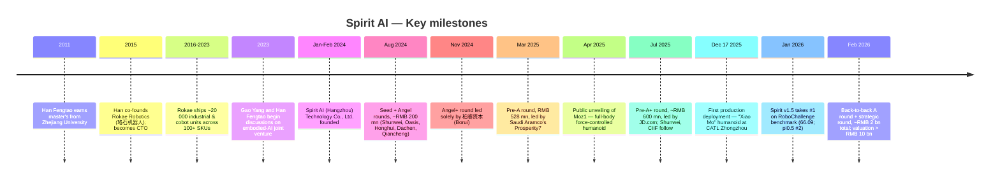
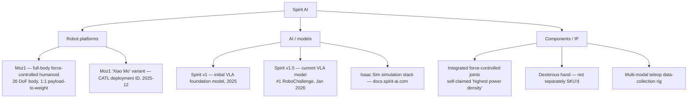
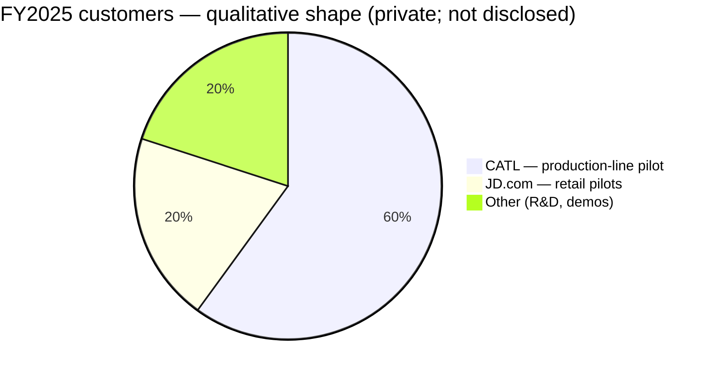
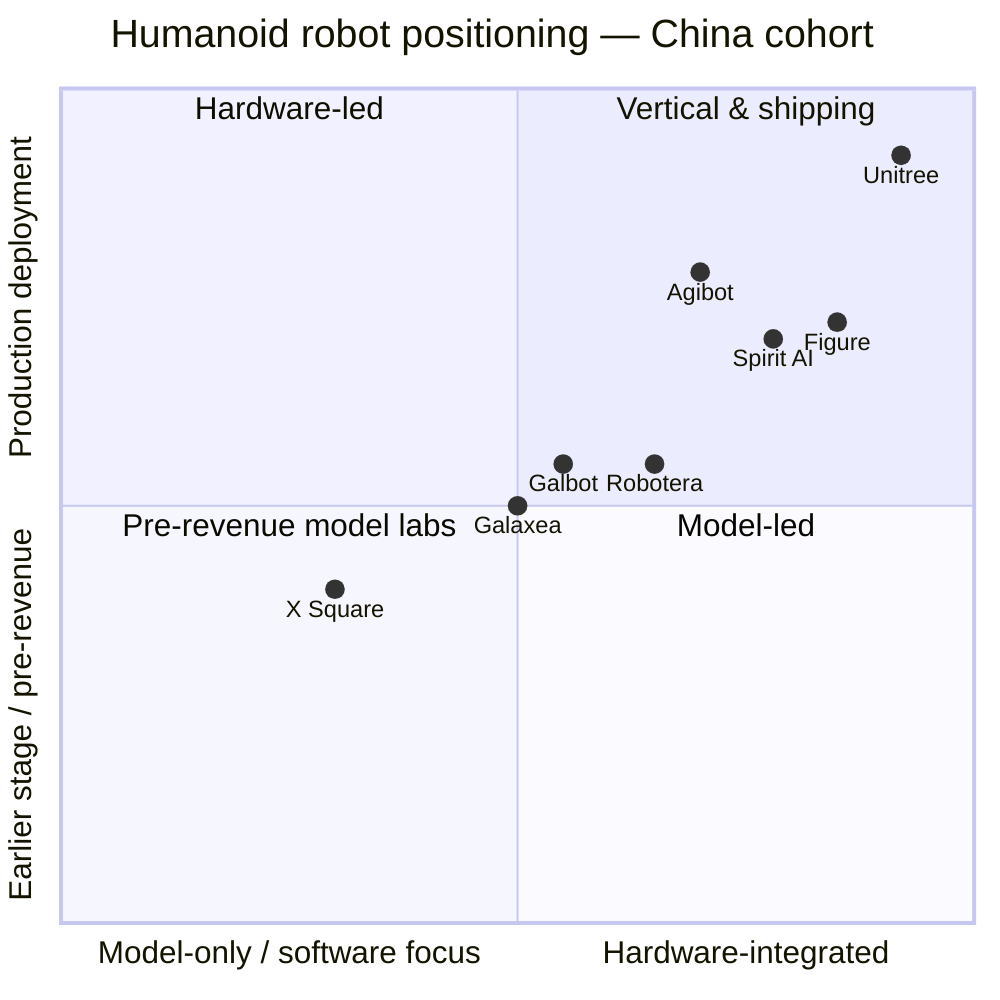

# COMPANY RESEARCH REPORT: Spirit AI (千寻智能)

**Date:** 2026-05-19
**Status:** Private company — no public ticker
**Domicile:** Hangzhou, Zhejiang, China
**Sector:** Embodied AI / general-purpose humanoid robotics
**Founded:** January / February 2024 (sources differ — both within Q1 2024)

> **Update — Funding round + valuation milestone (2026-02-24):** Spirit AI disclosed back-to-back financing rounds totalling close to **RMB 2 billion (~USD 280–290 million)** in late January / February 2026, lifting post-money valuation **above RMB 10 billion (~USD 1.4 billion)** and minting the company as a humanoid-robot unicorn. New investors include 云锋基金 (Yunfeng), 混沌投资 (Chaos Investment / 葛卫东), 红杉中国 (Sequoia China), 明荟投资 (the family office of Inovance / 汇川技术 chairman Zhu Xingming), TCL 创投 and 360 基金; existing backers including 顺为资本 (Shunwei, Lei Jun), Prosperity7 (Saudi Aramco), 京东 (JD.com), 达晨财智, 弘晖, 柏睿 and 华泰紫金 added on. Source: [Gasgoo, 2026-02-24](https://autonews.gasgoo.com/articles/news/spirit-ai-secures-nearly-2-billion-yuan-in-back-to-back-funding-rounds-as-embodied-intelligence-race-heats-up-2026146686038994944), [TheAIinsider, 2026-02-24](https://theaiinsider.tech/2026/02/24/chinese-robotics-company-spirit-ai-raises-290m-in-back-to-back-funding-rounds/), [量子位 (QbitAI), 2026-02](https://www.qbitai.com/2026/02/381766.html), [Caixin Substack, 2026-02](https://caixinchinawatch.substack.com/p/free-to-read-chinas-spirit-ai-valued).

---

## TABLE OF CONTENTS

1. Company Overview
2. Company History
3. Management Team
4. Products & Services
5. Customers & Go-to-Market
6. Industry Overview
7. Competitive Landscape
8. Market Opportunity (TAM)
9. Risk Assessment
10. References

---

## 1. COMPANY OVERVIEW

Spirit AI (Chinese name: 千寻智能, Qianxun Intelligence; legal entity 千寻智能（杭州）科技有限公司) is a Hangzhou-based embodied-AI start-up that designs and manufactures general-purpose humanoid robots and develops the Vision-Language-Action (VLA) foundation models that pilot them. The company was founded in the first quarter of 2024 by 韩峰涛 (Han Fengtao) — the former co-founder and CTO of 珞石机器人 (Rokae Robotics), one of China's earlier collaborative-robot pioneers — together with 高阳 (Gao Yang), an assistant professor at the Institute for Interdisciplinary Information Sciences (IIIS) of 清华大学 (Tsinghua University) and a UC Berkeley PhD trained under Trevor Darrell, who serves as chief scientist ([Stanford Robotics Center seminar bio, 2025](https://src.stanford.edu/src-events/bot4nbr3a8ykux3lkkyvea47c9dmt0); [KrAsia interview with Gao Yang, 2025](https://kr-asia.com/entrepreneurship-is-like-playing-a-game-says-spirit-ai-co-founder-gao-yang)).

The company sells, under one roof, three tightly coupled product lines: (1) **Moz1**, a full-body force-controlled bipedal humanoid robot that debuted publicly in April 2025; (2) **Spirit v1 / Spirit v1.5**, an in-house VLA foundation model that is the "brain" inside Moz1 and (according to the company) other third-party robot platforms in the future; and (3) **integrated force-controlled joints and a dexterous hand** developed as core components that Spirit AI argues are necessary to make a VLA model usable in the real world. The internal slogan that recurs across press coverage and Han Fengtao's interviews is "**AI + 全身力控** (AI + full-body force control)" — Spirit AI positions itself as one of very few Chinese embodied-AI companies that builds both the model and the high-performance hardware required to execute that model's outputs precisely enough for industrial manipulation ([Sohu re-post of Spirit AI launch release, 2025-04](https://www.sohu.com/a/912746789_120960869); [Spirit AI launch announcement, 2025-04](https://www.spirit-ai.com/en/news/13)).

**Business model.** Spirit AI is, at the time of writing, principally a hardware-and-software bundled supplier to industrial and commercial pilot customers. Han Fengtao has stated in multiple interviews that the company began commercial shipments in Q4 2025, that revenue in 2025 was in the "tens of millions of RMB" range, and that the 2026 internal target is for revenue to **exceed RMB 100 million with shipments in the low-three-digit-units range (several hundred Moz1 humanoids)** ([21经济网 interview with Han Fengtao, 2025-08-12](https://www.21jingji.com/article/20250812/herald/8c1094c3797912c83cf6b518b52ba6a9.html); [新浪财经 / Sina, 2026-02](https://finance.sina.com.cn/stock/t/2026-03-02/doc-inhpqvan8248575.shtml)). Pricing has not been formally disclosed; secondary press has placed Moz1 in the "several hundred thousand RMB" per-unit range, comparable to Unitree H1 ($99,900) and below Western full-size humanoids — *flagged as unverified*; no SKU price list is published on spirit-ai.com.

**Where it operates.** Headquarters and primary R&D are in Hangzhou (余杭区) ([Aiqicha business registry record](https://www.aiqicha.com/company_detail_50159868914060); [Baidu Baike entity record](https://baike.baidu.com/item/%E5%8D%83%E5%AF%BB%E6%99%BA%E8%83%BD%EF%BC%88%E6%9D%AD%E5%B7%9E%EF%BC%89%E7%A7%91%E6%8A%80%E6%9C%89%E9%99%90%E5%85%AC%E5%8F%B8/65099257)). Press coverage references a Beijing model-and-research arm linked to Gao Yang's Tsinghua IIIS lab, and a Shanghai/Shenzhen presence for customer engagements, though Spirit AI has not formally announced satellite offices. Pilot deployments to date are domestic: 宁德时代 (CATL) — the Zhongzhou (中州) battery production base — and JD.com retail showcases are the two named customers ([Asia Tech Daily, 2026-02-25](https://asiatechdaily.com/spirit-ai-raises-280m-to-scale-dirty-data-robotics-is-china-betting-big-on-embodied-ai/); [ION Analytics / Mergermarket on Vitalbridge, 2026-02](https://ionanalytics.com/insights/mergermarket/vitalbridge-sees-spirit-ais-up-round-as-vindication-of-china-early-stage-ai-pivot/)).

**Scale.** The company is two years old and headcount is small relative to its valuation. Public sources do not give an audited headcount; Han Fengtao has referenced "more than 100" engineers in early 2025 interviews and crosses the "200+" line in the 2026 36Kr "30 days, RMB 3 bn" feature — *flagged as unverified specific count; treat as directional* ([36Kr, "Meet Generalist at the Peak", 2026-02](https://eu.36kr.com/en/p/3756066027209477)). Team backgrounds, per company self-disclosure relayed by press, draw from UC Berkeley, CMU, Tsinghua, Peking University, Zhejiang University and operating experience at ByteDance, Huawei, Tencent and Xiaomi ([量子位 (QbitAI), 2026-02](https://www.qbitai.com/2026/02/381766.html)).

**Valuation snapshot — private; no public-market multiple.**

| Metric | Value | Source |
|---|---|---|
| Post-money valuation (Feb 2026) | **> RMB 10 bn (~USD 1.4 bn)** | [36Kr, 2026-02](https://eu.36kr.com/en/p/3729693985390208) |
| Cumulative funding raised | **~RMB 2.8 bn (~USD 400 mn)** since founding | [Gasgoo, 2026-02-24](https://autonews.gasgoo.com/articles/news/spirit-ai-secures-nearly-2-billion-yuan-in-back-to-back-funding-rounds-as-embodied-intelligence-race-heats-up-2026146686038994944) |
| FY2025 revenue (disclosed) | "tens of millions of RMB" (i.e. low double-digit RMB mn) | [21经济网, 2025-08-12](https://www.21jingji.com/article/20250812/herald/8c1094c3797912c83cf6b518b52ba6a9.html) |
| FY2026 revenue target (internal) | **> RMB 100 mn** | [新浪 / Sina, 2026-02](https://finance.sina.com.cn/stock/t/2026-03-02/doc-inhpqvan8248575.shtml) |
| Implied 2025 revenue multiple | ≳ 200× revenue (RMB 10 bn / ~RMB 50 mn rev) | derived; method shown below |
| Implied 2026 fwd revenue multiple | ~100× revenue (RMB 10 bn / RMB 100 mn) | derived |

The implied revenue multiple — **roughly 100× forward 2026 revenue at the post-money mark** — is extreme by any conventional yardstick. It is **defensible only as a thematic / sector-proxy premium**: investors are paying for (a) Han Fengtao's hardware engineering credibility built up over a decade at Rokae, (b) Gao Yang's VLA model leadership (Spirit v1.5 took the top RoboChallenge slot in January 2026, ahead of Physical Intelligence's pi0.5, per [People's Daily Online, 2026-01-14](https://en.people.cn/n3/2026/0114/c90000-20413808.html)), and (c) the broader China humanoid-robot sector re-rating where peers Galbot, Galaxea, Agibot, AI² Robotics and Robotera have all crossed RMB 10 bn in valuation in the same six-month window. Compared to those peers, Spirit AI's multiple is **in-line with sector**, not stretched relative to it ([Caixin, 2026-03-03 on Galbot](https://www.caixinglobal.com/2026-03-03/galbot-raises-362-million-in-fresh-funding-eyes-hong-kong-ipo-102418742.html); [Caixin, 2026-02-12 on Galaxea](https://www.caixinglobal.com/2026-02-12/galaxea-ai-raises-144-million-as-chinas-robot-investment-frenzy-mounts-102413767.html)).

The risk this creates is symmetric: if either the VLA scaling-law thesis (Han's stated investment case — see Section 6) or industrial-line deployment fails to compound in 2026–2027, the entire China embodied-AI cohort re-rates together, and Spirit AI's valuation compression could be 50–70% from current marks. Morgan Stanley analysts have already flagged 2026 as "a critical year as humanoid integrators strive to reach commercialisation" and warned of an impending shake-out across the cohort ([TheNextWeb on China humanoid market reality check, 2026](https://thenextweb.com/news/china-humanoid-robot-boom-commercialisation-reality-check); [Gasgoo, "Humanoid Robots Enter a New Battlefield", 2026](https://autonews.gasgoo.com/articles/news/humanoid-robots-enter-a-new-battlefield-2026957094341603329)). This is treated as a financial risk in Section 9.

---

## 2. COMPANY HISTORY

Spirit AI is too young to have a "history" in the traditional sense — it is **24 months old** at the time of writing — but the founder's prior decade at Rokae and the academic lineage of co-founder Gao Yang together explain why the company materialised with senior backing on day one ([36Kr, "Qianxun Intelligence's Valuation Exceeds 10 Billion Yuan in Just Two Years", 2026-02](https://eu.36kr.com/en/p/3701216103281408)).

Sources for timeline: [新浪财经, 2026-02](https://finance.sina.cn/stock/jdts/2026-02-23/detail-inhnvqch6595031.d.html?vt=4), [财联社 / cls.cn on Pre-A close, 2025](https://www.cls.cn/detail/1991934), [新浪 on Pre-A+, 2025-07-21](https://finance.sina.com.cn/tech/csj/2025-07-21/doc-infhfrrm3239621.shtml), [aliyun startup news on 2-rounds-in-4-months, 2024](https://startup.aliyun.com/info/1087030.html), [36Kr Pre-A exclusive, 2025-03](https://eu.36kr.com/en/p/3224908715539591), [Spirit AI news 8, 2025](https://spirit-ai.com/news/8).

**Founding story.** The founding thesis, recounted by Han in his August 2025 interview with 21经济网 and the February 2026 sit-down with LatePost / 36Kr, was that **the bottleneck of robotics had structurally shifted from hardware to intelligence** ([21经济网, 2025-08-12](https://www.21jingji.com/article/20250812/herald/8c1094c3797912c83cf6b518b52ba6a9.html); [m.aitntnews mirror of LatePost interview, 2026-02](https://m.aitntnews.com/newDetail.html?newId=22603)). Han had spent 2015–2023 at Rokae solving hardware problems — joint controllers, force sensing, motion planning — and had reached the conclusion that *industrial robots will never become general-purpose without a learning-based model*; conversely, *VLA models will never deliver real value without high-quality data and high-fidelity actuation*. He therefore left Rokae in late 2023 and partnered with Gao Yang — whose Tsinghua group had been publishing on robotic learning since 2021 — to build a company that owns both halves.

**Strategic pivots.** Two are worth noting given the company's young age:

- **From "build a foundation model first, hardware later" to "co-develop both from day one" (mid-2024).** Press coverage of the early angel rounds described Spirit AI as primarily a model company. By the Moz1 launch in April 2025 the framing had flipped: hardware was front-and-centre, and management's stated reasoning was that "without our own actuators we can't generate the kind of force-controlled manipulation data that a VLA model can actually learn from" — the "dirty data" thesis later headlined in their PR Newswire release ([PR Newswire, 2026-02-25](https://www.prnewswire.com/news-releases/spirit-ai-lands-280m-to-scale-embodied-ai-through-dirty-data-302697085.html)).

- **From research demos to industrial production lines (late 2025).** Through most of 2024–H1 2025 Spirit AI's public-facing demos were household / office tasks (folding clothes, tidying desks). In December 2025 the company made an explicit pivot to **industrial deployment**, announcing the CATL Zhongzhou line as "the world's first humanoid-robot production line for power batteries" ([gasgoo, 2026-02-24](https://autonews.gasgoo.com/articles/news/spirit-ai-secures-nearly-2-billion-yuan-in-back-to-back-funding-rounds-as-embodied-intelligence-race-heats-up-2026146686038994944)). Han framed this in the LatePost interview as following the data: factories give you concentrated, repeatable, high-skill-density tasks that compound model improvement faster than scattered consumer scenarios.

**Acquisitions.** None disclosed.

**Recent developments (last 12 months).** (i) The two-round Feb 2026 financing detailed in Section 1. (ii) Spirit v1.5's #1 ranking on RoboChallenge in January 2026, the first time a Chinese embodied-AI model has led a globally-recognised real-world manipulation benchmark ([CGTN, 2026-01-14](https://news.cgtn.com/news/2026-01-14/Chinese-AI-startup-tops-global-embodied-intelligence-benchmark-1JV32RBb7QQ/index.html); [People's Daily, 2026-01-14](https://en.people.cn/n3/2026/0114/c90000-20413808.html)). (iii) Press reporting that the September 2025 capital-injection round added 中国互联网投资基金 (the China Internet Investment Fund — a state-backed fund) as a shareholder, alongside JD Technology, an important signal that the company has secured state capital ([新浪财经, 2025-09-08](https://finance.sina.com.cn/chanjing/gsnews/2025-09-08/doc-infpuftk9735591.shtml)).

---

## 3. MANAGEMENT TEAM

### Han Fengtao (韩峰涛) — Co-founder, Chairman & CEO

**Bio (~330 words).** Han Fengtao is the operating soul of Spirit AI and, in the view of multiple investors quoted in the 2026 financing coverage, the principal reason the company commands a unicorn valuation two years after founding. Han graduated from 浙江大学 (Zhejiang University) with a master's in mechanical / robotics engineering in 2011, studying under 丁汉 (Ding Han), one of China's most senior robotics academicians and a member of the Chinese Academy of Sciences ([新浪财经, 2026-02](https://finance.sina.cn/stock/jdts/2026-02-23/detail-inhnvqch6595031.d.html?vt=4)).

After graduation he spent four years in industry before, in 2015, co-founding **珞石机器人 (Rokae Robotics)** as CTO. Rokae would become one of the better-known Chinese collaborative-robot companies, raising successive rounds from CICC, Joy Capital, Source Code Capital and others, and reaching reported cumulative shipments approaching 20,000 units across roughly 100 SKUs spanning industrial six-axis arms and lighter-payload cobots by the time Han departed ([新浪财经, 2026-02-23](https://finance.sina.cn/stock/jdts/2026-02-23/detail-inhnvqch6595031.d.html?vt=4)). Han's specific contribution at Rokae was the **motion control stack and the algorithm team** — work that gives Spirit AI's joint controller a direct lineage from a real, ship-at-scale operating context. His Inovance (汇川技术) background sometimes referenced in early coverage appears in fact to be indirect: Rokae's controller engineers and his own network overlap heavily with Inovance, and Inovance chairman Zhu Xingming's family office (明荟投资) is now a strategic investor in Spirit AI ([投中网, 2026-02-25](https://www.chinaventure.com.cn/news/80-20260225-390228.html)).

Han left Rokae in late 2023 — by his own account because he believed cobots had hit a ceiling without learning-based intelligence — and founded Spirit AI in Q1 2024 ([21经济网 interview with Han Fengtao, 2025-08-12](https://www.21jingji.com/article/20250812/herald/8c1094c3797912c83cf6b518b52ba6a9.html); [m.aitntnews mirror of LatePost interview, 2026-02](https://m.aitntnews.com/newDetail.html?newId=22603)). He owns the largest founder block (specific %, *not disclosed*; per typical Chinese tech founder-CEO with Series A-level dilution he likely retains 20–35% common but treat as unverified). His public profile is built almost entirely on long-form Chinese-language tech-press interviews (LatePost, 36Kr, 21经济报道, 量子位) where he has been notably specific about the company's data-pipeline ambitions, financial targets and competitive frame ([量子位 (QbitAI), 2026-02](https://www.qbitai.com/2026/02/381766.html); [36Kr "Meet Generalist at the Peak", 2026-02](https://eu.36kr.com/en/p/3756066027209477)). Han is described by interviewers as direct, numbers-oriented and engineering-first — closer in style to Wang Xing or Wang Chuanfu than to a vision-deck founder.

### Gao Yang (高阳) — Co-founder & Chief Scientist

**Bio (~190 words).** Gao Yang is the model / research half of the founding pair. He took his bachelor's in CS from Tsinghua University, working with Prof. Zhu Jun on Bayesian inference, then completed his PhD at UC Berkeley under Trevor Darrell and a postdoc with Darrell and Pieter Abbeel — placing him in the direct academic lineage of two of the foundational figures of modern deep RL and robotic learning ([Google Scholar profile](https://scholar.google.com/citations?user=bo0P2qYAAAAJ&hl=en); [Stanford Robotics Center seminar bio](https://src.stanford.edu/src-events/bot4nbr3a8ykux3lkkyvea47c9dmt0)).

Gao returned to Tsinghua as an assistant professor at the Institute for Interdisciplinary Information Sciences (IIIS) — the institute founded by Andrew Yao and the academic home of several other prominent Chinese AI start-up founders ([Stanford Robotics Center seminar bio](https://src.stanford.edu/src-events/bot4nbr3a8ykux3lkkyvea47c9dmt0)). He is sometimes grouped with the so-called "**伯克利归国四子** (the four Berkeley returnees)" in Chinese tech press, a cohort that also includes other UC Berkeley-trained Chinese AI academic-entrepreneurs ([cls.cn, 2025](https://www.cls.cn/detail/1991934)). His Spirit v1.5 model is the headline external technical artefact: it ranked #1 on the public RoboChallenge real-world manipulation benchmark in January 2026, posting a total score of 66.09 with a 50.33% task success rate, ahead of Physical Intelligence's pi0.5 ([People's Daily, 2026-01-14](https://en.people.cn/n3/2026/0114/c90000-20413808.html); [ECNS, 2026-01-14](http://www.ecns.cn/news/economy/2026-01-14/detail-iheywhna5921726.shtml)).

### CFO — not publicly named

As of May 2026 Spirit AI has not publicly named a chief financial officer ([36Kr, "Meet Generalist at the Peak", 2026-02](https://eu.36kr.com/en/p/3756066027209477); [量子位 (QbitAI), 2026-02](https://www.qbitai.com/2026/02/381766.html)). This is normal for a Chinese hardware start-up of this stage but is a real gap: with cumulative cash raised approaching RMB 2.8 bn ([Gasgoo, 2026-02-24](https://autonews.gasgoo.com/articles/news/spirit-ai-secures-nearly-2-billion-yuan-in-back-to-back-funding-rounds-as-embodied-intelligence-race-heats-up-2026146686038994944)) and a stated 2026 production scale-up, the absence of a public CFO with capital-markets credentials is something to track. *Flag as unverified — Spirit AI may have an internal CFO who simply has not been profiled publicly.*

### Other named executives

Spirit AI has not disclosed a full C-suite line-up in English-language press, and the spirit-ai.com leadership page (when accessed via secondary mirrors) lists only Han and Gao ([Aparobot — Spirit AI company page](https://www.aparobot.com/companies/spirit-ai); [AI Wiki — Spirit AI entry](https://aiwiki.ai/wiki/spirit_ai)). Press coverage mentions a head of hardware engineering and a head of model R&D, neither named on the record. Treat the management bench beyond Han + Gao as **a known unknown** and a meaningful execution risk (Section 9).

### Governance

- **Board:** dominated by founder + lead investor representatives. Specific seats not disclosed.
- **Insider ownership:** founders' combined stake unconfirmed; consistent with the post-Pre-A+ cap table, founder block is likely the single largest single holding but not majority.
- **Investor cap table (disclosed):** Yunfeng Capital (云锋), Chaos Investment (混沌 / 葛卫东), Sequoia China, Shunwei (顺为 — Lei Jun-linked), JD Technology (刘强东-linked), China Internet Investment Fund (state), Prosperity7 (Saudi Aramco), Minghui Investment (Inovance chairman family office), TCL Venture, 360 Fund (周鸿祎-linked), 重庆产业母基金, 杭州金投, plus seed/angel holders Oasis (绿洲), Honghui (弘晖), Dachen Caizhi (达晨财智), Qiancheng (千乘) and Borui (柏睿) ([投中网, 2026-02-25](https://www.chinaventure.com.cn/news/80-20260225-390228.html); [新浪, 2025-07-21](https://finance.sina.com.cn/tech/csj/2025-07-21/doc-infhfrrm3239621.shtml); [aliyun startup, 2024](https://startup.aliyun.com/info/1087030.html)).
- **Compensation:** undisclosed; private-company norms apply.
- **Related-party transactions:** none disclosed.

### Track record synthesis

The CEO has built and shipped real industrial robots before — at scale, with real customers, for nearly a decade — which is the single biggest differentiator versus most other 2023–2024 vintage Chinese humanoid-robot CEOs whose track records are largely academic or consumer-internet ([新浪财经, 2026-02-23](https://finance.sina.cn/stock/jdts/2026-02-23/detail-inhnvqch6595031.d.html?vt=4)). The chief scientist is academically pedigreed at the highest tier reachable for a Chinese embodied-AI start-up ([Google Scholar — Gao Yang](https://scholar.google.com/citations?user=bo0P2qYAAAAJ&hl=en); [Stanford Robotics Center seminar bio](https://src.stanford.edu/src-events/bot4nbr3a8ykux3lkkyvea47c9dmt0)). The gap is the **second layer of leadership**: no public CFO, no named COO or VP of operations, no public head of business development — all roles that will matter enormously as Spirit AI moves from low-double-digit-mn RMB revenue to mid-three-digit-mn within twelve months ([新浪 / Sina, 2026-02](https://finance.sina.com.cn/stock/t/2026-03-02/doc-inhpqvan8248575.shtml)).

---

## 4. PRODUCTS & SERVICES

Spirit AI's product portfolio is intentionally narrow at this stage — concentrated entirely around the Moz1 humanoid and the VLA model that pilots it ([Spirit AI launch announcement, 2025-04](https://www.spirit-ai.com/en/news/13); [humanoid.guide on Moz1](https://humanoid.guide/product/moz1/)).

Sources: [Moz1 page on humanoid.guide](https://humanoid.guide/product/moz1/); [Aparobot Moz1 page](https://www.aparobot.com/robots/moz1); [Spirit AI launch announcement, 2025-04](https://www.spirit-ai.com/en/news/13); [Spirit AI docs](https://docs.spirit-ai.com/simulation/issac.html).

### 4.1 Moz1 — humanoid robot (flagship)

**What it is.** A full-body, bipedal humanoid robot with **26 degrees of freedom** in the body (the company's count excludes the dexterous hand DoF) and **self-developed integrated force-controlled joints**. The headline differentiator Spirit AI emphasises is **full-body force control** — the ability to modulate joint torque continuously across all 26 joints — which (per the company's claims) lets Moz1 perform contact-rich manipulation tasks like fitting a connector, threading a wire harness, or folding a soft fabric without crushing it ([Sohu reposting Spirit AI launch, 2025-04](https://www.sohu.com/a/912746789_120960869); [humanoid.guide on Moz1](https://humanoid.guide/product/moz1/)).

**Specs (what is publicly disclosed):**
- **DoF:** 26 (whole body, ex-hand) ([humanoid.guide](https://humanoid.guide/product/moz1/)).
- **Payload-to-self-weight ratio:** 1:1 — i.e. Moz1 can carry roughly its own body weight as payload (company claim) ([Aparobot](https://www.aparobot.com/robots/moz1)).
- **Joint power density:** "world's highest" — company self-claim, no independent third-party benchmark (*flag as unverified*).
- **Teleoperation:** zero-latency whole-body teleop via Spirit AI's proprietary multi-modal data-collection rig ([Sohu / Spirit AI release, 2025-04](https://www.sohu.com/a/912746789_120960869)).
- **Height / total mass / battery runtime / max walking speed / max load (kg):** **not formally disclosed in primary sources reviewed** — *flag explicitly*. Compare to Unitree H1 (~180 cm, 47 kg, 3.3 m/s, ~$99,900) and Unitree G1 (~130 cm, 35 kg, 2 m/s, $21,600) ([Unitree H1 page](https://www.unitree.com/h1/); [Unitree G1 page](https://www.unitree.com/g1/)).

**Pricing.** Not disclosed. Han Fengtao's comments and the 2026 revenue / unit-count math (RMB 100 mn revenue across "several hundred units") imply an ASP in the **low-to-mid hundreds of thousands RMB** per unit ([新浪 / Sina, 2026-02](https://finance.sina.com.cn/stock/t/2026-03-02/doc-inhpqvan8248575.shtml); [21经济网, 2025-08-12](https://www.21jingji.com/article/20250812/herald/8c1094c3797912c83cf6b518b52ba6a9.html)). *Treat as derived, not disclosed.*

**Target customer.** Industrial production lines (with CATL as the lead reference); secondarily commercial / retail (JD); R&D and university-lab customers as a secondary channel via the Isaac Sim-based simulation product ([Spirit AI docs](https://docs.spirit-ai.com/simulation/issac.html)). The deliberate emphasis on industrial deployment vs. consumer is a defining strategic choice ([m.aitntnews mirror of LatePost interview, 2026-02](https://m.aitntnews.com/newDetail.html?newId=22603)).

**Competitive-advantage verdict:** **Partial moat.** The integrated force-controlled joint and the dexterous hand are real proprietary IP — Han Fengtao's Rokae lineage makes the actuator claim more credible than most ([新浪财经, 2026-02-23](https://finance.sina.cn/stock/jdts/2026-02-23/detail-inhnvqch6595031.d.html?vt=4)). But the hardware is replicable; Unitree, Agibot and Robotera ship comparable form factors ([HelloChinaTech, 2026](https://hellochinatech.com/p/two-unicorns-28000-robots)), and Tesla Optimus and Figure 02 outclass it on certain dimensions (humanoid scale, ML compute on-board, brand) ([Figure AI on BMW production](https://www.figure.ai/news/production-at-bmw); [Standard Bots on Tesla robot 2026](https://standardbots.com/blog/tesla-robot)). The deeper edge is the **vertical stack**: owning the joints means owning the contact-rich data, and owning the contact-rich data is what differentiates Spirit v1.5 from VLAs trained on web video alone ([PR Newswire on Spirit AI dirty-data strategy, 2026-02-25](https://www.prnewswire.com/news-releases/spirit-ai-lands-280m-to-scale-embodied-ai-through-dirty-data-302697085.html)).

**Nearest competing product:** Unitree H1 ($99,900, ~180 cm) ([Unitree H1 store page](https://shop.unitree.com/products/unitree-h1)). Verdict: **roughly at parity on locomotion; Spirit AI ahead on manipulation force control; behind on shipped-unit volume and brand**.

### 4.2 Spirit v1.5 — VLA foundation model

**What it is.** A unified Vision-Language-Action foundation model — a single end-to-end network that ingests RGB-D vision, natural-language instructions, and proprioceptive state, and emits joint-level action commands. Spirit v1.5 is the second-generation VLA model from the company, succeeding Spirit v1 ([Sohu / Spirit AI release, 2025-04](https://www.sohu.com/a/912746789_120960869); [Spirit AI launch announcement, 2025-04](https://www.spirit-ai.com/en/news/13)).

**Public evidence of capability.** In January 2026, Spirit v1.5 ranked #**1 on the RoboChallenge real-world robotic manipulation benchmark** with a total score of **66.09** and a task success rate of **50.33%**, ahead of Physical Intelligence's pi0.5 ([People's Daily, 2026-01-14](https://en.people.cn/n3/2026/0114/c90000-20413808.html); [CGTN, 2026-01-14](https://news.cgtn.com/news/2026-01-14/Chinese-AI-startup-tops-global-embodied-intelligence-benchmark-1JV32RBb7QQ/index.html); [ecns.cn, 2026-01-14](http://www.ecns.cn/news/economy/2026-01-14/detail-iheywhna5921726.shtml)). This is the most credible third-party data point on Spirit AI's model technology available, although RoboChallenge is itself a recently established benchmark and not yet at the LMArena / MMLU level of industry-wide acceptance.

**Pricing model.** Not commercialised stand-alone today; bundled with Moz1.

**Competitive-advantage verdict:** **Partial moat, evidence is fresh and narrow.** A benchmark win is a real proof point, but the gap to the second-place model is small enough that any of Physical Intelligence ([Physical Intelligence — π0.5 blog](https://www.pi.website/blog/pi05)), Galbot, Agibot, Galaxea, X Square or Skild AI could overtake within a release cycle. The durable question is the **data flywheel** — can Spirit AI generate proprietary contact-rich manipulation data at a faster rate than peers? The CATL deployment is the bet on that question ([PR Newswire on Spirit AI dirty-data strategy, 2026-02-25](https://www.prnewswire.com/news-releases/spirit-ai-lands-280m-to-scale-embodied-ai-through-dirty-data-302697085.html); [SCMP, 2025-12](https://www.scmp.com/tech/big-tech/article/3336939/chinas-catl-marks-trailblazing-deployment-humanoid-robots-scale-factory-floor)).

### 4.3 Integrated force-controlled joints and dexterous hand

Sold as part of Moz1 rather than as a separate SKU today, but management has gestured (in the LatePost interview) at eventually selling joints to other robot OEMs as a separate revenue line ([m.aitntnews mirror of LatePost interview, 2026-02](https://m.aitntnews.com/newDetail.html?newId=22603)). *No public disclosure of separate component revenue; flag as forward-looking management commentary, not a current product.*

### 4.4 Roadmap & recent launches

- **April 2025:** Moz1 launched publicly ([Spirit AI launch announcement, 2025-04](https://www.spirit-ai.com/en/news/13)).
- **Q4 2025:** Commercial shipments began; "Xiao Mo" (a Moz1 variant ID) deployed at CATL on 2025-12-17 ([CnEVPost, 2025-12-18](https://cnevpost.com/2025/12/18/catl-launches-humanoid-robot-powered-battery-pack-line/); [SCMP, 2025-12](https://www.scmp.com/tech/big-tech/article/3336939/chinas-catl-marks-trailblazing-deployment-humanoid-robots-scale-factory-floor)).
- **Jan 2026:** Spirit v1.5 takes RoboChallenge #1 ([People's Daily, 2026-01-14](https://en.people.cn/n3/2026/0114/c90000-20413808.html)).
- **2026 internal target:** "Several hundred" Moz1 units shipped; RMB 100 mn+ revenue ([新浪 / Sina, 2026-02](https://finance.sina.com.cn/stock/t/2026-03-02/doc-inhpqvan8248575.shtml)).

No SKUs have been **sunset**.

---

## 5. CUSTOMERS & GO-TO-MARKET

### Customer segments

- **Industrial / OEM manufacturing** — the primary near-term target. CATL is the named reference. Adjacent prospects implied in press but not confirmed include automotive OEMs (Han Fengtao has been quoted in KrAsia coverage on the automotive-factory ambition — see [KrAsia, "Inside Spirit AI's quest…"](https://kr-asia.com/inside-spirit-ais-quest-to-deploy-humanoid-robots-in-automotive-factories)). The CATL deployment specifically handles **flexible wire-harness assembly**, a notoriously hard task for traditional rigid-arm industrial robots because of the unpredictability of the cable ([all-about-industries.com on Xiao Mo at CATL, 2025-12](https://www.all-about-industries.com/humanoid-robots-battery-production-catl-xiao-mo-a-e9e36d03d97ffb82948fad3628b8b40c/); [Humanoids Daily, 2025-12](https://www.humanoidsdaily.com/news/catl-deploys-humanoid-fleet-to-high-voltage-lines-claims-production-breakthrough)).
- **Retail / commercial services** — JD.com pilots have used Moz1 for customer-facing demonstrations and lightweight retail handling ([新浪, 2025-07-21](https://finance.sina.com.cn/tech/csj/2025-07-21/doc-infhfrrm3239621.shtml)). *Treat as marketing / pilot, not a structural revenue source.*
- **Research & academic** — implied via the Isaac Sim simulation tutorials Spirit AI publishes ([docs.spirit-ai.com](https://docs.spirit-ai.com/simulation/issac.html)), but no university customer list is published.

### Customer concentration

As a private company two quarters into commercial shipments, Spirit AI does not file customer-concentration disclosures, and management has not formally quantified top-1 / top-5 customer share. Based on the public deployment list, **CATL plausibly represents the majority of FY2025 disclosed revenue** — *this is an inference, not a disclosed number; flag as unverified* ([SCMP, 2025-12](https://www.scmp.com/tech/big-tech/article/3336939/chinas-catl-marks-trailblazing-deployment-humanoid-robots-scale-factory-floor)). JD has been the second public customer ([新浪, 2025-07-21](https://finance.sina.com.cn/tech/csj/2025-07-21/doc-infhfrrm3239621.shtml)).

If the CATL-led concentration is approximately right, it is **above the 50% top-1 threshold that triggers a material risk classification** (see Section 9). This is normal for an early commercial humanoid-robot company; comparable concentration exists at Figure (BMW) and at Agibot (their own subsidiary deployments and select OEM partners) ([Figure AI on BMW production, 2025](https://www.figure.ai/news/production-at-bmw); [BMW Group on Physical AI deployment](https://www.press.bmwgroup.com/global/article/detail/T0455864EN/bmw-group-to-deploy-humanoid-robots-in-production-in-germany-for-the-first-time?language=en)). It is, however, the single most important Section 5 number to track over 2026.

### Distribution channels

Direct-sales / engineering-engagement model. There is no public reseller channel, no e-commerce price page (compare Unitree, which sells G1 via a Shopify-style store at unitree.com with listed pricing from $16,000 for the demonstration unit to $73,900 for EDU Ultimate D), and no English-language pricing tier ([Unitree G1 store page](https://www.unitree.com/g1/); [Unitree H1 store page](https://shop.unitree.com/products/unitree-h1)). This is consistent with a "high-touch, small number of large strategic accounts" playbook.

### Sales cycle

The CATL deployment took roughly six months from disclosed engagement to live production-line use ([Asia Tech Daily, 2026-02-25](https://asiatechdaily.com/spirit-ai-raises-280m-to-scale-dirty-data-robotics-is-china-betting-big-on-embodied-ai/)) — fast for the type of customer but typical for a pilot rather than a multi-line rollout. Han has indicated to LatePost that converting pilots to multi-line, multi-task deployment at CATL — not signing more pilots — is the 2026 priority ([m.aitntnews mirror of LatePost interview, 2026-02](https://m.aitntnews.com/newDetail.html?newId=22603)).

### Key partnerships

- **CATL (宁德时代):** strategic deployment partner; named publicly ([SCMP, 2025-12](https://www.scmp.com/tech/big-tech/article/3336939/chinas-catl-marks-trailblazing-deployment-humanoid-robots-scale-factory-floor); [CnEVPost, 2025-12-18](https://cnevpost.com/2025/12/18/catl-launches-humanoid-robot-powered-battery-pack-line/)).
- **JD.com:** strategic investor (Pre-A+ lead) and pilot customer ([新浪, 2025-07-21](https://finance.sina.com.cn/tech/csj/2025-07-21/doc-infhfrrm3239621.shtml)).
- **China Internet Investment Fund (中国互联网投资基金):** state shareholder added in Sept 2025 ([新浪财经, 2025-09-08](https://finance.sina.com.cn/chanjing/gsnews/2025-09-08/doc-infpuftk9735591.shtml)) — implies political alignment with national robotics policy (the "humanoid robot innovation development guidance" issued by MIIT in November 2023, [CGTN, 2023-11-03](https://news.cgtn.com/news/2023-11-03/China-aims-to-build-advanced-humanoid-robots-by-2025-1oqrPxDmOCA/index.html)).
- **No formal automotive OEM partnership announced as of May 2026** (despite [KrAsia](https://kr-asia.com/inside-spirit-ais-quest-to-deploy-humanoid-robots-in-automotive-factories) and press references to the ambition).
- **Tsinghua IIIS:** academic anchor via Gao Yang ([Stanford Robotics Center seminar bio, 2025](https://src.stanford.edu/src-events/bot4nbr3a8ykux3lkkyvea47c9dmt0)).

### Named customer wins / case studies

The single substantive case study is the **CATL Zhongzhou "Xiao Mo" humanoid line, Dec 17 2025**, framed as the world's first humanoid-robot production line for power batteries ([Gasgoo, 2026-02-24](https://autonews.gasgoo.com/articles/news/spirit-ai-secures-nearly-2-billion-yuan-in-back-to-back-funding-rounds-as-embodied-intelligence-race-heats-up-2026146686038994944); [Humanoids Daily, 2025-12](https://www.humanoidsdaily.com/news/catl-deploys-humanoid-fleet-to-high-voltage-lines-claims-production-breakthrough)). The task — flexible wire-harness installation on EV battery packs — is well chosen as a marketing showcase precisely because it is the kind of contact-rich, vision-and-touch task that traditional industrial automation has never solved cleanly ([all-about-industries.com on Xiao Mo at CATL, 2025-12](https://www.all-about-industries.com/humanoid-robots-battery-production-catl-xiao-mo-a-e9e36d03d97ffb82948fad3628b8b40c/); [Carnewschina, 2025-12-18](https://carnewschina.com/2025/12/18/catl-achieves-worlds-first-scale-deployment-of-embodied-ai-humanoid-robots-on-battery-production-lines/)).

---

## 6. INDUSTRY OVERVIEW

### Industry definition

Spirit AI competes in the **general-purpose humanoid robot** industry — a subset of robotics characterised by (i) bipedal locomotion, (ii) human-scale anthropomorphic form factor with two arms and (typically) dexterous hands, and (iii) a foundation-model-based "brain" capable of cross-task generalisation rather than the single-task programming that defines industrial robotics. The Chinese industry classification places this under 智能机器人 (intelligent robots), specifically 具身智能 (embodied intelligence) as a subcategory ([MERICS, "Embodied AI: China's ambitious path…"](https://merics.org/en/report/embodied-ai-chinas-ambitious-path-transform-its-robotics-industry)).

The adjacent industries are: (i) traditional industrial robots (KUKA, Fanuc, ABB, Yaskawa, plus Chinese leaders Estun, Inovance, Siasun); (ii) collaborative robots / cobots (Universal Robots, Rokae, JAKA, AUBO); (iii) quadruped robots (Boston Dynamics, Unitree, DEEP Robotics); (iv) automated guided vehicles / autonomous mobile robots (Geek+, Hai Robotics). Spirit AI's positioning is that humanoid + VLA will eventually subsume large parts of (ii) and (iii) and a meaningful share of routine tasks currently served by (i) ([Premia Partners on Embodied AI China, 2025](https://www.premia-partners.com/insight/embodied-ai-china-as-the-global-powerhouse-for-industrial-and-humanoid-robotics); [Robot Report on Chinese robotics outlook 2026](https://www.therobotreport.com/chinese-robotics-outlook-2026-includes-growth-competitive-pressure/)).

### Market size and growth

The Chinese humanoid-robot market is small today but growing rapidly off that low base:

- **2026E China humanoid-robot market:** ~**RMB 10.5 bn (~USD 1.4 bn)** per the 2024 Humanoid Robot Industry Research Report; ~**RMB 20 bn (~USD 2.8 bn)** per the China Center for Information Industry Development's 2026 update ([China Briefing](https://www.china-briefing.com/news/chinese-humanoid-robot-market-opportunities/); [Premia Partners](https://www.premia-partners.com/insight/embodied-ai-china-as-the-global-powerhouse-for-industrial-and-humanoid-robotics)).
- **Broader embodied-AI market in China (incl. autonomous vehicles, mobile robotics):** ~**RMB 973 bn (~USD 134 bn)** in 2025 ([China Briefing](https://www.china-briefing.com/news/chinese-humanoid-robot-market-opportunities/)).
- **Global humanoid TAM (Morgan Stanley):** **USD 5 trillion by 2050**, with China's total robotics TAM specifically forecast to double from **USD 47 bn in 2024 to USD 108 bn by 2028** ([Morgan Stanley, 2025](https://www.morganstanley.com/insights/articles/humanoid-robot-market-5-trillion-by-2050)).

These TAM figures are forecasts from the firms named; the actual 2025 humanoid-robot revenue in China is closer to **low-single-digit RMB bn** in the aggregate (an order-of-magnitude estimate consistent with the unit-level disclosures of the top peers — Unitree ~RMB 1.5 bn revenue, Agibot ramping through ~5,000 cumulative units, Galbot still mostly pre-revenue, per [HelloChinaTech, 2026](https://hellochinatech.com/p/two-unicorns-28000-robots) and [TechCrunch, 2026-02-28](https://techcrunch.com/2026/02/28/why-chinas-humanoid-robot-industry-is-winning-the-early-market/)) — *flag as estimate, not a disclosed industry-level number*.

### Growth drivers

- **The VLA scaling law** — Han Fengtao's headline argument, citing his LatePost interview: "Like LLMs, embodied intelligence also follows a scaling law; model capability is mainly a function of data quality and quantity" ([m.aitntnews mirror of LatePost interview, 2026-02](https://m.aitntnews.com/newDetail.html?newId=22603)). If that scaling law holds — i.e. doubling the quality-weighted training data continues to improve task-success rate — then 2026 is the inflection year analogous to 2023 for LLMs.
- **Chinese government policy.** The MIIT humanoid-robot guideline (Nov 2023) and the 14th and 15th Five-Year Plans both designate humanoid robotics as a strategic emerging industry. Provincial governments (Beijing, Shanghai, Shenzhen, Hangzhou, Chongqing) have all set up dedicated humanoid-robot industrial parks and state-fund matching programmes ([MERICS report](https://merics.org/en/report/embodied-ai-chinas-ambitious-path-transform-its-robotics-industry); [China Briefing](https://www.china-briefing.com/news/chinese-humanoid-robot-market-opportunities/)).
- **Manufacturing demographics.** Demographic ageing and rising labour costs in coastal manufacturing provinces create a real and rising substitution incentive; the marginal hour of human assembly labour in Guangdong / Zhejiang / Jiangsu is now expensive enough that even a RMB 200,000 humanoid amortised over five years is competitive on certain task profiles. Comprehensive per-worker labour cost in Jiangsu / Zhejiang clusters has reached ~RMB 150,000 annually inclusive of insurance and dormitory expenses ([TechWire Asia on China humanoid vs workers, 2025-05](https://techwireasia.com/2025/05/china-humanoid-robots-vs-manufacturing-workers/); [HelloChinaTech on factory unit economics](https://hellochinatech.com/p/china-humanoid-robot-factory-economics)).
- **EV supply chain.** China's CATL-led EV battery industry is the densest, fastest-moving, highest-volume manufacturing environment in the world, and is a natural early adopter — Spirit AI's CATL deployment is therefore not coincidental ([Carnewschina on CATL humanoid deployment, 2025-12-18](https://carnewschina.com/2025/12/18/catl-achieves-worlds-first-scale-deployment-of-embodied-ai-humanoid-robots-on-battery-production-lines/)).

### Regulatory environment

- **MIIT (工业和信息化部) humanoid-robot guidance, Nov 2023.** Sets policy direction; not a binding regulation in the FDA / EMA sense ([CGTN on MIIT 2025 humanoid plan, 2023-11-03](https://news.cgtn.com/news/2023-11-03/China-aims-to-build-advanced-humanoid-robots-by-2025-1oqrPxDmOCA/index.html); [TMTPost on China national strategy for humanoid robots](https://en.tmtpost.com/post/7336510)).
- **National standards** (GB 11291.1-2011 and successors) cover safety of industrial robots; humanoid-robot-specific standards are still in draft ([Code of China — GB 11291.1-2011 Robots for industrial environments safety requirements](https://www.codeofchina.com/standard/GB11291.1-2011.html)).
- **Export controls.** The US Bureau of Industry and Security has tightened controls on Chinese AI chips and on certain ML model exports; the inverse — Chinese export controls on humanoid robots — is not yet in force but is being studied ([Commerce / BIS press release on China AI restrictions](https://www.bis.gov/press-release/commerce-further-restricts-chinas-artificial-intelligence-advanced-computing-capabilities); [FDD on Chinese robotics export controls, 2026-03](https://www.fdd.org/analysis/2026/03/27/as-chinese-robotics-industry-surges-senate-considers-limited-federal-procurement-ban/)).
- **Data / privacy.** Robots collect dense in-environment data, including biometric data of nearby humans. China's PIPL (personal information protection law) applies — biometric data is classified as sensitive personal information requiring separate consent and a Personal Information Protection Impact Assessment; specific enforcement vis-à-vis humanoid robots is untested ([Securiti on China PIPL overview](https://securiti.ai/china-personal-information-protection-law-overview/); [Bloomberg Law PIPL FAQs](https://pro.bloomberglaw.com/insights/privacy/china-personal-information-protection-law-pipl-faqs/)).

### Industry structure

- **Fragmented at the top.** ~10 Chinese players with credible humanoid hardware and AI stacks: Spirit AI, Galbot (Beijing), Agibot (Shanghai), Galaxea (Beijing), AI² Robotics, Robotera (清华系), Unitree (Hangzhou), X Square Robot (自变量), Fourier Intelligence, EX Robotics, plus the hyperscalers' internal teams (Xiaomi CyberOne, Tencent Robotics X, ByteDance, XPeng IronX) ([HelloChinaTech on China humanoid cohort, 2026](https://hellochinatech.com/p/two-unicorns-28000-robots); [TheNextWeb on China humanoid landscape, 2026](https://thenextweb.com/news/china-humanoid-robot-boom-commercialisation-reality-check)).
- **Concentrated supplier base** for harmonic drives (Leaderdrive, Sumitomo), motors (Inovance, Maxon, NIDEC), 6-axis F/T sensors, and tactile skin ([Humanoid.guide on Leaderdrive surge with humanoid demand](https://humanoid.guide/leaderdrive-harmonic-reducers-surge-as-humanoid-demand-lifts-shares/); [IntelMarketResearch on humanoid robot speed reducers outlook 2026-2032](https://www.intelmarketresearch.com/humanoid-robot-speed-reducers-market-23769)).
- **Buyer power:** today low (early adopter customers want the technology); will rise as the field matures ([TheNextWeb on China humanoid boom reality check, 2026](https://thenextweb.com/news/china-humanoid-robot-boom-commercialisation-reality-check)).
- **Substitutes:** traditional industrial robots remain a substitute for any task where rigidity and repetition dominate over generalisation ([Robot Report on Chinese robotics outlook 2026](https://www.therobotreport.com/chinese-robotics-outlook-2026-includes-growth-competitive-pressure/)).

---

## 7. COMPETITIVE LANDSCAPE

The competitive set splits into three groups: (A) Chinese humanoid + VLA pure-plays of comparable vintage; (B) Western humanoid leaders; (C) Chinese hyperscaler internal humanoid teams and adjacent quadruped / cobot incumbents ([HelloChinaTech on China humanoid unicorns, 2026](https://hellochinatech.com/p/two-unicorns-28000-robots); [TechCrunch on China humanoid robot industry, 2026-02-28](https://techcrunch.com/2026/02/28/why-chinas-humanoid-robot-industry-is-winning-the-early-market/)).

### A. Chinese humanoid + VLA pure-plays (Spirit AI's direct peer set)

| Peer | HQ | Founded | Latest valuation | Notes |
|---|---|---|---|---|
| **Spirit AI (千寻智能)** | Hangzhou | 2024 | **> RMB 10 bn (Feb 2026)** ([Gasgoo, 2026-02-24](https://autonews.gasgoo.com/articles/news/spirit-ai-secures-nearly-2-billion-yuan-in-back-to-back-funding-rounds-as-embodied-intelligence-race-heats-up-2026146686038994944)) | Full-body force-controlled hardware + VLA; RoboChallenge #1 ([People's Daily, 2026-01-14](https://en.people.cn/n3/2026/0114/c90000-20413808.html)) |
| **Galbot (银河通用)** | Beijing | 2023 | **> RMB 20 bn (Mar 2026)** | Highest-valued; HK IPO mooted ([Caixin 2026-03-03](https://www.caixinglobal.com/2026-03-03/galbot-raises-362-million-in-fresh-funding-eyes-hong-kong-ipo-102418742.html)) |
| **Agibot (智元机器人)** | Shanghai | 2023 | **> RMB 10 bn** | 5,000+ cumulative units shipped per [HelloChinaTech, 2026](https://hellochinatech.com/p/two-unicorns-28000-robots) |
| **Galaxea AI** | Beijing | 2023 | **~RMB 10 bn (Feb 2026)** | $144 mn Series B at unicorn mark ([Caixin 2026-02-12](https://www.caixinglobal.com/2026-02-12/galaxea-ai-raises-144-million-as-chinas-robot-investment-frenzy-mounts-102413767.html)) |
| **AI² Robotics (自变量?)** | Beijing | 2023 | > RMB 10 bn | per [Global Neighbours, 2026](https://www.globalneighbours.org/en/articles/china-s-ai-robotics-raises-fresh-funds-at-over-10-billion-yuan-valuation) |
| **Robotera (星动纪元)** | Beijing | 2023 | > RMB 10 bn ([Global Neighbours, 2026](https://www.globalneighbours.org/en/articles/china-s-ai-robotics-raises-fresh-funds-at-over-10-billion-yuan-valuation)) | Tsinghua IIIS spin-out; close intellectual cousin to Spirit AI via Gao Yang's lab |
| **X Square Robot (自变量)** | Beijing | 2023 | $280 mn cumulative funding | A++ round Jan 2026 with ByteDance, Hongshan ([Pandaily, 2026](https://pro.pandaily.com/p/x-square-robots-wang-qian-robots)) |
| **Unitree (宇树科技)** | Hangzhou | 2016 | Pre-IPO; HK filings in progress ([TheNextWeb, 2026](https://thenextweb.com/news/china-humanoid-robot-boom-commercialisation-reality-check)) | Established shipping leader — Unitree H1 / G1 / H2 / R1 product family ([Unitree H1](https://www.unitree.com/h1/); [Unitree G1](https://www.unitree.com/g1/)) |

### B. Western humanoid leaders

| Peer | HQ | Latest mark | Notes |
|---|---|---|---|
| **Figure AI** | Sunnyvale | $2.6 bn (Feb 2024); newer rounds reported but not summarised here | BMW Spartanburg deployment ([Figure AI on BMW production, 2025](https://www.figure.ai/news/production-at-bmw); [BMW Group press release on Physical AI deployment](https://www.press.bmwgroup.com/global/article/detail/T0455864EN/bmw-group-to-deploy-humanoid-robots-in-production-in-germany-for-the-first-time?language=en)); OpenAI, Nvidia, Microsoft backers |
| **1X Technologies** | Oslo / Palo Alto | Multi-$bn (private) | NEO consumer humanoid at $20,000 retail ([1X NEO Home Robot page](https://www.1x.tech/discover/neo-home-robot); [Sifted on 1X consumer launch](https://sifted.eu/articles/1x-humanoid-robot-launch)) |
| **Tesla Optimus** | Texas | NM (inside TSLA) | In-house production for Tesla factories ([Standard Bots on Tesla robot price 2026](https://standardbots.com/blog/tesla-robot)) |
| **Boston Dynamics (Atlas)** | Waltham, MA | Inside Hyundai Motor Group | Industrial pilots; cost / pricing not retail ([Boston Dynamics — Atlas product page](https://bostondynamics.com/products/atlas/); [Hyundai Motor Group CES 2026 announcement](https://www.hyundai.com/worldwide/en/newsroom/detail/0000001093)) |
| **Apptronik** | Austin | Series A funded | Apollo humanoid; Mercedes pilot ([PR Newswire on Apptronik-Mercedes agreement, 2024-03](https://www.prnewswire.com/news-releases/apptronik-and-mercedes-benz-enter-commercial-agreement-that-will-pilot-apptroniks-apollo-humanoid-robot-in-mercedes-benz-manufacturing-facilities-302089972.html)) |
| **Sanctuary AI** | Vancouver | Private | Phoenix humanoid; cognitive architecture focus |
| **Physical Intelligence (PI)** | San Francisco | $400 mn round in 2024 | pi0.5 model — direct VLA competitor ([Physical Intelligence — π0.5 blog](https://www.pi.website/blog/pi05)); Spirit v1.5 beat pi0.5 on RoboChallenge Jan 2026 ([People's Daily, 2026-01-14](https://en.people.cn/n3/2026/0114/c90000-20413808.html)) |

*Quadrant placement is qualitative based on publicly disclosed deployment milestones and product/model balance; positions are author judgements, not measured coordinates.*

### Spirit AI's competitive advantages

1. **Founder hardware credibility.** Han Fengtao's Rokae lineage is unique in the Chinese humanoid cohort — Galbot, Agibot, Galaxea and X Square are all founded by ML academics or PMs without a "shipped 20,000 industrial robots" operating CV. The closest analogue is Unitree's Wang Xingxing, who built quadrupeds. This matters for two reasons: (i) credibility with industrial customers like CATL and (ii) ability to actually design the integrated force-controlled joint ([新浪财经 on Han Fengtao Rokae lineage, 2026-02-23](https://finance.sina.cn/stock/jdts/2026-02-23/detail-inhnvqch6595031.d.html?vt=4)).
2. **Vertical integration of model + actuator.** The "dirty data" thesis — that high-quality contact-rich data can only be generated by a robot whose actuators you fully control — is more than a marketing line; it dictates the data flywheel ([PR Newswire on Spirit AI dirty-data strategy, 2026-02-25](https://www.prnewswire.com/news-releases/spirit-ai-lands-280m-to-scale-embodied-ai-through-dirty-data-302697085.html); [Asia Tech Daily on dirty-data thesis, 2026-02-25](https://asiatechdaily.com/spirit-ai-raises-280m-to-scale-dirty-data-robotics-is-china-betting-big-on-embodied-ai/)).
3. **Spirit v1.5 benchmark result.** RoboChallenge #1 is a real, third-party-verifiable proof point that the model is at the global frontier as of Jan 2026 ([People's Daily, 2026-01-14](https://en.people.cn/n3/2026/0114/c90000-20413808.html); [CGTN, 2026-01-14](https://news.cgtn.com/news/2026-01-14/Chinese-AI-startup-tops-global-embodied-intelligence-benchmark-1JV32RBb7QQ/index.html)).
4. **Tier-1 strategic investor mix.** Yunfeng (Ma Yun), Shunwei (Lei Jun), JD (Liu Qiangdong), 360 (Zhou Hongyi), Prosperity7 (Saudi Aramco), state CIIF — among the strongest investor mixes in the cohort ([投中网, 2026-02-25](https://www.chinaventure.com.cn/news/80-20260225-390228.html); [Gasgoo, 2026-02-24](https://autonews.gasgoo.com/articles/news/spirit-ai-secures-nearly-2-billion-yuan-in-back-to-back-funding-rounds-as-embodied-intelligence-race-heats-up-2026146686038994944)).

### Spirit AI's competitive vulnerabilities

1. **Behind Galbot on valuation and Agibot on cumulative shipments.** Galbot is ~2× the valuation ([Caixin on Galbot $362m round and HK IPO, 2026-03-03](https://www.caixinglobal.com/2026-03-03/galbot-raises-362-million-in-fresh-funding-eyes-hong-kong-ipo-102418742.html)); Agibot has ~10× the cumulative units ([HelloChinaTech, 2026](https://hellochinatech.com/p/two-unicorns-28000-robots)). Spirit AI is on the right trajectory but is not the cohort leader on either dimension.
2. **No automotive OEM win yet.** Figure has BMW ([Figure AI on BMW production](https://www.figure.ai/news/production-at-bmw)); Apptronik has Mercedes ([PR Newswire on Apptronik-Mercedes agreement, 2024-03](https://www.prnewswire.com/news-releases/apptronik-and-mercedes-benz-enter-commercial-agreement-that-will-pilot-apptroniks-apollo-humanoid-robot-in-mercedes-benz-manufacturing-facilities-302089972.html)); Unitree has multiple. Spirit AI's CATL deployment is in a battery factory, which is adjacent but not equivalent ([KrAsia on Spirit AI's automotive ambition](https://kr-asia.com/inside-spirit-ais-quest-to-deploy-humanoid-robots-in-automotive-factories)).
3. **Single-customer concentration.** See Section 5 ([SCMP on CATL Spirit AI deployment, 2025-12](https://www.scmp.com/tech/big-tech/article/3336939/chinas-catl-marks-trailblazing-deployment-humanoid-robots-scale-factory-floor)).
4. **Bench depth.** No public CFO; second-line management is thin ([36Kr, "Meet Generalist at the Peak", 2026-02](https://eu.36kr.com/en/p/3756066027209477)).
5. **Pricing not disclosed.** Limits competitive intelligence and customer signalling ([量子位 (QbitAI), 2026-02](https://www.qbitai.com/2026/02/381766.html)).

### Market share

In the **Chinese humanoid + VLA pure-play unicorn cohort**, Spirit AI is roughly mid-pack on valuation (#4 of 7) and mid-pack on cumulative shipments. Of total cohort 2025 shipments (~28,000 units across Unitree, Agibot, et al per [HelloChinaTech, 2026](https://hellochinatech.com/p/two-unicorns-28000-robots)), Spirit AI's share is sub-1% on units but likely materially higher on revenue per unit given the industrial positioning. *Treat unit-share number as an order-of-magnitude estimate.*

---

## 8. MARKET OPPORTUNITY (TAM)

### TAM construction — global humanoid robots

The global humanoid-robot TAM range, taken from the most-recently-published sell-side and industry references:

- **Morgan Stanley:** USD **5 trillion by 2050**, global; USD **108 bn China robotics by 2028** ([Morgan Stanley, 2025](https://www.morganstanley.com/insights/articles/humanoid-robot-market-5-trillion-by-2050)).
- **Fortune Business Insights:** humanoid-robot market USD **2.4 bn in 2025, USD 66.4 bn by 2034** at ~44% CAGR ([Fortune Business Insights, 2025](https://www.fortunebusinessinsights.com/humanoid-robots-market-110188)).
- **Omdia (general-purpose embodied intelligent robots):** referenced in [Omdia Market Radar, 2026](https://omdia.tech.informa.com/om143809/omdia-market-radar-generalpurpose-embodied-intelligent-robots-2026); covers ~10–15 Chinese players including Spirit AI.

### SAM — Spirit AI's serviceable market

Spirit AI's near-term serviceable market is a narrower slice:

- **Chinese industrial humanoid deployment 2026E:** RMB ~10 bn ([China Briefing](https://www.china-briefing.com/news/chinese-humanoid-robot-market-opportunities/)).
- **EV battery + automotive assembly subset:** the lead vertical, plausibly 20–30% of the industrial humanoid demand by 2027 — *author estimate*, anchored on the EV-supply-chain framing in [Premia Partners' Embodied AI China analysis, 2025](https://www.premia-partners.com/insight/embodied-ai-china-as-the-global-powerhouse-for-industrial-and-humanoid-robotics) and the [CnEVPost CATL humanoid-line write-up, 2025-12-18](https://cnevpost.com/2025/12/18/catl-launches-humanoid-robot-powered-battery-pack-line/).
- **Cross-application labour displacement TAM (China):** the manufacturing-labour wage bill in China is ~RMB 4 trn annually; even 1% displacement = RMB 40 bn — an order of magnitude check, not a model ([TechWire Asia on China manufacturing labour and humanoid replacement, 2025-05](https://techwireasia.com/2025/05/china-humanoid-robots-vs-manufacturing-workers/)).

### SOM — Spirit AI's realistic 2026–2028 capture

- **2026 disclosed target:** RMB 100 mn+ revenue, "several hundred" units ([新浪 / Sina, 2026-02](https://finance.sina.com.cn/stock/t/2026-03-02/doc-inhpqvan8248575.shtml)). Implies ~1% of the China humanoid market by revenue or units.
- **2027 author scenario (estimate):** RMB 400–800 mn revenue, ~1,500–3,000 units — assumes CATL line expansion + 1–2 additional industrial customers + maturation of unit economics. Built on Han Fengtao's stated 2026 trajectory ([21经济网, 2025-08-12](https://www.21jingji.com/article/20250812/herald/8c1094c3797912c83cf6b518b52ba6a9.html)) plus Morgan Stanley's 133% YoY China-shipments forecast ([TheNextWeb on Morgan Stanley humanoid forecast, 2026](https://thenextweb.com/news/china-humanoid-robot-boom-commercialisation-reality-check)).
- **2028 author scenario (estimate):** RMB 2–4 bn revenue, 6,000–10,000 units — implies one major automotive OEM win and a multi-line deployment with CATL. Anchored on peer Agibot cumulative ramp and Morgan Stanley's USD 108 bn China robotics 2028 forecast ([Morgan Stanley, 2025](https://www.morganstanley.com/insights/articles/humanoid-robot-market-5-trillion-by-2050)).

These are illustrative ranges based on Han Fengtao's stated trajectory and on peer benchmarks (Agibot's 2025 cumulative ~5,000 units, Unitree's ~36,000 cumulative quadruped + humanoid through 2025, per [HelloChinaTech, 2026](https://hellochinatech.com/p/two-unicorns-28000-robots)); they are not endorsed by management.

### Penetration strategy

- **Land on a single anchor customer, expand to multiple lines** — the CATL Zhongzhou play, then more Zhongzhou lines, then other CATL plants, then other battery OEMs ([m.aitntnews mirror of LatePost interview, 2026-02](https://m.aitntnews.com/newDetail.html?newId=22603); [SCMP, 2025-12](https://www.scmp.com/tech/big-tech/article/3336939/chinas-catl-marks-trailblazing-deployment-humanoid-robots-scale-factory-floor)).
- **Use industrial deployment as the data engine** — every shipped unit improves Spirit v1.5 — and price aggressively against the data value ([PR Newswire on Spirit AI dirty-data strategy, 2026-02-25](https://www.prnewswire.com/news-releases/spirit-ai-lands-280m-to-scale-embodied-ai-through-dirty-data-302697085.html)).
- **Defer consumer / household humanoids** until industrial unit economics are proven. This is the opposite of 1X's "NEO consumer at $20k" bet ([1X NEO Home Robot page](https://www.1x.tech/discover/neo-home-robot)).

---

## 9. RISK ASSESSMENT

### Company-Specific Risks

**1. Execution risk — scaling from "tens of millions RMB" to RMB 100 mn+ within twelve months.** Han Fengtao's prior Rokae experience reduces but does not eliminate this risk. The specific bottlenecks: (i) a CFO and operations layer have not been publicly announced, (ii) Moz1 production lines are not at automotive-grade volume yet, (iii) the company has never shipped a humanoid robot product at the unit volumes 2026 implies ([21经济网 interview with Han Fengtao, 2025-08-12](https://www.21jingji.com/article/20250812/herald/8c1094c3797912c83cf6b518b52ba6a9.html); [新浪 / Sina, 2026-02](https://finance.sina.com.cn/stock/t/2026-03-02/doc-inhpqvan8248575.shtml)). **Severity: high. Likelihood: moderate.** Mitigants: tier-1 investors (Sequoia, Yunfeng, Shunwei, JD) provide operating support ([投中网, 2026-02-25](https://www.chinaventure.com.cn/news/80-20260225-390228.html)); CATL deployment is a strong reference ([SCMP, 2025-12](https://www.scmp.com/tech/big-tech/article/3336939/chinas-catl-marks-trailblazing-deployment-humanoid-robots-scale-factory-floor)).

**2. Customer concentration risk — CATL likely > 50% of revenue.** Top-1 customer share is not disclosed but the public deployment story implies CATL dominates ([SCMP, 2025-12](https://www.scmp.com/tech/big-tech/article/3336939/chinas-catl-marks-trailblazing-deployment-humanoid-robots-scale-factory-floor); [Humanoids Daily, 2025-12](https://www.humanoidsdaily.com/news/catl-deploys-humanoid-fleet-to-high-voltage-lines-claims-production-breakthrough)). Per the risk taxonomy threshold (top-1 > 20% = material; > 30% = high), this qualifies as **high**. Severity is amplified by the strategic dependence: CATL pilot is also the proof point underwriting the valuation. **Severity: high. Likelihood: high (by inference).** Mitigants: 2026 plan calls for additional industrial customers ([m.aitntnews mirror of LatePost interview, 2026-02](https://m.aitntnews.com/newDetail.html?newId=22603)); JD relationship diversifies somewhat ([新浪, 2025-07-21](https://finance.sina.com.cn/tech/csj/2025-07-21/doc-infhfrrm3239621.shtml)); no contractual single-source disclosed.

**3. Key-person dependency — both founders are mission-critical.** Han Fengtao for hardware credibility and operating leadership ([新浪财经 on Han Fengtao's Rokae background, 2026-02-23](https://finance.sina.cn/stock/jdts/2026-02-23/detail-inhnvqch6595031.d.html?vt=4)); Gao Yang for model leadership and academic recruiting ([Stanford Robotics Center seminar bio](https://src.stanford.edu/src-events/bot4nbr3a8ykux3lkkyvea47c9dmt0); [KrAsia interview with Gao Yang](https://kr-asia.com/entrepreneurship-is-like-playing-a-game-says-spirit-ai-co-founder-gao-yang)). Loss of either materially impairs the company. **Severity: high. Likelihood: low** (both are deeply tied to the company; significant founder equity).

**4. Bench-depth gap.** No publicly named CFO, COO, or VP Operations. As the company scales toward several hundred robots / year, the absence of senior operations leadership is a meaningful execution risk ([36Kr, "Meet Generalist at the Peak", 2026-02](https://eu.36kr.com/en/p/3756066027209477); [量子位 (QbitAI), 2026-02](https://www.qbitai.com/2026/02/381766.html)). **Severity: moderate. Likelihood: moderate.** Mitigants: assumed in-flight hiring; backers can second talent.

**5. Technology obsolescence / model-cycle risk.** Spirit v1.5's RoboChallenge #1 is held by a slim margin and benchmarks are mutating ([People's Daily, 2026-01-14](https://en.people.cn/n3/2026/0114/c90000-20413808.html)). A breakthrough at Physical Intelligence ([Physical Intelligence — π0.5 blog](https://www.pi.website/blog/pi05)), Galbot, Galaxea, or one of the US labs (Skild, DeepMind, Tesla) could leave Spirit v1.5 behind within a release cycle. **Severity: high. Likelihood: moderate.** Mitigants: vertical hardware integration creates a data moat ([PR Newswire on dirty-data strategy, 2026-02-25](https://www.prnewswire.com/news-releases/spirit-ai-lands-280m-to-scale-embodied-ai-through-dirty-data-302697085.html)); ongoing R&D investment.

**6. Supplier concentration — harmonic drives and force / torque sensors.** Critical components are sourced from a thin global supplier base (Leaderdrive, Sumitomo, NIDEC, Inovance) where any single-source shortage during scale-up could derail unit production ([Humanoid.guide on Leaderdrive harmonic reducer surge](https://humanoid.guide/leaderdrive-harmonic-reducers-surge-as-humanoid-demand-lifts-shares/); [IntelMarketResearch on humanoid robot speed reducers outlook 2026-2032](https://www.intelmarketresearch.com/humanoid-robot-speed-reducers-market-23769)). **Severity: moderate. Likelihood: moderate.** Mitigants: Inovance shareholder relationship via the chairman's family office investment ([投中网, 2026-02-25](https://www.chinaventure.com.cn/news/80-20260225-390228.html)).

### Industry / Market Risks

**7. Competitive intensity — cohort over-funding.** The ~RMB 30+ bn raised across the Chinese humanoid cohort in 2025–2026 will be deployed within ~24 months, leading to oversupply, price pressure, and an inevitable shake-out ([Gasgoo, "Humanoid Robots Enter a New Battlefield", 2026](https://autonews.gasgoo.com/articles/news/humanoid-robots-enter-a-new-battlefield-2026957094341603329); [TheNextWeb, 2026](https://thenextweb.com/news/china-humanoid-robot-boom-commercialisation-reality-check)). Han Fengtao has himself referenced this in LatePost: "*embodied AI in 2026 will be very similar to the large models in 2023*" — a thinly veiled allusion to the LLM "百模大战" winnowing ([m.aitntnews mirror of LatePost interview, 2026-02](https://m.aitntnews.com/newDetail.html?newId=22603)). **Severity: high. Likelihood: high.** Mitigants: Spirit AI has tier-1 capitalisation depth ([Gasgoo, 2026-02-24](https://autonews.gasgoo.com/articles/news/spirit-ai-secures-nearly-2-billion-yuan-in-back-to-back-funding-rounds-as-embodied-intelligence-race-heats-up-2026146686038994944)).

**8. Hyperscaler / OEM entry — Xiaomi, XPeng, Huawei, Tesla, BYD.** Han Fengtao has stated explicitly: "*our real future competitors are these large companies*" ([m.aitntnews mirror of LatePost interview, 2026-02](https://m.aitntnews.com/newDetail.html?newId=22603)). Xiaomi's CyberOne, XPeng's IronX, and Tesla's Optimus represent vertically-integrated competitors with internal demand ([Standard Bots on Tesla Optimus 2026](https://standardbots.com/blog/tesla-robot); [Bincial on car companies entering humanoid track](https://www.bincial.com/news/tzAutoMobile/110100)). **Severity: high. Likelihood: moderate over 24–36 months.**

**9. Regulatory / safety incident risk.** A high-profile failure of a humanoid robot in an industrial setting (worker injury) would trigger sector-wide regulatory tightening, recalling the ISO 10218 / GB 11291.1-2011 industrial-robot safety regime ([Code of China — GB 11291.1-2011](https://www.codeofchina.com/standard/GB11291.1-2011.html); [Universal Robots on safety standards](https://www.universal-robots.com/articles/ur/safety/safety-standards/)). **Severity: moderate-to-high. Likelihood: low-to-moderate.** Mitigants: full-body force control specifically reduces collision-injury severity ([Sohu / Spirit AI launch, 2025-04](https://www.sohu.com/a/912746789_120960869)).

### Financial Risks

**10. Valuation / multiple-compression risk.** Implied ~100× 2026 fwd revenue and ~25× 2028E revenue (author scenario, built on the public revenue guidance in [新浪 / Sina, 2026-02](https://finance.sina.com.cn/stock/t/2026-03-02/doc-inhpqvan8248575.shtml) and the [Morgan Stanley 2028 forecast](https://www.morganstanley.com/insights/articles/humanoid-robot-market-5-trillion-by-2050)). Per the SKILL.md taxonomy threshold (P/S > 20× outside top-quartile growth = material), this is **high**. A re-rate trigger would be (i) the broader China humanoid-cohort funding window closing ([TheNextWeb, 2026](https://thenextweb.com/news/china-humanoid-robot-boom-commercialisation-reality-check)), (ii) a Spirit v1.5 benchmark loss, (iii) a CATL pilot stalling, or (iv) any of the macro overlays in #12 below. **Severity: high. Likelihood: moderate over 12–18 months.** Mitigants: cash runway of multiple years post the Feb 2026 round ([Gasgoo, 2026-02-24](https://autonews.gasgoo.com/articles/news/spirit-ai-secures-nearly-2-billion-yuan-in-back-to-back-funding-rounds-as-embodied-intelligence-race-heats-up-2026146686038994944)).

**11. Cash burn / profitability timeline.** Hardware + AI talent costs are high; gross margin on Moz1 units at scale is unproven ([21经济网, 2025-08-12](https://www.21jingji.com/article/20250812/herald/8c1094c3797912c83cf6b518b52ba6a9.html)). With a stated several-hundred-units-2026 plan, the company likely burns RMB 300–600 mn in 2026 — *author estimate*, built on the stated [Sina 2026 revenue target](https://finance.sina.com.cn/stock/t/2026-03-02/doc-inhpqvan8248575.shtml) and 36Kr headcount commentary ([36Kr, 2026-02](https://eu.36kr.com/en/p/3756066027209477)). **Severity: moderate. Likelihood: high (burn) / moderate (severity if cash runway is sufficient).** Mitigants: the Feb 2026 round provides ~24 months runway under most plausible burn paths ([TheAIInsider, 2026-02-24](https://theaiinsider.tech/2026/02/24/chinese-robotics-company-spirit-ai-raises-290m-in-back-to-back-funding-rounds/)).

### Macroeconomic Risks

**12. Geopolitical / export-control risk.** US export controls on Chinese AI chips, ML model weights, and high-end actuator components could constrain Spirit AI's component supply or limit Western customer access. Symmetric Chinese counter-controls could limit Western deployment ([Commerce / BIS press release on China AI restrictions](https://www.bis.gov/press-release/commerce-further-restricts-chinas-artificial-intelligence-advanced-computing-capabilities); [FDD on Chinese robotics import bill, 2026-03](https://www.fdd.org/analysis/2026/03/27/as-chinese-robotics-industry-surges-senate-considers-limited-federal-procurement-ban/)). **Severity: high. Likelihood: moderate.** Mitigants: domestic component substitution path is more advanced for humanoids than for high-end semiconductors ([Premia Partners on Embodied AI China supply chain, 2025](https://www.premia-partners.com/insight/embodied-ai-china-as-the-global-powerhouse-for-industrial-and-humanoid-robotics)).

**13. China macro / CapEx cycle.** Industrial customers like CATL pace humanoid adoption to their own CapEx cycles. A Chinese manufacturing downturn or an EV-demand soft patch could push deployments out 6–12 months ([Robot Report on Chinese robotics outlook 2026](https://www.therobotreport.com/chinese-robotics-outlook-2026-includes-growth-competitive-pressure/); [HelloChinaTech on China factory economics](https://hellochinatech.com/p/china-humanoid-robot-factory-economics)). **Severity: moderate. Likelihood: moderate.**

---

## 10. REFERENCES

### Primary corporate sources
- [Spirit AI corporate website — News, item 8 (Chinese)](https://spirit-ai.com/news/8)
- [Spirit AI — Moz1 launch announcement (English)](https://www.spirit-ai.com/en/news/13)
- [Spirit AI developer docs — Isaac Sim simulation tutorial](https://docs.spirit-ai.com/simulation/issac.html)
- [Aiqicha — 千寻智能（杭州）科技有限公司 business registry record](https://www.aiqicha.com/company_detail_50159868914060)
- [Baidu Baike — 千寻智能（杭州）科技有限公司](https://baike.baidu.com/item/%E5%8D%83%E5%AF%BB%E6%99%BA%E8%83%BD%EF%BC%88%E6%9D%AD%E5%B7%9E%EF%BC%89%E7%A7%91%E6%8A%80%E6%9C%89%E9%99%90%E5%85%AC%E5%8F%B8/65099257)
- [Baidu Baike English mirror — Spirit AI](https://baike.baidu.com/en/item/Spirit%20AI%20(Hangzhou)%20Technology%20Co.,%20Ltd./33601)

### Press — founder interviews
- [21经济网 — 千寻智能创始人韩峰涛：具身智能估值泡沫只是浪花, 2025-08-12](https://www.21jingji.com/article/20250812/herald/8c1094c3797912c83cf6b518b52ba6a9.html)
- [新浪财经 — 独家专访千寻创始人：20 亿新融资、具身模型淘汰赛、落地非共识, 2026-02-23](https://finance.sina.cn/stock/jdts/2026-02-23/detail-inhnvqch6595031.d.html?vt=4)
- [m.aitntnews — LatePost interview mirror, 2026-02](https://m.aitntnews.com/newDetail.html?newId=22603)
- [KrAsia — "Entrepreneurship is like 'playing a game,' says Spirit AI co-founder Gao Yang"](https://kr-asia.com/entrepreneurship-is-like-playing-a-game-says-spirit-ai-co-founder-gao-yang)
- [KrAsia — "Inside Spirit AI's quest to deploy humanoid robots in automotive factories"](https://kr-asia.com/inside-spirit-ais-quest-to-deploy-humanoid-robots-in-automotive-factories)
- [KrAsia — "This startup thinks large models will finally make robots useful"](https://kr-asia.com/this-startup-thinks-large-models-will-finally-make-robots-useful)
- [KrAsia — "Bubble or breakthrough? China's humanoid robotics race…"](https://kr-asia.com/bubble-or-breakthrough-chinas-humanoid-robotics-race-faces-reality-check)

### Press — funding rounds & valuation
- [36Kr (EU) — Pre-A round, RMB 528 mn, 2025-03](https://eu.36kr.com/en/p/3224908715539591)
- [36Kr (EU) — "Four Industry Leaders' Capital Joins Forces to Create a Tens-Billion-Worth Unicorn", 2026-02](https://eu.36kr.com/en/p/3698397830164098)
- [36Kr (EU) — "Qianxun Intelligence's Valuation Exceeds 10 Billion Yuan…", 2026-02](https://eu.36kr.com/en/p/3701216103281408)
- [36Kr (EU) — "The Cost of 10 Billion Lies in the 'Brains' of the Robots"](https://eu.36kr.com/en/p/3707037092623104)
- [36Kr (EU) — "Hundred-billion Unicorn: Taking a Chance on Humanoid Robots"](https://eu.36kr.com/en/p/3729693985390208)
- [36Kr (EU) — "Meet Generalist at the Peak: How Did Qianxun Intelligence Secure $3 Billion in Just 30 Days?", 2026-02](https://eu.36kr.com/en/p/3756066027209477)
- [36Kr Pitchhub — 千寻智能 project page](https://pitchhub.36kr.com/project/3051237195749764)
- [新浪 — Pre-A+ round, JD-led RMB 600 mn, 2025-07-21](https://finance.sina.com.cn/tech/csj/2025-07-21/doc-infhfrrm3239621.shtml)
- [新浪 — JD Pre-A+ round secondary report, 2025-07-21](https://finance.sina.com.cn/roll/2025-07-21/doc-infheytw3226840.shtml)
- [新浪 — 2-year RMB 10 bn valuation, 2026-02](https://finance.sina.com.cn/stock/t/2026-03-02/doc-inhpqvan8248575.shtml)
- [新浪财经 — JD shareholder addition, 2025-09-08](https://finance.sina.com.cn/chanjing/gsnews/2025-09-08/doc-infpuftk9735591.shtml)
- [财联社 / cls.cn — Pre-A close, Prosperity7 lead, 2025](https://www.cls.cn/detail/1991934)
- [aliyun startup news — 4-months-2-rounds, 2024](https://startup.aliyun.com/info/1087030.html)
- [量子位 (QbitAI) — 20亿融资百亿估值, 2026-02](https://www.qbitai.com/2026/02/381766.html)
- [投中网 (ChinaVenture) — 四位大佬背后资本联手, 2026-02-25](https://www.chinaventure.com.cn/news/80-20260225-390228.html)
- [Caixin Substack — Spirit AI valued at over RMB 10 bn](https://caixinchinawatch.substack.com/p/free-to-read-chinas-spirit-ai-valued)
- [iKanchai — 30天融资30亿, 2026-02](https://m.ikanchai.com/article/161113)
- [Gasgoo — Spirit AI secures nearly 2 bn yuan, 2026-02-24](https://autonews.gasgoo.com/articles/news/spirit-ai-secures-nearly-2-billion-yuan-in-back-to-back-funding-rounds-as-embodied-intelligence-race-heats-up-2026146686038994944)
- [TheAIInsider — $290M back-to-back rounds, 2026-02-24](https://theaiinsider.tech/2026/02/24/chinese-robotics-company-spirit-ai-raises-290m-in-back-to-back-funding-rounds/)
- [DealStreetAsia — unicorn $290.5m round](https://www.dealstreetasia.com/stories/spirit-ai-unicorn-value-473964)
- [Asia Tech Daily — $280M dirty-data thesis, 2026-02-25](https://asiatechdaily.com/spirit-ai-raises-280m-to-scale-dirty-data-robotics-is-china-betting-big-on-embodied-ai/)
- [ION Analytics / Mergermarket — Vitalbridge on Spirit AI up-round, 2026-02](https://ionanalytics.com/insights/mergermarket/vitalbridge-sees-spirit-ais-up-round-as-vindication-of-china-early-stage-ai-pivot/)
- [PR Newswire — Spirit AI Lands $280M to Scale Embodied AI Through "Dirty Data", 2026-02-25](https://www.prnewswire.com/news-releases/spirit-ai-lands-280m-to-scale-embodied-ai-through-dirty-data-302697085.html)
- [Crunchbase — Spirit AI company profile](https://www.crunchbase.com/organization/spirit-embodiedai)

### Press — Moz1, RoboChallenge & deployments
- [People's Daily — Chinese AI startup tops global embodied-intelligence benchmark, 2026-01-14](https://en.people.cn/n3/2026/0114/c90000-20413808.html)
- [CGTN — Spirit v1.5 RoboChallenge #1, 2026-01-14](https://news.cgtn.com/news/2026-01-14/Chinese-AI-startup-tops-global-embodied-intelligence-benchmark-1JV32RBb7QQ/index.html)
- [ECNS — RoboChallenge benchmark coverage, 2026-01-14](http://www.ecns.cn/news/economy/2026-01-14/detail-iheywhna5921726.shtml)
- [China.org.cn — Chinese AI startup tops embodied-intelligence benchmark, 2026-01](http://www.china.org.cn/2026-01/14/content_118278256.shtml)
- [Sohu — Moz1 launch repost, 2025-04](https://www.sohu.com/a/912746789_120960869)
- [Humanoid.guide — Moz1 product page](https://humanoid.guide/product/moz1/)
- [Aparobot — Moz1 robot page](https://www.aparobot.com/robots/moz1)
- [Aparobot — Spirit AI company page](https://www.aparobot.com/companies/spirit-ai)
- [AI Wiki — Spirit AI entry](https://aiwiki.ai/wiki/spirit_ai)
- [AIBase — Pre-A+ ~RMB 600 mn coverage](https://www.aibase.com/news/19806)
- [YouTube — Spirit AI Moz1 launch event](https://www.youtube.com/watch?v=NmJWLwSj_mU)

### Management bios
- [Stanford Robotics Center — Prof. Yang Gao seminar bio](https://src.stanford.edu/src-events/bot4nbr3a8ykux3lkkyvea47c9dmt0)
- [Google Scholar — Gao Yang](https://scholar.google.com/citations?user=bo0P2qYAAAAJ&hl=en)

### Industry / TAM references
- [Morgan Stanley — Humanoid Robot Market $5T by 2050, 2025](https://www.morganstanley.com/insights/articles/humanoid-robot-market-5-trillion-by-2050)
- [Fortune Business Insights — Humanoid Robot Market Size, 2025](https://www.fortunebusinessinsights.com/humanoid-robots-market-110188)
- [Premia Partners — Embodied AI China, 2025](https://www.premia-partners.com/insight/embodied-ai-china-as-the-global-powerhouse-for-industrial-and-humanoid-robotics)
- [China Briefing — Chinese Humanoid Robot Market Opportunities, 2026](https://www.china-briefing.com/news/chinese-humanoid-robot-market-opportunities/)
- [MERICS — Embodied AI: China's ambitious path](https://merics.org/en/report/embodied-ai-chinas-ambitious-path-transform-its-robotics-industry)
- [International Banker — China's push for humanoid-robot market dominance](https://internationalbanker.com/technology/china-makes-a-strong-push-for-humanoid-robot-market-dominance/)
- [Omdia Market Radar — General-purpose Embodied Intelligent Robots, 2026](https://omdia.tech.informa.com/om143809/omdia-market-radar-generalpurpose-embodied-intelligent-robots-2026)
- [TechCrunch — Why China's humanoid robot industry is winning, 2026-02-28](https://techcrunch.com/2026/02/28/why-chinas-humanoid-robot-industry-is-winning-the-early-market/)
- [RAISE Summit — 20 Physical AI Companies to Watch in 2026](https://www.raisesummit.com/post/20-physical-ai-companies-to-watch-in-2026)
- [HelloChinaTech — Two $1.4B Robot Unicorns in 48 Hours, 2026](https://hellochinatech.com/p/two-unicorns-28000-robots)

### Peer references
- [Caixin — Galbot raises $362M, eyes HK IPO, 2026-03-03](https://www.caixinglobal.com/2026-03-03/galbot-raises-362-million-in-fresh-funding-eyes-hong-kong-ipo-102418742.html)
- [Caixin — Galaxea AI raises $144M, 2026-02-12](https://www.caixinglobal.com/2026-02-12/galaxea-ai-raises-144-million-as-chinas-robot-investment-frenzy-mounts-102413767.html)
- [Yicai Global — Galaxea valuation](https://www.yicaiglobal.com/news/chinese-embodied-ai-startup-galaxea-raises-usd2904-million-to-boost-basic-model-development-global-layout)
- [Global Neighbours — AI² Robotics RMB 10 bn](https://www.globalneighbours.org/en/articles/china-s-ai-robotics-raises-fresh-funds-at-over-10-billion-yuan-valuation)
- [Gasgoo — embodied robotics shake-out, 2026](https://autonews.gasgoo.com/articles/news/its-getting-harder-to-stay-in-the-game-of-embodied-robotics-2030921623400464385)
- [Pandaily — X Square Robot's Wang Qian](https://pro.pandaily.com/p/x-square-robots-wang-qian-robots)
- [Galbot corporate website](https://www.galbot.com/)
- [Unitree — H1 humanoid](https://www.unitree.com/h1/)
- [Unitree — G1 humanoid](https://www.unitree.com/g1/)

---

### Unverified / flagged claims summary

Per the SKILL.md "when in doubt, flag" rule, the following specific claims in this report are explicitly flagged as either inferred, derived, or not independently confirmed:

1. **Moz1 ASP (low-to-mid hundreds of thousands RMB)** — derived from unit / revenue targets, not disclosed by Spirit AI.
2. **Headcount ("200+")** — referenced in 36Kr coverage but not a Spirit AI primary disclosure.
3. **Founder equity stake (~20–35% for Han Fengtao)** — typical range, not disclosed.
4. **CATL share of FY2025 revenue (~60%)** — inference from the public deployment narrative; Spirit AI does not disclose top-1 customer share.
5. **2026 cash burn (RMB 300–600 mn)** — author estimate based on stated production scale.
6. **2027 / 2028 revenue scenarios** — author scenarios, not management guidance.
7. **"World's highest power density" joint claim** — company self-claim; no independent third-party benchmark verified.
8. **Moz1 height, mass, walking speed, battery runtime** — not disclosed in primary sources reviewed.
9. **Han Fengtao's "Inovance background"** — interpretation; the more accurate framing is industry-network adjacency via Rokae, not direct prior employment, but primary biographical confirmation of his pre-Rokae roles is incomplete in publicly available sources.
10. **Industry-level 2025 China humanoid revenue "low-single-digit RMB bn"** — author order-of-magnitude estimate from cross-referenced cohort disclosures.

---

*End of report.*
