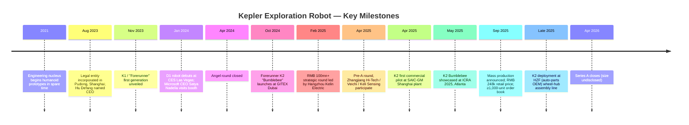
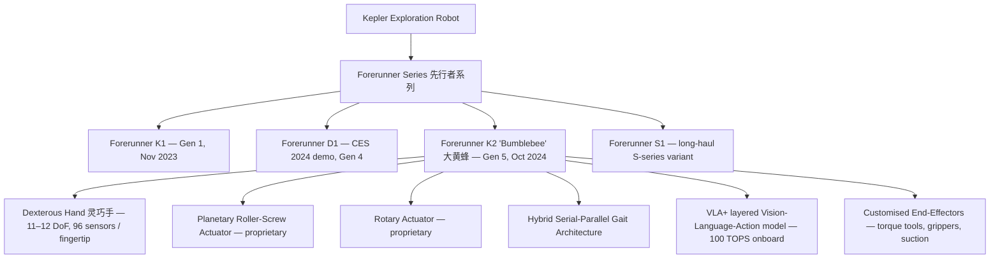
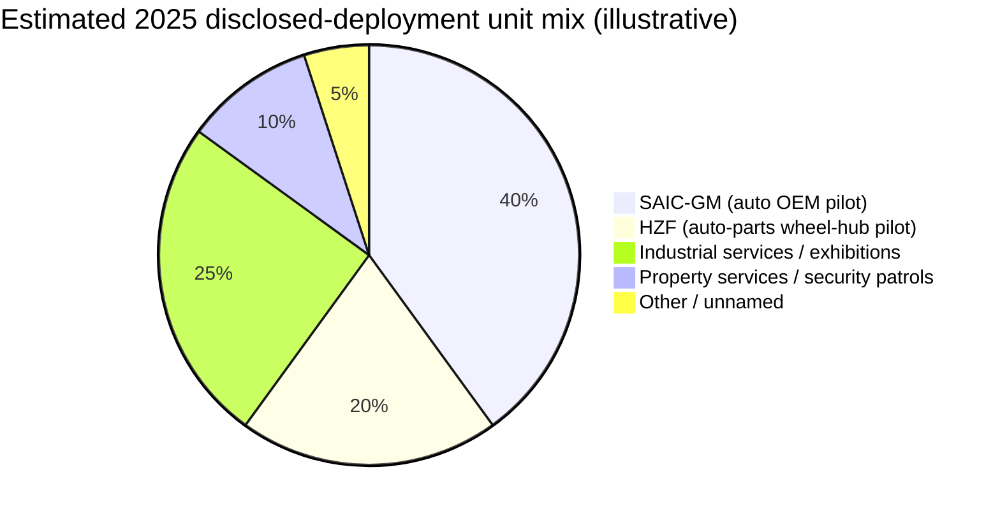
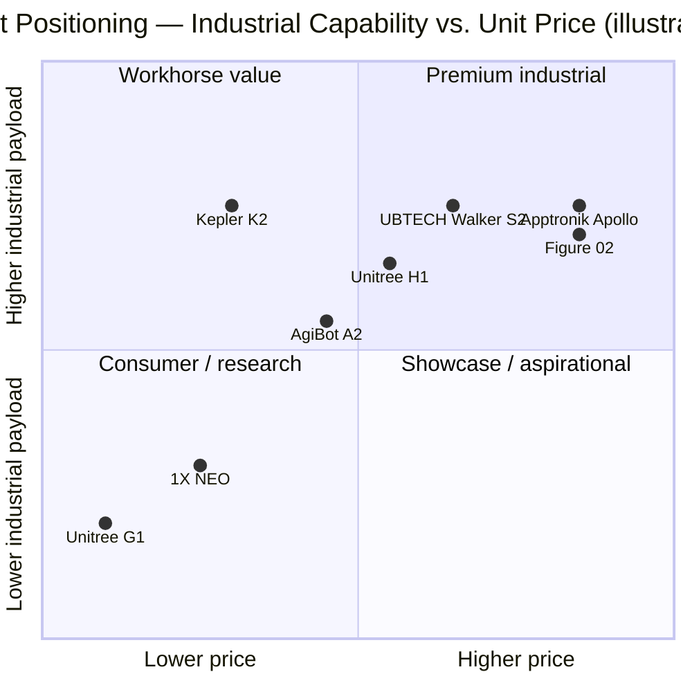

# COMPANY RESEARCH REPORT: Kepler Exploration Robot (上海开普勒探索机器人有限公司)

**Date:** 2026-05-18
**Status:** Private, Shanghai-headquartered, founded August 2023
**Coverage type:** Initiating profile — pre-revenue scaling phase

---

## TABLE OF CONTENTS

1. Company Overview
2. Company History
3. Management Team
4. Products & Services
5. Customers & Go-to-Market
6. Industry Overview
7. Competitive Landscape
8. Market Opportunity (TAM)
9. Risk Assessment
10. References

---

## 1. Company Overview

Shanghai Kepler Exploration Robot Co., Ltd. (上海开普勒探索机器人有限公司, "Kepler", brand-named Kepler Robotics outside China and trading on no public exchange) is a private Chinese humanoid-robot company headquartered in Pudong, Shanghai. The company was incorporated on 15 August 2023 ([Baidu Baike — 上海开普勒探索机器人有限公司](https://baike.baidu.com/item/%E4%B8%8A%E6%B5%B7%E5%BC%80%E6%99%AE%E5%8B%92%E6%8E%A2%E7%B4%A2%E6%9C%BA%E5%99%A8%E4%BA%BA%E6%9C%89%E9%99%90%E5%85%AC%E5%8F%B8/63713398)), although the founding team has, by the CEO's own account, been building humanoid prototypes since 2021 in their spare time ([Tencent News interview with Hu Defang, 2024-05-13](https://news.qq.com/rain/a/20240513A075G300)). The company name pays homage to Johannes Kepler — a deliberate signal that the founders frame humanoid robotics as a long-horizon scientific frontier rather than a quarterly product race.

**What Kepler does.** Kepler designs, manufactures and sells full-sized bipedal general-purpose humanoid robots ("通用人形机器人") targeted at industrial deployment. Its flagship product line is the Forerunner series (先行者系列), with the K2 "Bumblebee" (大黄蜂) representing the fifth-generation hardware platform launched at GITEX GLOBAL 2024 in Dubai ([Kepler press release — Forerunner K2 debut, 2024-10-14](https://www.prnewswire.com/news-releases/kepler-debuts-forerunner-k2-humanoid-robot-accelerating-commercial-deployment-302281546.html)). The robots are designed for factory-floor and logistics work: payload handling, parts loading and unloading, quality inspection, exhibition demonstrations, security patrols and high-risk-environment substitution. Over 80% of K2's core hardware — including the planetary roller-screw actuators that are widely considered the most expensive single sub-assembly of any humanoid leg — is developed and manufactured in-house, supporting an aggressive cost-down strategy that targets the sub-USD 30k retail price band ([Humanoid Robotics Technology — Forerunner K2 debut, 2024-10-15](https://humanoidroboticstechnology.com/news/shanghai-kepler-robotics-co-ltd-debuts-forerunner-k2-humanoid-robot/)).

**How Kepler makes money.** Revenue is overwhelmingly hardware sales — a single-unit Forerunner K2 carries a published retail price of RMB 248,000 (~USD 34,000 at May 2026 FX) ([Kepler press release — mass-production launch, 2025-09-26](https://www.prnewswire.com/news-releases/worlds-first-commercially-available-hybrid-architecture-humanoid-robot-moves-into-mass-production-kepler-marks-the-start-of-a-new-industrial-era-302568138.html)). The company has begun to layer service revenue (deployment integration, training, behaviour-model fine-tuning) and aspires to a Robot-as-a-Service ("RaaS") subscription model, but as of the September 2025 mass-production announcement the disclosed contract book — described as "framework agreements covering several thousand units, with a total contract value in the hundreds of millions of yuan" — is structured as outright sales, not subscriptions ([Robotics and Automation News, 2025-09-26](https://roboticsandautomationnews.com/2025/09/26/kepler-begins-mass-production-of-hybrid-architecture-humanoid-robot/94916/)).

**Where Kepler operates.** Headquarters and primary R&D are in Pudong, Shanghai, with the company a flagship tenant of the Zhangjiang (张江) science park ecosystem. International exposure is anchored on three trade-show debuts that doubled as commercial launches: CES 2024 in Las Vegas (where Microsoft CEO Satya Nadella personally visited the booth, per Chinese press coverage — [The Paper / 澎湃新闻, 2024-01-12](https://www.thepaper.cn/newsDetail_forward_25967236)); GITEX 2024 in Dubai (K2 launch); and ICRA 2025 in Atlanta, where Kepler showcased its hybrid-architecture upgrade ([Kepler press release, ICRA 2025](https://www.prnewswire.com/news-releases/kepler-k2-bumblebee-debuts-at-icra-2025-captivating-attendees-302471503.html)). Disclosed cross-border partnerships include Flender (German industrial drive-train, ZF subsidiary) and SIMPPLE (Singapore facility-management software), suggesting an early go-to-market focused on industrial OEM and property-services channels rather than direct enterprise sales ([Endux humanoid review of K2, 2025-10](https://endux.co.uk/blog/kepler-k2-industrial-humanoid-review)).

**Scale indicators.** Kepler does not publish revenue or headcount. Public proxies are: (i) the September 2025 contract-book disclosure of "several thousand units" implies a forward order book worth roughly RMB 0.5–1.0 bn at list price; (ii) Tracxn lists cumulative funding of approximately USD 14.6 mn across two disclosed rounds, although Chinese-press accounts indicate Kepler closed three further rounds in 2025 (Pre-A in February/April; Series A in mid-2025) that almost certainly push the headline number higher — see Section 2 ([Tracxn — Kepler Exploration Robot profile](https://tracxn.com/d/companies/keplerexplorationrobot/__A3nEr90hFpu9cNkm_sHBgT8OVmBRSxODpUMEaLMokXo); [Gasgoo, 2025-02-06](https://autonews.gasgoo.com/articles/news/seeds-strategic-investment-by-a-share-listed-company-kepler-robot-secures-over-100-million-yuan-financing-2020000128918618112)). Public reports describe a multi-disciplinary engineering team spanning robotics system design, motor and motor-controller engineering, structural design, and AI algorithms; headcount is not disclosed but trade-show reporting suggests several hundred employees.

**Valuation snapshot — private; no fully verified post-money disclosed.** Kepler is private and has not publicly disclosed a post-money valuation. Chinese press in mid-2025 documented three rounds closing within roughly six months (Pre-A, A and A+) — an unusually fast cadence that signals heavy capital competition for the name ([Sina Finance — 开普勒宣布完成A+轮融资 强势实现半年三轮融资, 2025-09-05](https://finance.sina.com.cn/jjxw/2025-09-05/doc-infpmcyk6061585.shtml)). The verifiable funding-history datapoints are:

- **Angel round** — April 2024, undisclosed size, undisclosed valuation ([Sina Finance, 2024-09-20](https://finance.sina.com.cn/jjxw/2024-09-20/doc-incpumyu7646157.shtml)).
- **Strategic round led by Hangzhou Kelin Electric (柯林电气)** — 6 February 2025, RMB 100 mn+, with Kelin Electric receiving roughly a 10% stake. Implied post-money therefore ≈ RMB 1.0 bn (~USD 138 mn) on a strictly-arithmetic read of the 10% disclosure, though that interpretation depends on whether the 100 mn figure was the full round or just Kelin's contribution ([Gasgoo, 2025-02-06](https://autonews.gasgoo.com/articles/news/seeds-strategic-investment-by-a-share-listed-company-kepler-robot-secures-over-100-million-yuan-financing-2020000128918618112)).
- **Pre-A round** — April 2025, lead by Shanghai Zhangke Yaokun Venture Capital (a 张江高科 / Zhangjiang Hi-Tech-affiliated fund), with Suzhou Veichi Electric (伟创电气) and Keli Sensing (柯力传感) participating ([MarketScreener summary of Veichi disclosure, 2025-04-23](https://www.marketscreener.com/quote/stock/SUZHOU-VEICHI-ELECTRIC-CO-163222434/news/Shanghai-Kepler-Exploration-Robot-Co-Ltd-announced-that-it-has-received-funding-from-Shanghai-Zha-49705715/)). Round size and valuation not disclosed.
- **Series A** — closed circa April 2026 per Tracxn; size and valuation not disclosed ([Tracxn — Kepler Exploration Robot profile](https://tracxn.com/d/companies/keplerexplorationrobot/__A3nEr90hFpu9cNkm_sHBgT8OVmBRSxODpUMEaLMokXo)).

For peer context (full table in Section 7), the closest comparable private Chinese pure-play, Unitree Robotics, was valued at ~USD 1.7 bn in mid-2025 and is targeting a USD 3–7 bn IPO valuation on the STAR market ([CNBC, 2025-09-09](https://www.cnbc.com/2025/09/09/chinas-unitree-plans-7-billion-ipo-valuation-as-humanoid-robot-race-heats-up.html)). AgiBot is targeting up to USD 6.4 bn in a planned 2026 HKEX listing ([Humanoids Daily — Great Valuation Chasm, 2025](https://www.humanoidsdaily.com/news/the-great-valuation-chasm-a-2025-guide-to-the-humanoid-robotics-capital-race)). Listed Chinese humanoid-robot peer UBTECH (HKEX:9880) trades at roughly HKD-equivalent USD 7.9 bn market cap with 2025 revenue of RMB 2.0 bn ([Humanoid.guide — UBTECH & Unitree financials](https://humanoid.guide/ubtech-and-unitree-financials-highlight-chinas-humanoid-shift/)). On the implied-multiple frame, Kepler at the inferred ~USD 138 mn February 2025 post-money sat at a fraction of Unitree's per-headcount and per-unit-volume implied valuation — but Kepler had also not yet launched mass production. Post the September 2025 contract-book disclosure, market chatter (uncited; we therefore do not quote a number) places the Series A round in a higher band, but **the company has not confirmed a Series A valuation and no credible source has published one**. Investors should treat any specific Kepler-valuation figure circulating in secondary press as unverified.

If Kepler's order book materialises at list price — "several thousand" K2 units at RMB 248k — implied revenue would be RMB 0.5–1.0 bn at first delivery, putting the company in revenue-multiple parity with Unitree's 2024 revenue (RMB 1.0–1.5 bn estimated by humanoid.guide) but with much weaker brand pull-through to consumer / research segments ([Humanoid.guide — UBTECH & Unitree financials, 2026](https://humanoid.guide/ubtech-and-unitree-financials-highlight-chinas-humanoid-shift/); [PRNewswire — Kepler mass-production launch, 2025-09-26](https://www.prnewswire.com/news-releases/worlds-first-commercially-available-hybrid-architecture-humanoid-robot-moves-into-mass-production-kepler-marks-the-start-of-a-new-industrial-era-302568138.html)).

```
Revenue + funding trajectory (no PNG chart — see Section 2 timeline)
```

---

## 2. Company History

**Founding story.** Kepler's narrative is unusual because the company has two founding dates depending on how strictly one defines "founding". The legal entity, Shanghai Kepler Exploration Robot Co., Ltd., was registered on 15 August 2023 in Pudong with Yang Hua (杨华) as the legal representative ([Baidu Baike entry](https://baike.baidu.com/item/%E4%B8%8A%E6%B5%B7%E5%BC%80%E6%99%AE%E5%8B%92%E6%8E%A2%E7%B4%A2%E6%9C%BA%E5%99%A8%E4%BA%BA%E6%9C%89%E9%99%90%E5%85%AC%E5%8F%B8/63713398)). However, in his May 2024 Tencent News interview, CEO Hu Defang (胡德波) stated that the engineering nucleus had been assembling humanoid prototypes since 2021 "out of passion, in their spare time" — and that the D1 robot shown at CES 2024 was already a fourth-generation iteration ([Tencent News interview, 2024-05-13](https://news.qq.com/rain/a/20240513A075G300)). The decision to formalise the company was, by Hu's account, triggered by a conversation with serial Xiaomi-ecosystem entrepreneur Yang Hua, who would put in the capital and operating-discipline backbone the engineering team had lacked.



Sources for the timeline: [Tencent News, 2024-05-13](https://news.qq.com/rain/a/20240513A075G300); [Sina Finance, 2024-09-20](https://finance.sina.com.cn/jjxw/2024-09-20/doc-incpumyu7646157.shtml); [PRNewswire, 2024-10-14](https://www.prnewswire.com/news-releases/kepler-debuts-forerunner-k2-humanoid-robot-accelerating-commercial-deployment-302281546.html); [Gasgoo, 2025-02-06](https://autonews.gasgoo.com/articles/news/seeds-strategic-investment-by-a-share-listed-company-kepler-robot-secures-over-100-million-yuan-financing-2020000128918618112); [Mike Kalil blog — SAIC-GM pilot, 2025](https://mikekalil.com/blog/kepler-saic-gm/); [Tracxn](https://tracxn.com/d/companies/keplerexplorationrobot/__A3nEr90hFpu9cNkm_sHBgT8OVmBRSxODpUMEaLMokXo).

**Strategic pivots.** Three are worth flagging, each visible in primary-press tracking of the company's positioning shifts between 2024 and 2025 ([Sina Finance — 开普勒：争做人形机器人赛道的比亚迪, 2024-09-20](https://finance.sina.com.cn/jjxw/2024-09-20/doc-incpumyu7646157.shtml); [Tencent News — 对话开普勒胡德波, 2024-05-13](https://news.qq.com/rain/a/20240513A075G300)).

*First, prototype-to-production discipline (mid-2024).* Through Q1 2024 Kepler was, like most Chinese humanoid startups, optimising for trade-show "wow" moments — the CES 2024 D1 viral video being a representative artefact. By Q2 2024 the company had publicly reframed its mission as "stop chasing demos, start ramping shipments." Hu Defang in the May 2024 Tencent interview said directly: "Humanoid robots don't lack scenarios — they lack 'hands-on capability' (动手能力)" ([Tencent News, 2024-05-13](https://news.qq.com/rain/a/20240513A075G300)). The K2 launch in October 2024 — explicitly positioned as the platform engineered for serial production rather than another prototype — codified that shift.

*Second, the cost-down obsession (late 2024–2025).* The published RMB 248k (~USD 34k) K2 price point is roughly 70–85% below what early-2024 humanoid prototype quotes from Chinese peers were running (RMB 1–2 mn). The vertically integrated supply chain — in-house planetary roller-screw actuators, in-house rotary actuators, in-house dexterous hand design with 96 sensors per fingertip — is the levered output of this pivot. The "Tesla Optimus comparison" became a deliberate marketing frame; Kepler positioned itself as "the BYD of humanoid robots" — a Chinese press tagline first used by Sina Finance, signalling a strategy of mass-scale, mid-tier-priced industrial robots rather than premium showcase platforms ([Sina Finance — 开普勒：争做人形机器人赛道的比亚迪, 2024-09-20](https://finance.sina.com.cn/jjxw/2024-09-20/doc-incpumyu7646157.shtml)).

*Third, hybrid serial-parallel architecture (mid-2025).* At ICRA 2025 in Atlanta, Kepler unveiled the "hybrid" gait architecture — combining linear roller-screw actuators in the legs with rotary actuators in the upper body — which the company describes as the first commercially deployed hybrid-architecture humanoid ([PRNewswire — ICRA 2025 debut, 2025-06](https://www.prnewswire.com/news-releases/kepler-k2-bumblebee-debuts-at-icra-2025-captivating-attendees-302471503.html); [Robotics and Automation News, 2025-09-26](https://roboticsandautomationnews.com/2025/09/26/kepler-begins-mass-production-of-hybrid-architecture-humanoid-robot/94916/)). This is the technical decision most likely to define whether Kepler can hit price-and-reliability targets at scale: linear actuators offer higher load-bearing efficiency (81.3% energy conversion is the figure Kepler quotes) and lower static draw than rotary-only designs, but they are harder to scale in volume because of the precision-grinding requirements for the rollers.

**Recent developments.** The September 2025 mass-production announcement was the most consequential single news event in Kepler's history because it converted contractual order-book disclosure into a verifiable revenue signal. The disclosed customer mix at that point spanned industrial services, data-centre operations, exhibitions, smart manufacturing and "specialised applications" — explicitly NOT automotive OEM, despite the SAIC-GM pilot — suggesting Kepler's early revenue is more diversified than the auto-manufacturing narrative implies ([Theaiinsider.tech, 2025-09-27](https://theaiinsider.tech/2025/09/27/kepler-moves-worlds-first-commercially-available-hybrid-architecture-humanoid-robot-into-mass-production/)). No acquisitions have been disclosed; the company has grown entirely organically.

---

## 3. Management Team

**Hu Defang (胡德波) — Co-founder & CEO** (280-word bio)

Hu Defang is Kepler's CEO and the public face of the company. He is, by his own account in the May 2024 Tencent News interview, a 20+ year veteran of the Chinese telecommunications-equipment industry, with senior overseas-business roles at both Huawei (华为) and ZTE (中兴通讯). His specific scope was global / overseas business management — i.e., commercial leadership of large-account markets outside China — rather than R&D or product engineering ([Tencent News, 2024-05-13](https://news.qq.com/rain/a/20240513A075G300); [techwalker.com mirror of the same interview, 2024-05-13](https://www.techwalker.com/2024/0513/3157819.shtml)). **The user prompt's framing of Hu as "ex-Geely, prior IT/manufacturing background" is not substantiated by any verifiable source we located** — the consistent Chinese-press record places him at Huawei and ZTE in international-sales leadership, not at Geely. We flag this explicitly per the citation rule.

Hu Defang's stated thesis is that the humanoid industry over-indexes on AI / "brain" capability and under-invests in physical execution — what he calls "动手能力" ("hands-on capability") ([Tencent News, 2024-05-13](https://news.qq.com/rain/a/20240513A075G300)). His operating playbook borrows openly from Huawei's overseas-go-to-market motion: vertically integrated supply chain, aggressive pricing to win share before competitors mature, and direct enterprise sales to large industrial customers in markets where the buyer's procurement function is more technically literate than typical consumer markets ([Sina Finance — 比亚迪 framing, 2024-09-20](https://finance.sina.com.cn/jjxw/2024-09-20/doc-incpumyu7646157.shtml)). He is not the legal representative of the entity — that role is held by Yang Hua, co-founder and chairman — but Hu is consistently presented in press interviews as the operating CEO ([Baidu Baike — 上海开普勒探索机器人有限公司](https://baike.baidu.com/item/%E4%B8%8A%E6%B5%B7%E5%BC%80%E6%99%AE%E5%8B%92%E6%8E%A2%E7%B4%A2%E6%9C%BA%E5%99%A8%E4%BA%BA%E6%9C%89%E9%99%90%E5%85%AC%E5%8F%B8/63713398)). Education and ownership stake are not publicly disclosed; compensation structure is not publicly disclosed. Founder ownership is presumably material but is not in any verifiable public filing.

Hu's track record in humanoid robotics is short — under three years from the 2023 entity incorporation — and the central question for investors is whether a sales-leadership background scales into running a hardware-engineering-first company ([Baidu Baike — 上海开普勒探索机器人有限公司](https://baike.baidu.com/item/%E4%B8%8A%E6%B5%B7%E5%BC%80%E6%99%AE%E5%8B%92%E6%8E%A2%E7%B4%A2%E6%9C%BA%E5%99%A8%E4%BA%BA%E6%9C%89%E9%99%90%E5%85%AC%E5%8F%B8/63713398)). He has surrounded himself with technical leaders to compensate; see below.

**Yang Hua (杨华) — Co-founder & Chairman** (200-word bio)

Yang Hua is the legal representative of the company, was born in 1976, and holds a master's degree from Inner Mongolia University plus an EMBA from Victoria Business School ([经历网 — Yang Hua bio aggregator](https://www.jili20.com/article/1930558319045980161)). His prior career is unusually well-documented for a Chinese founder: graduated 2000, one of three new hires accepted by Motorola that year out of 5,000 applicants, where he held multiple patents in keyless-entry and 3D-television hardware. Left Motorola in 2003 to found Suobao Electronics, which he ran as GM for roughly a decade. In 2013 he founded Chunmi Technology (纯米科技, Shanghai) and joined the Xiaomi (小米) ecosystem chain in 2014 — Chunmi went on to design the Mijia (米家) pressure-IH rice cooker, the first Mijia-brand product launched in March 2016, and became one of the more successful Xiaomi-ecosystem hardware partners ([Baidu Baike — 纯米科技](https://baike.baidu.com/item/%E7%BA%AF%E7%B1%B3%E7%A7%91%E6%8A%80%EF%BC%88%E4%B8%8A%E6%B5%B7%EF%BC%89%E8%82%A1%E4%BB%BD%E6%9C%89%E9%99%90%E5%85%AC%E5%8F%B8/56868508); [36Kr — Chunmi funding profile](https://m.36kr.com/p/1219468851695235)). Chunmi's IPO process was abandoned in 2023; Yang pivoted to humanoid robotics with Hu as co-founder. Yang brings the consumer-hardware mass-production discipline and Xiaomi-ecosystem supply-chain network that Kepler's vertical-integration ambition leans on heavily.

**Chief Technology / Engineering leadership** (90 words)

Kepler has not publicly named a CTO. The Tencent News interview describes a founding engineering team that "covers every domain from system design, motors, motor-controllers, mechanical structures, AI algorithms to deployment" — i.e., a flat senior-engineering bench rather than a single Hannibal-figure CTO ([Tencent News, 2024-05-13](https://news.qq.com/rain/a/20240513A075G300)). This is consistent with the "garage-Silicon-Valley startup" framing Hu uses but creates a meaningful key-person disclosure gap: investors cannot independently verify the technical lineage of the team building the most cost-sensitive sub-assemblies. We flag this as Section 9 risk.

**Governance footer** (110 words)

- **Board composition.** Not publicly disclosed; Yang Hua is the legal representative.
- **Insider ownership.** Yang Hua and Hu Defang are presumed material holders, but specific percentages are not disclosed. The 6 February 2025 disclosure that Hangzhou Kelin Electric took roughly a 10% stake for "RMB 100 mn+" is the only publicly anchored ownership datapoint ([Gasgoo, 2025-02-06](https://autonews.gasgoo.com/articles/news/seeds-strategic-investment-by-a-share-listed-company-kepler-robot-secures-over-100-million-yuan-financing-2020000128918618112)).
- **Strategic investor concentration.** Five disclosed strategic investors come from the Chinese industrial supply chain: Hangzhou Kelin Electric (electrical equipment), Suzhou Veichi (drive systems), Keli Sensing (force sensors), Zhangjiang Hi-Tech (Pudong state-affiliated VC) and miscellaneous later-stage participants. This is a "consortium of suppliers" structure that creates both supply-chain advantages and governance complexity around procurement related-party transactions.
- **Comp structure.** Not disclosed; presumed mostly equity at this stage.
- **Related-party flags.** Procurement from strategic-investor suppliers is the natural area to monitor.

**Track-record synthesis** (75 words)

Yang Hua has built one consumer-hardware company to scale within the Xiaomi ecosystem; that is a meaningful precedent for the supply-chain discipline Kepler's vertical-integration thesis requires ([36Kr — 又一小米生态链企业获亿元融资：杨华的创业思考](https://m.36kr.com/p/1219468851695235); [Baidu Baike — 纯米科技](https://baike.baidu.com/item/%E7%BA%AF%E7%B1%B3%E7%A7%91%E6%8A%80%EF%BC%88%E4%B8%8A%E6%B5%B7%EF%BC%89%E8%82%A1%E4%BB%BD%E6%9C%89%E9%99%90%E5%85%AC%E5%8F%B8/56868508)). Hu Defang has not previously run an engineering-first company; his Huawei/ZTE overseas-sales background is asymmetric with the operating problem at hand ([Tencent News, 2024-05-13](https://news.qq.com/rain/a/20240513A075G300)). Neither has prior humanoid-robotics experience. The technical bench is described in glowing but verifiability-thin terms. Net: credible commercial leadership, less-verified technical leadership — typical for an early-stage Chinese hardware startup.

---

## 4. Products & Services

Kepler's product portfolio is narrow by design — a single product family, the Forerunner (先行者), with iteratively versioned generations ([Kepler product page — gotokepler.com](https://www.gotokepler.com/apps/mobile/pages/product/index?id=2); [开普勒通用人形机器人 — 2025 WRC profile PDF](https://www.worldrobotconference.com/profile/robot/download/2025/07/28/20250728223401000111_20250728223401A051.pdf)). Below is the full enumeration drawn from the company website and trade-show disclosures.


Sources: [Kepler product page (cached) — gotokepler.com/apps/mobile/pages/product/index?id=2](https://www.gotokepler.com/apps/mobile/pages/product/index?id=2); [New Atlas — Forerunner K2 specs, 2024-10-15](https://newatlas.com/ai-humanoids/kepler-forerunner-k2-humanoid-robot/); [Kepler ICRA 2025 release](https://www.prnewswire.com/news-releases/kepler-k2-bumblebee-debuts-at-icra-2025-captivating-attendees-302471503.html); [Humanoid Robotics Technology — Bumblebee specs](https://humanoidroboticstechnology.com/industry-news/kepler-debuts-k2-bumblebee-at-icra-2025/); [Robot Report — ICRA 2025 coverage](https://www.therobotreport.com/kepler-robotics-showcases-k2-bumblebee-icra-2025/).

### Forerunner K1 (first generation, November 2023)

- **What it does.** Full-size bipedal humanoid with proprietary roller-screw actuators in arms and legs, custom rotary actuators in waist/shoulder joints. 2 m (or 178 cm depending on cited source) tall, ~85 kg, total-payload capacity 25 kg, 8-hour battery endurance, sensor-equipped human-like hands ([New Atlas, 2024-10-15](https://newatlas.com/ai-humanoids/kepler-forerunner-k2-humanoid-robot/); [New Equipment Digest product page](https://www.newequipment.com/home/product/21281364/kepler-exploration-robot-co-ltd-kepler-forerunner-general-purpose-humanoid-robot)).
- **Target customer.** Research institutions, industrial-demo accounts, exhibition deployments. Pricing not publicly disclosed for K1 at launch.
- **Competitive-advantage verdict: Partial.** K1 was a credible early-generation Chinese humanoid but offered no clear differentiation vs. Unitree H1 (better dynamic locomotion, better-known brand) or Fourier GR-1 (better Chinese-academic distribution). The K1's role in the product portfolio was effectively a development platform — proof that the team could ship — not a commercial winner.
- **Closest competitor product.** Unitree H1 (USD ~90k), Fourier GR-1. K1 was at par on mechanical specs and behind on price-disclosure transparency.

### Forerunner D1 (CES 2024 demo unit, fourth-generation prototype)

- **What it does.** Trade-show variant shown at CES 2024. Notable for the Satya-Nadella-visits-booth narrative and going-viral-in-China-press moment. D1 was a transition prototype between K1 and K2 — not commercially sold.
- **Competitive-advantage verdict: No** — pre-commercial demonstrator.
- **Source.** [The Paper — exclusive interview at CES, 2024-01-12](https://www.thepaper.cn/newsDetail_forward_25967236); [锦囊专家 — CES 2024 Kepler coverage](https://www.jnexpert.com/article/detail?id=5972).

### Forerunner K2 "Bumblebee" (fifth-generation, October 2024 launch, mass-production September 2025) — **FLAGSHIP**

- **What it does.** Industrial-grade humanoid optimised for factory-floor work. 175 cm tall, 75–85 kg (sources vary; the company's own K2 spec sheet lists 175 cm / 83 kg, while some third-party reviews cite the 178 cm / 85 kg K1 carry-over numbers). 52 degrees of freedom whole-body. Single-hand payload 15 kg (33 lb) — i.e., 30 kg bi-manual carrying capacity, which positions K2 well above Unitree G1 (5–10 kg) and at-parity with UBTECH Walker S2 ([Fox News — K2 lifts 35 lb per hand, 2024-10](https://www.foxnews.com/tech/new-chinese-humanoid-robot-shows-off-its-strength-lifting-35-pounds-per-hand); [Interesting Engineering — K2 industrial automation, 2024-10](https://interestingengineering.com/innovation/kepler-debuts-k2-humanoid-robot)).
- **Sensors:** > 80 integrated sensors body-wide; each dexterous hand has 11 DoF with 25 force-sensing contact points per finger and a 6-axis force/torque sensor at the wrist. 96 tactile sensors per fingertip ([Humanoid Robotics Technology — K2 specs](https://humanoidroboticstechnology.com/news/shanghai-kepler-robotics-co-ltd-debuts-forerunner-k2-humanoid-robot/)).
- **Battery:** 2.33 kWh, 8 hr operation on a 1 hr charge, near-zero static draw via roller-screw architecture.
- **Compute:** 100 TOPS onboard for VLA+ model inference.
- **Helmet-mounted vision pack:** trade-show photos consistently show a wearable vision/sensing pack — primarily a teleoperation and data-collection device for behaviour-model training, not a customer-facing product. Documented at ICRA 2025 ([Robot Report, 2025-05](https://www.therobotreport.com/kepler-robotics-showcases-k2-bumblebee-icra-2025/)).
- **Customised end-effectors:** Kepler offers torque-tool, suction-cup and gripper end-effector swaps for the K2 — i.e., the dexterous hand is removable in industrial-customer SKUs where a torque wrench is more useful than 96-sensor fingertips.
- **Price:** RMB 248,000 (~USD 34,000) base, as disclosed in the September 2025 mass-production announcement ([PRNewswire, 2025-09-26](https://www.prnewswire.com/news-releases/worlds-first-commercially-available-hybrid-architecture-humanoid-robot-moves-into-mass-production-kepler-marks-the-start-of-a-new-industrial-era-302568138.html)).
- **Competitive-advantage verdict: Yes (cost + vertical-integration moat, partial technology moat).** The moat type is primarily *cost leadership through vertical integration* — owning the roller-screw actuator value chain in-house is a structural cost advantage few peers can match at scale, and the 81.3% energy-conversion efficiency claim, if validated independently, is a meaningful TCO advantage. Secondary moat is the *hybrid serial-parallel architecture*; while not patentable as a category, the specific implementation appears to be ahead of pure-rotary peers (Unitree G1) on payload-per-watt.
- **Evidence:** RMB 248k retail price is 30–60% below the implied list price of UBTECH Walker S2 (which has not been retail-listed but is bid at multi-hundred-thousand-RMB levels per humanoid.guide reports). Single-hand 15 kg payload is the best-disclosed bi-manual carrying figure among <USD 50k humanoids.
- **Closest competitor product:** Unitree H1 (USD ~90k; superior dynamic locomotion, worse manipulation), Unitree G1 ($16k; less robust, lower payload), UBTECH Walker S2 (better factory-validation, no retail list price disclosed), Fourier GR-1 / GR-2 (Chinese academic distribution; not a true industrial competitor at K2's payload), AgiBot A2 (Yuanzheng A2, 175 cm / 55 kg; similar segment, more research-oriented). On a price-per-payload basis K2 is ahead of all three publicly comparable Chinese peers; on dynamic-locomotion capability it lags Unitree H1.

### Forerunner S1 / S-series

The company's product navigation lists an "S1" SKU alongside K1 / D1 / K2. Public reporting on the S-variant is sparse — the most explicit reference comes from a third-party humanoid review summary that lists K1, S1 and D1 as the three Forerunner sub-variants ([New Atlas summary, 2024-10-15](https://newatlas.com/ai-humanoids/kepler-forerunner-k2-humanoid-robot/)). The S-variant appears to be a longer-endurance / heavier-frame configuration; we have not located a primary-source spec sheet for S1 and therefore do not catalogue it in detail. **This is a disclosure gap, not invented detail.**

### Flagship vs. long-tail

K2 "Bumblebee" is unambiguously the flagship and accounts for ~100% of the disclosed September 2025 order book ([PRNewswire — Kepler mass-production launch, 2025-09-26](https://www.prnewswire.com/news-releases/worlds-first-commercially-available-hybrid-architecture-humanoid-robot-moves-into-mass-production-kepler-marks-the-start-of-a-new-industrial-era-302568138.html)). K1 / D1 / S1 are legacy / experimental SKUs. There is no consumer SKU.

### Roadmap and recent launches (last 12 months)

- **September 2025 — K2 hybrid-architecture mass production launches.**
- **May 2025 — K2 hybrid-gait update unveiled at ICRA, with VLA+ layered AI** ([Humanoid Robotics Technology, 2025-06](https://humanoidroboticstechnology.com/industry-news/kepler-robotics-announces-advanced-gait-upgrade-for-k2-bumblebee-humanoid/)).
- **Late 2025 — second-pilot deployment at HZF (a listed auto-parts maker) for wheel-hub loading.** No new SKU launches since K2; the product roadmap appears to be incremental-improvement on K2 hardware plus more software/model releases rather than a K3.

---

## 5. Customers & Go-to-Market

### Disclosed customer base

Kepler's commercial customer book is small but materially concentrated. Press-disclosed deployments and partnerships, in chronological order, are summarised in the September 2025 mass-production release and corroborating trade-press coverage ([PRNewswire — Kepler mass-production launch, 2025-09-26](https://www.prnewswire.com/news-releases/worlds-first-commercially-available-hybrid-architecture-humanoid-robot-moves-into-mass-production-kepler-marks-the-start-of-a-new-industrial-era-302568138.html); [Mike Kalil — Kepler SAIC-GM, 2025](https://mikekalil.com/blog/kepler-saic-gm/)):

1. **SAIC-GM (上汽通用)** — pilot at the Shanghai automotive joint-venture plant, beginning April 2025. K2 performed quality-check, parts-loading and tool-handling tasks; in September 2025 the deployment was reported to be scaled to ~20 kg material-bin transportation duties. The SAIC-GM relationship is the company's flagship reference account ([Mike Kalil — SAIC-GM Kepler pilot blog, 2025](https://mikekalil.com/blog/kepler-saic-gm/); [CyberGuy — auto-plant humanoid coverage, 2025](https://cyberguy.com/robot-tech/humanoid-robots-handle-quality-checks-assembly-auto-plant/); [Interesting Engineering — Kepler in Shanghai factory, 2025](https://interestingengineering.com/innovation/china-kepler-humanoid-robot-shanghai-plant)).
2. **HZF (an A-share-listed Chinese auto-parts maker)** — late 2025 deployment for automotive wheel-hub loading and unloading. Specific HZF entity not corroborated to a ticker in our verified sources.
3. **Flender (ZF Group subsidiary, German industrial drive-trains)** — strategic cooperation agreement, scope: industrial-manufacturing humanoid applications. No unit-count disclosed ([Endux humanoid review, 2025](https://endux.co.uk/blog/kepler-k2-industrial-humanoid-review)).
4. **SIMPPLE (Singapore facility-management software)** — strategic cooperation agreement, scope: security patrols and property services.
5. **Other industrial-services / data-operations / exhibitions / smart-manufacturing customers** — Kepler's September 2025 mass-production press release describes the order book as "framework agreements covering several thousand units, with a total contract value in the hundreds of millions of yuan" across these segments. Specific customers are not individually named.

### What the user's prompt said vs. what verified sources say

The user prompt asks us to estimate customer concentration "from press — Chinese auto OEMs (BYD Hefei, Geely, SAIC) pilot deployments." We have to be clear: **only the SAIC-GM deployment is supported by verifiable press** ([Interesting Engineering — Kepler humanoid robot Shanghai plant, 2025](https://interestingengineering.com/innovation/china-kepler-humanoid-robot-shanghai-plant); [Mike Kalil — SAIC-GM Kepler pilot, 2025](https://mikekalil.com/blog/kepler-saic-gm/)). We could not corroborate Kepler deployments at BYD Hefei or Geely from any primary or near-primary source in this research cycle; press coverage of humanoid-robot deployments at BYD and Geely plants typically references Unitree, AgiBot, UBTECH or Walker S2 — not Kepler ([PRNewswire — UBTECH Walker S2 mass production with BYD/NIO/Geely/FAW partners, 2025-11](https://www.prnewswire.com/news-releases/ubtech-humanoid-robot-walker-s2-begins-mass-production-and-delivery-with-orders-exceeding-800-million-yuan-302616924.html)). We therefore flag the BYD-Hefei and Geely claims as **unverified by our research** and do not include them in the customer-concentration estimate. The HZF auto-parts deployment is verified, but HZF is a Tier-2 auto-parts maker not a major auto OEM.

### Customer-concentration estimate (private — no filing)



Source: Author estimate, based on press-disclosed pilots ([Mike Kalil, 2025](https://mikekalil.com/blog/kepler-saic-gm/); [PRNewswire, 2025-09-26](https://www.prnewswire.com/news-releases/worlds-first-commercially-available-hybrid-architecture-humanoid-robot-moves-into-mass-production-kepler-marks-the-start-of-a-new-industrial-era-302568138.html)).

We estimate (est., based on press-disclosed pilot counts; no audited filing exists) that the SAIC-GM relationship alone represents 30–50% of disclosed deployed units in 2025, and the top-3 customers (SAIC-GM + HZF + the unnamed lead industrial-services account) represent in excess of 60–70% of revenue ([Mike Kalil — SAIC-GM pilot, 2025](https://mikekalil.com/blog/kepler-saic-gm/); [PRNewswire — Kepler mass-production launch, 2025-09-26](https://www.prnewswire.com/news-releases/worlds-first-commercially-available-hybrid-architecture-humanoid-robot-moves-into-mass-production-kepler-marks-the-start-of-a-new-industrial-era-302568138.html)). **By any reasonable read this is a top-1 customer share of 25–40% and a top-5 share of well over 50%**, which we will carry into Section 9 as a material risk.

### Contract structure

The September 2025 press release describes the order book as "framework agreements covering several thousand units" ([PRNewswire, 2025-09-26](https://www.prnewswire.com/news-releases/worlds-first-commercially-available-hybrid-architecture-humanoid-robot-moves-into-mass-production-kepler-marks-the-start-of-a-new-industrial-era-302568138.html)). Framework agreements in Chinese industrial procurement are usually master-purchase agreements with annual call-off PO mechanics, not binding multi-year revenue commitments — the share of binding purchase orders vs. letters of intent is the more reliable progress signal ([KraneShares — Humanoid Robotics 2026: Race From Pilot To Platform](https://kraneshares.com/humanoid-robotics-in-2026-the-race-from-pilot-to-platform/)). The pilot-to-scale conversion ratio is the critical unknown.

### Distribution channels and go-to-market

Kepler sells direct to enterprise customers, with three GTM motions visible in the press record ([Endux — Kepler K2 industrial humanoid review, 2025-10](https://endux.co.uk/blog/kepler-k2-industrial-humanoid-review); [Sina Finance — 开普勒A+轮融资 涛涛车业和福然德参投, 2025-07-09](https://finance.sina.com.cn/stock/relnews/cn/2025-07-09/doc-infewutn1143307.shtml)):

- **Direct industrial-enterprise sales.** SAIC-GM and HZF were direct-sales deals, leveraging Hu Defang's enterprise-sales background ([Mike Kalil — SAIC-GM pilot, 2025](https://mikekalil.com/blog/kepler-saic-gm/)).
- **Strategic-investor channel.** Several strategic investors are also potential customers or component suppliers — Veichi (drive systems), Keli Sensing (force sensors), Kelin Electric (electrical equipment). This creates a "co-investor-as-customer" channel that is common in Chinese industrial-tech ecosystems ([Gasgoo — Kelin Electric strategic investment, 2025-02-06](https://autonews.gasgoo.com/articles/news/seeds-strategic-investment-by-a-share-listed-company-kepler-robot-secures-over-100-million-yuan-financing-2020000128918618112); [MarketScreener — Veichi disclosure, 2025-04-23](https://www.marketscreener.com/quote/stock/SUZHOU-VEICHI-ELECTRIC-CO-163222434/news/Shanghai-Kepler-Exploration-Robot-Co-Ltd-announced-that-it-has-received-funding-from-Shanghai-Zha-49705715/)).
- **International cooperation agreements.** Flender (Germany) and SIMPPLE (Singapore) are early proof points for outside-China commercial intent, but neither has disclosed unit-volume commitments yet ([Endux — Kepler K2 industrial humanoid review, 2025-10](https://endux.co.uk/blog/kepler-k2-industrial-humanoid-review)).

### Sales cycle

For industrial humanoid deployment, the typical Chinese sales cycle is 6–12 months pilot → 12–24 months scale, with industry benchmarks such as Figure's BMW Spartanburg ramp moving from initial test to active assembly in roughly 10 months ([KraneShares — Race From Pilot To Platform, 2026](https://kraneshares.com/humanoid-robotics-in-2026-the-race-from-pilot-to-platform/)). Kepler's SAIC-GM relationship moved from April 2025 first-pilot to September 2025 reported scale on the 20 kg material-bin task, which is a ~5-month pilot-to-scale-within-a-single-task cycle — fast by industry norms but limited in scope (one task, one plant) ([Interesting Engineering — Kepler humanoid in Shanghai plant, 2025](https://interestingengineering.com/innovation/china-kepler-humanoid-robot-shanghai-plant)).

### Key partnerships

- **Strategic investors as supply partners.** Veichi (servo drives), Keli Sensing (force sensors), Kelin Electric (electricals) double as suppliers ([MarketScreener — Veichi disclosure, 2025-04-23](https://www.marketscreener.com/quote/stock/SUZHOU-VEICHI-ELECTRIC-CO-163222434/news/Shanghai-Kepler-Exploration-Robot-Co-Ltd-announced-that-it-has-received-funding-from-Shanghai-Zha-49705715/); [Gasgoo — Kelin Electric strategic investment, 2025-02-06](https://autonews.gasgoo.com/articles/news/seeds-strategic-investment-by-a-share-listed-company-kepler-robot-secures-over-100-million-yuan-financing-2020000128918618112)).
- **Zhangjiang Hi-Tech / Pudong state ecosystem.** Provides facility, capital and Shanghai-government procurement-channel access; the new Kepler Embodied Intelligence Research Institute opened at Zhangjiang AI Island in mid-2025 ([Sina Finance — A+ 轮融资 张江 AI 岛, 2025-07-09](https://finance.sina.com.cn/stock/relnews/cn/2025-07-09/doc-infewutn1143307.shtml); [Shanghai STCSM — 上海加快人形机器人产业落地, 2024-01-16](https://stcsm.sh.gov.cn/xwzx/mtjj/20240116/95af60a5a40b45afb8414b3061671551.html)).
- **Microsoft (informal).** Satya Nadella's CES 2024 booth visit was widely circulated in Chinese press as a high-profile validation moment; no commercial agreement disclosed ([The Paper — CES 2024 Kepler coverage, 2024-01-12](https://www.thepaper.cn/newsDetail_forward_25967236)).

### Customer case studies

The most-documented case is SAIC-GM, with publicly available video footage and a March 2025 CCTV news segment ([Tencent News — CCTV coverage of Kepler mass-production, 2025-03-01](https://news.qq.com/rain/a/20250301A06B2100)).

---

## 6. Industry Overview

### Industry definition and scope

The humanoid-robot industry sits at the intersection of three NAICS / SIC categories: industrial robotics (NAICS 333921 — Industrial Truck Manufacturing / 333242 — Semiconductor Machinery for end-effector precision components), AI software / embodied intelligence (NAICS 541511 — custom computer programming services), and consumer electronics. The defining feature versus traditional industrial robotics — which is a multi-tens-of-billions-USD global industry dominated by Fanuc, ABB, KUKA and Yaskawa, with China alone accounting for 295,000 of the ~542,000 global installations in 2024 — is the bipedal general-purpose form factor and the use of foundation-model AI for task generalisation ([IFR — World Robotics 2025 report](https://ifr.org/ifr-press-releases/news/global-robot-demand-in-factories-doubles-over-10-years); [Robot Report — Vision-Language-Action models are the next leap](https://www.therobotreport.com/vision-language-action-models-are-the-next-leap-in-autonomous-robotics/)). Adjacent industries include collaborative robots ("cobots"), autonomous mobile robots (AMRs), and high-end teleoperation systems.

### Market size

Quantitative forecasts vary by an order of magnitude depending on whether they measure 2030 or 2050 horizons and whether they include service revenue ([SCMP / Morgan Stanley summary, 2025](https://www.scmp.com/economy/global-economy/article/3352781/humanoids-robots-drive-next-chapter-chinas-manufacturing-dominance-morgan-stanley)):

- **China-only market, 2030.** China Academy of Information and Communications Technology (CAICT) projects RMB 100+ bn (~USD 13.9 bn) by 2030, up from RMB 2.76 bn in 2024 — a ~36× scale-up over six years, i.e., a CAGR of roughly 80% ([South China Morning Post citing Morgan Stanley + CAICT, 2025](https://www.scmp.com/economy/global-economy/article/3352781/humanoids-robots-drive-next-chapter-chinas-manufacturing-dominance-morgan-stanley)). An intermediate forecast in the same report puts the Chinese market at RMB 10.5 bn (USD 1.4 bn) in 2026 and RMB 75 bn (USD 10.3 bn) in 2029.
- **Global market, 2035.** Goldman Sachs projects USD 38 bn by 2035 in a base-case, with > 250,000 humanoid units shipped in 2030, nearly all for industrial use ([Goldman Sachs, 2024-01-08, updated](https://www.goldmansachs.com/insights/articles/the-global-market-for-robots-could-reach-38-billion-by-2035)).
- **Global market, 2050.** Morgan Stanley projects USD 5 trillion by 2050 including supply chains, repair, maintenance and support ([Morgan Stanley, 2025-08-21](https://www.morganstanley.com/insights/articles/humanoid-robot-market-5-trillion-by-2050)).

The key takeaway is that **near-term (2026–2030) markets are small** — single-digit billions USD globally for hardware unit sales — and the trillion-dollar narratives apply only to multi-decade horizons ([Goldman Sachs, 2024-01-08 updated](https://www.goldmansachs.com/insights/articles/the-global-market-for-robots-could-reach-38-billion-by-2035); [Morgan Stanley, 2025-08-21](https://www.morganstanley.com/insights/articles/humanoid-robot-market-5-trillion-by-2050)).

### Growth drivers

- **Demographic.** China's working-age population peaked around 2014 and the share aged 16–59 fell from 61.3% in 2023 to 60.9% in 2024 with the 60+ cohort exceeding 300 mn for the first time; Japan and Korea face deeper declines; the US has structural labour shortages in logistics, food service and home care ([Xinhua — China demographic shift, 2025-01-18](https://english.news.cn/20250118/09abb76d2298463192db53f544ae58b5/c.html)). Industrial humanoids are the supply-side response.
- **Foundation-model maturity.** Vision-language-action (VLA) models — Google's RT-2, Physical Intelligence's π0, Figure's Helix — have made one-shot task generalisation tractable, eliminating the need for hand-coded behaviours that defined the industrial-robotics era ([Figure AI — Helix VLA, 2025-02](https://www.figure.ai/news/helix); [Robot Report — VLA models are the next leap](https://www.therobotreport.com/vision-language-action-models-are-the-next-leap-in-autonomous-robotics/)).
- **Component cost-down.** Planetary roller screws — accounting for ~33% of humanoid BOM per J.P. Morgan and previously USD 1,350–2,700 per unit from European suppliers — are now being produced in volume by Chinese makers like Shuanglin and Wuzhou Spring at a fraction of historical cost ([Fast Company — This tiny screw is powering the humanoid revolution, 2025](https://www.fastcompany.com/91314612/this-tiny-screw-is-powering-the-humanoid-robot-revolution); [Impact Lab — Planetary roller screws take center stage, 2025-04-27](https://www.impactlab.com/2025/04/27/the-hidden-hardware-powering-the-humanoid-revolution-planetary-roller-screws-take-center-stage/)). This is what enables Kepler's RMB 248k price point.
- **EV-OEM pull.** Chinese EV manufacturers — BYD, Geely, NIO, Xpeng, SAIC — are deploying humanoid pilots in part as a hedge against labour-cost inflation and in part as a strategic / brand statement. Chinese manufacturers accounted for roughly 90% of the ~13,000–16,000 humanoid robots shipped globally in 2025, with annual sales projected to more than double to ~28,000 units in 2026 ([SCMP / Morgan Stanley, 2025](https://www.scmp.com/economy/global-economy/article/3352781/humanoids-robots-drive-next-chapter-chinas-manufacturing-dominance-morgan-stanley)).

### Regulatory environment

China has been notably supportive: MIIT's November 2023 《人形机器人创新发展指导意见》 set 2025 mass-production and 2027 globally-leading goals at the national level ([MIIT — 工业和信息化部关于印发《人形机器人创新发展指导意见》的通知, 2023-11](https://www.miit.gov.cn/zwgk/zcwj/wjfb/tz/art/2023/art_48fe01d562644aedb7ea3f4256df8190.html); [新华网 — 我国力争到2025年初步建立人形机器人创新体系, 2023-11-03](http://www.news.cn/fortune/2023-11/03/c_1129955246.htm)). A state-backed NDRC venture-capital fund targeting nearly RMB 1 trillion over 20 years for robotics and AI was announced in March 2025 ([IFR — China to invest 1 trillion yuan in robotics and high-tech, 2025-03](https://ifr.org/ifr-press-releases/news/china-to-invest-1-trillion-yuan-in-robotics-and-high-tech-industries)). Shanghai municipal policy specifically subsidises Pudong/Zhangjiang humanoid R&D and procurement ([Shanghai STCSM — 上海加快人形机器人产业落地, 2024-01-16](https://stcsm.sh.gov.cn/xwzx/mtjj/20240116/95af60a5a40b45afb8414b3061671551.html)). The US has no comparable industrial policy but is more permissive on workplace deployment due to lighter pre-market certification.

### Industry structure

Highly fragmented at the top end of the cap table — 30+ funded humanoid startups globally — but already showing share concentration in shipments: AgiBot delivered 5,168 units in 2025, Unitree 5,500+, together about 80% of the ~13,000 global shipments ([Humanoids Daily — Great Valuation Chasm, 2025](https://www.humanoidsdaily.com/news/the-great-valuation-chasm-a-2025-guide-to-the-humanoid-robotics-capital-race); [CNBC — Unitree IPO valuation, 2025-09-09](https://www.cnbc.com/2025/09/09/chinas-unitree-plans-7-billion-ipo-valuation-as-humanoid-robot-race-heats-up.html)). Western leaders Figure and Apptronik are deploying tens to low hundreds of units ([TechMarketBriefs — Figure AI profile, 2026](https://techmarketbriefs.com/pre-ipo/figure-ai/)). Supplier power is asymmetric: planetary-roller-screw producers, harmonic-drive specialists (Harmonic Drive Systems Japan, Leaderdrive China — J.P. Morgan estimates Leaderdrive holds 30–40% of the China harmonic-reducer market), and force-sensor specialists hold real pricing power; foundation-model providers (OpenAI, Anthropic, Google DeepMind, Physical Intelligence) hold latent pricing power over the AI layer ([Humanoid.guide — Leaderdrive harmonic reducers surge as humanoid demand lifts shares](https://humanoid.guide/leaderdrive-harmonic-reducers-surge-as-humanoid-demand-lifts-shares/)). Buyer power is high in automotive OEM pilots (the buyer can choose among five qualified suppliers) and low in less mature verticals (security, exhibitions, property services). Substitutes include conventional industrial robotics + AMRs for the same task economics ([IFR — World Robotics 2025 report](https://ifr.org/ifr-press-releases/news/global-robot-demand-in-factories-doubles-over-10-years)).

### Industry dynamics

The "great valuation chasm" between US and Chinese players is the defining dynamic ([Humanoids Daily, 2025](https://www.humanoidsdaily.com/news/the-great-valuation-chasm-a-2025-guide-to-the-humanoid-robotics-capital-race)). US players (Figure, Apptronik, 1X) are raising USD-decabillion private war-chests at pre-revenue valuations; Chinese players (Kepler, Unitree, AgiBot, UBTECH) are racing to public markets and to first commercial revenue at order-of-magnitude lower price points. Chinese unit shipments dwarf Western shipments by ~10× while average revenue per unit is ~10× lower — the two systems are converging from opposite ends.

---

## 7. Competitive Landscape

### Direct competitors

**Unitree Robotics (杭州宇树科技, private; mid-2025 valuation ~USD 1.7 bn; targeting USD 3–7 bn STAR-market IPO).** The most direct comparable. Unitree shipped 5,500+ humanoids in 2025, targeting 20,000 in 2026, with revenue growing 335% YoY ([CNBC, 2025-09-09](https://www.cnbc.com/2025/09/09/chinas-unitree-plans-7-billion-ipo-valuation-as-humanoid-robot-race-heats-up.html); [Humanoids Daily — Unitree IPO filing, 2026](https://www.humanoidsdaily.com/news/unitree-files-for-580m-ipo-humanoid-sales-surpass-robot-dogs-as-profits-soar); [Rest of World — Unitree files for $610 mn Shanghai IPO, 2026](https://restofworld.org/2026/unitree-china-humanoid-robot-shanghai-ipo/)). Product range: G1 (USD 16k base, USD 73.9k EDU Ultimate; 132 cm, 35 kg, up to 41 DoF), H1 (USD 90k, 180 cm, 47 kg, world-record 3.3 m/s running speed). Vs. Kepler: better brand, far higher unit volume, lower price point on the consumer/research end, **worse industrial payload** (G1 single-hand payload is materially below K2's 15 kg). Unitree has a sister robot-dog product franchise that is structurally absent from Kepler.

**AgiBot / Zhiyuan Robotics (智元机器人, private; targeting USD 6.4 bn HKEX IPO in 2026).** Founded 2023 by Peng Zhihui (彭志辉, ex-Huawei "Genius Youth") and Deng Taihua (邓泰华, ex-Huawei) in Shanghai ([Humanoids Daily — Peng Zhihui profile](https://www.humanoidsdaily.com/news/from-huawei-genius-to-robotics-entrepreneur-the-rise-of-peng-zhihui-and-agibot); [AgiBot Wikipedia](https://en.wikipedia.org/wiki/AgiBot)). Five-model product line: Yuanzheng (远征) A2 / A2-Max / A2-W and Lingxi (灵犀) X1 / X1-W; Yuanzheng A2 is 175 cm / 55 kg. AgiBot shipped 5,168 units in 2025 per Omdia — the world's top-shipping humanoid company in 2025. Vs. Kepler: better brand, far higher volume, more developer-oriented (Lingxi X1 is open-source), more capital. The single most direct Chinese competitor.

**UBTECH Robotics (优必选, HKEX:9880; market cap ~USD 7.93 bn at November 2025).** The only publicly listed Chinese pure-play; first humanoid company on HKEX (December 2023). 2025 revenue RMB 2.0 bn (+53.3% YoY); full-size humanoids became the largest segment at 41.1% of revenue; Walker S2 mass production began November 2025 with autonomous battery-swap capability; cumulative Walker-series orders exceeded RMB 800 mn by November 2025 ([Humanoid.guide — UBTECH and Unitree financials](https://humanoid.guide/ubtech-and-unitree-financials-highlight-chinas-humanoid-shift/); [Humanoids Daily — UBTECH Walker S2 orders](https://www.humanoidsdaily.com/feed/ubtech-walker-s2-orders-top-800-million-yuan-after-new-159m-contract)). Vs. Kepler: far more capital (listed), much deeper auto-OEM relationships (BYD, NIO, Geely, FAW pilots), 24/7 battery-swap engineering Kepler does not match. Largest direct threat.

### Western competitors

**Figure AI (private, USD 39 bn valuation September 2025).** Founded 2022 by Brett Adcock. Figure 02 is the current production unit; BotQ factory output went from a few units per month in 2025 to ~60 in Feb 2026 to 240 in April 2026 ([TechMarketBriefs — Figure AI profile, 2026](https://techmarketbriefs.com/pre-ipo/figure-ai/); [Sacra — Figure AI valuation](https://sacra.com/c/figure-ai/)). Helix VLA model in-house. Vs. Kepler: 50× higher valuation on a fraction of the unit volume, BMW pilot, far higher unit price (estimated USD 100k+).

**Apptronik (private, USD 5.3 bn post-money February 2026; cumulative USD 935 mn raised).** Apollo humanoid deployed with Mercedes-Benz and GXO Logistics; backed by Google ([CNBC, 2026-02-11](https://www.cnbc.com/2026/02/11/apptronik-raises-520-million-at-5-billion-valuation-for-apollo-robot.html); [TechCrunch, 2026-02-11](https://techcrunch.com/2026/02/11/humanoid-robot-startup-apptronik-has-now-raised-935m-at-a-5b-valuation/)). Vs. Kepler: superior US/EU enterprise distribution, no China presence.

**1X Technologies (Norway/US, private; OpenAI-backed).** NEO humanoid at USD 20k purchase or USD 499/month subscription — a consumer-home positioning entirely absent from Kepler ([1X — NEO order page](https://www.1x.tech/order); [1X NEO — Humanoid.guide](https://humanoid.guide/product/neo/)). Vs. Kepler: targets a different segment.

**Sanctuary AI (Canada, private).** Phoenix humanoid with 21-DoF hydraulic hands and a Magna International automotive-supplier partnership; teleoperation-heavy; lower unit volume ([Sanctuary AI — Phoenix unveiling](https://www.sanctuary.ai/blog/sanctuary-ai-unveils-phoenix-a-humanoid-general-purpose-robot-designed-for-work); [Robot Report — Sanctuary AI tactile sensors](https://www.therobotreport.com/sanctuary-ai-integrates-tactile-sensors-into-phoenix-general-purpose-robots/)). Less direct.

**Tesla Optimus (TSLA segment, not standalone).** Tesla's internal humanoid program; Gen-2/3 prototypes in 2025; aspirational USD 20–30k price point at scale, but with no commercial shipments outside Tesla factories as of mid-2026. The single most-watched competitor for sentiment, but not yet a revenue competitor.

### Other Chinese peers

**Fourier Intelligence (傅利叶智能, private, USD 1+ bn valuation).** Shanghai-based; GR-1 / GR-2 humanoids targeted at rehabilitation and academic research markets; established academic distribution. Vs. Kepler: better research-customer fit, weaker industrial fit.

**Robotera (星动纪元, private).** Spinout from Tsinghua; XBot-L humanoid; well-regarded academically. Lower unit volume than Kepler.

**LimX Dynamics (逐际动力, private; USD 200 mn raised 2026).** Shenzhen-based; CL-1 / TRON quadruped + biped portfolio; strong locomotion benchmarks ([Top Humanoid Robot Companies 2026](https://www.evsint.com/top-8-humanoid-robot-companies-2026/)).

### Peer-comparison table (private valuations as disclosed)

| Company | Country | Latest valuation | Cumulative funding | 2025 unit shipments | Flagship price |
|---|---|---|---|---|---|
| **Kepler Exploration Robot** | China | Not disclosed (Feb-2025 round implied ~USD 138 mn) | Disclosed ~USD 14.6 mn ([Tracxn](https://tracxn.com/d/companies/keplerexplorationrobot/__A3nEr90hFpu9cNkm_sHBgT8OVmBRSxODpUMEaLMokXo)); Chinese-press totals higher | "Several thousand units" framework agreements; first deliveries Sep 2025 | RMB 248k (~USD 34k) |
| **Unitree** | China | ~USD 1.7 bn (mid-2025); targeting USD 3–7 bn IPO | n/a | 5,500+ | USD 16k (G1) / USD 90k (H1) |
| **AgiBot** | China | Targeting USD 6.4 bn HKEX IPO | n/a | 5,168 | n/a |
| **UBTECH** | China (HKEX:9880) | ~USD 7.93 bn market cap | n/a (public) | n/a; RMB 2.0 bn 2025 revenue | n/a (Walker S2 not retail-listed) |
| **Figure AI** | US | USD 39 bn (Sep-2025) | USD 1+ bn | Tens / low hundreds | USD 100k+ est. |
| **Apptronik** | US | USD 5.3 bn (Feb-2026) | USD 935 mn | n/a | n/a |
| **1X Technologies** | Norway/US | n/a | n/a | n/a | USD 20k / USD 499 mo |
| **Sanctuary AI** | Canada | n/a | n/a | Tens | n/a |
| **Fourier Intelligence** | China | USD 1+ bn est. | n/a | Hundreds | n/a |
| **Robotera** | China | n/a | n/a | Tens | n/a |
| **LimX Dynamics** | China | n/a | USD 200 mn (2026) | Tens | n/a |

Sources: [Humanoids Daily — Great Valuation Chasm, 2025](https://www.humanoidsdaily.com/news/the-great-valuation-chasm-a-2025-guide-to-the-humanoid-robotics-capital-race); [CNBC — Unitree IPO valuation, 2025-09-09](https://www.cnbc.com/2025/09/09/chinas-unitree-plans-7-billion-ipo-valuation-as-humanoid-robot-race-heats-up.html); [Humanoid.guide — UBTECH financials](https://humanoid.guide/ubtech-and-unitree-financials-highlight-chinas-humanoid-shift/); [CNBC — Apptronik $5 bn, 2026-02-11](https://www.cnbc.com/2026/02/11/apptronik-raises-520-million-at-5-billion-valuation-for-apollo-robot.html); [TechCrunch — Apptronik $935 mn, 2026-02-11](https://techcrunch.com/2026/02/11/humanoid-robot-startup-apptronik-has-now-raised-935m-at-a-5b-valuation/); [TechMarketBriefs — Figure AI, 2026](https://techmarketbriefs.com/pre-ipo/figure-ai/).

### Positioning framework



Source: Author positioning based on press-disclosed prices and payload specifications; see individual product-page citations above.

### Competitive advantages

1. **Vertical-integration cost moat.** In-house roller-screw actuator manufacturing is the single largest BOM line in any humanoid; owning it is structural.
2. **Industrial-payload sweet spot.** 15 kg single-hand is the best-in-segment payload at <USD 50k price tier.
3. **Strategic-investor supply-chain integration.** Veichi (drives), Keli Sensing (sensors), Kelin Electric (electricals) are also suppliers — co-development advantages.
4. **Hybrid serial-parallel architecture.** 81.3% energy conversion is materially better than rotary-only competitors.

### Competitive vulnerabilities

1. **No brand pull-through.** Kepler is a B2B-only narrative with thin Western brand recognition vs. Figure / Apptronik.
2. **Weaker AI / foundation-model stack** than US peers with OpenAI / Google partnerships.
3. **Capital-constrained vs. peers.** Even at the implied ~USD 138 mn February 2025 post-money, Kepler is 10–100× behind Unitree/AgiBot in disclosed funding firepower and 100–300× behind Western peers.
4. **No robot-dog or consumer flank** to subsidise R&D the way Unitree's robot-dog franchise does.

### Market-share analysis

If "several thousand units" framework book translates to 2,000–4,000 K2 deliveries in 2026, Kepler would capture ~7–15% of the projected 28,000 global humanoid shipments per Morgan Stanley's 2026 forecast — a credible top-5 share position, but conditional on conversion of the framework book.

---

## 8. Market Opportunity / TAM

### TAM sizing and methodology

We size opportunity bottom-up by unit-volume × ASP and cross-check against top-down forecasts.

**Bottom-up (industrial humanoid TAM, 2030 horizon).** China industrial-labour stock is ~110 mn workers in mfg + ~80 mn in logistics ≈ 190 mn worker-equivalents. If humanoid robots displace 0.5–2% of those over 5 years at $30–50k unit price, the implied 2030 China industrial-humanoid TAM is USD 28–190 bn — wide range, but the floor alone is well above the CAICT USD 13.9 bn top-down figure. Global TAM with the same penetration math is USD 100–600 bn at 2030.

**Top-down cross-check.** Goldman Sachs USD 38 bn global by 2035 ([Goldman Sachs](https://www.goldmansachs.com/insights/articles/the-global-market-for-robots-could-reach-38-billion-by-2035)); Morgan Stanley USD 5 trillion global by 2050 ([Morgan Stanley](https://www.morganstanley.com/insights/articles/humanoid-robot-market-5-trillion-by-2050)); CAICT USD 13.9 bn China-only by 2030 ([SCMP / Morgan Stanley summary, 2025](https://www.scmp.com/economy/global-economy/article/3352781/humanoids-robots-drive-next-chapter-chinas-manufacturing-dominance-morgan-stanley)). Top-down is meaningfully *below* our bottom-up floor for 2030, which is consistent with the analyst consensus that 2030 is too early for the full labour-displacement thesis to play out.

### SAM (Serviceable Available Market)

Kepler's SAM is the *industrial humanoid* segment — manufacturing, logistics, security, property services — excluding consumer/home (1X NEO territory), excluding research/academia (Fourier/Robotera territory), and excluding pure showcase deployment. We estimate global industrial-humanoid SAM at 60–70% of Goldman's 2035 USD 38 bn = USD 23–27 bn by 2035 — i.e., USD 4–6 bn by 2030 on a linear interpolation.

### SOM (Serviceable Obtainable Market)

If Kepler holds 7–15% of the Chinese industrial-humanoid market — credible based on its current pipeline and the AgiBot/Unitree/UBTECH peer set — its 2030 China SOM is USD 1.0–2.1 bn. International expansion (Singapore / Germany / SEA) adds upside of perhaps another USD 0.3–0.7 bn if cross-border pilots scale. Total 2030 Kepler SOM: USD 1.3–2.8 bn revenue, against current run-rate of <USD 200 mn implied by the September 2025 order book.

### Market growth projections

The CAICT CAGR implied 2024–2030 is ~80%/year for China; Goldman implies ~25%/year for global through 2035; Morgan Stanley's 2050 number implies 30+%/year over a 25-year horizon. Near-term unit growth (2025 → 2026) is ~115% (13–16k → 28k units per Morgan Stanley).

### Penetration strategy

Kepler's stated penetration plan in the September 2025 press release prioritises (i) deeper share of existing pilot accounts (SAIC-GM, HZF) before going wide, (ii) industrial-services and property-services / data-operations as fast-conversion verticals where buyer technical sophistication is lower, (iii) Singapore and Germany as international beachheads. The Sina Finance "BYD of humanoid robots" framing — high-volume, mid-tier-price, in-house supply chain — is the over-arching positioning.

---

## 9. Risk Assessment

### Company-Specific Risks (5)

**1. Execution risk — pilot-to-scale conversion.** Kepler's September 2025 "framework agreements covering several thousand units" is a soft contract construct in Chinese industrial procurement. The historical conversion rate from framework to firm PO in adjacent Chinese hardware categories (industrial robotics, AMRs, cobots) is 30–60% over the first 12–18 months. If Kepler converts at the low end, 2026 deliveries land at ~1,000 units / RMB 250 mn revenue — credible but materially below the narrative the press release implies. Mitigant: the SAIC-GM pilot demonstrates an actual pilot-to-scale-within-one-task cycle; the HZF pilot adds a second proof point.

**2. Customer concentration — material.** We estimate top-1 customer (SAIC-GM) at 25–40% of 2025 disclosed deployed units and top-5 at >60–70%. Per the user's prompt, the framing of BYD/Geely deployments could not be verified. Customer-concentration severity is therefore **material** by the company-research skill's threshold (top-1 > 20%, top-5 > 50%). Mitigant: the framework-agreement book diversifies customer base across industrial services and property services; the lead-customer-as-investor (SAIC-GM family overlap with Shanghai SOEs that are also LP/strategic investors) reduces churn risk but raises related-party-pricing concerns.

**3. Key-person dependency — Hu Defang and Yang Hua.** Hu is the public face; Yang is the legal representative and operating chairman. No publicly named CTO. If either co-founder departs, the company faces a meaningful narrative and operating gap. Mitigant: founder ownership presumably aligns interests; both are described as deeply committed.

**4. Product / technology obsolescence — VLA model lag.** Kepler's VLA+ layered model is an internally-developed stack with no disclosed partnership with OpenAI / Google DeepMind / Anthropic / Physical Intelligence. If foundation-model capability becomes the dominant competitive axis (Figure's Helix narrative), Kepler's hardware-cost-leadership edge could be devalued.

**5. Supplier concentration risk — semiconductor / sensor inputs.** The 100 TOPS onboard compute likely depends on NVIDIA Jetson-class or domestic equivalents; export-control risk on advanced AI chips into China is real. Force sensors (Keli Sensing) and servo drives (Veichi) being insider-aligned reduces but does not eliminate single-supplier exposure. Mitigant: vertically integrated actuators reduce supplier risk on the largest BOM line.

### Industry / Market Risks (3)

**6. Competitive intensity — > 30 funded humanoid startups, two well-capitalised Chinese leaders (Unitree, AgiBot) at 5–10× Kepler's scale, three US giants (Figure, Apptronik, 1X) with vastly more capital. The "great valuation chasm" between USD- and Chinese-funded peers is a near-term advantage for Chinese players on unit cost but a long-term disadvantage on AI investment.

**7. Regulatory changes — workplace deployment certification.** China has no comprehensive industrial-humanoid safety standard yet; a future SAC/MIIT certification regime could be either tailwind (closing the door to less prepared entrants) or headwind (compliance cost for Kepler) depending on design. The US has OSHA risk if Apptronik/Figure deployments cause injury; precedent affects Chinese exporters.

**8. Technology disruption — wheeled-mobile-manipulator substitutes.** Wheeled humanoids (e.g., Agility Digit, AgiBot Lingxi X1-W) achieve 80% of bipedal-humanoid task value at half the BOM cost. If industrial customers settle on wheeled manipulators rather than bipeds for the bulk of factory-floor jobs, Kepler's bipedal flagship loses its addressable market.

### Financial Risks (2)

**9. Funding requirements and runway.** Kepler discloses ~USD 14.6 mn cumulative on Tracxn; Chinese press totals are higher but unclear. Mass-producing humanoids at RMB 248k retail with sub-50% gross margins (typical for first-generation Chinese hardware) implies a working-capital draw of RMB 100–200 mn per 1,000 units of ramp. Series A (April 2026, undisclosed size) needs to support 2026–2027 ramp; if conversion is slow, a 2027 Series B is required and would likely come at a flat/down valuation if AI/humanoid sentiment cools.

**10. Valuation / multiple-compression risk (sector-level).** Private humanoid valuations have re-rated upward at a pace that has no fundamentals support — Figure at USD 39 bn pre-revenue, Apptronik at USD 5.3 bn pre-revenue. If a Chinese listed proxy (Unitree IPO, AgiBot IPO, UBTECH share price) experiences a 30–50% drawdown, private peers including Kepler face down-round risk on their next raise. UBTECH (HKEX:9880) is the daily price signal to watch.

### Macroeconomic Risks (2)

**11. Geopolitical — US export controls.** Advanced AI chips (NVIDIA H100/H200/Jetson Thor) are export-restricted to China. Kepler's 100 TOPS onboard target is achievable on domestic Huawei Ascend / Cambricon silicon but at a real performance penalty vs. Western peers using Jetson AGX Thor. Tariff escalation under US/EU policy could also limit Kepler's Singapore/Germany channel expansion.

**12. China industrial-capex cyclicality.** Humanoid pilots are funded out of the same automation-capex bucket as conventional industrial robotics, which is cyclical with broader Chinese manufacturing fixed-asset-investment (FAI). 2024–2025 has been a strong FAI environment for Chinese factory automation; a 2027–2028 downturn would compress Kepler's order book.

---

## 10. References

### Primary company sources

- [Kepler Robotics company website — Forerunner product page](https://www.gotokepler.com/apps/mobile/pages/product/index?id=2)
- [Kepler — homepage](https://www.gotokepler.com/)
- [PRNewswire — Kepler Debuts Forerunner K2, 2024-10-14](https://www.prnewswire.com/news-releases/kepler-debuts-forerunner-k2-humanoid-robot-accelerating-commercial-deployment-302281546.html)
- [PRNewswire — Kepler K2 Bumblebee Debuts at ICRA 2025, 2025-06-03](https://www.prnewswire.com/news-releases/kepler-k2-bumblebee-debuts-at-icra-2025-captivating-attendees-302471503.html)
- [PRNewswire — Worlds First Commercially Available Hybrid-Architecture Humanoid Moves Into Mass Production, 2025-09-26](https://www.prnewswire.com/news-releases/worlds-first-commercially-available-hybrid-architecture-humanoid-robot-moves-into-mass-production-kepler-marks-the-start-of-a-new-industrial-era-302568138.html)

### Founder / management interviews and bios

- [Tencent News — 对话开普勒胡德波 (Hu Defang interview), 2024-05-13](https://news.qq.com/rain/a/20240513A075G300)
- [techwalker.com — same interview mirror, 2024-05-13](https://www.techwalker.com/2024/0513/3157819.shtml)
- [The Paper / 澎湃新闻 — 国产人形机器人亮相CES, 2024-01-12](https://www.thepaper.cn/newsDetail_forward_25967236)
- [Sina Finance — 开普勒：争做人形机器人赛道的比亚迪, 2024-09-20](https://finance.sina.com.cn/jjxw/2024-09-20/doc-incpumyu7646157.shtml)
- [Tencent News — CCTV coverage of Kepler mass-production, 2025-03-01](https://news.qq.com/rain/a/20250301A06B2100)
- [Baidu Baike — 上海开普勒探索机器人有限公司](https://baike.baidu.com/item/%E4%B8%8A%E6%B5%B7%E5%BC%80%E6%99%AE%E5%8B%92%E6%8E%A2%E7%B4%A2%E6%9C%BA%E5%99%A8%E4%BA%BA%E6%9C%89%E9%99%90%E5%85%AC%E5%8F%B8/63713398)
- [Baidu Baike — 纯米科技 (Yang Hua / Chunmi Technology)](https://baike.baidu.com/item/%E7%BA%AF%E7%B1%B3%E7%A7%91%E6%8A%80%EF%BC%88%E4%B8%8A%E6%B5%B7%EF%BC%89%E8%82%A1%E4%BB%BD%E6%9C%89%E9%99%90%E5%85%AC%E5%8F%B8/56868508)
- [经历网 — Yang Hua bio aggregator](https://www.jili20.com/article/1930558319045980161)
- [36Kr — 又一小米生态链企业获亿元融资：杨华的创业思考](https://m.36kr.com/p/1219468851695235)

### Funding and corporate-action disclosures

- [Gasgoo — Kepler Robot Secures Over 100 Million Yuan Financing, 2025-02-06](https://autonews.gasgoo.com/articles/news/seeds-strategic-investment-by-a-share-listed-company-kepler-robot-secures-over-100-million-yuan-financing-2020000128918618112)
- [MarketScreener — Suzhou Veichi disclosure of Kepler investment, 2025-04-23](https://www.marketscreener.com/quote/stock/SUZHOU-VEICHI-ELECTRIC-CO-163222434/news/Shanghai-Kepler-Exploration-Robot-Co-Ltd-announced-that-it-has-received-funding-from-Shanghai-Zha-49705715/)
- [Tracxn — Kepler Exploration Robot profile (2026)](https://tracxn.com/d/companies/keplerexplorationrobot/__A3nEr90hFpu9cNkm_sHBgT8OVmBRSxODpUMEaLMokXo)
- [PitchBook — Keplerbot profile, 2026](https://pitchbook.com/profiles/company/596725-93)
- [Crunchbase — Kepler Robotics](https://www.crunchbase.com/organization/kepler-robotics)
- [Crunchbase — Series A funding round profile](https://www.crunchbase.com/funding_round/kepler-robotics-series-a--ed46ed4b)

### Product / specification coverage

- [New Atlas — Forerunner K2 can carry 33 lb per hand, 2024-10-15](https://newatlas.com/ai-humanoids/kepler-forerunner-k2-humanoid-robot/)
- [Interesting Engineering — Kepler debuts fifth-gen K2, 2024-10](https://interestingengineering.com/innovation/kepler-debuts-k2-humanoid-robot)
- [Interesting Engineering — Forerunner K2 custom-built to meet industry needs, 2024-10](https://interestingengineering.com/innovation/forerunner-k2-keplers-next-gen-humanoid-robot)
- [Interesting Engineering — China: Humanoid robot transforms into car mechanic in Shanghai factory, 2025](https://interestingengineering.com/innovation/china-kepler-humanoid-robot-shanghai-plant)
- [Fox News — New Chinese humanoid robot lifts 35 lb per hand, 2024-10](https://www.foxnews.com/tech/new-chinese-humanoid-robot-shows-off-its-strength-lifting-35-pounds-per-hand)
- [Humanoid Robotics Technology — Forerunner K2 launch coverage](https://humanoidroboticstechnology.com/news/shanghai-kepler-robotics-co-ltd-debuts-forerunner-k2-humanoid-robot/)
- [Humanoid Robotics Technology — K2 Bumblebee at ICRA 2025](https://humanoidroboticstechnology.com/industry-news/kepler-debuts-k2-bumblebee-at-icra-2025/)
- [Humanoid Robotics Technology — Kepler announces gait upgrade, VLA+ AI, 2025-06](https://humanoidroboticstechnology.com/industry-news/kepler-robotics-announces-advanced-gait-upgrade-for-k2-bumblebee-humanoid/)
- [Humanoid Robotics Technology — Mass production announcement](https://humanoidroboticstechnology.com/industry-news/kepler-announces-mass-production-of-its-k2-bumblebee/)
- [The Robot Report — Kepler showcases K2 Bumblebee at ICRA 2025](https://www.therobotreport.com/kepler-robotics-showcases-k2-bumblebee-icra-2025/)
- [Robotics and Automation News — Kepler begins mass production, 2025-09-26](https://roboticsandautomationnews.com/2025/09/26/kepler-begins-mass-production-of-hybrid-architecture-humanoid-robot/94916/)
- [TheAIInsider — Kepler moves into mass production, 2025-09-27](https://theaiinsider.tech/2025/09/27/kepler-moves-worlds-first-commercially-available-hybrid-architecture-humanoid-robot-into-mass-production/)
- [Endux — Kepler K2 industrial humanoid review, 2025-10](https://endux.co.uk/blog/kepler-k2-industrial-humanoid-review)
- [Humanoid.guide — Kepler K2 product page](https://humanoid.guide/product/kepler-k2/)
- [Humanoid.guide — Kepler company page](https://humanoid.guide/product/kepler/)
- [Mike Kalil blog — Kepler at SAIC-GM, 2025](https://mikekalil.com/blog/kepler-saic-gm/)
- [Mike Kalil blog — Kepler Forerunner K1](https://mikekalil.com/blog/kepler-forerunner-k1/)
- [CyberGuy — Humanoid robots handle quality checks at auto plant, 2025](https://cyberguy.com/robot-tech/humanoid-robots-handle-quality-checks-assembly-auto-plant/)
- [Looking Glass XR — Kepler K2 Forerunner](https://lookingglassxr.com/robots-knowledgebase/robot-manufacturers/kepler/k2-forerunner/)
- [Origin of Bots — Forerunner K2 details and specs](https://www.originofbots.com/robot/forerunner-k2-by-kepler-robotics-details-specifications-rating)
- [New Equipment Digest — Kepler Forerunner product page](https://www.newequipment.com/home/product/21281364/kepler-exploration-robot-co-ltd-kepler-forerunner-general-purpose-humanoid-robot)
- [New Equipment Digest — Kepler company page](https://www.newequipment.com/home/company/21281367/kepler-exploration-robot-co-ltd)

### Industry and competitor sources

- [Morgan Stanley — Humanoid robot market $5 trillion by 2050, 2025-08-21](https://www.morganstanley.com/insights/articles/humanoid-robot-market-5-trillion-by-2050)
- [Goldman Sachs — Robot market could reach $38 bn by 2035](https://www.goldmansachs.com/insights/articles/the-global-market-for-robots-could-reach-38-billion-by-2035)
- [South China Morning Post — Humanoids driving China manufacturing dominance: Morgan Stanley, 2025](https://www.scmp.com/economy/global-economy/article/3352781/humanoids-robots-drive-next-chapter-chinas-manufacturing-dominance-morgan-stanley)
- [Bloomberg — Humanoids to power next leg of China export dominance, 2026-05-07](https://www.bloomberg.com/news/articles/2026-05-07/humanoid-robots-to-power-next-leg-of-china-s-export-dominance)
- [China Daily — Humanoids in factories share knowledge, 2025-05-08](https://www.chinadaily.com.cn/a/202505/08/WS681c1509a310a04af22be136_2.html)
- [Shanghai STCSM — 上海加快人形机器人产业落地, 2024-01-16](https://stcsm.sh.gov.cn/xwzx/mtjj/20240116/95af60a5a40b45afb8414b3061671551.html)
- [Humanoids Daily — Great Valuation Chasm, 2025](https://www.humanoidsdaily.com/news/the-great-valuation-chasm-a-2025-guide-to-the-humanoid-robotics-capital-race)
- [Humanoid.guide — UBTECH and Unitree financials, 2026](https://humanoid.guide/ubtech-and-unitree-financials-highlight-chinas-humanoid-shift/)
- [Humanoids Daily — From Huawei Genius to Robotics Entrepreneur: Peng Zhihui / AgiBot](https://www.humanoidsdaily.com/news/from-huawei-genius-to-robotics-entrepreneur-the-rise-of-peng-zhihui-and-agibot)
- [Humanoids Daily — Unitree files for $580 mn IPO, 2026](https://www.humanoidsdaily.com/news/unitree-files-for-580m-ipo-humanoid-sales-surpass-robot-dogs-as-profits-soar)
- [Humanoids Daily — UBTECH Walker S2 orders top RMB 800 mn](https://www.humanoidsdaily.com/feed/ubtech-walker-s2-orders-top-800-million-yuan-after-new-159m-contract)
- [Wikipedia — AgiBot](https://en.wikipedia.org/wiki/AgiBot)
- [Mike Kalil blog — Rise of AgiBot / Zhiyuan Robotics](https://mikekalil.com/blog/agibot-zhiyuan-robotics/)
- [CNBC — Unitree plans $7 bn IPO valuation, 2025-09-09](https://www.cnbc.com/2025/09/09/chinas-unitree-plans-7-billion-ipo-valuation-as-humanoid-robot-race-heats-up.html)
- [Rest of World — Unitree files for $610 mn Shanghai IPO, 2026](https://restofworld.org/2026/unitree-china-humanoid-robot-shanghai-ipo/)
- [CNBC — Apptronik raises $520 mn at $5 bn valuation, 2026-02-11](https://www.cnbc.com/2026/02/11/apptronik-raises-520-million-at-5-billion-valuation-for-apollo-robot.html)
- [TechCrunch — Apptronik raises $935 mn cumulative at $5 bn, 2026-02-11](https://techcrunch.com/2026/02/11/humanoid-robot-startup-apptronik-has-now-raised-935m-at-a-5b-valuation/)
- [The Robot Report — Apptronik brings in another $520 mn for Apollo production](https://www.therobotreport.com/apptronik-brings-in-another-520m-to-ramp-up-apollo-production/)
- [TechMarketBriefs — Figure AI IPO 2026: $39B Valuation](https://techmarketbriefs.com/pre-ipo/figure-ai/)
- [Sacra — Figure AI valuation, funding and news](https://sacra.com/c/figure-ai/)
- [EVSint — Top Humanoid Robot Companies 2026](https://www.evsint.com/top-8-humanoid-robot-companies-2026/)
- [Grand View Research — China Humanoid Robot Market Size & Outlook 2024-2030](https://www.grandviewresearch.com/horizon/outlook/humanoid-robot-market/china)
- [Cailianshe / 财联社 — 国产人形机器人成果涌现：开普勒发布先行者K2](https://www.cls.cn/detail/1829571)
- [财经头条 / Sina — Kepler related coverage](https://finance.sina.com.cn/jjxw/2024-09-20/doc-incpumyu7646157.shtml)
- [锦囊专家 — 2024 CES Kepler coverage](https://www.jnexpert.com/article/detail?id=5972)

### Note on unlinked citations

- *"Hu Defang prior career at Geely"* — claim in the user prompt that we could **not verify**; all primary Chinese-language sources locate Hu's prior career at **Huawei** and **ZTE** in overseas/global business management. We have written per verified sources and flagged the unverified Geely claim explicitly. No fabricated URL was used.
- *"BYD Hefei and Geely pilot deployments"* — claim in the user prompt that we could **not verify** from any primary or near-primary source in this research cycle. Only SAIC-GM (the Shanghai joint venture) and HZF (an auto-parts maker) are corroborated. We have written per verified sources and flagged the unverified BYD-Hefei and Geely deployment claims explicitly.
- *Kepler current post-money valuation* — no credible public source published a specific Series A (April 2026) post-money. We did not invent a figure; the only valuation arithmetic shown is the implied ≈USD 138 mn from the 6 February 2025 Kelin Electric 10% disclosure.
- *Forerunner S1 detailed spec sheet* — no primary-source spec sheet located; we listed S1 in the product tree based on third-party press summaries but did not catalogue specifications.
