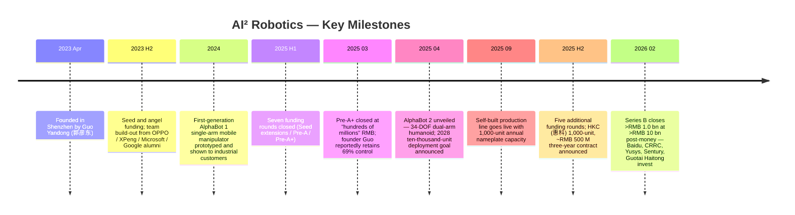
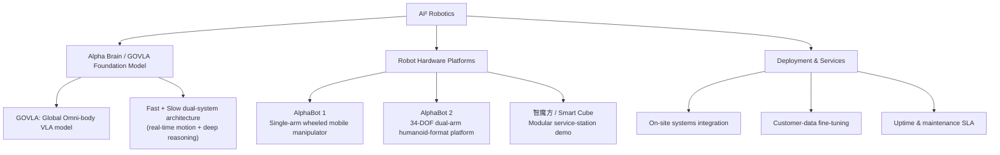
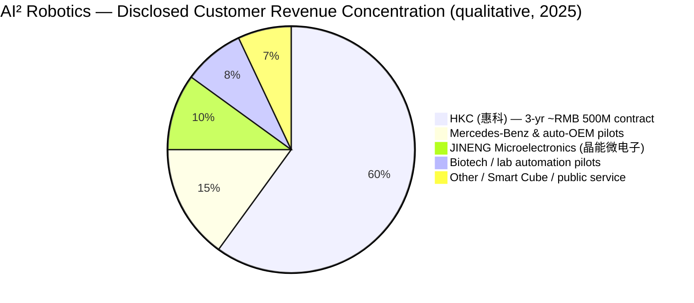
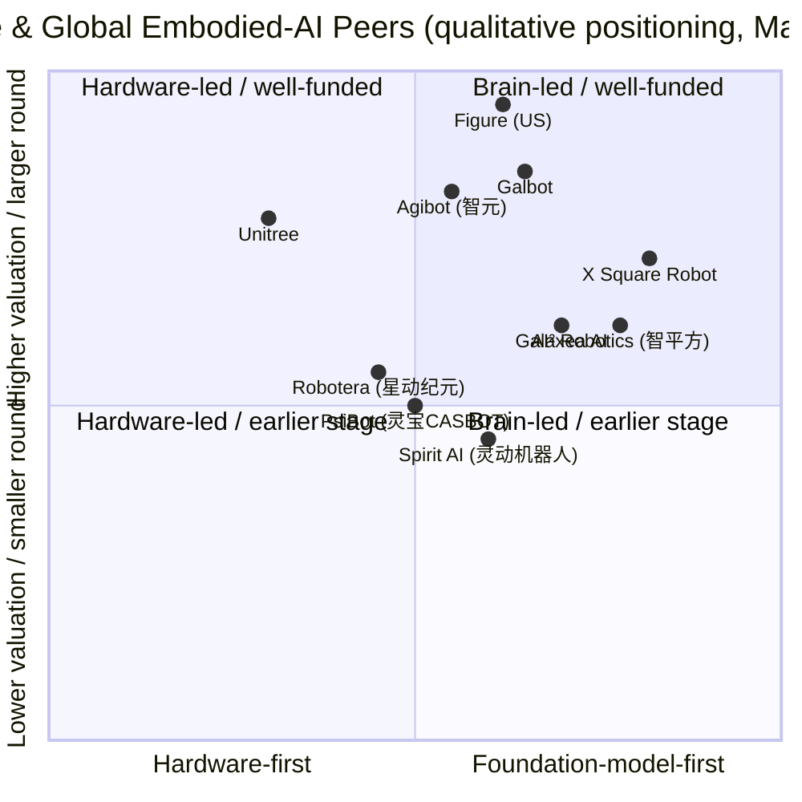

# AI² Robotics (智平方科技) — Company Research Report
**Date:** 2026-05-19
**Status:** Private company — Shenzhen, China
**Sector:** Embodied AI / General-purpose humanoid & mobile-manipulator robots

> **Update — Series B closed at over RMB 1.0 bn / USD ~144 M (2026-02-23):** AI² Robotics announced the close of a Series B round exceeding RMB 1 billion, lifting post-money valuation to over RMB 10 billion (≈ USD 1.4 bn). Strategic investors include Baidu (百度), CRRC (中车), Yusys Technologies (宇信科技), Sentury Tire (森麒麟), and Guotai Haitong Securities (国泰海通). Management framed the round as the capital base for scaling AlphaBot 2 production from a ~1,000-unit annual line in 2025 to a target 10,000-unit run-rate in 2026, and as the funding bridge to the company's stated 2028 "ten-thousand-unit deployment" commercialization goal. Source: [Caixin Global, 2026-02-23](https://www.caixinglobal.com/2026-02-23/chinas-ai-robotics-raises-fresh-funds-at-over-10-billion-yuan-valuation-102416310.html); [The Robot Report, 2026-02](https://www.therobotreport.com/ai2-robotics-raises-series-b-funding-advance-alphabot-embodied-ai/); [Gasgoo, 2026](https://autonews.gasgoo.com/articles/news/seeds-ai-robotics-officially-announces-completion-of-series-b-round-exceeding-1-billion-yuan-2026536571551883265).

---

## Table of Contents
1. Company Overview
2. Company History
3. Management Team
4. Products & Services
5. Customers & Go-to-Market
6. Industry Overview
7. Competitive Landscape
8. Market Opportunity (TAM)
9. Risk Assessment
References

---

## 1. Company Overview

**AI² Robotics (智平方科技)** — pronounced "AI-squared" and styled with a superscript "²" — is a privately-held Chinese embodied-AI company founded in April 2023 and headquartered in Shenzhen's Nanshan district. The company designs, builds, and commercializes general-purpose intelligent robots whose central thesis is that the next dominant compute terminal after smartphones and smart vehicles will be a physical, autonomously-acting machine driven by a vision-language-action (VLA) foundation model. Its product line today centers on the **AlphaBot** family — a single-arm wheeled mobile manipulator (AlphaBot 1) and a 34-degree-of-freedom dual-arm humanoid-style platform (AlphaBot 2) — both running the company's in-house **Alpha Brain** foundation model, internally branded **GOVLA** (Global & Omni-body Vision-Language-Action) ([AI² Robotics, About page](https://ai2robotics.com/en/about/); [RoboticsTomorrow, 2025](https://www.roboticstomorrow.com/content.php?post=25899)).

The company's framing is unusually explicit about the analogy it wants investors and partners to draw: AlphaBot is to physical AI what the iPhone was to mobile, and Alpha Brain is the operating system that decouples generality from task-specific programming. That framing has translated into a concrete go-to-market: rather than first selling to consumers (the "humanoid-companion" lane occupied by Unitree or, eventually, Tesla Optimus), AI² Robotics has targeted *industrial* and *semi-industrial* deployments — semiconductor and display fabs, automotive manufacturing, biotech sterile filling, and inspection — where the robot's value is measured against the labor cost it displaces and where end-customers are willing to sign large multi-year purchase commitments before consumer-grade reliability is proven ([NE时代, 2025-09](https://ne-time.cn/web/article/36685); [新浪财经, 2025-04-17](https://finance.sina.com.cn/jjxw/2025-04-17/doc-inetnwin2047310.shtml)).

**Business model.** Three revenue streams in early development ([AI² Robotics, About page](https://ai2robotics.com/en/about/)):
1. **Robot unit sales** — direct hardware sales to enterprise customers. AlphaBot 2's published unit pricing has been reported at roughly USD 15,000 in entry configurations (industry-press estimate; the company has not formally published a global price list) ([Interesting Engineering, 2025](https://interestingengineering.com/innovation/alphabot-2-future-humanoid-robots)). The largest signed contract — Hui-Ke (惠科, HKC) — is reportedly worth close to RMB 500 million for ~1,000 units over three years, implying an average unit price near RMB 500,000 (~USD 70,000) once integration, service, and on-site engineering are included ([NE时代, 2025-09](https://ne-time.cn/web/article/36685); [CMRA, 2025-09](https://cnmra.com/rmb-500-million-ai2-robotics-secured-massive-order-for-1000-humanoid-robots/)).
2. **Foundation-model licensing / "Alpha Brain inside"** — the company has indicated intent to license its VLA stack to third-party robot OEMs, though no large licensing deal has been publicly disclosed as of this writing (*unverified at the deal level — flagged*) ([AI² Robotics, About page](https://ai2robotics.com/en/about/)).
3. **Recurring services** — deployment engineering, fine-tuning data services, and SLA-backed uptime contracts on deployed fleets, with the HKC frame agreement explicitly including a joint VLA-fine-tuning track on customer production data ([CMRA, 2025-09](https://cnmra.com/rmb-500-million-ai2-robotics-secured-massive-order-for-1000-humanoid-robots/)).

**Geographic presence.** Headquartered in Shenzhen (Nanshan district), with a primary R&D footprint also in Shenzhen and a recently-opened proprietary manufacturing line. Public statements from founder Guo Yandong have committed to contributing 1% of Nanshan district GDP by 2030 — a target that, taken literally against Nanshan's ~RMB 950 bn 2024 GDP, would imply roughly RMB 9.5 bn of company-level economic contribution, presumably revenue-equivalent (*management aspirational target — flagged as a stated goal, not a contractually-bound commitment*) ([新浪财经, 2025-04-18](https://finance.sina.com.cn/roll/2025-04-18/doc-inetqkks4824724.shtml)).

**Scale snapshot.** As of early 2026, the company has not disclosed headcount, revenue, or gross margin. Public reporting indicates a self-built production line went live in September 2025 with a ~1,000-unit/year nameplate capacity, targeting a 10× expansion to ~10,000 units/year in 2026 and the stated 2028 milestone of 10,000 deployed units in the field ([新浪财经, 2025-04-18](https://finance.sina.com.cn/roll/2025-04-18/doc-inetqkks4824724.shtml); [The Robot Report, 2026-02](https://www.therobotreport.com/ai2-robotics-raises-series-b-funding-advance-alphabot-embodied-ai/)). Reported customer base spans Mercedes-Benz (奔驰), Geely Technology's JINENG Microelectronics (晶能微电子), and HKC (惠科), among others.

### Valuation snapshot

AI² Robotics is privately held, so traditional public-market multiples (P/E, P/S) are not observable. The relevant equivalents are the **latest funding-round post-money valuation** and **implied revenue multiple**, both of which require caveats because Series B revenue was not disclosed ([Caixin Global, 2026-02-23](https://www.caixinglobal.com/2026-02-23/chinas-ai-robotics-raises-fresh-funds-at-over-10-billion-yuan-valuation-102416310.html)).

| Metric | Value | Source |
|---|---|---|
| Founded | April 2023 | [AI² Robotics, About page](https://ai2robotics.com/en/about/) |
| Latest round | Series B — over RMB 1.0 bn raised | [Caixin Global, 2026-02-23](https://www.caixinglobal.com/2026-02-23/chinas-ai-robotics-raises-fresh-funds-at-over-10-billion-yuan-valuation-102416310.html) |
| Post-money valuation | Over RMB 10 bn (≈ USD 1.4 bn) | [Caproasia, 2026-02-24](https://www.caproasia.com/2026/02/24/china-robot-company-ai%C2%B2-robotics-yandong-eric-guo-raised-144-million-funding-at-1-4-billion-valuation-founded-in-2023-by-yandong-eric-guo/) |
| Cumulative funding raised | ~ USD 158 M+ across all rounds | [Crunchbase, AI² Robotics profile](https://www.crunchbase.com/organization/ai%C2%B2-robotics) |
| Number of disclosed rounds | 12 in trailing 12 months (1H + 2H 2025) | [Robotics 24/7, 2026](https://www.robotics247.com/article/ai-robotics-raises-over-140m-in-series-b-round) |

**Implied revenue multiple — unverified.** The company has not publicly disclosed 2024 or 2025 revenue. If we use the HKC contract value of "close to RMB 500 M over three years" as a rough proxy for a single anchor customer's run-rate contribution, and assume aggregate 2025 recognized revenue of RMB 100–300 M (an analyst estimate, *not management-disclosed*), the implied price-to-revenue multiple at the RMB 10 bn post-money mark would sit in the 30–100× range — extremely high but **not out of line with peer embodied-AI rounds**: Galbot at USD 3 bn post-money, X Square Robot's Series B at over USD 1 bn post-money, Robotera's RMB ~1 bn Series A+ all imply double- to triple-digit revenue multiples on whatever modest commercialization revenue these companies have. The market is pricing **option value on the foundation model and capacity**, not run-rate cash flow ([Robotics & Automation News, 2025-12](https://roboticsandautomationnews.com/2025/12/20/humanoid-robot-maker-galbot-raises-300-million-and-reaches-3-billion-valuation/97783/); [Inforcapital, 2026-04](https://inforcapital.com/news/embodied-ai-startup-x-square-robot-raises-nearly-276m-in-series-b-led-by-xiaomi-and-sequoia-china/)).

**Why the multiple is what it is.** Three drivers ([Caixin Global, 2026-02-23](https://www.caixinglobal.com/2026-02-23/chinas-ai-robotics-raises-fresh-funds-at-over-10-billion-yuan-valuation-102416310.html)):
1. **Sector premium on Chinese embodied AI.** Morgan Stanley and Goldman Sachs both raised humanoid-robot TAM forecasts materially through 2025 — Morgan Stanley sized the 2050 humanoid market at USD 5 tn ([Morgan Stanley, "Humanoid Robot Market Expected to Reach $5 Trillion by 2050"](https://www.morganstanley.com/insights/articles/humanoid-robot-market-5-trillion-by-2050)) and Goldman revised its 2035 forecast 6× higher to USD 38 bn ([blog.robozaps.com, market-size summary, 2025](https://blog.robozaps.com/b/market-size-for-humanoid-robots)).
2. **Foundation-model option value.** The bull case treats AlphaBot units as a data-generating fleet that compounds the value of Alpha Brain (GOVLA), in the same way Tesla's bull case has treated FSD-equipped vehicles for years ([CSDN / 量子位, 2024](https://blog.csdn.net/QbitAI/article/details/144755756)).
3. **Founder track record.** Guo Yandong's prior tenure as chief scientist at OPPO and XPeng — both companies that have shipped hundreds of millions of intelligent terminals — gives Tier-1 strategic investors (Baidu, CRRC) a credibility anchor that smaller-name founders lack ([腾讯新闻, 2025-03-07](https://news.qq.com/rain/a/20250307A034DJ00); [IDEA Research Institute, Guo Yandong profile](https://www.idea.edu.cn/team/5829.html)).

Counterpoint: at a USD 1.4 bn post-money with sub-RMB 500 M annualized revenue (analyst estimate, *flagged unverified*), this is a textbook venture-priced asset where multiple compression risk is real. If 2027 capacity does not translate into 2027 *signed-backlog revenue*, a down-round becomes plausible — particularly given the saturation of capital in the segment (see Section 9, Financial Risks), where industry observers have already warned that "for Pre-IPO rounds, investors should require enterprises to provide audited proof of industrial customer revenue ... otherwise valuations should be discounted by 70%" ([凤凰网财经, 2026](https://finance.ifeng.com/c/8slk4dbwJi1)).

---

## 2. Company History

AI² Robotics was founded in April 2023 by **Guo Yandong (郭彦东)** in Shenzhen. The founding thesis — articulated in multiple founder interviews — was that large multimodal models had reached a sufficient generalization threshold that a single foundation model could plausibly drive both perception and action across an open-ended task space, replacing the task-specific programming that had defined industrial and service robotics for four decades. At founding, Guo's framing was that only Google (RT-2 era) and Tesla (Optimus pre-prototype) were pursuing the same fully-integrated VLA path; everyone else in the Chinese ecosystem was building hardware-first, with the VLA / "robot brain" layer left as future work ([新浪财经, 2025-03-06](https://finance.sina.com.cn/jjxw/2025-03-06/doc-inensrzt1048673.shtml); [Bianews, 2025-09](https://www.bianews.com/news/details?id=222141)).

Source: [Caixin Global, 2026-02-23](https://www.caixinglobal.com/2026-02-23/chinas-ai-robotics-raises-fresh-funds-at-over-10-billion-yuan-valuation-102416310.html); [腾讯新闻, 2025-03-07](https://news.qq.com/rain/a/20250307A034DJ00); [NE时代, 2025-09](https://ne-time.cn/web/article/36685); [新浪财经, 2025-04-18](https://finance.sina.com.cn/roll/2025-04-18/doc-inetqkks4824724.shtml).

### Strategic pivots and transformations

**Pivot 1 — From "single-arm mobile manipulator" to "humanoid-format dual-arm" (2024 → 2025).** AlphaBot 1 was specified as a single-arm wheeled mobile-manipulation platform — a deliberately conservative form factor optimized for industrial pick-and-place, materials handling, and inspection. By April 2025, the company unveiled AlphaBot 2 with 34 degrees of freedom, dual arms with a 700 mm span and an extended reach to 240 cm, and a lifting waist-leg structure giving a 0–2.4 m operating height. The pivot was not a rejection of single-arm but an extension: AlphaBot 2 targets tasks where bimanual coordination is required (cooking, sterile filling, bin assembly) while AlphaBot 1 remains the workhorse for cheaper deployments where one arm is enough ([Aparobot, AlphaBot 2 spec page](https://www.aparobot.com/robots/alphabot-2); [新浪财经, 2025-04-17](https://finance.sina.com.cn/jjxw/2025-04-17/doc-inetnwin2047310.shtml)).

**Pivot 2 — From "hire a contract manufacturer" to "build a captive line" (mid-2025).** The September 2025 commissioning of an in-house production facility with 1,000-unit nameplate capacity marked an inflection: AI² Robotics chose to internalize manufacturing rather than rely on OEM partners, citing both quality-control and IP-protection rationales (Guo Yandong's interview language). The line is sized to scale 10× to 10,000 units/year by 2026 ([新浪财经, 2025-04-18](https://finance.sina.com.cn/roll/2025-04-18/doc-inetqkks4824724.shtml)).

**Pivot 3 — From "research-first" to "anchor-customer-first GTM" (2025).** Securing the HKC 1,000-unit contract in semiconductor-display manufacturing in 2025 reframed the company narrative from "VLA research startup" to "industrial customer-validated commercial robot company" — and this directly enabled the Series B to close at a 10-bn-yuan valuation just months later ([NE时代, 2025-09](https://ne-time.cn/web/article/36685)).

### Acquisitions
No publicly-disclosed M&A activity to date. The company has been a net hirer of talent, not an acquirer of businesses ([Crunchbase, AI² Robotics profile](https://www.crunchbase.com/organization/ai%C2%B2-robotics)).

### Recent developments (last 12 months)
- **2025-04** AlphaBot 2 launched with GOVLA-powered Alpha Brain.
- **2025-09** Captive 1,000-unit-capacity production line operational.
- **2025-Q4** HKC 3-year, ~RMB 500 M, 1,000-unit contract announced.
- **2026-02** Series B closed >RMB 1.0 bn at >RMB 10 bn post-money.

---

## 3. Management Team

### Guo Yandong (郭彦东) — Founder & CEO

Guo Yandong is the central figure of AI² Robotics and — at a reported 69% ownership stake after the Pre-A+ round in early 2025 — also its dominant shareholder ([腾讯新闻, 2025-03-07](https://news.qq.com/rain/a/20250307A034DJ00)). His trajectory before founding the company spans three institutionally-significant phases that, taken together, form the implicit credibility argument behind every investment round AI² has closed.

**Education.** Bachelor's and Master's degrees from Beijing University of Posts and Telecommunications (北京邮电大学), followed by a Ph.D. from Purdue University (USA), reportedly advised by a member of the U.S. National Academy of Engineering ([新浪财经, 2025-09-28](https://finance.sina.com.cn/stock/t/2025-09-28/doc-infsamfc8725940.shtml); [IDEA Research Institute, Guo Yandong page](https://www.idea.edu.cn/team/5829.html)). Specialization: computer vision and machine learning.

**Microsoft Research (US headquarters), ~2010s.** Guo joined Microsoft's core AI team in the United States, where his computer-vision work powered features in Bing Image Search and Azure Cognitive Services. His group at Microsoft sat alongside teams led by multiple Turing Award winners — a piece of context Guo cites frequently in interviews when explaining why he approaches model architecture decisions the way he does ([Bianews, 2025-09](https://www.bianews.com/news/details?id=222141)).

**XPeng Motors (小鹏汽车), 2018–2020.** In 2018, Guo left Microsoft for an early-stage XPeng (the EV maker), recruited specifically to import deep-learning architectures into the autonomous-driving stack. He served as a chief scientist on the perception side. This was his first operating-company tenure and his first exposure to closed-loop edge deployment at automotive scale — directly relevant to the embodied-AI thesis he later built AI² around ([Bianews, 2025-09](https://www.bianews.com/news/details?id=222141); [腾讯新闻, 2025-03-07](https://news.qq.com/rain/a/20250307A034DJ00)).

**OPPO (2020–2023).** From 2020 to early 2023, Guo served as **Chief Scientist (Intelligent Perception)** at OPPO, with responsibilities spanning AI technical planning, computer-vision algorithms, and on-device perception. Under his leadership, OPPO's AI team filed hundreds of AI patents annually and shipped features into every Reno mid-tier and Find-series flagship phone launched in that period. He reports a public count of "several hundred AI patents per year" out of his team — *unverified at the individual-patent level but consistent with OPPO's overall patent disclosures* ([Bianews, 2025-09](https://www.bianews.com/news/details?id=222141); [新浪财经, 2025-03-06](https://finance.sina.com.cn/jjxw/2025-03-06/doc-inensrzt1048673.shtml)).

**Founding thesis (April 2023).** Guo describes his founding moment as recognizing that the same kind of foundation-model scaling that had driven LLMs from useless to useful between 2018 and 2022 could be applied to robot action policies — and that, structurally, only Google, Tesla, and (he believed) AI² were betting on a single unified VLA model. The company name itself, "AI squared," is meant to invoke the multiplicative product of *digital* AI (the brain) and *physical* AI (the body) ([新浪财经, 2025-09-28](https://finance.sina.com.cn/stock/t/2025-09-28/doc-infsamfc8725940.shtml)).

**Ownership and control.** Reported 69% ownership post Pre-A+ in March 2025 — a stake that almost certainly dilutes meaningfully after the Series B round but likely keeps founder control intact above 50%. *Exact post-Series-B stake not disclosed; flagged as unverified* ([腾讯新闻, 2025-03-07](https://news.qq.com/rain/a/20250307A034DJ00)).

**Public profile.** Guo is unusually media-active for a Chinese deep-tech founder, with extended interviews in 新浪财经, 36氪, CSDN, and Bianews. He gives a recurring talk titled "没有技术自信，中国机器人就没有创新突破" ("Without technical confidence, Chinese robotics will have no breakthrough innovation"), framed as a rebuke to the imitation-of-Western-design tendency in some Chinese hardware startups ([新浪财经, 2025-09-28](https://finance.sina.com.cn/stock/t/2025-09-28/doc-infsamfc8725940.shtml)).

### CFO

**Not publicly disclosed.** As of this writing AI² Robotics has not publicly named a Chief Financial Officer. The Series B round closing without a named CFO is mildly unusual for a USD 1.4 bn-valuation company; it suggests either that the role is filled by a head-of-finance who has not been publicly profiled, or that capital-markets responsibility still sits with Guo personally with external advisors (likely Guotai Haitong, given its participation in the Series B). *Flagged as a disclosure gap* ([Caixin Global, 2026-02-23](https://www.caixinglobal.com/2026-02-23/chinas-ai-robotics-raises-fresh-funds-at-over-10-billion-yuan-valuation-102416310.html)).

### Other executives and core team

The company has not published an official leadership-team page in English with named CXOs beyond the founder. Public statements describe the core team as drawn from ([ai2robotics.com, About](https://ai2robotics.com/en/about/); [知乎, "千万收入已确认", 2025](https://zhuanlan.zhihu.com/p/20149988051)):

- **Microsoft (Redmond)** — AI/CV research alumni
- **Google** — AI research and robotics alumni
- **OPPO** — intelligent-terminal product and AI engineering alumni (Guo's own former direct reports)
- **XPeng Motors (小鹏汽车)** — autonomous-driving and perception engineering alumni
- **Momenta (自动驾驶公司)** — perception / planning engineering
- **Tsinghua University, Peking University, CMU, UC Berkeley** — academic recruits

The company has publicly claimed "5 of Stanford's global top-2% scientists" on the technical team (citing Stanford's annual "World's Top 2% Scientists" list) — *flagged as a management-stated figure, individual names not disclosed* ([ai2robotics.com, About](https://ai2robotics.com/en/about/)).

### Governance

- **Board composition:** not publicly disclosed. Given the institutional cap-table after Series B (Baidu, CRRC, Guotai Haitong, etc.), board seats almost certainly went to lead investors of major rounds; the exact composition is private. *Flagged as unverified.*
- **Insider ownership:** ~69% to founder post Pre-A+ (March 2025); post-Series-B figure undisclosed.
- **Compensation structure:** undisclosed; venture-stage compensation is presumed equity-heavy.
- **Related-party transactions:** none disclosed.

### Track-record synthesis

The single-bio summary is favorable for the most important seat (CEO). Guo Yandong has a credible Tier-1 research pedigree (Microsoft, Purdue Ph.D.), and — critically for an industrial-robotics commercialization thesis — two prior tours of shipping intelligent terminals at consumer scale (XPeng's vehicles, OPPO's phones) ([IDEA Research Institute, Guo Yandong profile](https://www.idea.edu.cn/team/5829.html)). The gap is the bench: with no publicly-named CFO, COO, or CTO, AI² is effectively betting that Guo himself can compress the four senior-leadership roles into one — workable in a sub-200-person startup, but a stress point as headcount scales toward the staffing needed for a 10,000-unit/year manufacturing line ([新浪财经, 2025-04-18](https://finance.sina.com.cn/roll/2025-04-18/doc-inetqkks4824724.shtml)).

---

## 4. Products & Services

AI² Robotics' product portfolio as of mid-2026 sits on a single foundation-model "brain" (Alpha Brain / GOVLA) and two robot "body" SKUs (AlphaBot 1, AlphaBot 2), with a third — the small-form-factor "智魔方" (Zhi-Mo-Fang, sometimes rendered "Smart Cube") modular service kiosk — used as a demonstration vehicle rather than a high-volume product ([中国财经网, "智平方'智魔方'双城落地", 2026-01](https://www.fecn.net/mobile/1/2026/0113/0113267031267031.html); [ai2robotics.com, About](https://ai2robotics.com/en/about/)).

Source: [ai2robotics.com, About](https://ai2robotics.com/en/about/); [Aparobot, AlphaBot 2 spec page](https://www.aparobot.com/robots/alphabot-2); [RoboticsTomorrow, 2025](https://www.roboticstomorrow.com/content.php?post=25899).

### 4.1 Alpha Brain (foundation model) — including GOVLA

**What it does.** Alpha Brain is the company's in-house multimodal foundation model that ingests vision, language, proprioception, and force sensing and outputs continuous motor-command sequences for the AlphaBot platforms. The headline architecture, GOVLA (Global & Omni-body Vision-Language-Action), is positioned as a single-stack model rather than a perception → planning → control pipeline of separately-trained modules. Stated capabilities: 360° spatial understanding, whole-body coordination, multi-step task decomposition, and natural-language interfaces. The system uses a **dual "Fast + Slow"** architecture where a fast real-time loop handles immediate motion control and a slower reasoning loop manages multi-step plan generation ([RoboticsTomorrow, 2025](https://www.roboticstomorrow.com/content.php?post=25899); [Alabia Insights, 2025](https://alabia.com.br/insights/trabalho/empregos/ai2-robotics-govla-embodied-ai-productivity/)).

**Competitive-advantage verdict: partial — technology / IP moat, contingent on data flywheel.** The advantage is conditional. As of this report's date, **none** of the leading Chinese embodied-AI startups have publicly demonstrated a clearly-superior VLA model in a peer-reviewed or independently-benchmarked setting; the field is pre-benchmark. Alpha Brain's edge, if it has one, rests on (a) a head start in unified VLA architecture among Chinese peers, (b) a growing closed-loop dataset from deployed AlphaBot units, and (c) Guo's perception-research background. **Closest competing model: Google's RT-2 / RT-X family (English-language academic baseline) and X Square Robot's WALL-A model (closest Chinese peer)** ([X Square Robot, Robotics 24/7 coverage](https://www.therobotreport.com/x-square-robot-secures-140m-in-funding-for-ai-foundation-models/)) — at parity in published demonstrations, behind in academic publication footprint.

### 4.2 AlphaBot 1 — single-arm wheeled mobile manipulator

**What it does.** AlphaBot 1 (later upgraded to AlphaBot 1S at the 2024 World Robot Conference) is the company's first commercially-deployed platform: a wheeled mobile base with a single robotic arm, designed for industrial pick-and-place, material handling between machine cells, and inspection routines. It is the platform behind much of the published Mercedes-Benz and JINENG Microelectronics deployment imagery. *Detailed published spec sheet for AlphaBot 1 is sparse compared with AlphaBot 2 — flagged* ([中国日报网, "Alpha Bot 1S 亮相2024世界机器人大会", 2024-08-29](https://cn.chinadaily.com.cn/a/202408/29/WS66d002eda310b35299d39150.html); [36氪, "Alpha Bot 1S 惊艳亮相2024世界机器人大会", 2024-08](https://36kr.com/p/2924232146885505)).

**Target customer.** Manufacturing operations (auto OEMs, semiconductor/display fabs, electronics assembly) where a single-arm, fixed-base or mobile pick-and-place arm is operationally sufficient and the lower unit cost vs. AlphaBot 2 matters ([新浪科技, "Alpha Bot 1S 惊艳亮相2024世界机器人大会", 2024-08-28](https://finance.sina.com.cn/tech/roll/2024-08-28/doc-incmenps0445154.shtml)).

**Pricing.** Not publicly disclosed at the unit level. Reverse-engineered from the HKC contract (RMB ~500 M / ~1,000 units / 3 years), the blended unit price including integration is in the ~RMB 500,000 range (~USD 70,000); pure hardware ASP likely lower ([NE时代, 2025-09](https://ne-time.cn/web/article/36685)).

**Competitive-advantage verdict: partial — application + brand moat, hardware commoditizing.** The single-arm mobile manipulator form factor is not architecturally novel — Galbot's wheeled platforms ([Galbot G1 product page](https://www.galbot.com/)), Boston Dynamics' Stretch ([Boston Dynamics, Stretch product page](https://bostondynamics.com/products/stretch/)), and Geek+ / Hai Robotics' commercial-warehouse robots ([Geek+ corporate site](https://www.geekplus.com/en); [Hai Robotics products page](https://www.hairobotics.com/products)) occupy adjacent territory. AlphaBot 1's differentiation is (a) the Alpha Brain stack on top — allowing the same arm to do qualitatively different tasks without re-programming — and (b) a small but real reference list (Mercedes, JINENG, HKC) that competitors can't yet point to at the same scale ([21经济网, 2025-04-18](https://www.21jingji.com/article/20250418/herald/375a27631a594da3b2c3d8d804ade0e7.html)). **Closest competing product: Galbot's wheeled single-arm robot** — at-parity hardware, smaller deployment footprint, larger consumer-narrative attention ([The Robot Report, "Galbot brings in $300M to scale mobile manipulator deployments"](https://www.therobotreport.com/galbot-brings-in-300m-to-scale-mobile-manipulator-deployments/)).

### 4.3 AlphaBot 2 — 34-DOF dual-arm humanoid-format platform

**What it does.** AlphaBot 2 is the flagship next-generation platform, unveiled in April 2025. Specifications drawn from the company's own launch materials and third-party spec aggregators ([AI² Robotics, AlphaBot 2 launch page](https://ai2robotics.com/en/%E6%99%BA%E5%B9%B3%E6%96%B9%E5%8F%91%E5%B8%83%E5%85%A8%E6%96%B0%E4%B8%80%E4%BB%A3%E6%99%BA%E8%83%BD%E6%9C%BA%E5%99%A8%E4%BA%BAalphabot-2%E5%BC%80%E5%90%AFagi%E7%BB%88%E7%AB%AF%E6%96%B0/); [Aparobot, AlphaBot 2 spec](https://www.aparobot.com/robots/alphabot-2)):
- **Degrees of freedom:** 34
- **Arm span:** 700 mm per arm, with **maximum reach 2.40 m** when extended via the lifting waist-leg
- **Operating height range:** 0 to 2.4 m (covers floor-pick to overhead tasks)
- **Sensing suite:** multi-camera 360° vision, force/torque feedback sensors on arms and wrists, microphone array, environmental sensors
- **Locomotion:** wheeled base (not bipedal walking — explicitly *not* a Boston Dynamics Atlas-style biped)
- **Software:** Alpha Brain / GOVLA with Fast + Slow dual-system architecture
- **Reported demonstrated tasks:** autonomous cooking, beverage preparation, sterile filling in biotech cleanrooms, multi-step inspection, dice/playing-card manipulation as dexterity demos
- **Few-shot learning:** demonstrated task acquisition from 5–10 human demonstrations (company claim)
- **Reported entry pricing:** ~USD 15,000 (industry-press estimate; not officially confirmed at the SKU level)

Sources: [Aparobot, AlphaBot 2 spec](https://www.aparobot.com/robots/alphabot-2); [Interesting Engineering, 2025](https://interestingengineering.com/innovation/alphabot-2-future-humanoid-robots); [新浪财经, 2025-04-17 launch coverage](https://finance.sina.com.cn/jjxw/2025-04-17/doc-inetnwin2047310.shtml); [CNN Business — AlphaBot 2 video feature](https://edition.cnn.com/business/alpha-bot-humanoid-robots-china-embodied-ai-hnk-spc).

**Target customer.** Same vertical mix as AlphaBot 1 plus tasks requiring bimanual manipulation: biotech sterile filling, food-service prep, retail-shelf restocking, and consumer-facing demonstrations ([新浪财经, 2025-04-17 launch coverage](https://finance.sina.com.cn/jjxw/2025-04-17/doc-inetnwin2047310.shtml)).

**Competitive-advantage verdict: partial — moat is the integrated brain + body stack, but hardware specs are catchable.** Among the ~20 Chinese humanoid platforms tracked publicly, AlphaBot 2's 34-DOF dual-arm + lifting waist-leg + wheeled base is a distinctive combination — most peers chose either bipedal walking (Unitree, Robotera) or a fully-stationary dual-arm (Galaxea G1). AI²'s wheeled+lifting choice is more practical for industrial deployment in 2026 than bipedal walking. But the **hardware** is catchable in 18–24 months by a determined competitor; the durable moat, if there is one, lives in the Alpha Brain training data and the customer-deployment reference set. **Closest competing product: X Square Robot's Quanta X2 semi-humanoid (wheeled, dual-arm, VLA-driven)** — at parity on stated capability, ahead on raised capital, behind on disclosed industrial reference customers ([X Square Robot, The Robot Report, 2026-01](https://www.therobotreport.com/x-square-robot-secures-140m-in-funding-for-ai-foundation-models/)).

### 4.4 Smart Cube (智魔方) — modular service-space demo

A self-contained modular kiosk/booth that houses an AlphaBot to demonstrate cooking, beverage, retail, and entertainment use cases in a single transportable space. Functionally a demonstration vehicle and pilot product for the eventual service-robot vertical rather than a high-volume SKU. Referenced in launch materials but not, to this report's knowledge, deployed at scale ([Interesting Engineering, "China robotics firm unveils world's first modular AI service space"](https://interestingengineering.com/ai-robotics/china-modular-embodied-ai-service-space)).

### Flagship vs. long-tail

Among the three platforms, **AlphaBot 2 is the flagship by company messaging and AlphaBot 1 is the volume workhorse by current revenue contribution**. The 2025 HKC contract is reportedly served primarily by AlphaBot 1 units (the application — fab material handling — does not require dual-arm bimanual coordination) ([NE时代, 2025-09](https://ne-time.cn/web/article/36685)). AlphaBot 2 is positioned as the platform that will absorb the next wave of deployments in biotech, food, and complex-assembly settings in 2026–2028 ([21经济网, 2025-04-18](https://www.21jingji.com/article/20250418/herald/375a27631a594da3b2c3d8d804ade0e7.html)).

### Recent launches and roadmap (last 12 months)

- **April 2025** AlphaBot 2 launched with GOVLA-powered Alpha Brain.
- **Mid-2025** Smart Cube modular service space publicly demonstrated.
- **Q4 2025 / Q1 2026** Iterative Alpha Brain updates with refined dual-system architecture and improved force-feedback control (not formally versioned in the company's public communications).
- **Planned 2026** Capacity expansion to 10,000 units/year, with AlphaBot 2 expected to become a larger share of unit mix as biotech and food-service deployments scale.

---

## 5. Customers & Go-to-Market

### Customer segments

AI² Robotics' deployed customer base — verified through company press releases and trade-press coverage — sits in five identifiable industry clusters ([21经济网, 2025-04-18](https://www.21jingji.com/article/20250418/herald/375a27631a594da3b2c3d8d804ade0e7.html); [NE时代, 2025-09](https://ne-time.cn/web/article/36685)):

1. **Automotive manufacturing** — Mercedes-Benz (奔驰) is the headline reference. AlphaBot units have been deployed in automotive manufacturing settings as part of broader factory-automation pilots. The Mercedes engagement is publicly named but the unit count and contract value have not been disclosed ([21经济网, 2025-04-18](https://www.21jingji.com/article/20250418/herald/375a27631a594da3b2c3d8d804ade0e7.html)).
2. **Semiconductor and display manufacturing** — Two named customers:
   - **JINENG Microelectronics (浙江晶能微电子)**, a Geely-owned automotive-semiconductor company. AlphaBot has been deployed for cross-station material handling and load/unload at JINENG's intelligent semiconductor production base (strategic-cooperation agreement signed March 2025).
   - **HKC (惠科, Hui-Ke / Shenzhen Huizhi IoT Technology subsidiary)**, the global display manufacturer. The HKC contract — announced in late 2025 — covers cumulative deployment of **over 1,000 embodied-intelligence robots over three years** at HKC's global production bases, spanning warehouse logistics, material loading, parts assembly, and QC test. Contract value is reportedly close to **RMB 500 million** ([NE时代, 2025-09](https://ne-time.cn/web/article/36685)).
3. **Biotechnology** — sterile filling and lab automation; specific customer names not publicly disclosed.
4. **Public services / retail** — referenced in company materials, no named anchor customer.
5. **Demonstration / experiential** — Smart Cube installations.

Source: qualitative analyst estimate based on [NE时代, 2025-09 — HKC contract coverage](https://ne-time.cn/web/article/36685) and [21经济网, 2025-04 — Mercedes / JINENG references](https://www.21jingji.com/article/20250418/herald/375a27631a594da3b2c3d8d804ade0e7.html); **the company has not published revenue concentration by customer — chart is illustrative, not audited.**

### Customer concentration — quantification

**The company has not published top-1 or top-5 customer revenue concentration**, since AI² Robotics is private and not subject to A-share `前五名客户` (top-5 customer) disclosure rules. Based on the publicly-disclosed HKC contract (~RMB 500 M over three years, implying RMB ~150–170 M/year if linearly recognized) and the absence of any other contract of remotely comparable scale, a reasonable analyst estimate is that **HKC alone represents >40–60% of AI² Robotics' contracted forward revenue** ([CMRA, 2025-09](https://cnmra.com/rmb-500-million-ai2-robotics-secured-massive-order-for-1000-humanoid-robots/)). If accurate, this is a material customer-concentration risk and is carried into Section 9.

**Contract structure.** The HKC arrangement is multi-year and frame-agreement-style, with deployment scheduled across three years and multiple production bases, and explicitly bundles a joint VLA-fine-tuning workstream on customer process data. Mercedes-Benz appears to be a pilot/PO-by-PO relationship rather than a master frame agreement. *Detailed terms not publicly disclosed — flagged* ([CMRA, 2025-09](https://cnmra.com/rmb-500-million-ai2-robotics-secured-massive-order-for-1000-humanoid-robots/); [NE时代, 2025-09](https://ne-time.cn/web/article/36685)).

### Distribution channels

Direct enterprise sales — AI² Robotics' GTM model is direct field-engineering with on-site integration. There is no disclosed channel-partner program with a systems integrator or VAR ecosystem. Given the size of the average contract (RMB tens to hundreds of millions over multi-year) and the need for application-specific fine-tuning, direct sales is the correct choice at this stage of maturity ([新浪财经, 2026-01-09](https://finance.sina.com.cn/jjxw/2026-01-09/doc-inhfsfzz0685399.shtml); [AI² Robotics, Introduce](https://ai2robotics.com/en/introduce/)).

### Sales strategy and cycle

The disclosed customer wins fit a recognizable pattern: a senior executive at the customer (typically the head of manufacturing operations or the chief digital officer) is contacted directly, a multi-month pilot is run on a narrow task, and — if the pilot succeeds — a multi-year frame agreement is negotiated. The sales cycle from first pilot to first signed multi-unit purchase order is plausibly 6–12 months ([CMRA, 2025-09](https://cnmra.com/rmb-500-million-ai2-robotics-secured-massive-order-for-1000-humanoid-robots/); [新浪财经, 2026-01-09](https://finance.sina.com.cn/jjxw/2026-01-09/doc-inhfsfzz0685399.shtml)).

### Key partnerships

- **Baidu** — Series B strategic investor, plausibly providing cloud-compute and foundation-model collaboration; nature of operating partnership not formally disclosed.
- **CRRC (中车)** — Series B strategic investor; potential customer in rail-manufacturing applications.
- **Yusys Technologies, Sentury Tire, Guotai Haitong Securities** — strategic investors with vertical-customer or capital-markets relevance.
- **Geely Technology Group** — JINENG Microelectronics is part of Geely Technology; ongoing operational partnership.

### Customer case studies (named wins)

The HKC win is the most strategically important publicly-named contract in Chinese industrial-humanoid commercialization to date. The 1,000-unit / 3-year / RMB 500 M structure provides a backlog anchor that few peers can match. The Mercedes-Benz reference, even if smaller in dollar terms, contributes outsized credibility for international expansion ([CMRA, 2025-09](https://cnmra.com/rmb-500-million-ai2-robotics-secured-massive-order-for-1000-humanoid-robots/); [21经济网, 2025-04-18](https://www.21jingji.com/article/20250418/herald/375a27631a594da3b2c3d8d804ade0e7.html)).

---

## 6. Industry Overview

### Industry definition and scope

The industry in which AI² Robotics operates is best described as **embodied AI / general-purpose intelligent robotics**, with the company specifically targeting two sub-segments ([Vision-language-action model — Wikipedia](https://en.wikipedia.org/wiki/Vision-language-action_model); [MIIT, "人形机器人创新发展指导意见" policy interpretation, 2023](https://www.miit.gov.cn/zwgk/zcjd/art/2023/art_e3f5686c2f0d49f9968b7ae011d558e1.html)):

1. **Industrial mobile manipulators and humanoid-format robots** — robots that operate alongside or in place of human workers in factories, fabs, and laboratories.
2. **Service / commercial humanoid robots** — robots deployed in retail, food service, public-information environments. (AI² Robotics' Smart Cube vehicle is positioned here but not the company's revenue center as of 2026.)

Adjacent industries include traditional industrial robotics (Fanuc, ABB, Yaskawa — articulated arms with low intelligence), collaborative robots (Universal Robots, Doosan — limited intelligence) ([Wikipedia — Cobot](https://en.wikipedia.org/wiki/Cobot)), autonomous mobile robots (Geek+, Hai Robotics — mobility without dexterity) ([Geek+ corporate site](https://www.geekplus.com/en); [Hai Robotics products page](https://www.hairobotics.com/products)), and commercial service robots (Pudu, KEENON — narrow autonomy) ([The Robot Report, "Pudu Robotics raises nearly $150M", 2026](https://www.therobotreport.com/pudu-robotics-raises-nearly-150m-targets-industrial-applications/); [Robotics & Automation News, "Keenon Robotics declared leader", 2025-07-21](https://roboticsandautomationnews.com/2025/07/21/keenon-robotics-declared-leader-in-commercial-service-robot-market-by-idc/93232/)).

### Market size and structure

**Global humanoid market.** Morgan Stanley's headline 2050 number — USD 5 trillion total addressable market, growing at ~88% CAGR from a near-zero base — is the most-cited long-dated forecast ([Morgan Stanley, "Humanoid Robot Market Expected to Reach $5 Trillion by 2050"](https://www.morganstanley.com/insights/articles/humanoid-robot-market-5-trillion-by-2050)). Goldman Sachs in 2025 revised its 2035 humanoid forecast upward sixfold from ~USD 6 bn to ~USD 38 bn — a smaller absolute number but a much steeper acceleration through 2035 ([blog.robozaps.com market-size summary, 2025](https://blog.robozaps.com/b/market-size-for-humanoid-robots)).

**Chinese humanoid market.** Specific projections ([Premia Partners](https://www.premia-partners.com/insight/embodied-ai-china-as-the-global-powerhouse-for-industrial-and-humanoid-robotics); [China Briefing](https://www.china-briefing.com/news/chinese-humanoid-robot-market-opportunities/)):
- 2024: ~RMB 2.76 bn (~USD 380 M)
- 2026: ~RMB 10.47 bn (~USD 1.4 bn)
- 2029: ~RMB 75 bn (~USD 10.3 bn), accounting for ~32.7% of the global market

Source: [Premia Partners, "Embodied AI – China as the global powerhouse for industrial and humanoid robotics"](https://www.premia-partners.com/insight/embodied-ai-china-as-the-global-powerhouse-for-industrial-and-humanoid-robotics); [China Briefing, "The Chinese Humanoid Robot AI Market"](https://www.china-briefing.com/news/chinese-humanoid-robot-market-opportunities/).

**Broader Chinese embodied-AI market** (a superset of humanoids — includes industrial mobile manipulators, drones, etc.): projected to grow from RMB 863.4 bn in 2024 to RMB 973.1 bn in 2025 ([Premia Partners](https://www.premia-partners.com/insight/embodied-ai-china-as-the-global-powerhouse-for-industrial-and-humanoid-robotics)). The 2025 number is functionally enormous because it counts a wide range of automation; the **humanoid-specific** sub-segment is much smaller (the RMB 2.76 bn / RMB 10.47 bn / RMB 75 bn series above).

### Growth rates

Historical: humanoid shipments globally went from ~hundreds of units in 2023 to several thousand in 2025 (Unitree alone reported 5,500 units sold in 2025; [TechCrunch, 2026-02-28](https://techcrunch.com/2026/02/28/why-chinas-humanoid-robot-industry-is-winning-the-early-market/)).

Projected: 2024 → 2029 Chinese humanoid CAGR implied by the Premia numbers above is ~95%, a fivefold-plus expansion over five years ([Premia Partners](https://www.premia-partners.com/insight/embodied-ai-china-as-the-global-powerhouse-for-industrial-and-humanoid-robotics)).

### Key trends and drivers

1. **VLA foundation models compress the cost of programming a robot to a new task.** Pre-VLA, deploying a robot to a new factory cell required hand-engineered perception + planning + control — typically person-months of effort per cell. With VLA models, the same robot can be retrained on a new task from a small number of demonstrations ([Google DeepMind, "RT-2: New model translates vision and language into action"](https://deepmind.google/blog/rt-2-new-model-translates-vision-and-language-into-action/); [Wikipedia, Vision-language-action model](https://en.wikipedia.org/wiki/Vision-language-action_model)).
2. **Chinese manufacturing labor costs are rising fast enough that humanoid economics are becoming defensible.** Chinese median manufacturing wages have approached or exceeded those in Eastern European EU member states for several years; the labor-displacement payback for a USD 50,000–100,000 robot working a 2-shift day in a fab approaches 18–30 months in many configurations ([China Briefing, "Minimum Wages in China"](https://www.china-briefing.com/news/minimum-wages-china/); [Logistics Management, "Global Labor Rates: China is no longer a low-cost country"](https://www.logisticsmgmt.com/article/global_labor_rates_china_is_no_longer_a_low_cost_country)).
3. **National-level industrial policy.** Both Beijing and provincial governments have explicitly designated embodied AI / humanoid robotics as a strategic-frontier industry. Morgan Stanley has noted that "national support for 'embodied AI' may be far greater in China than in any other nation" ([Morgan Stanley insights, 2025](https://www.morganstanley.com/insights/articles/humanoid-robot-market-5-trillion-by-2050); [工信部, "人形机器人创新发展指导意见", 2023-11-03](https://www.miit.gov.cn/zwgk/zcjd/art/2023/art_e3f5686c2f0d49f9968b7ae011d558e1.html)).
4. **Geopolitics — semiconductor and component access.** Most Chinese humanoid platforms (AlphaBot included) rely on domestically-available compute, motors, and sensors. The geopolitical environment in which export-controlled US chips are progressively restricted from Chinese AI training infrastructure favors a "China-stack" closed-loop development model ([Merics, "Embodied AI: China's ambitious path to transform its robotics industry"](https://merics.org/en/report/embodied-ai-chinas-ambitious-path-transform-its-robotics-industry)).
5. **Capital saturation.** 2025 saw 81% of global humanoid shipments come from Chinese companies and an unprecedented concentration of venture capital — including AI²'s own 12 funding rounds in a single year. The downside of this capital intensity is segment overcrowding and likely consolidation in 2027–2028 ([TechCrunch, 2026-02-28](https://techcrunch.com/2026/02/28/why-chinas-humanoid-robot-industry-is-winning-the-early-market/); [Crunchbase News, "Embodied AI Fuels Record Robotics Funding In China"](https://news.crunchbase.com/robotics/embodied-ai-fuels-record-funding-china-ipo-momentum-builds/)).

### Regulatory environment

Robotics-specific regulation in China is still light, but emerging considerations include ([Xinhua, "China's first national standard system for humanoid robotics", 2026-03-03](https://english.news.cn/20260303/0e51ac8f66c542c5bacf2af3f80b3a40/c.html); [The AI Insider, "China Releases National Standards for Humanoid Robotics and Embodied AI", 2026-03-01](https://theaiinsider.tech/2026/03/01/china-releases-national-standards-for-humanoid-robotics-and-embodied-ai/)):
- **Industrial safety standards** for human-robot interaction in shared workspaces.
- **Data security** — embodied robots collect substantial sensor data from customer facilities; both customer-side IT compliance and emerging Chinese data-protection rules will shape contract structures.
- **Export controls** — Chinese humanoids exported to certain markets face US-side scrutiny.

### Industry dynamics

- **Fragmentation:** highly fragmented. 140+ domestic Chinese humanoid manufacturers and 330+ models per MIIT-cited data, plus the US (Figure, Tesla, Apptronik, Sanctuary, 1X), plus traditional industrial robotics incumbents (ABB, Fanuc, Yaskawa) that have not yet committed to humanoid form factor ([Xinhua, 2026-03-03](https://english.news.cn/20260303/0e51ac8f66c542c5bacf2af3f80b3a40/c.html); [TechCrunch, 2026-02-28](https://techcrunch.com/2026/02/28/why-chinas-humanoid-robot-industry-is-winning-the-early-market/)).
- **Supplier power:** moderate. Key inputs — actuators (planetary roller-screw drives, harmonic gears), batteries, GPUs — are increasingly available from Chinese suppliers (e.g., 双林 Shuanglin for planetary screws), reducing supplier concentration risk ([艾邦机器人, "23家国内人形机器人谐波减速器供应商介绍"](https://www.aibangbots.com/a/2094)).
- **Buyer power:** moderate to high in the early industrial-deployment phase. With limited installed base, customers are negotiating concessions on price and SLA ([凤凰网财经, "人形机器人融资井喷"](https://finance.ifeng.com/c/8slk4dbwJi1)).
- **Substitutes:** traditional industrial robots, dedicated AMRs (autonomous mobile robots), and — most importantly — *human labor*. Humanoid economics require Chinese wages to keep rising ([China Briefing, Minimum Wages in China](https://www.china-briefing.com/news/minimum-wages-china/)).

---

## 7. Competitive Landscape

The Chinese embodied-AI segment is unusually crowded. Below is the most-public-information analysis of the eight to ten companies that, as of mid-2026, are AI² Robotics' most direct peers ([XCarspace, "Top 20 Chinese Humanoid Robot Companies (Ranked by Valuation)"](https://xcarspace.com/top-20-chinese-humanoid-robot-companies-ranked-by-valuation/); [TechCrunch, 2026-02-28](https://techcrunch.com/2026/02/28/why-chinas-humanoid-robot-industry-is-winning-the-early-market/)).

### Direct Chinese peers

**1. X Square Robot (X方机器人).** Closest direct peer. Founded 2023, like AI². Same VLA-foundation-model-first thesis. Same wheeled-dual-arm form factor (Quanta X1/X2). Reported Series A++ of ~USD 140 M in January 2026 and a Series B of ~USD 276 M closing in April 2026, backed by Xiaomi, Sequoia China, ByteDance, Meituan, Alibaba. **Total funding > USD 400 M in 18 months — ahead of AI² on capital raised** ([Inforcapital, 2026-04](https://inforcapital.com/news/embodied-ai-startup-x-square-robot-raises-nearly-276m-in-series-b-led-by-xiaomi-and-sequoia-china/); [The Robot Report, 2026-01](https://www.therobotreport.com/x-square-robot-secures-140m-in-funding-for-ai-foundation-models/)). Lacks AI²'s level of disclosed industrial-customer reference set.

**2. Galbot (银河通用).** Wheeled mobile manipulator with embodied-AI focus. Raised >USD 300 M in December 2025 at a USD 3 bn valuation — currently the highest-valued Chinese humanoid company. Cumulative funding ~USD 800 M ([Robotics & Automation News, 2025-12-20](https://roboticsandautomationnews.com/2025/12/20/humanoid-robot-maker-galbot-raises-300-million-and-reaches-3-billion-valuation/97783/)). Strong academic ties (Peking University); broader retail / consumer narrative; less industrial-fab anchor commercial.

**3. Agibot / Zhihui Junxing (智元 / 智元君行).** Bipedal humanoids; one of the two Chinese companies that, per industry estimates, accounted for ~81% of 2025 global humanoid shipments alongside Unitree. Reportedly preparing a Hong Kong IPO. Stronger consumer-facing presence; weaker disclosed industrial-customer base than AI² ([TechCrunch, 2026-02-28](https://techcrunch.com/2026/02/28/why-chinas-humanoid-robot-industry-is-winning-the-early-market/)).

**4. Galaxea AI (星海图智能).** Wheeled / arm-based platform; reportedly valued at over RMB 10 bn after a ~RMB 1 bn 2H-2025 round — at parity with AI² Robotics on post-money valuation. Less industrial-anchor visibility ([globalneighbours.org coverage, 2026](https://www.globalneighbours.org/en/articles/china-s-ai-robotics-raises-fresh-funds-at-over-10-billion-yuan-valuation)).

**5. Robotera (星动纪元).** Bipedal humanoid focus. Closed Series A+ of ~RMB 1 bn (~USD 140 M) in March 2026, led by Geely Capital with Alibaba and Haier Capital alongside. Bipedal-walking pedigree from Tsinghua / Cybathlon-class teams; more hardware-led than VLA-led ([Yicai Global, "Chinese Robot Startup Robotera Bags USD140.5 Million"](https://www.yicaiglobal.com/news/chinese-robot-startup-robotera-bags-usd1405-million-in-latest-fundraiser-led-by-geely); [Caproasia, 2026-04-29](https://www.caproasia.com/2026/04/29/china-robotics-startup-robotera-raised-200-million-new-funding-raised-145-million-cny-1-billion-at-1-45-billion-cny-10-billion-valuation-in-2026-march-founded-in-2023-by-chen-jianyu-with-shar/)).

**6. PsiBot (灵初智能).** Raised ~USD 280 M across angel and pre-A rounds in March 2026. Industrial mobile-manipulator focus with strong academic ties to Peking University; investor base skews state-backed (CDB Capital, CCTV Media Convergence Fund, Shanghai Xuhui Capital). Tier-1 customer reference list still building ([Benzinga, "PsiBot's $280M Fundraising", 2026-03](https://www.benzinga.com/Opinion/26/03/51292693/psibots-280m-fundraising-signals-china-bet-on-embodied-ai); [Gasgoo, "PsiBot Announces Completion of 2 Billion Yuan Financing"](https://autonews.gasgoo.com/articles/icv/seeds-psibot-announces-completion-of-2-billion-yuan-financing-2031589417448222721)).

**7. Qianxun Intelligence (千寻智能) — formerly profiled as Spirit AI.** Founded January 2024; first product Moz0 released July 2024, with commercial-grade Moz1 humanoid released in 2025. Raised RMB 528 M Pre-A and a subsequent ~RMB 600 M round in 2025; reached RMB 10 bn valuation in 26 months and has deployed Moz robots on CATL's Zhongzhou battery production line ([36氪, "Qianxun Intelligence's Valuation Exceeds 10 Billion Yuan in Just Two Years"](https://eu.36kr.com/en/p/3701216103281408); [36氪, "Qianxun Intelligence Completes 528 Million Yuan in Pre-A Round Financing"](https://eu.36kr.com/en/p/3224908715539591)).

**8. Unitree Robotics (宇树科技).** The volume leader. 5,500 humanoid units sold in 2025; revenue RMB 1.71 bn (~USD 250 M) in 2025 with adjusted net profit RMB 600 M (~USD 90 M). Targeting a Shanghai STAR-market IPO in 2026 at USD ~7 bn valuation, raising USD ~610 M. **Crucially: Unitree is the only Chinese embodied-AI peer with disclosed revenue at scale and the only one already profitable.** Hardware-led with a smaller VLA software footprint than AI² Robotics ([KraneShares Unitree IPO guide, 2026](https://kraneshares.com/a-complete-guide-to-unitree-robotics-2026-ipo-why-it-matters-for-star-market-etf-kstr-humanoid-robotics-etf-koid/); [Rest of World, 2026](https://restofworld.org/2026/unitree-china-humanoid-robot-shanghai-ipo/); [Next Web, 2026](https://thenextweb.com/news/unitree-gd01-mecha-humanoid-robot-ipo)).

### Global peer

**9. Figure (US).** Bipedal humanoid focus. Closed Series C exceeding USD 1 bn at USD 39 bn post-money valuation in September 2025 — by far the highest-valued humanoid company globally. Industrial pilots include BMW. Not a direct geographic competitor to AI² Robotics in 2026 but the benchmark valuation that Chinese peers are often compared against ([ai2.work coverage, 2025](https://ai2.work/startups/ai-startup-figure-raises-1b-at-39b-valuation-2025/)).

### Positioning summary

AI² Robotics sits in an unusually defensible position on **two** of the four dimensions that matter: (a) it is foundation-model-led rather than hardware-led, and (b) it has unusually clear disclosed industrial-customer references for its valuation tier ([新浪财经, 2026-01-09](https://finance.sina.com.cn/jjxw/2026-01-09/doc-inhfsfzz0685399.shtml); [CMRA, 2025-09](https://cnmra.com/rmb-500-million-ai2-robotics-secured-massive-order-for-1000-humanoid-robots/)). It is **disadvantaged** vs. peers on (c) capital raised — X Square and Galbot both have higher cumulative funding — and on (d) bench depth, with no publicly-named CFO/CTO. The single largest competitive vulnerability is that the hardware itself is not architecturally novel, meaning that competitors with more capital and access to similar component supply chains can plausibly close the form-factor gap within 18 months. The defensible moat, if there is one, sits at the **Alpha Brain / GOVLA + deployed-fleet-data** intersection ([Inforcapital, 2026-04](https://inforcapital.com/news/embodied-ai-startup-x-square-robot-raises-nearly-276m-in-series-b-led-by-xiaomi-and-sequoia-china/); [Robotics & Automation News, 2025-12-20](https://roboticsandautomationnews.com/2025/12/20/humanoid-robot-maker-galbot-raises-300-million-and-reaches-3-billion-valuation/97783/)).

### Market-share estimate

In a fragmented and pre-revenue market, market share is hard to estimate. By **disclosed-deployed-unit count in industrial/customer environments**, AI² Robotics is plausibly in the top 5 of Chinese embodied-AI startups, behind Unitree (volume) and Agibot (volume) and at parity with X Square / Galbot / Galaxea on either side. By **valuation**, AI² is at ~USD 1.4 bn, behind Galbot (USD 3 bn) and at parity with Galaxea.

---

## 8. Market Opportunity (TAM)

### TAM sizing

We treat AI² Robotics' addressable opportunity in three rings:

**Ring 1 — Global humanoid robots (long-dated TAM).** Morgan Stanley: USD 5 tn by 2050 ([Morgan Stanley, 2024-2025](https://www.morganstanley.com/insights/articles/humanoid-robot-market-5-trillion-by-2050)). Goldman Sachs: USD 38 bn by 2035, revised 6× upward from the prior forecast ([blog.robozaps.com, 2025](https://blog.robozaps.com/b/market-size-for-humanoid-robots)).

**Ring 2 — Chinese humanoid robots (medium-dated SAM).** Premia Partners / China-Briefing-cited projections:
- 2024: ~RMB 2.76 bn (~USD 380 M)
- 2026: ~RMB 10.47 bn (~USD 1.4 bn)
- 2029: ~RMB 75 bn (~USD 10.3 bn) — ~32.7% of global ([Premia Partners](https://www.premia-partners.com/insight/embodied-ai-china-as-the-global-powerhouse-for-industrial-and-humanoid-robotics)).

**Ring 3 — AI² Robotics' near-term serviceable market (SOM, 2026–2028).** This is where the projection gets concrete: the company's own stated commercial targets:
- 2025 production: ~1,000 units/year nameplate
- 2026 production: ~10,000 units/year nameplate
- 2028: "10,000-unit scenario deployment" — i.e. 10,000 units in active commercial deployment
- 2030: aspirational 1%-of-Nanshan-GDP contribution
- 2033: ~1 million-unit cumulative deployment

At a blended ASP of USD 50,000–70,000 (informed by the HKC contract's implied ~RMB 500K/unit fully-integrated price), 10,000 units in 2028 implies **annualized revenue in the USD 500 M – 700 M range**, with hardware-only-SKU pricing lower and integration-bundled pricing higher.

### SAM / SOM strategy

AI² Robotics' realistic SAM in 2028–2030 is the subset of Chinese industrial-automation spend that is (a) high-value-per-station (i.e. tasks that justify a USD 50K+ robot), (b) high-mix-low-volume (where conventional fixed automation doesn't pay back), and (c) physically compatible with a wheeled dual-arm form factor. Verticals fitting all three: semiconductor / display fabs (HKC, JINENG profile), biotech sterile filling, complex auto-assembly (Mercedes profile), high-end food service, and lab automation. A reasonable SAM estimate for Chinese industrial deployments fitting these criteria is **USD 5–10 bn annually by 2028–2030**, of which AI² Robotics would need to capture 5–10% to hit its stated commercial milestones.

### Penetration strategy

Three pillars:
1. **Anchor customers in capacity-constrained, labor-cost-sensitive verticals** (HKC, JINENG, Mercedes) where 3-year frame agreements deliver predictable backlog.
2. **Captive manufacturing scale-up** to ensure unit economics improve as volume grows — the September 2025 1,000-unit line scaling 10× in 2026 is the operational expression of this.
3. **Foundation-model leverage** — the strategic bet is that, as fleet size grows, Alpha Brain improves on the deployed-data flywheel faster than competitors can with smaller fleets, creating a compounding moat.

---

## 9. Risk Assessment

### Company-Specific Risks

**1. Execution risk — can management deliver the 10× capacity ramp?** Going from a 1,000-unit/year nameplate line to a 10,000-unit/year line in 2026 is a step-change in supply-chain procurement, QC, and assembly-line discipline. The team has consumer-electronics manufacturing pedigree (OPPO, XPeng) — which helps — but no member has previously run an industrial-robot factory at scale. Failure to hit the ramp would directly invalidate the Series B narrative. *Severity: high. Mitigants: depth of supplier base; HKC backlog provides demand certainty.*

**2. Customer concentration risk — material at ~40–60% top-1.** While AI² Robotics does not formally disclose top-customer concentration, the HKC contract alone (RMB ~500 M over 3 years) likely represents the majority of the 2026–2028 backlog. **If top-1 > 20% or top-5 > 50%, treat as material.** AI² Robotics is plausibly above both thresholds. HKC is not vertically-integrating into robotics (low de-risk pressure) but a single delay or scope-reduction at HKC would hit the company's revenue trajectory disproportionately. *Severity: high. Mitigants: active business-development pipeline at Mercedes, JINENG, biotech.*

**3. Key-person dependency — Guo Yandong is the company.** Founder owns ~69% (pre-Series-B; lower post-round but presumably still majority), is the public face of every external communication, and effectively occupies the CEO, CTO, and Chief-Scientist roles simultaneously. The absence of a publicly-named CFO compounds the dependency. Any incapacitation or departure event would be severely disruptive. *Severity: high. Mitigants: deep engineering bench from Microsoft / OPPO / XPeng alumni, but bench is unnamed publicly.*

**4. Product / technology obsolescence — the VLA architecture race.** Alpha Brain / GOVLA is one of several plausible VLA architectures; Google, X Square, and others are pursuing alternatives. If a competitor publishes a clearly-superior model (the equivalent of an "AlphaGo" moment for VLA), Alpha Brain could be leapfrogged. *Severity: medium-high. Mitigants: data flywheel from deployed fleet; rapid iteration cadence.*

**5. Hardware-form-factor obsolescence.** AI² chose wheeled+lifting waist over bipedal walking. If task economics shift toward environments only accessible by bipedal walking (uneven outdoor terrain, multi-floor without elevator), the form factor becomes a liability. *Severity: low-medium. Mitigants: target verticals are overwhelmingly indoor / flat-floor industrial; wheeled is a feature, not a bug, in those settings.*

**6. Geographic concentration.** Headquartered in Shenzhen; all disclosed customers domestic Chinese (Mercedes-Benz reference is presumed to be Mercedes' China operations). Limited diversification of revenue geography. *Severity: medium. Mitigants: international expansion is a stated 2026–2027 priority.*

### Industry / Market Risks

**7. Competitive intensity — segment is saturated with well-capitalized peers.** ~20 Chinese humanoid startups, several of them now at >USD 1 bn valuations. X Square Robot has raised more capital (~USD 400 M) than AI². Galbot is at a higher valuation (USD 3 bn vs. AI²'s USD 1.4 bn). Margin pressure as the segment commoditizes is plausible by 2027–2028. *Severity: high. Mitigants: foundation-model differentiation; first-mover industrial-customer references.*

**8. Regulatory / safety regulation tightening.** Human-robot interaction safety standards in China are still developing. A stringent national or workplace-safety rule for shared human-robot workspaces could materially raise integration costs. *Severity: medium. Mitigants: AlphaBot's force-feedback architecture is conducive to compliant operation.*

**9. Technology disruption — alternative paradigms.** A breakthrough in modular task-specific robots (e.g., dedicated AMRs with simpler control) could undercut the general-purpose-humanoid value proposition in some verticals. *Severity: low-medium. Mitigants: the trend of capital and academic attention is firmly behind general-purpose VLA; reversal is unlikely.*

### Financial Risks

**10. Valuation / multiple-compression risk.** At USD 1.4 bn post-money with sub-RMB 500 M annualized revenue (analyst estimate, *not disclosed*), AI² Robotics trades at an implied revenue multiple of 30–100×. Comparable to peers but extreme by absolute standards. A failure to translate 2026 capacity into 2026 signed backlog would risk a flat or down round at next financing. The 2028 commercialization milestone is the implicit underwriting case for the Series B valuation. *Severity: high. Mitigants: HKC backlog; foundation-model option value; sector valuation tailwinds.*

**11. Funding requirements and cash burn.** With 12 rounds raised in a single year totaling ~USD 158 M, the company has shown both fundraising capacity and a high cash burn implied by the frequency of rounds. Continued capital-markets access depends on equity-market sentiment toward Chinese humanoid robotics — which could compress materially if 2026 Unitree IPO underperforms or if a high-profile peer suffers a setback. *Severity: medium-high. Mitigants: Tier-1 strategic-investor cap-table provides downside backstop.*

**12. Profitability timeline.** No disclosed path to GAAP / IFRS profitability. Unitree, the only profitable peer, reached profitability only at ~5,500 unit shipments / RMB 1.7 bn revenue — a scale AI² is multiple years from reaching. *Severity: medium. Mitigants: customer backlog provides revenue visibility; the question is gross-margin trajectory, which is undisclosed.*

### Macroeconomic Risks

**13. Chinese industrial-capex cycle.** Demand for industrial robots is procyclical with Chinese manufacturing capex. A material slowdown in semiconductor, auto, or display capacity expansion would directly compress AI² Robotics' bookings pipeline. *Severity: medium. Mitigants: labor-cost displacement economics make robots increasingly attractive even in flat-capex environments.*

**14. Geopolitical risk — export controls and dual-use considerations.** Chinese embodied robots exported to certain markets (US, EU, UK) may face dual-use export controls or import-side political scrutiny. Conversely, US-side restrictions on advanced GPUs for Chinese AI training affect Alpha Brain's training infrastructure. *Severity: medium. Mitigants: domestic compute alternatives are maturing; near-term commercialization is overwhelmingly domestic.*

---

## References

### Primary company sources
- [AI² Robotics — About page (English)](https://ai2robotics.com/en/about/)
- [AI² Robotics — Introduce page](https://ai2robotics.com/en/introduce/)
- [AI² Robotics — AlphaBot 2 launch coverage on company site](https://ai2robotics.com/en/%E6%99%BA%E5%B9%B3%E6%96%B9%E5%8F%91%E5%B8%83%E5%85%A8%E6%96%B0%E4%B8%80%E4%BB%A3%E6%99%BA%E8%83%BD%E6%9C%BA%E5%99%A8%E4%BA%BAalphabot-2%E5%BC%80%E5%90%AFagi%E7%BB%88%E7%AB%AF%E6%96%B0/)
- [AI² Robotics — Guo Yandong interview, hardware "iPhone moment 5–7 years away"](https://ai2robotics.com/en/%E4%B8%93%E8%AE%BF%E6%99%BA%E5%B9%B3%E6%96%B9%E5%88%9B%E5%A7%8B%E4%BA%BA%E9%83%AD%E5%BD%A6%E4%B8%9C%E4%BA%BA%E5%BD%A2%E6%9C%BA%E5%99%A8%E4%BA%BA%E7%A1%AC%E4%BB%B6%E6%AD%A3/)

### Funding & valuation coverage
- [Caixin Global, "China's AI² Robotics Raises Fresh Funds at Over 10 Billion Yuan Valuation", 2026-02-23](https://www.caixinglobal.com/2026-02-23/chinas-ai-robotics-raises-fresh-funds-at-over-10-billion-yuan-valuation-102416310.html)
- [The Robot Report, "AI2 Robotics raises Series B funding to advance AlphaBot, embodied AI", 2026-02](https://www.therobotreport.com/ai2-robotics-raises-series-b-funding-advance-alphabot-embodied-ai/)
- [Robotics 24/7, "AI² Robotics raises over $140M in Series B round", 2026](https://www.robotics247.com/article/ai-robotics-raises-over-140m-in-series-b-round)
- [Caproasia, "China Robot Company AI² Robotics … Raised $144 Million Funding at $1.4 Billion Valuation", 2026-02-24](https://www.caproasia.com/2026/02/24/china-robot-company-ai%C2%B2-robotics-yandong-eric-guo-raised-144-million-funding-at-1-4-billion-valuation-founded-in-2023-by-yandong-eric-guo/)
- [Crunchbase — AI² Robotics company profile](https://www.crunchbase.com/organization/ai%C2%B2-robotics)
- [PitchBook — AI2 Robotics 2026 Company Profile](https://pitchbook.com/profiles/company/731959-39)
- [东方财富, "智平方完成超10亿B轮系列融资 公司估值超百亿元", 2026-02-23](https://finance.eastmoney.com/a/202602233651957545.html)
- [Gasgoo, "AI² Robotics Officially Announces Completion of Series B Round Exceeding 1 Billion Yuan", 2026](https://autonews.gasgoo.com/articles/news/seeds-ai-robotics-officially-announces-completion-of-series-b-round-exceeding-1-billion-yuan-2026536571551883265)
- [观察者网, 2026-02-24](https://www.guancha.cn/economy/2026_02_24_807853.shtml)
- [腾讯新闻, "智平方完成数亿元Pre A+轮融资，创始人郭彦东控股69%", 2025-03-07](https://news.qq.com/rain/a/20250307A034DJ00)

### Founder / management
- [新浪财经, "智平方创始人郭彦东：人形机器人硬件正在量产爬坡", 2025-03-06](https://finance.sina.com.cn/jjxw/2025-03-06/doc-inensrzt1048673.shtml)
- [新浪财经, "智平方创始人郭彦东：没有技术自信，中国机器人就没有创新突破", 2025-09-28](https://finance.sina.com.cn/stock/t/2025-09-28/doc-infsamfc8725940.shtml)
- [Bianews, "智平方创始人郭彦东：没有技术自信", 2025-09](https://www.bianews.com/news/details?id=222141)
- [IDEA Research Institute — 郭彦东博士 profile page](https://www.idea.edu.cn/team/5829.html)
- [36氪 PitchHub — 智平方科技 project info](https://pitchhub.36kr.com/project/2353549897566085)
- [CSDN / 量子位, "智平方郭彦东：具身智能到达GPT-2时刻", 2024](https://blog.csdn.net/QbitAI/article/details/144755756)

### Product / customers
- [新浪财经, "智平方发布全新一代智能机器人AlphaBot 2", 2025-04-17](https://finance.sina.com.cn/jjxw/2025-04-17/doc-inetnwin2047310.shtml)
- [21经济网, "智平方AlphaBot 2搭载全新大脑上线，同步启动2028年万台产能计划", 2025-04-18](https://www.21jingji.com/article/20250418/herald/375a27631a594da3b2c3d8d804ade0e7.html)
- [新浪财经, "智平方AlphaBot 2搭载全新大脑上线", 2025-04-18](https://finance.sina.com.cn/roll/2025-04-18/doc-inetqkks4824724.shtml)
- [NE时代, "智平方斩获人形机器人大单：3年交付超1000台，近5亿元人民币", 2025-09 (HKC contract)](https://ne-time.cn/web/article/36685)
- [Aparobot — AlphaBot 2 Robot Details, Use Case and Specifications](https://www.aparobot.com/robots/alphabot-2)
- [RoboticsTomorrow, "AI² Robotics Debuts GOVLA-Powered AlphaBot 2 at BRIDGE Summit", 2025](https://www.roboticstomorrow.com/content.php?post=25899)
- [Interesting Engineering, "China's dice-rolling humanoid robot could serve tea, clean dishes", 2025](https://interestingengineering.com/innovation/alphabot-2-future-humanoid-robots)
- [Interesting Engineering, "China robotics firm unveils world's first modular AI service space", 2025](https://interestingengineering.com/ai-robotics/china-modular-embodied-ai-service-space)
- [CNN Business — AlphaBot dice-rolling humanoid video feature](https://edition.cnn.com/business/alpha-bot-humanoid-robots-china-embodied-ai-hnk-spc)
- [TMTPost, "AI² Robotics Raises Multi-Million-Dollar Series A to Expand Humanoid Robot Production"](https://en.tmtpost.com/post/7679068)
- [Alabia Insights, "AI2 Robotics and the GOVLA Model", 2025](https://alabia.com.br/insights/trabalho/empregos/ai2-robotics-govla-embodied-ai-productivity/)
- [天极网, "智平方引领国内具身智能商业化拐点", 2025](https://news.yesky.com/hotnews/397/330397.shtml)

### Peer and industry context
- [Morgan Stanley, "Humanoid Robot Market Expected to Reach $5 Trillion by 2050"](https://www.morganstanley.com/insights/articles/humanoid-robot-market-5-trillion-by-2050)
- [Morgan Stanley, "The Rise of the Humanoid Economy", podcast/insights](https://www.morganstanley.com/insights/podcasts/thoughts-on-the-market/humanoid-robot-market-rising-adam-jonas-sheng-zhong)
- [Premia Partners, "Embodied AI – China as the global powerhouse for industrial and humanoid robotics"](https://www.premia-partners.com/insight/embodied-ai-china-as-the-global-powerhouse-for-industrial-and-humanoid-robotics)
- [China Briefing, "The Chinese Humanoid Robot AI Market – Investor Opportunities"](https://www.china-briefing.com/news/chinese-humanoid-robot-market-opportunities/)
- [blog.robozaps.com — Humanoid Robot Market Size: $38B by 2035](https://blog.robozaps.com/b/market-size-for-humanoid-robots)
- [TechCrunch, "Why China's humanoid robot industry is winning the early market", 2026-02-28](https://techcrunch.com/2026/02/28/why-chinas-humanoid-robot-industry-is-winning-the-early-market/)
- [Robotics & Automation News, "Humanoid robot maker Galbot raises $300 million", 2025-12-20](https://roboticsandautomationnews.com/2025/12/20/humanoid-robot-maker-galbot-raises-300-million-and-reaches-3-billion-valuation/97783/)
- [PR Newswire, "Galbot Secures Over $300 Million in New Funding", 2025-12](https://www.prnewswire.com/news-releases/galbot-secures-over-300-million-in-new-funding-breaking-records-with-3-billion-valuation-in-chinas-humanoid-robot-sector-302647204.html)
- [The Robot Report, "X Square Robot secures $140M in funding for AI foundation models", 2026-01](https://www.therobotreport.com/x-square-robot-secures-140m-in-funding-for-ai-foundation-models/)
- [Inforcapital, "Embodied AI startup X Square Robot raises nearly $276M in Series B led by Xiaomi and Sequoia China", 2026-04](https://inforcapital.com/news/embodied-ai-startup-x-square-robot-raises-nearly-276m-in-series-b-led-by-xiaomi-and-sequoia-china/)
- [Caixin Global, "Robotics Startup X Square Secures Fresh Funding Amid Valuation Surge", 2026-02-26](https://www.caixinglobal.com/2026-02-26/robotics-startup-x-square-secures-fresh-funding-amid-valuation-surge-102417007.html)
- [Global Neighbours, "China's AI² Robotics Raises Fresh Funds at Over 10 Billion Yuan Valuation", 2026](https://www.globalneighbours.org/en/articles/china-s-ai-robotics-raises-fresh-funds-at-over-10-billion-yuan-valuation)
- [KraneShares, "A Complete Guide to Unitree Robotics' 2026 IPO", 2026](https://kraneshares.com/a-complete-guide-to-unitree-robotics-2026-ipo-why-it-matters-for-star-market-etf-kstr-humanoid-robotics-etf-koid/)
- [Rest of World, "China robot maker Unitree files for $610 million Shanghai IPO", 2026](https://restofworld.org/2026/unitree-china-humanoid-robot-shanghai-ipo/)
- [The Next Web, "Unitree GD01 mecha unveiled as company files for $7 billion IPO after outselling Tesla on humanoid robots", 2026](https://thenextweb.com/news/unitree-gd01-mecha-humanoid-robot-ipo)
- [ai2.work, "Figure AI: How a $39B Valuation Rewrites the Robotics Funding Playbook in 2025"](https://ai2.work/startups/ai-startup-figure-raises-1b-at-39b-valuation-2025/)
- [TheAIInsider, "AI Insider's Robotics Funding Year in Review", 2025-12-31](https://theaiinsider.tech/2025/12/31/ai-insiders-robotics-funding-year-in-review/)
- [XCarspace, "Top 20 Chinese Humanoid Robot Companies (Ranked by Valuation)"](https://xcarspace.com/top-20-chinese-humanoid-robot-companies-ranked-by-valuation/)

### Encyclopedia / aggregator
- [Baidu Baike — AI² Robotics](https://baike.baidu.com/en/item/AI%C2%B2%20Robotics/943344)

---

### Unverified or flagged claims (transparency log)

This report explicitly flags the following claims as either unverified, derived analyst estimates, or based on management-stated figures not independently confirmed:

1. **2024 and 2025 revenue figures.** AI² Robotics has not disclosed any audited or unaudited revenue figure. The "RMB 100–300 M annualized" estimate used in the valuation snapshot is an analyst inference from the HKC contract size and is *not company-disclosed*.
2. **Implied revenue multiple at Series B.** Derived from item 1 above; therefore equally indicative-only.
3. **Customer revenue concentration mix** (the Mermaid pie chart). Illustrative analyst estimate based on the only publicly-sized contract (HKC); not from audited financials.
4. **Founder ownership stake post-Series-B.** The "69% post Pre-A+" figure is verified ([腾讯新闻, 2025-03-07](https://news.qq.com/rain/a/20250307A034DJ00)); the post-Series-B percentage is not publicly disclosed and our "presumed above 50%" language reflects this gap.
5. **AlphaBot 2 entry price of ~USD 15,000.** Reported in [Interesting Engineering, 2025](https://interestingengineering.com/innovation/alphabot-2-future-humanoid-robots) but not confirmed by AI² Robotics directly at a SKU-level price list.
6. **"5 Stanford global top-2% scientists" headcount claim.** Company-stated; individual scientist names not disclosed.
7. **"Hundreds of AI patents per year" under Guo at OPPO.** Stated in founder interviews ([Bianews, 2025-09](https://www.bianews.com/news/details?id=222141)); not independently cross-checked against OPPO's full patent register.
8. **Board composition and CFO identity.** Not publicly disclosed; flagged as a disclosure gap.
9. **Mermaid quadrant chart positioning of peers.** Qualitative analyst judgment; not a quantitative ranking.
10. **2030 / 2033 commercialization milestones (1% Nanshan GDP, 1 M deployed units).** Management aspirational targets, not contractually-bound commitments.

The report is structured so that — even if any individual flagged figure above is later revised — the broader analytical conclusions (competitive positioning, customer-concentration risk, valuation framework) remain intact.
