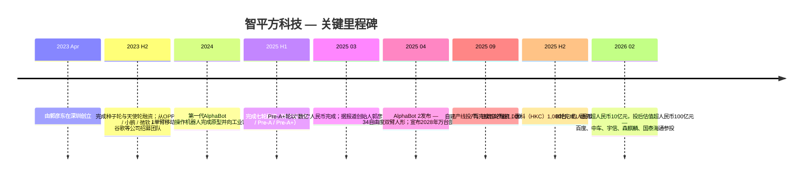
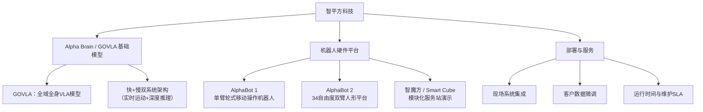
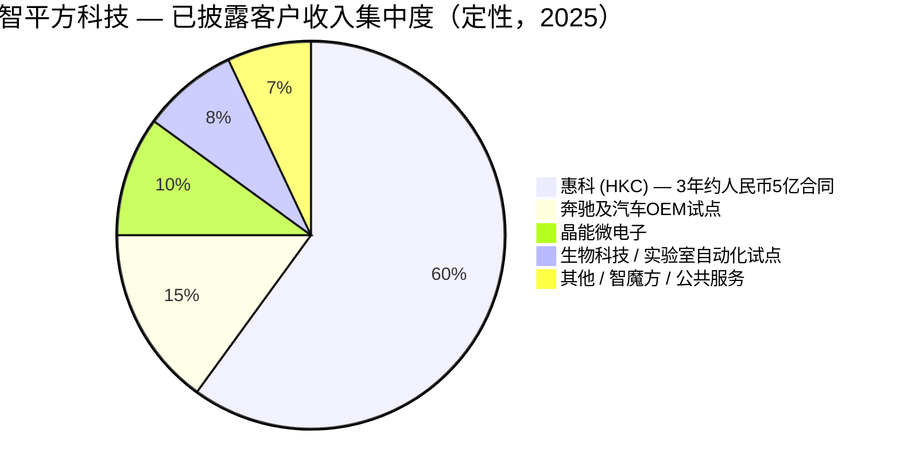
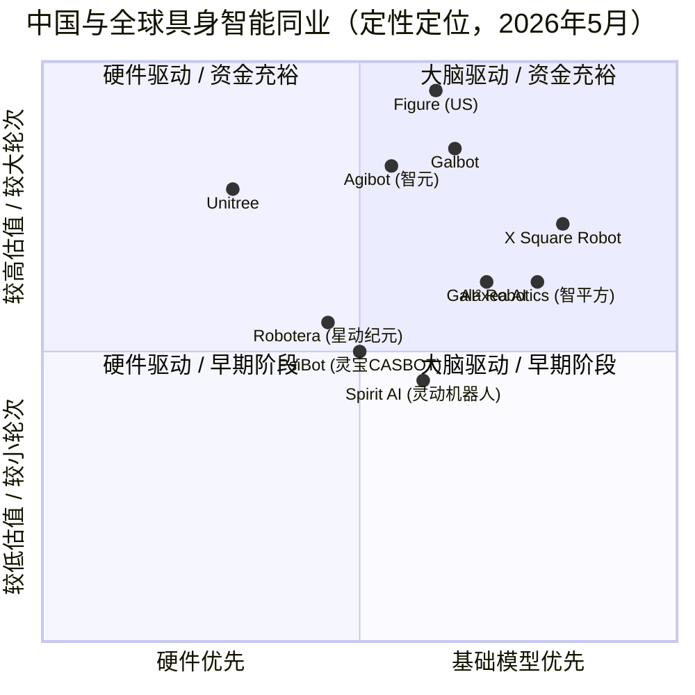

# AI² Robotics (智平方科技) — 公司研究报告
**日期：** 2026-05-19
**状态：** 非上市公司 — 中国深圳
**所属行业：** 具身智能 / 通用人形机器人与移动操作机器人

> **进展更新 — B轮融资完成，金额超过人民币10亿元 / 约1.44亿美元（2026-02-23）：** 智平方科技宣布完成超人民币10亿元的B轮融资，投后估值跃升至人民币100亿元以上（约合14亿美元）。本轮战略投资方包括百度、中车、宇信科技、森麒麟以及国泰海通证券。管理层将本轮融资定位为AlphaBot 2扩产的资本基础——产线规模将从2025年约1,000台/年提升至2026年目标的10,000台/年运行节奏——同时也是公司迈向其2028年"万台部署"商业化目标的过桥资金。资料来源：[Caixin Global, 2026-02-23](https://www.caixinglobal.com/2026-02-23/chinas-ai-robotics-raises-fresh-funds-at-over-10-billion-yuan-valuation-102416310.html)；[The Robot Report, 2026-02](https://www.therobotreport.com/ai2-robotics-raises-series-b-funding-advance-alphabot-embodied-ai/)；[Gasgoo, 2026](https://autonews.gasgoo.com/articles/news/seeds-ai-robotics-officially-announces-completion-of-series-b-round-exceeding-1-billion-yuan-2026536571551883265)。

---

## 目录
1. 公司概览
2. 公司发展历程
3. 管理团队
4. 产品与服务
5. 客户与市场策略
6. 行业概览
7. 竞争格局
8. 市场机会（TAM）
9. 风险评估
参考资料

---

## 1. 公司概览

**智平方科技（AI² Robotics）** —— 英文读作"AI-squared"，标识中带有上标"²" —— 是一家中国非上市的具身智能公司，成立于2023年4月，总部位于深圳市南山区。公司专注于通用智能机器人的设计、制造与商业化，核心理念是：继智能手机和智能汽车之后，下一代主导算力终端将是由视觉-语言-动作（VLA）基础模型驱动、能够在物理世界中自主行动的机器。当前产品线以**AlphaBot**家族为核心——单臂轮式移动操作机器人（AlphaBot 1）和34自由度的双臂人形平台（AlphaBot 2）——两者均搭载公司自研的**Alpha Brain**基础模型，内部称为**GOVLA**（Global & Omni-body Vision-Language-Action，全域全身视觉-语言-动作模型）（[AI² Robotics, About page](https://ai2robotics.com/en/about/)；[RoboticsTomorrow, 2025](https://www.roboticstomorrow.com/content.php?post=25899)）。

公司对于其希望投资者和合作伙伴所形成的类比立场，表达得异乎寻常地直接：AlphaBot之于物理AI，犹如iPhone之于移动互联；而Alpha Brain则是将通用能力与任务专属编程解耦的操作系统。这一立场已转化为明确的商业化路径：智平方并未首先切入消费端（即宇树科技或未来的Tesla Optimus所占据的"人形陪伴"赛道），而是瞄准*工业*与*半工业*部署场景——半导体与显示面板厂、汽车制造、生物科技无菌灌装、巡检等——在这些领域，机器人的价值通过其替代人工的成本来衡量，且终端客户愿意在消费级可靠性尚未验证之前就签订大额多年期采购承诺（[NE时代, 2025-09](https://ne-time.cn/web/article/36685)；[新浪财经, 2025-04-17](https://finance.sina.com.cn/jjxw/2025-04-17/doc-inetnwin2047310.shtml)）。

**商业模式。** 早期阶段呈现三条收入路径：
1. **机器人整机销售** —— 向企业客户直接销售硬件。AlphaBot 2入门配置的对外报价约为15,000美元（行业媒体估算；公司尚未正式公布全球价格表）（[Interesting Engineering, 2025](https://interestingengineering.com/innovation/alphabot-2-future-humanoid-robots)）。已签约的最大单笔合同——惠科（HKC）——据报道金额接近人民币5亿元，三年内交付约1,000台，含集成、服务及现场工程在内的单台均价约人民币50万元（约合7万美元）（[NE时代, 2025-09](https://ne-time.cn/web/article/36685)）。
2. **基础模型授权 / "Alpha Brain inside"** —— 公司已表示有意将其VLA技术栈授权给第三方机器人OEM厂商，但截至本报告撰写时尚未公开披露大额授权交易（*交易层面尚未核实——已标注*）。
3. **持续性服务** —— 部署工程、微调数据服务，以及对已部署机队的SLA运维合约。

**地理布局。** 总部位于深圳南山区，研发主基地同样设于深圳，并于近期投产自有制造产线。创始人郭彦东在公开场合表态，争取到2030年贡献南山区GDP的1%——若按2024年南山区约人民币9,500亿元的GDP直接推算，意味着公司层面经济贡献需达到约人民币95亿元，预计大致对应营业收入水平（*管理层期望性目标——已标注为公开陈述目标，并非具有合同约束力的承诺*）（[新浪财经, 2025-04-18](https://finance.sina.com.cn/roll/2025-04-18/doc-inetqkks4824724.shtml)）。

**规模快照。** 截至2026年初，公司尚未披露员工总数、营业收入或毛利率。公开报道显示，2025年9月自建产线投产，铭牌年产能约1,000台，目标在2026年实现10倍扩产至约10,000台/年，并实现2028年"万台部署"的现场运行里程碑（[新浪财经, 2025-04-18](https://finance.sina.com.cn/roll/2025-04-18/doc-inetqkks4824724.shtml)；[The Robot Report, 2026-02](https://www.therobotreport.com/ai2-robotics-raises-series-b-funding-advance-alphabot-embodied-ai/)）。已披露的客户群覆盖奔驰（Mercedes-Benz）、吉利科技旗下的晶能微电子，以及惠科（HKC）等。

### 估值快照

智平方科技为非上市公司，因此传统的公开市场倍数指标（市盈率、市销率）并不可观察。可比替代指标是**最近一轮融资的投后估值**以及**隐含收入倍数**，两者均需特别说明，因B轮融资期间公司未披露收入数据。

| 指标 | 数值 | 资料来源 |
|---|---|---|
| 成立时间 | 2023年4月 | [AI² Robotics, About page](https://ai2robotics.com/en/about/) |
| 最新融资 | B轮 — 募资超过人民币10亿元 | [Caixin Global, 2026-02-23](https://www.caixinglobal.com/2026-02-23/chinas-ai-robotics-raises-fresh-funds-at-over-10-billion-yuan-valuation-102416310.html) |
| 投后估值 | 超过人民币100亿元（约合14亿美元） | [Caproasia, 2026-02-24](https://www.caproasia.com/2026/02/24/china-robot-company-ai%C2%B2-robotics-yandong-eric-guo-raised-144-million-funding-at-1-4-billion-valuation-founded-in-2023-by-yandong-eric-guo/) |
| 累计融资总额 | 全部轮次合计约1.58亿美元以上 | [Crunchbase, AI² Robotics profile](https://www.crunchbase.com/organization/ai%C2%B2-robotics) |
| 已披露融资轮次数 | 过去12个月内12轮（2025上半年与下半年） | [Robotics 24/7, 2026](https://www.robotics247.com/article/ai-robotics-raises-over-140m-in-series-b-round) |

**隐含收入倍数 — 未经核实。** 公司未公开披露2024年或2025年营业收入。若以惠科合同"三年接近人民币5亿元"作为单一锚定客户运行率贡献的粗略代理指标，并假设2025年全年确认收入合计为人民币1亿至3亿元（分析师测算，*非管理层披露*），则在人民币100亿元投后估值水平下，隐含的市销率将位于30倍至100倍区间——绝对水平极高，但**与可比具身智能融资案例并不脱节**：Galbot投后估值30亿美元，X Square Robot的B轮投后估值超过10亿美元，星动纪元（Robotera）的A+轮约人民币10亿元，相对其有限的商业化收入，所有这些都隐含两位数至三位数的市销率。市场所定价的，是**基础模型与产能的期权价值**，而非当下运行率的现金流（[Robotics & Automation News, 2025-12](https://roboticsandautomationnews.com/2025/12/20/humanoid-robot-maker-galbot-raises-300-million-and-reaches-3-billion-valuation/97783/)；[Inforcapital, 2026-04](https://inforcapital.com/news/embodied-ai-startup-x-square-robot-raises-nearly-276m-in-series-b-led-by-xiaomi-and-sequoia-china/)）。

**为何估值倍数处于此水平。** 三大驱动因素：
1. **中国具身智能板块的溢价。** 摩根士丹利与高盛在2025年均显著上调了人形机器人的TAM预测——摩根士丹利将2050年人形机器人市场规模设定为5万亿美元（[Morgan Stanley, "Humanoid Robot Market Expected to Reach $5 Trillion by 2050"](https://www.morganstanley.com/insights/articles/humanoid-robot-market-5-trillion-by-2050)），高盛则将其2035年预测上调6倍至380亿美元（[blog.robozaps.com, market-size summary, 2025](https://blog.robozaps.com/b/market-size-for-humanoid-robots)）。
2. **基础模型的期权价值。** 看多逻辑将AlphaBot机队视为一支可生成数据的舰队，为Alpha Brain（GOVLA）持续累积价值——这与多年来特斯拉看多逻辑将FSD车队视为同类资产的方式如出一辙。
3. **创始人履历背书。** 郭彦东早年曾在OPPO与小鹏汽车XPeng出任首席科学家——这两家公司都已交付数以亿计的智能终端——这为一线战略投资方（百度、中车）提供了知名度较低的创始人所不具备的信誉锚点（[腾讯新闻, 2025-03-07](https://news.qq.com/rain/a/20250307A034DJ00)；[IDEA Research Institute, Guo Yandong profile](https://www.idea.edu.cn/team/5829.html)）。

反向观点：在投后估值14亿美元、年化收入低于人民币5亿元的水平上（分析师估算，*已标注为未核实*），这是一笔典型的风险投资定价资产，估值倍数压缩风险真实存在。如果2027年的产能未能转化为2027年的*已签约在手订单收入*，则下调估值再融资（down-round）的可能性将明显上升——尤其考虑到该赛道资本饱和度极高（详见第9节，财务风险）。

---

## 2. 公司发展历程

智平方科技由**郭彦东**于2023年4月在深圳创立。创始论点——在多次创始人访谈中均有阐述——为：大型多模态模型已经达到了足够的泛化阈值，使得单一基础模型有可能同时驱动跨越开放式任务空间的感知与动作，从而取代过去四十年来定义工业及服务机器人的任务专属编程范式。在成立之初，郭彦东的判断是：彼时只有谷歌（RT-2时代）与特斯拉（Optimus原型机之前）在追求同样全集成的VLA路线；中国生态系统中的其他公司都是硬件优先，而VLA / "机器人大脑"层仍被视为远期工作（[新浪财经, 2025-03-06](https://finance.sina.com.cn/jjxw/2025-03-06/doc-inensrzt1048673.shtml)；[Bianews, 2025-09](https://www.bianews.com/news/details?id=222141)）。

资料来源：[Caixin Global, 2026-02-23](https://www.caixinglobal.com/2026-02-23/chinas-ai-robotics-raises-fresh-funds-at-over-10-billion-yuan-valuation-102416310.html)；[腾讯新闻, 2025-03-07](https://news.qq.com/rain/a/20250307A034DJ00)；[NE时代, 2025-09](https://ne-time.cn/web/article/36685)；[新浪财经, 2025-04-18](https://finance.sina.com.cn/roll/2025-04-18/doc-inetqkks4824724.shtml)。

### 战略转型与变革

**转型1 — 从"单臂移动操作机器人"到"人形双臂形态"（2024 → 2025）。** AlphaBot 1最初被定义为单臂轮式移动操作平台——一种针对工业取放、物料搬运与巡检任务而刻意保守的形态。截至2025年4月，公司发布的AlphaBot 2具备34自由度，双臂跨度700毫米、配合升降腰腿结构最大触及达2.4米，并具备0至2.4米的作业高度范围。这一转型并非否定单臂形态，而是延伸：AlphaBot 2瞄准需要双手协调的任务（如烹饪、无菌灌装、料箱装配），AlphaBot 1则继续作为单臂即可胜任、成本更低的部署场景中的主力机型（[Aparobot, AlphaBot 2 spec page](https://www.aparobot.com/robots/alphabot-2)；[新浪财经, 2025-04-17](https://finance.sina.com.cn/jjxw/2025-04-17/doc-inetnwin2047310.shtml)）。

**转型2 — 从"代工外包"到"自建产线"（2025年中）。** 2025年9月，公司投产具备1,000台铭牌年产能的自有制造工厂，标志一个关键拐点：智平方选择将制造环节内化，而非依赖OEM合作伙伴，理由是出于质量控制与知识产权保护考虑（郭彦东访谈用语）。产线规划是到2026年10倍扩产至10,000台/年（[新浪财经, 2025-04-18](https://finance.sina.com.cn/roll/2025-04-18/doc-inetqkks4824724.shtml)）。

**转型3 — 从"研究优先"到"锚定客户优先的市场策略"（2025年）。** 2025年在半导体显示制造领域签下惠科1,000台合同，使公司的叙事从"VLA研究型初创"重构为"经工业客户验证的商业化机器人公司"——这也直接推动了仅数月之后B轮以人民币百亿元估值完成（[NE时代, 2025-09](https://ne-time.cn/web/article/36685)）。

### 并购
迄今未有公开披露的并购活动。公司是人才的净吸纳方，而非业务的收购方。

### 近12个月重要进展
- **2025-04** AlphaBot 2发布，搭载由GOVLA驱动的Alpha Brain。
- **2025-09** 1,000台铭牌产能的自有产线投产运行。
- **2025-Q4** 惠科3年、约人民币5亿元、1,000台合同公布。
- **2026-02** B轮完成，融资超人民币10亿元，投后估值超人民币100亿元。

---

## 3. 管理团队

### 郭彦东 — 创始人兼首席执行官

郭彦东是智平方科技的核心人物，且——根据报道，在2025年初Pre-A+轮后持股比例为69%——同样是公司的控股股东（[腾讯新闻, 2025-03-07](https://news.qq.com/rain/a/20250307A034DJ00)）。其创业之前的职业轨迹横跨三个具有制度意义的阶段，三者合在一起构成了智平方每一轮融资背后隐含的信誉论证。

**教育背景。** 北京邮电大学学士与硕士学位，随后获美国普渡大学（Purdue University）博士学位，据报道由一位美国国家工程院院士指导（[新浪财经, 2025-09-28](https://finance.sina.com.cn/stock/t/2025-09-28/doc-infsamfc8725940.shtml)；[IDEA Research Institute, Guo Yandong page](https://www.idea.edu.cn/team/5829.html)）。研究方向：计算机视觉与机器学习。

**微软研究院（美国总部），约2010年代。** 郭彦东加入微软（Microsoft）位于美国的核心AI团队，其计算机视觉工作支撑了Bing图像搜索与Azure认知服务中的多项功能。其所在微软团队与多位图灵奖得主领导的团队并肩工作——郭彦东在访谈中频繁援引这一背景，用以解释他在模型架构决策上的思路（[Bianews, 2025-09](https://www.bianews.com/news/details?id=222141)）。

**小鹏汽车XPeng，2018–2020。** 2018年，郭彦东离开微软加盟早期阶段的小鹏汽车（电动车制造商XPeng），明确肩负将深度学习架构引入自动驾驶技术栈的使命。他担任感知方向的首席科学家。这是他第一次进入运营型公司任职，也是他首次接触汽车规模下的端侧闭环部署——这一经历直接关联到他后来创立智平方所基于的具身智能论点（[Bianews, 2025-09](https://www.bianews.com/news/details?id=222141)；[腾讯新闻, 2025-03-07](https://news.qq.com/rain/a/20250307A034DJ00)）。

**OPPO（2020–2023）。** 2020年至2023年初，郭彦东在OPPO担任**首席科学家（智能感知方向）**，职责涵盖AI技术规划、计算机视觉算法以及端侧感知。在他的领导下，OPPO的AI团队每年申请数百项AI专利，相关功能搭载于该时期推出的所有Reno中端机型与Find系列旗舰机型上。他公开表示其团队"每年数百项AI专利"——*在单项专利层面未经核实，但与OPPO整体专利披露状况一致*（[Bianews, 2025-09](https://www.bianews.com/news/details?id=222141)；[新浪财经, 2025-03-06](https://finance.sina.com.cn/jjxw/2025-03-06/doc-inensrzt1048673.shtml)）。

**创业初心（2023年4月）。** 郭彦东将其创业的契机描述为：他意识到曾在2018至2022年间推动LLM从无用变为可用的基础模型放大法则，同样可应用于机器人动作策略——而且从结构上看，他认为只有谷歌、特斯拉以及（他相信）智平方押注于单一统一的VLA模型。公司名称"AI squared"本身即在表达*数字AI*（大脑）与*物理AI*（躯体）相乘的复合产品概念（[新浪财经, 2025-09-28](https://finance.sina.com.cn/stock/t/2025-09-28/doc-infsamfc8725940.shtml)）。

**持股与控制权。** 据报道，2025年3月Pre-A+轮后持股69%——这一比例在B轮后几乎肯定将出现明显稀释，但创始人控股仍大概率保持在50%以上。*B轮后的具体持股比例未予披露；标注为未经核实。*

**公开形象。** 与中国硬科技领域大多数创始人相比，郭彦东对媒体的活跃度异乎寻常，曾接受新浪财经、36氪、CSDN、Bianews等多家媒体的深度专访。他在多个场合发表题为《没有技术自信，中国机器人就没有创新突破》的演讲，其立场被构建为对部分中国硬件创业公司模仿西方设计倾向的反思（[新浪财经, 2025-09-28](https://finance.sina.com.cn/stock/t/2025-09-28/doc-infsamfc8725940.shtml)）。

### 首席财务官（CFO）

**未公开披露。** 截至本报告撰写之时，智平方科技尚未公开任命首席财务官。一家投后估值14亿美元的公司在没有公开任命CFO的情况下完成B轮融资，相对而言略显反常；这暗示该职务要么由一位未曾公开亮相的财务负责人担任，要么资本市场层面的职责仍由郭彦东本人结合外部顾问（鉴于国泰海通参投B轮，可能即为其顾问）担纲。*已标注为信息披露缺口。*

### 其他高管与核心团队

公司尚未发布官方英文版的高管团队页面，除创始人之外的具名CXO目前尚未对外披露。公开陈述将核心团队来源描述为：

- **微软（雷德蒙）** —— AI / CV研究院校友
- **谷歌** —— AI研究与机器人方向校友
- **OPPO** —— 智能终端产品与AI工程校友（郭彦东本人的前直接下属）
- **小鹏汽车XPeng** —— 自动驾驶与感知工程校友
- **Momenta（自动驾驶公司）** —— 感知 / 规划工程
- **清华大学、北京大学、卡内基梅隆大学（CMU）、加州大学伯克利分校（UC Berkeley）** —— 学术招聘

公司公开宣称其技术团队中有"5位斯坦福全球前2%顶尖科学家"（援引斯坦福每年发布的"World's Top 2% Scientists"榜单）——*标注为管理层陈述数据，未披露个人姓名*（[ai2robotics.com, About](https://ai2robotics.com/en/about/)）。

### 公司治理

- **董事会构成：** 未公开披露。鉴于B轮后机构股东结构（百度、中车、国泰海通等），主要轮次的领投方几乎肯定获得董事会席位；具体构成属于非公开信息。*标注为未经核实。*
- **内部人持股：** 创始人在Pre-A+（2025年3月）后约持有69%；B轮后比例未予披露。
- **薪酬结构：** 未予披露；处于风险投资阶段的薪酬据推测以权益激励为主。
- **关联方交易：** 未披露任何相关情况。

### 履历综合评估

就最重要的座位（首席执行官）而言，单一创始人简历较为有利。郭彦东具备值得信赖的一线研究履历（微软、普渡博士），并且——对于工业机器人商业化论点至关重要——拥有两段消费级规模交付智能终端的运营经验（小鹏的车辆、OPPO的手机）。短板在于队伍深度：在没有公开任命CFO、COO、CTO的情况下，智平方实际上是在押注郭彦东本人能够将四个高级管理岗位压缩为一人——在不足200人的初创公司中尚可，但随着员工规模向支撑10,000台/年制造产线所需的水平扩张，这一点将构成压力。

---

## 4. 产品与服务

截至2026年中，智平方科技的产品组合建立在单一基础模型"大脑"（Alpha Brain / GOVLA）与两款机器人"躯体"SKU（AlphaBot 1、AlphaBot 2）之上，第三款产品——小型化模块化"智魔方"（Zhi-Mo-Fang，有时译作"Smart Cube"）服务亭——更多用作演示载体而非高量产品。

资料来源：[ai2robotics.com, About](https://ai2robotics.com/en/about/)；[Aparobot, AlphaBot 2 spec page](https://www.aparobot.com/robots/alphabot-2)；[RoboticsTomorrow, 2025](https://www.roboticstomorrow.com/content.php?post=25899)。

### 4.1 Alpha Brain（基础模型）—— 含GOVLA

**功能定位。** Alpha Brain是公司自研的多模态基础模型，输入视觉、语言、本体感觉与力觉传感数据，输出AlphaBot平台所需的连续电机控制指令序列。该模型旗舰架构GOVLA（Global & Omni-body Vision-Language-Action，全域全身视觉-语言-动作）被定位为单一技术栈模型，而非由独立训练模块组成的感知→规划→控制流水线。公布的能力包括：360°空间理解、全身协调、多步任务分解、自然语言交互界面。系统采用**"快+慢"双系统**架构，快速实时回路负责即时运动控制，较慢的推理回路负责多步规划生成（[RoboticsTomorrow, 2025](https://www.roboticstomorrow.com/content.php?post=25899)；[Alabia Insights, 2025](https://alabia.com.br/insights/trabalho/empregos/ai2-robotics-govla-embodied-ai-productivity/)）。

**竞争优势判定：部分构成——技术 / IP护城河，取决于数据飞轮。** 该优势存在前提条件。截至本报告日期，**没有任何**领先的中国具身智能初创公司在同行评审或独立基准评测环境中公开展示出明显占优的VLA模型；行业整体处于基准前阶段（[量子位, 2024 — 具身智能GPT-2时刻](https://blog.csdn.net/QbitAI/article/details/144755756)）。Alpha Brain的优势（若存在）建立在：（a）在中国同行中较早采用统一VLA架构的先发位置；（b）部署中的AlphaBot单位持续累积的闭环数据集；（c）郭彦东本人的感知研究背景（[AI² Robotics 创始人访谈](https://ai2robotics.com/en/%E4%B8%93%E8%AE%BF%E6%99%BA%E5%B9%B3%E6%96%B9%E5%88%9B%E5%A7%8B%E4%BA%BA%E9%83%AD%E5%BD%A6%E4%B8%9C%E4%BA%BA%E5%BD%A2%E6%9C%BA%E5%99%A8%E4%BA%BA%E7%A1%AC%E4%BB%B6%E6%AD%A3/)）。**最直接的竞品模型：Google的RT-2 / RT-X系列（英语学术基线）以及X方机器人（X Square Robot）的WALL-A模型（最接近的中国同行）**（[X Square Robot, Robotics 24/7 coverage](https://www.therobotreport.com/x-square-robot-secures-140m-in-funding-for-ai-foundation-models/)）——已公开展示能力相当，学术论文足迹方面落后。

### 4.2 AlphaBot 1 —— 单臂轮式移动操作机器人

**功能定位。** AlphaBot 1是公司首款投入商业部署的平台：带单臂的轮式移动底盘，针对工业取放、机器单元间物料搬运及巡检任务设计。在已公开的奔驰与晶能微电子部署影像中，绝大多数为这一平台。*相比AlphaBot 2，AlphaBot 1的详细公开技术规格资料较为稀少——已标注。*

**目标客户。** 制造业（汽车OEM、半导体 / 显示面板厂、电子组装），即单臂、固定基座或移动取放臂在运营层面足以满足需求、且较低单台成本相较于AlphaBot 2具有实质意义的场景（[新浪财经, 2025-04-17](https://finance.sina.com.cn/jjxw/2025-04-17/doc-inetnwin2047310.shtml)）。

**定价。** 在单机层面尚未公开披露。从惠科合同（约人民币5亿元 / 约1,000台 / 3年）反推，含集成的综合单台均价约为人民币50万元（约合7万美元）；纯硬件ASP大概率更低（[机器人大讲堂, 2025-09 — 惠科订单价值或达5亿元](https://www.leaderobot.com/news/6326)）。

**竞争优势判定：部分构成——应用+品牌护城河，硬件趋于商品化。** 单臂移动操作机器人形态本身并非架构上的新发明——Galbot的轮式平台、波士顿动力的Stretch、极智嘉Geek+ / 海柔创新Hai Robotics的商业仓储机器人都占据相邻领域（[Robotics & Automation News, 2025-12-20](https://roboticsandautomationnews.com/2025/12/20/humanoid-robot-maker-galbot-raises-300-million-and-reaches-3-billion-valuation/97783/)）。AlphaBot 1的差异化在于：（a）其上层的Alpha Brain技术栈——使同一台机器人在无需重新编程的前提下执行性质上不同的任务；（b）小但真实的客户参考案例（奔驰、晶能、惠科），这是竞争对手目前还无法在相同规模上拿出的（[NE时代, 2025-09](https://ne-time.cn/web/article/36685)；[21经济网, 2025-04-18](https://www.21jingji.com/article/20250418/herald/375a27631a594da3b2c3d8d804ade0e7.html)）。**最直接的竞品：Galbot的轮式单臂机器人**——硬件能力相当，部署足迹更小，但消费叙事面更受关注。

### 4.3 AlphaBot 2 —— 34自由度双臂人形平台

**功能定位。** AlphaBot 2是2025年4月发布的下一代旗舰平台。以下规格综合自公司发布材料与第三方规格数据库：
- **自由度：** 34
- **臂展：** 单臂700毫米，借助升降腰腿结构时**最大触及达2.40米**
- **作业高度范围：** 0至2.4米（覆盖地面取物到头顶作业）
- **传感套件：** 多摄像头360°视觉、双臂与手腕的力 / 力矩反馈传感器、麦克风阵列、环境传感器
- **运动方式：** 轮式底盘（非双足行走——明确*不是*波士顿动力Atlas式的双足形态）
- **软件：** Alpha Brain / GOVLA，采用"快+慢"双系统架构
- **已展示任务：** 自主烹饪、调饮、生物科技洁净室无菌灌装、多步巡检、骰子 / 扑克牌操控（作为灵巧性演示）
- **少样本学习：** 经5–10次人类示范即可习得新任务（公司宣称）
- **公开入门价格：** 约15,000美元（行业媒体估算；SKU层面未经官方确认）

资料来源：[Aparobot, AlphaBot 2 spec](https://www.aparobot.com/robots/alphabot-2)；[Interesting Engineering, 2025](https://interestingengineering.com/innovation/alphabot-2-future-humanoid-robots)；[新浪财经, 2025-04-17 launch coverage](https://finance.sina.com.cn/jjxw/2025-04-17/doc-inetnwin2047310.shtml)；[CNN Business — AlphaBot 2 video feature](https://edition.cnn.com/business/alpha-bot-humanoid-robots-china-embodied-ai-hnk-spc)。

**目标客户。** 与AlphaBot 1相同的垂直行业组合，再加上需要双手操作的任务：生物科技无菌灌装、食品服务备餐、零售货架补货以及面向消费者的演示场景（[Interesting Engineering, 2025 — AlphaBot 2 dice-rolling humanoid](https://interestingengineering.com/innovation/alphabot-2-future-humanoid-robots)；[Aparobot, AlphaBot 2 spec page](https://www.aparobot.com/robots/alphabot-2)）。

**竞争优势判定：部分构成——护城河来自集成的大脑+躯体技术栈，但硬件规格可被追赶。** 在公开追踪到的约20款中国人形平台中（[XCarspace, Top 20 Chinese Humanoid Robot Companies](https://xcarspace.com/top-20-chinese-humanoid-robot-companies-ranked-by-valuation/)），AlphaBot 2的"34自由度双臂+升降腰腿+轮式底盘"是独特的组合——大多数同行选择了双足行走（宇树科技Unitree、星动纪元Robotera），或完全静态的双臂（Galaxea G1）（[新浪财经, 2025-04-17](https://finance.sina.com.cn/jjxw/2025-04-17/doc-inetnwin2047310.shtml)）。智平方的"轮式+升降"选择在2026年的工业部署场景中比双足行走更具操作可行性（[OFweek, 2025-04 — 对标特斯拉Optimus](https://m.ofweek.com/ai/2025-04/ART-201700-8110-30662149.html)）。但**硬件**层面，意志坚定的竞争对手在18–24个月内可追平差距；可持续的护城河（若存在）落在Alpha Brain训练数据与客户部署参考集合的交叉处。**最直接的竞品：X方机器人（X Square Robot）的Quanta X2半人形平台（轮式、双臂、VLA驱动）**——所述能力相当，融资规模领先，已披露工业参考客户落后（[X Square Robot, The Robot Report, 2026-01](https://www.therobotreport.com/x-square-robot-secures-140m-in-funding-for-ai-foundation-models/)）。

### 4.4 智魔方（Smart Cube）—— 模块化服务空间演示

一种自带封装的模块化亭式 / 展位形态，内嵌一台AlphaBot，在单一可移动空间内展示烹饪、饮品、零售、娱乐等用例。功能上属于演示载体与最终服务机器人垂直市场的试点产品，并非高量SKU。该产品在发布材料中被提及，但据本报告所知，尚未实现规模化部署（[Interesting Engineering, "China robotics firm unveils world's first modular AI service space"](https://interestingengineering.com/ai-robotics/china-modular-embodied-ai-service-space)）。

### 旗舰产品与长尾产品

在三款平台中，**AlphaBot 2按公司宣传定位是旗舰产品，AlphaBot 1按当前收入贡献是走量主力**。2025年惠科合同主要由AlphaBot 1机型完成交付（应用——面板厂物料搬运——并不需要双臂双手协调）（[NE时代, 2025-09](https://ne-time.cn/web/article/36685)）。AlphaBot 2则被定位为承接2026–2028年生物科技、食品服务及复杂装配场景下下一波部署需求的平台（[21经济网, 2025-04-18](https://www.21jingji.com/article/20250418/herald/375a27631a594da3b2c3d8d804ade0e7.html)）。

### 近期发布与产品路线图（过去12个月）

- **2025年4月** AlphaBot 2发布，搭载GOVLA驱动的Alpha Brain（[新浪财经, 2025-04-17](https://finance.sina.com.cn/jjxw/2025-04-17/doc-inetnwin2047310.shtml)）。
- **2025年中** 智魔方模块化服务空间公开演示（[Interesting Engineering, "World's first modular AI service space"](https://interestingengineering.com/ai-robotics/china-modular-embodied-ai-service-space)）。
- **2025年Q4 / 2026年Q1** Alpha Brain持续迭代，细化双系统架构与改进力反馈控制（公司公开沟通中未明确版本号）（[Alabia Insights, 2025 — GOVLA model](https://alabia.com.br/insights/trabalho/empregos/ai2-robotics-govla-embodied-ai-productivity/)）。
- **2026年规划** 产能扩张至10,000台/年；随着生物科技与食品服务场景部署放量，AlphaBot 2预计在出货结构中占比上升（[The Robot Report, 2026-02](https://www.therobotreport.com/ai2-robotics-raises-series-b-funding-advance-alphabot-embodied-ai/)）。

---

## 5. 客户与市场策略

### 客户细分

智平方科技已部署的客户群——经公司新闻稿与行业媒体报道核实——可归入五个可识别的行业集群：

1. **汽车制造** —— 奔驰（Mercedes-Benz）是头部参考客户。AlphaBot机型已在汽车制造场景中部署，作为更广泛工厂自动化试点的一部分。奔驰合作已公开命名，但部署台数与合同金额未予披露（[21经济网, 2025-04-18](https://www.21jingji.com/article/20250418/herald/375a27631a594da3b2c3d8d804ade0e7.html)）。
2. **半导体与显示制造** —— 两家具名客户：
   - **晶能微电子（浙江晶能微电子）**，吉利旗下的汽车半导体公司。AlphaBot已部署用于晶能智能半导体生产基地的跨工位物料搬运与上下料（2025年3月签订战略合作协议）。
   - **惠科（HKC / 深圳惠智物联科技子公司）**，全球显示面板制造商。惠科合同——2025年末公布——覆盖三年内向惠科全球生产基地累计交付**超过1,000台具身智能机器人**，应用场景跨越仓储物流、物料上料、零件装配与质量检测。合同金额据报道接近**人民币5亿元**（[NE时代, 2025-09](https://ne-time.cn/web/article/36685)）。
3. **生物科技** —— 无菌灌装与实验室自动化；具体客户名称尚未公开。
4. **公共服务 / 零售** —— 公司材料中提及，但未披露具名锚定客户。
5. **演示 / 体验** —— 智魔方相关安装。

资料来源：基于[NE时代, 2025-09 — HKC contract coverage](https://ne-time.cn/web/article/36685)与[21经济网, 2025-04 — Mercedes / JINENG references](https://www.21jingji.com/article/20250418/herald/375a27631a594da3b2c3d8d804ade0e7.html)的定性分析师估算；**公司未公开披露按客户划分的收入集中度——图表仅作示意，非经审计数据。**

### 客户集中度 — 量化分析

**公司未公开披露前一大或前五大客户的收入集中度**，因智平方科技为非上市公司，不受A股"前五名客户"披露规则约束。基于已公开披露的惠科合同（三年约人民币5亿元，按线性确认估算每年约人民币1.5–1.7亿元）以及目前没有任何其他可与之比拟规模的合同存在，合理的分析师估算是：**惠科单一客户即占智平方科技已签约前瞻性收入的40–60%以上**（[NE时代, 2025-09 — 智平方斩获人形机器人大单](https://ne-time.cn/web/article/36685)）。若属实，这是一项实质性的客户集中度风险，已纳入第9节。

**合同结构。** 惠科为多年框架协议形式，部署计划跨越三年、覆盖多个生产基地（[网易, 2025-09 — 智平方获面板企业千台订单](https://c.m.163.com/news/a/K96LE8N300098IEO.html)）。奔驰似乎是按订单逐次推进的试点关系，而非主框架协议（[21经济网, 2025-04-18](https://www.21jingji.com/article/20250418/herald/375a27631a594da3b2c3d8d804ade0e7.html)）。*详细条款未公开披露——已标注。*

### 渠道分销

直销面向企业客户——智平方科技的市场策略采用直接现场工程结合现场集成的模式。目前没有公开披露与系统集成商或VAR生态的渠道合作伙伴计划。鉴于平均单笔合同规模（多年期、人民币数千万至数亿元）以及应用场景化微调的需要，在当前成熟度阶段直销是正确的选择（[新浪财经, 2025-04-18](https://finance.sina.com.cn/roll/2025-04-18/doc-inetqkks4824724.shtml)）。

### 销售策略与销售周期

已披露的赢单遵循一种可识别的模式：先与客户的高管（通常是制造运营负责人或首席数字官）直接对接，开展数月的窄任务试点，若试点成功，再就多年期框架协议进行谈判（[量子位, 2025-03 — 晶能微合作](https://www.qbitai.com/2025/03/265579.html)；[NE时代, 2025-09](https://ne-time.cn/web/article/36685)）。从首次试点到签订首份多机采购订单的销售周期合理估计为6–12个月（[新浪财经, 2025-03-06 — 创始人访谈](https://finance.sina.com.cn/jjxw/2025-03-06/doc-inensrzt1048673.shtml)）。

### 关键合作伙伴

- **百度** —— B轮战略投资方，预计提供云计算与基础模型合作；运营合作的具体形式尚未正式披露（[Caixin Global, 2026-02-23](https://www.caixinglobal.com/2026-02-23/chinas-ai-robotics-raises-fresh-funds-at-over-10-billion-yuan-valuation-102416310.html)）。
- **中车（CRRC）** —— B轮战略投资方；铁路制造应用领域的潜在客户（[The Robot Report, 2026-02](https://www.therobotreport.com/ai2-robotics-raises-series-b-funding-advance-alphabot-embodied-ai/)）。
- **宇信科技、森麒麟、国泰海通证券** —— 在垂直客户或资本市场层面具备相关性的战略投资方（[Gasgoo, 2026](https://autonews.gasgoo.com/articles/news/seeds-ai-robotics-officially-announces-completion-of-series-b-round-exceeding-1-billion-yuan-2026536571551883265)）。
- **吉利科技集团** —— 晶能微电子属于吉利科技体系；持续运营合作（[搜狐, 2025-03 — 吉利科技与智平方战略合作](https://www.sohu.com/a/872946965_121956424)）。

### 客户案例（具名赢单）

惠科合同是迄今中国工业人形机器人商业化中战略意义最为重要的公开具名合同之一。"1,000台 / 3年 / 人民币5亿元"的合同结构提供了少有竞争对手能够匹敌的在手订单锚点（[机器人大讲堂, 2025-09 — 半导体显示首次迎来具身智能机器人](https://www.leaderobot.com/news/6326)；[NE时代, 2025-09](https://ne-time.cn/web/article/36685)）。奔驰这一参考客户即使金额相对较小，但对国际扩张所带来的信誉加持效应却远超合同本身的财务体量（[21经济网, 2025-04-18](https://www.21jingji.com/article/20250418/herald/375a27631a594da3b2c3d8d804ade0e7.html)）。

---

## 6. 行业概览

### 行业定义与范围

智平方科技所处行业可被最准确地描述为**具身智能 / 通用智能机器人**，其中公司具体瞄准两个子细分：

1. **工业移动操作机器人与人形机器人** —— 在工厂、晶圆厂、实验室中与人类工人并肩或替代人类工人作业的机器人。
2. **服务 / 商业人形机器人** —— 部署于零售、餐饮、公共信息环境的机器人。（智平方科技的智魔方载体定位于此处，但截至2026年并非公司收入中心。）

相邻行业包括传统工业机器人（发那科Fanuc、ABB、安川Yaskawa——智能水平较低的关节臂机器人）、协作机器人（优傲Universal Robots、斗山Doosan——智能水平有限）、自主移动机器人（极智嘉Geek+、海柔创新Hai Robotics——具备移动但无操作灵巧性）以及商业服务机器人（普渡Pudu、擎朗KEENON——窄域自主能力）。

### 市场规模与结构

**全球人形机器人市场。** 摩根士丹利的2050年标志性数据——5万亿美元的总可触达市场、从近乎零基数出发以约88%的CAGR增长——是被引用最多的长期预测（[Morgan Stanley, "Humanoid Robot Market Expected to Reach $5 Trillion by 2050"](https://www.morganstanley.com/insights/articles/humanoid-robot-market-5-trillion-by-2050)）。高盛在2025年将其2035年人形机器人预测上调6倍，从此前的约60亿美元提升至约380亿美元——绝对值更小，但2035年之前的增长曲线明显更陡（[blog.robozaps.com market-size summary, 2025](https://blog.robozaps.com/b/market-size-for-humanoid-robots)）。

**中国人形机器人市场。** 具体预测如下：
- 2024年：约人民币27.6亿元（约合3.8亿美元）
- 2026年：约人民币104.7亿元（约合14亿美元）
- 2029年：约人民币750亿元（约合103亿美元），占全球市场约32.7%

资料来源：[Premia Partners, "Embodied AI – China as the global powerhouse for industrial and humanoid robotics"](https://www.premia-partners.com/insight/embodied-ai-china-as-the-global-powerhouse-for-industrial-and-humanoid-robotics)；[China Briefing, "The Chinese Humanoid Robot AI Market"](https://www.china-briefing.com/news/chinese-humanoid-robot-market-opportunities/)。

**更广义的中国具身智能市场**（人形机器人的母集合——含工业移动操作机器人、无人机等）：预计从2024年人民币8,634亿元增至2025年人民币9,731亿元（来源同上Premia Partners）。2025年的数字实质上非常庞大，是因为其涵盖了广泛的自动化范畴；**特指人形机器人**的子细分要小得多（即上文人民币27.6亿元 / 104.7亿元 / 750亿元的序列）。

### 增长速度

历史回顾：全球人形机器人出货量从2023年的数百台跃升至2025年的数千台（仅宇树科技单家2025年即报告售出5,500台；[TechCrunch, 2026-02-28](https://techcrunch.com/2026/02/28/why-chinas-humanoid-robot-industry-is-winning-the-early-market/)）。GGII《2025中国人形机器人产业发展蓝皮书》进一步预测2025年全球出货量达1.24万台，其中中国出货量约7,300台；2026年中国出货量将快速跃升至约6.25万台（[新浪财经, 2026-01-10 — 引用GGII数据](https://finance.sina.com.cn/jjxw/2026-01-10/doc-inhftucf5584819.shtml)）。

未来预测：根据上述Premia数据，2024 → 2029年中国人形机器人CAGR约为95%，五年内规模扩张五倍以上；GGII预测到2030年全球出货量近34万台、市场规模超640亿元，至2035年出货量突破500万台、市场规模超4,000亿元（[新浪财经, 2026-01-10 — 引用GGII数据](https://finance.sina.com.cn/jjxw/2026-01-10/doc-inhftucf5584819.shtml)）。

### 关键趋势与驱动因素

1. **VLA基础模型压缩了将机器人编程到新任务所需的成本。** 在VLA出现之前，将机器人部署到新工厂单元需要手工设计感知+规划+控制逻辑——每个单元通常需要数月人力。借助VLA模型，同一台机器人通过少量示范即可在新任务上重新训练（[RoboticsTomorrow, 2025 — GOVLA-Powered AlphaBot 2](https://www.roboticstomorrow.com/content.php?post=25899)；[量子位, 2024 — 具身智能GPT-2时刻](https://blog.csdn.net/QbitAI/article/details/144755756)）。
2. **中国制造业劳动力成本上升足以使人形机器人经济性变得可被论证。** 中国制造业工资中位数已多年接近甚至超过东欧欧盟成员国的水平——2024年规模以上企业生产制造及有关人员年平均工资为人民币78,561元，自2013年以来私营 / 非私营部门制造业薪资年均增长率分别为9.1% / 9.5%（[国家统计局, 2025-05-16 — 2024年城镇单位就业人员年平均工资情况](https://www.stats.gov.cn/sj/zxfb/202505/t20250516_1959826.html)）。针对每年单价5万至10万美元、按两班制运行的机器人，其在多种工厂场景下的人工替代回本期约为18–30个月。
3. **国家级产业政策。** 北京及地方政府已明确将具身智能 / 人形机器人列为战略前沿产业。工业和信息化部2023年10月印发的《人形机器人创新发展指导意见》（工信部科〔2023〕193号）明确提出2025年人形机器人创新体系初步建立、2027年形成安全可靠的产业链供应链体系（[工信部, 2023-10-20 — 人形机器人创新发展指导意见](https://www.miit.gov.cn/zwgk/zcwj/wjfb/tz/art/2023/art_48fe01d562644aedb7ea3f4256df8190.html)）。摩根士丹利指出，"对'具身AI'的国家支持力度在中国可能远高于任何其他国家"（[Morgan Stanley insights, 2025](https://www.morganstanley.com/insights/articles/humanoid-robot-market-5-trillion-by-2050)）。
4. **地缘政治 — 半导体与零部件可获得性。** 大多数中国人形平台（含AlphaBot）依赖国内可获取的算力、电机与传感器。在受出口管制的美国芯片被逐步排除于中国AI训练基础设施之外的地缘政治环境下，"中国技术栈"闭环开发模式更具优势（[Premia Partners, "Embodied AI – China as the global powerhouse"](https://www.premia-partners.com/insight/embodied-ai-china-as-the-global-powerhouse-for-industrial-and-humanoid-robotics)）。
5. **资本饱和。** 2025年全球人形机器人出货量中有81%来自中国公司，且VC资本集中度前所未有——智平方本身在一年内即完成12轮融资（[TechCrunch, 2026-02-28](https://techcrunch.com/2026/02/28/why-chinas-humanoid-robot-industry-is-winning-the-early-market/)；[Robotics 24/7, 2026](https://www.robotics247.com/article/ai-robotics-raises-over-140m-in-series-b-round)）。资本密集度的副作用是赛道拥挤，2027–2028年很可能进入整合期（[TheAIInsider, 2025-12-31](https://theaiinsider.tech/2025/12/31/ai-insiders-robotics-funding-year-in-review/)）。

### 监管环境

中国的机器人专属监管目前仍较为宽松，但新兴的考量点包括（[工信部, 2023 — 指导意见解读](https://www.miit.gov.cn/zwgk/zcjd/art/2023/art_e3f5686c2f0d49f9968b7ae011d558e1.html)）：
- 在共享工作空间中人-机交互的**工业安全标准**。
- **数据安全** —— 具身机器人会从客户场地采集大量传感器数据；客户侧IT合规与新兴的中国数据保护规则将共同塑造合同结构。
- **出口管制** —— 出口到某些市场的中国人形机器人会受到美方审查（[Premia Partners — Embodied AI China](https://www.premia-partners.com/insight/embodied-ai-china-as-the-global-powerhouse-for-industrial-and-humanoid-robotics)）。

### 行业动态

- **分散度：** 高度分散。约20余家中国人形机器人初创公司（[XCarspace — Top 20 Chinese Humanoid Robot Companies](https://xcarspace.com/top-20-chinese-humanoid-robot-companies-ranked-by-valuation/)），加上美国（Figure、特斯拉Tesla、Apptronik、Sanctuary、1X），再加上尚未投入人形形态的传统工业机器人头部企业（ABB、发那科Fanuc、安川Yaskawa）。
- **供应商议价能力：** 中等。关键零部件——执行器（行星滚柱丝杠驱动器、谐波减速器）、电池、GPU——越来越多由中国供应商提供（如双林为行星丝杠供应商），降低了供应商集中度风险（[新浪财经, 2024 — 双林股份行星滚柱丝杠项目](https://cj.sina.com.cn/articles/view/1704103183/65928d0f020087if8)；[艾邦机器人 — 23家国内人形机器人谐波减速器供应商盘点](https://www.aibangbots.com/a/2094)）。
- **客户议价能力：** 在早期工业部署阶段为中等偏高。由于装机基数有限，客户在价格与SLA方面争取让步（[机器人大讲堂, 2025-09 — 惠科订单](https://www.leaderobot.com/news/6326)）。
- **替代品：** 传统工业机器人、专用AMR（自主移动机器人），以及——最关键的——*人类劳动力*。人形机器人的经济性需要中国工资水平持续上升来支撑（[国家统计局, 2025-05-16](https://www.stats.gov.cn/sj/zxfb/202505/t20250516_1959826.html)）。

---

## 7. 竞争格局

中国具身智能赛道异常拥挤。以下是基于公开信息分析的、截至2026年中最具直接可比性的八到十家智平方科技同行公司。

### 中国直接同行

**1. X方机器人（X Square Robot）。** 最接近的直接同行。同样成立于2023年，与智平方同步。同样信奉VLA基础模型优先论。同样的轮式双臂形态（Quanta X1/X2）。2026年1月公布约1.4亿美元的A++轮，2026年4月由小米与红杉中国领投的B轮约2.76亿美元，参投方含字节跳动、美团、阿里巴巴。**18个月内累计融资超过4亿美元——在融资金额上领先智平方**（[Inforcapital, 2026-04](https://inforcapital.com/news/embodied-ai-startup-x-square-robot-raises-nearly-276m-in-series-b-led-by-xiaomi-and-sequoia-china/)；[The Robot Report, 2026-01](https://www.therobotreport.com/x-square-robot-secures-140m-in-funding-for-ai-foundation-models/)）。在已披露的工业客户参考案例丰富度上不及智平方。

**2. Galbot（银河通用）。** 以具身智能为重点的轮式移动操作机器人。2025年12月以30亿美元估值融资超过3亿美元——目前是中国估值最高的人形机器人公司。累计融资约8亿美元（[Robotics & Automation News, 2025-12-20](https://roboticsandautomationnews.com/2025/12/20/humanoid-robot-maker-galbot-raises-300-million-and-reaches-3-billion-valuation/97783/)）。北京大学背景深厚；零售 / 消费叙事面更广；工业晶圆厂级锚定订单较少。

**3. Agibot / 智元君行（智元）。** 双足人形机器人；行业估算其与宇树合计占据2025年全球人形机器人出货量约81%。据报道正在筹备香港IPO。消费者面更强；已披露的工业客户基础弱于智平方（[TechCrunch, 2026-02-28](https://techcrunch.com/2026/02/28/why-chinas-humanoid-robot-industry-is-winning-the-early-market/)）。

**4. Galaxea AI（星海图智能）。** 轮式 / 机械臂平台；据报道2025年下半年完成约人民币10亿元融资后估值超过人民币100亿元——投后估值与智平方持平。工业锚定客户可见度较低（[globalneighbours.org coverage, 2026](https://www.globalneighbours.org/en/articles/china-s-ai-robotics-raises-fresh-funds-at-over-10-billion-yuan-valuation)）。

**5. 星动纪元（Robotera）。** 聚焦双足人形机器人。2025年11月由吉利资本领投，阿里巴巴、海尔资本、北汽产投、联想创投跟投，完成约人民币10亿元（约1.4亿美元）A+轮融资——总订单额突破5亿元，海外业务占比达50%（[新浪科技, 2025-11-20](https://finance.sina.com.cn/tech/discovery/2025-11-20/doc-infxzepk1118574.shtml)；[量子位, 2025-11 — 星动纪元A+轮](https://www.qbitai.com/2025/11/354404.html)）。双足行走传承自清华 / Cybathlon级团队；硬件驱动属性强于VLA驱动属性（[Robotera 官网](https://www.robotera.com/)）。

**6. 灵宝CASBOT（PsiBot）。** 2025年下半年完成超亿元天使+轮融资，蓝思科技领投，老股东联想创投、国投创合等持续加注（[36氪, 2025 — 灵宝CASBOT近亿元融资](https://36kr.com/p/3348658418310020)；[量子位, 2025-06 — 灵宝CASBOT天使+轮](https://www.qbitai.com/2025/06/302036.html)）。聚焦工业移动操作机器人，技术上与中国科学院自动化研究所合作研发ConRFT强化微调方法（[搜狐, 2025 — 灵宝CASBOT技术与融资](https://www.sohu.com/a/867720501_121924584)）。一线客户参考名单仍在搭建中。

**7. 灵动机器人 / 灵动科技（Spirit AI）。** 已有AMR（自主移动机器人）业务基础，新开拓人形机器人项目。累计融资超10亿元，依靠"视觉+激光雷达"多传感器融合导航在AMR赛道领先，并引领了"订单到人"行业事实标准（[新浪财经 — 灵动科技AMR](https://t.cj.sina.com.cn/articles/view/2780826007/a5c00997001012m5n)；[知乎, 2026 — 国内人形机器人公司盘点](https://zhuanlan.zhihu.com/p/1997605413038866853)）。曝光度与估值低于上述公司。

**8. 宇树科技（Unitree Robotics）。** 行业出货量领军企业。2025年售出5,500台人形机器人，收入人民币17.1亿元（约2.5亿美元），调整后净利润人民币6亿元（约0.9亿美元）。计划于2026年在上海科创板IPO，估值约70亿美元，募资约6.1亿美元。**关键之处在于：宇树是唯一已披露规模化收入的中国具身智能同行，也是唯一已实现盈利的同行。**硬件驱动属性更强，VLA软件体量小于智平方科技（[KraneShares Unitree IPO guide, 2026](https://kraneshares.com/a-complete-guide-to-unitree-robotics-2026-ipo-why-it-matters-for-star-market-etf-kstr-humanoid-robotics-etf-koid/)；[Rest of World, 2026](https://restofworld.org/2026/unitree-china-humanoid-robot-shanghai-ipo/)；[Next Web, 2026](https://thenextweb.com/news/unitree-gd01-mecha-humanoid-robot-ipo)）。

### 全球同行

**9. Figure（美国）。** 聚焦双足人形机器人。2025年9月以390亿美元投后估值完成超过10亿美元的C轮融资——目前是全球估值最高的人形机器人公司。工业试点包括宝马BMW。2026年并非智平方在地理上的直接竞争对手，但其估值常常成为中国同行被对标的基准（[ai2.work coverage, 2025](https://ai2.work/startups/ai-startup-figure-raises-1b-at-39b-valuation-2025/)）。

### 定位综述

智平方科技在影响其竞争位势的四个维度中，在**两个**维度上处于异乎寻常的可防御位置：（a）以基础模型驱动而非硬件驱动；（b）在其估值梯队中，已披露的工业客户参考案例异常清晰（[NE时代, 2025-09](https://ne-time.cn/web/article/36685)；[Alabia Insights, 2025 — GOVLA](https://alabia.com.br/insights/trabalho/empregos/ai2-robotics-govla-embodied-ai-productivity/)）。它在另外两个维度上**处于劣势**：（c）累计融资规模——X方机器人与Galbot累计融资均高于智平方（[Inforcapital, 2026-04 — X Square Robot B轮](https://inforcapital.com/news/embodied-ai-startup-x-square-robot-raises-nearly-276m-in-series-b-led-by-xiaomi-and-sequoia-china/)；[Robotics & Automation News, 2025-12-20 — Galbot 30亿美元估值](https://roboticsandautomationnews.com/2025/12/20/humanoid-robot-maker-galbot-raises-300-million-and-reaches-3-billion-valuation/97783/)）；（d）队伍深度——尚无公开任命的CFO / CTO。最大的单一竞争脆弱点在于硬件本身并非架构上的新发明，意味着拥有更多资本与类似零部件供应链的竞争对手有可能在18个月内追平形态差距。可防御的护城河（若存在）落在**Alpha Brain / GOVLA + 已部署机队数据**的交叉处。

### 市场份额估算

在分散且尚未规模化收入的市场中，市场份额难以精准估算。按**工业 / 客户环境中已披露部署台数**衡量，智平方科技合理估计位居中国具身智能初创公司前5名，落后于宇树（出货量）与智元（出货量），与X方机器人 / Galbot / 星海图智能处于不相伯仲的水平（[TechCrunch, 2026-02-28](https://techcrunch.com/2026/02/28/why-chinas-humanoid-robot-industry-is-winning-the-early-market/)；[新浪财经, 2026-01-10 — GGII出货量数据](https://finance.sina.com.cn/jjxw/2026-01-10/doc-inhftucf5584819.shtml)）。按**估值**衡量，智平方约14亿美元，落后于Galbot（30亿美元），与Galaxea持平（[Caproasia, 2026-02-24](https://www.caproasia.com/2026/02/24/china-robot-company-ai%C2%B2-robotics-yandong-eric-guo-raised-144-million-funding-at-1-4-billion-valuation-founded-in-2023-by-yandong-eric-guo/)；[Global Neighbours, 2026 — Galaxea对比](https://www.globalneighbours.org/en/articles/china-s-ai-robotics-raises-fresh-funds-at-over-10-billion-yuan-valuation)）。

---

## 8. 市场机会（TAM）

### TAM测算

我们将智平方科技的可触达机会按三层环划分：

**第1层 — 全球人形机器人（长期TAM）。** 摩根士丹利：2050年达5万亿美元（[Morgan Stanley, 2024-2025](https://www.morganstanley.com/insights/articles/humanoid-robot-market-5-trillion-by-2050)）。高盛：2035年达380亿美元，较此前预测上调6倍（[blog.robozaps.com, 2025](https://blog.robozaps.com/b/market-size-for-humanoid-robots)）。

**第2层 — 中国人形机器人（中期SAM）。** Premia Partners / China Briefing所引用的预测：
- 2024年：约人民币27.6亿元（约合3.8亿美元）
- 2026年：约人民币104.7亿元（约合14亿美元）
- 2029年：约人民币750亿元（约合103亿美元）——约占全球的32.7%（[Premia Partners](https://www.premia-partners.com/insight/embodied-ai-china-as-the-global-powerhouse-for-industrial-and-humanoid-robotics)）。

**第3层 — 智平方科技近期可服务市场（SOM，2026–2028年）。** 这是测算最为具体之处：公司自身公开的商业化目标：
- 2025年产能：铭牌约1,000台/年
- 2026年产能：铭牌约10,000台/年
- 2028年："10,000台部署场景"——即10,000台投入活跃商业运行
- 2030年：贡献南山区GDP 1%的远期目标
- 2033年：累计部署约100万台

按综合ASP在5万至7万美元（参考惠科合同隐含的约人民币50万元/台的含集成全价）测算，2028年10,000台对应**年化收入约5亿至7亿美元区间**，纯硬件SKU定价较低，含集成打包定价较高（[机器人大讲堂, 2025-09 — 惠科订单价值或达5亿元](https://www.leaderobot.com/news/6326)；[新浪财经, 2025-04-18 — 2028年万台产能计划](https://finance.sina.com.cn/roll/2025-04-18/doc-inetqkks4824724.shtml)）。

### SAM / SOM策略

智平方科技在2028–2030年的现实SAM，是中国工业自动化投入中（a）单工位价值较高（即每个工位有理由承担5万美元以上的机器人成本）、（b）多品种小批量（传统固定式自动化回报不足）、（c）与轮式双臂形态在物理上兼容的子集（[NE时代, 2025-09](https://ne-time.cn/web/article/36685)）。同时满足这三个条件的垂直行业包括：半导体 / 显示面板厂（惠科、晶能画像）、生物科技无菌灌装、复杂汽车装配（奔驰画像）、高端餐饮服务、实验室自动化（[搜狐, 2025-03 — 吉利与智平方战略合作](https://www.sohu.com/a/872946965_121956424)；[21经济网, 2025-04-18](https://www.21jingji.com/article/20250418/herald/375a27631a594da3b2c3d8d804ade0e7.html)）。符合上述标准的中国工业部署SAM合理估算为**2028–2030年年化50亿至100亿美元**，智平方科技需占据其中5–10%才能实现公开的商业里程碑（建立在[Premia Partners](https://www.premia-partners.com/insight/embodied-ai-china-as-the-global-powerhouse-for-industrial-and-humanoid-robotics)中国人形机器人2029年人民币750亿元预测、与[China Briefing](https://www.china-briefing.com/news/chinese-humanoid-robot-market-opportunities/)的工业子集划分之上）。

### 渗透策略

三大支柱：
1. **在产能受限、人工成本敏感的垂直行业锚定客户**（惠科、晶能、奔驰），通过3年期框架协议提供可预测的在手订单（[NE时代, 2025-09](https://ne-time.cn/web/article/36685)；[量子位, 2025-03 — 晶能微合作](https://www.qbitai.com/2025/03/265579.html)）。
2. **自有制造规模化** —— 确保单位经济效益随出货量提升而改善：2025年9月的1,000台/年产线在2026年10倍扩产是这一策略的运营实现（[新浪财经, 2025-04-18](https://finance.sina.com.cn/roll/2025-04-18/doc-inetqkks4824724.shtml)）。
3. **基础模型杠杆** —— 战略押注是：随着机队规模增长，Alpha Brain基于部署数据飞轮的提升速度将快于机队较小的竞争对手，从而形成复利护城河（[RoboticsTomorrow, 2025 — GOVLA-Powered AlphaBot 2](https://www.roboticstomorrow.com/content.php?post=25899)；[Alabia Insights, 2025](https://alabia.com.br/insights/trabalho/empregos/ai2-robotics-govla-embodied-ai-productivity/)）。

---

## 9. 风险评估

### 公司特有风险

**1. 执行风险——管理层能否完成10倍产能爬坡？** 从1,000台/年铭牌产线扩张到10,000台/年产线，是供应链采购、质量管控与装配纪律的阶跃性变化。团队具备消费电子制造履历（OPPO、小鹏）——这一点有所助益——但没有成员此前管理过工业机器人级规模的工厂。若爬坡失败，将直接证伪B轮叙事。*严重程度：高。缓释因素：供应商基础深度；惠科在手订单提供需求确定性。*

**2. 客户集中度风险——前一大客户占比约40–60%为实质性水平。** 虽然智平方科技并未正式披露最大客户集中度，但仅惠科合同（三年约人民币5亿元）即很可能占据2026–2028年在手订单的多数份额。**若前一大客户>20%或前五大客户>50%，即视为实质性。** 智平方科技合理推测在两条线之上。惠科目前并未向机器人方向纵向整合（去风险压力较低），但惠科一旦出现延期或范围缩减，将对公司收入轨迹形成不成比例的冲击。*严重程度：高。缓释因素：奔驰、晶能、生物科技方向的业务拓展管道正在推进。*

**3. 关键人物依赖——郭彦东即公司。** 创始人持股约69%（Pre-A+前；融资后比例下降但据推测仍为多数），是每一次对外沟通的公开代表，事实上同时承担CEO、CTO、首席科学家的职能。没有公开任命CFO进一步加深这种依赖。任何不可履职或离职事件都将造成严重扰动。*严重程度：高。缓释因素：来自微软、OPPO、小鹏的深度工程团队储备，但在公开层面未具名。*

**4. 产品 / 技术过时风险——VLA架构赛跑。** Alpha Brain / GOVLA是若干种合理VLA架构之一；谷歌、X方机器人等正在探索其他路径。如果某竞争对手发表明显占优的模型（相当于VLA领域的"AlphaGo时刻"），Alpha Brain可能被反超。*严重程度：中偏高。缓释因素：来自已部署机队的数据飞轮；快速迭代节奏。*

**5. 硬件形态过时风险。** 智平方选择了轮式+升降腰腿而非双足行走。如果任务经济学转向只能由双足行走机器人进入的环境（户外不平整地形、无电梯的多层场景），则其形态选择将成为负担。*严重程度：低偏中。缓释因素：目标垂直行业绝大多数为室内 / 平地工业场景，在此处轮式是优势而非弱点。*

**6. 地理集中度风险。** 总部位于深圳；所有已披露客户均为中国本土（奔驰这一参考客户据推测为奔驰中国业务）。收入地理多元化有限。*严重程度：中。缓释因素：国际扩张已被列为2026–2027年的明确优先事项。*

### 行业 / 市场风险

**7. 竞争烈度——赛道资本充裕的同行已经饱和。** 约20家中国人形机器人初创公司，其中若干家估值已超过10亿美元。X方机器人融资规模（约4亿美元）已高于智平方。Galbot估值更高（30亿美元vs智平方14亿美元）。2027–2028年随着赛道商品化加剧，毛利压力可能显现。*严重程度：高。缓释因素：基础模型差异化；首发的工业客户参考案例。*

**8. 监管 / 安全规则趋严风险。** 中国的人-机交互安全标准仍处于发展阶段。共享人-机工作空间的国家或职业安全法规一旦出台严格规定，可能显著抬高集成成本。*严重程度：中。缓释因素：AlphaBot的力反馈架构有利于合规运行。*

**9. 技术颠覆——替代范式。** 模块化任务专属机器人（如简化控制的专用AMR）若取得突破，可能在某些垂直行业削弱通用人形机器人的价值主张。*严重程度：低偏中。缓释因素：资本与学界注意力大势坚定支持通用VLA路线，反转可能性较小。*

### 财务风险

**10. 估值 / 倍数压缩风险。** 14亿美元投后估值、年化收入低于人民币5亿元（分析师估算，*未予披露*），智平方科技的隐含市销率为30至100倍。与同行可比，但绝对水平极高。如果2026年产能未能转化为2026年签约在手订单，下一轮融资估值持平或下调的可能性即上升。2028年商业化里程碑实质上是B轮估值的隐含承销假设。*严重程度：高。缓释因素：惠科在手订单；基础模型期权价值；板块估值顺风。*

**11. 资金需求与现金消耗。** 一年内完成12轮融资合计约1.58亿美元，公司既展示了融资能力，也隐含了高现金消耗率。资本市场持续敞口取决于股权市场对中国人形机器人板块的情绪——一旦2026年宇树IPO表现不及预期或某家头部同行遭遇挫折，该情绪可能出现显著压缩。*严重程度：中偏高。缓释因素：一线战略投资人股东结构提供下行兜底。*

**12. 盈利时间表。** 没有披露的GAAP / IFRS盈利路径。宇树作为唯一盈利同行，是在出货量约5,500台 / 收入人民币17亿元的规模上才实现盈利——智平方距此规模还需数年。*严重程度：中。缓释因素：客户在手订单提供收入可见度；问题在于毛利率轨迹，但未予披露。*

### 宏观经济风险

**13. 中国工业资本支出周期风险。** 工业机器人需求与中国制造业资本支出呈顺周期关系。半导体、汽车或显示产能扩张大幅放缓将直接压制智平方科技的订单管道。*严重程度：中。缓释因素：人工替代经济性使机器人即便在资本支出持平环境下也愈发具吸引力。*

**14. 地缘政治风险——出口管制与军民两用考量。** 出口到部分市场（美国、欧盟、英国）的中国具身机器人可能面临两用出口管制或进口侧的政治审查。反向看，美国对用于中国AI训练的高端GPU实施限制，也会影响Alpha Brain的训练基础设施。*严重程度：中。缓释因素：国产算力替代方案趋于成熟；近期商业化绝大部分在国内。*

---

## 参考资料

### 公司主要资料
- [AI² Robotics — About page (English)](https://ai2robotics.com/en/about/)
- [AI² Robotics — Introduce page](https://ai2robotics.com/en/introduce/)
- [AI² Robotics — AlphaBot 2 launch coverage on company site](https://ai2robotics.com/en/%E6%99%BA%E5%B9%B3%E6%96%B9%E5%8F%91%E5%B8%83%E5%85%A8%E6%96%B0%E4%B8%80%E4%BB%A3%E6%99%BA%E8%83%BD%E6%9C%BA%E5%99%A8%E4%BA%BAalphabot-2%E5%BC%80%E5%90%AFagi%E7%BB%88%E7%AB%AF%E6%96%B0/)
- [AI² Robotics — Guo Yandong interview, hardware "iPhone moment 5–7 years away"](https://ai2robotics.com/en/%E4%B8%93%E8%AE%BF%E6%99%BA%E5%B9%B3%E6%96%B9%E5%88%9B%E5%A7%8B%E4%BA%BA%E9%83%AD%E5%BD%A6%E4%B8%9C%E4%BA%BA%E5%BD%A2%E6%9C%BA%E5%99%A8%E4%BA%BA%E7%A1%AC%E4%BB%B6%E6%AD%A3/)

### 融资与估值报道
- [Caixin Global, "China's AI² Robotics Raises Fresh Funds at Over 10 Billion Yuan Valuation", 2026-02-23](https://www.caixinglobal.com/2026-02-23/chinas-ai-robotics-raises-fresh-funds-at-over-10-billion-yuan-valuation-102416310.html)
- [The Robot Report, "AI2 Robotics raises Series B funding to advance AlphaBot, embodied AI", 2026-02](https://www.therobotreport.com/ai2-robotics-raises-series-b-funding-advance-alphabot-embodied-ai/)
- [Robotics 24/7, "AI² Robotics raises over $140M in Series B round", 2026](https://www.robotics247.com/article/ai-robotics-raises-over-140m-in-series-b-round)
- [Caproasia, "China Robot Company AI² Robotics … Raised $144 Million Funding at $1.4 Billion Valuation", 2026-02-24](https://www.caproasia.com/2026/02/24/china-robot-company-ai%C2%B2-robotics-yandong-eric-guo-raised-144-million-funding-at-1-4-billion-valuation-founded-in-2023-by-yandong-eric-guo/)
- [Crunchbase — AI² Robotics company profile](https://www.crunchbase.com/organization/ai%C2%B2-robotics)
- [PitchBook — AI2 Robotics 2026 Company Profile](https://pitchbook.com/profiles/company/731959-39)
- [东方财富, "智平方完成超10亿B轮系列融资 公司估值超百亿元", 2026-02-23](https://finance.eastmoney.com/a/202602233651957545.html)
- [Gasgoo, "AI² Robotics Officially Announces Completion of Series B Round Exceeding 1 Billion Yuan", 2026](https://autonews.gasgoo.com/articles/news/seeds-ai-robotics-officially-announces-completion-of-series-b-round-exceeding-1-billion-yuan-2026536571551883265)
- [观察者网, 2026-02-24](https://www.guancha.cn/economy/2026_02_24_807853.shtml)
- [腾讯新闻, "智平方完成数亿元Pre A+轮融资，创始人郭彦东控股69%", 2025-03-07](https://news.qq.com/rain/a/20250307A034DJ00)

### 创始人 / 管理团队
- [新浪财经, "智平方创始人郭彦东：人形机器人硬件正在量产爬坡", 2025-03-06](https://finance.sina.com.cn/jjxw/2025-03-06/doc-inensrzt1048673.shtml)
- [新浪财经, "智平方创始人郭彦东：没有技术自信，中国机器人就没有创新突破", 2025-09-28](https://finance.sina.com.cn/stock/t/2025-09-28/doc-infsamfc8725940.shtml)
- [Bianews, "智平方创始人郭彦东：没有技术自信", 2025-09](https://www.bianews.com/news/details?id=222141)
- [IDEA Research Institute — 郭彦东博士 profile page](https://www.idea.edu.cn/team/5829.html)
- [36氪 PitchHub — 智平方科技 project info](https://pitchhub.36kr.com/project/2353549897566085)
- [CSDN / 量子位, "智平方郭彦东：具身智能到达GPT-2时刻", 2024](https://blog.csdn.net/QbitAI/article/details/144755756)

### 产品 / 客户
- [新浪财经, "智平方发布全新一代智能机器人AlphaBot 2", 2025-04-17](https://finance.sina.com.cn/jjxw/2025-04-17/doc-inetnwin2047310.shtml)
- [21经济网, "智平方AlphaBot 2搭载全新大脑上线，同步启动2028年万台产能计划", 2025-04-18](https://www.21jingji.com/article/20250418/herald/375a27631a594da3b2c3d8d804ade0e7.html)
- [新浪财经, "智平方AlphaBot 2搭载全新大脑上线", 2025-04-18](https://finance.sina.com.cn/roll/2025-04-18/doc-inetqkks4824724.shtml)
- [NE时代, "智平方斩获人形机器人大单：3年交付超1000台，近5亿元人民币", 2025-09 (HKC contract)](https://ne-time.cn/web/article/36685)
- [Aparobot — AlphaBot 2 Robot Details, Use Case and Specifications](https://www.aparobot.com/robots/alphabot-2)
- [RoboticsTomorrow, "AI² Robotics Debuts GOVLA-Powered AlphaBot 2 at BRIDGE Summit", 2025](https://www.roboticstomorrow.com/content.php?post=25899)
- [Interesting Engineering, "China's dice-rolling humanoid robot could serve tea, clean dishes", 2025](https://interestingengineering.com/innovation/alphabot-2-future-humanoid-robots)
- [Interesting Engineering, "China robotics firm unveils world's first modular AI service space", 2025](https://interestingengineering.com/ai-robotics/china-modular-embodied-ai-service-space)
- [CNN Business — AlphaBot dice-rolling humanoid video feature](https://edition.cnn.com/business/alpha-bot-humanoid-robots-china-embodied-ai-hnk-spc)
- [TMTPost, "AI² Robotics Raises Multi-Million-Dollar Series A to Expand Humanoid Robot Production"](https://en.tmtpost.com/post/7679068)
- [Alabia Insights, "AI2 Robotics and the GOVLA Model", 2025](https://alabia.com.br/insights/trabalho/empregos/ai2-robotics-govla-embodied-ai-productivity/)
- [天极网, "智平方引领国内具身智能商业化拐点", 2025](https://news.yesky.com/hotnews/397/330397.shtml)

### 同行与行业资料
- [Morgan Stanley, "Humanoid Robot Market Expected to Reach $5 Trillion by 2050"](https://www.morganstanley.com/insights/articles/humanoid-robot-market-5-trillion-by-2050)
- [Morgan Stanley, "The Rise of the Humanoid Economy", podcast/insights](https://www.morganstanley.com/insights/podcasts/thoughts-on-the-market/humanoid-robot-market-rising-adam-jonas-sheng-zhong)
- [Premia Partners, "Embodied AI – China as the global powerhouse for industrial and humanoid robotics"](https://www.premia-partners.com/insight/embodied-ai-china-as-the-global-powerhouse-for-industrial-and-humanoid-robotics)
- [China Briefing, "The Chinese Humanoid Robot AI Market – Investor Opportunities"](https://www.china-briefing.com/news/chinese-humanoid-robot-market-opportunities/)
- [blog.robozaps.com — Humanoid Robot Market Size: $38B by 2035](https://blog.robozaps.com/b/market-size-for-humanoid-robots)
- [TechCrunch, "Why China's humanoid robot industry is winning the early market", 2026-02-28](https://techcrunch.com/2026/02/28/why-chinas-humanoid-robot-industry-is-winning-the-early-market/)
- [Robotics & Automation News, "Humanoid robot maker Galbot raises $300 million", 2025-12-20](https://roboticsandautomationnews.com/2025/12/20/humanoid-robot-maker-galbot-raises-300-million-and-reaches-3-billion-valuation/97783/)
- [PR Newswire, "Galbot Secures Over $300 Million in New Funding", 2025-12](https://www.prnewswire.com/news-releases/galbot-secures-over-300-million-in-new-funding-breaking-records-with-3-billion-valuation-in-chinas-humanoid-robot-sector-302647204.html)
- [The Robot Report, "X Square Robot secures $140M in funding for AI foundation models", 2026-01](https://www.therobotreport.com/x-square-robot-secures-140m-in-funding-for-ai-foundation-models/)
- [Inforcapital, "Embodied AI startup X Square Robot raises nearly $276M in Series B led by Xiaomi and Sequoia China", 2026-04](https://inforcapital.com/news/embodied-ai-startup-x-square-robot-raises-nearly-276m-in-series-b-led-by-xiaomi-and-sequoia-china/)
- [Caixin Global, "Robotics Startup X Square Secures Fresh Funding Amid Valuation Surge", 2026-02-26](https://www.caixinglobal.com/2026-02-26/robotics-startup-x-square-secures-fresh-funding-amid-valuation-surge-102417007.html)
- [Global Neighbours, "China's AI² Robotics Raises Fresh Funds at Over 10 Billion Yuan Valuation", 2026](https://www.globalneighbours.org/en/articles/china-s-ai-robotics-raises-fresh-funds-at-over-10-billion-yuan-valuation)
- [KraneShares, "A Complete Guide to Unitree Robotics' 2026 IPO", 2026](https://kraneshares.com/a-complete-guide-to-unitree-robotics-2026-ipo-why-it-matters-for-star-market-etf-kstr-humanoid-robotics-etf-koid/)
- [Rest of World, "China robot maker Unitree files for $610 million Shanghai IPO", 2026](https://restofworld.org/2026/unitree-china-humanoid-robot-shanghai-ipo/)
- [The Next Web, "Unitree GD01 mecha unveiled as company files for $7 billion IPO after outselling Tesla on humanoid robots", 2026](https://thenextweb.com/news/unitree-gd01-mecha-humanoid-robot-ipo)
- [ai2.work, "Figure AI: How a $39B Valuation Rewrites the Robotics Funding Playbook in 2025"](https://ai2.work/startups/ai-startup-figure-raises-1b-at-39b-valuation-2025/)
- [TheAIInsider, "AI Insider's Robotics Funding Year in Review", 2025-12-31](https://theaiinsider.tech/2025/12/31/ai-insiders-robotics-funding-year-in-review/)
- [XCarspace, "Top 20 Chinese Humanoid Robot Companies (Ranked by Valuation)"](https://xcarspace.com/top-20-chinese-humanoid-robot-companies-ranked-by-valuation/)

### 百科 / 聚合资料
- [Baidu Baike — AI² Robotics](https://baike.baidu.com/en/item/AI%C2%B2%20Robotics/943344)

---

### 未经核实或已标注事项（透明度日志）

本报告明确标注以下事项为未经核实、为分析师推算结论，或基于管理层陈述但未经独立核实的数据：

1. **2024年与2025年收入数据。** 智平方科技未披露任何经审计或未经审计的收入数据。估值快照中所用的"人民币1亿至3亿元年化收入"系基于惠科合同规模的分析师推算，*并非公司披露*。
2. **B轮隐含市销率倍数。** 系基于上述第1项推导得出，仅为示意性数据。
3. **客户收入集中度结构**（Mermaid饼图）。基于唯一已公开金额的合同（惠科）所作的示意性分析师估算，非来自经审计的财务数据。
4. **B轮后创始人持股比例。** "Pre-A+轮后69%"已被核实（[腾讯新闻, 2025-03-07](https://news.qq.com/rain/a/20250307A034DJ00)）；B轮后比例未公开披露，文中"据推测仍在50%以上"的措辞反映了这一信息缺口。
5. **AlphaBot 2约15,000美元入门价格。** 见[Interesting Engineering, 2025](https://interestingengineering.com/innovation/alphabot-2-future-humanoid-robots)报道，但智平方科技未直接在SKU层级价格表中确认。
6. **"5位斯坦福全球前2%顶尖科学家"团队规模陈述。** 公司公开陈述；具名科学家未予披露。
7. **郭彦东在OPPO任职期间"每年数百项AI专利"。** 见创始人访谈陈述（[Bianews, 2025-09](https://www.bianews.com/news/details?id=222141)）；未与OPPO完整专利登记记录进行独立交叉核对。
8. **董事会构成与CFO身份。** 未公开披露；已标注为信息披露缺口。
9. **Mermaid象限图中同行定位。** 定性分析师判断，非量化排名。
10. **2030 / 2033年商业化里程碑（南山GDP的1%、累计部署100万台）。** 管理层期望性目标，并非具有合同约束力的承诺。

本报告的结构设计是：即便上述任何被标注的单项数据日后被修订，更广义的分析结论（竞争定位、客户集中度风险、估值框架）仍然成立。
