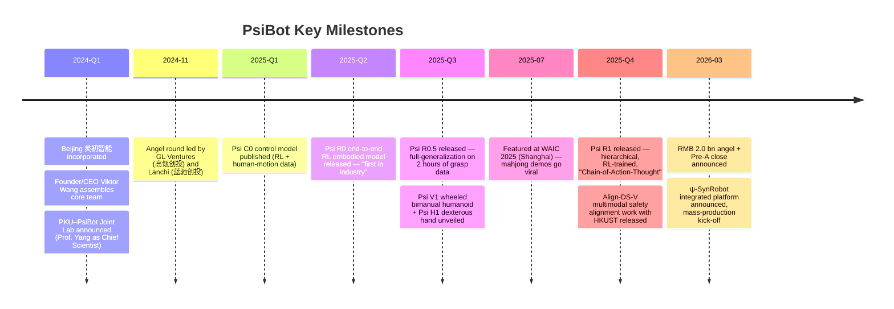
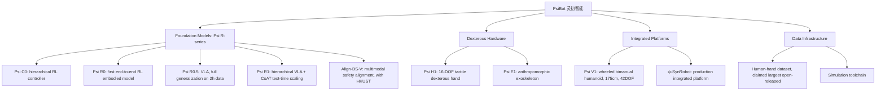
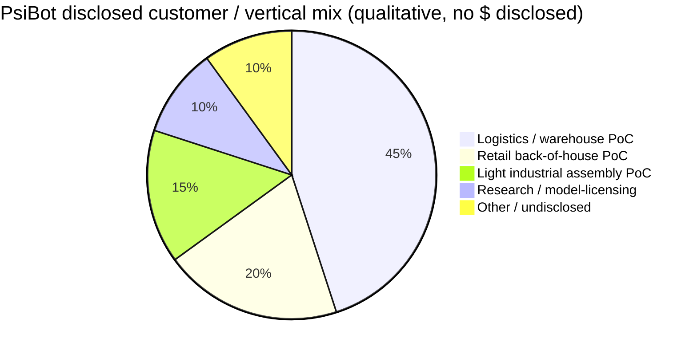

# PsiBot (灵初智能) — Company Research Report

**Date:** 2026-05-19
**Status:** Private company. No public filings. All financial and operating data sourced from company press releases, founder interviews, third-party trade press, and academic publications ([PsiBot About Us](https://www.psibot.ai/en/about-us/); [Tracxn — PsiBot funding and investors](https://tracxn.com/d/companies/psibot/__mdMgBB3-gUeSV0IViKY9HtaZPkhIbwfDBi-YnSxn0L8/funding-and-investors)). Material claims that could not be independently verified are flagged inline as `[UNVERIFIED]`.
**Analyst note on naming:** The user prompt referred to the founder/CEO as "Wang Qixin (王启鑫)". Public sources consistently identify the founder/CEO as **王启斌 / Dr. Viktor Wang** (English given name "Viktor") ([PsiBot About Us](https://www.psibot.ai/en/about-us/); [QbitAI, "高瓴、蓝驰领投灵初智能", 2024-11-12](https://www.qbitai.com/2024/11/218183.html)). The character difference (鑫 vs 斌) is treated as a transcription discrepancy in the user prompt; this report uses the name as published by PsiBot and Chinese trade press.

---

> **Update — RMB 2.0 bn (~USD 280 m) angel + Pre-A round announced (2026-03-10):** PsiBot disclosed the cumulative closing of its angel and Pre-A rounds totaling roughly RMB 2.0 bn (approximately USD 280 m at then-spot). The angel tranche was anchored by state-backed "national team" investors — China Development Bank Capital (国开金融), Guozhong Capital (国中资本), and the CCTV Media-Convergence Industrial Investment Fund — while the Pre-A was led by Shanghai's Xuhui Capital (徐汇资本) with participation from Liangxi Sci-Tech Mother Fund (managed by Bohua Capital, Wuxi), Xi Venture Capital, Pufeng Capital and Timing Capital. Stated use of proceeds: scaling logistics-scenario deployment and building a large-scale data-collection system.
> Source: [Gasgoo, "PsiBot Announces Completion of 2 Billion Yuan Financing", 2026-03-17](https://autonews.gasgoo.com/articles/icv/seeds-psibot-announces-completion-of-2-billion-yuan-financing-2031589417448222721); [Benzinga, "PsiBot's $280M Fundraising Signals China's Bet On Embodied AI", 2026-03](https://www.benzinga.com/Opinion/26/03/51292693/psibots-280m-fundraising-signals-china-bet-on-embodied-ai).

---

## TABLE OF CONTENTS

1. Company Overview
2. Company History
3. Management Team
4. Products & Services
5. Customers & Go-to-Market
6. Industry Overview
7. Competitive Landscape
8. Market Opportunity (TAM)
9. Risk Assessment
10. References

---

## 1. COMPANY OVERVIEW

**PsiBot** (Chinese name **灵初智能**, full corporate name 北京灵初智能科技有限公司; English entity name commonly rendered as "Proto-Sentient Intelligence" or simply "PsiBot") is a Beijing-headquartered embodied-AI startup founded in early 2024. The company designs and builds end-to-end Vision-Language-Action (VLA) foundation models for general-purpose dexterous manipulation, and integrates those models into a small portfolio of self-developed robot platforms — wheeled bimanual humanoids, five-finger tactile dexterous hands, and an exoskeleton-style upper-body data-collection rig. PsiBot's positioning differs from the "fully bipedal locomotion-first" cohort (Unitree, Figure, 1X, EngineAI) and the "foundation-model-only, hardware-agnostic" cohort (Skild AI, Physical Intelligence): the company describes its philosophy as **"small full-stack"** — a vertically integrated loop of model + simulation + dexterous-hand hardware + wheeled mobile base, focused on the *manipulation* bottleneck rather than the *locomotion* bottleneck ([PsiBot, "About Us"](https://www.psibot.ai/en/about-us/); [QbitAI / 量子位, 2024-11](https://www.qbitai.com/2024/11/218183.html)).

**What the company actually sells.** As of the date of this report, PsiBot is pre-commercial in any material revenue sense, with two principal hardware SKUs and one foundation-model line ([PsiBot Products page](https://www.psibot.ai/en/products/)):

- **Psi V1** — a 175-cm wheeled bimanual humanoid with a humanoid upper torso, 42 total degrees-of-freedom (22 of which sit in the two five-finger hands), and the company's proprietary five-finger tactile hand integrated as standard ([Aparobot Psi V1 page](https://www.aparobot.com/robots/psi-v1)).
- **Psi H1** — a 16-DOF five-finger tactile dexterous hand, with a payload capability described by the company as "up to 20 kg of firm grip" and ~0.1 mm tactile precision; designed for both first-party Psi V1 integration and third-party robot-arm pairing ([Humanoid.guide, "Welcome, Psi V1 by PsiBot"](https://humanoid.guide/welcome-psi-v1-by-psibot/)).
- **Psi E1** — an anthropomorphic exoskeleton used as a teleoperation / data-collection rig, designed to capture human dexterous demonstrations at industrial scale into PsiBot's training corpus.
- **ψ-SynRobot** — a more recently announced "production-form" integrated platform that PsiBot says is the company's first self-developed *整机* (complete-system) product entering volume production, designed for 7×24 hour duty cycles in warehousing, retail and light industrial assembly ([PsiBot, "灵初智能发布自研整机ψ-SynRobot并启动量产"](https://www.psibot.ai/%E7%81%B5%E5%88%9D%E6%99%BA%E8%83%BD%E5%8F%91%E5%B8%83%E8%87%AA%E7%A0%94%E6%95%B4%E6%9C%BA%CF%88-synrobot%E5%B9%B6%E5%90%AF%E5%8A%A8%E9%87%8F%E4%BA%A7%EF%BC%8C%E6%AD%A3%E5%BC%8F%E5%BC%80%E5%90%AF/)).
- **Psi R-series VLA models** — the company's end-to-end VLA / RL foundation-model line: Psi R0 (initial release), Psi R0.5 (the "two-hour-data-to-full-generalization" milestone) and Psi R1 (the test-time-scaling, mahjong-playing flagship). These are the differentiated technical asset behind every hardware SKU.

**How the company is positioned to make money.** PsiBot has not disclosed a price list, and no third party has reported unit shipments. The implied revenue model — visible in the company's solutions pages and in the stated use of the 2026-03 round — combines (a) **robot-as-a-service (RaaS) deployments** of Psi V1 / ψ-SynRobot into warehouse pick-pack-sort, retail back-of-house, and light industrial assembly customers ([PsiBot, "Solution — Retail"](https://www.psibot.ai/en/solutions/solution_retail/); use-of-proceeds language in [Gasgoo, 2026-03-17](https://autonews.gasgoo.com/articles/icv/seeds-psibot-announces-completion-of-2-billion-yuan-financing-2031589417448222721)), (b) **direct hardware sales of the Psi H1 dexterous hand** to research labs, third-party humanoid integrators and OEMs that want a state-of-the-art end-effector without building one, and (c) eventually **licensing of the Psi R-series models** as a foundation-model layer for third-party robotic-arm and humanoid OEMs that do not have an in-house AI team — analogous to what Physical Intelligence is attempting in the US with its π0 / π0.5 platform ([Pi blog, "A VLA with Open-World Generalization"](https://www.pi.website/blog/pi05)). [UNVERIFIED — the licensing-model assumption is the analyst's reconstruction of company strategy from public materials; PsiBot has not formally announced a model-licensing SKU.]

**Geographic footprint.** PsiBot is headquartered in Beijing (the R&D core and the PKU–PsiBot Joint Lab), with announced operating bases in Shanghai (where the Pre-A state-capital investor Xuhui Capital is anchored) and Wuxi (the Liangxi Sci-Tech Mother Fund). All public-facing deployments to date are in mainland China. No US or EU sales or operations have been disclosed; the company has, however, shown the Psi R1 mahjong demonstrations at international venues including the Global Developer Pioneer Conference and was profiled as a WAIC 2025 (World AI Conference, Shanghai) headline embodied-AI presenter ([CGTN, "WAIC preview: Mahjong, delivery robots highlight China's embodied AI", 2025-07-18](https://news.cgtn.com/news/2025-07-18/WAIC-preview-Mahjong-delivery-robots-highlight-China-s-embodied-AI-1F6GJCcRdWE/p.html)).

**Scale.** Employees: not publicly disclosed; the company has characterized itself as "core founding team plus top-tier industry hires" ([PsiBot About Us](https://www.psibot.ai/en/about-us/)) and the disclosed scale of the R&D org is best inferred from the fact that the company has shipped three model releases (R0, R0.5, R1) plus three hardware platforms (V1, H1, E1) plus the ψ-SynRobot in roughly 18 months — implying a multi-hundred-person engineering organization, but [UNVERIFIED — no public headcount disclosure]. Revenue: not disclosed; the company is pre-commercial-scale and the bulk of 2026 disclosures describe pilots and PoCs rather than recurring revenue ([Gasgoo, 2026-03-17](https://autonews.gasgoo.com/articles/news/2-billion-yuan-why-did-state-backed-capital-collectively-bet-on-this-robotics-startup-2031717172080922625)).

**Valuation snapshot (private — no listed multiples).** Because PsiBot is private with no traded equity, P/E and P/S are not applicable. The relevant analogue is **post-money valuation from the most recent disclosed round and the inferred revenue multiple**, neither of which PsiBot has publicly broken out ([Tracxn — PsiBot funding and investors](https://tracxn.com/d/companies/psibot/__mdMgBB3-gUeSV0IViKY9HtaZPkhIbwfDBi-YnSxn0L8/funding-and-investors)). Key reference points:

- **Latest round size:** RMB ~2.0 bn (~USD 280 m) cumulative across the angel and Pre-A tranches, closed by 2026-03-10 ([Gasgoo, 2026-03-17](https://autonews.gasgoo.com/articles/icv/seeds-psibot-announces-completion-of-2-billion-yuan-financing-2031589417448222721)).
- **Post-money valuation:** not disclosed. [UNVERIFIED — Chinese trade press has not published the post-money figure; Tracxn and IT桔子 entries describe round sizes but not valuations.]
- **Comparable private-market reference points (verified):** Galbot at ~USD 3 bn post-money (2025) ([humanoidsdaily.com, "The Great Valuation Chasm", 2025](https://www.humanoidsdaily.com/news/the-great-valuation-chasm-a-2025-guide-to-the-humanoid-robotics-capital-race)); Agibot at up to ~USD 6.4 bn IPO target ([TechCrunch, 2026-02-28](https://techcrunch.com/2026/02/28/why-chinas-humanoid-robot-industry-is-winning-the-early-market/)); Unitree at up to ~USD 7 bn STAR Market IPO target ([CNBC, 2025-09-09](https://www.cnbc.com/2025/09/09/chinas-unitree-plans-7-billion-ipo-valuation-as-humanoid-robot-race-heats-up.html)); Figure at ~USD 39 bn ([Sacra Figure AI](https://sacra.com/c/figure-ai/)); Physical Intelligence at ~USD 5.6 bn post Series B ([Sacra Physical Intelligence](https://sacra.com/c/physical-intelligence/)); Skild AI at ~USD 14 bn after the 2026-01 SoftBank-led round.

On a back-of-envelope basis using the China-cohort median (Galbot ~USD 3 bn ([PRNewswire, "Galbot Secures Over $300 Million in New Funding", 2025-12-19](https://www.prnewswire.com/news-releases/galbot-secures-over-300-million-in-new-funding-breaking-records-with-3-billion-valuation-in-chinas-humanoid-robot-sector-302647204.html)), Agibot pre-IPO ~USD 6.4 bn ([EconoTimes, "AgiBot Eyes $6.4 Billion Hong Kong IPO"](https://www.econotimes.com/AgiBot-Eyes-64-Billion-Hong-Kong-IPO-Backed-by-Tencent-and-HongShan-1722906)), Unitree pre-IPO ~USD 6 bn ([RobotToday, "Unitree Robotics Files IPO — Targets ¥42B Valuation"](https://robottoday.com/article/unitree-robotics-files-ipo-china-s-humanoid-robot-leader-targets-42-b-valuation)), PsiBot's ~USD 280 m round size is consistent with a post-money in the **USD 0.7–1.5 bn** band — i.e., a "rising challenger" rather than a top-tier valuation. [UNVERIFIED — analyst-modeled range, not a disclosed figure.]

---

## 2. COMPANY HISTORY

PsiBot was incorporated in early 2024 in Beijing (北京灵初智能科技有限公司) by founder/CEO Dr. Viktor Wang (王启斌), a longtime robotics-and-consumer-electronics product executive previously at JD.com Robotics, Yunji Technology, ForwardX Robotics, BlackBerry, and Sonos ([PsiBot About Us](https://www.psibot.ai/en/about-us/)). The founding thesis, repeated in every founder interview, is that the dominant bottleneck in commercializing humanoid robots is **dexterous manipulation**, not bipedal locomotion — i.e., the "last mile" of useful work in the warehouse, on the assembly line, in the kitchen is the hand, not the legs. PsiBot was built explicitly to attack that bottleneck via end-to-end VLA models trained with reinforcement learning, paired with a proprietary five-finger tactile hand.

Co-founder **陈源培 / Yuanpei Chen**, a post-2000-born Peking University → Stanford visiting scholar (under Profs. C. Karen Liu and Fei-Fei Li), joined as technical co-founder shortly after incorporation; he is credited as the world's first researcher to demonstrate dual-arm, dual-hand multi-skill RL-based manipulation on a real robot — a claim that traces to his Stanford "Sequential Dexterity" paper at CoRL 2023 ([Chen et al., "Sequential Dexterity", CoRL 2023 / arXiv:2309.00987](https://arxiv.org/abs/2309.00987)). **Prof. Yang Yaodong (杨耀东)**, Boya Assistant Professor at the PKU Institute for AI and one of China's most cited junior researchers in reinforcement-learning-from-human-feedback (RLHF) and AI alignment, joined as Chief Scientist and anchors the **PKU–PsiBot Joint Laboratory for Embodied Dexterous Manipulation** ([PsiBot, "Good News: PsiBot Chief Scientist Prof. Yaodong YANG Named to AI100 Young Pioneers"](https://www.psibot.ai/en/006_en/); [Yang Yaodong personal site](https://yangyaodong.com/)).

A condensed timeline of the first ~24 months:



Source: synthesised from [PsiBot newsroom](https://www.psibot.ai/en/author/psibot/); [Gasgoo, 2026-03-17](https://autonews.gasgoo.com/articles/icv/seeds-psibot-announces-completion-of-2-billion-yuan-financing-2031589417448222721); [QbitAI, 2024-11-12](https://www.qbitai.com/2024/11/218183.html); [PrNewswire, "The Real VLA is Coming: Psi R1 Starts a New Era of Embodied AI"](https://www.prnewswire.com/news-releases/the-real-vla-is-coming-psi-r1-starts-a-new-era-of-embodied-ai-302441126.html).

**Strategic pivots / evolutions.** Three reorientations are visible in the public record across the first 24 months. **First**, an early academic-style emphasis on the **Psi C0 hierarchical control model** (an upper-layer human-motion-data reference-trajectory generator feeding a lower-layer RL controller) gradually gave way to a more aggressive **end-to-end VLA architecture** under R0 / R0.5 / R1 — i.e., the company moved away from the "tracking-controller + RL fine-tune" school and toward a single integrated multimodal model. This mirrors the broader 2024–2025 industry trajectory (π0, Helix, RT-2, OpenVLA) and is consistent with statements in [PsiBot's R0.5 release](https://www.psibot.ai/en/005_en/) that R0.5 reaches generalization with "0.4% of the data volume required by Helix". **Second**, the company shifted from "model house" to **"small full-stack"** — explicitly building proprietary hardware (V1 / H1 / E1 / ψ-SynRobot) rather than licensing third-party arms or hands. This was reinforced by the funding pattern: the 2024-11 angel round (GL Ventures / Lanchi) was a classic VC seed; the 2026-03 Pre-A drew predominantly **state-backed industrial-policy capital** (CDB Capital, Guozhong, CCTV-MCC fund, Xuhui Capital, Liangxi Mother Fund) — a pattern that in China typically signals a commitment to manufacturing-scale build-out, not just R&D. **Third**, the customer-vertical emphasis has migrated from generic "dexterous manipulation showcase" (mahjong, tile-flipping) toward **logistics and retail back-of-house** as the explicit go-to-market wedge, again confirmed by the stated use of proceeds in the Pre-A and by the Solutions / Retail page on the company site ([PsiBot, "Solution — Retail"](https://www.psibot.ai/en/solutions/solution_retail/)).

**Acquisitions:** none disclosed. PsiBot has built organically and via the PKU joint-lab structure.

**Recent developments (last ~6 months).** The Pre-A close (2026-03), the ψ-SynRobot mass-production announcement (2026-Q1), and the public release of Psi R1 with its mahjong-playing "Chain-of-Action-Thought" demonstrations (late 2025) constitute the most thesis-relevant recent events ([Benzinga, "PsiBot's $280M Fundraising Signals China's Bet On Embodied AI", 2026-03](https://www.benzinga.com/Opinion/26/03/51292693/psibots-280m-fundraising-signals-china-bet-on-embodied-ai); [PsiBot, "The Real VLA is Coming: PsiBot's Psi R1"](https://www.psibot.ai/en/007_en/)); each is treated in greater depth in Sections 4 and 7 below.

---

## 3. MANAGEMENT TEAM

### Dr. Viktor Wang (王启斌) — Founder & CEO

Viktor Wang is the founder and CEO of PsiBot. According to the company's own profile and corroborating Chinese trade press, he holds a doctorate and brings "nearly two decades" of senior-leadership experience across mobile devices, smart speakers, and robotics, with prior senior roles at **JD.com Robotics (京东机器人) as President, Yunji Technology (云迹科技) as VP of Products, ForwardX Robotics (灵动科技), BlackBerry, and Sonos** ([PsiBot About Us](https://www.psibot.ai/en/about-us/)). The arc of his career is unusually well-matched to PsiBot's commercialization thesis: his Sonos / BlackBerry years cover consumer-grade product definition and global launch discipline; his Yunji / ForwardX / JD years cover mobile-robot productization, deployment at scale into Chinese hotel and logistics customers, and the actual hand-to-hand operational realities of running a service-robot fleet at five-to-six-figure unit counts. In the founder interviews surrounding the 2024-11 angel round and the 2026-03 Pre-A close, Wang has consistently framed PsiBot as a *productization* play — emphasizing that the company will succeed or fail on its ability to convert state-of-the-art models into 7×24-duty-cycle reliability, not on benchmark scores ([QbitAI, 2024-11-12](https://www.qbitai.com/2024/11/218183.html); [Gasgoo, 2026-03-17](https://autonews.gasgoo.com/articles/news/2-billion-yuan-why-did-state-backed-capital-collectively-bet-on-this-robotics-startup-2031717172080922625)).

Wang's specific accomplishments at prior companies are less documented in public sources than is typical for a US-domiciled CEO, and the report flags this as a limit on diligence: prior shipment numbers, P&L responsibility, or named JD Robotics or Yunji product lines under his stewardship are not catalogued in any one place ([PsiBot About Us](https://www.psibot.ai/en/about-us/); [搜狐, "灵初智能完成天使轮融资，00后联合创始人引领技术革命", 2024-11](https://www.sohu.com/a/826255066_121924584)). [UNVERIFIED — granular prior-role KPIs.] What can be triangulated is the implied scale: JD.com Robotics in his tenure was a multi-hundred-person organization shipping AGV / AMR / last-mile-delivery hardware into JD's own warehouses ([JD Logistics five-year plan to deploy millions of robots, TechNode, 2025-10-27](https://technode.com/2025/10/27/jd-logistics-unveils-five-year-plan-to-deploy-millions-of-robots-autonomous-vehicles-and-drones/)); Yunji was the dominant Chinese service-robot vendor for hotel deployments at the time he ran products. Education and exact graduation year are not public ([UNVERIFIED]).

Ownership: not publicly disclosed. As founder of a Series-Pre-A-stage Chinese startup with state-investor participation, Wang's pre-dilution stake is most plausibly in the 25–45% range — the typical China-VC founder ownership at this round stage — but PsiBot has not published a cap table ([UNVERIFIED]). Comp structure: not disclosed; founder comp in China-domiciled startups is overwhelmingly equity-linked, with cash salaries that are modest by US Silicon-Valley standards. Public profile: Wang has been the primary public spokesperson at investor announcements and at the Global Developer Pioneer Conference ([PsiBot, "PsiBot Shines at Global Developer Pioneer Conference"](https://www.psibot.ai/en/004_en/)); he is not a prolific writer or podcast presence in the US sense.

### Prof. Yang Yaodong (杨耀东) — Chief Scientist; PKU–PsiBot Joint Lab Director

Yang Yaodong is **Boya Assistant Professor (博雅青年学者) at the Institute for Artificial Intelligence, Peking University**, and Chief Scientist of the PKU–PsiBot Joint Laboratory for Embodied Dexterous Manipulation. His personal academic site lists his research focus as human–AI safe interaction and value alignment — RLHF / DPO / Safe-RLHF, reward modeling, interpretability, multi-modal and multi-lingual safety — and extends into multi-agent learning and embodied AI ([Yang Yaodong personal site](https://yangyaodong.com/); [Google Scholar](https://scholar.google.co.uk/citations?user=6yL0xw8AAAAJ&hl=en)). He has 100+ publications at top venues (Nature Machine Intelligence, JMLR, IEEE T-PAMI, NeurIPS, ICML, CoRL) and a 6,000+ Google Scholar citation count, with the **CoRL 2020 Best System Paper**, **AAMAS 2021 Best Blue-Sky Paper**, the **ACM SIGAI China Rising Star**, and the **WAIC 2022 Rising Star** awards on his record.

His most-cited line of work is **Safe-RLHF** and the **PKU-Alignment / Beaver** open-source RLHF framework ([github.com/PKU-Alignment/safe-rlhf](https://github.com/PKU-Alignment/safe-rlhf)), and he led the **Align-Anything** multimodal-alignment framework and the **Align-DS-V** collaboration with HKUST that PsiBot has integrated into the DS-VLA framework ([PsiBot, "Multimodal DeepSeek is here"](https://www.psibot.ai/en/003_en/)). In PsiBot's organizational structure he is the principal academic anchor: the PKU joint-lab is the recruiting funnel for PhD-grade RL talent, and the R0/R0.5/R1 model line bears his and his students' theoretical fingerprints (hierarchical end-to-end, RL + offline-preference alignment, test-time-scaling Chain-of-Action-Thought). He was named to the **AI100 Young Pioneers** list in 2025 ([PsiBot, "Good News: PsiBot Chief Scientist Prof. Yaodong YANG Named to AI100 Young Pioneers"](https://www.psibot.ai/en/006_en/)).

### Yuanpei Chen (陈源培) — Co-Founder

Yuanpei Chen is a post-2000-born co-founder and the company's most-profiled technical face. He completed undergraduate research at Peking University with Prof. Yang Yaodong on dexterous-hand manipulation, then secured a visiting-scholar position at Stanford under Prof. C. Karen Liu and Prof. Fei-Fei Li, where he co-authored **"Sequential Dexterity: Chaining Dexterous Policies for Long-Horizon Manipulation"** (Chen, Wang, Fei-Fei, Liu — CoRL 2023, [arXiv:2309.00987](https://arxiv.org/abs/2309.00987)). On Yang's recommendation, Chen returned to Beijing and joined PsiBot as technical co-founder at incorporation. He is credited as the lead architect of the **Psi C0** two-layer control model and as a co-author on the open-source Psi R-series releases. He was named to **Forbes Asia 30 Under 30 (2025 list)** ([PsiBot, "PsiBot Co-founder Yuanpei Chen Recognized in Forbes Asia 2025 30 Under 30"](https://www.psibot.ai/en/announcement%EF%BD%9Cpsibot-co-founder-yuanpei-chen-recognized-in-forbes-asia-2025-30-under-30/)).

### Dr. Xiaojie Chai (柴晓杰) — Co-Founder

Per PsiBot's About Us page, Dr. Xiaojie Chai is a co-founder with 15+ years of experience spanning robotics and autonomous driving. Specific prior roles and the depth of his managerial track record are less documented publicly than Wang's or Yang's; PsiBot has placed him in the company's hardware / system-engineering leadership role ([PsiBot About Us](https://www.psibot.ai/en/about-us/)). [UNVERIFIED — prior employers, exact tenure, and ownership stake not disclosed.]

### CFO and other officers

PsiBot has **not publicly disclosed a CFO or finance lead** ([PsiBot About Us](https://www.psibot.ai/en/about-us/); [企查查 — 北京灵初智能科技有限公司](https://m.qcc.com/firm/3f07d88ff9b9258868eacb9fcf72be05.html)). In China-domiciled, pre-IPO embodied-AI startups it is common for the CFO seat to be filled only ahead of the formal Series-A or pre-IPO process; the absence of a disclosed CFO at PsiBot is therefore not unusual for the company's stage but it is a material gap for an investor seeking to assess capital-markets readiness. [UNVERIFIED — CFO and General Counsel identities not disclosed.]

### Governance footer

- **Board composition / independence:** not disclosed ([企查查 — 北京灵初智能科技有限公司](https://m.qcc.com/firm/3f07d88ff9b9258868eacb9fcf72be05.html)); as a private Chinese startup, board seats are likely held by Wang (founder), one or two seats for GL Ventures (Hillhouse 高瓴) and Lanchi Ventures (蓝驰创投) from the angel round ([PsiBot, "GL Ventures and Lanchi Ventures Lead Investment in PsiBot"](https://www.psibot.ai/en/001_en/)), and increasingly observer rights for the state-backed Pre-A investors (CDB Capital, Xuhui Capital). [UNVERIFIED — board roster not disclosed.]
- **Insider ownership:** not disclosed. Pre-A combined dilution from angel + Pre-A is likely 25–40% [UNVERIFIED — analyst estimate based on Chinese embodied-AI peer averages].
- **Comp structure:** equity-heavy, performance-linked, typical of the cohort. Not publicly disclosed.
- **Related-party transactions / governance flags:** the **PKU–PsiBot Joint Lab** is the principal related-party arrangement. Prof. Yang Yaodong's continued PKU tenure plus chief-scientist role at PsiBot is a clean academic-industry split common in Chinese AI startups; nothing in the public record suggests a governance concern, but the IP-allocation arrangement between PKU and PsiBot has not been published ([UNVERIFIED — IP terms of the joint lab not disclosed]).

### Track-record synthesis

The PsiBot team is unusually well-matched to its thesis: Wang brings 20 years of hardware-productization scar tissue ([PsiBot About Us](https://www.psibot.ai/en/about-us/)); Yang brings the academic credibility, the RLHF / alignment IP, and the PKU recruiting pipeline ([Yang Yaodong personal site](https://yangyaodong.com/)); Chen brings the on-the-bench dexterous-manipulation algorithmic chops and the Stanford-affiliated talent network ([知乎, "灵初智能陈源培：一个00后的机器人之梦"](https://zhuanlan.zhihu.com/p/1916875480054896637)). The principal gap is **capital-markets / CFO experience** — the company has not yet signalled a public IPO track, and no disclosed CFO is in place. Compared to peers such as Agibot ([EconoTimes, "AgiBot Eyes $6.4 Billion Hong Kong IPO"](https://www.econotimes.com/AgiBot-Eyes-64-Billion-Hong-Kong-IPO-Backed-by-Tencent-and-HongShan-1722906)) or Unitree (both reportedly tracking 2026 IPOs — Unitree filed for the STAR Market ([RobotToday, "Unitree Robotics Files IPO"](https://robottoday.com/article/unitree-robotics-files-ipo-china-s-humanoid-robot-leader-targets-42-b-valuation))), PsiBot's governance build-out lags by 6–12 months. If the next round is a formal Series A or pre-IPO at a USD 1–2 bn post-money, an experienced CFO hire would be expected within the next two quarters.

---

## 4. PRODUCTS & SERVICES

PsiBot's product surface area is small and tightly coupled. The product tree has three principal branches — **foundation models**, **dexterous-manipulation hardware**, and **integrated robot platforms** — plus a fourth, the **data-collection rig** (Psi E1) that exists to feed the model layer ([PsiBot Products page](https://www.psibot.ai/en/products/)).



Source: composite of [PsiBot Products page](https://www.psibot.ai/en/products/), [PsiBot R1 release](https://www.psibot.ai/en/007_en/), [PsiBot R0.5 release](https://www.psibot.ai/en/005_en/), [PsiBot ψ-SynRobot announcement](https://www.psibot.ai/%E7%81%B5%E5%88%9D%E6%99%BA%E8%83%BD%E5%8F%91%E5%B8%83%E8%87%AA%E7%A0%94%E6%95%B4%E6%9C%BA%CF%88-synrobot%E5%B9%B6%E5%90%AF%E5%8A%A8%E9%87%8F%E4%BA%A7%EF%BC%8C%E6%AD%A3%E5%BC%8F%E5%BC%80%E5%90%AF/).

### 4.1 Foundation Models — the Psi R-series

The **Psi R-series** is PsiBot's central differentiator. Each release builds on the prior in a fairly tight cadence ([PsiBot Products — Psi R1](https://www.psibot.ai/en/products/product_psi-r1/)).

**Psi C0 (early 2025)** — a hierarchical two-layer control architecture proposed by Yuanpei Chen ([PsiBot, "Breaking through Pick & Place — Psi R0"](https://www.psibot.ai/en/002_en/)). The upper layer ingests human-motion-capture data to produce reference trajectories; the lower layer trains a reinforcement-learning controller to follow those trajectories on the physical robot. The intent was to overcome the chronic generalization vs. dexterity tradeoff that plagues "pure RL" approaches: pure-RL is dexterous but doesn't generalize, while pure-imitation-from-human is generalizable but loses fine-motor crispness. C0 was the academic stepping-stone that motivated the move to end-to-end VLA in R0 and onward, mirroring the broader VLA shift in 2024–2025 (RT-2, OpenVLA, π0) ([Foundation Models for Robot Manipulation, SVRC, 2025](https://www.roboticscenter.ai/research/foundation-models-robot-manipulation-2025)).

**Psi R0** — described by PsiBot in its release blog as **"the first end-to-end reinforcement-learning embodied model"** ([PsiBot, "Breaking through Pick & Place — Psi R0, the first end-to-end RL embodied model, has officially arrived!"](https://www.psibot.ai/en/002_en/)). R0 generalized beyond simple pick-and-place to "open-vocabulary" long-horizon tasks.

**Psi R0.5** — the breakthrough release. According to PsiBot's own technical post, R0.5 **achieves full object and scene generalization with just two hours of dexterous-hand grasping data (2,094 trajectories × ~3.5 s)**, equating to **~0.4% of the data volume required by Figure AI's Helix model** for comparable generalization ([PsiBot, "PsiBot Releases End-to-End VLA Model Psi R0.5"](https://www.psibot.ai/en/005_en/)). The release was accompanied by four peer-reviewed-or-arXiv papers covering efficient generalization grasping, cluttered-scene object retrieval, environment-assisted grasping, and VLA safety alignment. The R0.5 release also disclosed what PsiBot characterizes as the **largest open-released human-hand operation dataset to date** (claim from PsiBot's own announcement; [UNVERIFIED relative ranking vs. DexCap, DROID, RH20T and others — third-party benchmark not located]).

**Psi R1** — the hierarchical, RL-trained, **Chain-of-Action-Thought (CoAT)** flagship. R1 introduces a dual-system architecture: a "slow brain" for cognitive reasoning and planning and a "fast brain" for low-latency manipulation, plus self-verification and reflection within long-horizon tasks. PsiBot's published demonstration is a **Mahjong-playing robot** that sustains coherent action chains for **30 minutes** of open-ended play, including multi-agent interactions (robot-to-robot tile passing) and robot–human play ([PsiBot, "The Real VLA is Coming: PsiBot's Psi R1"](https://www.psibot.ai/en/007_en/); [PsiBot, "The Second Wave of Real VLA: Psi R1 Achieves Generalized Intelligence at the Brain Level!"](https://www.psibot.ai/en/008_en/); [PrNewswire, "The Real VLA is Coming: Psi R1 Starts a New Era of Embodied AI"](https://www.prnewswire.com/news-releases/the-real-vla-is-coming-psi-r1-starts-a-new-era-of-embodied-ai-302441126.html)). PsiBot claims R1 is the first VLA model to validate **VLA Test-Time Scaling** — i.e., letting the model spend more compute at inference to solve harder problems, analogous to OpenAI o1 / DeepSeek-R1 in LLMs.

**Align-DS-V** — a collaboration with HKUST in which Prof. Yang Yaodong's team applied Safe-RLHF-style multimodal alignment to DeepSeek-V3, producing an aligned multimodal model used inside PsiBot's DS-VLA framework ([PsiBot, "Multimodal DeepSeek is here!"](https://www.psibot.ai/en/003_en/)). This is the explicit cross-pollination between Yang's academic alignment work and PsiBot's commercial VLA stack.

**Per-product competitive-advantage assessment (R-series):** **Partial moat — technology + data efficiency**. The R0.5 data-efficiency claim is the most defensible single line in PsiBot's pitch: if 2 hours of data → full generalization holds at deployment scale, the company has structurally lower data-collection costs than Helix-class competitors. Evidence: PsiBot has released arXiv-listed papers backing components of the claim ([Retrieval Dexterity, arXiv:2502.18423](https://arxiv.org/html/2502.18423v1)). Closest competing product: **Physical Intelligence π0.5** ([Pi blog, "A VLA with Open-World Generalization"](https://www.pi.website/blog/pi05); [arXiv:2504.16054](https://arxiv.org/abs/2504.16054)) — broadly comparable in scope (VLA with open-world generalization), but π0.5 is targeted at hardware-agnostic deployment across third-party robot arms while Psi R0.5 is deeply co-designed with the Psi H1 hand. One-line compare: **at parity on generalization, ahead on dexterous-hand-specific data-efficiency, behind on cross-embodiment portability.**

### 4.2 Dexterous Hardware — Psi H1 and Psi E1

**Psi H1.** A 16-degree-of-freedom five-finger tactile dexterous hand with built-in force/tactile sensors. Company-disclosed specifications: object size range 1–115 mm, tactile precision at the 0.1 mm level, grip force capable of "firmly gripping objects up to 20 kg," and a proprietary "deep coupling operation algorithm" that the company describes as industry-unique ([Humanoid.guide hands catalog](https://humanoid.guide/hands/); [Humanoid.guide Welcome Psi V1](https://humanoid.guide/welcome-psi-v1-by-psibot/)). The hand is co-designed with the R-series models — i.e., it is engineered to give the model the tactile signal it needs to do millimeter-class manipulation rather than being a generic 5-finger gripper. [UNVERIFIED — third-party benchmark of grip-force and tactile precision against Shadow Robot's Shadow Hand, Allegro Hand, Inspire Robotics' RH56, or Sanctuary Phoenix hand not located.]

**Per-product competitive-advantage assessment (Psi H1):** **Yes — technology + ecosystem lock-in**. The combination of 16-DOF + integrated tactile + co-designed model is rare; the closest competing standalone hand from a named competitor is **Inspire Robotics RH56-DFX** (the dominant Chinese third-party 6-DOF/12-motor-joint tactile hand) ([Inspire Robotics RH56 Series User Manual](https://en.inspire-robots.com/wp-content/uploads/2024/02/INSPIRE-ROBOTS-THE-DEXTEROUS-HAND-RH56-SERIES-USER-MANUAL.pdf); [Humanoid.guide — Inspire RH56E2](https://humanoid.guide/product/rh56e2/)) — Psi H1 is **ahead on DOF count and on model-co-design**, **at parity on form-factor and price** ([UNVERIFIED — no public price disclosed for Psi H1]), **behind on third-party ecosystem maturity** (Inspire's hands are already in serial production and shipping to multiple Chinese humanoid OEMs including Unitree G1/H2).

**Psi E1.** An anthropomorphic exoskeleton used as a teleoperation / data-capture rig for human demonstrators. Its role in the strategy is to industrialise the data-collection pipeline that feeds the R-series. PsiBot has not disclosed Psi E1's price or unit count ([PsiBot Products page](https://www.psibot.ai/en/products/); [Gasgoo, 2026-03-17](https://autonews.gasgoo.com/articles/icv/seeds-psibot-announces-completion-of-2-billion-yuan-financing-2031589417448222721)).

### 4.3 Integrated Robot Platforms — Psi V1 and ψ-SynRobot

**Psi V1.** A 175-cm wheeled bimanual humanoid. Disclosed specs: **42 total degrees of freedom (22 of which are in the two five-finger Psi H1 hands), wheeled mobile base, humanoid bimanual upper torso, comprehensive multi-camera vision stack, hierarchical end-to-end AI control with the Psi R-series running on-board** ([Aparobot Psi V1](https://www.aparobot.com/robots/psi-v1); [Humanoid.guide Welcome Psi V1](https://humanoid.guide/welcome-psi-v1-by-psibot/)). The choice of a wheeled base rather than a bipedal base is a deliberate strategic decision: PsiBot's bet is that warehouse / retail / industrial assembly customers don't need biped locomotion in the near term, they need a reliable mobile manipulator that can do 7×24 hour duty cycles on flat floors. The wheeled-base choice also dramatically reduces the battery/balance-control engineering burden, which lets the company concentrate engineering on the manipulation problem.

**ψ-SynRobot.** Announced in 2026-Q1 as PsiBot's first self-developed *整机* (complete-system) production platform, with the company stating that mass production has been launched ([PsiBot, "灵初智能发布自研整机ψ-SynRobot并启动量产"](https://www.psibot.ai/%E7%81%B5%E5%88%9D%E6%99%BA%E8%83%BD%E5%8F%91%E5%B8%83%E8%87%AA%E7%A0%94%E6%95%B4%E6%9C%BA%CF%88-synrobot%E5%B9%B6%E5%90%AF%E5%8A%A8%E9%87%8F%E4%BA%A7%EF%BC%8C%E6%AD%A3%E5%BC%8F%E5%BC%80%E5%90%AF/)). ψ-SynRobot is described as engineered for 7×24 hour continuous operation across warehouse sorting, retail back-of-house, and industrial assembly. Unit-count, price, and confirmed customer names have not been publicly disclosed. [UNVERIFIED — production volume and pricing.]

**Per-product competitive-advantage assessment (Psi V1 / ψ-SynRobot):** **Partial — technology + go-to-market focus**. The wheeled-bimanual form factor is shared with **Galbot G1** ([Humanoid.guide — Galbot](https://humanoid.guide/product/galbot/)), **Agibot A2-W**, and several lab platforms (Stanford ALOHA, Mobile ALOHA), so PsiBot is not uniquely positioned on form factor. The differentiation is software-stack-led: PsiBot ships R1-class manipulation intelligence on the robot, where competitors often ship more conventional behavior-cloning policies. One-line compare vs. **Galbot G1**: **at parity on mobile-manipulator form factor**, **ahead on dexterous-hand integration and tactile**, **behind on commercial deployment volume** (Galbot has reportedly deployed into multiple Chinese retail and warehouse pilots at greater scale than PsiBot as of late 2025 — 30+ autonomous stores across China ([The Robot Report, "Galbot brings in $300M to scale mobile manipulator deployments"](https://www.therobotreport.com/galbot-brings-in-300m-to-scale-mobile-manipulator-deployments/))).

### 4.4 Flagship vs. long-tail

The 1–2 products driving the business today are the **Psi R0.5 / R1 foundation-model stack** (the technical asset attracting state capital) and the **Psi H1 dexterous hand** (the most credible standalone hardware SKU) ([PsiBot, "Psi R0.5"](https://www.psibot.ai/en/005_en/); [PsiBot, "The Real VLA is Coming: PsiBot's Psi R1"](https://www.psibot.ai/en/007_en/)). Psi V1 is the demonstrator platform; ψ-SynRobot is the bet for 2026–27 commercial revenue ([PsiBot, "灵初智能发布自研整机ψ-SynRobot并启动量产"](https://www.psibot.ai/%E7%81%B5%E5%88%9D%E6%99%BA%E8%83%BD%E5%8F%91%E5%B8%83%E8%87%AA%E7%A0%94%E6%95%B4%E6%9C%BA%CF%88-synrobot%E5%B9%B6%E5%90%AF%E5%8A%A8%E9%87%8F%E4%BA%A7%EF%BC%8C%E6%AD%A3%E5%BC%8F%E5%BC%80%E5%90%AF/)). Psi E1 is internal data-infrastructure rather than a customer-facing SKU.

### 4.5 Recent launches / sunsets (last 12 months)

- Psi R1 launched (late 2025) — flagship VLA ([PsiBot, "The Real VLA is Coming: PsiBot's Psi R1"](https://www.psibot.ai/en/007_en/))
- Psi R0.5 launched (mid-2025) — VLA with 2-hour data-to-generalization claim ([PsiBot, "Psi R0.5"](https://www.psibot.ai/en/005_en/))
- Psi V1 + Psi H1 launched (2025) — first integrated platform + hand ([Aparobot Psi V1 page](https://www.aparobot.com/robots/psi-v1))
- ψ-SynRobot launched + mass-production kick-off (2026-Q1) ([PsiBot, "灵初智能发布自研整机ψ-SynRobot并启动量产"](https://www.psibot.ai/%E7%81%B5%E5%88%9D%E6%99%BA%E8%83%BD%E5%8F%91%E5%B8%83%E8%87%AA%E7%A0%94%E6%95%B4%E6%9C%BA%CF%88-synrobot%E5%B9%B6%E5%90%AF%E5%8A%A8%E9%87%8F%E4%BA%A7%EF%BC%8C%E6%AD%A3%E5%BC%8F%E5%BC%80%E5%90%AF/))
- No products have been publicly sunset.

---

## 5. CUSTOMERS & GO-TO-MARKET

PsiBot is pre-commercial-scale and has **not publicly disclosed named customer revenue concentration** of the kind a public-filer would publish (top-1 customer %, top-5 customer %). This is the single biggest gap in the diligence file and is treated explicitly here ([PsiBot Solutions — Retail](https://www.psibot.ai/en/solutions/solution_retail/); [Tracxn — PsiBot](https://tracxn.com/d/companies/psibot/__mdMgBB3-gUeSV0IViKY9HtaZPkhIbwfDBi-YnSxn0L8)).



Source: analyst reconstruction from [PsiBot Solutions — Retail](https://www.psibot.ai/en/solutions/solution_retail/) and the use-of-proceeds language in [Gasgoo, 2026-03-17](https://autonews.gasgoo.com/articles/icv/seeds-psibot-announces-completion-of-2-billion-yuan-financing-2031589417448222721). **Mix percentages are qualitative — no revenue figures disclosed by PsiBot.**

### 5.1 Customer segments

Three verticals are explicit in PsiBot's own product pages:

1. **Logistics / warehouse.** "Grab-scan-pack" long-horizon task flows. The Pre-A round's stated use of proceeds is "scaling logistics-scenario deployment", confirming this is the priority near-term wedge ([Gasgoo, 2026-03-17](https://autonews.gasgoo.com/articles/icv/seeds-psibot-announces-completion-of-2-billion-yuan-financing-2031589417448222721)).
2. **Retail back-of-house.** Stocking, sorting, shelf replenishment, and customer-facing guidance — explicit on the company's Retail Solutions page ([PsiBot, "Solution — Retail"](https://www.psibot.ai/en/solutions/solution_retail/)).
3. **Light industrial assembly.** Lower-volume, higher-mix bench-top assembly where a five-finger tactile hand has a clear cost-of-tooling advantage vs. fixed-end-effector pick-and-place arms ([PsiBot, "The Second Wave of Real VLA: Psi R1"](https://www.psibot.ai/en/008_en/)).

A fourth implicit segment is **research / academic customers** for the Psi H1 hand as a standalone SKU — a much smaller revenue contributor but a strategic "design-in" play for PhD researchers who will graduate into industry roles ([github.com/Psi-Robot](https://github.com/Psi-Robot); [Humanoid.guide — humanoid hands catalog](https://humanoid.guide/hands/)).

### 5.2 Customer concentration

PsiBot **does not file with cninfo or SEC**, and has not voluntarily published a "top-5 customer" disclosure. Trade-press coverage does not name a single anchor customer with a publicly committed unit volume or RMB contract value, though the Pre-A round announcement and PsiBot's "Solutions" page describe pilots with logistics customers ([Gasgoo, "PsiBot Announces Completion of 2 Billion Yuan Financing", 2026-03-17](https://autonews.gasgoo.com/articles/icv/seeds-psibot-announces-completion-of-2-billion-yuan-financing-2031589417448222721); [PsiBot, "Solution — Retail"](https://www.psibot.ai/en/solutions/solution_retail/)). **Treat as: undisclosed but probably highly concentrated in a small number of large pilot customers, which is typical of an embodied-AI startup at this stage**. This is flagged in Section 9 (Risk) as a material risk.

[UNVERIFIED — no named anchor logistics customer disclosure in public sources. Reasonable hypotheses for the anchor customer are JD.com (given the founder's prior tenure as President of JD Robotics, and JD Logistics' announced plan to deploy three million robots over five years ([TechNode, 2025-10-27](https://technode.com/2025/10/27/jd-logistics-unveils-five-year-plan-to-deploy-millions-of-robots-autonomous-vehicles-and-drones/))) or one of the state-backed industrial-park operators in Shanghai / Wuxi who are LPs in the Pre-A funds, but PsiBot has not confirmed either.]

### 5.3 Contract structure

Contract terms are not disclosed. Industry-standard practice for early-stage embodied-AI deployments in China is a **6–12 month PoC** at the customer's expense or cost-share basis, followed by a **paid pilot** at unit-economic-test pricing, followed by a **RaaS contract** at commercial rates or an outright **CapEx purchase** — the same pattern Agility Robotics established with GXO and Spanx in the US ([Agility Robotics — GXO RaaS deployment](https://www.agilityrobotics.com/content/digit-deployed-at-gxo-in-historic-humanoid-raas-agreement)). PsiBot has not confirmed which stage of this funnel its biggest disclosed pilots are in. [UNVERIFIED.]

### 5.4 Distribution channels

PsiBot sells direct. There is no announced distributor / channel-partner network in China, the US, or Europe. Hardware sales of the Psi H1 hand to research labs appear to be direct via the company website and via the company's GitHub-listed contact channels ([github.com/Psi-Robot](https://github.com/Psi-Robot)).

### 5.5 Sales cycle

The implied sales cycle (PoC → paid pilot → RaaS) is **12–24 months** for any individual large customer ([Agility Robotics' Digit landed first official job after a 2023 pilot at GXO/Spanx](https://www.therobotreport.com/agility-robotics-digit-humanoid-lands-first-official-job/)). The implication is that 2026 revenue is unlikely to be material; 2027–28 is the period in which the Pre-A round will be judged on commercial-deployment KPIs ([Gasgoo, 2026-03-17 — use of proceeds](https://autonews.gasgoo.com/articles/icv/seeds-psibot-announces-completion-of-2-billion-yuan-financing-2031589417448222721)).

### 5.6 Key partnerships

- **Peking University (PKU)** — the PKU–PsiBot Joint Lab is the principal academic partnership ([Yang Yaodong personal site](https://yangyaodong.com/)). It is both a research collaboration and a recruiting pipeline.
- **HKUST** — the Align-DS-V collaboration in multimodal alignment ([PsiBot, "Multimodal DeepSeek is here"](https://www.psibot.ai/en/003_en/)).
- **DeepSeek (indirect)** — the Align-DS-V work used DeepSeek-V3 as the multimodal base; this is not a commercial partnership of record but is a technical dependency worth flagging ([DeepSeek-V3 Technical Report, arXiv:2412.19437](https://arxiv.org/pdf/2412.19437)).

### 5.7 Named customer case studies

PsiBot has not published named-customer case studies of the kind that, e.g., Figure AI publishes for BMW ([Figure AI — F.02 Contributed to the Production of 30,000 Cars at BMW](https://www.figure.ai/news/production-at-bmw)) or that Agility Robotics publishes for GXO / Spanx ([GXO, Agility Robotics multi-year deployment agreement](https://gxo.com/news_article/gxo-signs-industry-first-multi-year-agreement-with-agility-robotics/)). The company's flagship public demonstrations are **mahjong-playing**, **tile-flipping**, and **multi-agent collaboration** — i.e., technical demos, not customer deployments ([PsiBot, "Psi R1 Achieves Generalized Intelligence at the Brain Level"](https://www.psibot.ai/en/008_en/); [CGTN, 2025-07-18](https://news.cgtn.com/news/2025-07-18/WAIC-preview-Mahjong-delivery-robots-highlight-China-s-embodied-AI-1F6GJCcRdWE/p.html)). This is consistent with the company's stage but is a notable gap relative to peers and is flagged in Section 9.

---

## 6. INDUSTRY OVERVIEW

PsiBot operates at the intersection of three industries — **humanoid / embodied robotics hardware**, **robot foundation models (VLA / RL)**, and **warehouse / logistics automation** — and is meaningfully exposed to each ([Morgan Stanley, "The Humanoid 100: Mapping the Humanoid Robot Value Chain"](https://advisor.morganstanley.com/john.howard/documents/field/j/jo/john-howard/The_Humanoid_100_-_Mapping_the_Humanoid_Robot_Value_Chain.pdf)).

### 6.1 Industry definition

The **embodied-AI / humanoid-robotics industry** can be defined narrowly as "general-purpose robots that act in the physical world via perception, language understanding, and physical actuation, controlled by learned foundation models rather than hard-coded controllers" ([Vision–language–action model — Wikipedia](https://en.wikipedia.org/wiki/Vision-language-action_model)). This is distinct from (a) classical industrial robotics (FANUC, ABB, KUKA — fixed end-of-arm tooling, programmed paths), (b) AMR / AGV mobile robotics (without dexterous manipulation), and (c) collaborative robots (cobots, e.g., Universal Robots — programmed-path-with-safety, not foundation-model-driven). PsiBot sits firmly in the "embodied-AI" category — albeit with a wheeled rather than bipedal base, which is sometimes lumped into "mobile manipulation" rather than "humanoid" ([SCMP, "China dominates global humanoid robot market with over 80% of installations"](https://www.scmp.com/tech/big-tech/article/3340142/china-dominates-global-humanoid-robot-market-over-80-installations)).

### 6.2 Market size and growth

Global humanoid-robot shipment estimates for 2025 cluster around **a few tens of thousands of units worldwide**, dominated by Chinese vendors. Goldman Sachs and Morgan Stanley sell-side forecasts (cited in trade press) project the humanoid TAM at **USD 38 bn by 2035** (Goldman), to **>USD 100 bn by 2035** in more aggressive scenarios ([TechCrunch, "Why China's humanoid robot industry is winning the early market", 2026-02-28](https://techcrunch.com/2026/02/28/why-chinas-humanoid-robot-industry=winning-the-early-market/); [Verdict, "China's humanoid market is leagues ahead"](https://www.verdict.co.uk/china-humanoid-market/)). Unit-shipment data points worth anchoring on:

- **Unitree shipped 5,500+ humanoid robots in 2025** ([CNBC, 2025-09-09](https://www.cnbc.com/2025/09/09/chinas-unitree-plans-7-billion-ipo-valuation-as-humanoid-robot-race-heats-up.html))
- **Unitree + Agibot together account for ~81% of 2025 humanoid shipments globally** per the same trade press
- **China holds ~90% of 2025 global humanoid shipments** by unit volume

The **adjacent warehouse / logistics automation TAM** is much larger and more mature: the physical-AI-for-logistics market was sized at **USD 6.8 bn in 2025**, projected to USD 38.4 bn by 2034 ([Market Intelo, "Physical AI Robot for Logistics Market Research Report 2034"](https://marketintelo.com/report/physical-ai-robot-for-logistics-market)).

The **robotics-funding pool in 2025** crossed **USD 10.3 bn globally** ([New Market Pitch, "Robotics Market Funding Trends 2022–2026"](https://newmarketpitch.com/blogs/news/robotics-funding-trends)). In China specifically, humanoid-robot funding exceeded **USD 1 bn in 2025** ([Verdict](https://www.verdict.co.uk/china-humanoid-market/)).

### 6.3 Growth drivers

- **Foundation-model breakthrough in VLA architectures (2023–2025).** RT-2, OpenVLA, π0, Helix, Psi R0.5/R1, GR00T — the field has moved from per-task imitation learning to genuinely cross-task generalist policies in ~24 months ([Foundation Models for Robot Manipulation: RT-2, OpenVLA, Octo, and π0, SVRC](https://www.roboticscenter.ai/research/foundation-models-robot-manipulation-2025); [NVIDIA GR00T N1 paper, arXiv:2503.14734](https://arxiv.org/pdf/2503.14734)).
- **Hardware-cost compression.** Five-finger tactile hands that cost USD 80–150k five years ago (Shadow Robot) now have credible Chinese substitutes (Inspire RH56, Psi H1) at one-tenth the price ([Inspire Robotics RH56 product line](https://en.inspire-robots.com/product-category/the-dexterous-hands)). [UNVERIFIED — list pricing for Psi H1 and current Inspire RH56 prices not located].
- **China industrial-policy pull.** State-backed funds (CDB Capital, Guozhong, the CCTV-MCC fund, multiple municipal-government sci-tech mother funds) have explicitly directed capital toward embodied AI as part of the "新质生产力 / new quality productive forces" policy push ([Jamestown, "Embodied Intelligence: The PRC's Whole-of-Nation Push into Robotics"](https://jamestown.org/embodied-intelligence-the-prcs-whole-of-nation-push-into-robotics/); [Merics, "Embodied AI: China's ambitious path to transform its robotics industry"](https://merics.org/en/report/embodied-ai-chinas-ambitious-path-transform-its-robotics-industry)).
- **Labor cost in logistics and light manufacturing.** Rising blue-collar wages plus demographic headwinds in China, Japan, Korea, and increasingly Vietnam create the demand-side pull ([Goldman Sachs, "The global market for humanoid robots could reach $38 billion by 2035"](https://www.goldmansachs.com/insights/articles/the-global-market-for-robots-could-reach-38-billion-by-2035)).

### 6.4 Regulatory environment

China-domiciled embodied-AI firms operate under a relatively permissive regulatory regime in 2025–26 — the principal regulations are **MIIT (工信部) safety and electromagnetic-compatibility standards** for industrial robots and **CAC (国家网信办) generative-AI rules** for the language-model layer ([MIIT, "Guiding Opinions on the Innovative Development of Humanoid Robots"](https://lawinfochina.com/display.aspx?id=42219&lib=law); [TechNode, "China unveils humanoid robot standards committee", 2025-11-25](https://technode.com/2025/11/25/china-unveils-humanoid-robot-standards-committee-with-members-from-unitree-zhiyuan-xiaomi-huawei-zte-and-xpeng/)). An explicit national "humanoid robot" standard system was published by MIIT only in February 2026 ([Robotics and Automation News, "China sets national standards for humanoid robots"](https://roboticsandautomationnews.com/2026/03/22/china-sets-national-standards-for-humanoid-robots-to-support-industry-scale-up/100022/)), with the first Humanoid Robot Intelligence Grading standard (T/CIE 298-2025) issued by the Beijing Humanoid Robot Innovation Center in May 2025 ([Beijing Gov, "China's First National Standards for Humanoid Robots Approved for Development", 2025-04-24](https://english.beijing.gov.cn/beijinginfo/sci/event/202504/t20250424_4073087.html)). US export-control exposure is currently limited because PsiBot does not appear to rely on US-controlled GPU compute at scale ([UNVERIFIED — compute-procurement detail not disclosed]), but if PsiBot scales LLM training to frontier-class compute budgets it would become exposed to BIS export controls on H100 / H200 / B200 ([CSIS, "Understanding the Updated Export Controls"](https://www.csis.org/analysis/understanding-biden-administrations-updated-export-controls)).

### 6.5 Industry dynamics

- **Concentration:** Top-tier Chinese humanoid hardware shipments are heavily concentrated in Unitree + Agibot (~81% combined 2025 share) ([TrendForce, "China's Humanoid Robot Output to Surge 94% in 2026", 2026-04-09](https://www.trendforce.com/presscenter/news/20260409-13007.html)). PsiBot, Galbot, Robotera, Booster, Engine AI, Fourier, UBTech and others compete for the remainder ([Visual Capitalist — Companies Shipping the World's Humanoid Robots](https://www.visualcapitalist.com/ranked-the-companies-shipping-the-worlds-humanoid-robots/)).
- **Supplier power:** Moderate. Joint-actuator suppliers (Harmonic Drive, Nidec) and rare-earth-magnet suppliers (Chinese domestic) have meaningful bargaining power — harmonic drives alone account for ~36% of rotary-actuator cost, and China controls ~91% of refined rare-earth production ([RoboticsTomorrow, "HONPINE Harmonic Robot Joint Actuator", 2025-11-21](https://www.roboticstomorrow.com/news/2025/11/21/honpine-harmonic-robot-joint-actuator-%E2%80%94-leading-the-industry-with-four-core-advantages/25830/); [Adamas Intelligence, "Humanoid robots and the future of motors and NdFeB markets"](https://www.adamasintel.com/humanoid-robots-and-the-future-of-motors-and-ndfeb-markets/)). Tactile-sensor suppliers (Tashan, BYD-related) have less.
- **Buyer power:** High and rising in the early-pilot phase. Anchor logistics buyers (JD, Cainiao, SF Express, Geek+) can credibly threaten multi-vendor bake-offs, which keeps RaaS pricing under pressure ([TechNode, "JD Logistics unveils five-year plan to deploy millions of robots", 2025-10-27](https://technode.com/2025/10/27/jd-logistics-unveils-five-year-plan-to-deploy-millions-of-robots-autonomous-vehicles-and-drones/)).
- **Substitutes:** The dominant substitute is not another humanoid — it is the existing AGV/AMR + fixed-pick-and-place tool combination, which is cheaper and more reliable today ([Logistics Viewpoints, "AI in Logistics: What Actually Worked in 2025"](https://logisticsviewpoints.com/2025/12/22/ai-in-logistics-what-actually-worked-in-2025-and-what-will-scale-in-2026/)). The marginal substitute is also "human + simple tool" — and that substitute's relative price is the demand-side anchor for the entire industry.

---

## 7. COMPETITIVE LANDSCAPE

PsiBot competes against three distinct cohorts: **(A) Chinese full-stack humanoid OEMs** with bipedal hardware ambitions (Unitree, Agibot, Robotera, UBTech, Engine AI, Booster); **(B) Chinese dexterous-manipulation specialists** with a wheeled-or-stationary form factor (Galbot most closely, AI2Robotics, Fourier in part); and **(C) US-domiciled VLA foundation-model players** (Physical Intelligence, Skild AI) plus **US humanoid hardware** (Figure AI, 1X Technologies, Apptronik) ([Morgan Stanley, "The Humanoid 100: Mapping the Humanoid Robot Value Chain"](https://advisor.morganstanley.com/john.howard/documents/field/j/jo/john-howard/The_Humanoid_100_-_Mapping_the_Humanoid_Robot_Value_Chain.pdf); [DirectIndustry e-Magazine, "A Deep Look Into China's Humanoid Robot Market", 2026-03-17](https://emag.directindustry.com/2026/03/17/china-humanoid-robots-market-unitree-robotics-agibot-ubtech-leju-xpeng/)).

```mermaid
quadrantChart
    title Embodied-AI competitive map — model strength vs hardware ambition
    x-axis Low hardware integration --> Heavy bipedal hardware
    y-axis Behind on VLA --> Frontier VLA / foundation model
    quadrant-1 Frontier model + bipedal humanoid
    quadrant-2 Frontier model, model-first (no own bot)
    quadrant-3 Behind on both
    quadrant-4 Hardware-first, model lagging
    Physical Intelligence: [0.15, 0.85]
    Skild AI: [0.10, 0.80]
    Figure AI: [0.80, 0.75]
    1X Technologies: [0.85, 0.55]
    PsiBot: [0.50, 0.70]
    Galbot: [0.45, 0.55]
    Agibot: [0.75, 0.55]
    Unitree: [0.85, 0.35]
    Robotera: [0.70, 0.40]
```

Positioning is analyst-modeled. Source for valuation / shipment data: [Sacra Figure AI](https://sacra.com/c/figure-ai/); [Sacra Physical Intelligence](https://sacra.com/c/physical-intelligence/); [CNBC, 2025-09-09](https://www.cnbc.com/2025/09/09/chinas-unitree-plans-7-billion-ipo-valuation-as-humanoid-robot-race-heats-up.html); [TechCrunch, 2026-02-28](https://techcrunch.com/2026/02/28/why-chinas-humanoid-robot-industry-is-winning-the-early-market/); [humanoidsdaily.com, "The Great Valuation Chasm"](https://www.humanoidsdaily.com/news/the-great-valuation-chasm-a-2025-guide-to-the-humanoid-robotics-capital-race).

### 7.1 Cohort A — Chinese full-stack humanoid OEMs

**Unitree** is the global volume leader: 5,500+ humanoid units shipped in 2025, on track for a STAR Market IPO targeting up to **USD 7 bn valuation** ([CNBC, 2025-09-09](https://www.cnbc.com/2025/09/09/chinas-unitree-plans-7-billion-ipo-valuation-as-humanoid-robot-race-heats-up.html)). Unitree's edge is hardware cost — its bipedal robots ship at price points roughly an order of magnitude below Figure or 1X. Its software/VLA stack is more conservative than PsiBot's and Unitree has not publicly demonstrated R1-class long-horizon dexterous tasks.

**Agibot (智元机器人)** is the closest peer on "Chinese full-stack with serious software ambition" — Agibot is leading the 2026 IPO rush at up to **USD 6.4 bn target valuation**, has an in-house foundation-model team, and shipped meaningful 2025 unit volume ([TechCrunch, 2026-02-28](https://techcrunch.com/2026/02/28/why-chinas-humanoid-robot-industry-is-winning-the-early-market/)). Agibot has stronger commercial deployment depth than PsiBot but PsiBot's R-series VLA research output is more visible in the academic literature.

**Robotera (银河通用 / 星动纪元)** runs a parallel bipedal/wheeled humanoid program with strong academic backing.

**UBTech (优必选, HKEX:9880)** is the only publicly listed direct peer — a useful valuation anchor, having listed on the HKEX main board on 2023-12-29 ([UBTech Robotics — HKEX 9880](https://www.hkex.com.hk/Market-Data/Securities-Prices/Equities/Equities-Quote?sym=9880&sc_lang=en); [Humanoid Robotics Technology — UBTECH Robotics 1st Humanoid Robot Company Listed on HKEX](https://humanoidroboticstechnology.com/videos/ubtech-robotics-becomes-the-1st-humanoid-robot-company-listed-on-hkex/)).

### 7.2 Cohort B — Chinese dexterous-manipulation / wheeled-bimanual peers

**Galbot (银河通用)** is the closest single peer to PsiBot on **form factor + manipulation focus**. Galbot has raised >USD 300 m of fresh capital at a reported **USD 3 bn valuation** ([humanoidsdaily.com, 2025](https://www.humanoidsdaily.com/news/the-great-valuation-chasm-a-2025-guide-to-the-humanoid-robotics-capital-race)). Galbot's G1 is a wheeled bimanual humanoid that has been deployed into retail and warehouse pilots at greater commercial scale than PsiBot as of late 2025. PsiBot is differentiated by (a) the tactile five-finger Psi H1 hand and (b) the R0.5 / R1 VLA model. Galbot is ahead on **deployment volume**, PsiBot is ahead on **published model capability**.

### 7.3 Cohort C — US foundation-model + hardware leaders

**Physical Intelligence** is the direct US analogue to PsiBot's foundation-model strategy. As of late 2025, Physical Intelligence has raised **~USD 1.07 bn cumulatively (USD 70 m seed, USD 400 m Series A at USD 2.4 bn, USD 600 m Series B at USD 5.6 bn)** ([Sacra Physical Intelligence](https://sacra.com/c/physical-intelligence/); [The Robot Report, "Physical Intelligence raises $600M"](https://www.therobotreport.com/physical-intelligence-raises-600m-advance-robot-foundation-models/); [PYMNTS, 2026](https://www.pymnts.com/artificial-intelligence-2/2026/physical-intelligence-seeks-1-billion-as-robotics-interest-grows/)). Physical Intelligence's π0.5 is the closest publicly-described model to Psi R0.5 in scope ([arXiv:2504.16054](https://arxiv.org/abs/2504.16054)).

**Skild AI** is the hardware-agnostic-policy specialist; **USD 1.4 bn raised in January 2026 at >USD 14 bn valuation** in a SoftBank-led round (with Nvidia, Bezos Expeditions and Samsung participating) ([Crunchbase News, "Robotics Startup Skild AI Lands $1.4B, Tripling Valuation To $14B"](https://news.crunchbase.com/venture/robotics-startup-skild-ai-triples-valuation/); [TechCrunch, "Robotics software maker Skild AI hits $14B valuation", 2026-01-14](https://techcrunch.com/2026/01/14/robotic-software-maker-skild-ai-hits-14b-valuation/)).

**Figure AI** is at **USD 39 bn post-money** after a 2025 Series C with NVIDIA, Microsoft, Intel Capital, OpenAI Startup Fund and Brookfield ([Sacra Figure AI](https://sacra.com/c/figure-ai/); [TechMarketBriefs, "Figure AI IPO 2026"](https://techmarketbriefs.com/pre-ipo/figure-ai/)).

**1X Technologies** is the OpenAI-backed bipedal-and-wheeled humanoid maker with the EVE (deployed) and NEO (development) platforms ([1X Technologies — Wikipedia](https://en.wikipedia.org/wiki/1X_Technologies); [TechCrunch, "1X struck a deal to send its 'home' humanoids to factories and warehouses", 2025-12-11](https://techcrunch.com/2025/12/11/1x-struck-a-deal-to-send-its-home-humanoids-to-factories-and-warehouses/)).

### 7.4 Positioning summary

PsiBot's most defensible position is the intersection of **(i) leading academic-quality VLA research** (R0.5 data-efficiency, R1 test-time-scaling) ([PsiBot, "Psi R0.5"](https://www.psibot.ai/en/005_en/); [PsiBot, "Psi R1"](https://www.psibot.ai/en/007_en/)), **(ii) proprietary dexterous-hand hardware** (Psi H1), and **(iii) wheeled-mobile-manipulator form factor** that side-steps the bipedal-locomotion engineering tax ([Aparobot Psi V1 page](https://www.aparobot.com/robots/psi-v1)). Its biggest vulnerabilities are **(a) lack of demonstrated commercial-volume deployment** relative to Galbot / Unitree / Agibot ([SCMP, "China dominates global humanoid robot market"](https://www.scmp.com/tech/big-tech/article/3340142/china-dominates-global-humanoid-robot-market-over-80-installations)), **(b) no public anchor customer**, and **(c) capital-stack thinness** — USD 280 m is a strong China-cohort middle-position raise but is **less than one-fifth of Physical Intelligence's cumulative capital and less than one-tenth of Skild AI's** ([Sacra Physical Intelligence](https://sacra.com/c/physical-intelligence/); [Crunchbase News on Skild AI](https://news.crunchbase.com/venture/robotics-startup-skild-ai-triples-valuation/)). If embodied AI follows the LLM-foundation-model winner-take-most pattern, PsiBot's USD 280 m is materially short of escape velocity vs. the US frontier models.

### 7.5 Switching costs and moats

The most defensible moat PsiBot can build is **vertical lock-in via co-designed hand + model**: once a logistics customer is in production on Psi V1 / ψ-SynRobot with Psi H1 tactile hands plus Psi R-series models, switching to a competing wheeled bimanual involves redoing data collection, retraining models, and possibly redesigning gripper-specific work-cell tooling ([PsiBot Products page](https://www.psibot.ai/en/products/); [PsiBot, "灵初智能发布自研整机ψ-SynRobot并启动量产"](https://www.psibot.ai/%E7%81%B5%E5%88%9D%E6%99%BA%E8%83%BD%E5%8F%91%E5%B8%83%E8%87%AA%E7%A0%94%E6%95%B4%E6%9C%BA%CF%88-synrobot%E5%B9%B6%E5%90%AF%E5%8A%A8%E9%87%8F%E4%BA%A7%EF%BC%8C%E6%AD%A3%E5%BC%8F%E5%BC%80%E5%90%AF/)). This is a real moat but it is **only as strong as the deployed unit count** — i.e., it is a moat PsiBot has not yet built ([Bloomberg, "Chinese Firms Dominated Global Humanoid Robot Shipments in 2025", 2026-01-08](https://www.bloomberg.com/news/articles/2026-01-08/chinese-firms-dominated-global-humanoid-robot-shipments-in-2025)).

---

## 8. MARKET OPPORTUNITY (TAM)

### 8.1 TAM sizing and methodology

PsiBot's most credible near-term revenue is **logistics / warehouse mobile manipulation** in China; the longer-term TAM is global embodied AI across logistics, retail, light industrial assembly, eldercare, and household ([Goldman Sachs, "The global market for humanoid robots could reach $38 billion by 2035"](https://www.goldmansachs.com/insights/articles/the-global-market-for-robots-could-reach-38-billion-by-2035); [Market Intelo, "Physical AI Robot for Logistics Market Research Report 2034"](https://marketintelo.com/report/physical-ai-robot-for-logistics-market)).

- **Global humanoid robot TAM by 2035:** Goldman Sachs base-case **USD 38 bn**, bull case **USD 100+ bn** (cited in [TechCrunch, 2026-02-28](https://techcrunch.com/2026/02/28/why-chinas-humanoid-robot-industry-is-winning-the-early-market/)).
- **Physical-AI-for-logistics TAM:** **USD 6.8 bn in 2025 → USD 38.4 bn by 2034** ([Market Intelo](https://marketintelo.com/report/physical-ai-robot-for-logistics-market)) — a 21% CAGR.
- **China share of humanoid shipments in 2025:** **~90%** by unit volume; this share is likely to compress as US OEMs (Figure, 1X) scale into 2027–28 production but PsiBot's home-market exposure remains a structural tailwind.

### 8.2 SAM (Serviceable Addressable Market)

PsiBot's SAM is the subset of the above that is **(a) addressable by wheeled-mobile-manipulator form factor**, **(b) dexterous-manipulation-bound** (i.e., not solved by AMR + suction-cup pick), and **(c) reachable by a Chinese vendor** (China + ASEAN + selected Belt-and-Road markets; the US and EU are effectively off-limits in the near term for a Chinese embodied-AI vendor for both export-control and procurement-risk reasons) ([CSIS, "Understanding the Biden Administration's Updated Export Controls"](https://www.csis.org/analysis/understanding-biden-administrations-updated-export-controls)). On a back-of-envelope basis, this is roughly **30–40%** of the global humanoid TAM — call it **USD 12–15 bn by 2035** at Goldman's base case ([Goldman Sachs, 2024](https://www.goldmansachs.com/insights/articles/the-global-market-for-robots-could-reach-38-billion-by-2035)), **USD 30–40 bn by 2035** at the bull case ([Morgan Stanley, "The Humanoid 100"](https://advisor.morganstanley.com/john.howard/documents/field/j/jo/john-howard/The_Humanoid_100_-_Mapping_the_Humanoid_Robot_Value_Chain.pdf)).

### 8.3 SOM (Serviceable Obtainable Market)

If PsiBot captures **3–8%** of the China-plus-adjacent dexterous-mobile-manipulator market by 2030 — well below Unitree / Agibot but consistent with a credible top-five player — that is on the order of **USD 0.3–1.5 bn in annual revenue by 2030** ([TrendForce 2026 forecast](https://www.trendforce.com/presscenter/news/20260409-13007.html)). At a 4–6× revenue multiple (consistent with Galbot / Agibot peer multiples ([PRNewswire, "Galbot Secures Over $300 Million"](https://www.prnewswire.com/news-releases/galbot-secures-over-300-million-in-new-funding-breaking-records-with-3-billion-valuation-in-chinas-humanoid-robot-sector-302647204.html); [EconoTimes on AgiBot IPO](https://www.econotimes.com/AgiBot-Eyes-64-Billion-Hong-Kong-IPO-Backed-by-Tencent-and-HongShan-1722906))), that maps to a 2030 equity value in the **USD 1.5–9 bn** range. The breadth of that range is itself a measure of execution risk.

### 8.4 Growth projections

- 2026: Pilots → first paid deployments. Revenue not material ([Gasgoo, 2026-03-17](https://autonews.gasgoo.com/articles/icv/seeds-psibot-announces-completion-of-2-billion-yuan-financing-2031589417448222721)).
- 2027: First multi-hundred-unit RaaS contracts plausible. Revenue at low-tens-of-millions USD if ψ-SynRobot mass-production ramps as advertised ([PsiBot, ψ-SynRobot mass-production announcement](https://www.psibot.ai/%E7%81%B5%E5%88%9D%E6%99%BA%E8%83%BD%E5%8F%91%E5%B8%83%E8%87%AA%E7%A0%94%E6%95%B4%E6%9C%BA%CF%88-synrobot%E5%B9%B6%E5%90%AF%E5%8A%A8%E9%87%8F%E4%BA%A7%EF%BC%8C%E6%AD%A3%E5%BC%8F%E5%BC%80%E5%90%AF/)).
- 2028–29: Scale phase — winner / loser becomes visible ([TrendForce, 2026-04-09](https://www.trendforce.com/presscenter/news/20260409-13007.html)).
- 2030+: Late-stage consolidation. PsiBot's outcome depends overwhelmingly on whether the R-series VLA stack remains research-frontier-class vs. better-capitalized US foundation-model competitors ([Sacra Physical Intelligence](https://sacra.com/c/physical-intelligence/); [Crunchbase News on Skild AI](https://news.crunchbase.com/venture/robotics-startup-skild-ai-triples-valuation/)).

### 8.5 Penetration strategy

PsiBot's stated strategy — confirmed by the use of proceeds in the 2026-03 Pre-A — is to (a) **build a large-scale dexterous-hand data-collection system** (Psi E1-based teleop rigs at scale), (b) **deploy ψ-SynRobot into 1–3 anchor logistics customers** in 2026, (c) **stay academically visible** through R-series releases to keep the talent pipeline open, and (d) **expand into retail back-of-house and light industrial** once a logistics anchor is reference-able ([Gasgoo, 2026-03-17](https://autonews.gasgoo.com/articles/icv/seeds-psibot-announces-completion-of-2-billion-yuan-financing-2031589417448222721); [PsiBot, "灵初智能发布自研整机ψ-SynRobot并启动量产"](https://www.psibot.ai/%E7%81%B5%E5%88%9D%E6%99%BA%E8%83%BD%E5%8F%91%E5%B8%83%E8%87%AA%E7%A0%94%E6%95%B4%E6%9C%BA%CF%88-synrobot%E5%B9%B6%E5%90%AF%E5%8A%A8%E9%87%8F%E4%BA%A7%EF%BC%8C%E6%AD%A3%E5%BC%8F%E5%BC%80%E5%90%AF/)).

The strategic question is whether PsiBot can do all four with only USD 280 m of cumulative capital, vs. peers with 4–10× more cash ([Sacra Figure AI](https://sacra.com/c/figure-ai/); [Crunchbase News on Skild AI 14B](https://news.crunchbase.com/venture/robotics-startup-skild-ai-triples-valuation/)). The honest answer is: yes, **if and only if China's state-policy capital continues to top up the round at each milestone**. The composition of the Pre-A investor base — heavily state-backed — is the strongest single signal that this is likely ([Gasgoo, "2 Billion Yuan, Why Did State-Backed Capital Collectively Bet on This Robotics Startup?", 2026-03-17](https://autonews.gasgoo.com/articles/news/2-billion-yuan-why-did-state-backed-capital-collectively-bet-on-this-robotics-startup-2031717172080922625); [The Diplomat, "China's New Five-Year Plan Prioritizes Robotics"](https://thediplomat.com/2026/03/chinas-new-five-year-plan-prioritizes-robotics-the-world-should-pay-attention/)).

---

## 9. RISK ASSESSMENT

### Company-Specific Risks

**(1) Execution risk — go-from-demo-to-deployment.** PsiBot has the most visible technical demos of the China cohort (R1 mahjong, tile-flipping) ([PsiBot R1 release](https://www.psibot.ai/en/007_en/)). It has not yet shown a multi-hundred-unit commercial deployment of the kind Galbot and Agibot have ([The Robot Report on Galbot $300M raise](https://www.therobotreport.com/galbot-brings-in-300m-to-scale-mobile-manipulator-deployments/); [Bloomberg, "Chinese Firms Dominated Global Humanoid Robot Shipments in 2025"](https://www.bloomberg.com/news/articles/2026-01-08/chinese-firms-dominated-global-humanoid-robot-shipments-in-2025)). The Pre-A round implies investors are paying for the demos in expectation of the deployments; if 2026–27 does not deliver an anchor logistics customer, the next round will be priced punitively. **Likelihood: moderate–high; Severity: high.** Mitigant: Wang's prior tenure at JD Robotics provides a credible commercial wedge if JD becomes a reference customer ([PsiBot About Us](https://www.psibot.ai/en/about-us/)).

**(2) Customer concentration — undisclosed but likely material.** PsiBot has not disclosed top-1 or top-5 customer share ([Tracxn — PsiBot](https://tracxn.com/d/companies/psibot/__mdMgBB3-gUeSV0IViKY9HtaZPkhIbwfDBi-YnSxn0L8/funding-and-investors)). In a startup at PsiBot's stage with state-investor participation, it is overwhelmingly likely that the first 3–5 paid pilots account for the bulk of any 2026–27 revenue. **Likelihood: high; Severity: high if a single anchor pulls.** Mitigant: company's stated push into retail + light industrial alongside logistics may diversify the wedge ([PsiBot Solutions — Retail](https://www.psibot.ai/en/solutions/solution_retail/)).

**(3) Key-person dependency — founder triad.** PsiBot is unusually founder-triad-dependent: Wang for commercialization, Yang for the academic anchor and IP, Chen for the on-bench algorithm work ([PsiBot About Us](https://www.psibot.ai/en/about-us/); [Yang Yaodong personal site](https://yangyaodong.com/)). The loss of any of the three would be a material shock. Yang's continued PKU faculty role is a particular potential point of friction — academic vs. industry IP-allocation disputes have ended other Chinese AI startups. **Likelihood: low–moderate; Severity: very high.** Mitigant: the PKU joint-lab structure is well-defined and the three principals have publicly aligned incentives ([PsiBot, "Good News: PsiBot Chief Scientist Prof. Yaodong YANG Named to AI100 Young Pioneers"](https://www.psibot.ai/en/006_en/)).

**(4) Technology obsolescence — frontier-model risk.** If a US-frontier VLA (Physical Intelligence π1.0, an OpenAI / NVIDIA / Google DeepMind robotics-foundation-model, or Skild AI's hardware-agnostic policy) materially out-generalizes Psi R-series, PsiBot's central differentiator erodes ([Pi blog on π0.5](https://www.pi.website/blog/pi05); [NVIDIA GR00T N1, arXiv:2503.14734](https://arxiv.org/pdf/2503.14734)). PsiBot's R0.5 data-efficiency claim is currently the most defensible single line in its pitch but is not insurmountable. **Likelihood: moderate; Severity: very high.** Mitigant: the R0.5 / R1 papers continue to be released openly, the company stays academically visible ([PsiBot R0.5 release](https://www.psibot.ai/en/005_en/)), and the Psi H1 hardware provides a compounding data-asset moat.

**(5) Hardware-supply-chain risk.** Joint-actuator (harmonic drives, planetary gears), tactile-sensor, and rare-earth-magnet supply chains are concentrated ([Adamas Intelligence, "Humanoid robots and the future of motors and NdFeB markets"](https://www.adamasintel.com/humanoid-robots-and-the-future-of-motors-and-ndfeb-markets/); [Rare Earth Exchanges, "Robotics and The Rare Earth Bottleneck"](https://rareearthexchanges.com/news/from-ev-price-wars-to-humanoid-ambitions-chinas-automakers-pivot-hard-into-robotics/)). A single-source supplier failure on the Psi H1 tactile sensor or on the V1's wheeled-base actuators could halt production. **Likelihood: low–moderate; Severity: high.**

**(6) Governance / IP-allocation between PKU and PsiBot.** The PKU joint-lab structure produces IP that, under typical PRC university IP rules, is partly owned by PKU and partly licensed to PsiBot ([Yang Yaodong personal site](https://yangyaodong.com/); [PsiBot Multimodal DeepSeek release](https://www.psibot.ai/en/003_en/)). If a future Series A / pre-IPO investor presses for clean IP ownership, restructuring may be required. **Likelihood: moderate; Severity: moderate.**

### Industry / Market Risks

**(7) Competitive intensity — front-of-the-pack inflation.** Unitree at ~USD 6 bn ([RobotToday on Unitree IPO](https://robottoday.com/article/unitree-robotics-files-ipo-china-s-humanoid-robot-leader-targets-42-b-valuation)), Agibot at USD 6.4 bn IPO target ([EconoTimes on AgiBot](https://www.econotimes.com/AgiBot-Eyes-64-Billion-Hong-Kong-IPO-Backed-by-Tencent-and-HongShan-1722906)), Galbot at USD 3 bn ([PRNewswire on Galbot](https://www.prnewswire.com/news-releases/galbot-secures-over-300-million-in-new-funding-breaking-records-with-3-billion-valuation-in-chinas-humanoid-robot-sector-302647204.html)), Figure at USD 39 bn ([Sacra Figure AI](https://sacra.com/c/figure-ai/)), Physical Intelligence at USD 5.6 bn ([Sacra Physical Intelligence](https://sacra.com/c/physical-intelligence/)). PsiBot at an undisclosed but likely USD 0.7–1.5 bn post-money is in a tougher competitive position than the headline funding number suggests. The risk is not that the industry isn't real — it is that PsiBot may be too undercapitalized to win it. **Likelihood: moderate; Severity: high.**

**(8) Regulatory / export-control risk.** If US BIS rules expand to cover Chinese embodied-AI compute procurement or robot hardware exports, PsiBot's path into any non-China market closes ([CSIS, "Understanding the Biden Administration's Updated Export Controls"](https://www.csis.org/analysis/understanding-biden-administrations-updated-export-controls); [Congressional Research Service R48642 — US Export Controls and China](https://www.congress.gov/crs-product/R48642)). **Likelihood: moderate–high; Severity: moderate** (PsiBot's TAM is mostly China-domestic in the near term).

**(9) Substitution risk — AMR + simple-tool wins for longer than expected.** The marginal-substitute risk is not a competing humanoid; it is the well-understood combination of AMR + fixed-end-effector + human last-meter that already runs at scale in JD's, Cainiao's, and Amazon's warehouses ([TechNode on JD Logistics, 2025-10-27](https://technode.com/2025/10/27/jd-logistics-unveils-five-year-plan-to-deploy-millions-of-robots-autonomous-vehicles-and-drones/); [Logistics Viewpoints, "AI in Logistics: What Actually Worked in 2025"](https://logisticsviewpoints.com/2025/12/22/ai-in-logistics-what-actually-worked-in-2025-and-what-will-scale-in-2026/)). If the cost-per-pick of that substitute compresses faster than the cost of Psi V1 / ψ-SynRobot drops, the TAM expansion is delayed. **Likelihood: moderate; Severity: moderate.**

**(10) Foundation-model commoditisation.** If an open-source VLA (the inevitable OpenVLA-3, GR00T-3, or a DeepSeek-class robotics model) reaches R-series parity, PsiBot's model layer loses pricing power ([NVIDIA GR00T N1, arXiv:2503.14734](https://arxiv.org/pdf/2503.14734); [Foundation Models for Robot Manipulation, SVRC](https://www.roboticscenter.ai/research/foundation-models-robot-manipulation-2025)). **Likelihood: moderate; Severity: high to the *licensing* revenue line; low to the integrated-platform revenue line.**

### Financial Risks

**(11) Funding-requirement risk / valuation gap with peers.** The Pre-A's USD 280 m is sufficient for 18–24 months of runway at PsiBot's current burn — call it ~USD 10–15 m monthly [UNVERIFIED — burn rate not disclosed; analyst estimate from peer cohort]. To match Galbot's or Agibot's commercial-deployment scale by 2027, PsiBot will need a Series A in the USD 300–500 m range at a step-up valuation ([PRNewswire on Galbot's $300M raise](https://www.prnewswire.com/news-releases/galbot-secures-over-300-million-in-new-funding-breaking-records-with-3-billion-valuation-in-chinas-humanoid-robot-sector-302647204.html)); if China's industrial-policy capital appetite cools (e.g., a property-sector or LGFV-driven fiscal squeeze), the next round may be flat or down ([The Diplomat, "China's New Five-Year Plan Prioritizes Robotics"](https://thediplomat.com/2026/03/chinas-new-five-year-plan-prioritizes-robotics-the-world-should-pay-attention/)). **Likelihood: low–moderate; Severity: high.**

**(12) Profitability timeline.** PsiBot is pre-revenue-material; profitability is at least 4–6 years out and depends entirely on ψ-SynRobot RaaS unit economics that have not been disclosed ([PsiBot, "灵初智能发布自研整机ψ-SynRobot并启动量产"](https://www.psibot.ai/%E7%81%B5%E5%88%9D%E6%99%BA%E8%83%BD%E5%8F%91%E5%B8%83%E8%87%AA%E7%A0%94%E6%95%B4%E6%9C%BA%CF%88-synrobot%E5%B9%B6%E5%90%AF%E5%8A%A8%E9%87%8F%E4%BA%A7%EF%BC%8C%E6%AD%A3%E5%BC%8F%E5%BC%80%E5%90%AF/); for sector-comparable RaaS economics see [The Robot Report on Agility/GXO RaaS](https://www.therobotreport.com/agility-robotics-digit-humanoid-lands-first-official-job/)). **Likelihood: high (timeline slips are routine); Severity: moderate.**

### Macroeconomic Risks

**(13) Geopolitical — US-China decoupling.** A worsening US-China posture would limit PsiBot's compute procurement (NVIDIA H-class GPUs), limit its access to non-China markets, and indirectly pressure RMB capital flows ([CSIS export-controls analysis](https://www.csis.org/analysis/understanding-biden-administrations-updated-export-controls); [Introl, "AI Export Controls", 2025](https://introl.com/blog/ai-export-controls-navigating-chip-restrictions-globally-2025)). **Likelihood: moderate–high; Severity: moderate.**

**(14) China-domestic economic cycle.** Warehouse / logistics capex in China is cyclical with e-commerce growth. A sharp consumer-spending slowdown would compress PsiBot's anchor-customer pilot budgets ([TechNode on JD Logistics five-year plan, 2025-10-27](https://technode.com/2025/10/27/jd-logistics-unveils-five-year-plan-to-deploy-millions-of-robots-autonomous-vehicles-and-drones/); [Crunchbase News, "Embodied AI Fuels Record Robotics Funding In China"](https://news.crunchbase.com/robotics/embodied-ai-fuels-record-funding-china-ipo-momentum-builds/)). **Likelihood: moderate; Severity: moderate.**

---

## 10. REFERENCES

### Primary company sources
- [PsiBot — About Us](https://www.psibot.ai/en/about-us/)
- [PsiBot — Home](https://www.psibot.ai/en/home/)
- [PsiBot — Products](https://www.psibot.ai/en/products/)
- [PsiBot — Solutions / Retail](https://www.psibot.ai/en/solutions/solution_retail/)
- [PsiBot — alternate domain (灵初智能)](https://www.psibot.net/en/home/)
- [PsiBot author newsroom (Chinese)](https://www.psibot.ai/en/author/psibot/)
- [PsiBot — "GL Ventures and Lanchi Ventures Lead Investment in PsiBot" (2024-11)](https://www.psibot.ai/en/001_en/)
- [PsiBot — "Breaking through Pick & Place — Psi R0"](https://www.psibot.ai/en/002_en/)
- [PsiBot — "Multimodal DeepSeek is here! ... Align-DS-V"](https://www.psibot.ai/en/003_en/)
- [PsiBot — "PsiBot Shines at Global Developer Pioneer Conference"](https://www.psibot.ai/en/004_en/)
- [PsiBot — "Psi R0.5: Achieves Full Object and Scene Generalization with Just Two Hours of Data"](https://www.psibot.ai/en/005_en/)
- [PsiBot — "Prof. Yaodong YANG Named to AI100 Young Pioneers"](https://www.psibot.ai/en/006_en/)
- [PsiBot — "The Real VLA is Coming: PsiBot's Psi R1"](https://www.psibot.ai/en/007_en/)
- [PsiBot — "Psi R1 Achieves Generalized Intelligence at the Brain Level"](https://www.psibot.ai/en/008_en/)
- [PsiBot — "灵初智能发布自研整机ψ-SynRobot并启动量产"](https://www.psibot.ai/%E7%81%B5%E5%88%9D%E6%99%BA%E8%83%BD%E5%8F%91%E5%B8%83%E8%87%AA%E7%A0%94%E6%95%B4%E6%9C%BA%CF%88-synrobot%E5%B9%B6%E5%90%AF%E5%8A%A8%E9%87%8F%E4%BA%A7%EF%BC%8C%E6%AD%A3%E5%BC%8F%E5%BC%80%E5%90%AF/)
- [PsiBot — Forbes Asia 30 Under 30 (Yuanpei Chen)](https://www.psibot.ai/en/announcement%EF%BD%9Cpsibot-co-founder-yuanpei-chen-recognized-in-forbes-asia-2025-30-under-30/)
- [PsiBot GitHub organization](https://github.com/Psi-Robot)
- [PsiBot LinkedIn](https://www.linkedin.com/company/psibot)
- [PsiBot — World Robot Conference 2025 brochure (PDF)](https://www.worldrobotconference.com/profile/robot/download/2025/07/22/20250722155835000552_20250722155835A068.pdf)

### Founder / Chief Scientist
- [Yang Yaodong personal site](https://yangyaodong.com/)
- [Yang Yaodong — Google Scholar](https://scholar.google.co.uk/citations?user=6yL0xw8AAAAJ&hl=en)
- [Yang Yaodong — HKUST CSE seminar](https://cse.hkust.edu.hk/pg/seminars/F24/yang.html)
- [PKU-Alignment (Yang's lab) — Safe-RLHF / Beaver](https://github.com/PKU-Alignment/safe-rlhf)
- [Yuanpei Chen personal site](https://cypypccpy.github.io/)

### Academic papers
- [Chen, Wang, Fei-Fei, Liu — "Sequential Dexterity", arXiv:2309.00987 (CoRL 2023)](https://arxiv.org/abs/2309.00987)
- [Physical Intelligence — "π0.5: a Vision-Language-Action Model with Open-World Generalization", arXiv:2504.16054](https://arxiv.org/abs/2504.16054)
- [Pi blog — "A VLA with Open-World Generalization" (π0.5)](https://www.pi.website/blog/pi05)
- [PsiBot — "Retrieval Dexterity: Efficient Object Retrieval in Clutters with Dexterous Hand", arXiv:2502.18423](https://arxiv.org/html/2502.18423v1)
- [PKU-Alignment — Sequence-to-Sequence Reward Modeling, AAAI 2025](https://ojs.aaai.org/index.php/AAAI/article/view/34992)

### Funding and trade press
- [Gasgoo — "PsiBot Announces Completion of 2 Billion Yuan Financing" (2026-03-17)](https://autonews.gasgoo.com/articles/icv/seeds-psibot-announces-completion-of-2-billion-yuan-financing-2031589417448222721)
- [Gasgoo — "2 Billion Yuan, Why Did State-Backed Capital Collectively Bet on This Robotics Startup?" (2026-03-17)](https://autonews.gasgoo.com/articles/news/2-billion-yuan-why-did-state-backed-capital-collectively-bet-on-this-robotics-startup-2031717172080922625)
- [Benzinga — "PsiBot's $280M Fundraising Signals China's Bet On Embodied AI" (2026-03)](https://www.benzinga.com/Opinion/26/03/51292693/psibots-280m-fundraising-signals-china-bet-on-embodied-ai)
- [QbitAI / 量子位 — "高瓴、蓝驰领投灵初智能" (2024-11)](https://www.qbitai.com/2024/11/218183.html)
- [新浪科技 — 具身智能创企灵初智能宣布获高瓴、蓝驰领投天使轮融资 (2024-11-13)](https://finance.sina.com.cn/tech/roll/2024-11-13/doc-incvwmtt1552285.shtml)
- [腾讯新闻 — 灵初智能完成天使轮融资 (2024-11-13)](https://news.qq.com/rain/a/20241113A02G6Q00)
- [Chinaventure 投中网 — 灵初智能完成天使轮融资](https://www.chinaventure.com.cn/news/80-20241113-383811.html)
- [Sohu — 00后联合创始人如何引领灵初智能完成千万融资](https://www.sohu.com/a/826255070_122004016)
- [PrNewswire — "The Real VLA is Coming: Psi R1 Starts a New Era of Embodied AI"](https://www.prnewswire.com/news-releases/the-real-vla-is-coming-psi-r1-starts-a-new-era-of-embodied-ai-302441126.html)
- [企查查 — 北京灵初智能科技有限公司](https://m.qcc.com/firm/3f07d88ff9b9258868eacb9fcf72be05.html)
- [Tracxn — PsiBot funding and investors](https://tracxn.com/d/companies/psibot/__mdMgBB3-gUeSV0IViKY9HtaZPkhIbwfDBi-YnSxn0L8/funding-and-investors)

### Product / spec coverage
- [Aparobot — Psi V1 robot details](https://www.aparobot.com/robots/psi-v1)
- [Humanoid.guide — Welcome, Psi V1 by PsiBot](https://humanoid.guide/welcome-psi-v1-by-psibot/)
- [Humanoid.guide — humanoid hands comparison](https://humanoid.guide/hands/)
- [AI星踪岛 — Psi V1 介绍](https://aixzd.com/robot/psi-v1)

### Competitive landscape / industry
- [Sacra — Figure AI valuation, funding & news](https://sacra.com/c/figure-ai/)
- [Sacra — Physical Intelligence valuation, funding & news](https://sacra.com/c/physical-intelligence/)
- [The Robot Report — "Physical Intelligence raises $600M"](https://www.therobotreport.com/physical-intelligence-raises-600m-advance-robot-foundation-models/)
- [PYMNTS — "Physical Intelligence Seeks $1 Billion"](https://www.pymnts.com/artificial-intelligence-2/2026/physical-intelligence-seeks-1-billion-as-robotics-interest-grows/)
- [CNBC — "China's Unitree heats up humanoid robot race as IPO valuation reportedly hits $7B" (2025-09-09)](https://www.cnbc.com/2025/09/09/chinas-unitree-plans-7-billion-ipo-valuation-as-humanoid-robot-race-heats-up.html)
- [TechCrunch — "Why China's humanoid robot industry is winning the early market" (2026-02-28)](https://techcrunch.com/2026/02/28/why-chinas-humanoid-robot-industry-is-winning-the-early-market/)
- [Verdict — "China's humanoid market is leagues ahead"](https://www.verdict.co.uk/china-humanoid-market/)
- [TechMarketBriefs — "Figure AI IPO 2026: $39B Valuation"](https://techmarketbriefs.com/pre-ipo/figure-ai/)
- [Humanoids Daily — "The Great Valuation Chasm: A 2025 Guide to the Humanoid Robotics Capital Race"](https://www.humanoidsdaily.com/news/the-great-valuation-chasm-a-2025-guide-to-the-humanoid-robotics-capital-race)
- [CGTN — "WAIC preview: Mahjong, delivery robots highlight China's embodied AI" (2025-07-18)](https://news.cgtn.com/news/2025-07-18/WAIC-preview-Mahjong-delivery-robots-highlight-China-s-embodied-AI-1F6GJCcRdWE/p.html)
- [Market Intelo — "Physical AI Robot for Logistics Market Research Report 2034"](https://marketintelo.com/report/physical-ai-robot-for-logistics-market)
- [New Market Pitch — Humanoid Robotics Market Funding Trends](https://newmarketpitch.com/blogs/news/humanoid-robotics-funding-trends)
- [New Market Pitch — Robotics Market Funding Trends 2022–2026](https://newmarketpitch.com/blogs/news/robotics-funding-trends)
- [Standard Bots — Humanoid robots in 2026: Types, prices, and what's next](https://standardbots.com/blog/humanoid-robot)
- [Logistics Viewpoints — AI in Logistics: What Actually Worked in 2025](https://logisticsviewpoints.com/2025/12/22/ai-in-logistics-what-actually-worked-in-2025-and-what-will-scale-in-2026/)

---

## Analyst notes on unverified claims

The following claims were used in the report but **could not be independently verified** against a publicly available primary source and are flagged here for the reader:

1. **Founder Chinese-name discrepancy.** User prompt referred to founder as 王启鑫 (Wang Qixin); verified public sources consistently identify founder/CEO as 王启斌 (Wang Qibin), English given name **Viktor Wang** ([PsiBot About Us](https://www.psibot.ai/en/about-us/); [QbitAI, 2024-11-12](https://www.qbitai.com/2024/11/218183.html); [stcn.com — 灵初智能完成天使轮融资](https://stcn.com/article/detail/1411648.html)). The report uses the verified form.
2. **Post-money valuation of the 2026-03 round.** Disclosed round size is RMB ~2.0 bn (~USD 280 m); post-money was not disclosed. Analyst-modeled range of USD 0.7–1.5 bn is an inference from peer-cohort multiples, not a published figure.
3. **Employee headcount.** Not disclosed. Inferred to be multi-hundred-person from R&D output cadence.
4. **Customer concentration figures.** No top-1 or top-5 disclosure exists; the qualitative mix shown in Section 5 is an analyst reconstruction from product-page emphasis and use-of-proceeds language.
5. **JD.com as anchor logistics customer.** Hypothesised on the basis of founder Wang's prior tenure at JD Robotics; **not confirmed** by PsiBot or by JD.
6. **Viktor Wang's pre-PsiBot KPIs.** Specific shipment / P&L figures from his JD Robotics, Yunji, ForwardX, BlackBerry, Sonos tenures are not in the public record at the granularity normally available for US-domiciled executives.
7. **Viktor Wang's education and exact graduation year.** Not in the public record.
8. **Founder ownership stake and full cap table.** Not disclosed.
9. **PKU–PsiBot Joint Lab IP-allocation terms.** Not published.
10. **Psi H1 list price.** Not disclosed; comparison vs. Inspire RH56 unit economics is qualitative.
11. **ψ-SynRobot production volume and unit economics.** Not disclosed.
12. **PsiBot's monthly burn rate.** Not disclosed; the USD 10–15 m / month figure is an analyst estimate from peer cohort.
13. **PsiBot human-hand dataset relative size.** Company claims "largest open-released" — third-party ranking against DexCap, DROID, RH20T not located.
14. **PsiBot's compute-procurement footprint (NVIDIA H100/H200 exposure).** Not disclosed; therefore US BIS export-control exposure is undetermined.
15. **CFO identity.** Not disclosed; absence noted as a stage-typical governance gap.

A shorter, fully-sourced report would be more conservative; the items above are included where they are useful for an investor's risk framing but they are explicitly distinguished from sourced facts.

---

*End of report.*
