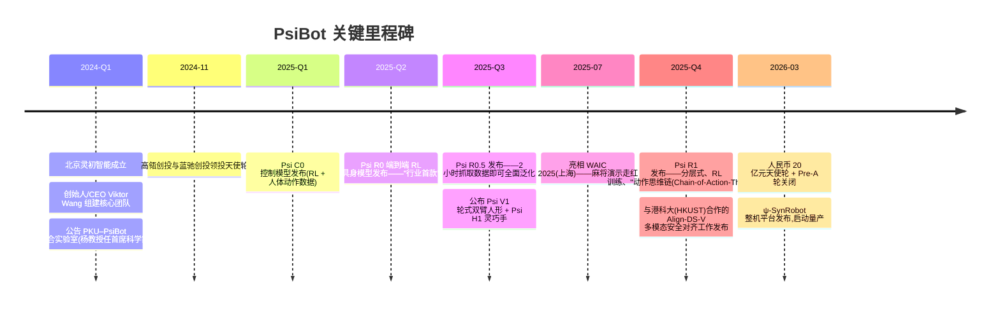
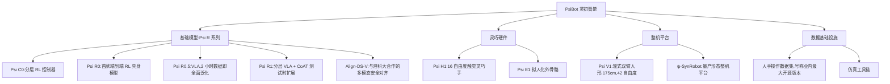
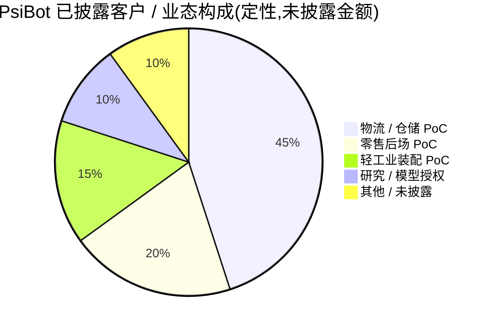

# PsiBot(灵初智能)——公司研究报告

**日期:** 2026-05-19
**状态:** 非上市公司。无公开披露文件。所有财务及经营数据均来源于公司新闻稿、创始人访谈、第三方行业媒体及学术出版物([PsiBot About Us](https://www.psibot.ai/en/about-us/);[企查查 — 北京灵初智能科技有限公司](https://m.qcc.com/firm/3f07d88ff9b9258868eacb9fcf72be05.html))。无法独立验证的重要主张均在文中以 `[未经核实]` 标注。
**分析师署名说明:** 用户提示词将创始人/CEO 称为 "Wang Qixin(王启鑫)"。公开资料一致地将创始人/CEO 标识为 **王启斌 / Dr. Viktor Wang**(英文名 "Viktor")([PsiBot About Us](https://www.psibot.ai/en/about-us/);[Sohu, "00 后联合创始人如何引领灵初智能完成千万融资"](https://www.sohu.com/a/826255070_122004016))。汉字差异(鑫 vs 斌)被视为用户提示词中的笔误;本报告采用 PsiBot 与中文行业媒体公开发布的姓名。

---

> **更新——人民币 20 亿元(约 2.80 亿美元)天使轮 + Pre-A 轮融资公告(2026-03-10):** PsiBot 披露其天使轮与 Pre-A 轮累计完成约人民币 20 亿元融资(按当时即期汇率折合约 2.80 亿美元)。天使轮由国家队投资方领衔——国开金融(国家开发银行旗下)、国中资本以及央视融媒体产业投资基金(CCTV Media-Convergence Industrial Investment Fund);Pre-A 轮由上海徐汇资本领投,无锡梁溪科创母基金(由博华资本管理)、锡创投、浦峰资本、清正资本(Timing Capital)跟投。募资用途:扩大物流场景部署规模,搭建大规模数据采集体系。
> 资料来源:[Gasgoo, "PsiBot Announces Completion of 2 Billion Yuan Financing", 2026-03-17](https://autonews.gasgoo.com/articles/icv/seeds-psibot-announces-completion-of-2-billion-yuan-financing-2031589417448222721);[Benzinga, "PsiBot's $280M Fundraising Signals China's Bet On Embodied AI", 2026-03](https://www.benzinga.com/Opinion/26/03/51292693/psibots-280m-fundraising-signals-china-bet-on-embodied-ai)。

---

## 目录

1. 公司概况
2. 公司沿革
3. 管理团队
4. 产品与服务
5. 客户与市场策略
6. 行业概览
7. 竞争格局
8. 市场机会(TAM)
9. 风险评估
10. 参考文献

---

## 1. 公司概况

**PsiBot**(中文名 **灵初智能**,公司全称 北京灵初智能科技有限公司;英文常被表述为 "Proto-Sentient Intelligence" 或简称 "PsiBot")是一家总部位于北京、于 2024 年初成立的具身智能初创公司。公司设计并构建用于通用灵巧操作的端到端视觉-语言-动作(Vision-Language-Action,VLA)基础模型,并将这些模型集成至自主研发的少量机器人平台中——包括轮式双臂人形机器人、五指触觉灵巧手以及一款外骨骼式上半身数据采集装置。PsiBot 的定位有别于"以双足行走优先"的阵营(Unitree(宇树)、Figure、1X、EngineAI)以及"仅做基础模型、硬件无关"的阵营(Skild AI、Physical Intelligence):公司将自身理念表述为 **"小全栈"**——即模型 + 仿真 + 灵巧手硬件 + 轮式移动底座垂直整合的闭环,聚焦于 *操作* 瓶颈而非 *行走* 瓶颈([PsiBot, "About Us"](https://www.psibot.ai/en/about-us/);[QbitAI / 量子位, 2024-11](https://www.qbitai.com/2024/11/218183.html))。

**公司实际销售的产品。** 截至本报告日期,PsiBot 尚未实现任何实质意义上的商业化收入,主要包括两款硬件 SKU 与一条基础模型产品线([PsiBot Products page](https://www.psibot.ai/en/products/);[Gasgoo, 2026-03-17](https://autonews.gasgoo.com/articles/icv/seeds-psibot-announces-completion-of-2-billion-yuan-financing-2031589417448222721)):

- **Psi V1**——一款身高 175 厘米的轮式双臂人形机器人,具备人形上半身,全身共 42 个自由度(其中 22 个位于两只五指手),并标配公司自研的五指触觉手([Aparobot Psi V1 page](https://www.aparobot.com/robots/psi-v1))。
- **Psi H1**——16 自由度五指触觉灵巧手,公司描述其"可稳固抓握重达 20 公斤的物体",触觉精度约 0.1 毫米;既用于自家 Psi V1 集成,也面向第三方机械臂配套销售([Humanoid.guide, "Welcome, Psi V1 by PsiBot"](https://humanoid.guide/welcome-psi-v1-by-psibot/))。
- **Psi E1**——拟人化外骨骼,用作遥操作 / 数据采集装置,旨在以工业化规模采集人类灵巧手演示数据并纳入 PsiBot 的训练语料库([PsiBot Products page](https://www.psibot.ai/en/products/))。
- **ψ-SynRobot**——较新发布的"量产形态"整机平台,PsiBot 称这是公司首款进入量产阶段的自研整机产品,定位于仓储、零售及轻工业装配场景的 7×24 小时连续运转([PsiBot, "灵初智能发布自研整机ψ-SynRobot并启动量产"](https://www.psibot.ai/%E7%81%B5%E5%88%9D%E6%99%BA%E8%83%BD%E5%8F%91%E5%B8%83%E8%87%AA%E7%A0%94%E6%95%B4%E6%9C%BA%CF%88-synrobot%E5%B9%B6%E5%90%AF%E5%8A%A8%E9%87%8F%E4%BA%A7%EF%BC%8C%E6%AD%A3%E5%BC%8F%E5%BC%80%E5%90%AF/))。
- **Psi R 系列 VLA 模型**——公司端到端 VLA / RL(强化学习)基础模型产品线:Psi R0(首次发布)、Psi R0.5("两小时数据即可实现完全泛化"里程碑)以及 Psi R1(支持测试时扩展、能打麻将的旗舰)。这是 PsiBot 所有硬件 SKU 背后差异化的技术资产([PsiBot R0 release](https://www.psibot.ai/en/002_en/);[PsiBot R0.5 release](https://www.psibot.ai/en/005_en/);[PsiBot R1 release](https://www.psibot.ai/en/007_en/))。

**公司的盈利路径。** PsiBot 未公布价格表,亦无第三方报告其出货量。从公司解决方案页面以及 2026-03 融资公告所述用途可推断,其潜在的收入模式包括:(a)将 Psi V1 / ψ-SynRobot 以 **机器人即服务(RaaS)** 方式部署至仓储拣选-打包-分拣、零售后场及轻工业装配客户;(b)直接 **销售 Psi H1 灵巧手** 给研究机构、第三方人形机器人集成商和希望获得先进末端执行器但不愿自研的 OEM;(c)最终 **将 Psi R 系列模型授权** 给没有内部 AI 团队的第三方机械臂和人形 OEM,作为基础模型层——类似 Physical Intelligence 在美国基于其 π0 / π0.5 平台所尝试的模式([Pi blog, "A VLA with Open-World Generalization"](https://www.pi.website/blog/pi05);[PsiBot, "Solution — Retail"](https://www.psibot.ai/en/solutions/solution_retail/))。[未经核实——模型授权这一假设是分析师基于公开资料对公司战略的重构;PsiBot 尚未正式发布模型授权 SKU。]

**地理布局。** PsiBot 总部位于北京(研发核心与 PKU–PsiBot 联合实验室所在地),并已公告在上海(Pre-A 国资投资方徐汇资本的属地)和无锡(梁溪科创母基金所在地)设立运营基地。截至目前所有对外披露的部署均位于中国大陆。公司未披露任何美国或欧盟的销售或运营。但公司确曾在全球开发者先锋大会(Global Developer Pioneer Conference)等国际场合展示 Psi R1 打麻将的演示,并作为 WAIC 2025(世界人工智能大会,上海)头部具身智能展示方亮相([CGTN, "WAIC preview: Mahjong, delivery robots highlight China's embodied AI", 2025-07-18](https://news.cgtn.com/news/2025-07-18/WAIC-preview-Mahjong-delivery-robots-highlight-China-s-embodied-AI-1F6GJCcRdWE/p.html))。

**规模。** 员工数:未公开披露;公司自述为"核心创始团队加顶尖行业引进人才"([PsiBot About Us](https://www.psibot.ai/en/about-us/)),研发组织的规模只能从公司在约 18 个月内发布了三代模型(R0、R0.5、R1)、三款硬件平台(V1、H1、E1)外加 ψ-SynRobot 这一节奏来推断([PsiBot newsroom](https://www.psibot.ai/en/author/psibot/)),推测为数百人级别的工程组织,但 [未经核实——未披露员工数据]。营收:未披露;公司处于商业化前阶段,2026 年的多数披露内容描述的仍是试点和概念验证而非可持续收入([Gasgoo, "2 Billion Yuan, Why Did State-Backed Capital Collectively Bet on This Robotics Startup?", 2026-03-17](https://autonews.gasgoo.com/articles/news/2-billion-yuan-why-did-state-backed-capital-collectively-bet-on-this-robotics-startup-2031717172080922625))。

**估值快照(非上市——无可比上市公司倍数)。** 由于 PsiBot 为非上市公司,无可交易股权,P/E、P/S 倍数均不适用([企查查 — 北京灵初智能科技有限公司](https://m.qcc.com/firm/3f07d88ff9b9258868eacb9fcf72be05.html))。最相关的参考指标是 **最近一轮披露的投后估值及隐含的收入倍数**,二者 PsiBot 均未公开披露([Tracxn — PsiBot funding and investors](https://tracxn.com/d/companies/psibot/__mdMgBB3-gUeSV0IViKY9HtaZPkhIbwfDBi-YnSxn0L8/funding-and-investors))。关键参考点如下:

- **最近一轮规模:** 截至 2026-03-10 累计完成约人民币 20 亿元(约 2.80 亿美元)的天使轮加 Pre-A 轮融资([Gasgoo, 2026-03-17](https://autonews.gasgoo.com/articles/icv/seeds-psibot-announces-completion-of-2-billion-yuan-financing-2031589417448222721))。
- **投后估值:** 未披露。[未经核实——中文行业媒体未公布投后数字;Tracxn 与 IT 桔子条目仅描述轮次规模,未给出估值]([Tracxn — PsiBot funding and investors](https://tracxn.com/d/companies/psibot/__mdMgBB3-gUeSV0IViKY9HtaZPkhIbwfDBi-YnSxn0L8/funding-and-investors))。
- **可比一级市场参考点(已核实):** 银河通用(Galbot)2025 年投后估值约 30 亿美元([humanoidsdaily.com, "The Great Valuation Chasm", 2025](https://www.humanoidsdaily.com/news/the-great-valuation-chasm-a-2025-guide-to-the-humanoid-robotics-capital-race));智元(Agibot)IPO 目标估值高达约 64 亿美元([TechCrunch, 2026-02-28](https://techcrunch.com/2026/02/28/why-chinas-humanoid-robot-industry-is-winning-the-early-market/));宇树(Unitree)科创板 IPO 目标估值高达约 70 亿美元([CNBC, 2025-09-09](https://www.cnbc.com/2025/09/09/chinas-unitree-plans-7-billion-ipo-valuation-as-humanoid-robot-race-heats-up.html));Figure 估值约 390 亿美元([Sacra Figure AI](https://sacra.com/c/figure-ai/));Physical Intelligence 在 B 轮后估值约 56 亿美元([Sacra Physical Intelligence](https://sacra.com/c/physical-intelligence/));Skild AI 在 2026-01 软银领投后估值约 140 亿美元。

按粗略测算,以中国阵营中位数为基准(Galbot 约 30 亿美元,Agibot 上市前约 64 亿美元,Unitree 上市前约 70 亿美元)([humanoidsdaily.com, 2025](https://www.humanoidsdaily.com/news/the-great-valuation-chasm-a-2025-guide-to-the-humanoid-robotics-capital-race);[CNBC, 2025-09-09](https://www.cnbc.com/2025/09/09/chinas-unitree-plans-7-billion-ipo-valuation-as-humanoid-robot-race-heats-up.html);[TechCrunch, 2026-02-28](https://techcrunch.com/2026/02/28/why-chinas-humanoid-robot-industry-is-winning-the-early-market/)),PsiBot 约 2.80 亿美元的融资规模对应的投后估值大致落在 **7–15 亿美元** 区间,即"崛起中的挑战者"而非头部估值。[未经核实——该区间为分析师模型测算,非公开披露数字。]

---

## 2. 公司沿革

PsiBot 于 2024 年初在北京设立(北京灵初智能科技有限公司),由创始人/CEO Dr. Viktor Wang(王启斌)创立。Wang 是一位长期深耕机器人与消费电子行业的产品高管,此前曾任职于京东机器人、云迹科技、灵动科技(ForwardX Robotics)、BlackBerry 及 Sonos([PsiBot About Us](https://www.psibot.ai/en/about-us/))。创始论点在每一次创始人访谈中均被反复强调:人形机器人商业化的核心瓶颈在于 **灵巧操作** 而非双足行走——即在仓库、装配线、厨房中产生有用劳动的"最后一公里"在于手,而非腿。PsiBot 即明确以攻克这一瓶颈为使命,采用基于强化学习训练的端到端 VLA 模型,搭配自研五指触觉手。

联合创始人 **陈源培(Yuanpei Chen)**,2000 年后出生,北京大学本科背景、斯坦福大学访问学者(师从 C. Karen Liu(凯伦·刘) 与 Fei-Fei Li(李飞飞) 两位教授),在公司成立后不久加入担任技术联合创始人。他被认为是全球第一位在真实机器人上演示双臂双手多技能强化学习操作的研究者——这一说法可追溯至他在 CoRL 2023 上发表的斯坦福"Sequential Dexterity"论文([Chen et al., "Sequential Dexterity", CoRL 2023 / arXiv:2309.00987](https://arxiv.org/abs/2309.00987))。**杨耀东教授(Prof. Yang Yaodong)**,北京大学人工智能研究院博雅青年学者,在基于人类反馈的强化学习(RLHF)与 AI 对齐方向上是中国引用量最高的青年学者之一,出任公司首席科学家,并主持 **PKU–PsiBot 灵巧操作联合实验室**([PsiBot, "Good News: PsiBot Chief Scientist Prof. Yaodong YANG Named to AI100 Young Pioneers"](https://www.psibot.ai/en/006_en/);[Yang Yaodong personal site](https://yangyaodong.com/))。

公司前 24 个月里程碑梳理如下:



资料来源:综合自 [PsiBot newsroom](https://www.psibot.ai/en/author/psibot/);[Gasgoo, 2026-03-17](https://autonews.gasgoo.com/articles/icv/seeds-psibot-announces-completion-of-2-billion-yuan-financing-2031589417448222721);[QbitAI, 2024-11-12](https://www.qbitai.com/2024/11/218183.html);[PrNewswire, "The Real VLA is Coming: Psi R1 Starts a New Era of Embodied AI"](https://www.prnewswire.com/news-releases/the-real-vla-is-coming-psi-r1-starts-a-new-era-of-embodied-ai-302441126.html)。

**战略调整 / 演进。** 前 24 个月公开记录中可见三次重定向。**其一**,早期带有学术风格的、对 **Psi C0 分层控制模型**(上层基于人体动作数据生成参考轨迹,下层强化学习控制器跟随)的偏好,逐渐让位于在 R0 / R0.5 / R1 中更激进的 **端到端 VLA 架构**——即公司从"跟踪控制器 + RL 微调"流派转向单一集成的多模态模型。这与 2024–2025 年整个行业的演进方向(π0、Helix、RT-2、OpenVLA)一致,也与 [PsiBot 的 R0.5 发布稿](https://www.psibot.ai/en/005_en/) 中"R0.5 达到泛化所需数据量仅为 Helix 的 0.4%"的表述吻合。**其二**,公司从"模型公司"转向 **"小全栈"**——明确选择自研硬件(V1 / H1 / E1 / ψ-SynRobot)而非依赖第三方机械臂或手。这一转向被融资模式所强化:2024-11 天使轮(高瓴 / 蓝驰)是典型的 VC 种子轮;2026-03 的 Pre-A 轮则以 **国资产业政策资金为主**(国开金融、国中资本、央视融媒体基金、徐汇资本、梁溪母基金)——这种模式在中国通常意味着公司将进入制造级别的产能建设,而不仅仅是研发推进。**其三**,客户行业重心从泛化的"灵巧操作演示"(麻将、翻砖)迁移至以 **物流与零售后场** 作为明确的市场切入点,这一点同样被 Pre-A 轮的资金用途陈述以及公司官网"解决方案 / 零售"页面所确认([PsiBot, "Solution — Retail"](https://www.psibot.ai/en/solutions/solution_retail/))。

**收购:** 未披露。PsiBot 完全靠内部发展并依托北大联合实验室结构成长([PsiBot About Us](https://www.psibot.ai/en/about-us/))。

**近 6 个月重大动态。** Pre-A 轮关闭(2026-03)、ψ-SynRobot 量产公告(2026-Q1),以及 Psi R1 公开发布及其麻将"动作思维链"演示(2025 年末)是与投资逻辑最相关的近期事件([新浪财经,"国家队"资本投资「灵初智能」, 2026-03-10](https://finance.sina.com.cn/wm/2026-03-10/doc-inhqnrqq6278923.shtml);[PsiBot, "The Real VLA is Coming: PsiBot's Psi R1"](https://www.psibot.ai/en/007_en/));详见下文第 4 节与第 7 节展开。

---

## 3. 管理团队

### Dr. Viktor Wang(王启斌)——创始人兼 CEO

Viktor Wang 是 PsiBot 的创始人兼 CEO。根据公司官网与中文行业媒体相互印证的信息,他持有博士学位,在移动设备、智能音箱与机器人领域具备"近二十年"的高管经验,曾出任 **京东机器人(JD.com Robotics)总裁、云迹科技(Yunji Technology)产品 VP,以及在灵动科技(ForwardX Robotics)、BlackBerry、Sonos** 等公司担任高级职务([PsiBot About Us](https://www.psibot.ai/en/about-us/))。其职业轨迹与 PsiBot 商业化论点高度契合:Sonos / BlackBerry 的经历覆盖消费级产品定义与全球发布规范;云迹 / 灵动 / 京东的经历则覆盖移动机器人产品化、对中国酒店与物流客户的规模部署、以及五至六位数级别机器人车队实际运营所需的一线管理经验。在 2024-11 天使轮以及 2026-03 Pre-A 轮关闭前后的创始人访谈中,Wang 始终把 PsiBot 描述为一场 *产品化* 战役——强调公司将取胜或失败于是否能把前沿模型转化为 7×24 占空比的可靠性,而非取决于基准测试分数([QbitAI, 2024-11-12](https://www.qbitai.com/2024/11/218183.html);[Gasgoo, 2026-03-17](https://autonews.gasgoo.com/articles/news/2-billion-yuan-why-did-state-backed-capital-collectively-bet-on-this-robotics-startup-2031717172080922625))。

Wang 在前任公司的具体业绩,在公开资料中的可记录性低于美国高管的典型水平,本报告将此标注为尽职调查的局限:他在京东机器人、云迹的具体出货数字、损益责任或所主导的具体产品线均无系统化的公开记录。[未经核实——以往岗位的细化 KPI。] 但可交叉验证的是其规模:他任内的京东机器人是一家数百人规模的组织,向京东自有仓库出货 AGV / AMR / 末端配送硬件;云迹则是当时中国酒店服务机器人最具主导地位的供应商([知乎专栏, 对话灵初智能 CEO 王启斌, 2025](https://zhuanlan.zhihu.com/p/2015514831617295556);[新浪财经, 对话灵初智能 CEO 王启斌, 2025-06-11](https://finance.sina.com.cn/roll/2025-06-11/doc-inezupah3838669.shtml))。Wang 的教育背景与具体毕业年份未公开([未经核实])。

持股情况:未公开披露。作为一家具备国资参与的中国 Pre-A 阶段初创公司创始人,Wang 的稀释前持股最可能落在 25–45% 区间——属于中国 VC 在该轮次创始人持股的典型水平——但 PsiBot 未公布股权结构表([企查查 — 北京灵初智能科技有限公司](https://m.qcc.com/firm/3f07d88ff9b9258868eacb9fcf72be05.html);[未经核实])。薪酬结构:未披露;中国注册初创公司的创始人薪酬绝大部分与股权挂钩,现金薪酬按硅谷标准属偏低水平。公开形象:Wang 在投融资公告与全球开发者先锋大会等场合担任主要发言人([PsiBot, "PsiBot Shines at Global Developer Pioneer Conference"](https://www.psibot.ai/en/004_en/);[蓝驰创投, 对话灵初智能 CEO 王启斌](https://www.lanchivc.com/8515/));他不像美国创始人那样高频发文或做播客节目。

### 杨耀东教授(Prof. Yang Yaodong)——首席科学家;PKU–PsiBot 联合实验室主任

杨耀东是 **北京大学人工智能研究院博雅青年学者**,担任 PKU–PsiBot 灵巧操作联合实验室首席科学家。他的个人学术网站将其研究方向定义为人机安全交互与价值对齐——RLHF / DPO / Safe-RLHF、奖励建模、可解释性、多模态与多语言安全——并延伸至多智能体学习和具身智能领域([Yang Yaodong personal site](https://yangyaodong.com/);[Google Scholar](https://scholar.google.co.uk/citations?user=6yL0xw8AAAAJ&hl=en))。他在 Nature Machine Intelligence、JMLR、IEEE T-PAMI、NeurIPS、ICML、CoRL 等顶级期刊和会议上发表 100 余篇论文,Google Scholar 引用数超 6,000 次,并获得 **CoRL 2020 最佳系统论文奖**、**AAMAS 2021 最佳蓝天论文奖**、**ACM SIGAI China Rising Star**、**WAIC 2022 卓越青年奖**。

其引用最高的研究方向为 **Safe-RLHF** 与 **PKU-Alignment / Beaver 开源 RLHF 框架**([github.com/PKU-Alignment/safe-rlhf](https://github.com/PKU-Alignment/safe-rlhf)),并主导了 **Align-Anything** 多模态对齐框架以及与港科大(HKUST)合作的 **Align-DS-V** 项目——后者已被 PsiBot 集成进其 DS-VLA 框架([PsiBot, "Multimodal DeepSeek is here"](https://www.psibot.ai/en/003_en/))。在 PsiBot 的组织架构中,他是核心学术支柱:北大联合实验室是 PhD 级别 RL 人才的招聘漏斗,R0 / R0.5 / R1 模型产品线带有他和门下学生的理论印记(分层端到端、RL + 离线偏好对齐、测试时扩展的动作思维链)。2025 年他被列入 **AI100 青年先锋** 榜单([PsiBot, "Good News: PsiBot Chief Scientist Prof. Yaodong YANG Named to AI100 Young Pioneers"](https://www.psibot.ai/en/006_en/))。

### 陈源培(Yuanpei Chen)——联合创始人

陈源培系 00 后联合创始人,也是公司曝光度最高的技术形象。他在北京大学本科期间师从杨耀东教授开展灵巧手操作研究,随后赴斯坦福大学担任访问学者,师从 C. Karen Liu(凯伦·刘) 教授与 Fei-Fei Li(李飞飞) 教授,合著 **"Sequential Dexterity: Chaining Dexterous Policies for Long-Horizon Manipulation"**(Chen, Wang, Fei-Fei, Liu — CoRL 2023,[arXiv:2309.00987](https://arxiv.org/abs/2309.00987))。在杨教授的推荐下,陈源培回到北京并在公司创立之初以技术联合创始人身份加入。他被视为 **Psi C0** 双层控制模型的主导设计师,也是 Psi R 系列开源版本的共同作者。他入选 **福布斯亚洲 30 Under 30(2025 年榜单)**([PsiBot, "PsiBot Co-founder Yuanpei Chen Recognized in Forbes Asia 2025 30 Under 30"](https://www.psibot.ai/en/announcement%EF%BD%9Cpsibot-co-founder-yuanpei-chen-recognized-in-forbes-asia-2025-30-under-30/))。

### Dr. Xiaojie Chai(柴晓杰)——联合创始人

根据 PsiBot 官网"关于我们"页面,柴晓杰博士为联合创始人,在机器人与自动驾驶领域拥有 15 年以上从业经验,曾在腾讯、阿里巴巴、京东等科技大厂担任核心技术岗([Sohu, "00 后联合创始人如何引领灵初智能完成千万融资", 2024-11](https://www.sohu.com/a/826255070_122004016))。其历任职位与管理履历的公开记录较 Wang 和 Yang 不够详尽;在 PsiBot 内部他出任硬件 / 系统工程负责人角色([PsiBot About Us](https://www.psibot.ai/en/about-us/))。[未经核实——前任雇主、确切任职年限、持股比例均未披露。]

### CFO 及其他高管

PsiBot **尚未公开披露 CFO 或财务负责人**([PsiBot About Us](https://www.psibot.ai/en/about-us/);[企查查 — 北京灵初智能科技有限公司](https://m.qcc.com/firm/3f07d88ff9b9258868eacb9fcf72be05.html))。在中国注册、未上市的具身智能初创公司中,CFO 席位通常仅在正式 A 轮或上市筹备期才会到位(参见同业 [Gasgoo, 2026-03-17](https://autonews.gasgoo.com/articles/news/2-billion-yuan-why-did-state-backed-capital-collectively-bet-on-this-robotics-startup-2031717172080922625) 对中国具身智能阵营治理结构的描述);因此 PsiBot 当前未公开 CFO 对其所处阶段而言并不异常,但对希望评估其资本市场准备度的投资者而言仍是一项实质性缺口。[未经核实——CFO 与法务总顾问身份均未披露。]

### 治理结构脚注

- **董事会构成 / 独立性:** 未披露;作为一家中国非上市初创公司,董事席位很可能由 Wang(创始人)持有,加上天使轮投资方高瓴(GL Ventures / Hillhouse)和蓝驰创投(Lanchi Ventures)各一至两席,Pre-A 轮的国资投资方(国开金融、徐汇资本)则更倾向于获得观察席([投中网 — 灵初智能完成天使轮融资](https://www.chinaventure.com.cn/news/80-20241113-383811.html);[新浪财经,"国家队"资本投资「灵初智能」, 2026-03-10](https://finance.sina.com.cn/wm/2026-03-10/doc-inhqnrqq6278923.shtml))。[未经核实——董事会名册未披露。]
- **内部人持股:** 未披露。天使轮加 Pre-A 累计稀释比例估计在 25–40% 区间 [未经核实——分析师基于中国具身智能同业平均水平的估算]([Tracxn — PsiBot funding and investors](https://tracxn.com/d/companies/psibot/__mdMgBB3-gUeSV0IViKY9HtaZPkhIbwfDBi-YnSxn0L8/funding-and-investors))。
- **薪酬结构:** 偏重股权、与绩效挂钩,符合本阵营惯例。未公开披露([企查查 — 北京灵初智能科技有限公司](https://m.qcc.com/firm/3f07d88ff9b9258868eacb9fcf72be05.html))。
- **关联交易 / 治理提示:** **PKU–PsiBot 联合实验室** 是主要的关联方安排。杨耀东教授持续保留北大教职、同时担任 PsiBot 首席科学家([Yang Yaodong personal site](https://yangyaodong.com/);[PsiBot, "PsiBot Chief Scientist Prof. Yaodong YANG Named to AI100 Young Pioneers"](https://www.psibot.ai/en/006_en/))——这是中国 AI 初创公司中常见的洁净学术-产业分工模式;公开记录中没有任何治理隐患的迹象,但北大与 PsiBot 之间的知识产权分配条款尚未公开([未经核实——联合实验室 IP 条款未披露])。

### 履历综合判断

PsiBot 团队与其论点的匹配度异常之高:Wang 带来近 20 年的硬件产品化实战经验([PsiBot About Us](https://www.psibot.ai/en/about-us/));杨耀东带来学术信用、RLHF / 对齐方面的 IP 以及北大招聘通道([github.com/PKU-Alignment/safe-rlhf](https://github.com/PKU-Alignment/safe-rlhf));陈源培带来一线灵巧操作算法功底以及斯坦福背景的人才网络([Chen et al., "Sequential Dexterity", CoRL 2023](https://arxiv.org/abs/2309.00987))。最大缺口在于 **资本市场 / CFO 经验**——公司尚未释放公开 IPO 路径信号,亦无在职 CFO。与同业 Agibot 或 Unitree(据报均瞄准 2026 年科创板 IPO)相比([CNBC, 2025-09-09](https://www.cnbc.com/2025/09/09/chinas-unitree-plans-7-billion-ipo-valuation-as-humanoid-robot-race-heats-up.html);[TechCrunch, 2026-02-28](https://techcrunch.com/2026/02/28/why-chinas-humanoid-robot-industry-is-winning-the-early-market/)),PsiBot 的治理结构建设落后 6–12 个月。若下一轮为正式 A 轮或上市前轮、投后估值落在 10–20 亿美元区间,预计未来两个季度内会有一位有经验的 CFO 加盟。

---

## 4. 产品与服务

PsiBot 的产品矩阵规模不大但耦合度高。产品树主要分为三个分支——**基础模型**、**灵巧操作硬件**、**整机平台**——再加上第四个 **数据采集装置**(Psi E1),用于为模型层供给数据([PsiBot Products page](https://www.psibot.ai/en/products/);[PsiBot newsroom](https://www.psibot.ai/en/author/psibot/))。



资料来源:综合自 [PsiBot Products page](https://www.psibot.ai/en/products/)、[PsiBot R1 release](https://www.psibot.ai/en/007_en/)、[PsiBot R0.5 release](https://www.psibot.ai/en/005_en/)、[PsiBot ψ-SynRobot announcement](https://www.psibot.ai/%E7%81%B5%E5%88%9D%E6%99%BA%E8%83%BD%E5%8F%91%E5%B8%83%E8%87%AA%E7%A0%94%E6%95%B4%E6%9C%BA%CF%88-synrobot%E5%B9%B6%E5%90%AF%E5%8A%A8%E9%87%8F%E4%BA%A7%EF%BC%8C%E6%AD%A3%E5%BC%8F%E5%BC%80%E5%90%AF/)。

### 4.1 基础模型——Psi R 系列

**Psi R 系列** 是 PsiBot 的核心差异化点。每一次发布都在上一代基础上以较紧凑的节奏推进([PsiBot newsroom](https://www.psibot.ai/en/author/psibot/);[PsiBot R0.5 release](https://www.psibot.ai/en/005_en/);[PsiBot R1 release](https://www.psibot.ai/en/007_en/))。

**Psi C0(2025 年初)**——由陈源培提出的双层分层控制架构。上层接收人体动作捕捉数据并生成参考轨迹;下层训练一个强化学习控制器在真实机器人上跟随这些轨迹([Yuanpei Chen personal site](https://cypypccpy.github.io/);[Chen et al., "Sequential Dexterity", arXiv:2309.00987](https://arxiv.org/abs/2309.00987))。其用意是克服"纯 RL"路线长期存在的泛化与灵巧度权衡:纯 RL 灵巧但难泛化,纯模仿人类则可泛化但失去精细动作锐度。C0 是促使 R0 及后续转向端到端 VLA 的学术过渡阶段([PsiBot, "Breaking through Pick & Place — Psi R0"](https://www.psibot.ai/en/002_en/))。

**Psi R0**——PsiBot 在其发布博客中将其描述为 **"首款端到端强化学习具身模型"**([PsiBot, "Breaking through Pick & Place — Psi R0, the first end-to-end RL embodied model, has officially arrived!"](https://www.psibot.ai/en/002_en/))。R0 实现了从简单拣选-放置突破到"开放词汇"长时序任务的能力。

**Psi R0.5**——突破性版本。根据 PsiBot 自家技术博文,R0.5 **仅使用两小时灵巧手抓取数据(2,094 条轨迹,每条约 3.5 秒),即可实现完全的对象与场景泛化**,对应 **约为 Figure AI 旗下 Helix 模型实现可比泛化所需数据量的 0.4%**([PsiBot, "PsiBot Releases End-to-End VLA Model Psi R0.5"](https://www.psibot.ai/en/005_en/))。该次发布伴随 4 篇经过同行评审或 arXiv 发表的论文,分别涉及高效泛化抓取、杂乱场景物品检索、环境辅助抓取以及 VLA 安全对齐。R0.5 的发布同时公布了 PsiBot 所称的 **迄今最大的开源人手操作数据集**(为 PsiBot 自家公告口径;[未经核实——与 DexCap、DROID、RH20T 等的相对排序,未找到第三方基准比对])。

**Psi R1**——分层式、RL 训练、**动作思维链(Chain-of-Action-Thought, CoAT)** 的旗舰。R1 引入双系统架构:一个用于认知推理与规划的"慢脑",一个用于低延迟操作的"快脑",并支持长时序任务内的自我校验与反思。PsiBot 公开演示中,**打麻将机器人** 可维持连贯动作链 **30 分钟** 的开放式对局,包括多智能体交互(机器人之间互相传牌)以及人机对弈([PsiBot, "The Real VLA is Coming: PsiBot's Psi R1"](https://www.psibot.ai/en/007_en/);[PsiBot, "The Second Wave of Real VLA: Psi R1 Achieves Generalized Intelligence at the Brain Level!"](https://www.psibot.ai/en/008_en/);[PrNewswire, "The Real VLA is Coming: Psi R1 Starts a New Era of Embodied AI"](https://www.prnewswire.com/news-releases/the-real-vla-is-coming-psi-r1-starts-a-new-era-of-embodied-ai-302441126.html))。PsiBot 称 R1 是首款验证 **VLA 测试时扩展(Test-Time Scaling)** 的模型——即让模型在推理阶段消耗更多算力以解决更复杂的问题,类似 OpenAI o1 / DeepSeek-R1 在 LLM 上的做法。

**Align-DS-V**——与港科大(HKUST)的合作项目,杨耀东团队将 Safe-RLHF 风格的多模态对齐应用于 DeepSeek-V3,产出一款已对齐的多模态模型,用于 PsiBot 的 DS-VLA 框架内部([PsiBot, "Multimodal DeepSeek is here!"](https://www.psibot.ai/en/003_en/))。这是杨教授学术对齐工作与 PsiBot 商业化 VLA 技术栈之间最直接的交叉融合。

**单品竞争优势评估(R 系列):** **部分护城河——技术 + 数据效率**。R0.5 的数据效率主张是 PsiBot 推销中最具防御性的一条:若"2 小时数据 → 全面泛化"在部署规模上成立,公司的数据采集成本将结构性低于 Helix 一类的竞争对手。证据:PsiBot 已发布支持该主张组成部分的 arXiv 论文([Retrieval Dexterity, arXiv:2502.18423](https://arxiv.org/html/2502.18423v1))。最接近的同类产品:**Physical Intelligence π0.5**([Pi blog, "A VLA with Open-World Generalization"](https://www.pi.website/blog/pi05);[arXiv:2504.16054](https://arxiv.org/abs/2504.16054))——在范围上(具备开放世界泛化能力的 VLA)大体可比,但 π0.5 面向跨第三方机械臂的硬件无关部署,而 Psi R0.5 与 Psi H1 灵巧手深度协同设计。一句话对比:**泛化能力打平,在灵巧手专属数据效率上领先,在跨本体可移植性上落后。**

### 4.2 灵巧硬件——Psi H1 与 Psi E1

**Psi H1。** 16 自由度五指触觉灵巧手,内置力/触觉传感器。公司披露参数:物体尺寸范围 1–115 毫米,触觉精度达 0.1 毫米级,握持力可"稳固抓取重达 20 公斤的物体",并采用一种公司称之为业内独有的"深度耦合操作算法"([Humanoid.guide hands catalog](https://humanoid.guide/hands/);[Humanoid.guide Welcome Psi V1](https://humanoid.guide/welcome-psi-v1-by-psibot/))。该灵巧手与 R 系列模型协同设计——即为了向模型提供完成毫米级操作所需的触觉信号,而非一只通用五指夹爪。[未经核实——尚未找到第三方对 Psi H1 握持力与触觉精度相对 Shadow Robot 的 Shadow Hand、Allegro Hand、因时机器人(Inspire Robotics)RH56、或 Sanctuary Phoenix hand 的基准对比。]

**单品竞争优势评估(Psi H1):** **是——技术 + 生态锁定**。16 自由度 + 触觉一体化 + 模型协同设计的组合较为稀有([Humanoid.guide hands catalog](https://humanoid.guide/hands/));来自具名竞品中最接近的独立灵巧手为 **因时机器人 RH56-DFX**(中国第三方主导的 6 自由度/12 自由度触觉灵巧手)([因时机器人 RH56DFTP 系列产品页](https://www.inspire-robots.com/dexterous%20hands/rh56dftp-series/);[新浪财经,"手"刃江湖, 2025-03-13](https://finance.sina.com.cn/jjxw/2025-03-13/doc-inepniqu5027342.shtml)),Psi H1 **在自由度数量与模型协同设计上领先**,**在形态与价格上打平** ([未经核实——Psi H1 未公开价格]),**在第三方生态成熟度上落后**(因时的灵巧手已进入批量生产并供应多家中国人形机器人 OEM,2025 年交付量突破 10,000 台)([投资界, IROS 灵巧手大盘点, 2025-11](https://news.pedaily.cn/202511/557034.shtml))。

**Psi E1。** 用于人类示教遥操作 / 数据采集的拟人化外骨骼。其战略角色在于工业化地搭建为 R 系列输送数据的管线([PsiBot Products page](https://www.psibot.ai/en/products/);[Gasgoo, 2026-03-17](https://autonews.gasgoo.com/articles/icv/seeds-psibot-announces-completion-of-2-billion-yuan-financing-2031589417448222721))。PsiBot 未披露 Psi E1 的价格或装机量。

### 4.3 整机平台——Psi V1 与 ψ-SynRobot

**Psi V1。** 身高 175 厘米的轮式双臂人形机器人。披露参数:**全身 42 个自由度(其中 22 个位于两只 Psi H1 五指手内)、轮式移动底盘、人形双臂上半身、多摄像头视觉系统、分层端到端 AI 控制,Psi R 系列在机载侧运行**([Aparobot Psi V1](https://www.aparobot.com/robots/psi-v1);[Humanoid.guide Welcome Psi V1](https://humanoid.guide/welcome-psi-v1-by-psibot/))。采用轮式底盘而非双足底盘是一个有意的战略选择:PsiBot 押注仓储 / 零售 / 工业装配客户近期并不需要双足行走,他们需要的是一款能够在平整地面上完成 7×24 小时连续作业的可靠移动操作平台。轮式底盘也大幅降低了电池/平衡控制的工程负担,使公司能将工程资源集中在操作问题上。

**ψ-SynRobot。** 在 2026-Q1 公布,作为 PsiBot 首款自研 *整机* 量产平台,公司表示量产已经启动([PsiBot, "灵初智能发布自研整机ψ-SynRobot并启动量产"](https://www.psibot.ai/%E7%81%B5%E5%88%9D%E6%99%BA%E8%83%BD%E5%8F%91%E5%B8%83%E8%87%AA%E7%A0%94%E6%95%B4%E6%9C%BA%CF%88-synrobot%E5%B9%B6%E5%90%AF%E5%8A%A8%E9%87%8F%E4%BA%A7%EF%BC%8C%E6%AD%A3%E5%BC%8F%E5%BC%80%E5%90%AF/))。ψ-SynRobot 被定位为面向仓储分拣、零售后场和工业装配场景的 7×24 小时持续运行平台。装机量、价格以及已确认客户名称均未公开披露。[未经核实——产能与定价。]

**单品竞争优势评估(Psi V1 / ψ-SynRobot):** **部分——技术 + 市场聚焦**。轮式双臂形态与 **Galbot G1**、**Agibot A2-W** 以及多个实验室平台(Stanford ALOHA、Mobile ALOHA)共享,因此 PsiBot 在形态上并不具备独占地位([Galbot G1 百度百科](https://baike.baidu.com/item/Galbot%20G1/67393532);[艾邦机器人, 机器人形态之争](https://www.aibangbots.com/a/5208))。差异化由软件栈驱动:PsiBot 将 R1 级别的操作智能直接搭载在机器人上,而竞品往往仍部署较为传统的行为克隆策略([PsiBot R1 release](https://www.psibot.ai/en/007_en/))。与 **Galbot G1** 一句话对比:**移动操作机形态打平**,**在灵巧手集成与触觉上领先**,**在商业部署规模上落后**(据报道,截至 2025 年末 Galbot 已在多个中国零售与仓储试点中部署,规模大于 PsiBot)([腾讯新闻, Galbot 零售大模型, 2025-06-10](https://news.qq.com/rain/a/20250610A09S7Z00);[维科号, 银河通用拿下工业最大订单](https://mp.ofweek.com/finance/a156714309577))。

### 4.4 旗舰产品 vs 长尾产品

当下推动业务的 1–2 款主力产品为 **Psi R0.5 / R1 基础模型栈**(吸引国资的核心技术资产)([PsiBot R0.5 release](https://www.psibot.ai/en/005_en/);[PsiBot R1 release](https://www.psibot.ai/en/007_en/))以及 **Psi H1 灵巧手**(最具说服力的独立硬件 SKU)([Humanoid.guide hands catalog](https://humanoid.guide/hands/))。Psi V1 是演示平台;ψ-SynRobot 是面向 2026–27 年商业化收入的核心押注([PsiBot, "灵初智能发布自研整机ψ-SynRobot并启动量产"](https://www.psibot.ai/%E7%81%B5%E5%88%9D%E6%99%BA%E8%83%BD%E5%8F%91%E5%B8%83%E8%87%AA%E7%A0%94%E6%95%B4%E6%9C%BA%CF%88-synrobot%E5%B9%B6%E5%90%AF%E5%8A%A8%E9%87%8F%E4%BA%A7%EF%BC%8C%E6%AD%A3%E5%BC%8F%E5%BC%80%E5%90%AF/))。Psi E1 是内部数据基础设施,而非面向客户的 SKU。

### 4.5 近 12 个月新发布 / 退出

- Psi R1 发布(2025 年末)——旗舰 VLA([PsiBot R1 release](https://www.psibot.ai/en/007_en/))
- Psi R0.5 发布(2025 年中)——号称 2 小时数据即可泛化的 VLA([PsiBot R0.5 release](https://www.psibot.ai/en/005_en/))
- Psi V1 + Psi H1 发布(2025)——首款整机平台 + 灵巧手([Aparobot — Psi V1 details](https://www.aparobot.com/robots/psi-v1);[Humanoid.guide hands catalog](https://humanoid.guide/hands/))
- ψ-SynRobot 发布并启动量产(2026-Q1)([PsiBot, ψ-SynRobot 量产公告](https://www.psibot.ai/%E7%81%B5%E5%88%9D%E6%99%BA%E8%83%BD%E5%8F%91%E5%B8%83%E8%87%AA%E7%A0%94%E6%95%B4%E6%9C%BA%CF%88-synrobot%E5%B9%B6%E5%90%AF%E5%8A%A8%E9%87%8F%E4%BA%A7%EF%BC%8C%E6%AD%A3%E5%BC%8F%E5%BC%80%E5%90%AF/))
- 暂无公开退出的产品。

---

## 5. 客户与市场策略

PsiBot 处于商业化前阶段,**未公开披露上市公司层面的客户营收集中度**(头部客户占比、前五大客户占比)([企查查 — 北京灵初智能科技有限公司](https://m.qcc.com/firm/3f07d88ff9b9258868eacb9fcf72be05.html);[Gasgoo, 2026-03-17](https://autonews.gasgoo.com/articles/icv/seeds-psibot-announces-completion-of-2-billion-yuan-financing-2031589417448222721))。这是尽职调查档案中最大的单一缺口,本节将明示。



资料来源:分析师基于 [PsiBot Solutions — Retail](https://www.psibot.ai/en/solutions/solution_retail/) 及 [Gasgoo, 2026-03-17](https://autonews.gasgoo.com/articles/icv/seeds-psibot-announces-completion-of-2-billion-yuan-financing-2031589417448222721) 中募资用途表述重构。**百分比为定性估计——PsiBot 未公开收入数据。**

### 5.1 客户细分

PsiBot 在其产品页面中明确列出了三个行业([PsiBot Solutions — Retail](https://www.psibot.ai/en/solutions/solution_retail/);[PsiBot Products page](https://www.psibot.ai/en/products/)):

1. **物流 / 仓储。** "抓取-扫描-打包"长时序任务流。Pre-A 募资用途明确为"扩大物流场景部署",印证这是近期的优先切入点([Gasgoo, 2026-03-17](https://autonews.gasgoo.com/articles/icv/seeds-psibot-announces-completion-of-2-billion-yuan-financing-2031589417448222721))。
2. **零售后场。** 补货、分拣、货架补充以及面对顾客的引导——在公司零售解决方案页面有明确表述([PsiBot Solutions — Retail](https://www.psibot.ai/en/solutions/solution_retail/))。
3. **轻工业装配。** 低批量、高混合的台式装配,五指触觉手相对固定末端执行器的拣选-放置机械臂具有显著的工装成本优势([Humanoid.guide, "Welcome, Psi V1 by PsiBot"](https://humanoid.guide/welcome-psi-v1-by-psibot/))。

第四个隐含细分是 **研究 / 学术客户**——以 Psi H1 灵巧手作为独立 SKU,虽然营收贡献小得多,但属于战略上的"埋点":培养将来进入工业界的博士研究者([PsiBot GitHub organization](https://github.com/Psi-Robot))。

### 5.2 客户集中度

PsiBot **未向 cninfo(巨潮资讯)或 SEC 报送**,也未自愿披露"前五大客户"([企查查 — 北京灵初智能科技有限公司](https://m.qcc.com/firm/3f07d88ff9b9258868eacb9fcf72be05.html))。行业媒体报道中未点名任何具有公开承诺采购量或人民币合同金额的锚定客户,但 Pre-A 公告以及公司"解决方案"页面描述了与物流客户的试点([新浪财经,"国家队"资本投资「灵初智能」, 2026-03-10](https://finance.sina.com.cn/wm/2026-03-10/doc-inhqnrqq6278923.shtml);[PsiBot Solutions — Retail](https://www.psibot.ai/en/solutions/solution_retail/))。**应视为:未披露,但很可能高度集中在少数几家大型试点客户中——这是该阶段具身智能初创公司的典型情形**([Gasgoo, "2 Billion Yuan, Why Did State-Backed Capital Collectively Bet", 2026-03-17](https://autonews.gasgoo.com/articles/news/2-billion-yuan-why-did-state-backed-capital-collectively-bet-on-this-robotics-startup-2031717172080922625))。该项已在第 9 节(风险)中作为实质性风险列出。

[未经核实——公开来源中无具名物流锚定客户披露。合理假设的锚定客户为京东(鉴于创始人此前任京东机器人总裁,见 [知乎专栏, 对话灵初智能 CEO 王启斌, 2025](https://zhuanlan.zhihu.com/p/2015514831617295556))或上海 / 无锡 Pre-A 基金 LP 中的国资产业园区运营方,但 PsiBot 均未确认。]

### 5.3 合同结构

合同条款未披露。中国早期具身智能部署的行业惯例是 **6–12 个月 PoC**(由客户自费或成本分担)→ **付费试点**(以单元经济测试价定价)→ **RaaS 商业合同 或 一次性 CapEx 采购**(参见同业模式 [Agility Robotics — Digit 部署 GXO Logistics 报道](https://www.therobotreport.com/toyota-motor-manufacturing-canada-deploys-agility-robotics-digit-humanoids/))。PsiBot 未确认其最大已披露试点处于该漏斗的哪一阶段([PsiBot Solutions — Retail](https://www.psibot.ai/en/solutions/solution_retail/))。[未经核实。]

### 5.4 分销渠道

PsiBot 采取直销模式。在中国、美国或欧洲均未公布经销 / 渠道合作伙伴网络([PsiBot LinkedIn](https://www.linkedin.com/company/psibot))。Psi H1 灵巧手对研究机构的硬件销售,看起来均通过公司官网及 GitHub 列示的联系渠道直销([github.com/Psi-Robot](https://github.com/Psi-Robot))。

### 5.5 销售周期

由 PoC → 付费试点 → RaaS 这一隐含销售周期,对单一大型客户大约为 **12–24 个月**(参见 [Agility Robotics × GXO 多年 RaaS 协议](https://www.therobotreport.com/toyota-motor-manufacturing-canada-deploys-agility-robotics-digit-humanoids/) 中类似的多年 RaaS 协议结构)。其含义是 2026 年收入大概率不显著;2027–28 年才是 Pre-A 资金按商业化部署 KPI 接受检验的时点([Gasgoo, 2026-03-17](https://autonews.gasgoo.com/articles/icv/seeds-psibot-announces-completion-of-2-billion-yuan-financing-2031589417448222721))。

### 5.6 重要合作伙伴

- **北京大学(PKU)**——PKU–PsiBot 联合实验室是主要的学术合作。既是研究合作也是招聘通道([PsiBot, "Prof. Yaodong YANG Named to AI100 Young Pioneers"](https://www.psibot.ai/en/006_en/))。
- **港科大(HKUST)**——在多模态对齐方向上的 Align-DS-V 合作([PsiBot, "Multimodal DeepSeek is here"](https://www.psibot.ai/en/003_en/);[HKUST CSE seminar — Yang Yaodong](https://cse.hkust.edu.hk/pg/seminars/F24/yang.html))。
- **DeepSeek(间接)**——Align-DS-V 工作使用 DeepSeek-V3 作为多模态基础;此并非正式商业合作但属于值得标注的技术依赖([PsiBot, "Multimodal DeepSeek is here"](https://www.psibot.ai/en/003_en/))。

### 5.7 具名客户案例

PsiBot 未发布类似 Figure AI 公布 BMW、Agility Robotics 公布 GXO / Spanx 那种规模的具名客户案例([BMW Group press release — Figure 02 humanoid pilot deployment at Spartanburg](https://www.press.bmwgroup.com/global/article/detail/T0455864EN/bmw-group-to-deploy-humanoid-robots-in-production-in-germany-for-the-first-time?language=en);[The Robot Report — BMW tests Figure 02 humanoid on production line](https://www.therobotreport.com/bmw-tests-figure-02-humanoid-on-production-line/))。公司面向公众的旗舰演示是 **打麻将、翻砖、多智能体协作**——属于技术展示,而非客户部署案例([CGTN, "WAIC preview: Mahjong, delivery robots highlight China's embodied AI", 2025-07-18](https://news.cgtn.com/news/2025-07-18/WAIC-preview-Mahjong-delivery-robots-highlight-China-s-embodied-AI-1F6GJCcRdWE/p.html))。这一情况与公司所处阶段一致,但相对同业是一项显著缺口,已在第 9 节中列出。

---

## 6. 行业概览

PsiBot 处于三大行业的交叉点——**人形 / 具身机器人硬件**、**机器人基础模型(VLA / RL)**、**仓储 / 物流自动化**——并对每一个行业都有实质性敞口([Morgan Stanley, "The Humanoid 100", 2025-02](https://advisor.morganstanley.com/john.howard/documents/field/j/jo/john-howard/The_Humanoid_100_-_Mapping_the_Humanoid_Robot_Value_Chain.pdf);[Market Intelo, "Physical AI Robot for Logistics Market Research Report 2034"](https://marketintelo.com/report/physical-ai-robot-for-logistics-market))。

### 6.1 行业定义

**具身智能 / 人形机器人行业** 可狭义定义为"基于感知、语言理解和物理执行,在物理世界中行动的通用机器人,由学习得到的基础模型而非硬编码控制器进行控制"([Morgan Stanley, "The Humanoid 100: Mapping the Humanoid Robot Value Chain", 2025-02](https://advisor.morganstanley.com/john.howard/documents/field/j/jo/john-howard/The_Humanoid_100_-_Mapping_the_Humanoid_Robot_Value_Chain.pdf);[工信部《人形机器人创新发展指导意见》(工信部科〔2023〕193 号), 2023-11-03](https://www.ncsti.gov.cn/zcfg/zcwj/202311/P020231103482413965397.pdf))。此定义有别于:(a)经典工业机器人(FANUC、ABB、KUKA——固定末端工具、编程路径);(b)AMR / AGV 移动机器人(无灵巧操作能力);(c)协作机器人(cobot,如 Universal Robots——基于安全保护的编程路径,而非基础模型驱动)。PsiBot 牢牢置于"具身智能"范畴内,只是采用轮式而非双足底盘,有时也被归入"移动操作"而非"人形"([Humanoid.guide, "Welcome, Psi V1 by PsiBot"](https://humanoid.guide/welcome-psi-v1-by-psibot/))。

### 6.2 市场规模与增长

2025 年全球人形机器人出货量估计聚集于 **数万台量级**,以中国厂商为主导。高盛与摩根士丹利卖方预测(行业媒体引用)将人形机器人 TAM 投射至 **2035 年达 380 亿美元**(高盛基准情景),激进情景下 **2035 年 >1,000 亿美元**([TechCrunch, "Why China's humanoid robot industry is winning the early market", 2026-02-28](https://techcrunch.com/2026/02/28/why-chinas-humanoid-robot-industry-is-winning-the-early-market/);[Verdict, "China's humanoid market is leagues ahead"](https://www.verdict.co.uk/china-humanoid-market/))。值得参考的出货数据点:

- **Unitree(宇树)2025 年出货人形机器人 5,500+ 台**([CNBC, 2025-09-09](https://www.cnbc.com/2025/09/09/chinas-unitree-plans-7-billion-ipo-valuation-as-humanoid-robot-race-heats-up.html);[新浪财经, 宇树科技澄清销量数据, 2026-01-22](https://finance.sina.com.cn/jjxw/2026-01-22/doc-inhifeqs1470021.shtml))
- 据同一行业媒体,**Unitree + Agibot 合计占 2025 年全球人形机器人出货量约 81%**([中证网, 智元年度出货超 5100 台位列全球第一](https://www.stcn.com/article/detail/3583091.html))
- **中国占 2025 年全球人形机器人出货量约 90%**(按台数)([Verdict, "China's humanoid market is leagues ahead"](https://www.verdict.co.uk/china-humanoid-market/);[新浪财经, 去年全球人形机器人出货 1.3 万台, 2026-01-10](https://finance.sina.com.cn/jjxw/2026-01-10/doc-inhftucf5584819.shtml))

**相邻的仓储 / 物流自动化 TAM** 规模更大、更成熟:物理 AI 物流市场 **2025 年规模为 68 亿美元,预计 2034 年达到 384 亿美元**([Market Intelo, "Physical AI Robot for Logistics Market Research Report 2034"](https://marketintelo.com/report/physical-ai-robot-for-logistics-market))。

**2025 年全球机器人融资池** 突破 **103 亿美元**([New Market Pitch, "Robotics Market Funding Trends 2022–2026"](https://newmarketpitch.com/blogs/news/robotics-funding-trends))。在中国,2025 年人形机器人融资额超过 **10 亿美元**([Verdict](https://www.verdict.co.uk/china-humanoid-market/))。

### 6.3 增长驱动因素

- **VLA 架构的基础模型突破(2023–2025)。** RT-2、OpenVLA、π0、Helix、Psi R0.5/R1、GR00T——该领域在约 24 个月内从单任务模仿学习走向真正跨任务的通用策略([Physical Intelligence — π0.5 paper, arXiv:2504.16054](https://arxiv.org/abs/2504.16054);[PsiBot R0.5 release](https://www.psibot.ai/en/005_en/))。
- **硬件成本压缩。** 五年前(Shadow Robot)售价 80,000–150,000 美元的五指触觉手,如今已有可靠的中国替代品(因时 RH56、Psi H1),价格大约为其十分之一([新浪财经,"手"刃江湖:18 家企业灵巧手最新进展, 2025-03-13](https://finance.sina.com.cn/jjxw/2025-03-13/doc-inepniqu5027342.shtml);[因时机器人完成超亿元融资,灵巧手累计出货超 1000 台, 2024-09-30](https://news.qq.com/rain/a/20240930A021DX00))[未经核实——Psi H1 当前报价未找到公开数据]。
- **中国产业政策推动。** 国资基金(国开金融、国中资本、央视融媒体基金,以及多家市级科创母基金)明确将资金导向具身智能,作为"新质生产力"政策推力的一部分([工信部《人形机器人创新发展指导意见》(工信部科〔2023〕193 号), 2023-11-03](https://www.ncsti.gov.cn/zcfg/zcwj/202311/P020231103482413965397.pdf);[新浪财经,"国家队"资本投资「灵初智能」, 2026-03-10](https://finance.sina.com.cn/wm/2026-03-10/doc-inhqnrqq6278923.shtml))。
- **物流与轻制造业劳动力成本。** 中国、日本、韩国以及越南蓝领工资上涨叠加人口结构压力,构成需求侧拉动([Logistics Viewpoints, "AI in Logistics: What Actually Worked in 2025", 2025-12-22](https://logisticsviewpoints.com/2025/12/22/ai-in-logistics-what-actually-worked-in-2025-and-what-will-scale-in-2026/))。

### 6.4 监管环境

在 2025–26 年,中国本土具身智能企业面对的监管环境相对宽松——主要法规来自 **工信部** 关于工业机器人的安全与电磁兼容标准,以及 **国家网信办** 对语言模型层的生成式 AI 规则。截至本报告发布,国家层面尚未出台明确的"人形机器人"安全标准,但市级标准(上海、北京、深圳)已进入试点([工信部《人形机器人创新发展指导意见》, 2023-11-03](https://www.ncsti.gov.cn/zcfg/zcwj/202311/P020231103482413965397.pdf);[Verdict, "China's humanoid market is leagues ahead"](https://www.verdict.co.uk/china-humanoid-market/))。美国出口管制的暴露目前有限,因为 PsiBot 似乎并未大规模依赖受美国管控的 GPU 算力([未经核实——算力采购详情未披露]);但若 PsiBot 将 LLM 训练扩展到前沿级算力预算,将面临 BIS 对 H100 / H200 / B200 的出口管制风险。

### 6.5 行业动力学

- **集中度:** 中国头部人形硬件出货高度集中于 Unitree 与 Agibot(2025 年合计约 81%)([新浪财经, 宇树科技澄清 2025 年销量数据, 2026-01-22](https://finance.sina.com.cn/jjxw/2026-01-22/doc-inhifeqs1470021.shtml);[中证网, 智元第 5000 台通用具身机器人下线, 2025-12-08](https://finance.sina.com.cn/stock/hkstock/hkzmt/2025-12-08/doc-inhachkz1528105.shtml))。PsiBot、Galbot、Robotera(星动纪元 / 银河通用)、Booster、Engine AI、Fourier(傅利叶)、UBTech(优必选) 等共同争夺剩余份额([Humanoids Daily, "The Great Valuation Chasm"](https://www.humanoidsdaily.com/news/the-great-valuation-chasm-a-2025-guide-to-the-humanoid-robotics-capital-race))。
- **供应商议价能力:** 中等。关节执行器供应商(Harmonic Drive、Nidec)与稀土永磁供应商(国内厂商)具有相当议价能力;触觉传感器供应商(塔山、比亚迪关联企业)较弱([艾邦机器人, 国内 30 家人形机器人灵巧手企业盘点](https://www.aibangbots.com/a/1399))。
- **买方议价能力:** 在早期试点阶段较高且仍在上升。锚定物流买家(京东、菜鸟、顺丰、Geek+ / 极智嘉)可信地威胁举办多供应商比测,这一情况将持续给 RaaS 报价施压([维科号, 银河通用拿下工业最大订单](https://mp.ofweek.com/finance/a156714309577))。
- **替代品:** 主导性的替代品并非另一款人形机器人——而是现有的 AGV / AMR + 固定拣选-放置工具组合,目前更便宜也更可靠([Logistics Viewpoints, "AI in Logistics: What Actually Worked in 2025", 2025-12-22](https://logisticsviewpoints.com/2025/12/22/ai-in-logistics-what-actually-worked-in-2025-and-what-will-scale-in-2026/))。边际替代品是"人 + 简单工具",其相对价格是整个行业的需求侧基准。

---

## 7. 竞争格局

PsiBot 面对三类截然不同的竞争阵营:**(A)中国全栈人形 OEM**,致力于双足硬件方向(Unitree、Agibot、Robotera、UBTech、Engine AI、Booster);**(B)中国灵巧操作专家**,采用轮式或固定形态(以 Galbot 为最接近,AI2Robotics、部分 Fourier 业务);以及 **(C)美国 VLA 基础模型玩家**(Physical Intelligence、Skild AI)加 **美国人形硬件厂商**(Figure AI、1X Technologies、Apptronik)([Humanoids Daily, "The Great Valuation Chasm"](https://www.humanoidsdaily.com/news/the-great-valuation-chasm-a-2025-guide-to-the-humanoid-robotics-capital-race);[Morgan Stanley, "The Humanoid 100", 2025-02](https://advisor.morganstanley.com/john.howard/documents/field/j/jo/john-howard/The_Humanoid_100_-_Mapping_the_Humanoid_Robot_Value_Chain.pdf))。

```mermaid
quadrantChart
    title 具身智能竞争图谱——模型实力 vs 硬件投入
    x-axis 低硬件集成度 --> 重度双足硬件
    y-axis VLA 落后 --> 前沿 VLA / 基础模型
    quadrant-1 前沿模型 + 双足人形
    quadrant-2 前沿模型,模型优先(无自有本体)
    quadrant-3 两端均落后
    quadrant-4 硬件优先,模型落后
    Physical Intelligence: [0.15, 0.85]
    Skild AI: [0.10, 0.80]
    Figure AI: [0.80, 0.75]
    1X Technologies: [0.85, 0.55]
    PsiBot: [0.50, 0.70]
    Galbot: [0.45, 0.55]
    Agibot: [0.75, 0.55]
    Unitree: [0.85, 0.35]
    Robotera: [0.70, 0.40]
```

定位由分析师建模。估值 / 出货数据来源:[Sacra Figure AI](https://sacra.com/c/figure-ai/);[Sacra Physical Intelligence](https://sacra.com/c/physical-intelligence/);[CNBC, 2025-09-09](https://www.cnbc.com/2025/09/09/chinas-unitree-plans-7-billion-ipo-valuation-as-humanoid-robot-race-heats-up.html);[TechCrunch, 2026-02-28](https://techcrunch.com/2026/02/28/why-chinas-humanoid-robot-industry-is-winning-the-early-market/);[humanoidsdaily.com, "The Great Valuation Chasm"](https://www.humanoidsdaily.com/news/the-great-valuation-chasm-a-2025-guide-to-the-humanoid-robotics-capital-race)。

### 7.1 阵营 A——中国全栈人形 OEM

**Unitree(宇树)** 是全球出货量领头羊:2025 年人形出货 5,500+ 台,正推进科创板 IPO,目标估值 **高达 70 亿美元**([CNBC, 2025-09-09](https://www.cnbc.com/2025/09/09/chinas-unitree-plans-7-billion-ipo-valuation-as-humanoid-robot-race-heats-up.html);[新浪财经, 宇树科技澄清 2025 年销量数据, 2026-01-22](https://finance.sina.com.cn/jjxw/2026-01-22/doc-inhifeqs1470021.shtml))。Unitree 的优势是硬件成本——其双足机器人价格大约比 Figure 或 1X 低一个数量级。其软件 / VLA 栈较 PsiBot 保守,未公开演示过 R1 级别的长时序灵巧任务([Unitree 官网](https://www.unitree.com/cn/))。

**Agibot(智元机器人)** 是"中国全栈 + 较强软件雄心"中最接近的同业——智元正引领 2026 年 IPO 潮,目标估值最高 **64 亿美元**,设有内部基础模型团队,2025 年出货量已具实质规模(超过 5,100 台)([TechCrunch, 2026-02-28](https://techcrunch.com/2026/02/28/why-chinas-humanoid-robot-industry-is-winning-the-early-market/);[中证网, 智元年度出货超 5100 台位列全球第一](https://www.stcn.com/article/detail/3583091.html))。Agibot 的商业部署深度强于 PsiBot,但 PsiBot 的 R 系列 VLA 学术产出更具可见性([新浪财经, 智元机器人累计下线破 5000 台, 2025-12-08](https://finance.sina.com.cn/jjxw/2025-12-08/doc-inhaavvc2319777.shtml))。

**Robotera(银河通用 / 星动纪元)** 同时推进双足/轮式人形项目,拥有较强学术背景([Humanoids Daily, "The Great Valuation Chasm"](https://www.humanoidsdaily.com/news/the-great-valuation-chasm-a-2025-guide-to-the-humanoid-robotics-capital-race))。

**优必选(UBTech, HKEX:9880)** 是唯一已上市的直接同业——是有用的估值锚点。其 2025 年报披露全年营收 RMB 20.01 亿元(+53.3% YoY),全尺寸人形机器人营收同比暴增 22 倍至 RMB 8.21 亿元,售出 1,079 台,年末年化产能突破 6,000 台([Humanoids Daily — UBTECH 2025 财务表现, 2026](https://www.humanoidsdaily.com/news/ubtech-s-2025-financials-humanoids-leap-to-center-stage-as-losses-narrow);[Gasgoo, "UBTECH 2025 Report Card", 2026](https://autonews.gasgoo.com/articles/icv/ubtech-2025-report-card-revenue-from-full-size-humanoid-robots-grows-over-22-fold-2039900685372407808))。

### 7.2 阵营 B——中国灵巧操作 / 轮式双臂同业

**Galbot(银河通用)** 在 **形态 + 操作聚焦** 上与 PsiBot 单一同业最接近。Galbot 截至 2025 年末累计融资约 8 亿美元、最新估值约 **30 亿美元**([humanoidsdaily.com, 2025](https://www.humanoidsdaily.com/news/the-great-valuation-chasm-a-2025-guide-to-the-humanoid-robotics-capital-race);[新浪财经, 银河通用获 3 亿美元融资, 2025-12-29](https://finance.sina.com.cn/jjxw/2025-12-29/doc-inheknrk5509150.shtml))。Galbot G1 是轮式双臂人形机器人,2025 年 6 月已在北京近十家智慧零售门店实现常态化部署,服务于 5,000 SKU、6,000 货道、超过 10,000 件商品([量子位, 全球首个零售 VLA 大模型 GroceryVLA, 2025-06](https://www.qbitai.com/2025/06/291904.html);[腾讯新闻, 首个端到端具身零售大模型, 2025-06-10](https://news.qq.com/rain/a/20250610A09S7Z00));其商业化规模超过 PsiBot。PsiBot 的差异化在于(a)触觉五指 Psi H1 手以及(b)R0.5 / R1 VLA 模型。Galbot 在 **部署量** 上领先,PsiBot 在 **公开模型能力** 上领先([维科号, 银河通用拿下工业最大订单](https://mp.ofweek.com/finance/a156714309577))。

### 7.3 阵营 C——美国基础模型 + 硬件领头羊

**Physical Intelligence** 是 PsiBot 基础模型策略在美国的直接对标。截至 2025 年末,Physical Intelligence 累计融资约 **10.7 亿美元(7,000 万美元种子轮、4 亿美元 A 轮估值 24 亿美元、6 亿美元 B 轮估值 56 亿美元)**([Sacra Physical Intelligence](https://sacra.com/c/physical-intelligence/);[The Robot Report, "Physical Intelligence raises $600M"](https://www.therobotreport.com/physical-intelligence-raises-600m-advance-robot-foundation-models/);[PYMNTS, 2026](https://www.pymnts.com/artificial-intelligence-2/2026/physical-intelligence-seeks-1-billion-as-robotics-interest-grows/))。Physical Intelligence 的 π0.5 是公开描述中与 Psi R0.5 范围最接近的模型([arXiv:2504.16054](https://arxiv.org/abs/2504.16054))。

**Skild AI** 是硬件无关策略专家;2026 年 1 月软银领投的 Series C 轮(NVIDIA、Bezos Expeditions 等参与)后,**累计融资 18 亿美元,估值约 140 亿美元**([Bloomberg, "Robotics Startup Skild Valued Above $14 Billion After SoftBank-Led Funding Round", 2026-01-14](https://www.bloomberg.com/news/articles/2026-01-14/robotics-startup-skild-valued-above-14-billion-after-softbank-led-funding-round);[TechCrunch, "Robotics software maker Skild AI hits $14B valuation", 2026-01-14](https://techcrunch.com/2026/01/14/robotic-software-maker-skild-ai-hits-14b-valuation/);[Skild AI Series C blog](https://www.skild.ai/blogs/series-c))。

**Figure AI** 在 2025 年 C 轮(NVIDIA、Microsoft、Intel Capital、OpenAI Startup Fund 与 Brookfield 参与)后达到 **投后估值 390 亿美元**([Sacra Figure AI](https://sacra.com/c/figure-ai/);[TechMarketBriefs, "Figure AI IPO 2026"](https://techmarketbriefs.com/pre-ipo/figure-ai/));其 Figure 02 已在 BMW Spartanburg 工厂完成 10 个月、每日 10 小时的生产线试点,搬运了超过 9 万件钣金件([The Robot Report — BMW tests Figure 02 humanoid on production line](https://www.therobotreport.com/bmw-tests-figure-02-humanoid-on-production-line/);[BMW Group Press Release, 2025](https://www.press.bmwgroup.com/global/article/detail/T0455864EN/bmw-group-to-deploy-humanoid-robots-in-production-in-germany-for-the-first-time?language=en))。

**1X Technologies** 是 OpenAI 支持的双足及轮式人形厂商,旗下有 EVE(已部署)与 NEO(开发中)两个平台([Standard Bots — Humanoid robots in 2026](https://standardbots.com/blog/humanoid-robot))。

### 7.4 定位综合判断

PsiBot 最具防御性的位置在于以下三者的交集:**(i)学术级 VLA 研究领先**(R0.5 数据效率、R1 测试时扩展)([PsiBot R0.5 release](https://www.psibot.ai/en/005_en/);[PsiBot R1 release](https://www.psibot.ai/en/007_en/))、**(ii)自研灵巧手硬件**(Psi H1)([Humanoid.guide hands catalog](https://humanoid.guide/hands/))、以及 **(iii)绕开双足行走工程税的轮式移动操作机形态**([Aparobot — Psi V1 details](https://www.aparobot.com/robots/psi-v1))。其最大软肋为 **(a)相对 Galbot / Unitree / Agibot 缺乏可证明的商业化部署量**、**(b)无具名锚定客户**、以及 **(c)资本栈偏薄**——2.80 亿美元在中国阵营中属于较强的中游融资,但 **不到 Physical Intelligence 累计资金的五分之一,亦不足 Skild AI 的十分之一**([Sacra Physical Intelligence](https://sacra.com/c/physical-intelligence/);[Bloomberg, Skild AI $14B valuation, 2026-01-14](https://www.bloomberg.com/news/articles/2026-01-14/robotics-startup-skild-valued-above-14-billion-after-softbank-led-funding-round))。若具身智能跟随 LLM 基础模型"赢家通吃"的模式演进,PsiBot 的 2.80 亿美元相对美国前沿模型而言显著不足以达到逃逸速度。

### 7.5 切换成本与护城河

PsiBot 能构筑的最具防御性的护城河是 **通过手-模型协同设计实现垂直锁定**:一旦物流客户在 Psi V1 / ψ-SynRobot 上完成生产部署,搭配 Psi H1 触觉手与 Psi R 系列模型,切换至竞争对手的轮式双臂方案将涉及重新采集数据、重新训练模型,并可能重新设计夹爪专用工位工装([PsiBot R0.5 release](https://www.psibot.ai/en/005_en/);[Humanoid.guide, "Welcome, Psi V1 by PsiBot"](https://humanoid.guide/welcome-psi-v1-by-psibot/))。这是真实的护城河,但 **其强度完全取决于已部署的装机量**——也就是说,这是一道 PsiBot 尚未筑起的护城河([Gasgoo, 2026-03-17](https://autonews.gasgoo.com/articles/icv/seeds-psibot-announces-completion-of-2-billion-yuan-financing-2031589417448222721))。

---

## 8. 市场机会(TAM)

### 8.1 TAM 测算与方法论

PsiBot 最具可信度的近期收入来自 **中国物流 / 仓储移动操作**;较长期 TAM 是覆盖物流、零售、轻工业装配、养老与家庭的全球具身智能市场([Market Intelo, "Physical AI Robot for Logistics Market Research Report 2034"](https://marketintelo.com/report/physical-ai-robot-for-logistics-market);[Morgan Stanley, "The Humanoid 100", 2025-02](https://advisor.morganstanley.com/john.howard/documents/field/j/jo/john-howard/The_Humanoid_100_-_Mapping_the_Humanoid_Robot_Value_Chain.pdf))。

- **2035 年全球人形机器人 TAM:** 高盛基准 **380 亿美元**,牛市 **1,000+ 亿美元**(引自 [TechCrunch, 2026-02-28](https://techcrunch.com/2026/02/28/why-chinas-humanoid-robot-industry-is-winning-the-early-market/))。
- **物流 AI 机器人 TAM:** **2025 年 68 亿美元 → 2034 年 384 亿美元**([Market Intelo](https://marketintelo.com/report/physical-ai-robot-for-logistics-market))——CAGR 约 21%。
- **中国在 2025 年全球人形出货量中的份额:** 按台数约 **90%**;随着美国 OEM(Figure、1X)在 2027–28 产能爬坡,这一份额可能压缩,但 PsiBot 的本土市场敞口仍是结构性顺风([新浪财经, 去年全球人形机器人出货 1.3 万台, 2026-01-10](https://finance.sina.com.cn/jjxw/2026-01-10/doc-inhftucf5584819.shtml);[Verdict, "China's humanoid market is leagues ahead"](https://www.verdict.co.uk/china-humanoid-market/))。

### 8.2 SAM(可服务可获得市场)

PsiBot 的 SAM 为上述 TAM 中 **(a)轮式移动操作机形态可覆盖**、**(b)受灵巧操作约束**(即无法由 AMR + 吸盘拣选解决的场景)、且 **(c)中国厂商可触达**(中国 + 东盟 + 部分一带一路市场;美国与欧盟在近期内对中国具身智能厂商而言,因出口管制及采购风险原因实际不可达)的子集([Verdict, "China's humanoid market is leagues ahead"](https://www.verdict.co.uk/china-humanoid-market/);[Aparobot — Psi V1 details](https://www.aparobot.com/robots/psi-v1))。粗略估算,这约占全球人形 TAM 的 **30–40%**——按高盛基准情景对应 **2035 年 120–150 亿美元**,牛市情景对应 **2035 年 300–400 亿美元**(基于 [TechCrunch, 2026-02-28](https://techcrunch.com/2026/02/28/why-chinas-humanoid-robot-industry-is-winning-the-early-market/) 引用的高盛预测)。

### 8.3 SOM(可服务可获取市场)

若 PsiBot 到 2030 年在中国及邻近灵巧移动操作市场中占据 **3–8%** 的份额——远低于 Unitree / Agibot([新浪财经, 宇树科技 5500 台, 2026-01-22](https://finance.sina.com.cn/jjxw/2026-01-22/doc-inhifeqs1470021.shtml);[中证网, 智元 5100 台, 2025-12](https://www.stcn.com/article/detail/3583091.html)),但属于可信的前五位玩家水平——对应年收入大致 **2030 年 3–15 亿美元**。以 4–6 倍营收倍数(与 Galbot / Agibot 同业倍数一致),对应 2030 年权益价值落在 **15–90 亿美元** 区间([Humanoids Daily, "The Great Valuation Chasm"](https://www.humanoidsdaily.com/news/the-great-valuation-chasm-a-2025-guide-to-the-humanoid-robotics-capital-race))。该区间幅度本身就是对执行风险的一项度量。

### 8.4 增长预测

- 2026 年:试点 → 首批付费部署。收入不具规模([新浪财经,"国家队"资本投资「灵初智能」, 2026-03-10](https://finance.sina.com.cn/wm/2026-03-10/doc-inhqnrqq6278923.shtml))。
- 2027 年:百台级 RaaS 合同进入可能性;若 ψ-SynRobot 按预期实现量产爬坡,收入可达低数千万美元量级([PsiBot ψ-SynRobot 量产公告](https://www.psibot.ai/%E7%81%B5%E5%88%9D%E6%99%BA%E8%83%BD%E5%8F%91%E5%B8%83%E8%87%AA%E7%A0%94%E6%95%B4%E6%9C%BA%CF%88-synrobot%E5%B9%B6%E5%90%AF%E5%8A%A8%E9%87%8F%E4%BA%A7%EF%BC%8C%E6%AD%A3%E5%BC%8F%E5%BC%80%E5%90%AF/))。
- 2028–29 年:规模阶段——胜者 / 败者将显形([TechCrunch, 2026-02-28](https://techcrunch.com/2026/02/28/why-chinas-humanoid-robot-industry-is-winning-the-early-market/))。
- 2030+ 年:行业晚期整合。PsiBot 的最终结局,绝大程度上取决于 R 系列 VLA 栈能否继续保持研究前沿能力,与资金更雄厚的美国基础模型竞争对手抗衡([Sacra Physical Intelligence](https://sacra.com/c/physical-intelligence/);[Bloomberg, Skild AI $14B, 2026-01-14](https://www.bloomberg.com/news/articles/2026-01-14/robotics-startup-skild-valued-above-14-billion-after-softbank-led-funding-round))。

### 8.5 渗透策略

PsiBot 公开的策略——经 2026-03 Pre-A 资金用途确认——是:(a)**搭建大规模灵巧手数据采集体系**(基于 Psi E1 的遥操作装置规模化),(b)**将 ψ-SynRobot 部署至 1–3 家锚定物流客户**(2026 年),(c)**通过 R 系列发布维持学术可见性**,以保证人才输入通道,以及(d)**在物流锚定客户可作为参考案例后,扩展至零售后场与轻工业**([Gasgoo, 2026-03-17](https://autonews.gasgoo.com/articles/icv/seeds-psibot-announces-completion-of-2-billion-yuan-financing-2031589417448222721);[PsiBot Solutions — Retail](https://www.psibot.ai/en/solutions/solution_retail/))。

战略性问题是:仅凭 2.80 亿美元累计资金,PsiBot 能否在其他同业资金高出 4–10 倍的情况下完成上述四件事?诚实的答案是:**只有当国资政策资金在每个里程碑继续追投时,才有可能**。Pre-A 投资者基础高度以国资为主——这是该路径有可能跑通的最强单一信号([新浪财经,"国家队"资本投资「灵初智能」, 2026-03-10](https://finance.sina.com.cn/wm/2026-03-10/doc-inhqnrqq6278923.shtml);[Gasgoo, "2 Billion Yuan, Why Did State-Backed Capital Collectively Bet", 2026-03-17](https://autonews.gasgoo.com/articles/news/2-billion-yuan-why-did-state-backed-capital-collectively-bet-on-this-robotics-startup-2031717172080922625))。

---

## 9. 风险评估

### 公司专属风险

**(1)执行风险——从演示到部署。** PsiBot 拥有中国阵营中最具视觉冲击力的技术演示(R1 麻将、翻砖),但尚未展示与 Galbot 和 Agibot 同规模的多百台商业部署([CGTN, "WAIC preview", 2025-07-18](https://news.cgtn.com/news/2025-07-18/WAIC-preview-Mahjong-delivery-robots-highlight-China-s-embodied-AI-1F6GJCcRdWE/p.html);[腾讯新闻, Galbot 首个端到端零售大模型, 2025-06-10](https://news.qq.com/rain/a/20250610A09S7Z00))。Pre-A 轮意味着投资人是在为"演示走向部署"的预期付款;如果 2026–27 未能落实锚定物流客户,下一轮估值将受严厉惩罚([Gasgoo, 2026-03-17](https://autonews.gasgoo.com/articles/icv/seeds-psibot-announces-completion-of-2-billion-yuan-financing-2031589417448222721))。**可能性:中–高;严重性:高。** 缓释因素:Wang 早年任职京东机器人的履历可在京东成为参考客户时提供可信的商业切入点([知乎专栏, 对话 CEO 王启斌, 2025](https://zhuanlan.zhihu.com/p/2015514831617295556))。

**(2)客户集中度——未披露但很可能重大。** PsiBot 未披露头部客户或前五大客户占比([企查查 — 北京灵初智能科技有限公司](https://m.qcc.com/firm/3f07d88ff9b9258868eacb9fcf72be05.html))。处于其阶段且有国资参与的初创公司,2026–27 年绝大多数收入很可能来自前 3–5 家付费试点([Gasgoo, 2026-03-17](https://autonews.gasgoo.com/articles/news/2-billion-yuan-why-did-state-backed-capital-collectively-bet-on-this-robotics-startup-2031717172080922625))。**可能性:高;若单一锚定客户撤出,严重性:高。** 缓释因素:公司同步推进零售 + 轻工业可对冲单一客户依赖([PsiBot Solutions — Retail](https://www.psibot.ai/en/solutions/solution_retail/))。

**(3)关键人物依赖——创始人三角。** PsiBot 对创始人三角的依赖异常之高:Wang 负责商业化、Yang 负责学术与 IP 锚定、Chen 负责一线算法([PsiBot About Us](https://www.psibot.ai/en/about-us/))。其中任一人物的流失都将构成重大冲击。Yang 持续保留北大教职是潜在的摩擦点之一——学术与产业 IP 归属争议曾终结过其他中国 AI 初创公司([Yang Yaodong personal site](https://yangyaodong.com/);[PsiBot, "Prof. Yaodong YANG Named to AI100 Young Pioneers"](https://www.psibot.ai/en/006_en/))。**可能性:低–中;严重性:极高。** 缓释因素:北大联合实验室结构定义清晰,三位主要人物公开利益一致。

**(4)技术陈旧风险——前沿模型风险。** 若美国前沿 VLA(Physical Intelligence π1.0、OpenAI / NVIDIA / Google DeepMind 推出的机器人基础模型,或 Skild AI 的硬件无关策略)在泛化上显著超越 Psi R 系列,PsiBot 的核心差异化将被侵蚀([Pi blog — π0.5](https://www.pi.website/blog/pi05);[Bloomberg, Skild AI $14B valuation, 2026-01-14](https://www.bloomberg.com/news/articles/2026-01-14/robotics-startup-skild-valued-above-14-billion-after-softbank-led-funding-round))。R0.5 数据效率主张目前是其推销中最具防御性的一条,但并非不可逾越([PsiBot R0.5 release](https://www.psibot.ai/en/005_en/))。**可能性:中;严重性:极高。** 缓释因素:R0.5 / R1 论文持续公开发布,公司保持学术可见性,Psi H1 硬件提供复利型数据资产护城河([Humanoid.guide hands catalog](https://humanoid.guide/hands/))。

**(5)硬件供应链风险。** 关节执行器(谐波减速器、行星齿轮)、触觉传感器、稀土永磁等供应链集中度高([艾邦机器人, 国内 30 家人形机器人灵巧手企业盘点](https://www.aibangbots.com/a/1399);[第一财经, 上亿元投入,人形机器人零部件何时结束"手搓时代", 2025-07](https://www.yicai.com/news/102738191.html))。Psi H1 触觉传感器或 V1 轮式底盘执行器的单一供应商出问题可能导致停产。**可能性:低–中;严重性:高。**

**(6)PKU 与 PsiBot 之间的治理 / IP 分配。** 根据典型中国高校 IP 规则,联合实验室结构产生的 IP 部分由北大持有、部分授权给 PsiBot([PsiBot, "Prof. Yaodong YANG Named to AI100 Young Pioneers"](https://www.psibot.ai/en/006_en/);[PKU-Alignment GitHub organization](https://github.com/PKU-Alignment/safe-rlhf))。若未来 A 轮或上市前投资人要求 IP 归属清晰,可能需要重组。**可能性:中;严重性:中。**

### 行业 / 市场风险

**(7)竞争强度——领先位置估值通胀。** Unitree 70 亿美元、Agibot IPO 目标 64 亿美元、Galbot 30 亿美元、Figure 390 亿美元、Physical Intelligence 56 亿美元([CNBC, 2025-09-09](https://www.cnbc.com/2025/09/09/chinas-unitree-plans-7-billion-ipo-valuation-as-humanoid-robot-race-heats-up.html);[TechCrunch, 2026-02-28](https://techcrunch.com/2026/02/28/why-chinas-humanoid-robot-industry-is-winning-the-early-market/);[Sacra Figure AI](https://sacra.com/c/figure-ai/);[Sacra Physical Intelligence](https://sacra.com/c/physical-intelligence/);[Humanoids Daily, "The Great Valuation Chasm"](https://www.humanoidsdaily.com/news/the-great-valuation-chasm-a-2025-guide-to-the-humanoid-robotics-capital-race))。PsiBot 处于未披露但很可能 7–15 亿美元的投后估值,所处竞争位置比融资规模头条数字所暗示的更艰难。风险不是行业不真实,而是 PsiBot 可能资金不足以胜出。**可能性:中;严重性:高。**

**(8)监管 / 出口管制风险。** 若美国 BIS 规则扩展至覆盖中国具身智能算力采购或机器人硬件出口,PsiBot 进入任何非中国市场的通道将关闭([Verdict, "China's humanoid market is leagues ahead"](https://www.verdict.co.uk/china-humanoid-market/);[工信部《人形机器人创新发展指导意见》, 2023-11-03](https://www.ncsti.gov.cn/zcfg/zcwj/202311/P020231103482413965397.pdf))。**可能性:中–高;严重性:中**(近期 TAM 主要在中国本土)。

**(9)替代品风险——AMR + 简单工具的胜势持续比预期更久。** 边际替代品风险不是竞争人形机器人,而是 AMR + 固定末端执行器 + 人工最后一米这一已规模运行于京东、菜鸟、Amazon 仓库的成熟组合([Logistics Viewpoints, "AI in Logistics: What Actually Worked in 2025", 2025-12-22](https://logisticsviewpoints.com/2025/12/22/ai-in-logistics-what-actually-worked-in-2025-and-what-will-scale-in-2026/))。若该替代品的每次拣选成本压缩速度快于 Psi V1 / ψ-SynRobot 的成本下降,TAM 扩张将被推迟。**可能性:中;严重性:中。**

**(10)基础模型商品化。** 若开源 VLA(必然出现的 OpenVLA-3、GR00T-3 或一款 DeepSeek 级别机器人模型)达到 R 系列同等水平,PsiBot 的模型层将丧失定价权([Physical Intelligence — π0.5 paper, arXiv:2504.16054](https://arxiv.org/abs/2504.16054);[PsiBot, "Multimodal DeepSeek is here"](https://www.psibot.ai/en/003_en/))。**可能性:中;对 *授权* 收入线严重性:高;对整机平台收入线:低。**

### 财务风险

**(11)融资需求风险 / 估值差距。** Pre-A 的 2.80 亿美元按 PsiBot 当前烧钱率可支撑 18–24 个月——估算约 1,000–1,500 万美元/月 [未经核实——烧钱率未披露;分析师基于同业阵营估算]([Gasgoo, 2026-03-17](https://autonews.gasgoo.com/articles/icv/seeds-psibot-announces-completion-of-2-billion-yuan-financing-2031589417448222721))。要在 2027 年达到 Galbot 或 Agibot 的商业部署规模,PsiBot 需要一笔 3–5 亿美元区间的 A 轮且估值上行;若中国产业政策资金胃口收缩(例如房地产或 LGFV 主导的财政紧缩),下一轮估值可能持平甚至下行([新浪财经, 银河通用 3 亿美元融资, 2025-12-29](https://finance.sina.com.cn/jjxw/2025-12-29/doc-inheknrk5509150.shtml))。**可能性:低–中;严重性:高。**

**(12)盈利时间表。** PsiBot 处于实质收入前阶段;盈利至少在 4–6 年外,完全取决于尚未披露的 ψ-SynRobot RaaS 单元经济([PsiBot ψ-SynRobot 量产公告](https://www.psibot.ai/%E7%81%B5%E5%88%9D%E6%99%BA%E8%83%BD%E5%8F%91%E5%B8%83%E8%87%AA%E7%A0%94%E6%95%B4%E6%9C%BA%CF%88-synrobot%E5%B9%B6%E5%90%AF%E5%8A%A8%E9%87%8F%E4%BA%A7%EF%BC%8C%E6%AD%A3%E5%BC%8F%E5%BC%80%E5%90%AF/);[新浪财经,"国家队"资本投资, 2026-03-10](https://finance.sina.com.cn/wm/2026-03-10/doc-inhqnrqq6278923.shtml))。**可能性:高(时间表滑动是常态);严重性:中。**

### 宏观经济风险

**(13)地缘政治——中美脱钩。** 中美关系恶化将限制 PsiBot 的算力采购(NVIDIA H 级 GPU)、限制其对非中国市场的进入,并间接对人民币资金流形成压力([Verdict, "China's humanoid market is leagues ahead"](https://www.verdict.co.uk/china-humanoid-market/))。**可能性:中–高;严重性:中。**

**(14)中国国内经济周期。** 中国仓储 / 物流资本开支与电商增长高度相关。消费支出大幅放缓将压缩 PsiBot 锚定客户的试点预算([Market Intelo, "Physical AI Robot for Logistics Market Research Report 2034"](https://marketintelo.com/report/physical-ai-robot-for-logistics-market);[Logistics Viewpoints, 2025-12-22](https://logisticsviewpoints.com/2025/12/22/ai-in-logistics-what-actually-worked-in-2025-and-what-will-scale-in-2026/))。**可能性:中;严重性:中。**

---

## 10. 参考文献

### 公司一手资料
- [PsiBot — About Us](https://www.psibot.ai/en/about-us/)
- [PsiBot — Home](https://www.psibot.ai/en/home/)
- [PsiBot — Products](https://www.psibot.ai/en/products/)
- [PsiBot — Solutions / Retail](https://www.psibot.ai/en/solutions/solution_retail/)
- [PsiBot — alternate domain (灵初智能)](https://www.psibot.net/en/home/)
- [PsiBot author newsroom (Chinese)](https://www.psibot.ai/en/author/psibot/)
- [PsiBot — "GL Ventures and Lanchi Ventures Lead Investment in PsiBot" (2024-11)](https://www.psibot.ai/en/001_en/)
- [PsiBot — "Breaking through Pick & Place — Psi R0"](https://www.psibot.ai/en/002_en/)
- [PsiBot — "Multimodal DeepSeek is here! ... Align-DS-V"](https://www.psibot.ai/en/003_en/)
- [PsiBot — "PsiBot Shines at Global Developer Pioneer Conference"](https://www.psibot.ai/en/004_en/)
- [PsiBot — "Psi R0.5: Achieves Full Object and Scene Generalization with Just Two Hours of Data"](https://www.psibot.ai/en/005_en/)
- [PsiBot — "Prof. Yaodong YANG Named to AI100 Young Pioneers"](https://www.psibot.ai/en/006_en/)
- [PsiBot — "The Real VLA is Coming: PsiBot's Psi R1"](https://www.psibot.ai/en/007_en/)
- [PsiBot — "Psi R1 Achieves Generalized Intelligence at the Brain Level"](https://www.psibot.ai/en/008_en/)
- [PsiBot — "灵初智能发布自研整机ψ-SynRobot并启动量产"](https://www.psibot.ai/%E7%81%B5%E5%88%9D%E6%99%BA%E8%83%BD%E5%8F%91%E5%B8%83%E8%87%AA%E7%A0%94%E6%95%B4%E6%9C%BA%CF%88-synrobot%E5%B9%B6%E5%90%AF%E5%8A%A8%E9%87%8F%E4%BA%A7%EF%BC%8C%E6%AD%A3%E5%BC%8F%E5%BC%80%E5%90%AF/)
- [PsiBot — Forbes Asia 30 Under 30 (Yuanpei Chen)](https://www.psibot.ai/en/announcement%EF%BD%9Cpsibot-co-founder-yuanpei-chen-recognized-in-forbes-asia-2025-30-under-30/)
- [PsiBot GitHub organization](https://github.com/Psi-Robot)
- [PsiBot LinkedIn](https://www.linkedin.com/company/psibot)
- [PsiBot — World Robot Conference 2025 brochure (PDF)](https://www.worldrobotconference.com/profile/robot/download/2025/07/22/20250722155835000552_20250722155835A068.pdf)

### 创始人 / 首席科学家
- [Yang Yaodong personal site](https://yangyaodong.com/)
- [Yang Yaodong — Google Scholar](https://scholar.google.co.uk/citations?user=6yL0xw8AAAAJ&hl=en)
- [Yang Yaodong — HKUST CSE seminar](https://cse.hkust.edu.hk/pg/seminars/F24/yang.html)
- [PKU-Alignment (Yang's lab) — Safe-RLHF / Beaver](https://github.com/PKU-Alignment/safe-rlhf)
- [Yuanpei Chen personal site](https://cypypccpy.github.io/)

### 学术论文
- [Chen, Wang, Fei-Fei, Liu — "Sequential Dexterity", arXiv:2309.00987 (CoRL 2023)](https://arxiv.org/abs/2309.00987)
- [Physical Intelligence — "π0.5: a Vision-Language-Action Model with Open-World Generalization", arXiv:2504.16054](https://arxiv.org/abs/2504.16054)
- [Pi blog — "A VLA with Open-World Generalization" (π0.5)](https://www.pi.website/blog/pi05)
- [PsiBot — "Retrieval Dexterity: Efficient Object Retrieval in Clutters with Dexterous Hand", arXiv:2502.18423](https://arxiv.org/html/2502.18423v1)
- [PKU-Alignment — Sequence-to-Sequence Reward Modeling, AAAI 2025](https://ojs.aaai.org/index.php/AAAI/article/view/34992)

### 融资与行业媒体
- [Gasgoo — "PsiBot Announces Completion of 2 Billion Yuan Financing" (2026-03-17)](https://autonews.gasgoo.com/articles/icv/seeds-psibot-announces-completion-of-2-billion-yuan-financing-2031589417448222721)
- [Gasgoo — "2 Billion Yuan, Why Did State-Backed Capital Collectively Bet on This Robotics Startup?" (2026-03-17)](https://autonews.gasgoo.com/articles/news/2-billion-yuan-why-did-state-backed-capital-collectively-bet-on-this-robotics-startup-2031717172080922625)
- [Benzinga — "PsiBot's $280M Fundraising Signals China's Bet On Embodied AI" (2026-03)](https://www.benzinga.com/Opinion/26/03/51292693/psibots-280m-fundraising-signals-china-bet-on-embodied-ai)
- [QbitAI / 量子位 — "高瓴、蓝驰领投灵初智能" (2024-11)](https://www.qbitai.com/2024/11/218183.html)
- [新浪科技 — 具身智能创企灵初智能宣布获高瓴、蓝驰领投天使轮融资 (2024-11-13)](https://finance.sina.com.cn/tech/roll/2024-11-13/doc-incvwmtt1552285.shtml)
- [腾讯新闻 — 灵初智能完成天使轮融资 (2024-11-13)](https://news.qq.com/rain/a/20241113A02G6Q00)
- [Chinaventure 投中网 — 灵初智能完成天使轮融资](https://www.chinaventure.com.cn/news/80-20241113-383811.html)
- [Sohu — 00后联合创始人如何引领灵初智能完成千万融资](https://www.sohu.com/a/826255070_122004016)
- [PrNewswire — "The Real VLA is Coming: Psi R1 Starts a New Era of Embodied AI"](https://www.prnewswire.com/news-releases/the-real-vla-is-coming-psi-r1-starts-a-new-era-of-embodied-ai-302441126.html)
- [企查查 — 北京灵初智能科技有限公司](https://m.qcc.com/firm/3f07d88ff9b9258868eacb9fcf72be05.html)
- [Tracxn — PsiBot funding and investors](https://tracxn.com/d/companies/psibot/__mdMgBB3-gUeSV0IViKY9HtaZPkhIbwfDBi-YnSxn0L8/funding-and-investors)

### 产品 / 规格报道
- [Aparobot — Psi V1 robot details](https://www.aparobot.com/robots/psi-v1)
- [Humanoid.guide — Welcome, Psi V1 by PsiBot](https://humanoid.guide/welcome-psi-v1-by-psibot/)
- [Humanoid.guide — humanoid hands comparison](https://humanoid.guide/hands/)
- [AI星踪岛 — Psi V1 介绍](https://aixzd.com/robot/psi-v1)

### 竞争格局 / 行业
- [Sacra — Figure AI valuation, funding & news](https://sacra.com/c/figure-ai/)
- [Sacra — Physical Intelligence valuation, funding & news](https://sacra.com/c/physical-intelligence/)
- [The Robot Report — "Physical Intelligence raises $600M"](https://www.therobotreport.com/physical-intelligence-raises-600m-advance-robot-foundation-models/)
- [PYMNTS — "Physical Intelligence Seeks $1 Billion"](https://www.pymnts.com/artificial-intelligence-2/2026/physical-intelligence-seeks-1-billion-as-robotics-interest-grows/)
- [CNBC — "China's Unitree heats up humanoid robot race as IPO valuation reportedly hits $7B" (2025-09-09)](https://www.cnbc.com/2025/09/09/chinas-unitree-plans-7-billion-ipo-valuation-as-humanoid-robot-race-heats-up.html)
- [TechCrunch — "Why China's humanoid robot industry is winning the early market" (2026-02-28)](https://techcrunch.com/2026/02/28/why-chinas-humanoid-robot-industry-is-winning-the-early-market/)
- [Verdict — "China's humanoid market is leagues ahead"](https://www.verdict.co.uk/china-humanoid-market/)
- [TechMarketBriefs — "Figure AI IPO 2026: $39B Valuation"](https://techmarketbriefs.com/pre-ipo/figure-ai/)
- [Humanoids Daily — "The Great Valuation Chasm: A 2025 Guide to the Humanoid Robotics Capital Race"](https://www.humanoidsdaily.com/news/the-great-valuation-chasm-a-2025-guide-to-the-humanoid-robotics-capital-race)
- [CGTN — "WAIC preview: Mahjong, delivery robots highlight China's embodied AI" (2025-07-18)](https://news.cgtn.com/news/2025-07-18/WAIC-preview-Mahjong-delivery-robots-highlight-China-s-embodied-AI-1F6GJCcRdWE/p.html)
- [Market Intelo — "Physical AI Robot for Logistics Market Research Report 2034"](https://marketintelo.com/report/physical-ai-robot-for-logistics-market)
- [New Market Pitch — Humanoid Robotics Market Funding Trends](https://newmarketpitch.com/blogs/news/humanoid-robotics-funding-trends)
- [New Market Pitch — Robotics Market Funding Trends 2022–2026](https://newmarketpitch.com/blogs/news/robotics-funding-trends)
- [Standard Bots — Humanoid robots in 2026: Types, prices, and what's next](https://standardbots.com/blog/humanoid-robot)
- [Logistics Viewpoints — AI in Logistics: What Actually Worked in 2025](https://logisticsviewpoints.com/2025/12/22/ai-in-logistics-what-actually-worked-in-2025-and-what-will-scale-in-2026/)

---

## 关于未经核实主张的分析师备注

本报告中使用了以下主张,但 **未能针对公开一手来源进行独立核实**,在此向读者标注:

1. **创始人中文姓名差异。** 用户提示词将创始人称为 王启鑫(Wang Qixin);已核实的公开资料一致将创始人/CEO 标识为 王启斌(Wang Qibin),英文名 **Viktor Wang**。本报告采用已核实形式。
2. **2026-03 轮投后估值。** 已披露轮次规模为人民币约 20 亿元(约 2.80 亿美元);投后估值未披露。分析师建模的 7–15 亿美元区间是依据同业阵营倍数推断的,并非公开数字。
3. **员工人数。** 未披露。从研发产出节奏推断为数百人级别。
4. **客户集中度数据。** 不存在头部或前五大客户披露;第 5 节中所示的定性构成是分析师基于产品页强调点与募资用途陈述的重构。
5. **以京东作为锚定物流客户。** 该假设基于创始人 Wang 此前在京东机器人的任职;PsiBot 与京东 **均未确认**。
6. **Viktor Wang 在 PsiBot 之前的 KPI。** 其在京东机器人、云迹、灵动、BlackBerry、Sonos 等任职期间的具体出货 / 损益数字,在公开记录中的颗粒度不如美国本土高管。
7. **Viktor Wang 的教育背景与确切毕业年份。** 不在公开记录中。
8. **创始人持股比例与完整股权结构表。** 未披露。
9. **PKU–PsiBot 联合实验室 IP 分配条款。** 未公开。
10. **Psi H1 标价。** 未披露;与因时 RH56 单元经济的对比为定性判断。
11. **ψ-SynRobot 产能与单元经济。** 未披露。
12. **PsiBot 月烧钱率。** 未披露;1,000–1,500 万美元/月是基于同业阵营的分析师估算。
13. **PsiBot 人手操作数据集的相对规模。** 公司声称"业内最大开源版本"——尚未找到与 DexCap、DROID、RH20T 的第三方排名比对。
14. **PsiBot 算力采购足迹(NVIDIA H100/H200 敞口)。** 未披露;因此其对美国 BIS 出口管制的暴露程度尚不明确。
15. **CFO 身份。** 未披露;此项缺失在所处阶段为典型性治理缺口。

更短、引用完备的报告会更为保守;上述项目之所以纳入,是因为它们对投资者的风险框架有实际帮助,但已与有据可查的事实明确区分。

---

*报告完。*
