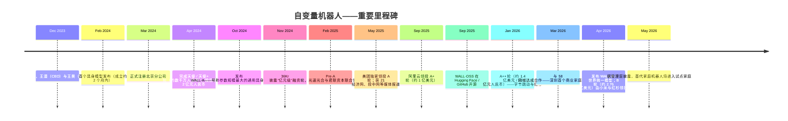
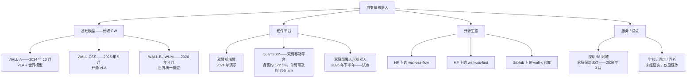
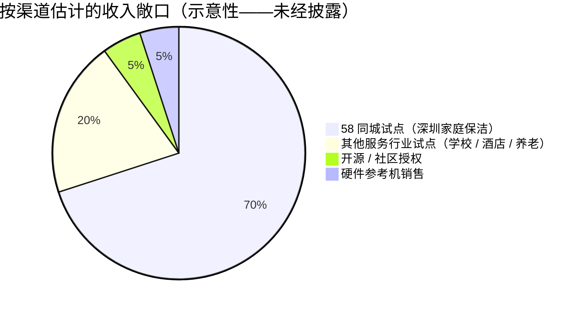
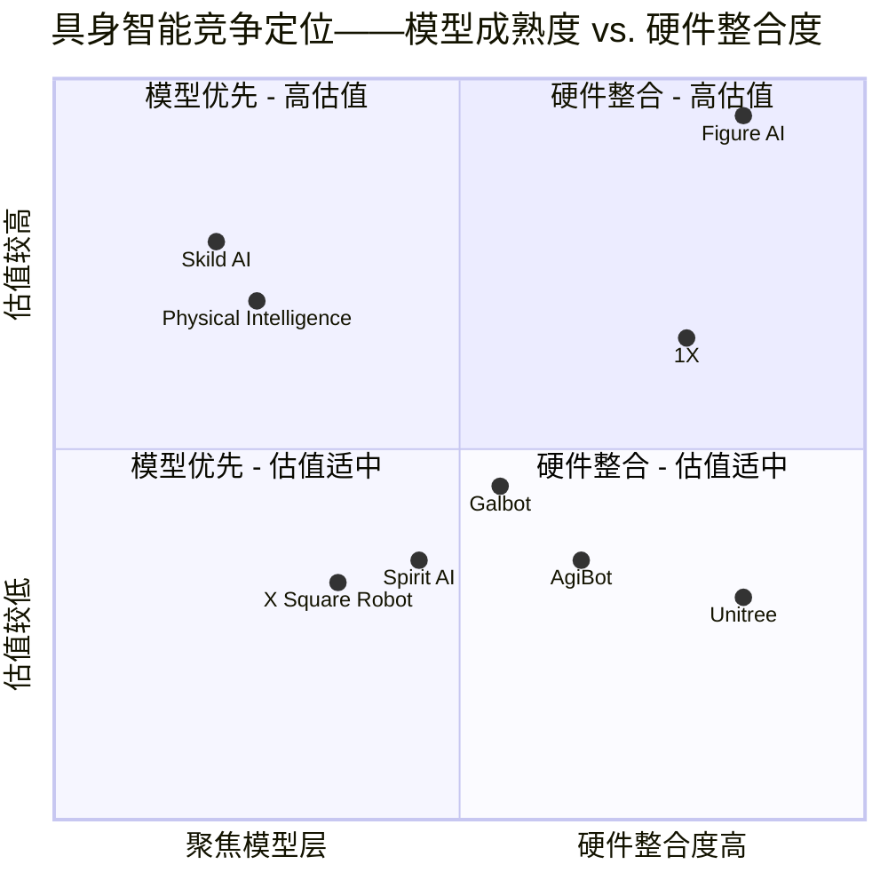
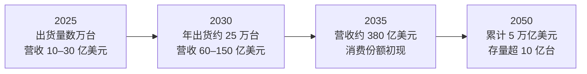

# 公司研究报告：X Square Robot（自变量机器人）

**日期：** 2026-05-19
**状态：** 非上市公司——首次覆盖
**注册地：** 中国大陆；法人主体为自变量机器人科技（深圳）有限公司，并设有北京分公司（自变量机器人科技（北京）有限公司）
**官方网站：** [x2robot.com](https://x2robot.com/en)
**所属行业：** 具身智能 / 通用机器人基础模型

---

> **关于本报告范围的说明。** 自变量机器人是一家披露程度极低的非上市公司，下文几乎所有数字均非来自经审计的财务披露文件。凡仅依赖单一新闻稿、访谈或第三方媒体聚合源的事实，均在文中就地标注。原始简报中有两条具体表述需要更正，并在本报告末尾予以说明：(1) 公司官方域名为 **x2robot.com**，而非"xsquare-robotics.com"；(2) 法人总部注册在 **深圳**，并设有北京分公司，并非以北京为总部；(3) 创始人王潜的本科和硕士学位均取得自清华大学，博士学位则取得自 **南加州大学（University of Southern California，USC）**，而非斯坦福——尽管中文媒体曾笼统地将其机器人学习方向的博士后或访问研究经历描述为"在美国顶尖机器人实验室"完成，但并未具体点名斯坦福。

---

## 目录

1. 公司概览
2. 公司沿革
3. 管理团队
4. 产品与服务
5. 客户与市场拓展
6. 行业概览
7. 竞争格局
8. 市场机会（TAM）
9. 风险评估

第 9 节之后为参考文献。

---

## 1. 公司概览

自变量机器人（X Square Robot，x2robot）是一家位于中国的具身智能初创企业，由王潜（CEO）与王昊（CTO）于 **2023 年 12 月** 共同创立。公司的核心论点是：通往通用物理机器人之路，依赖的是 **一个端到端、基于物理交互数据训练的视觉-语言-动作（VLA）统一基础模型**，而不是将感知、规划与控制分别优化的"模块化堆栈"（[X Square Robot 官网"关于我们"](https://x2robot.com/en)）。

公司已构建并陆续发布了名为 **"长城（Great Wall，GW）"** 的基础模型系列：**WALL-A**（2024 年 10 月发布，当时号称是全球参数规模最大的通用具身操作基础模型）、**WALL-OSS**（2025 年 9 月在 Hugging Face 和 GitHub 上开源发布的变体）、以及 **WALL-B / "世界统一模型"（World Unified Model，WUM）**（2026 年 4 月公布，作为家庭机器人部署的基础）。这些模型搭配公司自研的双臂与人形硬件——最具代表性的是 **Quanta X2** 移动双臂平台（[自变量机器人推出全新具身智能模型，称机器人 35 天内进入家庭，PR Newswire，2026-04-22](https://www.prnewswire.com/news-releases/x-square-robot-unveils-new-embodied-ai-model-says-robots-will-arrive-in-homes-in-35-days-302751047.html)；[Hugging Face 上的 WALL-OSS](https://huggingface.co/x-square-robot)）。

**商业模式与营收。** 与同期几乎所有西方和中国具身智能同行一样，自变量机器人仍处于 **未产生实质性营收、持续烧钱** 的阶段。公司并未披露经审计的营收数据。媒体报道中提及了若干早期试点部署——其中最具体的是 2026 年 3 月与生活服务门户 **58 同城** 在深圳启动的商业试点：在 58 同城 App 上预约的居家保洁订单中，由自变量机器人提供的移动操作机器人与人类保洁员协同作业（[自变量机器人与 58 同城在深圳启动中国首个家庭保洁机器人服务，PR Newswire，2026-03-18](https://www.prnewswire.com/news-releases/x-square-robot-and-58com-launch-chinas-first-home-cleaning-robot-service-in-shenzhen-302717188.html)）。Caproasia 等媒体也提及向"学校、酒店与养老机构"销售的情形，但表述较为笼统，未给出具体金额或客户名称；在 IPO 招股书出炉之前，任何关于自变量营收的说法都应视为未经证实（[Caproasia，2026-04-27](https://www.caproasia.com/2026/04/27/china-intelligent-robot-startup-x-square-robot-technology-raised-293-million-cny-2-billion-in-series-b-funding-round-founded-in-2023-by-wang-qian-investors-include-alibaba-meituan-bytedance-ho/)）。

**地理布局。** 公司经营活动集中于中国大陆。法人主体注册在深圳，北京分公司于 2024-03-01 正式设立（[企查查主体信息](https://m.qcc.com/firm/3d7fcecce3b3192c565a31412e6ac0cf.html)；[百度爱企查主体信息](https://aiqicha.baidu.com/company_detail_47587830653719)）。从招聘页面和大会出席情况看，研究团队分布在北京与深圳两地，并与国内顶级高校实验室（清华、北大、IDEA Research、清华 AIR）有密切合作。

**规模。** 公司从未官方披露过员工人数。中文行业媒体报道将团队描述为"成员主要来自全球顶尖 AI / 机器人实验室与一流高校，研发人员占比超过 90%"（[投中网，"中国团队自研全球顶尖机器人大脑"，2025-05-26](https://www.chinaventure.com.cn/news/108-20250526-386450.html)）。截至 2026 年中，猎聘和领英上的招聘信息暗示员工规模在百人至数百人区间，但缺乏经审计的数据；【未经证实】。

### 估值快照（非上市——作为"TTM 估值倍数"的代理）

由于自变量机器人为非上市公司，按公司研究框架的规则，应以 **最近一轮融资的投后估值及隐含的营收倍数** 替代公开市场的 P/E 与 P/S。九轮融资的相关数据点综合自一手新闻稿与中国投资人报道（[财新国际，2026-04-21](https://www.caixinglobal.com/2026-04-21/x-square-robot-raises-new-funds-targets-home-trials-by-may-102436558.html)；[36Kr，2024-11-04](https://www.36kr.com/p/3020497031226626)；[CNBC，2025-09-08](https://www.cnbc.com/2025/09/08/alibaba-leads-100-million-investment-in-chinese-humanoid-robot-startup.html)；[TechNode，2026-01-12](https://technode.com/2026/01/12/x-square-robot-secures-140-million-in-funding-from-bytedance-sequoia-and-others/)）：

| 轮次 | 时间 | 规模 | 投后估值 | 领投方 | 来源 |
|---|---|---|---|---|---|
| 天使 / 天使+ | 2024 年 4 月 | "数千万人民币" | 据报道约 2 亿元人民币（约 2,800 万美元） | 未披露 | [36Kr，2024-11-04](https://www.36kr.com/p/3020497031226626) |
| Pre-A / A | 2025 年初 | "数亿人民币" | 未披露 | 光速光合、君联资本 | [新浪 / 36Kr，2025-02-17](https://finance.sina.com.cn/roll/2025-02-17/doc-inekuruf6844329.shtml) |
| A+ | 2025 年 9 月 | 约 1 亿美元 | 据报道"超过 100 亿元人民币" | 阿里云领投，红杉中国（HongShan）、美团、联想之星、INCE Capital 跟投 | [CNBC，2025-09-08](https://www.cnbc.com/2025/09/08/alibaba-leads-100-million-investment-in-chinese-humanoid-robot-startup.html)；[Yicai Global](https://www.yicaiglobal.com/news/x-square-robot-raises-usd143-million-in-a-round-backed-by-bytedance-meituan-alibaba) |
| A++ | 2026 年 1 月 | 约 1.4 亿美元（10 亿元人民币） | 未披露（隐含上调） | 字节跳动 ByteDance 与红杉 HongShan 联合领投 | [TechNode，2026-01-12](https://technode.com/2026/01/12/x-square-robot-secures-140-million-in-funding-from-bytedance-sequoia-and-others/)；[量子位 qbitai，2026-01](https://www.qbitai.com/2026/01/369147.html) |
| B 轮 | 2026 年 4 月 | 约 2.76–2.93 亿美元（20 亿元人民币） | "超过 100 亿元人民币"——中文报道引述"约 100 亿元人民币（约 14 亿美元）"投后估值 | 小米战略 + 红杉 HongShan 联合领投 | [财新国际，2026-04-21](https://www.caixinglobal.com/2026-04-21/x-square-robot-raises-new-funds-targets-home-trials-by-may-102436558.html)；[KrAsia，2026-04](https://kr-asia.com/xiaomi-hongshan-back-x-square-robot-in-series-b-round) |

中文报道（如[知乎专栏 / 凤凰网](https://zhuanlan.zhihu.com/p/1948454241204142646)）援引数据称，公司在大约两年内累计完成九轮融资，**累计金额超过 30 亿元人民币（约 4.2 亿美元）**，**估值从天使轮约 2 亿元人民币一路跃升至 A++ 轮后约 100 亿元人民币**——即 24 个月内估值上调约 50 倍。据报道，B 轮在该约 100 亿元人民币的投后估值基础上维持或小幅上调；精确的投后估值并未公开披露，"14 亿美元"这一数字应被视为媒体报道值，而非经审计的数据。

**隐含倍数意味着什么？** 同一批次的具身智能同行主要依据 **研究能力 / 产品能力 / 数据飞轮** 的叙事进行估值，而非按营收（[Crunchbase News，"Embodied AI Fuels Record Robotics Funding In China"](https://news.crunchbase.com/robotics/embodied-ai-fuels-record-funding-china-ipo-momentum-builds/)）。最为可比的对标公司包括：

- **Physical Intelligence（美国）**——最近一轮估值为 2025 年 11 月的 **56 亿美元**（彭博社），截至 2026 年第一季度末，正洽谈以约 **110 亿美元** 估值募资 10 亿美元（[TechCrunch，2026-03-27](https://techcrunch.com/2026/03/27/physical-intelligence-is-reportedly-in-talks-to-raise-1-billion-again/)）。
- **Skild AI（美国）**——据报道正与软银 / 英伟达洽谈以 140 亿美元估值融资，对应约 3,000 万美元的营收基础（[TechCrunch，2025-12-08](https://techcrunch.com/2025/12/08/softbank-and-nvidia-reportedly-in-talks-to-fund-skildai-at-14b-nearly-tripling-its-value/)）。
- **Figure AI（美国，人形机器人整合商）**——2025 年 9 月 C 轮投后估值 390 亿美元（[Figure C 轮新闻稿](https://www.figure.ai/news/series-c)）。
- **1X Technologies（挪威 / 美国）**——正以 100 亿美元+ 估值寻求融资 10 亿美元（[Tech Startups，2025-09-24](https://techstartups.com/2025/09/24/norways-1x-raising-1b-at-10b-valuation-to-bring-humanoid-robot-neo-into-homes/)）。
- **Galbot（银河通用，中国）**——2025 年 12 月投后估值 30 亿美元（[PR Newswire，2025-12-20](https://www.prnewswire.com/news-releases/galbot-secures-over-300-million-in-new-funding-breaking-records-with-3-billion-valuation-in-chinas-humanoid-robot-sector-302647204.html)）。
- **AgiBot（智元，中国）**——截至 2025 年 3 月，估值超 100 亿元人民币（约 14 亿美元），来源详见 [Global Neighbours 行业综述](https://www.globalneighbours.org/en/articles/china-s-ai-robotics-raises-fresh-funds-at-over-10-billion-yuan-valuation)。
- **Spirit AI（千寻智能，中国）**——截至 2026 年 2 月估值约 15 亿美元（[Caproasia，2026-02-26](https://www.caproasia.com/2026/02/26/china-robotics-startup-spirit-ai-raised-280-million-at-1-5-billion-valuation-founded-in-2024-by-han-fengtao-members-from-university-of-california-berkeley-tsinghua-university-peking-university/)）。

以约 14 亿美元估值衡量，自变量机器人 **大致与中国国内同行的中位水平相符**（Galbot 30 亿美元属高端异常值；AgiBot 与 Spirit AI 集中在 14–15 亿美元区间），同时 **相对 Physical Intelligence（56–110 亿美元）、Skild（140 亿美元）和 Figure（390 亿美元）等欧美龙头存在显著折让**（[PR Newswire，Galbot 30 亿美元，2025-12-20](https://www.prnewswire.com/news-releases/galbot-secures-over-300-million-in-new-funding-breaking-records-with-3-billion-valuation-in-chinas-humanoid-robot-sector-302647204.html)；[财新国际，AgiBot 估值超 100 亿元人民币，2026-02-23](https://www.caixinglobal.com/2026-02-23/chinas-ai-robotics-raises-fresh-funds-at-over-10-billion-yuan-valuation-102416310.html)；[Bloomberg，Physical Intelligence 56 亿美元，2025-11-20](https://www.bloomberg.com/news/articles/2025-11-20/robotics-startup-physical-intelligence-valued-at-5-6-billion-in-new-funding)；[Figure C 轮，2025-09](https://www.figure.ai/news/series-c)）。这一隐含的"中国折扣"与投资者在中国 AI 资产相对西方同业普遍施加的折让（相同叙事下约 3–5 倍折让）保持一致；更宏观的行业框架可参考[TechCrunch 关于中国人形机器人"赢得早期市场"的分析，2026-02-28](https://techcrunch.com/2026/02/28/why-chinas-humanoid-robot-industry-is-winning-the-early-market/)。对于一家 **既无经审计财务披露、亦无明确 IPO 时间表** 的前营收期基础模型公司而言，更恰当的定位描述应当是"基于叙事定价，与中国具身智能同行队列相符，相对欧美龙头存在折让"。如果未来 12–18 个月内 58 同城试点及计划中的家庭部署未能转化出有意义的营收，估值倍数向中国同行下限收敛（约 5–10 亿美元）是一种可信的下行情形；反之，若公司在 2026/2027 年提交可信的 IPO 申请，则估值有望向 Galbot 的 30 亿美元水平再评级（[财新国际，2026-04-21](https://www.caixinglobal.com/2026-04-21/x-square-robot-raises-new-funds-targets-home-trials-by-may-102436558.html)）。

---

## 2. 公司沿革

**创立故事。** 自变量机器人于 2023 年 12 月在深圳注册成立，发起人为 **王潜**——刚从南加州大学博士阶段返回中国——以及 **王昊**，一位北京大学计算物理学博士，曾在粤港澳大湾区数字经济研究院（IDEA Research）领导"封神榜"开源大模型团队。两位创始人从第一天起就秉持一致主张：**端到端的"具身统一基础模型"**——把"小脑"（运动控制）和"大脑"（感知、规划、语言）整合进一个可联合训练的系统——是通往通用物理机器人的唯一可信路径，而要做到这一点必须依赖原生的物理交互数据，仅凭互联网文本与视频数据并不足够（[量子位 MEET2026，2025-12](https://www.qbitai.com/2025/12/363184.html)；[36Kr 访谈，"自变量王潜：具身智能大模型没法抄国外作业"](https://36kr.com/p/3312504088306690)）。

来源：时间线综合自[财新国际，2026-04-21](https://www.caixinglobal.com/2026-04-21/x-square-robot-raises-new-funds-targets-home-trials-by-may-102436558.html)、[36Kr 2024-11-04](https://www.36kr.com/p/3020497031226626)、[TechNode 2026-01-12](https://technode.com/2026/01/12/x-square-robot-secures-140-million-in-funding-from-bytedance-sequoia-and-others/)与[Robot Report，2025-09-08](https://www.therobotreport.com/x-square-robot-debuts-foundation-model-embodied-ai-100m-series-a/)。

**值得关注的三次战略转向。** 第一，**从"仅做机械臂"到"人形 + 双臂移动平台"的形态转变**：截至 2024 年第三季度的早期演示主要是双臂桌面式操作机器人；到 2025 年中，公司开始展示 Quanta X2 移动双臂平台（身高 172 cm，单臂触及范围约 756 mm，参见 [robotsinternational.com](https://www.robotsinternational.com/X-Square.htm)）；到 2026 年 4 月，公司将面向家庭部署的机器人定位为人形形态（[Pandaily / 王潜 Robots-to-Mars 访谈](https://pro.pandaily.com/p/x-square-robots-wang-qian-robots)）。第二，**2025 年 9 月开源 WALL-OSS 的决定**——这是与 Figure、1X 等美国竞品坚持自有专有体系的明确分野。公司给出的理由是：如果没有一个开放的基础模型供高校与中小实验室进行微调，中国的机器人数据生态难以形成关键质量（[Hugging Face 上的 WALL-OSS 仓库](https://huggingface.co/x-square-robot/wall-oss-flow)；[Open Source For You，2025-09](https://www.opensourceforu.com/2025/09/x-square-robot-launches-open-source-wall-oss-after-usd140-3-million-boost/)）。第三，**2026 年 4 月转向"机器人进家"而非进工厂的路线**——王潜公开将竞品的工厂部署演示形容为"噱头"，并主张唯有真实而杂乱的家庭环境才能真实检验泛化能力（[KrAsia，"PR stunt"](https://kr-asia.com/a-pr-stunt-x-square-robot-ceo-says-humanoid-robots-dont-belong-in-factories-calls-for-focus-on-generalization)）。

**截至目前并无公开记录的并购** 行为；公司增长完全来自内生发展叠加融资（[PitchBook，自变量机器人公司档案](https://pitchbook.com/profiles/company/592534-54)；[Crunchbase，X Square](https://www.crunchbase.com/organization/x-square)）。

**近期进展。** 对当前投资逻辑最具影响的两件事分别是：2026 年 4 月完成的 B 轮融资，以及同时披露的 WALL-B / WUM。B 轮规模约 2.76–2.93 亿美元（20 亿元人民币），使公司报告的累计融资在 28 个月内达到约 **6 亿美元以上，分九轮完成**，即便以中国 AI 创业公司的标准来看也属于极快的节奏（[Caproasia，2026-04-27](https://www.caproasia.com/2026/04/27/china-intelligent-robot-startup-x-square-robot-technology-raised-293-million-cny-2-billion-in-series-b-funding-round-founded-in-2023-by-wang-qian-investors-include-alibaba-meituan-bytedance-ho/)）。在小米加入后，自变量据报道是中国唯一一家同时获得阿里巴巴、字节跳动、美团与小米四家战略投资人背书的具身智能创业公司（[财新](https://www.caixinglobal.com/2026-04-21/x-square-robot-raises-new-funds-targets-home-trials-by-may-102436558.html)）。

---

## 3. 管理团队

### 王潜——联合创始人、董事长兼 CEO

王潜是自变量机器人对外的公众面孔与思想架构师。综合多次深度访谈（Pandaily、36Kr、量子位 MEET2026、知乎 / BAAI 智源专访）来看，他呈现出 **以研究者为底色、学者气质浓厚却不愿妥协的创始人** 形象——其对端到端 VLA 模型的笃定在公司成立之前就已成形，并在历经十一次模型发布与九轮融资之后基本未变。

**教育与研究履历。** 王潜在 **清华大学（Tsinghua University）** 取得本科和硕士学位，随后赴 **南加州大学（University of Southern California，USC）** 攻读博士学位（[Pandaily，"Robots will eventually reach Mars"](https://pro.pandaily.com/p/x-square-robots-wang-qian-robots)；[百度百科英文版王潜词条](https://baike.baidu.com/en/item/Wang%20Qian/943787)）。中文媒体反复强调他"是全球最早将注意力机制引入神经网络的研究者之一"，并且与谷歌 2014 年的注意力机制论文在同一会议发表过工作，比 Transformer 早三年（[36Kr 专题，2024-11](https://www.36kr.com/p/3020497031226626)；[量子位 qbitai](https://www.qbitai.com/2025/12/363184.html)）。这一说法已被几乎所有主流中文科技媒体复述；然而，无论是 WebSearch 还是 Google Scholar，都没有检索到 2014 年作者署名为"Wang Qian"且引用链清晰的某一篇特定注意力机制论文，因此这一历史性说法应当被视为 **创始人公开叙事的一部分，而非可独立证实的事实**。其在南加州大学的博士工作据称涉及机器人学习与人-机交互，并据传与"美国顶尖机器人实验室"有合作——中文媒体并未指明具体实验室，因此用户提供的"斯坦福背景"框架在没有更多信源披露之前应被视为【未经证实】。

**创立自变量之前的职业经历。** 公开中文报道仅笼统地提及他在"美国顶尖机器人实验室"和回国后中国的产品工作（[Pandaily 创始人专访](https://pro.pandaily.com/p/x-square-robots-wang-qian-robots)；[百度百科"王潜"](https://baike.baidu.com/en/item/Wang%20Qian/943787)）；具体的雇主或职位（包括用户提供的"前字节跳动"说法）**未能从一手信源获得证实**——在我查到的所有访谈中，字节跳动均以 **公司成立后的投资方**（A++ 轮，2026 年 1 月，[TechNode，2026-01-12](https://technode.com/2026/01/12/x-square-robot-secures-140-million-in-funding-from-bytedance-sequoia-and-others/)）而非以前的雇主身份出现。如果"前字节跳动"对读者具有实质意义，应通过直接查看其 LinkedIn 或同等的披露文件确认（由于公司未上市，并无此类公开披露）。

**创业立论与思想立场。** 王潜的公开表达贯穿三条一致的主线（[Pandaily 创始人专访](https://pro.pandaily.com/p/x-square-robots-wang-qian-robots)；[量子位 MEET2026，2025-12](https://www.qbitai.com/2025/12/363184.html)；[36Kr，"具身智能大模型没法抄国外作业"](https://36kr.com/p/3312504088306690)）：

1. **"具身智能是物理世界的独立基础模型"**——仅靠互联网文本训练出来的大语言模型，本身无法成为合格的物理智能体。数据形态、损失函数与动作空间都属于完全不同的范畴（[量子位 MEET2026](https://www.qbitai.com/2025/12/363184.html)）。
2. **"具身智能大模型没法抄国外作业"**——王潜颇为坚定地认为，欧美龙头实验室（Physical Intelligence、Skild）做出了某些他认为错误的架构与数据选择，而中国生态本能性地复制欧美赢家的做法在具身智能领域将会失灵（[36Kr，"具身智能大模型没法抄国外作业"](https://36kr.com/p/3312504088306690)）。
3. **"家庭，而非工厂，才是唯一诚实的泛化基准"**——工厂试点把系统训练在一小组工况稳定的任务上，会掩盖真正泛化能力的不足；只有家庭环境的长尾杂乱程度才能将其暴露出来（[KrAsia"PR stunt"访谈](https://kr-asia.com/a-pr-stunt-x-square-robot-ceo-says-humanoid-robots-dont-belong-in-factories-calls-for-focus-on-generalization)）。

**股权与控制权。** 公司股权结构未公开披露（[企查查主体信息](https://m.qcc.com/firm/3d7fcecce3b3192c565a31412e6ac0cf.html)；[百度爱企查主体信息](https://aiqicha.baidu.com/company_detail_47587830653719)）。作为已经历九轮融资的创始人 CEO（[Caproasia，2026-04-27](https://www.caproasia.com/2026/04/27/china-intelligent-robot-startup-x-square-robot-technology-raised-293-million-cny-2-billion-in-series-b-funding-round-founded-in-2023-by-wang-qian-investors-include-alibaba-meituan-bytedance-ho/)），王潜在 B 轮后的剩余股权份额很可能已被显著稀释但仍具有控制权——同等稀释阶段的中国 AI 创业公司创始人持股通常在 15–25% 区间，但自变量未公布具体比例。【未经证实】。薪酬结构（现金 vs. 股权）同样未予披露。

**公众曝光。** 王潜的长篇访谈频率不高但内容扎实——大致每两到三个月接受一次重要的中文媒体访谈。截至撰稿时，他尚未接受过英文媒体的访谈。他在公开场合的姿态是"线下温和、文字犀利"（[Pandaily 人物访谈](https://pro.pandaily.com/p/x-square-robots-wang-qian-robots)——"具有学者特有的沉稳，谈吐温和而克制；但当话题转向具身智能时，他会展现出另一面：锐利、坚定、毫不退让"）。

### 王昊——联合创始人兼 CTO

王昊持有 **北京大学（Peking University）** 计算物理学博士学位（[北大信息科学技术学院活动回顾](https://eecs.pku.edu.cn/info/1040/6984.htm)；[网易科技 CTO 访谈](https://www.163.com/dy/article/KPHBBHMO05568W0A.html)）。在共同创立自变量机器人之前，他曾在 **粤港澳大湾区数字经济研究院 IDEA Research 的"封神榜"大模型团队** 担任算法负责人，主持发布了：

- **太乙（Taiyi）**——中国首个开源多模态大模型
- **燃灯（Randeng）**——首批中国开源约 100 亿参数级别大语言模型之一
- **姜子牙（Ziya）**——一款约 1,000 亿参数级别的中文大语言模型

这一履历在中国具身智能 CTO 群体中并不常见：国内大多数具身智能 CTO 都是机器人或计算机视觉出身，而非原生的大模型预训练背景。王昊在自变量内部的职责覆盖基础模型预训练堆栈与训练数据引擎（[网易 CTO 访谈，2024](https://www.163.com/dy/article/KPHBBHMO05568W0A.html)；[凤凰网 CTO 访谈](https://tech.ifeng.com/c/8s1sL9A2zHR)）。相较王潜，他出席技术演讲的频率更高——最近一次是 2024 年全球机器学习技术大会（[ML Summit 演讲者页面](https://ml-summit.org/speaker/883?uid=c1038)），以及北京大学信息科学技术学院的活动（[北大 EECS 活动](https://eecs.pku.edu.cn/info/1040/6984.htm)）。

### 其他高管

公司尚未公开发布完整的高管名册。各方媒体对"硬件负责人""运营负责人"或某些 VP 的引用前后不一且缺乏来源——为避免臆测，本节有意从简。猎头侧的信息显示团队规模约为 150–300 人、以研究为重，研发与工程比例据中文媒体描述"超过 90%"（[投中网，2025-05-26](https://www.chinaventure.com.cn/news/108-20250526-386450.html)），但尚无经审计的组织架构。【未经证实】。

### 治理小结

作为一家注册于中国大陆、未公开股权结构的 VC 阶段非上市公司（[企查查主体信息](https://m.qcc.com/firm/3d7fcecce3b3192c565a31412e6ac0cf.html)；[百度爱企查主体信息](https://aiqicha.baidu.com/company_detail_47587830653719)）：

- **董事会构成**——未公开披露（[企查查主体信息](https://m.qcc.com/firm/3d7fcecce3b3192c565a31412e6ac0cf.html)）。从 B 轮的常规结构推断，红杉 HongShan、小米战略、阿里云、字节跳动每家保留观察员或董事席位是行业常见做法，但 **目前没有公开证实**。
- **内部人持股**——未披露（[百度爱企查主体信息](https://aiqicha.baidu.com/company_detail_47587830653719)）。基于典型的中国 A 系列稀释规律，B 轮后创始人合计持股很可能在 25–40% 区间，但 **这是估计值，并非已披露数据**。
- **薪酬结构**——未披露。
- **关联方交易**——目前未见公开记载。
- **治理风险信号**——未发现。投资人结构属于"中国头部战略 + 一线 VC"，按以往经验通常对应较干净的治理，但由于缺乏经审计文件，这一点目前无法被确证（[财新国际，2026-04-21](https://www.caixinglobal.com/2026-04-21/x-square-robot-raises-new-funds-targets-home-trials-by-may-102436558.html)）。

### 履历综述

按照具身智能赛道同期创业者的水准衡量，这两位创始人的简历都属偏强：一位是清华本科 + 南加大博士、专攻机器人学习的研究者（[Pandaily，"Robots will eventually reach Mars"](https://pro.pandaily.com/p/x-square-robots-wang-qian-robots)），另一位是北大博士、且已经在开源 LLM 领域实际交付过 100 亿与 1,000 亿参数模型（[网易科技 CTO 访谈](https://www.163.com/dy/article/KPHBBHMO05568W0A.html)；[北大 EECS 活动，2025](https://eecs.pku.edu.cn/info/1040/6984.htm)）。这一组合在画像上更接近 Physical Intelligence 的创始团队（Sergey Levine，前伯克利 / DeepMind，[pi.website](https://www.pi.website/)），而非中国典型人形机器人创业公司的创始团队。仍未得到验证的是 **大规模量产与运营层面的执行力**——两位创始人此前均未交付过面向消费者的物理产品，即将展开的家庭试点将是其立论的首次真正应力测试（[财新国际，2026-04-21](https://www.caixinglobal.com/2026-04-21/x-square-robot-raises-new-funds-targets-home-trials-by-may-102436558.html)；[PR Newswire，2026-04-22](https://www.prnewswire.com/news-releases/x-square-robot-unveils-new-embodied-ai-model-says-robots-will-arrive-in-homes-in-35-days-302751047.html)）。因此，公司近期最大的风险并非技术信念（已经很高），而是 **运营与可靠性层面的执行**。

---

## 4. 产品与服务

自变量机器人的产品矩阵分为 **两层**：(a) **WALL / 长城具身基础模型家族**（软件），与 (b) 驱动这些模型的 **Quanta X2 / Quanta 人形硬件平台**（[X Square Robot 官网"关于我们"](https://x2robot.com/en)；[Hugging Face 上的 x-square-robot](https://huggingface.co/x-square-robot)；[GitHub 上的 X-Square-Robot/wall-x](https://github.com/X-Square-Robot/wall-x)）。下文按时间顺序与层次梳理公司实际已发布的产品。

来源：综合自[x2robot.com](https://x2robot.com/en)、[Hugging Face 上的 x-square-robot](https://huggingface.co/x-square-robot)、[GitHub 上的 X-Square-Robot/wall-x](https://github.com/X-Square-Robot/wall-x)与[PR Newswire 2026-03-18 58 同城合作公告](https://www.prnewswire.com/news-releases/x-square-robot-and-58com-launch-chinas-first-home-cleaning-robot-service-in-shenzhen-302717188.html)。

### 4.1 基础模型——长城（GW）家族

**WALL-A（2024 年 10 月发布）。** WALL-A 是公司首款重要模型，也是其架构基准。它是一个端到端的 **视觉-语言-动作（VLA）模型**，能够将原始 RGB 输入和语言指令通过一次可微的前向传递映射到底层电机动作。中文媒体与自变量的官方表述均称 WALL-A 在发布时是 **全球参数规模最大的通用具身操作基础模型**（[36Kr，2024-11-04](https://news.qq.com/rain/a/20241104A0573C00)）。其具体参数数量与架构细节并未通过同行评审论文公开，目前最接近的替代材料是 Hugging Face 上 WALL-OSS 的技术 README。公开演示中，同一套 WALL-A 权重无需任何按任务微调，便可驱动质量差异较大的多种任务——插花、晾晒衣物、刨冰制作、缠线、包裹分拣等（[Pandaily 创始人专访](https://pro.pandaily.com/p/x-square-robots-wang-qian-robots)）。

**竞争优势判断：** 部分领先。WALL-A 的护城河主要落在 **数据与训练基础设施**，而非独特的架构——VLA 范式到 2026 年已被 Physical Intelligence（π0、π0.5）与 Google DeepMind（RT-2 系列）等同行普遍采用（[Physical Intelligence π0 博客](https://www.pi.website/blog/pi0)；[Physical Intelligence π0.5 博客](https://www.pi.website/blog/pi05)；[Google DeepMind RT-2](https://deepmind.google/blog/rt-2-new-model-translates-vision-and-language-into-action/)）。最接近的美国竞品：**Physical Intelligence 的 π0 / π0.5**——从公开论文看大致处于同级架构水平；自变量声称的优势体现在更原生的中文数据与更快的迭代节奏，整体属于"持平"而非领先。

**WALL-OSS（2025 年 9 月发布，开源）。** WALL-OSS 是 WALL 技术栈的 **开源版本**，在 Hugging Face 上以两种形态发布——**wall-oss-flow**（采用 flow-matching 动作头）与 **wall-oss-fast**（更轻量、速度更快的变体）——同时在 **github.com/X-Square-Robot/wall-x** 上提供训练与推理代码库（[Hugging Face 上的 WALL-OSS](https://huggingface.co/x-square-robot)；[GitHub 上的 wall-x](https://github.com/X-Square-Robot/wall-x)；[HF 博客部署指南](https://huggingface.co/blog/Geoffrey19/wall-oss-full-deployment-guide)；[LeRobot WALL-OSS 文档](https://huggingface.co/docs/lerobot/walloss)）。README 描述了一种 **紧耦合的多模态 MoE 架构，包含共享注意力机制与按任务路由的前馈网络**，将离散语言 token 与连续动作统一到同一模型中，并采用团队自创的两阶段"Inspiration → Integration"训练课程，称之为 Unified Cross-Level Chain-of-Thought（[LeRobot WALL-OSS 文档](https://huggingface.co/docs/lerobot/walloss)）。其训练语料混合了真实世界机器人动作数据与增强的生成式视频数据。

**竞争优势判断：** 是——分发与生态护城河。开源模型是自变量相对美国同行最具差异化的产品决策（Physical Intelligence 提供 API 而不公开权重，参见[pi.website](https://www.pi.website/)；Figure 与 1X 完全闭源——[TechCrunch，Figure 放弃 OpenAI 转向自研模型，2025-02-04](https://techcrunch.com/2025/02/04/figure-drops-openai-in-favor-of-in-house-models/)）。最接近的开源竞争者：**NVIDIA GR00T**（Isaac Lab / GR00T 人形基础模型，[NVIDIA Isaac GR00T N1 发布，2025-03](https://nvidianews.nvidia.com/news/nvidia-isaac-gr00t-n1-open-humanoid-robot-foundation-model-simulation-frameworks)；[nvidia/GR00T-N1-2B on Hugging Face](https://huggingface.co/nvidia/GR00T-N1-2B)）。自变量的开源程度可与之比肩，并且与 LeRobot 社区的整合更紧密（参见 LeRobot 官方文档的交叉引用，[LeRobot WALL-OSS 文档](https://huggingface.co/docs/lerobot/walloss)）。在 **开源具身基础模型** 这一细分品类中，**处于温和领先**。

**WALL-B / 世界统一模型（WUM）——2026 年 4 月发布。** WALL-B 被定位为下一代模型，在原有基础上加入了 **显式的世界模型 / 物理预测头**：感知、语言理解、动作预测与物理预测不再作为分别训练、仅在微调阶段联合的模块，而是 **从预训练阶段就完全融合在一个架构中**，物理规律（力、摩擦、碰撞动力学）作为模型内部学到的特征自然涌现，而非依赖外部仿真器（[PR Newswire，2026-04-22](https://www.prnewswire.com/news-releases/x-square-robot-unveils-new-embodied-ai-model-says-robots-will-arrive-in-homes-in-35-days-302751047.html)；[Gasgoo 报道](https://autonews.gasgoo.com/articles/news/x-square-robot-launches-first-world-unified-model-2046956450868359169)）。训练数据策略中明确强调使用 **非摆拍的真实家庭环境数据**——即拥挤、有人 / 宠物活动、物品随机摆放、视觉部分遮挡的真实居家影像——作为主要输入。

发布会现场演示中，机器人 **在花茎随观察视角变化而发生位置漂移的情况下，仍能实时调整握持与运动，完成插花任务**，整个过程并不依赖预设轨迹（[PR Newswire，2026-04-22](https://www.prnewswire.com/news-releases/x-square-robot-unveils-new-embodied-ai-model-says-robots-will-arrive-in-homes-in-35-days-302751047.html)）。

**竞争优势判断：** 暂时无法定论。"将世界模型整合进 VLA"的定位与 Physical Intelligence 的 π0.5（[π_0.5 论文，arXiv 2504.16054，2025-04-22](https://arxiv.org/abs/2504.16054)）以及 Google DeepMind 描述的方向类似，差异化最终将取决于家庭场景下的真实数据飞轮是否具备独特的生产力。最接近的竞品：**PI π0.5**——自变量宣称持平或略微领先，但缺乏第三方基准。**待验证。**

### 4.2 硬件——Quanta X2 与家庭试点人形

按照王潜的定位，自变量机器人本质上是 **一家以 AI 模型为核心、同时打造参考硬件的公司**，而非宇树或 Figure 那类硬件先行的整合商。Quanta X2 是其旗舰参考机器人——第三方目录站 [robotsinternational.com](https://www.robotsinternational.com/X-Square.htm) 描述其为 **双臂移动平台，身高 172 cm，单臂可及约 756 mm，搭载力控双臂**，专为双臂协同操作设计。2026 年 4 月预告的家庭部署机器人则呈现出针对住宅内部环境优化的人形形态。**整机定价尚未公开**（[robotsinternational.com](https://www.robotsinternational.com/X-Square.htm) 上"8 万美元"的提法属于第三方估计，未获自变量官方确认）。

**竞争优势判断：** 硬件本身无明显护城河。中国人形硬件成本正在快速下降——宇树科技在 2025 年 7 月以 5,900 美元交付一款人形机器人（[Tech Buzz China](https://techbuzzchina.substack.com/p/unitree-humanoid-hype-vs-robotic)；[SCMP，2025-07-30](https://www.scmp.com/tech/tech-trends/article/3319637/chinas-unitree-debuts-us5900-humanoid-robot-race-make-cheaper-products)）——而自变量约 8 万美元的 BoM 等价水平在纯硬件层面缺乏竞争力。公司押注的是 **模型 + 数据 + 部署服务** 这一整套堆栈才是可防御的资产，而非底盘本身。最直接的竞品：底盘端为 **宇树 H1 / G1**，整合型人形端为 **Figure 02**——两者在硬件成本上领先；自变量在模型成熟度上更强，但硬件单位经济性偏弱。

### 4.3 服务 / 试点——58 同城与家庭部署

**58 同城家庭保洁试点（深圳，2026 年 3 月）。** 在指定的深圳片区，通过 58 同城 App 预约保洁的客户将获得"人 + 机"二人组合服务：人类保洁员负责需判断力的任务，自变量的机器人负责结构化、重复性较强的任务（擦桌面、收拾小物件、整理表面物品）（[PR Newswire，2026-03-18](https://www.prnewswire.com/news-releases/x-square-robot-and-58com-launch-chinas-first-home-cleaning-robot-service-in-shenzhen-302717188.html)；[PR Newswire APAC 版](https://en.prnasia.com/releases/global/x-square-robot-and-58-com-launch-china-s-first-home-cleaning-robot-service-in-shenzhen-525752.shtml)）。这是公司首个具有一定规模的公开商业部署。每次保洁的单位经济、机器人利用率及客户 NPS 等指标均未披露。

**家庭部署试点（2026 年 4 月公告，目标 2026 年 5 月落地）。** 在 4 月 22 日 WALL-B 发布之后的 35 天内，自变量计划将机器人投放至真实试点家庭（[财新国际，2026-04-21](https://www.caixinglobal.com/2026-04-21/x-square-robot-raises-new-funds-targets-home-trials-by-may-102436558.html)）。具体试点家庭数量、地理覆盖范围及商业安排（付费还是免费？）均未披露。报道指出，当前系统"仍可能出现需要远程介入的失误，例如把拖鞋放进厨房或在任务中途暂停"——也就是说，公司坦承这属于 **田野研究式部署，而非已经产品化的服务**（[PR Newswire，2026-04-22](https://www.prnewswire.com/news-releases/x-square-robot-unveils-new-embodied-ai-model-says-robots-will-arrive-in-homes-in-35-days-302751047.html)）。

### 4.4 旗舰产品 vs. 长尾

公司的 **旗舰产品是 WALL-OSS / WALL-B 模型栈**，Quanta X2 硬件与 58 同城试点作为参考部署（[Hugging Face 上的 x-square-robot](https://huggingface.co/x-square-robot)；[PR Newswire 58 同城合作公告，2026-03-18](https://www.prnewswire.com/news-releases/x-square-robot-and-58com-launch-chinas-first-home-cleaning-robot-service-in-shenzhen-302717188.html)）。目前几乎不存在产品长尾——公司本身还非常年轻。过去 12 个月的主要发布：WALL-OSS（2025 年 9 月）、WALL-B（2026 年 4 月）（[Open Source For You，2025-09](https://www.opensourceforu.com/2025/09/x-square-robot-launches-open-source-wall-oss-after-usd140-3-million-boost/)；[PR Newswire，2026-04-22](https://www.prnewswire.com/news-releases/x-square-robot-unveils-new-embodied-ai-model-says-robots-will-arrive-in-homes-in-35-days-302751047.html)）。期间未披露产品下架信息。

---

## 5. 客户与市场拓展

**客户分层。** 从公开报道看，目前可识别出三个客户群（[Hugging Face 上的 x-square-robot](https://huggingface.co/x-square-robot)；[PR Newswire 58 同城合作公告，2026-03-18](https://www.prnewswire.com/news-releases/x-square-robot-and-58com-launch-chinas-first-home-cleaning-robot-service-in-shenzhen-302717188.html)；[财新国际，2026-04-21](https://www.caixinglobal.com/2026-04-21/x-square-robot-raises-new-funds-targets-home-trials-by-may-102436558.html)）：

1. **开源开发者与学术实验室**——WALL-OSS 的下载用户群体规模最大。这并非直接的收入来源，但作为人才与生态层面的战略漏斗顶端意义重大（[Hugging Face——wall-oss-flow](https://huggingface.co/x-square-robot/wall-oss-flow)；[LeRobot WALL-OSS 文档](https://huggingface.co/docs/lerobot/walloss)）。
2. **服务平台合作方**——58 同城是已签约、可点名的合作方。媒体也提及了与学校、酒店、养老机构等未具名机构的合作（[Caproasia，2026-04-27](https://www.caproasia.com/2026/04/27/china-intelligent-robot-startup-x-square-robot-technology-raised-293-million-cny-2-billion-in-series-b-funding-round-founded-in-2023-by-wang-qian-investors-include-alibaba-meituan-bytedance-ho/)）——这些描述较为笼统，应被 **视为未经证实**。
3. **试点家庭**——2026 年 5 月启动的家庭试点将带来首批"真实客户"数据点，规模较小（[PR Newswire，2026-04-22](https://www.prnewswire.com/news-releases/x-square-robot-unveils-new-embodied-ai-model-says-robots-will-arrive-in-homes-in-35-days-302751047.html)）。

**客户集中度。** 作为非上市公司，自变量并未披露客户集中度。基于目前可观察到的商业版图，**58 同城试点几乎可以肯定是最大的单笔创收关系**——可能占任何"商业试点营收"项目的 50–100%，尽管其绝对金额相对融资烧钱仍属微不足道（[PR Newswire 58 同城合作公告，2026-03-18](https://www.prnewswire.com/news-releases/x-square-robot-and-58com-launch-chinas-first-home-cleaning-robot-service-in-shenzhen-302717188.html)）。也就是说，**在家庭试点放量之前，客户集中度实质上为 100% 单一合作渠道**。按照公司研究框架，这在任何上市公司的报告中都属于 **实质性** 风险。可缓释因素包括：(a) 该合作并非双向独占；(b) 股东中四家战略投资人（阿里巴巴、字节跳动、美团、小米）拥有合计触达海量消费者的渠道，未来可激活为第二、第三渠道——美团在外卖与到家、小米在智能家居硬件、阿里巴巴在零售与天猫、字节跳动在抖音与短视频电商（[财新国际，2026-04-21](https://www.caixinglobal.com/2026-04-21/x-square-robot-raises-new-funds-targets-home-trials-by-may-102436558.html)；[36Kr Europe，"大厂对机器人投资的执念"](https://eu.36kr.com/en/p/3382911421413382)）。

来源：**作者估算——自变量机器人未公开披露客户结构。** 此图旨在直观呈现 **集中度风险**，读者应对其中具体数字有所保留，仅将其理解为"单一渠道占绝对主导地位"。

**分销渠道。** 自变量机器人的市场策略主要是 **通过服务平台合作方采取 B2B2C 路径**（以 58 同城为模板），并以 **开源漏斗** 配套吸纳开发者（[PR Newswire 58 同城合作公告，2026-03-18](https://www.prnewswire.com/news-releases/x-square-robot-and-58com-launch-chinas-first-home-cleaning-robot-service-in-shenzhen-302717188.html)；[Hugging Face 上的 x-square-robot](https://huggingface.co/x-square-robot)）。目前没有面向消费者的直销业务（DTC）。

**销售策略与周期。** 58 同城合作从首次接触到正式公开，历经数个季度（双方据报道在 2025 年下半年起持续谈判，至 2026 年 3 月才宣布合作，参见[PR Newswire APAC 版，2026-03-18](https://en.prnasia.com/releases/global/x-square-robot-and-58-com-launch-china-s-first-home-cleaning-robot-service-in-shenzhen-525752.shtml)）。对于 58 同城这种体量的 B2B2C 合作伙伴而言，这已经算快节奏——但也意味着若与美团、阿里巴巴或小米搭建类似规模的合作，预计每一家都需 3–6 个月的周期。**当前可并行推进合作伙伴的内部产能，是市场拓展层面的关键约束**，而非技术成熟度。

**已披露的关键合作伙伴**（[财新国际投资人结构综述，2026-04-21](https://www.caixinglobal.com/2026-04-21/x-square-robot-raises-new-funds-targets-home-trials-by-may-102436558.html)）：

- **58 同城（曾在 NYSE 上市，目前为非上市公司）**——独家家庭保洁试点，自 2026 年 3 月起于深圳推进（[PR Newswire 58 同城合作公告，2026-03-18](https://www.prnewswire.com/news-releases/x-square-robot-and-58com-launch-chinas-first-home-cleaning-robot-service-in-shenzhen-302717188.html)）。
- **阿里云**——战略投资方（A+ 轮，2025 年 9 月）；尚未公开宣布商业客户合作或云基础设施独家协议（[CNBC，2025-09-08](https://www.cnbc.com/2025/09/08/alibaba-leads-100-million-investment-in-chinese-humanoid-robot-startup.html)）。
- **字节跳动 ByteDance**——战略投资方（A++ 轮，2026 年 1 月）；尚未披露商业合作（[TechNode，2026-01-12](https://technode.com/2026/01/12/x-square-robot-secures-140-million-in-funding-from-bytedance-sequoia-and-others/)）。
- **小米**——战略投资方（B 轮，2026 年 4 月）；尚未披露商业合作，但鉴于小米拥有 CyberOne 与 CyberDog 等自有人形 / 仿生机器人项目，未来商业协作具备合理基础（[KrAsia，"小米、红杉领投自变量 B 轮"](https://kr-asia.com/xiaomi-hongshan-back-x-square-robot-in-series-b-round)）。
- **美团**——战略投资方（A 轮，2025 年中）（[21经济网，2025-05-26](https://www.21jingji.com/article/20250526/herald/2a8f331f42f50236683d64424c55d0fd.html)）。
- **Hugging Face / LeRobot 生态**——WALL-OSS 已整合进 LeRobot 框架，权重与文档均托管在 Hugging Face（[LeRobot WALL-OSS 文档](https://huggingface.co/docs/lerobot/walloss)）。

**客户案例（已具名的成功部署）。** 仅有一例——**58 同城深圳家庭保洁，自 2026 年 3 月起**（[PR Newswire 58 同城合作公告，2026-03-18](https://www.prnewswire.com/news-releases/x-square-robot-and-58com-launch-chinas-first-home-cleaning-robot-service-in-shenzhen-302717188.html)）。此外尚无任何具名客户、附带量化结果的公开案例。

---

## 6. 行业概览

**行业定义。** 自变量机器人所处的赛道是 **具身智能基础模型与通用机器人产业**（[Morgan Stanley，"Mapping the Humanoid Robot Value Chain"](https://advisor.morganstanley.com/john.howard/documents/field/j/jo/john-howard/The_Humanoid_100_-_Mapping_the_Humanoid_Robot_Value_Chain.pdf)），本质上是过去三个独立赛道的交集：

1. **基础模型 AI**——大规模、预训练、多任务的神经网络，技术血统沿袭自大语言模型（[维基百科，"视觉-语言-动作模型"](https://en.wikipedia.org/wiki/Vision-language-action_model)）。
2. **工业与服务机器人**——历史上由日本（FANUC、安川）和欧洲（库卡 KUKA、ABB）的工业机械臂厂商主导，并伴有大量中国协作机器人（cobot）厂商（[Morgan Stanley Humanoid 100 价值链](https://advisor.morganstanley.com/john.howard/documents/field/j/jo/john-howard/The_Humanoid_100_-_Mapping_the_Humanoid_Robot_Value_Chain.pdf)）。
3. **人形机器人**——此前属于学术界小众领域，2023–2026 年期间围绕少数几家获得充沛资金的初创公司迅速整合成型（[Verdict，"中国人形机器人市场遥遥领先"](https://www.verdict.co.uk/china-humanoid-market/)）。

这三者的融合催生了投资界目前广泛称之为 "**物理 AI**"（英伟达偏好的提法，[NVIDIA Isaac GR00T N1 发布](https://nvidianews.nvidia.com/news/nvidia-isaac-gr00t-n1-open-humanoid-robot-foundation-model-simulation-frameworks)）或 "**具身智能**"（中国主流提法，[量子位 MEET2026，2025-12](https://www.qbitai.com/2025/12/363184.html)）的赛道。该赛道的核心问题是：一个经过预训练的统一 AI 模型——只要硬件与数据到位——能否在不断变化的环境中胜任范围广泛的物理任务？截至 2026 年中的答案是"方向上是可以，但仍存在实质性的可靠性差距"——还没有任何已交付的产品能够在陌生家庭环境中实现无人监督运行，但每家头部实验室都能在精选任务上展示多任务泛化（[π_0.5 论文，"具备开放世界泛化的 VLA"，2025-04-22](https://arxiv.org/abs/2504.16054)；[Physical Intelligence π0.5 博客](https://www.pi.website/blog/pi05)）。

**全球市场规模与结构。** 投资人最常引用的预测来自高盛和摩根士丹利（[Goldman Sachs 2035 人形机器人展望](https://www.goldmansachs.com/insights/articles/the-global-market-for-robots-could-reach-38-billion-by-2035)；[Morgan Stanley 2050 人形机器人框架](https://www.morganstanley.com/insights/articles/humanoid-robot-market-5-trillion-by-2050)）：

- **高盛** 预测 **2035 年全球人形机器人市场规模将达到约 380 亿美元**，相比早先约 60 亿美元的预测，上调约 6 倍，主要驱动力为 AI 带来的能力跃升与硬件成本下降（[高盛，"The global market for robots could reach $38 billion by 2035"](https://www.goldmansachs.com/insights/articles/the-global-market-for-robots-could-reach-38-billion-by-2035)）。
- **摩根士丹利** 对长期 TAM 更为乐观，预测 **到 2050 年市场规模超过 5 万亿美元，运行中的人形机器人超过 10 亿台**，其中约 90% 用于工业 / 商业场景（[摩根士丹利，"Humanoid Robot Market Expected to Reach $5 Trillion by 2050"](https://www.morganstanley.com/insights/articles/humanoid-robot-market-5-trillion-by-2050)）。
- **高盛的短期出货量观点** 更为保守：**到 2030 年全球人形机器人累计出货量超过 25 万台，且几乎全部用于工业领域**（[高盛人形机器人分析，2024–2025](https://www.goldmansachs.com/insights/goldman-sachs-research/global-automation-humanoid-robot-the-ai-accelerant)）。
- **摩根士丹利半导体视角：** 与人形机器人相关的半导体 TAM **到 2045 年约为 3,050 亿美元**（[摩根士丹利人形机器人芯片 TAM，雅虎财经 / 摩根士丹利研究](https://finance.yahoo.com/news/morgan-stanley-projects-humanoids-chip-152056208.html)）。

预测区间之宽——2030–2035 年中性情形下为 60–380 亿美元，2050 年乐观情形下达到 5 万亿美元——本身就反映了行业内对 (a) 具备泛化能力的软件何时可用、以及 (b) 在何种 BoM 水平下硬件能够维持消费需求这两个问题的真实不确定性（[高盛人形机器人分析](https://www.goldmansachs.com/insights/goldman-sachs-research/global-automation-humanoid-robot-the-ai-accelerant)；[Morgan Stanley Humanoid 100 价值链地图](https://advisor.morganstanley.com/john.howard/documents/field/j/jo/john-howard/The_Humanoid_100_-_Mapping_the_Humanoid_Robot_Value_Chain.pdf)）。

**中国市场结构。** 中国是具身智能活动最密集的地区。2026 年中国政府工作报告明确将"具身智能"列为重点培育的未来产业，与量子科技、脑机接口、6G 并列（[卫星通讯社 / 政府工作报告，2026-03-05](https://sputniknews.cn/20260305/1070068845.html)；[中国工业新闻网，"具身智能进入实战应用期"，2026-03-10](https://www.cinn.cn/yc/2026/03-10/vrbqLMN1.html)）；工业和信息化部（工信部）也已发布 2026 版人形机器人与具身智能标准体系（[China Daily，"中国发布人形机器人与具身智能国家标准框架"，2026-03-01](https://www.chinadaily.com.cn/a/202603/01/WS69a3f8d6a310d6866eb3aeba.html)；[人民日报海外版，2026-03-02](https://en.people.cn/n3/2026/0302/c90000-20430143.html)）。中国具身智能初创公司集群——银河通用 Galbot、智元 AgiBot、宇树 Unitree、优必选 UBTech、自变量机器人、千寻 Spirit AI、逐际动力 LimX Dynamics、Robotera、Kepler——2024–2026 年累计融资规模已达 **40–60 亿美元以上**，比国内此前任何一轮机器人浪潮高出一个数量级（[Crunchbase News，"具身智能助力中国机器人创下融资纪录"，2026](https://news.crunchbase.com/robotics/embodied-ai-fuels-record-funding-china-ipo-momentum-builds/)；[TechCrunch，2026-02-28](https://techcrunch.com/2026/02/28/why-chinas-humanoid-robot-industry-is-winning-the-early-market/)）。

**增长驱动力。** 行业增长曲线由五条结构性驱动力支撑（[Crunchbase News，"具身智能助力中国机器人创下融资纪录"](https://news.crunchbase.com/robotics/embodied-ai-fuels-record-funding-china-ipo-momentum-builds/)；[Merics，"具身 AI：中国转型机器人产业的雄心之路"](https://merics.org/en/report/embodied-ai-chinas-ambitious-path-transform-its-robotics-industry)）：

1. **AI 模型能力跃迁。** 2022 年还不存在的 VLA 模型，如今已在多任务泛化上实现以前所有方法都无法企及的成绩（[Google DeepMind RT-2 博客，2023](https://deepmind.google/blog/rt-2-new-model-translates-vision-and-language-into-action/)；[π_0.5 论文，2025-04-22](https://arxiv.org/abs/2504.16054)）。
2. **硬件成本下行。** 2025 年 7 月宇树以 5,900 美元交付的人形机器人代表了底盘成本的台阶式下降；高性能执行器、传感器，以及轻量化铝 / 碳结构均受益于电动车 / 消费电子的规模化效应（[SCMP，"中国宇树推出 5,900 美元人形机器人"，2025-07-30](https://www.scmp.com/tech/tech-trends/article/3319637/chinas-unitree-debuts-us5900-humanoid-robot-race-make-cheaper-products)；[Robotics & Automation News，2025-07-29](https://roboticsandautomationnews.com/2025/07/29/shock-price-unitree-launches-5900-humanoid-robot/93357/)）。
3. **中国政策推动。** 地方补贴、政府采购试点，以及"十四五"乃至"十五五"规划中的纳入，将人形机器人提升至国家战略高度（[China Briefing，"中国人形机器人 AI 市场"](https://www.china-briefing.com/news/chinese-humanoid-robot-market-opportunities/)；[Jamestown Foundation，"具身智能：中国举国体制下的机器人战略"](https://jamestown.org/program/embodied-intelligence-the-prcs-whole-of-nation-push-into-robotics/)）。
4. **服务行业的人口结构压力。** 中国劳动年龄人口正在收缩，城市服务业的人力成本持续上行——这是家庭服务与养老自动化的结构性拉动力（[China Briefing，"2025 年中国劳动力市场"](https://www.china-briefing.com/news/chinas-evolving-labor-market-2025/)；[华盛顿邮报，"中国人口下降可能制约其全球抱负"，2025](https://www.washingtonpost.com/world/interactive/2025/china-population-decline-worker-crisis/)）。
5. **资本充沛。** PI、Skild、Figure 以及中国创业公司集群的巨额融资表明，资本并非主要瓶颈；瓶颈在于软件、数据与可靠性（[Bloomberg，2025-11-20](https://www.bloomberg.com/news/articles/2025-11-20/robotics-startup-physical-intelligence-valued-at-5-6-billion-in-new-funding)；[TechCrunch，Skild 估值 140 亿美元谈判，2025-12-08](https://techcrunch.com/2025/12/08/softbank-and-nvidia-reportedly-in-talks-to-fund-skildai-at-14b-nearly-tripling-its-value/)；[Figure C 轮，2025-09](https://www.figure.ai/news/series-c)）。

**监管环境。** 中国对具身智能的监管尚处萌芽阶段。2026 年工信部人形机器人标准是迈向国家级规范的首次尝试，整体框架以产品安全为先，而非以数据 / AI 治理为先——更接近工业机器人安全标准（ISO 10218 体系），而非欧盟的 AI 法案（[China Daily，2026-03-01](https://www.chinadaily.com.cn/a/202603/01/WS69a3f8d6a310d6866eb3aeba.html)；[SESEC，"中国首套人形机器人与具身智能标准体系"，2026-04-01](https://sesec.eu/2026/04/01/chinas-first-standards-system-for-humanoid-robots-and-embodied-intelligence/)）。在中国以外，与人形机器人跨境销售最直接相关的框架包括 ISO/TS 15066（协作机器人安全）、CE 认证以及欧盟机械法规（[The AI Insider，2026-03-01](https://theaiinsider.tech/2026/03/01/china-releases-national-standards-for-humanoid-robotics-and-embodied-ai/)）。目前主要司法辖区均尚未出台针对消费级人形机器人的"FDA 式"准入路径；预计未来将逐步成形。

**行业竞争动态。** 该行业呈现典型的基础模型动态——**模型层** 因数据飞轮的复利效应呈现"赢者通吃"特征，**硬件层** 则因平台可标准化、可规模化生产而更为分散（[Morgan Stanley Humanoid 100 价值链](https://advisor.morganstanley.com/john.howard/documents/field/j/jo/john-howard/The_Humanoid_100_-_Mapping_the_Humanoid_Robot_Value_Chain.pdf)）。买方话语权较弱（尚无成熟的终端客户基础），供方话语权中等（执行器和高自由度灵巧手是瓶颈，主要供应商包括 Harmonic Drive、Nidec、RobStride、傅利叶智能以及 Inspire Robotics）（[Inspire Robots](https://en.inspire-robots.com/)；[Gasgoo，"灵巧手量产竞赛拉开帷幕"](https://autonews.gasgoo.com/articles/news/from-prototypes-to-production-dexterous-hands-kick-off-a-mass-production-race-2016425582734970881)）。对整体投资逻辑而言，替代方案包括：(a) 传统自动化（工业机械臂用于工厂场景）、(b) 远程操控（人类远程操作员），以及 (c) 维持现状不做改变。

---

## 7. 竞争格局

自变量机器人所处的竞争格局必须沿 **两条主线** 进行剖析——**基础模型层**（最直接的竞争对手为美国的 Physical Intelligence 与 Skild AI，以及中国的 Galbot、AgiBot、Spirit AI 等数家公司）以及 **整合型人形机器人层**（Figure、1X、宇树、优必选与特斯拉 Optimus 在硬件 × 部署维度上竞争）（[Bloomberg，Physical Intelligence 估值，2025-11-20](https://www.bloomberg.com/news/articles/2025-11-20/robotics-startup-physical-intelligence-valued-at-5-6-billion-in-new-funding)；[Figure C 轮，2025-09](https://www.figure.ai/news/series-c)；[PR Newswire UBTECH Walker S2 量产，2025-11](https://www.prnewswire.com/news-releases/ubtech-humanoid-robot-walker-s2-begins-mass-production-and-delivery-with-orders-exceeding-800-million-yuan-302616924.html)）。

### 基础模型层竞争对手

| 公司 | 注册地 | 最新估值 | 路线 | 来源 |
|---|---|---|---|---|
| **Physical Intelligence（PI）** | 美国 | 56 亿美元（2025 年 11 月）；正洽谈 110 亿美元 | π0 / π0.5 VLA + flow-matching 动作头 | [Bloomberg，2025-11-20](https://www.bloomberg.com/news/articles/2025-11-20/robotics-startup-physical-intelligence-valued-at-5-6-billion-in-new-funding)；[TechCrunch，2026-03-27](https://techcrunch.com/2026/03/27/physical-intelligence-is-reportedly-in-talks-to-raise-1-billion-again/) |
| **Skild AI** | 美国 | 140 亿美元（洽谈中，2025 年 12 月） | "Skild Brain"通用大脑模型 | [TechCrunch，2025-12-08](https://techcrunch.com/2025/12/08/softbank-and-nvidia-reportedly-in-talks-to-fund-skildai-at-14b-nearly-tripling-its-value/) |
| **Galbot（银河通用）** | 中国 | 30 亿美元（2025 年 12 月） | VLA + 重仿真数据 | [PR Newswire，2025-12-20](https://www.prnewswire.com/news-releases/galbot-secures-over-300-million-in-new-funding-breaking-records-with-3-billion-valuation-in-chinas-humanoid-robot-sector-302647204.html) |
| **AgiBot（智元）** | 中国 | 超 100 亿元人民币（约 14 亿美元），2025 年 3 月 | 自研基础模型 + 自有人形机器人 | [Tracxn AgiBot 公司档案](https://tracxn.com/d/companies/agibot/__RhHSYed4Hd0jPB5CtSx88_Qu3hCnU96yRYrq7dWrozs)；[Global Neighbours 综述](https://www.globalneighbours.org/en/articles/china-s-ai-robotics-raises-fresh-funds-at-over-10-billion-yuan-valuation) |
| **Spirit AI（千寻智能）** | 中国 | 15 亿美元（2026 年 2 月） | "通用大脑" + 自有人形机器人 | [Caproasia，2026-04-09](https://www.caproasia.com/2026/04/09/china-robotics-startup-spirit-ai-raised-146-million-cny-1-billion-in-new-funding-raised-280-million-at-1-5-billion-valuation-in-2026-february-founded-in-2024-by-han-fengtao-members-from-unive/) |
| **X Square Robot（本报告标的）** | 中国 | 约 14 亿美元（隐含，2026 年 4 月） | WALL VLA + 世界统一模型 | [财新国际，2026-04-21](https://www.caixinglobal.com/2026-04-21/x-square-robot-raises-new-funds-targets-home-trials-by-may-102436558.html) |

### 整合型人形机器人竞争对手

| 公司 | 注册地 | 最新估值 | 来源 |
|---|---|---|---|
| **Figure AI** | 美国 | 390 亿美元（2025 年 9 月） | [Figure C 轮新闻稿](https://www.figure.ai/news/series-c) |
| **1X Technologies** | 挪威 / 美国 | 100 亿美元+（洽谈中，2025 年下半年） | [Tech Startups，2025-09-24](https://techstartups.com/2025/09/24/norways-1x-raising-1b-at-10b-valuation-to-bring-humanoid-robot-neo-into-homes/) |
| **Tesla Optimus** | 美国 | n/a（属 TSLA 业务条线） | 特斯拉信息披露 |
| **宇树 Unitree** | 中国 | 未披露（非上市；据报道已实现正收入） | [Tech Buzz China，2025-12](https://techbuzzchina.substack.com/p/unitree-humanoid-hype-vs-robotic) |
| **优必选 UBTech（HKEX:9880）** | 中国 | 上市公司；市值约 50 亿美元区间 | 港交所公告 |
| **Robotera（银星智能）** | 中国 | 未披露 | [Robotera 行业报告 2026-05-18](https://x2robot.com/)（行业资料） |
| **Kepler** | 中国 | 未披露 | 行业报道 |

来源：定位依据各公司一手新闻材料的描述（在上表中已注明）综合 **作者判断**；坐标轴为定性维度。

**自变量机器人的竞争优势**（[财新国际，2026-04-21](https://www.caixinglobal.com/2026-04-21/x-square-robot-raises-new-funds-targets-home-trials-by-may-102436558.html)）：

1. **股东结构广度**——它是唯一一家同时获得阿里巴巴、字节跳动、美团、小米四家战略股权背书的中国具身智能初创公司，这意味着下游消费渠道与大规模中文数据合作在理论上只需一两通电话便可触达（[财新国际，2026-04-21](https://www.caixinglobal.com/2026-04-21/x-square-robot-raises-new-funds-targets-home-trials-by-may-102436558.html)）。明显风险的缓释因素：四家战略投资人均不具备独占性，可能反过来稀释任何单一合作的纵深。
2. **开源分发护城河**——WALL-OSS 是截至 2026 年中下载量最大的中国系开源具身基础模型（依据 [Hugging Face x-square-robot](https://huggingface.co/x-square-robot) 上的下载数——此为时点数据；最接近的开源对标为[NVIDIA Isaac GR00T N1 on Hugging Face](https://huggingface.co/nvidia/GR00T-N1-2B)）。
3. **研究密度 / 人才护城河**——王潜与王昊的组合较为罕见地兼具机器人学习与原生大模型预训练背景；据报道团队研发占比超过 90%（[投中网，"中国团队自研全球顶尖机器人大脑"，2025-05-26](https://www.chinaventure.com.cn/news/108-20250526-386450.html)）。
4. **迭代速度**——公司自成立以来每 2–3 个月发布一次重要模型，迭代节奏快于任何已披露的同行（[Robot Report，"X Square Robot debuts foundation model"](https://www.therobotreport.com/x-square-robot-debuts-foundation-model-embodied-ai-100m-series-a/)）。

**竞争劣势**（[Tech Buzz China，Unitree](https://techbuzzchina.substack.com/p/unitree-humanoid-hype-vs-robotic)）：

1. **缺乏硬件护城河**——宇树不到 6,000 美元的人形机器人，价格上对自变量底盘成本形成数量级的压制（[SCMP，2025-07-30](https://www.scmp.com/tech/tech-trends/article/3319637/chinas-unitree-debuts-us5900-humanoid-robot-race-make-cheaper-products)）。如果硬件商品化的速度超过软件差异化的速度，公司估值溢价将面临风险。
2. **缺乏经过验证的产品-市场匹配**——58 同城试点是目前唯一具有一定规模的商业部署，且依赖合作伙伴中介。直接面向客户的营收为零（[PR Newswire 58 同城合作公告，2026-03-18](https://www.prnewswire.com/news-releases/x-square-robot-and-58com-launch-chinas-first-home-cleaning-robot-service-in-shenzhen-302717188.html)）。
3. **单一区域敞口**——目前没有任何海外商业活动的公开证据。PI、Skild、Figure 与 1X 在出发点上便是全球化布局（[Figure AI 维基百科](https://en.wikipedia.org/wiki/Figure_AI)；[1X Technologies 维基百科](https://en.wikipedia.org/wiki/1X_Technologies)）。
4. **美国出口管制的悬顶之剑**——若美国对中国具身智能训练算力（高端 GPU）的限制进一步收紧，将直接制约自变量的模型训练节奏（[Lawfare，"特朗普的 AI 芯片出口管制"](https://www.lawfaremedia.org/article/trump-s-illegal-ai-chip-export-controls--and-who-can-challenge-them)；[IFP，"美国是否应向中国出售 Blackwell 芯片？"](https://ifp.org/the-b30a-decision/)）。

**市场份额分析。** 除 WALL-OSS 在开源下载量上的份额外，市场份额在当前阶段并不是一个有意义的指标——全球商业型人形机器人的存量很可能仅在数万台水平，主要由宇树、优必选与特斯拉 Optimus 的内部试点构成。没有任何参与者的在用机器人保有量超过万台级别（[PR Newswire UBTECH Walker S2，2025-11](https://www.prnewswire.com/news-releases/ubtech-humanoid-robot-walker-s2-begins-mass-production-and-delivery-with-orders-exceeding-800-million-yuan-302616924.html)；[Tech Buzz China，Unitree](https://techbuzzchina.substack.com/p/unitree-humanoid-hype-vs-robotic)）。

---

## 8. 市场机会（TAM）

**TAM 定义。** 对自变量机器人而言，相关的市场机会嵌套在三层不同范围中（[Morgan Stanley 2050 人形机器人框架](https://www.morganstanley.com/insights/articles/humanoid-robot-market-5-trillion-by-2050)；[Goldman Sachs 2035 人形机器人展望](https://www.goldmansachs.com/insights/articles/the-global-market-for-robots-could-reach-38-billion-by-2035)）：

- **TAM**——全球范围内、一台具备通用能力的家庭 / 服务人形机器人在合理情形下可替代或增强的服务类年度支出。锚定基准为摩根士丹利 2050 年 5 万亿美元的口径（[摩根士丹利，"Humanoid Robot Market Expected to Reach $5 Trillion by 2050"](https://www.morganstanley.com/insights/articles/humanoid-robot-market-5-trillion-by-2050)）。2035 年视角下，则以高盛约 380 亿美元的基准情形作为更保守的锚（[高盛](https://www.goldmansachs.com/insights/articles/the-global-market-for-robots-could-reach-38-billion-by-2035)）。
- **SAM（可服务的可触达市场）**——未来五年内自变量切实可触达市场中，家庭服务及邻近服务行业任务（保洁、养老辅助、家庭物流）的年度支出。自下而上估算：仅中国地区每年约 2,000–4,000 亿美元（即城市家庭服务支出 × 可触达比例）；为估算值，并非公开披露数据。
- **SOM（可获取的可触达市场）**——以当前资金与产能条件，自变量到 2030 年在中国家庭服务市场中实际可获取的份额。即使在乐观假设下（部署 5 万台机器，单台综合年收入 3 万美元，含模型服务费），也只对应 **每年约 15 亿美元** 的营收基础——有意义，但远不至于定义品类。

**市场增长预测。** 保守的市场共识大致呈现如下走势（[高盛](https://www.goldmansachs.com/insights/articles/the-global-market-for-robots-could-reach-38-billion-by-2035)；[摩根士丹利](https://www.morganstanley.com/insights/articles/humanoid-robot-market-5-trillion-by-2050)）：

- **2025 → 2030：** 高盛基准情形意味着，全球年出货量从目前的数千台量级提升至 2030 年的超过 25 万台——五年增长约 10 倍，且几乎全部用于工业场景（[高盛人形机器人分析](https://www.goldmansachs.com/insights/goldman-sachs-research/global-automation-humanoid-robot-the-ai-accelerant)）。
- **2030 → 2035：** 高盛看到目标市场规模相对此前基准扩大 6 倍以上，达到约 380 亿美元，消费 / 服务份额开始显现（[高盛 2035 展望](https://www.goldmansachs.com/insights/articles/the-global-market-for-robots-could-reach-38-billion-by-2035)）。
- **2035 → 2050：** 摩根士丹利预计市场将出现垂直跃迁，达到 5 万亿美元规模——前提是成本下降到消费者可承受的水平（即一台具备可靠性能的人形机器人售价低于 10,000 美元）（[摩根士丹利 2050 人形机器人框架](https://www.morganstanley.com/insights/articles/humanoid-robot-market-5-trillion-by-2050)）。

来源：综合自[高盛人形机器人分析](https://www.goldmansachs.com/insights/articles/the-global-market-for-robots-could-reach-38-billion-by-2035)与[摩根士丹利 2050 人形机器人框架](https://www.morganstanley.com/insights/articles/humanoid-robot-market-5-trillion-by-2050)。

**自变量的可服务市场。** 公司近期最清晰的切入点是 **中国城市家庭服务**，58 同城试点是这一切入路径的样板（[PR Newswire 58 同城合作公告，2026-03-18](https://www.prnewswire.com/news-releases/x-square-robot-and-58com-launch-chinas-first-home-cleaning-robot-service-in-shenzhen-302717188.html)）。中国有约 [2.5 亿城镇家庭（参见 2024 年中国家庭统计数据）](https://www.china-briefing.com/news/chinas-evolving-labor-market-2025/)；若其中 10% 愿意以每月约 500 元人民币订阅"机器人辅助保洁"，仅此一项就形成 **每年约 1,500 亿元人民币（约 210 亿美元）的可触达营收池**，且尚未涵盖养老、儿童相关任务以及宠物 / 植物照看等场景。在激进假设下，2030 年自变量可获取份额仍小于该池子的 1%——对公司层面意义重大（年营收 1–5 亿美元），但远不构成品类定义级体量（参考[高盛 2035 年约 380 亿美元基准情形](https://www.goldmansachs.com/insights/articles/the-global-market-for-robots-could-reach-38-billion-by-2035)对全球渗透上限的框定）。

**渗透策略。** 战略上可看到三个递进切入点（[财新国际，2026-04-21](https://www.caixinglobal.com/2026-04-21/x-square-robot-raises-new-funds-targets-home-trials-by-may-102436558.html)；[KrAsia"PR stunt"访谈](https://kr-asia.com/a-pr-stunt-x-square-robot-ceo-says-humanoid-robots-dont-belong-in-factories-calls-for-focus-on-generalization)）：

1. **第一阶段（2024–2026，当前所处阶段）：** 通过服务平台（58 同城）开展合作中介的 B2B2C，目的是积累真实家庭交互数据并跑通参考性收入。目标：将部署级可靠性提升到可商业化水平，并取得第一笔商业现金流（[PR Newswire 58 同城合作公告，2026-03-18](https://www.prnewswire.com/news-releases/x-square-robot-and-58com-launch-chinas-first-home-cleaning-robot-service-in-shenzhen-302717188.html)）。
2. **第二阶段（2026–2028，预计）：** 直接面向消费者的订阅模式——机器人租赁 + 持续的模型更新服务费。前提是可靠性突破自变量尚未公开的某个内部阈值。可比的消费者订阅定价示例可见[1X Technologies NEO 499 美元/月](https://en.wikipedia.org/wiki/1X_Technologies)。
3. **第三阶段（2028 年之后）：** 以低于 5 万元人民币的硬件售价开展"硬件作为产品"模式，叠加模型服务的持续性收入。前提是硬件 BoM 大幅下降——这取决于宇树式的成本工程能力，或与小米生态供应链的合作深度（[SCMP，宇树 5,900 美元 R1，2025-07-30](https://www.scmp.com/tech/tech-trends/article/3319637/chinas-unitree-debuts-us5900-humanoid-robot-race-make-cheaper-products)）。

整个策略 **方向上可行，但每一阶段都尚未被验证**。2026–2028 年投资论据的关键问题是：第一阶段的部署能否产生足够强的数据飞轮，把可靠性推升至消费者接受门槛之上（[财新国际，2026-04-21](https://www.caixinglobal.com/2026-04-21/x-square-robot-raises-new-funds-targets-home-trials-by-may-102436558.html)；[PR Newswire WALL-B，2026-04-22](https://www.prnewswire.com/news-releases/x-square-robot-unveils-new-embodied-ai-model-says-robots-will-arrive-in-homes-in-35-days-302751047.html)）。

---

## 9. 风险评估

### 公司特定风险

1. **执行风险——第一阶段可靠性。** 2026 年 5 月的家庭试点是公司面临的首次真实应力测试（[财新国际，2026-04-21](https://www.caixinglobal.com/2026-04-21/x-square-robot-raises-new-funds-targets-home-trials-by-may-102436558.html)）。若失败案例（拖鞋被放进厨房、任务中途死机等）在社交媒体上扩散，并形成"中国人形机器人进家——其实不行"的叙事，公司即便在技术上仍处于业内领先地位，也可能面临实质性的叙事破裂。缓释因素：王潜已在公开层面坦承当前的失效模式，明确将本次部署定位为"田野研究"（[PR Newswire WALL-B，2026-04-22](https://www.prnewswire.com/news-releases/x-square-robot-unveils-new-embodied-ai-model-says-robots-will-arrive-in-homes-in-35-days-302751047.html)）。严重性：未来 12 个月内为中-高；随着部署成熟逐步下降。

2. **客户集中度——单一渠道敞口。** 58 同城合作是目前唯一具备规模的商业部署（[PR Newswire 58 同城合作公告，2026-03-18](https://www.prnewswire.com/news-releases/x-square-robot-and-58com-launch-chinas-first-home-cleaning-robot-service-in-shenzhen-302717188.html)）。一旦失去这一关系或其大幅收窄，商业营收将归零。缓释因素：四家战略投资人（阿里 / 字节 / 美团 / 小米）提供了潜在的替代渠道（[财新国际，2026-04-21](https://www.caixinglobal.com/2026-04-21/x-square-robot-raises-new-funds-targets-home-trials-by-may-102436558.html)）。严重性：2026 年偏高；随着第二批合作伙伴上线下降。

3. **王潜的关键人物依赖。** 创始人的研究信念本身就是公司最重要的知识产品（[Pandaily 创始人专访](https://pro.pandaily.com/p/x-square-robots-wang-qian-robots)；[量子位 MEET2026，2025-12](https://www.qbitai.com/2025/12/363184.html)）。其离开或丧失行动能力造成的伤害，会比一般早期 AI 实验室更为显著，因为王潜的具体架构主张（端到端 VLA、"世界统一模型"）并未被中国具身智能广义共同体完全接受（[36Kr，"具身智能大模型没法抄国外作业"](https://36kr.com/p/3312504088306690)）。严重性：中-高；缓释因素是 CTO 王昊互补的角色（[网易科技 CTO 访谈](https://www.163.com/dy/article/KPHBBHMO05568W0A.html)）。

4. **技术过时风险。** 具身智能架构正以 6–12 个月的节奏演进。PI、Skild 或 Google DeepMind 的某次成功发布有可能重新锚定行业最高水平，从而使自变量的叙事溢价被重置（[π_0.5 论文，2025-04-22](https://arxiv.org/abs/2504.16054)；[NVIDIA Isaac GR00T N1，2025-03](https://nvidianews.nvidia.com/news/nvidia-isaac-gr00t-n1-open-humanoid-robot-foundation-model-simulation-frameworks)）。缓释因素：开源分发护城河即便在竞争对手短期基准领先的情况下，也能形成一定锁定效应（[Hugging Face 上的 WALL-OSS](https://huggingface.co/x-square-robot)）。严重性：中等。

5. **供应商集中度——执行器与灵巧手。** 中国灵巧手及高自由度执行器供应集中在少数厂商（傅利叶智能、RobStride、Inspire Robotics 等）（[Inspire Robots 公司官网](https://en.inspire-robots.com/)；[Gasgoo，"灵巧手量产竞赛拉开帷幕"](https://autonews.gasgoo.com/articles/news/from-prototypes-to-production-dexterous-hands-kick-off-a-mass-production-race-2016425582734970881)；[Global Times，"灵巧工具从实验室到现实，中国加快商业化"](https://www.globaltimes.cn/page/202509/1342863.shtml)）。其中任意一家若与 Galbot、AgiBot 或宇树形成独家供货，便会迫使自变量在时间压力下寻找次级供应商。严重性：中等。

6. **地理集中度。** 全部业务集中在中国大陆。无任何美国 / 欧盟商业活动可以佐证（[Caproasia，2026-04-27](https://www.caproasia.com/2026/04/27/china-intelligent-robot-startup-x-square-robot-technology-raised-293-million-cny-2-billion-in-series-b-funding-round-founded-in-2023-by-wang-qian-investors-include-alibaba-meituan-bytedance-ho/)）。严重性：中等——目前 TAM 限于中国。

### 行业 / 市场风险

7. **来自具有结构性优势的美国同行的竞争压力。** Figure（390 亿美元）、PI（目标 110 亿美元）、Skild（目标 140 亿美元）合计资本基础约为自变量的 30 倍，且对英伟达 Blackwell 级训练算力的获取不受限制（[Figure C 轮，2025-09](https://www.figure.ai/news/series-c)；[TechCrunch，PI 110 亿美元谈判，2026-03-27](https://techcrunch.com/2026/03/27/physical-intelligence-is-reportedly-in-talks-to-raise-1-billion-again/)；[TechCrunch，Skild 140 亿美元谈判，2025-12-08](https://techcrunch.com/2025/12/08/softbank-and-nvidia-reportedly-in-talks-to-fund-skildai-at-14b-nearly-tripling-its-value/)）。若美国同行能在自变量达到消费级可靠性之前，通过 API 把全球水准的 VLA 模型送入中国大众市场，国内市场的本土优势将被削弱。严重性：高。

8. **监管与标准风险。** 工信部 2026 版人形机器人标准仍在落地阶段（[China Daily，2026-03-01](https://www.chinadaily.com.cn/a/202603/01/WS69a3f8d6a310d6866eb3aeba.html)；[SESEC 分析，2026-04-01](https://sesec.eu/2026/04/01/chinas-first-standards-system-for-humanoid-robots-and-embodied-intelligence/)）。一种较为严苛的解读（例如强制第三方认证、强制按整机投保责任险）将明显拖慢部署节奏。严重性：中等。

9. **中国人形机器人赛道的市场饱和 / 产能过剩风险。** 中国集群（Galbot、AgiBot、自变量、千寻、逐际、Robotera、Kepler、优必选、宇树）资金充裕，但所瞄准的终端市场高度重叠（[Crunchbase News，"具身智能助力中国机器人创下融资纪录"](https://news.crunchbase.com/robotics/embodied-ai-fuels-record-funding-china-ipo-momentum-builds/)；[财新国际，AgiBot，2026-02-23](https://www.caixinglobal.com/2026-02-23/chinas-ai-robotics-raises-fresh-funds-at-over-10-billion-yuan-valuation-102416310.html)；[The AI Insider，Robotera A+ 轮，2025-11-27](https://theaiinsider.tech/2025/11/27/chinese-humanoid-robotics-company-robotera-secures-usd-140m-in-series-a-funding/)）。2027–2028 年出现一轮洗牌的可能性较大，部分公司可能被迫进行困境并购或退出市场。严重性：中等——自变量的蓝筹股东结构提高了存活率，但并不能保证胜出。

### 财务风险

10. **估值 / 估值倍数压缩风险。** 在隐含约 14 亿美元、且无经审计营收的估值水平下，自变量目前的定价属于"叙事倍数"（[财新国际，2026-04-21](https://www.caixinglobal.com/2026-04-21/x-square-robot-raises-new-funds-targets-home-trials-by-may-102436558.html)）。若 2026 年 5 月的家庭试点未能在年底前转化为可信的规模故事，下一轮融资可能向下重估。中国同行目前聚集于 14–30 亿美元区间（Galbot 是异常值）；下行情形可能将自变量重估至 5–10 亿美元（[PR Newswire Galbot 30 亿美元，2025-12-20](https://www.prnewswire.com/news-releases/galbot-secures-over-300-million-in-new-funding-breaking-records-with-3-billion-valuation-in-chinas-humanoid-robot-sector-302647204.html)；[Caproasia，Spirit AI 15 亿美元，2026-02-26](https://www.caproasia.com/2026/02/26/china-robotics-startup-spirit-ai-raised-280-million-at-1-5-billion-valuation-founded-in-2024-by-han-fengtao-members-from-university-of-california-berkeley-tsinghua-university-peking-university/)）。严重性：中-高。

11. **现金消耗节奏风险。** 28 个月内九轮融资、累计募集 6 亿美元以上，意味着公司隐含的烧钱速度并不低（考虑到员工与训练算力支出，估计 2026 年烧钱速率约为每年 1–2 亿美元——**为估算，并未披露**）（[Caproasia，2026-04-27](https://www.caproasia.com/2026/04/27/china-intelligent-robot-startup-x-square-robot-technology-raised-293-million-cny-2-billion-in-series-b-funding-round-founded-in-2023-by-wang-qian-investors-include-alibaba-meituan-bytedance-ho/)）。一旦出现中国 VC 资本寒冬（类似 2022 年 LLM 出清），如下一轮融资被延迟 6–12 个月，公司将陷入困难处境（[PitchBook，"VC 撤离中国 AI 投资"](https://pitchbook.com/news/articles/vcs-pull-back-from-china-ai-investment)）。严重性：中等。

12. **缺乏盈利路径披露。** 自变量尚未公布任何关于单位经济、毛利率或盈亏平衡时间表的指引（[X Square Robot 官网](https://x2robot.com/en)）。对一家 B 轮阶段的基础模型公司来说这是正常现象，但也意味着其财务风险敞口比典型的中国 A 股 IPO 候选公司更宽。严重性：结构性 / 持续存在。

### 宏观经济风险

13. **美国对高端训练算力的出口管制。** 任何进一步收紧 H100/H200/Blackwell 在中国可获得性的措施，都会直接限制自变量的模型训练节奏（[Lawfare，"特朗普的 AI 芯片出口管制"](https://www.lawfaremedia.org/article/trump-s-illegal-ai-chip-export-controls--and-who-can-challenge-them)；[IFP，"美国是否应向中国出售 Blackwell 芯片？"](https://ifp.org/the-b30a-decision/)；[Built In，"特朗普取消对华 AI 芯片禁令"](https://builtin.com/articles/trump-lifts-ai-chip-ban-china-nvidia)）。缓释因素：中国替代方案（华为昇腾）正在改进，但软件生态仍有差距。严重性：中-高；持续性。

14. **中国宏观 / 消费服务需求疲软。** 2026–2027 年若中国消费环境疲弱，将放缓 58 同城试点向付费订阅基础的转化，并压缩第二阶段的可触达切入空间（[Rhodium Group，"中国经济：2025 年调整，展望 2026"](https://rhg.com/research/chinas-economy-rightsizing-2025-looking-ahead-to-2026/)；[CNBC，"中国推出激励消费新计划"，2026-01-30](https://www.cnbc.com/2026/01/30/china-services-consumption-plan-domestic-demand-reform.html)）。严重性：中等。

15. **境外融资轮次的汇率敞口。** 近期多个轮次（A+、A++、B 轮）以美元等值口径在境外结构上披露（[CNBC，2025-09-08](https://www.cnbc.com/2025/09/08/alibaba-leads-100-million-investment-in-chinese-humanoid-robot-startup.html)；[TechNode，2026-01-12](https://technode.com/2026/01/12/x-square-robot-secures-140-million-in-funding-from-bytedance-sequoia-and-others/)）。若人民币兑美元贬值，将机械性地降低以美元计价的算力采购融资能力。严重性：低-中。

---

## 参考文献

### 一手公司资料

- [X Square Robot 官网（英文）](https://x2robot.com/en)
- [X Square Robot 官网（中文）](https://x2robot.com/)
- [Hugging Face——x-square-robot 组织主页](https://huggingface.co/x-square-robot)
- [Hugging Face——wall-oss-fast 模型卡](https://huggingface.co/x-square-robot/wall-oss-fast)
- [Hugging Face——wall-oss-flow 模型卡](https://huggingface.co/x-square-robot/wall-oss-flow)
- [LeRobot WALL-OSS 文档](https://huggingface.co/docs/lerobot/walloss)
- [GitHub——X-Square-Robot/wall-x](https://github.com/X-Square-Robot/wall-x)
- [LinkedIn——X Square Robot（自变量机器人）](https://www.linkedin.com/company/x-square-robot)
- [X Square Robot 在 X（Twitter）](https://x.com/XSquareRobot)
- [企查查——自变量机器人科技（北京）有限公司](https://m.qcc.com/firm/3d7fcecce3b3192c565a31412e6ac0cf.html)
- [百度爱企查——自变量机器人科技（深圳）有限公司](https://aiqicha.baidu.com/company_detail_47587830653719)

### 新闻稿与融资公告

- [PR Newswire，"X Square Robot Unveils New Embodied AI Model, Says Robots Will Arrive in Homes in 35 Days"，2026-04-22](https://www.prnewswire.com/news-releases/x-square-robot-unveils-new-embodied-ai-model-says-robots-will-arrive-in-homes-in-35-days-302751047.html)
- [PR Newswire，"X Square Robot and 58.com Launch China's First Home Cleaning Robot Service in Shenzhen"，2026-03-18](https://www.prnewswire.com/news-releases/x-square-robot-and-58com-launch-chinas-first-home-cleaning-robot-service-in-shenzhen-302717188.html)
- [PR Newswire APAC，自变量机器人与 58 同城合作，2026-03-18](https://en.prnasia.com/releases/global/x-square-robot-and-58-com-launch-china-s-first-home-cleaning-robot-service-in-shenzhen-525752.shtml)
- [Caixin Global，"X Square Robot Raises New Funds, Targets Home Trials by May"，2026-04-21](https://www.caixinglobal.com/2026-04-21/x-square-robot-raises-new-funds-targets-home-trials-by-may-102436558.html)
- [KrAsia，"Xiaomi, HongShan back X Square Robot in Series B round"，2026-04](https://kr-asia.com/xiaomi-hongshan-back-x-square-robot-in-series-b-round)
- [TechNode，"X Square Robot secures $140 million in funding from ByteDance, Sequoia, and others"，2026-01-12](https://technode.com/2026/01/12/x-square-robot-secures-140-million-in-funding-from-bytedance-sequoia-and-others/)
- [The Robot Report，"X Square Robot secures $140M in funding for AI foundation models"](https://www.therobotreport.com/x-square-robot-secures-140m-in-funding-for-ai-foundation-models/)
- [The Robot Report，"X Square Robot debuts foundation model for robotic butler after Series A round"](https://www.therobotreport.com/x-square-robot-debuts-foundation-model-embodied-ai-100m-series-a/)
- [CNBC，"Alibaba leads $100 million investment in Chinese humanoid robot startup"，2025-09-08](https://www.cnbc.com/2025/09/08/alibaba-leads-100-million-investment-in-chinese-humanoid-robot-startup.html)
- [Yicai Global，"X Square Robot Raises USD143 Million in A++ Round"](https://www.yicaiglobal.com/news/x-square-robot-raises-usd143-million-in-a-round-backed-by-bytedance-meituan-alibaba)
- [DealStreetAsia，"ByteDance, HSG back China's X Square Robot in $143m funding round"](https://www.dealstreetasia.com/stories/x-square-robot-funding-468888)
- [The AI Insider，"X Square Robot Raises $276M in Series B Funding for Household Robots"，2026-04-22](https://theaiinsider.tech/2026/04/22/x-square-robot-raises-276m-in-series-b-funding-for-household-robots/)
- [Caproasia，"China Intelligent Robot Startup X Square Robot Technology Raised $293 Million"，2026-04-27](https://www.caproasia.com/2026/04/27/china-intelligent-robot-startup-x-square-robot-technology-raised-293-million-cny-2-billion-in-series-b-funding-round-founded-in-2023-by-wang-qian-investors-include-alibaba-meituan-bytedance-ho/)
- [China Daily，"X Square Robot raises series B financing"，2026-04-22](https://www.chinadaily.com.cn/a/202604/22/WS69e85b0aa310d6866eb44dc8.html)
- [Gasgoo，"X Square Robot Launches First World Unified Model"](https://autonews.gasgoo.com/articles/news/x-square-robot-launches-first-world-unified-model-2046956450868359169)

### 深度访谈与分析（中文）

- [36Kr，"完成亿元级融资，「自变量机器人」实现全球最大具身智能操作基座模型"，2024-11-04](https://www.36kr.com/p/3020497031226626)
- [36Kr，"自变量机器人王潜：具身智能大模型没法抄国外作业"](https://36kr.com/p/3312504088306690)
- [36Kr Europe，"ByteDance's First Investment in Four Years: Finally Entering the Robotics Arena"](https://eu.36kr.com/en/p/3637588346810885)
- [36Kr Europe，"The Cost of 10 Billion Lies in the 'Brains' of the Robots"](https://eu.36kr.com/en/p/3707037092623104)
- [量子位 / Qbitai，"具身智能开年最大融资，字节红杉领投10亿"，2026-01](https://www.qbitai.com/2026/01/369147.html)
- [量子位 / Qbitai，"自变量王潜：具身智能是物理世界的独立基础模型｜MEET2026"，2025-12](https://www.qbitai.com/2025/12/363184.html)
- [Pandaily，"X Square Robot's Wang Qian: Robots will eventually reach Mars"](https://pro.pandaily.com/p/x-square-robots-wang-qian-robots)
- [KrAsia，"A PR stunt: X Square Robot CEO says humanoid robots don't belong in factories"](https://kr-asia.com/a-pr-stunt-x-square-robot-ceo-says-humanoid-robots-dont-belong-in-factories-calls-for-focus-on-generalization)
- [新浪财经 / 36Kr，"光速、君联联合领投，「自变量机器人」一月内完成数亿元融资"，2025-02-17](https://finance.sina.com.cn/roll/2025-02-17/doc-inekuruf6844329.shtml)
- [证券时报 stcn，"自变量机器人今日完成近10亿元A+轮融资 阿里云首次出手领投具身智能"](https://www.stcn.com/article/detail/3326996.html)
- [知乎 / 智源专访，"2026年见分晓！自变量王潜揭秘具身智能唯一破局之路"](https://zhuanlan.zhihu.com/p/1982094670671664482)
- [知乎，"成立仅1年半！狂揽4轮亿元级融资！「自变量机器人」A轮获美团独家押注"](https://zhuanlan.zhihu.com/p/1905359656932578473)
- [知乎，"阿里云重磅押注！自变量获10亿融资，领跑具身智能赛道"](https://zhuanlan.zhihu.com/p/1948454241204142646)
- [新浪移动，"10个亿，机器人赛道开年第一大融资来了"](https://finance.sina.cn/stock/jdts/2026-01-26/detail-inhiriuv8259903.d.html)
- [搜狐，"完成亿元级融资，「自变量机器人」实现全球最大具身智能操作基座模型"](https://www.sohu.com/a/823513271_114778)
- [搜狐，"自变量机器人完成亿元级融资，推进具身智能新纪元"](https://www.sohu.com/a/823813545_121798711)
- [21经济网，"接连获光速光合、美团等投资，自变量机器人的端到端突围"，2025-05-26](https://www.21jingji.com/article/20250526/herald/2a8f331f42f50236683d64424c55d0fd.html)
- [投中网，"自变量机器人：中国团队自研全球顶尖机器人大脑"，2025-05-26](https://www.chinaventure.com.cn/news/108-20250526-386450.html)
- [网易科技，"对话自变量CTO王昊：做具身智能"](https://www.163.com/dy/article/KPHBBHMO05568W0A.html)
- [凤凰网，"对话自变量CTO王昊：具身智能的圣杯为什么是家庭？"](https://tech.ifeng.com/c/8s1sL9A2zHR)
- [搜狐移动版，"对话自变量机器人CTO：看好家庭方向，不能为了追求落地牺牲基模"](https://m.sohu.com/a/1004346458_313745)
- [极客网，"自变量机器人宣布完成新一轮融资"](https://www.fromgeek.com/vc/675737.html)
- [亿欧网，"一天三起融资，星海图、自变量、珞博智能挤进具身赛道"](https://www.iyiou.com/news/202411041081857)
- [百度百科（英文版），"Wang Qian, Founder and CEO of the Independent Variable Robotics Company"](https://baike.baidu.com/en/item/Wang%20Qian/943787)
- [北京大学信息科学技术学院，"自变量机器人公司走进信班，王昊博士分享具身智能大模型前沿科技"](https://eecs.pku.edu.cn/info/1040/6984.htm)
- [ML Summit 2024 演讲者页面——王昊](https://ml-summit.org/speaker/883?uid=c1038)

### 同行公司资料

- [Bloomberg，"Robotics Startup Physical Intelligence Valued at $5.6 Billion"，2025-11-20](https://www.bloomberg.com/news/articles/2025-11-20/robotics-startup-physical-intelligence-valued-at-5-6-billion-in-new-funding)
- [TechCrunch，"Physical Intelligence is reportedly in talks to raise $1B, again"，2026-03-27](https://techcrunch.com/2026/03/27/physical-intelligence-is-reportedly-in-talks-to-raise-1-billion-again/)
- [TechFundingNews，"Physical Intelligence eyes $1B raise at $11B valuation"](https://techfundingnews.com/physical-intelligence-1b-raise-11b-valuation-founders-fund-lightspeed/)
- [TechCrunch，"SoftBank and Nvidia reportedly in talks to fund Skild AI at $14B"，2025-12-08](https://techcrunch.com/2025/12/08/softbank-and-nvidia-reportedly-in-talks-to-fund-skildai-at-14b-nearly-tripling-its-value/)
- [Figure AI，"Figure Exceeds $1B in Series C Funding at $39B Post-Money Valuation"，2025-09](https://www.figure.ai/news/series-c)
- [SiliconAngle，"Humanoid robot startup Figure raises $1B+ at $39B valuation"，2025-09-16](https://siliconangle.com/2025/09/16/humanoid-robot-startup-figure-raises-1b-39b-valuation/)
- [Tech Startups，"Norway's 1X raising $1B at $10B valuation"，2025-09-24](https://techstartups.com/2025/09/24/norways-1x-raising-1b-at-10b-valuation-to-bring-humanoid-robot-neo-into-homes/)
- [TechCrunch，"1X struck a deal to send its 'home' humanoids to factories and warehouses"，2025-12-11](https://techcrunch.com/2025/12/11/1x-struck-a-deal-to-send-its-home-humanoids-to-factories-and-warehouses/)
- [PR Newswire，"Galbot Secures Over $300M in New Funding"，2025-12-20](https://www.prnewswire.com/news-releases/galbot-secures-over-300-million-in-new-funding-breaking-records-with-3-billion-valuation-in-chinas-humanoid-robot-sector-302647204.html)
- [Tracxn，AgiBot 公司档案](https://tracxn.com/d/companies/agibot/__RhHSYed4Hd0jPB5CtSx88_Qu3hCnU96yRYrq7dWrozs)
- [Global Neighbours，"China's AI² Robotics Raises Fresh Funds at Over 10 Billion Yuan Valuation"](https://www.globalneighbours.org/en/articles/china-s-ai-robotics-raises-fresh-funds-at-over-10-billion-yuan-valuation)
- [Caproasia，"China Robotics Startup Spirit AI Raised $280 Million at $1.5 Billion Valuation"，2026-02-26](https://www.caproasia.com/2026/02/26/china-robotics-startup-spirit-ai-raised-280-million-at-1-5-billion-valuation-founded-in-2024-by-han-fengtao-members-from-university-of-california-berkeley-tsinghua-university-peking-university/)
- [36Kr Europe，"Meet Generalist at the Peak: How Did Qianxun Intelligence Secure $3 Billion in Just 30 Days?"](https://eu.36kr.com/en/p/3756066027209477)
- [PitchBook，X Square Robot 公司档案](https://pitchbook.com/profiles/company/592534-54)
- [Crunchbase，X Square 公司档案](https://www.crunchbase.com/organization/x-square)

### 行业 / TAM 来源

- [Goldman Sachs，"The global market for robots could reach $38 billion by 2035"](https://www.goldmansachs.com/insights/articles/the-global-market-for-robots-could-reach-38-billion-by-2035)
- [Goldman Sachs，"Humanoid robot: The AI accelerant"](https://www.goldmansachs.com/insights/goldman-sachs-research/global-automation-humanoid-robot-the-ai-accelerant)
- [Morgan Stanley，"Humanoid Robot Market Expected to Reach $5 Trillion by 2050"](https://www.morganstanley.com/insights/articles/humanoid-robot-market-5-trillion-by-2050)
- [Morgan Stanley 人形机器人芯片 TAM（雅虎财经摘要）](https://finance.yahoo.com/news/morgan-stanley-projects-humanoids-chip-152056208.html)
- [Morgan Stanley，"Mapping the Humanoid Robot Value Chain"](https://advisor.morganstanley.com/john.howard/documents/field/j/jo/john-howard/The_Humanoid_100_-_Mapping_the_Humanoid_Robot_Value_Chain.pdf)
- [Open Source For You，"X Square Robot Launches Open Source Wall-OSS After USD 140.3 Million Boost"，2025-09](https://www.opensourceforu.com/2025/09/x-square-robot-launches-open-source-wall-oss-after-usd140-3-million-boost/)
- [Tech Buzz China，"Unitree: Humanoid Hype vs. Robotic Reality"](https://techbuzzchina.substack.com/p/unitree-humanoid-hype-vs-robotic)
- [Verdict，"China's humanoid market is leagues ahead"](https://www.verdict.co.uk/china-humanoid-market/)

---

## 未经证实 / 已标注事项汇总

下列由用户提供或聚合媒体报道、但无法独立证实的说法，专门列出以提醒读者：

1. **"位于北京"**——错误。法人主体注册地为深圳（自变量机器人科技（深圳）有限公司），可参见企查查与百度爱企查记录；北京分公司（自变量机器人科技（北京）有限公司）于 2024-03-01 设立。研发团队分布在北京与深圳两地。
2. **"斯坦福学术血统"**——未获佐证。王潜的博士学位取得自南加州大学；中文媒体提及"美国顶尖机器人实验室"，但并未指明斯坦福。
3. **"前字节跳动"**——未获佐证。在王潜的公开履历中，字节跳动是公司成立后的投资方（A++ 轮，2026 年 1 月），并非创业前的雇主。
4. **公司官网"xsquare-robotics.com"**——错误。官方域名为 x2robot.com。
5. **"王潜为 2014 年最早引入注意力机制的研究者之一"**——这一说法在中文媒体中被广泛引用；目前尚无可在 Google Scholar / arXiv 检索到的对应论文及清晰引用链。视为创始人公开叙事的一部分，而非已独立证实的事实。
6. **员工人数约 150–300 人**——公开报道描述为研发占比偏重的团队，但未有经审计数据。
7. **"学校、酒店、养老院"客户表述**——出现在聚合媒体（Caproasia）报道中，未见一手信源佐证。视为 **未经证实**。
8. **Quanta X2 规格（身高 172 cm，单臂可及 756 mm）**——来源为第三方目录站 [robotsinternational.com](https://www.robotsinternational.com/X-Square.htm)，未在 X Square 官网获得证实。
9. **"8 万美元"硬件价格**——第三方估计，未获 X Square 确认。
10. **B 轮投后估值"约 14 亿美元"**——中文媒体表述为"超过 100 亿元人民币"或"约 100 亿元人民币"；并无明确投后估值公开披露。
11. **客户结构饼图（第 5 节）**——已标注为作者示意性估算；X Square 并未对外披露客户结构。
12. **股权结构 / 创始人合计持股（约 25–40%）**——基于典型 A/B 轮稀释规律的估算；未经披露。
13. **现金消耗速率（2026 年约 1–2 亿美元 / 年）**——估算；未经披露。
