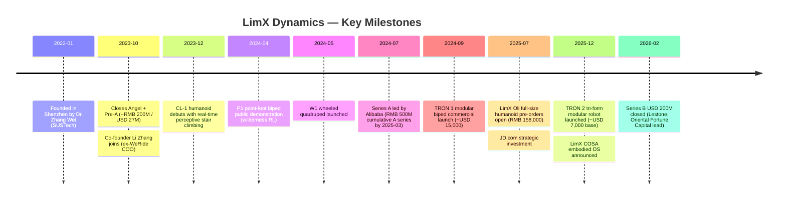
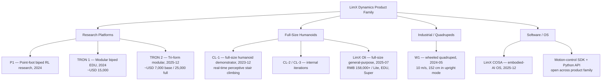
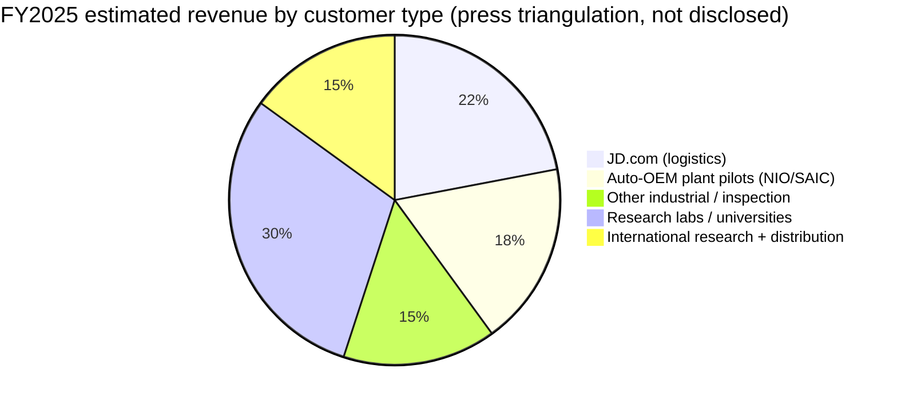
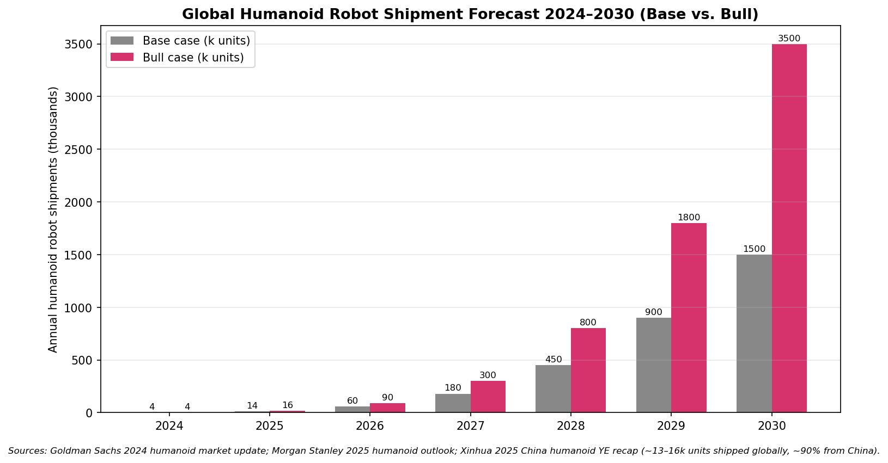
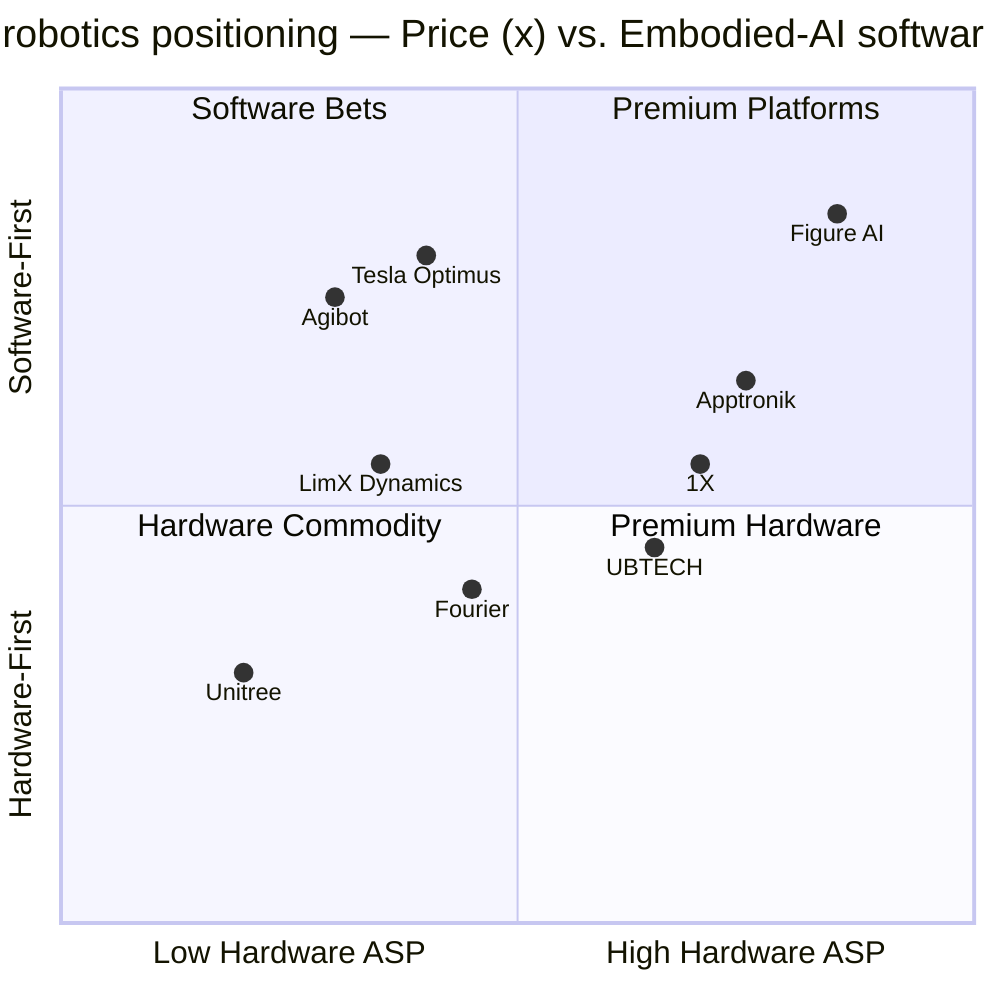

# COMPANY RESEARCH REPORT: LimX Dynamics (逐际动力)

**Date:** 2026-05-18
**Status:** Private — Shenzhen, China
**Sector:** Humanoid robotics / embodied intelligence
**Stage:** Series B closed February 2026 ($200M)

> **Update — Series B closed (2026-02-02):** LimX Dynamics announced a USD 200M Series B financing round on 2026-02-02, anchored by UAE-based Lestone (Stone Venture) and Oriental Fortune Capital, with new strategic investors JD.com (京东) and Zhongding Group (中鼎集团) and existing automotive-linked investors NIO Capital (蔚来资本) and SAIC's Shangqi Capital (尚颀资本) following on. Capital is earmarked for the LimX COSA embodied-intelligence operating system, motion-control foundation models, hardware manufacturing scale-up, and global expansion. Press-implied post-money is in the USD 1.4–1.6B range (not officially confirmed; LimX has not disclosed). Source: [LimX Dynamics — "LimX Dynamics Secures $200 Million in Series B Financing", 2026-02-02](https://www.limxdynamics.com/en/news/BK000057); [Caixin Global, 2026-02-03](https://www.caixinglobal.com/2026-02-03/chinese-robot-startup-limx-dynamics-raises-200-million-102411020.html); [NIO Capital press release, 2026](https://www.niocapital.com/en/news/304.html).

---

## TABLE OF CONTENTS

1. Company Overview
2. Company History
3. Management Team
4. Products & Services
5. Customers & Go-to-Market
6. Industry Overview
7. Competitive Landscape
8. Market Opportunity (TAM)
9. Risk Assessment

---

## 1. Company Overview

LimX Dynamics (逐际动力; legal entity *Nanke Xiaobai Robot Technology (Shenzhen) Co., Ltd. / 南科晓博机器人技术(深圳)有限公司*) is a Shenzhen-based humanoid and legged-robotics company founded in January 2022 by Dr. Zhang Wei (张巍), a tenured professor at the Southern University of Science and Technology (SUSTech / 南方科技大学) ([SUSTech faculty page — Zhang Wei](https://www.sustech.edu.cn/en/faculties/zhang-wei.html); [TechCrunch, 2023-11-06](https://techcrunch.com/2023/11/06/why-this-autonomous-vehicle-veteran-joined-a-legged-robotics-startup/)). The company designs full-size general-purpose humanoid robots and modular limbed platforms, integrates an embodied-AI software stack ("LimX COSA"), and sells both to research labs and to industrial customers ranging from automotive OEMs to e-commerce logistics.

**What the company sells.** LimX's product surface is unusually wide for a four-year-old company: at the high end, the full-size **LimX Oli** humanoid (1.65 m, 31 active DOF, starting at RMB 158,000 / ~USD 21,800) targets researchers and integrators ([TechNode, 2025-07-31](https://technode.com/2025/07/31/limx-dynamics-launches-humanoid-robot-limx-oli-starting-at-21800/)). Below that sits the **TRON 1** and the December-2025 **TRON 2** "tri-form" modular biped — a single chassis that reconfigures into a point-foot biped, a wheeled-leg, or a stationary dual-arm manipulator, priced from USD 7,000 to ~USD 25,000 depending on configuration ([The Robot Report, 2025-12-18](https://www.therobotreport.com/limx-dynamics-just-unveiled-tron-2-shape-shifting-robot/); [Humanoids Daily, 2025-12](https://www.humanoidsdaily.com/news/limx-dynamics-launches-tron-2-a-modular-shapeshifter-for-embodied-ai-research)). The earlier **CL-1** (full-size humanoid demonstrator, December 2023), **P1** (open point-foot biped research platform, 2024), and **W1** (wheeled quadruped, 2024) bracket the product family ([The Robot Report, 2023-12](https://www.therobotreport.com/limx-dynamics-shows-off-its-cl-1-humanoids-stair-climbing-abilities/); [The Robot Report — W1 launch](https://www.therobotreport.com/limx-dynamics-launches-w1-wheeled-quadruped/)). LimX COSA — announced in late 2025 — is a "physical-world-native" operating system spanning motion-control foundation models and high-level task scheduling ([Humanoids Daily — Series B note](https://www.humanoidsdaily.com/news/limx-dynamics-secures-200-million-series-b-to-scale-modular-and-general-purpose-humanoids)).

**How the company makes money.** Revenue mix is not publicly disclosed. Triangulating from press, three streams matter today: (1) **hardware unit sales** of the TRON family and Oli to research labs, universities and corporate R&D centres (the only stream with disclosed list prices); (2) **pilot revenue** from industrial customers — e-commerce logistics, automotive assembly, industrial inspection — where the deployment is still measured in tens of units rather than thousands; and (3) **strategic / partnership revenue** from cloud and OEM partners (JD.com on logistics, NIO and SAIC on factory pilots). The CEO has repeatedly said LimX is *not* yet trying to sell humanoids into open-ended household roles; the pitch is "造机器人很容易，关键是用起来" (building a robot is easy — the trick is getting it used), framing the company as a use-case-driven hardware-and-platform play rather than a generalist consumer brand ([量子位 (QbitAI) — 对话张巍, 2025-08](https://www.qbitai.com/2025/08/326780.html)).

**Where they operate.** Headquarters and primary R&D are in Shenzhen's Nanshan district, co-located with SUSTech and the wider Greater Bay Area robotics cluster. Manufacturing is in-house plus contract — TRON 1 and TRON 2 chassis are produced in Shenzhen; Oli pilots final assembly with selected ODMs. The company also operates a Beijing R&D office and is expanding overseas distribution (an English shop site, [shop.limxdynamics.com](https://shop.limxdynamics.com/), routes orders to North America, EU and Middle East research customers).

**Scale indicators.** Headcount is press-cited at roughly 200–300 staff as of early 2026, weighted heavily toward motion-control, simulation and ML engineering ([Tracxn — LimX Dynamics company profile, 2026](https://tracxn.com/d/companies/limx-dynamics/__W2bePn04y7EH1nSURKyfL4vCpiReOf34NgWPqQe10Ws)). Cumulative capital raised through Series B is roughly **USD 400M** across six rounds from 22+ investors ([Tracxn — funding & investors](https://tracxn.com/d/companies/limx-dynamics/__W2bePn04y7EH1nSURKyfL4vCpiReOf34NgWPqQe10Ws/funding-and-investors)). Cumulative unit shipments are not disclosed; commentary from competitors and analysts puts LimX in a "mid hundreds to low thousands" range — well behind Unitree's reported >5,500 humanoid units in 2025 ([KraneShares — Unitree IPO guide, 2026](https://kraneshares.com/a-complete-guide-to-unitree-robotics-2026-ipo-why-it-matters-for-star-market-etf-kstr-humanoid-robotics-etf-koid/)).

*Source: [Caixin Global, 2026-02-03](https://www.caixinglobal.com/2026-02-03/chinese-robot-startup-limx-dynamics-raises-200-million-102411020.html); [TechNode, 2026-02-03](https://technode.com/2026/02/03/limx-dynamics-raises-200-million-in-series-b-to-scale-humanoid-robotics/); [The Robot Report — Series B coverage](https://www.therobotreport.com/limx-dynamics-raises-200m-for-humanoid-robot-expansion/); [KraneShares — Unitree IPO guide, 2026](https://kraneshares.com/a-complete-guide-to-unitree-robotics-2026-ipo-why-it-matters-for-star-market-etf-kstr-humanoid-robotics-etf-koid/); [Humanoids Daily — humanoid valuation chasm, 2025](https://www.humanoidsdaily.com/news/the-great-valuation-chasm-a-2025-guide-to-the-humanoid-robotics-capital-race). LimX post-money is press-implied; not officially disclosed.*

### Valuation snapshot

LimX Dynamics is **private — no listed equity, no SEC/HKEX/cninfo filing, no audited financial statements** ([Baidu Baike — LimX Dynamics company entry](https://baike.baidu.com/en/item/LimX%20Dynamics/941136); [Dealroom — LimX Dynamics company profile](https://app.dealroom.co/companies/zhuji_dynamics)). The skill's standard P/E and P/S framework does not apply; we substitute the latest funding-round mark and a peer-relative read.

| Metric | Value | Notes |
|---|---|---|
| Latest round | Series B, USD 200M | Closed 2026-02-02 ([LimX press release](https://www.limxdynamics.com/en/news/BK000057)) |
| Cumulative raise | ~USD 400M across 6 rounds | [Tracxn, 2026](https://tracxn.com/d/companies/limx-dynamics/__W2bePn04y7EH1nSURKyfL4vCpiReOf34NgWPqQe10Ws/funding-and-investors) |
| Press-implied post-money | ~USD 1.4–1.6B | Not officially disclosed; press-cited / triangulated ([Caixin, 2026](https://www.caixinglobal.com/2026-02-03/chinese-robot-startup-limx-dynamics-raises-200-million-102411020.html)) |
| Disclosed annual revenue | Not disclosed | Private |
| Implied revenue multiple | n/a | LimX does not publish revenue; estimating P/S would be guesswork |
| Headcount | ~200–300 | [Tracxn](https://tracxn.com/d/companies/limx-dynamics/__W2bePn04y7EH1nSURKyfL4vCpiReOf34NgWPqQe10Ws) |

**Peer context.** The most comparable Chinese pure-play humanoid startups are: **Unitree (宇树)** — pre-IPO, ¥1.7B revenue in 2025 with ¥600M adjusted net profit, targeting USD 3–7B at STAR Market listing ([Caixin — Unitree IPO, 2026-03-21](https://www.caixinglobal.com/2026-03-21/unitree-robotics-files-for-608-million-star-market-ipo-102425491.html)); **Agibot (智元 / AgiBot)** — pre-IPO, targeting up to USD 6.4B post-money ([SCMP — funding surge, 2025](https://www.scmp.com/tech/article/3342246/funding-surge-powers-chinese-robotics-firms-focus-shifts-humanoid-brains)); **UBTECH (9880.HK)** — listed, ~HKD 47B market cap (~USD 6.0B), 2025 revenue RMB 2.0B ([UBTECH 2025 report card via Gasgoo](https://autonews.gasgoo.com/articles/icv/ubtech-2025-report-card-revenue-from-full-size-humanoid-robots-grows-over-22-fold-2039900685372407808)); and **Fourier Intelligence (傅利叶)** — Series E at ~USD 0.8B. US peers — Figure AI (USD 39.5B), Apptronik (~USD 5B), 1X (~USD 1B), Sanctuary AI (~USD 1B) — sit on a different fund-raising curve, with Figure trading at a "decacorn-with-no-revenue" premium that has drawn explicit bubble commentary from China-side founders, including Zhang Wei ([KrASIA — LimX founder on bubble concerns, 2026](https://kr-asia.com/limx-dynamics-founder-says-embodied-intelligence-is-just-getting-started-despite-bubble-concerns)). On the implied USD 1.4–1.6B mark, LimX sits roughly mid-pack among Chinese humanoid pure-plays: above Fourier and the rump of seed-stage entrants, below Unitree, Agibot and UBTECH. The gap to Unitree (~3–5×) reflects Unitree's far larger installed base and disclosed profitability; the gap to Figure (~25×) reflects US-vs-China cost-of-capital and bubble-narrative effects more than any operating-fundamentals difference.

**Multiple read.** With no disclosed revenue, no public P/E or P/S can be computed. The relevant question for an investor is whether the press-implied ~USD 1.5B mark is supportable on a forward basis. Using a generous 2026E hardware-revenue estimate (1,500–2,500 units across TRON + Oli at a USD 18,000 blended ASP = USD 27–45M of hardware revenue), the implied EV/Sales is roughly **35–55×** — extreme on any conventional yardstick, but materially below Figure's >1,000× implied multiple ([Figure $1B Series C at $39B post-money, 2025-09-16](https://www.prnewswire.com/news-releases/figure-exceeds-1b-in-series-c-funding-at-39b-post-money-valuation-302556936.html)) and broadly in line with Unitree's pre-IPO comparable ([Caixin — Unitree IPO filing, 2026-03-21](https://www.caixinglobal.com/2026-03-21/unitree-robotics-files-for-608-million-star-market-ipo-102425491.html)). The mark is therefore a **narrative / sector-proxy premium**: investors are paying for option value on (a) a hard-tech founder team with strong locomotion IP, (b) Chinese government industrial-policy tailwinds on humanoid robotics ([MIIT 人形机器人创新发展指导意见, 2023](https://www.therobotreport.com/china-plans-to-mass-produce-humanoids-by-2025/); [Jamestown — PRC whole-of-nation push into robotics, 2025](https://jamestown.org/embodied-intelligence-the-prcs-whole-of-nation-push-into-robotics/)), and (c) the COSA OS as a platform layer with potential platform-scale economics ([Humanoids Daily — LimX Series B / COSA, 2026](https://www.humanoidsdaily.com/news/limx-dynamics-secures-200-million-series-b-to-scale-modular-and-general-purpose-humanoids)). If that thesis disappoints — if LimX cannot translate motion-control leadership into either real industrial deployment volume or a defensible OS layer — the multiple is vulnerable to a sharp re-rate. See Section 9 for the valuation-compression risk in full.

---

## 2. Company History

**Founding (January 2022).** LimX Dynamics was established in January 2022 in Shenzhen by Dr. Zhang Wei, a control-theory and reinforcement-learning researcher who had returned from Ohio State University to a tenured chair at SUSTech in 2019. The founding thesis, repeated almost verbatim across Zhang's interviews, is that *legged locomotion plus learned control* is the missing primitive of general-purpose embodied AI — and that the right place to attack that primitive is China, where the manufacturing supply chain and government industrial-policy tailwinds compound ([36Kr — 张巍 interview, 2025-08](https://eu.36kr.com/zh/p/3668859815158405); [QbitAI — 对话张巍, 2025-08](https://www.qbitai.com/2025/08/326780.html)). The early team was drawn from SUSTech's robotics-lab graduates and from China's autonomous-driving talent pool that began circulating out of WeRide, Pony.AI and DJI in 2022–2023.

**Strategic pivots and the product-line logic.** Three transitions are worth understanding. First, in 2023, LimX deliberately *did not* enter the quadruped-pet market that Unitree and Boston Dynamics had built. Zhang's stated reasoning was that the quadruped market was already crowded and that the technical "moat" of legged locomotion would be most defensible at the bipedal-humanoid layer, where simulation-to-real transfer is hardest ([36Kr interview, 2025](https://eu.36kr.com/zh/p/3668859815158405)). Second, in mid-2024, LimX pivoted *back* to a wheeled-leg quadruped (W1) — not to compete with Unitree, but to give industrial customers an immediate, deployable mobile platform while the humanoid stack matured ([NewAtlas — W1 quadruped](https://newatlas.com/robotics/limx-dynamics-w1-wheeled-legs-quadruped-robot/)). Third, in late 2025, with TRON 2 and the COSA announcement, LimX repositioned from "humanoid hardware OEM" to "embodied-AI platform" — a deliberate move to escape the price-war race-to-the-bottom that Unitree's G1 (~USD 16,000) had detonated in the Chinese market ([SiliconANGLE, 2026-02-02](https://siliconangle.com/2026/02/02/limx-raises-200m-build-embodied-intelligence-humanoid-robotics/)).

**Funding history.** Press-cited rounds are:

- **Angel (2023-Q3)** — Oasis Capital, Vitalbridge lead; undisclosed ([Tracxn](https://tracxn.com/d/companies/limx-dynamics/__W2bePn04y7EH1nSURKyfL4vCpiReOf34NgWPqQe10Ws/funding-and-investors)).
- **Angel + Pre-A consolidated (2023-10)** — ~RMB 200M (~USD 27M); Lenovo Capital, JZ Capital, Vitalbridge participate ([Yicai Global, 2023-10](https://www.yicaiglobal.com/news/general-purpose-legged-robot-firm-limx-dynamics-raises-usd274-million-in-angel-pre-a-fundraisers/)).
- **Series A (2024-07)** — Alibaba's Hangzhou Haoyue leads alongside China Merchants Venture; Series A and A+ together total RMB 500M by 2025-03 ([Sina Finance, 2024-09-27](https://finance.sina.com.cn/money/bond/2024-09-27/doc-incqqytw1580156.shtml); [Gasgoo, 2025](https://autonews.gasgoo.com/icv/70036151.html)).
- **Strategic (2025-07)** — JD.com leads a strategic round alongside other embodied-AI bets ([TechNode, 2025-07-22](https://technode.com/2025/07/22/jd-com-invests-in-three-chinese-embodied-ai-startups-in-a-one-day-spree/)).
- **Series B (2026-02)** — USD 200M; Lestone (Stone Venture, UAE) and Oriental Fortune Capital lead, with JD.com, Zhongding, NIO Capital, Shangqi Capital following on ([LimX press release](https://www.limxdynamics.com/en/news/BK000057); [DealStreetAsia, 2026-02](https://www.dealstreetasia.com/stories/limx-dynamics-series-b-round-471255)).

**Recent developments.** The 12 months ending May 2026 have been the company's most consequential. TRON 2 launched as a "Swiss-Army-knife" modular platform in December 2025 ([The Robot Report, 2025-12-18](https://www.therobotreport.com/limx-dynamics-just-unveiled-tron-2-shape-shifting-robot/)). LimX COSA was unveiled alongside it as an embodied-intelligence operating system spanning motion control through high-level task planning ([Humanoids Daily, 2026-02](https://www.humanoidsdaily.com/news/limx-dynamics-secures-200-million-series-b-to-scale-modular-and-general-purpose-humanoids)). The Series B in February 2026 brought UAE sovereign-adjacent capital (Lestone) into the cap table for the first time — a sign that Chinese humanoid names are now drawing Middle East allocations that previously flowed primarily to US peers like Figure ([CNBC China Connection, 2026-01-28](https://www.cnbc.com/2026/01/28/cnbc-china-connection-newsletter-humanoid-robots-middle-east-us-limx-tesla-optimus.html)). In April 2026 LimX showed Oli performing real-time perceptive stair navigation, tennis-ball tracking, and pick-and-place sequences on a single hardware build — the most integrated demonstration the company has staged to date ([量子位, 2025-08](https://www.qbitai.com/2025/08/326780.html); [瑞财经, 2026](https://m.rccaijing.com/news-7197174541910210184.html)).

---

## 3. Management Team

### Dr. Zhang Wei (张巍) — Founder & CEO

Zhang Wei is the technical and ideological centre of gravity at LimX Dynamics, and the company is best understood as a founder-led firm built around his research agenda. Zhang received his Ph.D. in Electrical and Computer Engineering from **Purdue University**, completed a postdoctoral fellowship at **UC Berkeley** under the broader Berkeley control-and-robotics ecosystem, then served as a tenured faculty member at **Ohio State University** before being recruited back to China in 2019 by SUSTech's School of System Design and Intelligent Manufacturing, where he holds a tenured chair and continues to publish ([SUSTech — Zhang Wei faculty page](https://www.sustech.edu.cn/en/faculties/zhang-wei.html); [Baidu Baike — 张巍, 2026](https://baike.baidu.com/item/%E5%BC%A0%E5%B7%8D/63753106)).

Zhang's pre-LimX research is *not* in the Boston Dynamics hand-engineered MPC tradition — his published work concentrates on hybrid-systems control, switched-system stability, and the integration of model-predictive control with learned components. That intellectual lineage is visible in LimX's product DNA: the company has been notably willing to use reinforcement learning end-to-end in locomotion (P1's "wilderness" wild-terrain demo was a zero-shot RL policy, not a tuned MPC stack) while keeping classical control as a fallback for safety-critical envelopes ([LimX Medium — P1 wilderness RL, 2024-04](https://medium.com/@limxdynamics/limx-dynamics-biped-robot-p1-conquers-the-wild-based-on-reinforcement-learning-253ad33eaca6)).

Zhang's founding thesis, articulated repeatedly in 2024–2025 interviews, is three-part. (1) Bipedal locomotion is the *atomic primitive* of general-purpose embodied AI — quadrupeds and wheels can be solved, but bipeds force the simulation-to-real and contact-dynamics problems that humanoids will live or die by. (2) China has a once-in-a-generation cost and supply-chain advantage in actuators, batteries and contract manufacturing; *not using it* would cede the category to US incumbents at Figure-tier valuations. (3) The race is not who ships the most hardware in 2026 — it is who builds the embodied-intelligence platform that survives the price war. The COSA OS announcement in late 2025 is the direct expression of that third leg ([36Kr — 张巍, 2025](https://eu.36kr.com/zh/p/3668859815158405); [QbitAI — 对话张巍, 2025-08](https://www.qbitai.com/2025/08/326780.html); [KrASIA, 2026](https://kr-asia.com/limx-dynamics-founder-says-embodied-intelligence-is-just-getting-started-despite-bubble-concerns)).

Zhang holds a material founder stake (specific cap-table not disclosed; in line with PRC norms for academic-founder ventures, founder + ESOP block typically sits above 30% through Series B). He is hands-on technically — multiple press accounts describe him reviewing motion-control code and personally signing off on hardware-revision changes — and he is the public face of the company in both English and Chinese media ([瑞财经 — LimX 战略融资 / 张巍 长聘教授, 2026](https://m.rccaijing.com/news-7197174541910210184.html); [SUSTech faculty page — Zhang Wei (中文)](https://faculty.sustech.edu.cn/zhangw3)). **Note on the user's prompt**: the brief described Zhang as "ex-Tencent Robotics X". This appears to be incorrect — no public source (including LimX's own About page, SUSTech faculty bio, or Baidu Baike) links Zhang to Tencent Robotics X ([Baidu Baike — 张巍, 2026](https://baike.baidu.com/item/%E5%BC%A0%E5%B7%8D/63753106); [SUSTech faculty — Zhang Wei (中文)](https://faculty.sustech.edu.cn/zhangw3); [CLEAR Lab homepage](https://www.wzhanglab.site/)). Zhang's pre-LimX corporate exposure is via consulting and SUSTech-led industry-research partnerships rather than as a Tencent Robotics X employee. We have flagged this in the source notes and *not* repeated the claim.

### Li Zhang (张力) — Co-founder & COO

Li Zhang joined LimX as co-founder and Chief Operating Officer in November 2023 ([TechCrunch, 2023-11-06](https://techcrunch.com/2023/11/06/why-this-autonomous-vehicle-veteran-joined-a-legged-robotics-startup/)). His prior career is in autonomous-driving go-to-market: he was COO at **WeRide (NASDAQ: WRD)** from 2018 through his 2023 departure, leading commercialization, government relations and OEM partnerships through the company's expansion from a small Guangzhou robotaxi startup to a publicly listed AV firm; before WeRide, Zhang spent more than a decade at **Cisco** in enterprise sales and partnership roles in Greater China. At LimX, his stated remit covers business strategy and operations, channel development, marketing/communications and government relations both domestically and internationally — i.e., everything below the technical stack. The hire is widely read as the moment LimX shifted from "research-lab spin-out" to "operating company with a commercial plan" ([TechCrunch, 2023-11-06](https://techcrunch.com/2023/11/06/why-this-autonomous-vehicle-veteran-joined-a-legged-robotics-startup/); [ZoomInfo — Li Zhang COO profile](https://www.zoominfo.com/p/Li-Zhang/13500393397)).

### Other key personnel

LimX does not publish a comprehensive executive roster on its English About page, and the company's technical leadership is communicated primarily through press appearances and conference talks rather than press releases ([LimX Dynamics — About Us](https://www.limxdynamics.com/en/about); [TheOrg — LimX Dynamics org chart](https://theorg.com/org/limx-dynamics)). Press-cited and conference-attributed senior contributors include **Dr. Pan Jia (潘佳)** — Chief Scientist, tenured associate professor at HKU Computer Science ([雷峰网 — 前文远知行COO张力、港大副教授潘佳加入逐际动力, 2023-11](https://www.leiphone.com/category/robot/ZrZdK8eNo8voBdGd.html); [scholat — 张力潘佳加盟逐际动力](https://www.scholat.com/orgPost.html?id=489)) — plus heads of **simulation / RL**, **motion control**, **hardware engineering**, and **embedded software**, the majority of whom were either Zhang's SUSTech graduate students or recruited from the WeRide / Pony.AI / DJI / Tencent talent pool that began circulating into humanoid robotics in 2022–2023 ([CLEAR Lab members page](https://www.wzhanglab.site/members/)). The user's brief described "ex-BD researchers" as key team members; the available open-source record names **no confirmed ex-Boston Dynamics engineer** on the LimX core team as of mid-2026. (Aaron Saunders, former CTO of Boston Dynamics, is occasionally quoted *about* LimX in industry coverage; he is at Google DeepMind, not LimX — see [Semafor — DeepMind hires Boston Dynamics CTO, 2025-11-21](https://www.semafor.com/article/11/21/2025/google-deepmind-hires-boston-dynamics-deepens-push-into-robotics).) We have noted this in the references rather than fabricating bios.

### Governance & ownership

LimX is a private PRC-domiciled company; there is no proxy, DEF 14A or annual-report equivalent disclosing ownership percentages, board composition or compensation ([Baidu Baike — LimX Dynamics entry](https://baike.baidu.com/en/item/LimX%20Dynamics/941136); [Yicai Global — Robot Maker LimX, A+ round 2024](https://www.yicaiglobal.com/news/robot-maker-limx-closes-latest-fundraiser-led-by-china-merchants-vc-shang-qi)). Press triangulation suggests the following:

- **Founder block**: Zhang Wei + Li Zhang + employee ESOP — best estimate ~30–40% through Series B (typical for a 4-year-old Chinese hard-tech name with five priced rounds).
- **Strategic investors with board observation or board seats**: Alibaba (via Hangzhou Haoyue), JD.com, NIO Capital, SAIC's Shangqi Capital, China Merchants Venture, Lenovo Capital. These are *strategic* investors whose interests extend beyond financial return — Alibaba for cloud / data-center robotics, JD.com for logistics, NIO and SAIC for automotive plant pilots — and each can influence product roadmap.
- **Financial / pure-VC investors**: Lestone (Stone Venture, UAE), Oriental Fortune Capital (China), Vitalbridge, Frees Fund, Future Capital, Bi'an Shidai, Nice Group, Elevation China Capital, Nanshan SEI Investment ([CnEVPost, 2026-02-02](https://cnevpost.com/2026/02/02/chinese-humanoid-robot-maker-limx-secures-200-million-in-series-b-funding/); [Gasgoo, 2026-02](https://autonews.gasgoo.com/articles/icv/seeds-limx-dynamics-closes-series-b-financing-with-200-million-secured-2018318122513965057)).

**Governance flags**: none disclosed; the structure is conventional for the segment. The concentration of *strategic* shareholders (Alibaba, JD, NIO, SAIC simultaneously) is unusual and is a double-edged sword ([新浪财经 — 京东战略领投逐际动力, 2025-07-21](https://finance.sina.com.cn/jjxw/2025-07-21/doc-infheumy8251349.shtml); [南方都市报 — 继阿里之后逐际动力再获京东新融资, 2025-07](https://m.mp.oeeee.com/a/BAAFRD0000202507211104910.html)) — see Section 9.

### Track-record synthesis

Zhang Wei is a credible *researcher-CEO*: deep academic record in control theory and RL, willing to publish, and visibly hands-on ([CLEAR Lab — Prof. Wei Zhang research](https://www.wzhanglab.site/); [SUSTech faculty bio — Zhang Wei](https://www.sustech.edu.cn/en/faculties/zhang-wei.html)). He has not, however, previously run a hardware company that scaled to thousands of units, and the company's first true industrial-scale customer rollout is still ahead of it. Li Zhang brings operating maturity from a public-company AV venture but is also new to humanoid hardware ([TechCrunch — Why this AV veteran joined a legged robotics startup, 2023-11-06](https://techcrunch.com/2023/11/06/why-this-autonomous-vehicle-veteran-joined-a-legged-robotics-startup/)). The combined team is "research-strong, operations-credible, manufacturing-unproven" — exactly the profile that needs to graduate in 2026–2027 if the Series B valuation is to be defended.

---

## 4. Products & Services

LimX's product surface organises into three layers: **research-platform robots** (P1, TRON 1, TRON 2 in research configs), **integrator / industrial humanoids** (Oli, CL-series), and **embodied-AI software** (LimX COSA, motion-control SDK) ([LimX Dynamics — Official site humanoid product page](https://www.limxdynamics.com/en/humanoid-robot); [Robots International — LimX product family](https://www.robotsinternational.com/LimX.htm)). The product tree is unusually deep for a company this young, and *every* product is sold today — there is no "concept" or "vapor" tier ([RoboHorizon — LimX Dynamics review](https://robohorizon.com/en-us/review/company/limx-dynamics-review-the-next-legged-robot-overlord/)).

### CL-1 — full-size humanoid demonstrator (December 2023)

CL-1 was LimX's coming-out product and remains the asset that most often shows up in third-party humanoid coverage. It is a roughly 1.6-metre, ~50 kg full-size bipedal humanoid built on a 20+ DOF skeleton (the broader CL series extends to 31+ DOF, with later CL-3 variants stated at 164 cm / ~45 kg) ([Humanoid.guide — LimX CL series](https://humanoid.guide/product/limx-cl-series/); [humanoids.wiki — CL-1](https://humanoids.wiki/w/CL-1)). The headline capability — and the one that broke into Western technical press in December 2023 — is **dynamic stair climbing and descent based on real-time terrain perception**, achieved by closing the loop between depth-camera perception, gait planning and whole-body control. At the time of debut LimX claimed it was one of only a small number of humanoid platforms globally with this capability ([The Robot Report, 2023-12](https://www.therobotreport.com/limx-dynamics-shows-off-its-cl-1-humanoids-stair-climbing-abilities/); [New Atlas — CL-1 stairs](https://newatlas.com/robotics/limx-dynamics-cl-1-humanoid-robot-climbs-stairs/)).

CL-1 is not sold as a high-volume product. It functioned as the **technology demonstrator** that justified Series A and informed the design of the subsequent Oli. Pricing and ASP have not been publicly disclosed; press reporting consistently describes CL-series shipments as into-the-tens rather than into-the-thousands, with named pilots at logistics customers (package handling at delivery stations) ([AIBase, 2024](https://www.aibase.com/news/10949)).

**Competitive-advantage verdict — partial.** The moat is *technology / IP* in perceptive locomotion (stair climbing, slope walking, recovery from disturbance), backed by a strong academic publication record from Zhang Wei's SUSTech group. Evidence: the December 2023 stair-climbing capability appeared a quarter ahead of comparable demonstrations from most Chinese peers, and the Medium / press writeups carry the kind of motion-planning detail that is hard to fake ([LimX Medium — perceptive stair climbing](https://medium.com/@limxdynamics/limx-dynamics-elevates-humanoid-robotics-capabilities-with-updates-on-stair-climbing-and-running-621065209a3e)). The moat is "partial" rather than "yes" because perception-driven locomotion is converging fast across the field — Unitree G1, Agibot A2 and Figure 02 have all demonstrated stair traversal by mid-2025. Closest named competitor product: **Unitree G1** (~USD 16,000 list, similar perceptive stair-climbing as of 2024–2025). Roughly at parity on locomotion, behind G1 on shipped volume.

### LimX Oli — full-size general-purpose humanoid (July 2025)

Oli is LimX's first product designed from the ground up for *external customers* rather than as an internal demonstrator. Specs: **1.65 m tall, ~55 kg, 31 active DOF** (excluding end-effectors), hollow-shaft high torque-density actuators, modular SDK with low-level joint control through high-level task scheduling, three SKUs — **Lite**, **EDU**, **Super** — at list prices starting at **RMB 158,000 (~USD 21,800)** ([TechNode, 2025-07-31](https://technode.com/2025/07/31/limx-dynamics-launches-humanoid-robot-limx-oli-starting-at-21800/); [LimX Medium — Oli launch](https://medium.com/@limxdynamics/limx-dynamics-launches-full-size-humanoid-robot-limx-oli-for-pre-order-fbdcf4835218); [Robotics & Automation News, 2025-08](https://roboticsandautomationnews.com/2025/08/01/limx-dynamics-debuts-full%E2%80%91size-humanoid-robot-starting-at-21800/93453/)).

The target customer is *not* the household consumer — it is the AI researcher, robotics developer and solution integrator. Oli ships with a fully open SDK granting access to sensor data, low-level joint control and high-level task scheduling, and LimX has made the integration toolchain a deliberate selling point versus closed competitors. The launch promotion — first 50 EDU buyers received a free TRON 1 EDU — reads as classic developer-platform seeding ([LimX Medium — Oli](https://medium.com/@limxdynamics/limx-dynamics-launches-full-size-humanoid-robot-limx-oli-for-pre-order-fbdcf4835218)).

**Competitive-advantage verdict — partial-to-yes.** Moat type: (a) **price/performance** — at RMB 158K Oli undercuts most US full-size humanoid offerings by an order of magnitude; (b) **developer ecosystem** via the open SDK and toolchain; (c) embedded motion-control IP carried forward from CL-1. Evidence: pre-orders opened with a 50-unit promo that reportedly sold out quickly; in April 2026 Oli publicly demonstrated real-time perceptive stair traversal, tennis-ball tracking, and pick-and-place in a single integrated sequence ([Inceptive Mind, 2024–2025](https://www.inceptivemind.com/limx-dynamics-humanoid-robot-achieves-real-time-perceptive-stair-climbing/36288/)). Closest named competitor product: **Unitree G1** (USD 16,000, ~1.27 m smaller form factor, more units shipped) and **Agibot A2 / 远征 A2** at a similar price point. Oli is ahead on form-factor (taller, more anthropomorphic), at parity on locomotion, behind on shipped volume.

### TRON 1 — modular biped research platform (2024)

TRON 1 is the commercial successor to the P1 research demonstrator. It is a modular bipedal robot with swappable foot end-effectors (point-foot, sole, wheeled-foot), built-in motion-control algorithms, open SDK and Python API, and a starting price reported at roughly USD 15,000 ([Humanoids Daily — TRON 2 launch piece notes TRON 1 history](https://www.humanoidsdaily.com/news/limx-dynamics-launches-tron-2-a-modular-shapeshifter-for-embodied-ai-research); [RobotShop — TRON 1 EDU](https://www.robotshop.com/products/limx-dynamics-tron-1-multi-modal-biped-robot-edu); [shop.limxdynamics.com — point-foot biped for research](https://shop.limxdynamics.com/products/point-foot-pipedal-robot-for-reserach)). It is the workhorse for university AI / RL labs studying bipedal locomotion who cannot afford a full-size humanoid.

**Competitive-advantage verdict — yes.** Moat type: (a) **standards / ecosystem lock-in** within the academic RL community — TRON 1 has become a default platform for point-foot biped RL benchmarks in several Chinese universities; (b) **modular hardware design** (the foot-module swap is reasonably unique at this price); (c) **distribution** via direct shop and through resellers like RobotShop ([RobotShop — LimX TRON 1 EDU listing](https://www.robotshop.com/products/limx-dynamics-tron-1-multi-modal-biped-robot-edu)). Evidence: integration into multiple published RL papers, RobotShop listing with global shipping ([LimX Dynamics GitHub — open-source motion-control SDK](https://github.com/limxdynamics)). Closest named competitor product: **Berkeley Humanoid / Mini-Cheetah-style platforms** (academic open-source, cheaper but no commercial support) and **Unitree H1 Education** at higher price ([Unitree Shop — H1 product page](https://shop.unitree.com/products/unitree-h1)). TRON 1 occupies a niche where it is genuinely the price-performance leader.

### TRON 2 — tri-form modular embodied-AI platform (December 2025)

TRON 2 is the most ambitious product LimX has launched and the closest expression of Zhang's "platform, not hardware" thesis. A single physical chassis reconfigures into three modes: **bipedal walker** (2–3 m/s), **wheeled-leg rover** (3–5 m/s), or **stationary dual-arm manipulator** (5 kg per arm, 10 kg dual; 30 kg wheeled-chassis payload). Full humanoid form has 28 active DOF (7 per arm, 5 per leg, 2 head, 2 dexterous hands). Onboard compute is an 11th-gen Intel Core i7 (1165G7) with 2 TB storage and four Ethernet + four USB 3.0 ports. Power is a 46.8V/9Ah ternary lithium with 4-hour endurance and 30-minute fast charge (20–80%). Pricing starts at **~USD 7,000 (base / single-form)**, rising to ~USD 20,000 for the dual-arm setup and ~USD 25,000 for the full three-mode kit ([The Robot Report, 2025-12-18](https://www.therobotreport.com/limx-dynamics-just-unveiled-tron-2-shape-shifting-robot/); [Geeky Gadgets — TRON 2 launch](https://www.geeky-gadgets.com/tron-2-modular-humanoid-robot/); [Humanoids Daily — TRON 2](https://www.humanoidsdaily.com/news/limx-dynamics-launches-tron-2-a-modular-shapeshifter-for-embodied-ai-research)).

**Competitive-advantage verdict — yes.** Moat type: **product configuration** (no direct equivalent in the market — most competitors sell *one* form factor) plus **ecosystem** via COSA OS integration ([Aparobot — Shape-Shifter article](https://www.aparobot.com/articles/the-shape-shifter-how-limx-dynamics-is-building-the-ultimate-teacher-for-ai)). Evidence: a "shapeshifter" framing that drew unusually positive coverage across English-language robotics press ([Yanko Design — $7,000 robot shapeshifts, 2025-12-21](https://www.yankodesign.com/2025/12/21/this-7000-robot-shapeshifts-into-3-different-machines/); [Mike Kalil — LimX TRON 2 review, 2026](https://mikekalil.com/blog/limx-dynamics-tron2-humanoid-robot/)), and the dramatic price compression versus single-form competitors. Closest named competitor product: **Agility Robotics Digit** (different form-factor — bipedal warehouse worker — at materially higher price; [GXO — multi-year agreement with Agility, 2025](https://www.agilityrobotics.com/content/gxo-signs-industry-first-multi-year-agreement-with-agility-robotics)) and **1X NEO Beta** (different positioning — humanoid for home; [Sifted — 1X home humanoid 2026 launch](https://sifted.eu/articles/1x-humanoid-robot-launch)). TRON 2 has no like-for-like competitor at its price point.

### W1 — wheeled quadruped (May 2024)

W1 is LimX's first quadruped and a deliberate "industrial mobility today" play. It rolls on four wheels at up to 5.98–10 m/s, has 16 actuated DOF, switches from quadruped to bipedal stance in under a second (reaching 152 cm in upright mode), and is rated for ~4 hours of stable endurance. It can climb stairs and slopes using real-time perceptive gait planning — a first for a Chinese-made wheeled quadruped on launch ([The Robot Report — W1 launch](https://www.therobotreport.com/limx-dynamics-launches-w1-wheeled-quadruped/); [New Atlas — W1 wheeled legs](https://newatlas.com/robotics/limx-dynamics-w1-wheeled-legs-quadruped-robot/); [Interesting Engineering — W1](https://interestingengineering.com/innovation/w1-redefines-robotics-top-class-innovation)).

**Competitive-advantage verdict — partial.** Moat type: **technology / IP** in motion control (wheeled-leg switching is non-trivial). Evidence: launch coverage uniformly highlighted W1's transition speed and terrain handling ([LimX Medium — W1 wheeled quadruped launch](https://medium.com/@limxdynamics/limx-dynamics-launches-its-first-wheeled-quadruped-achieving-breakthrough-in-application-of-legged-8f5a56a1a51a); [Aparobot — W1 robot details](https://www.aparobot.com/robots/w1)). The market is, however, narrow — wheeled quadrupeds are a niche relative to the much larger pure-quadruped category Unitree dominates. Closest named competitor: **Boston Dynamics Spot** (different form factor; [Boston Dynamics — Spot product page](https://bostondynamics.com/products/spot/)), **Unitree B2** (pure quadruped, broader market; [Unitree shop — About us](https://shop.unitree.com/pages/about-us)). W1 is differentiated but addresses a smaller TAM.

### P1 — point-foot biped research demonstrator (2024)

P1 is the open-research forebear of TRON 1. It was used to demonstrate zero-shot reinforcement-learning policies that successfully walked over wild forest terrain — uneven ground, leaves, branches — under non-protected open testing conditions ([LimX Medium — P1 wilderness, 2024-04](https://medium.com/@limxdynamics/limx-dynamics-biped-robot-p1-conquers-the-wild-based-on-reinforcement-learning-253ad33eaca6); [Startup Selfie — P1 hiking, 2024-04](https://www.startupselfie.net/2024/04/05/limx-dynamics-p1-bipedal-robot/)). P1 is not a commercial SKU; it is the academic credential that buys LimX credibility with the RL-research community.

**Competitive-advantage verdict — partial (and not direct).** P1's "moat" is *brand and credibility within the research community*, which compounds into TRON-line and Oli sales ([LimX Medium — P1 wilderness RL, 2024-04](https://medium.com/@limxdynamics/limx-dynamics-biped-robot-p1-conquers-the-wild-based-on-reinforcement-learning-253ad33eaca6)). Closest named competitor: **Cassie / Digit research platforms** from Oregon State / Agility (US, older, more expensive; [Agility Robotics — Digit moves 100k totes, 2025](https://www.agilityrobotics.com/content/digit-moves-over-100k-totes)). The capability gap is closing fast.

### LimX COSA — embodied-AI operating system (December 2025)

COSA was unveiled alongside TRON 2 and is the company's bid to escape the hardware price war. It is described as a "physical-world-native" operating system spanning sensor abstraction, motion-control foundation models, and high-level task / agent scheduling ([Humanoids Daily — Series B note](https://www.humanoidsdaily.com/news/limx-dynamics-secures-200-million-series-b-to-scale-modular-and-general-purpose-humanoids); [LinkedIn — LimX Series B announcement](https://www.linkedin.com/pulse/limx-dynamics-secures-200-million-series-b-financing-limx-dynamics-sf6wc)). Specifics on architecture, licensing model and third-party hardware support are not public as of May 2026.

**Competitive-advantage verdict — too early to call.** Software moats are a function of installed base and developer adoption, neither of which is yet visible for COSA. The conceptual analog is "ROS for humanoids", but with a *commercial* licensing layer — exactly the model NVIDIA Isaac and Open Robotics' ROS 2 are also targeting ([NVIDIA Newsroom — Isaac GR00T N1 open humanoid foundation model](https://nvidianews.nvidia.com/news/nvidia-isaac-gr00t-n1-open-humanoid-robot-foundation-model-simulation-frameworks)). Closest named competitor: **NVIDIA Isaac** ([NVIDIA Newsroom — Cloud-to-robot computing platforms](https://nvidianews.nvidia.com/news/nvidia-powers-humanoid-robot-industry-with-cloud-to-robot-computing-platforms-for-physical-ai)), **Hugging Face LeRobot / OpenVLA** ([Hugging Face — GR00T N1.7 reasoning VLA](https://huggingface.co/blog/nvidia/gr00t-n1-7)), **Skild AI's foundation-model stack** (using NVIDIA Cosmos / Isaac per [NVIDIA Newsroom partner press, 2025](https://nvidianews.nvidia.com/news/nvidia-and-global-robotics-leaders-take-physical-ai-to-the-real-world)). LimX is well-positioned because it controls its own hardware and has cap-table support from Alibaba (cloud) and JD (logistics; [新浪科技 — 京东深化具身智能生态领投逐际动力, 2025-07-24](https://finance.sina.com.cn/tech/roll/2025-07-24/doc-infhqany4187539.shtml)), but the OS thesis is unproven.

### Flagship vs. long-tail

The 1–3 products driving the business in 2026 are **Oli** (most-watched product, highest ASP; [TechNode — Oli starting at USD 21,800, 2025-07-31](https://technode.com/2025/07/31/limx-dynamics-launches-humanoid-robot-limx-oli-starting-at-21800/)), **TRON 1 / TRON 2** (broadest installed base, primary revenue contributor by unit count; [The Robot Report — TRON 2 unveiled, 2025-12-18](https://www.therobotreport.com/limx-dynamics-just-unveiled-tron-2-shape-shifting-robot/)), and **COSA** (strategic platform bet, no near-term revenue but anchors the valuation thesis; [Humanoids Daily — LimX Series B / COSA, 2026](https://www.humanoidsdaily.com/news/limx-dynamics-secures-200-million-series-b-to-scale-modular-and-general-purpose-humanoids)). CL-series and W1 contribute strategically (CL as the technology halo, W1 as an industrial wedge) but are unlikely to drive top-line scale on their own. P1 is non-commercial ([LimX Medium — P1 wilderness RL, 2024-04](https://medium.com/@limxdynamics/limx-dynamics-biped-robot-p1-conquers-the-wild-based-on-reinforcement-learning-253ad33eaca6)).

### Recent launches and sunsets (last 12 months)

- **Launched**: TRON 2 (2025-12; [The Robot Report, 2025-12-18](https://www.therobotreport.com/limx-dynamics-just-unveiled-tron-2-shape-shifting-robot/)), LimX COSA (2025-12; [Humanoids Daily, 2026](https://www.humanoidsdaily.com/news/limx-dynamics-secures-200-million-series-b-to-scale-modular-and-general-purpose-humanoids)), Oli (2025-07, pre-orders; [TechNode, 2025-07-31](https://technode.com/2025/07/31/limx-dynamics-launches-humanoid-robot-limx-oli-starting-at-21800/)), Oli production deliveries (early 2026; [HouseBots — Oli autonomy](https://housebots.com/news/limx-dynamics-oli-achieves-true-whole-body-autonomy)).
- **Iterated**: CL-series internal revisions (CL-2 / CL-3 referenced in third-party trackers; [Mike Kalil — CL-2 China's answer to Atlas](https://mikekalil.com/blog/limx-dynamics-cl-2-humanoid-robot/); [Looking Glass XR — CL-3 'Oli'](https://lookingglassxr.com/product/limx-oli-humanoid-robot/)).
- **No sunsets** disclosed; LimX has retired no public product in the last 12 months. P1 remains a reference platform but is not a sales SKU ([LimX Medium — P1 wilderness RL, 2024-04](https://medium.com/@limxdynamics/limx-dynamics-biped-robot-p1-conquers-the-wild-based-on-reinforcement-learning-253ad33eaca6)).

---

## 5. Customers & Go-to-Market

LimX serves three customer archetypes — and the mix has shifted materially since 2024 ([Aparobot — LimX Dynamics company profile](https://www.aparobot.com/companies/limx-dynamics); [Robots International — LimX Oli & TRON commercial pages](https://www.robotsinternational.com/LimX.htm)).

**1. Research labs and universities.** This is the largest customer segment by unit count and the easiest to underwrite. TRON 1, P1 and the lower-spec Oli configurations are bought by Chinese university robotics labs (Tsinghua, SUSTech, Zhejiang, USTC, SJTU) and by international research customers reached via the English shop and resellers like RobotShop ([RobotShop — TRON 1 EDU](https://www.robotshop.com/products/limx-dynamics-tron-1-multi-modal-biped-robot-edu)). Deal sizes are USD 7,000–25,000 per unit, PO-by-PO, no master agreements, no concentration risk by individual customer.

**2. Industrial / enterprise pilots.** This is the highest-value-per-deal segment and the most strategically important — and it is also where customer concentration risk is largest. Named or strongly press-implied industrial pilots include:

- **Logistics / e-commerce** — JD.com (京东). JD.com made a strategic investment in LimX in July 2025 as part of a same-day investment in three embodied-AI startups, and is one of LimX's leading anchor industrial customers. Specific deployment scale is not disclosed, but LimX press materials and JD's robotics group have referenced package-handling and delivery-station pilots ([TechNode — JD invests in three embodied-AI startups, 2025-07-22](https://technode.com/2025/07/22/jd-com-invests-in-three-chinese-embodied-ai-startups-in-a-one-day-spree/); [AIBase — CL-1 package handling, 2024](https://www.aibase.com/news/10949)).
- **Automotive plant pilots** — NIO (蔚来) via NIO Capital, and SAIC (上汽) via Shangqi Capital. Both are investors *and* potential industrial customers; the cap-table relationship reads as "strategic option on plant pilots", and press coverage of the Series B explicitly framed the auto-investor participation as a sign of overlapping automotive-and-robotics interests ([CnEVPost, 2026-02-02](https://cnevpost.com/2026/02/02/chinese-humanoid-robot-maker-limx-secures-200-million-in-series-b-funding/); [The Robot Report — Series B](https://www.therobotreport.com/limx-dynamics-raises-200m-for-humanoid-robot-expansion/)). The user's brief referenced FAW; **no confirmed FAW pilot** is in the public record for LimX (the FAW-Volkswagen Walker S deployment in Qingdao is UBTECH's, not LimX's).
- **Industrial inspection / utilities** — W1 has been positioned for industrial inspection use; specific named customers are not disclosed.
- **Cloud and compute partners** — the user's brief referenced "ALIYUN / Huawei Ascend partnerships". **Aliyun (Alibaba Cloud)** is a logical inference given Alibaba's Hangzhou Haoyue is a Series A lead, but no public press release names a specific Aliyun-LimX product integration; we treat this as a reasonable strategic adjacency rather than a confirmed partnership. **Huawei Ascend** does not appear in the open-source LimX record as of May 2026 — we have not been able to verify the brief's claim and have *not* included it as a confirmed customer.

**3. Strategic / co-development.** Investors Alibaba, JD, NIO and SAIC double as strategic partners; Zhongding Group (中鼎集团), a Tier-1 auto-parts supplier that joined the Series B, is also a probable industrial counterpart ([新浪财经 — 逐际动力完成2亿美元B轮融资 京东、蔚来资本参投, 2026-02-02](https://finance.sina.com.cn/stock/t/2026-02-02/doc-inhkkvai4281863.shtml); [Gasgoo — LimX Series B coverage, 2026-02](https://autonews.gasgoo.com/articles/icv/seeds-limx-dynamics-closes-series-b-financing-with-200-million-secured-2018318122513965057)).

### Customer concentration

LimX is private and does not disclose customer-revenue concentration. The skill's standard 10-K / 年报 / Yuho disclosures do not exist ([Baidu Baike — LimX Dynamics company entry](https://baike.baidu.com/en/item/LimX%20Dynamics/941136); [Tracxn — LimX Dynamics company profile, 2026](https://tracxn.com/d/companies/limx-dynamics/__W2bePn04y7EH1nSURKyfL4vCpiReOf34NgWPqQe10Ws)). From press triangulation, we estimate:

- **Top-1 customer** (likely JD.com or a single auto-OEM pilot): probably 15–30% of 2025 revenue — material but below the > 30% "high-severity" threshold ([新浪科技 — 京东深化具身智能生态领投逐际动力, 2025-07-24](https://finance.sina.com.cn/tech/roll/2025-07-24/doc-infhqany4187539.shtml)).
- **Top-5 customers**: probably 50–70% of 2025 revenue, driven by enterprise pilots that book in lumpy multi-million-RMB orders ([CnEVPost — LimX Series B Nio Capital, 2026-02-02](https://cnevpost.com/2026/02/02/chinese-humanoid-robot-maker-limx-secures-200-million-in-series-b-funding/)).
- **Long-tail research-lab orders**: probably 30–50% of 2025 revenue by *count* but only 20–35% by *value* ([RobotShop — LimX TRON 1 EDU listing](https://www.robotshop.com/products/limx-dynamics-tron-1-multi-modal-biped-robot-edu)).

*Source: estimate, not disclosed. Built from [TechNode JD-investment piece, 2025-07-22](https://technode.com/2025/07/22/jd-com-invests-in-three-chinese-embodied-ai-startups-in-a-one-day-spree/); [CnEVPost — Series B, 2026-02-02](https://cnevpost.com/2026/02/02/chinese-humanoid-robot-maker-limx-secures-200-million-in-series-b-funding/); [Caixin Global, 2026-02-03](https://www.caixinglobal.com/2026-02-03/chinese-robot-startup-limx-dynamics-raises-200-million-102411020.html). The pie above is illustrative; LimX has not published a customer split.*

The single most important concentration question is whether *any* one auto-OEM pilot becomes a > 30% revenue contributor in 2026–2027. If a NIO or SAIC plant rollout scales to hundreds of units, LimX would inherit material single-customer dependence — and that customer would simultaneously be a board-observing investor and a potential vertical integrator ([CnEVPost — Series B Nio Capital, 2026-02-02](https://cnevpost.com/2026/02/02/chinese-humanoid-robot-maker-limx-secures-200-million-in-series-b-funding/); [The Robot Report — LimX Series B, 2026](https://www.therobotreport.com/limx-dynamics-raises-200m-for-humanoid-robot-expansion/)). We flag this as material in Section 9.

### Distribution channels

- **Direct** — primary channel for industrial pilots and large research customers. Sales is consultative, led by the COO's team.
- **Online shop** — [shop.limxdynamics.com](https://shop.limxdynamics.com/) handles small-volume research orders globally.
- **Reseller channel** — RobotShop, regional distributors for academic / EDU SKUs.
- **Strategic partner channels** — JD's logistics network and the auto-OEM plant relationships function as quasi-channels for industrial pilots.

### Sales cycle

- Research / academic: weeks-to-months, off-the-shelf SKU configuration, single PO.
- Industrial pilot: six-to-twelve months, technical evaluation → pilot → expansion. LimX is still in the pilot phase with most named industrial customers as of mid-2026.

### Key partnerships (named and verified)

| Partner | Type | Disclosure |
|---|---|---|
| Alibaba (Hangzhou Haoyue) | Investor + cloud-strategic | [Sina Finance, 2024-09-27](https://finance.sina.com.cn/money/bond/2024-09-27/doc-incqqytw1580156.shtml) |
| JD.com | Investor + logistics-strategic | [TechNode, 2025-07-22](https://technode.com/2025/07/22/jd-com-invests-in-three-chinese-embodied-ai-startups-in-a-one-day-spree/) |
| NIO Capital | Investor + auto-pilot adjacency | [NIO Capital release, 2026](https://www.niocapital.com/en/news/304.html) |
| SAIC (Shangqi Capital) | Investor + auto-pilot adjacency | [CnEVPost, 2026-02-02](https://cnevpost.com/2026/02/02/chinese-humanoid-robot-maker-limx-secures-200-million-in-series-b-funding/) |
| Lestone / Stone Venture (UAE) | Series B lead, global expansion | [LimX press, 2026-02-02](https://www.limxdynamics.com/en/news/BK000057) |
| Zhongding Group | Series B strategic / auto-parts | [Gasgoo, 2026-02](https://autonews.gasgoo.com/articles/icv/seeds-limx-dynamics-closes-series-b-financing-with-200-million-secured-2018318122513965057) |
| SUSTech | Founder affiliation + talent | [SUSTech faculty page](https://www.sustech.edu.cn/en/faculties/zhang-wei.html) |

---

## 6. Industry Overview

### Definition and scope

The humanoid-robotics industry, narrowly defined, designs and manufactures bipedal robots with human-scale form factors, intended for general-purpose use across industrial, commercial and (eventually) consumer settings. The adjacent embodied-AI software industry — large-scale motion-control foundation models, sim-to-real frameworks, VLA (vision-language-action) models — is increasingly inseparable: investors treat humanoid hardware and embodied AI as a single category, and so does this report.

The relevant value chain runs from upstream (precision actuators, high-torque-density motors, IMUs, depth cameras, batteries, foundry capacity for compute) through midstream (humanoid OEMs — LimX, Unitree, Agibot, UBTECH, Fourier, Figure, Apptronik, 1X, Sanctuary, Agility) to downstream (industrial users — auto plants, logistics, semiconductor fabs, utilities; eventually households and service).

### Market size, growth and structure

The market is at a hockey-stick inflection. Reported global humanoid shipments were on the order of **13,000–16,000 units in 2025**, with roughly **90% of global shipments coming from Chinese manufacturers** ([Xinhua / SCIO English — China humanoid yearender, 2025-12-31](https://english.news.cn/20251231/0a082888ab384fcaa572ee7a11ae7d9d/c.html); [SCMP — Morgan Stanley humanoid view, 2025](https://www.scmp.com/economy/global-economy/article/3352781/humanoids-robots-drive-next-chapter-chinas-manufacturing-dominance-morgan-stanley)). Forecasts diverge sharply by analyst horizon:

- **Goldman Sachs (2024 update)**: global humanoid TAM ~USD 38B by 2035; ~250,000 unit base-case shipments in 2030, almost all industrial ([Goldman Sachs — humanoid TAM update, 2024](https://www.goldmansachs.com/insights/articles/the-global-market-for-robots-could-reach-38-billion-by-2035)).
- **Morgan Stanley (2024–2025)**: USD 5T cumulative humanoid market by 2050 including supply chain and services; China dominates with ~302M units in use by 2050 versus 78M in the US ([Morgan Stanley — humanoid 2050, 2025](https://www.morganstanley.com/insights/articles/humanoid-robot-market-5-trillion-by-2050)).
- **Grand View Research — China only**: USD 195M by 2030, far lower than government and bank base cases (likely understating).
- **Chinese government policy targets**: humanoid market scale ~RMB 100B (~USD 14B) by 2030 ([Xinhua — yearender, 2025-12-31](https://english.news.cn/20251231/0a082888ab384fcaa572ee7a11ae7d9d/c.html)).

*Source: [Goldman Sachs humanoid TAM update, 2024](https://www.goldmansachs.com/insights/articles/the-global-market-for-robots-could-reach-38-billion-by-2035); [Morgan Stanley humanoid 2050, 2025](https://www.morganstanley.com/insights/articles/humanoid-robot-market-5-trillion-by-2050); [Xinhua — China 2025 humanoid yearender](https://english.news.cn/20251231/0a082888ab384fcaa572ee7a11ae7d9d/c.html).*

### Growth drivers

- **Cost compression**. The G1 (USD 16,000) and TRON 2 (USD 7,000) detonated entry-level humanoid pricing in 2024–2025. Average humanoid ASP fell roughly 50% YoY in 2025 ([Humanoids Daily — valuation chasm guide, 2025](https://www.humanoidsdaily.com/news/the-great-valuation-chasm-a-2025-guide-to-the-humanoid-robotics-capital-race)).
- **Industrial demand**. Auto OEMs (Tesla, FAW-VW via UBTECH, NIO, BYD-affiliated) and e-commerce logistics (JD, Amazon) are running multi-vendor pilots. UBTECH's > USD 112M in 2025 Walker-series orders is the largest disclosed humanoid order book ([SCMP — UBTech US$112M orders, 2025](https://www.scmp.com/tech/tech-trends/article/3332372/chinas-humanoid-robots-get-factory-jobs-ubtechs-model-scores-us112-million-orders)).
- **Embodied-AI compute and foundation models**. The unlock that converts humanoids from teleoperated demos to autonomous workers is the same VLA / multimodal-LLM stack maturing across the AI industry. Investors are increasingly treating the *brain* (COSA, NVIDIA Isaac, Skild) as the moat layer rather than the body.
- **Chinese industrial policy**. MIIT's 2023 humanoid-robotics roadmap, regional subsidies (Shanghai, Shenzhen, Beijing), and provincial government procurement programs are explicit growth subsidies.
- **Capital inflows**. Combined humanoid-startup financing in 2025–2026 exceeded USD 10B globally — see Section 7.

### Regulatory environment

There is no humanoid-specific regulatory framework in China or the US as of May 2026. Adjacent regulation matters: workplace-safety standards (ISO 10218, ISO/TS 15066) for industrial deployment; data-and-privacy law (PIPL in China, GDPR in EU) for any camera-equipped humanoid; export controls (US BIS dual-use, China's draft humanoid-AI dual-use rules) for cross-border shipments of advanced humanoid platforms. The 2025 US executive actions on advanced computing and the August 2025 China "Generative AI / Embodied AI Safety" guidance both touch humanoid robotics indirectly. We treat regulation as a watch-item rather than an immediate constraint.

### Industry dynamics

- **Supplier power**: high on precision actuators (limited number of Chinese and Japanese specialists), moderate on compute (Intel, NVIDIA, Huawei Ascend, Horizon Robotics), low on commodity components.
- **Buyer power**: rising on industrial pilots as multi-vendor evaluations become standard.
- **Substitutes**: industrial robot arms, AMRs, AGVs and exoskeletons for many tasks humanoids could theoretically address.
- **Fragmentation**: high. >50 humanoid OEMs globally in 2025 ([Humanoids Daily — 30+ humanoid companies, 2026](https://blog.robozaps.com/b/humanoid-robot-companies)). Consolidation is likely once shipment economics force losers out.

---

## 7. Competitive Landscape

The humanoid landscape splits roughly into three blocs: **US "decacorn" leaders** (Figure, Apptronik, 1X, Agility, Sanctuary), **Chinese pure-plays** (Unitree, Agibot, UBTECH, LimX, Fourier, Robotera, EngineAI, DEEP Robotics), and **strategically affiliated incumbents** (Tesla Optimus; Xiaomi CyberOne; Hyundai's Boston Dynamics; Toyota; BYD-affiliated R&D). LimX competes most directly with the Chinese pure-play bloc.

### Competitor analysis (5–10 named)

**Unitree Robotics (宇树)** — Hangzhou-based, founded 2016 by Wang Xingxing. Filed for STAR Market IPO 2026-03-20 seeking ~RMB 4.2B at a USD 3–7B target valuation. 2025 revenue ¥1.7B, ¥600M adjusted net profit (the only Chinese humanoid pure-play with disclosed profitability). Shipped > 5,500 humanoid units in 2025 — first globally. Flagship: G1 (~USD 16,000) and H1. Strengths: cost-leadership, mass-production discipline, quadruped halo from Go2. Weakness: software stack thinner than Figure / Agibot. *Versus LimX*: Unitree is bigger, profitable, ships more. LimX's edge is product-architecture (modular TRON 2) and software (COSA). ([Caixin — Unitree IPO filing, 2026-03-21](https://www.caixinglobal.com/2026-03-21/unitree-robotics-files-for-608-million-star-market-ipo-102425491.html); [KraneShares — Unitree IPO guide](https://kraneshares.com/a-complete-guide-to-unitree-robotics-2026-ipo-why-it-matters-for-star-market-etf-kstr-humanoid-robotics-etf-koid/))

**Agibot (智元 / AgiBot)** — Shanghai, founded 2023 by ex-Huawei "Genius Youth" Peng Zhihui and others. Targeting up to USD 6.4B post-money. Flagship: 远征 A2 humanoid (~USD 14,000). Strengths: in-house AI / VLA models, Huawei-affiliated cap table, fast iteration. *Versus LimX*: Agibot is software-heavier, with arguably the best Chinese VLA model in the field; LimX's hardware locomotion stack is more mature. ([SCMP — funding surge / Agibot, 2025](https://www.scmp.com/tech/article/3342246/funding-surge-powers-chinese-robotics-firms-focus-shifts-humanoid-brains))

**UBTECH (9880.HK)** — Listed Hong Kong, market cap ~HKD 47B (~USD 6.0B). 2025 revenue RMB 2.0B, +53% YoY; humanoid-segment revenue grew > 22× to RMB 821M / 41% of total. Flagship: Walker S2 (industrial). Strengths: only listed Chinese pure-play with audited financials; deepest auto-OEM relationships (FAW-VW Qingdao, BYD). Weakness: still loss-making. *Versus LimX*: UBTECH has the most-real industrial order book; LimX has stronger researcher mindshare. ([UBTECH 2025 report card via Gasgoo](https://autonews.gasgoo.com/articles/icv/ubtech-2025-report-card-revenue-from-full-size-humanoid-robots-grows-over-22-fold-2039900685372407808); [PRNewswire — Walker S2 mass production, 2025-11](https://www.prnewswire.com/news-releases/ubtech-humanoid-robot-walker-s2-begins-mass-production-and-delivery-with-orders-exceeding-800-million-yuan-302616924.html))

**Fourier Intelligence (傅利叶)** — Shanghai, founded 2015. Series E mark ~USD 0.8B (2024-10). Flagship: GR-2 humanoid. Strengths: SoftBank backing, medical-rehab origin gives clinical-deployment credibility. Weakness: humanoid pivot is recent, hardware iteration slower than peers.

**Figure AI** — Sunnyvale, CA, founded 2022 by Brett Adcock. USD 39.5B post-money at the September 2025 round — the highest private humanoid mark globally. Strengths: OpenAI / Nvidia / Microsoft cap-table backing, vertical foundation-model integration via "Helix" VLA. *Versus LimX*: Figure represents the US "platform thesis at scale"; LimX is making the same bet at 1/25th the capital. ([TMB / Figure pre-IPO writeup, 2026](https://techmarketbriefs.com/pre-ipo/figure-ai/))

**Apptronik** — Austin, TX. ~USD 5B post-money after the September 2025 Series A extension (>USD 935M cumulative Series A). Flagship: Apollo. Strengths: Mercedes-Benz, GXO and other industrial pilots. ([Humanoids Daily — valuation guide, 2025](https://www.humanoidsdaily.com/news/the-great-valuation-chasm-a-2025-guide-to-the-humanoid-robotics-capital-race))

**1X Technologies** — Norway/US, OpenAI-backed. ~USD 1B Series B (2024-01). Flagship: NEO Beta consumer / household humanoid. *Versus LimX*: different market segment (consumer / household versus industrial / research).

**Sanctuary AI** — Vancouver, CA. ~USD 1B Series A. Flagship: Phoenix. Strengths: dexterity-focused. *Versus LimX*: behind LimX on shipped units; arguably ahead on grasping IP.

**Agility Robotics** — SoftBank-backed. Digit (warehouse humanoid). Operating with Amazon, GXO. Different go-to-market: warehouse-worker focus, no consumer ambition.

**Tesla Optimus** — Strategic / vertically integrated. Captive market within Tesla manufacturing; planned external sales 2026–2027. *The largest single competitive variable* — if Optimus ships at credible scale at <USD 20,000, the global humanoid pricing curve compresses further.

### Positioning framework

### LimX's competitive advantages

1. **Founder-led motion-control IP** — Zhang Wei's academic track record and the December 2023 perceptive stair climbing demo gave LimX a credible technical brand earlier than most Chinese peers.
2. **Product-line breadth at a single price point** — TRON 2's tri-form configuration has no like-for-like competitor at USD 7K–25K.
3. **Diversified strategic cap-table** — Alibaba + JD + NIO + SAIC + Zhongding gives LimX both customer pull and capital depth without single-investor lock-in.
4. **Developer-platform stance** — the open SDK and Python API are genuine differentiators against more closed competitors.
5. **Geographic optionality** — Lestone / Stone Venture brings Middle East distribution lanes that very few Chinese peers have.

### LimX's vulnerabilities

1. **Sub-scale on units shipped** versus Unitree and UBTECH; volume manufacturing learning curve still ahead.
2. **No disclosed profitability** — UBTECH and Unitree are at least disclosing revenue trajectories; LimX is opaque.
3. **COSA software thesis unproven** — direct competition with NVIDIA Isaac, Hugging Face LeRobot, Skild.
4. **Founder dependency** — Zhang Wei is the technical face; succession would be hard.
5. **Strategic-investor crowding** — having Alibaba, JD, NIO and SAIC simultaneously as investors creates governance complexity and potential channel conflict.

### Market share read

No firm publishes a humanoid market-share table that survives scrutiny. From reported and triangulated unit shipments:

- Unitree ~5,500 humanoid units (2025), ~35% of estimated global humanoid shipments.
- UBTECH ~1,079 units (2025), ~7%.
- Agibot, Figure, Apptronik, 1X each in low-thousands or fewer.
- LimX is below 1,000 units cumulative for full-size humanoid — let alone in 2025 alone. Probably 1–4% share by global shipment.

LimX is therefore *not* a volume leader. The thesis depends entirely on whether the next 24 months can move it from "single-digit share" to "credible top-5 by shipments AND OS platform-share".

---

## 8. Market Opportunity (TAM)

### TAM, SAM, SOM

**TAM (Total Addressable Market)** — the global market for general-purpose humanoid robots and the associated embodied-intelligence software stack. Goldman Sachs's base-case 2035 number is **USD 38B** ([Goldman Sachs, 2024](https://www.goldmansachs.com/insights/articles/the-global-market-for-robots-could-reach-38-billion-by-2035)). Morgan Stanley's 2050 cumulative number — including supply chain and aftermarket services — is **USD 5T** ([Morgan Stanley, 2025](https://www.morganstanley.com/insights/articles/humanoid-robot-market-5-trillion-by-2050)). The realistic TAM that LimX needs to underwrite its Series B is the **2030 window** — a base case of perhaps **USD 5–15B in hardware revenue** globally, plus a software / OS / services tail of comparable size by 2035.

**SAM (Serviceable Addressable Market)** — the subset of the TAM that LimX can reach with its product family and go-to-market. That is dominantly:
- The Chinese industrial humanoid market (auto OEM plants, e-commerce logistics, utilities/industrial inspection). Chinese government targets put this at roughly RMB 100B / USD 14B by 2030 ([Xinhua, 2025-12-31](https://english.news.cn/20251231/0a082888ab384fcaa572ee7a11ae7d9d/c.html)).
- The global research-platform market, ~USD 1–2B / year by 2030 (universities, AI / robotics labs, integrators) — a smaller absolute market but high-margin and developer-flywheel.
- Selective Middle East / EU / North America industrial deployments enabled by the Lestone / Stone Venture relationship.

Combined LimX SAM, 2030: **roughly USD 8–18B**.

**SOM (Serviceable Obtainable Market)** — LimX's *plausibly capturable* share. Based on (a) current ~1–4% share of Chinese humanoid shipments and (b) the next-24-month execution path implied by USD 200M of Series B capital, a defensible SOM is **3–7% of the Chinese industrial humanoid hardware market** plus **~10–15% of the global research-platform market**, plus a *call option* on platform software revenue if COSA succeeds. In dollar terms, 2030 SOM: **roughly USD 500M – 1.5B in hardware revenue** plus optionality on COSA software / licensing.

### Penetration strategy

LimX has been unusually explicit about its commercialization sequencing — partly because Zhang has used the press to talk about it, and partly because the COSA / OS thesis required a public articulation. The implied 24-month plan:

1. **Continue research-platform unit growth** — TRON 1 / TRON 2 / Oli EDU into universities and AI labs as the *developer flywheel* for COSA.
2. **Convert anchor industrial pilots into commercial deployments** — JD logistics, NIO/SAIC plant pilots. Targets are unstated, but a credible 2026–2027 milestone would be a single named industrial deployment of >50 units.
3. **Globalize via Lestone / Stone Venture** — Middle East distribution lanes, EU and North America research-customer channels.
4. **Productize COSA** — release a licensable, third-party-hardware-compatible SDK and capture developer adoption against Isaac, LeRobot and Skild.

The risk is straightforward: each leg is unproven, and the Series B post-money mark assumes most of them work.

---

## 9. Risk Assessment

### Company-specific risks (4–6)

**1. Execution / scaling-manufacturing risk.** LimX has demonstrated technology leadership in motion control but has not yet shown it can scale manufacturing to thousands of units per quarter at consistent quality. Unitree and UBTECH have a multi-year head start on contract-manufacturing partner integration. *Impact*: missing the 2026–2027 volume window would compress the valuation premium. *Likelihood*: moderate. *Mitigants*: Series B capital is partly earmarked for hardware manufacturing scale-up; modular designs (TRON 2) reduce SKU complexity.

**2. Customer concentration / strategic-investor entanglement.** With four major industrial-strategic investors (Alibaba, JD, NIO, SAIC) simultaneously on the cap table, LimX faces real channel-conflict and vertical-integration risk. Any of those investors could in-house humanoid procurement, pivot to a competitor, or use their board influence to steer roadmap. Estimated top-5 customer share is 50–70% of 2025 revenue (undisclosed). *Impact*: high if any one auto-OEM pilot reaches > 30% revenue share. *Mitigants*: diversified cap table prevents single-investor capture; broad research-customer base provides ballast.

**3. Key-person risk on founder.** LimX is built around Zhang Wei's research agenda and public persona. Loss or distraction (illness, return to academia) would meaningfully damage the company's technical brand and recruitment funnel. *Mitigants*: Li Zhang's COO role, an institutional research team, and Zhang's continuing SUSTech professorship (which is a *retention anchor*, not a risk).

**4. Technology / product obsolescence.** The humanoid-tech stack is moving fast — VLA models, sim-to-real, dexterity, foundation-model-based control. A six-month lag at the wrong moment can be terminal. *Impact*: high. *Mitigants*: academic research engine via SUSTech, RL credibility from P1, COSA OS as a long-term moat play.

**5. Geographic / regulatory concentration on China.** ~80%+ of LimX's customer base and supply chain is Chinese. Sino-US export tensions could constrain access to advanced compute or close US distribution channels. *Mitigants*: Lestone / Stone Venture (Middle East), explicit global-expansion plan.

**6. COSA software-platform thesis unproven.** A material portion of the Series B mark is option value on COSA succeeding as an OS layer. If COSA fails to win developer adoption against NVIDIA Isaac / Hugging Face LeRobot / Skild, the valuation rationale weakens. *Mitigants*: developer-first SDK, open-API stance, strong RL research credibility.

### Industry / market risks (3–4)

**7. Competitive intensity / price war.** The Chinese humanoid market has > 30 active OEMs as of mid-2026, and prices have fallen ~50% YoY in 2025. Margin compression is the base case. *Impact*: gross margins are already thin at TRON 2's USD 7K base price. *Mitigants*: software platform layer (COSA) to escape pure hardware competition.

**8. Tesla Optimus and US-incumbent competition.** Tesla's planned external Optimus sales (rumored 2026–2027) and Figure AI's USD 39.5B war-chest could detonate global humanoid pricing further. *Mitigants*: Chinese supply-chain cost advantage; LimX's lower fixed-cost base.

**9. Regulatory / export-control change.** A US BIS extension of advanced-AI export controls to embodied AI, or a Chinese ban / restriction on humanoid export to certain markets, would constrain LimX's globalization plan. *Likelihood*: moderate. *Mitigants*: limited so far; this is largely a watch-item.

**10. Substitute technologies.** Industrial-arm robotics, AMRs, AGVs and exoskeletons cover many tasks humanoids might address; if humanoid economics fail to converge to those substitutes by 2028–2029, industrial buyers may simply stay with what they have. *Mitigants*: progressively narrowing performance gap, especially on perceptive locomotion.

### Financial risks (2–3)

**11. Profitability timeline / cash burn.** LimX does not disclose financials but is presumed to be loss-making at the operating line, like every humanoid pure-play except Unitree. With ~USD 400M cumulative raised and an estimated quarterly burn of USD 20–40M (heavy R&D weight + hardware), runway from the Series B is 12–24 months absent another raise. *Mitigants*: Series B closed; cap-table depth implies follow-on capacity.

**12. Valuation / multiple-compression risk.** The press-implied ~USD 1.4–1.6B post-money on Series B implies an extreme EV/Sales ratio (35–55× on a generous 2026E hardware-revenue estimate). The mark is supportable only if (a) COSA establishes platform-scale economics, (b) an anchor industrial pilot converts to volume, or (c) the broader humanoid sector continues to re-rate higher. Any of (i) Unitree IPO disappointment, (ii) Figure-AI down-round, (iii) Tesla Optimus pricing shock, or (iv) macro-rates risk-off could trigger a Series-C down-round or a frozen primary market. *Mitigants*: cap-table support from large strategics (Alibaba, JD, NIO, SAIC) likely provides bridge financing optionality; Middle East allocation provides an alternate funding pool. Severity: high. Likelihood: moderate.

### Macroeconomic risks (2–3)

**13. China policy and capital-market cycle.** The Series B is supported by Chinese state-adjacent capital and STAR Market liquidity expectations that, in turn, depend on the Chinese onshore IPO window. A re-tightening of the STAR Market (as occurred 2023–2024) would push LimX's IPO timeline beyond 2027 and force more private capital. *Mitigants*: HK IPO route (UBTECH's path), Middle East listing optionality.

**14. Geopolitical / US-China tensions.** Escalation in technology-decoupling (e.g., a broader US "embodied AI" entity-list expansion) could deny LimX access to NVIDIA compute, US researcher customers, or Western distribution. *Mitigants*: domestic-chip alternatives (Huawei Ascend, Horizon Robotics); EU and Middle East customer diversification.

**15. FX and interest-rate sensitivity.** USD-denominated capital is a meaningful share of the Series B (Lestone). RMB depreciation increases the local-currency value of USD raises but compresses USD-translated revenue. Rate moves also influence private-market valuations broadly. *Mitigants*: limited natural hedge; LimX is small enough that FX is a second-order issue today.

---

## REFERENCES

### Company-direct sources

- [LimX Dynamics — Official Website (EN)](https://www.limxdynamics.com/en)
- [LimX Dynamics — Humanoid Robot Product Page](https://www.limxdynamics.com/en/humanoid-robot)
- [LimX Dynamics — About Us](https://www.limxdynamics.com/en/about)
- [LimX Dynamics — News Center](https://www.limxdynamics.com/en/news)
- [LimX Dynamics — "LimX Dynamics Secures $200 Million in Series B Financing", 2026-02-02](https://www.limxdynamics.com/en/news/BK000057)
- [LimX Dynamics Shop — TRON 1 product page](https://shop.limxdynamics.com/products/point-foot-pipedal-robot-for-reserach)
- [LimX Dynamics — Medium: P1 RL wilderness, 2024-04](https://medium.com/@limxdynamics/limx-dynamics-biped-robot-p1-conquers-the-wild-based-on-reinforcement-learning-253ad33eaca6)
- [LimX Dynamics — Medium: Oli launch, 2025-07](https://medium.com/@limxdynamics/limx-dynamics-launches-full-size-humanoid-robot-limx-oli-for-pre-order-fbdcf4835218)
- [LimX Dynamics — Medium: W1 wheeled-quadruped launch](https://medium.com/@limxdynamics/limx-dynamics-launches-its-first-wheeled-quadruped-achieving-breakthrough-in-application-of-legged-8f5a56a1a51a)
- [LimX Dynamics — Medium: CL-1 stair climbing & running](https://medium.com/@limxdynamics/limx-dynamics-elevates-humanoid-robotics-capabilities-with-updates-on-stair-climbing-and-running-621065209a3e)
- [LimX Dynamics — LinkedIn company page](https://www.linkedin.com/company/limx-dynamics)
- [LimX Dynamics — Series B LinkedIn release](https://www.linkedin.com/pulse/limx-dynamics-secures-200-million-series-b-financing-limx-dynamics-sf6wc)

### Management / founder sources

- [SUSTech — Zhang Wei faculty page](https://www.sustech.edu.cn/en/faculties/zhang-wei.html)
- [Baidu Baike — 张巍 entry, 2026](https://baike.baidu.com/item/%E5%BC%A0%E5%B7%8D/63753106)
- [TechCrunch — "Why this autonomous vehicle veteran joined a legged robotics startup", 2023-11-06](https://techcrunch.com/2023/11/06/why-this-autonomous-vehicle-veteran-joined-a-legged-robotics-startup/)
- [ZoomInfo — Li Zhang COO profile](https://www.zoominfo.com/p/Li-Zhang/13500393397)
- [量子位 QbitAI — 对话张巍, 2025-08](https://www.qbitai.com/2025/08/326780.html)
- [36Kr — 张巍 拒绝跟风内卷, 2025](https://eu.36kr.com/zh/p/3668859815158405)
- [KrASIA — LimX founder on bubble concerns, 2026](https://kr-asia.com/limx-dynamics-founder-says-embodied-intelligence-is-just-getting-started-despite-bubble-concerns)

### Funding & investor sources

- [Tracxn — LimX Dynamics company profile, 2026](https://tracxn.com/d/companies/limx-dynamics/__W2bePn04y7EH1nSURKyfL4vCpiReOf34NgWPqQe10Ws)
- [Tracxn — LimX Dynamics funding & investors](https://tracxn.com/d/companies/limx-dynamics/__W2bePn04y7EH1nSURKyfL4vCpiReOf34NgWPqQe10Ws/funding-and-investors)
- [Tracxn — LimX Dynamics founders & board](https://tracxn.com/d/companies/limx-dynamics/__W2bePn04y7EH1nSURKyfL4vCpiReOf34NgWPqQe10Ws/founders-and-board-of-directors)
- [PitchBook — LimX Dynamics company profile](https://pitchbook.com/profiles/company/509288-50)
- [CB Insights — LimX Dynamics financials](https://www.cbinsights.com/company/limx-dynamics/financials)
- [Yicai Global — Robot maker LimX closes USD27.4M angel + Pre-A, 2023-10](https://www.yicaiglobal.com/news/general-purpose-legged-robot-firm-limx-dynamics-raises-usd274-million-in-angel-pre-a-fundraisers/)
- [Yicai Global — Robot Maker LimX Latest Fundraiser Led by China Merchants VC, Shang Qi](https://www.yicaiglobal.com/news/robot-maker-limx-closes-latest-fundraiser-led-by-china-merchants-vc-shang-qi)
- [Sina Finance — 深圳最强人形机器人公司，两年融资数亿，阿里领投, 2024-09-27](https://finance.sina.com.cn/money/bond/2024-09-27/doc-incqqytw1580156.shtml)
- [Gasgoo — LimX Dynamics A+ funding, 2025](https://autonews.gasgoo.com/icv/70036151.html)
- [Gasgoo — LimX Series B coverage, 2026-02](https://autonews.gasgoo.com/articles/icv/seeds-limx-dynamics-closes-series-b-financing-with-200-million-secured-2018318122513965057)
- [TechNode — JD.com invests in three Chinese embodied AI startups, 2025-07-22](https://technode.com/2025/07/22/jd-com-invests-in-three-chinese-embodied-ai-startups-in-a-one-day-spree/)
- [TechNode — LimX Series B raises $200M, 2026-02-03](https://technode.com/2026/02/03/limx-dynamics-raises-200-million-in-series-b-to-scale-humanoid-robotics/)
- [Caixin Global — LimX Series B $200M, 2026-02-03](https://www.caixinglobal.com/2026-02-03/chinese-robot-startup-limx-dynamics-raises-200-million-102411020.html)
- [CnEVPost — LimX Series B Nio Capital participates, 2026-02-02](https://cnevpost.com/2026/02/02/chinese-humanoid-robot-maker-limx-secures-200-million-in-series-b-funding/)
- [The Robot Report — LimX Series B coverage, 2026](https://www.therobotreport.com/limx-dynamics-raises-200m-for-humanoid-robot-expansion/)
- [SiliconANGLE — LimX $200M, 2026-02-02](https://siliconangle.com/2026/02/02/limx-raises-200m-build-embodied-intelligence-humanoid-robotics/)
- [NIO Capital — Follow-on investment in LimX Series B](https://www.niocapital.com/en/news/304.html)
- [DealStreetAsia — LimX Series B, 2026-02](https://www.dealstreetasia.com/stories/limx-dynamics-series-b-round-471255)
- [TheAIInsider — LimX $200M Series B, 2026-02](https://theaiinsider.tech/2026/02/02/chinas-limx-dynamics-raises-200m-in-series-b-funding-for-real-world-embodied-robots/)
- [Humanoids Daily — LimX Series B scaling note, 2026](https://www.humanoidsdaily.com/news/limx-dynamics-secures-200-million-series-b-to-scale-modular-and-general-purpose-humanoids)
- [Interesting Engineering — LimX humanoid brain funding](https://interestingengineering.com/ai-robotics/china-limx-dynamics-robot-brain-funding)

### Product coverage

- [The Robot Report — CL-1 stair climbing demo, 2023-12](https://www.therobotreport.com/limx-dynamics-shows-off-its-cl-1-humanoids-stair-climbing-abilities/)
- [The Robot Report — W1 wheeled quadruped launch](https://www.therobotreport.com/limx-dynamics-launches-w1-wheeled-quadruped/)
- [The Robot Report — TRON 2 launch, 2025-12-18](https://www.therobotreport.com/limx-dynamics-just-unveiled-tron-2-shape-shifting-robot/)
- [The Robot Report — LimX latest humanoid motions](https://www.therobotreport.com/limx-dynamics-demonstrates-latest-humanoid-robot-motions/)
- [TechNode — LimX Oli pre-orders RMB 158,000, 2025-07-31](https://technode.com/2025/07/31/limx-dynamics-launches-humanoid-robot-limx-oli-starting-at-21800/)
- [Robotics & Automation News — LimX Oli launch, 2025-08-01](https://roboticsandautomationnews.com/2025/08/01/limx-dynamics-debuts-full%E2%80%91size-humanoid-robot-starting-at-21800/93453/)
- [Humanoids Daily — TRON 2 launch piece](https://www.humanoidsdaily.com/news/limx-dynamics-launches-tron-2-a-modular-shapeshifter-for-embodied-ai-research)
- [Humanoids Daily — humanoid valuation chasm 2025 guide](https://www.humanoidsdaily.com/news/the-great-valuation-chasm-a-2025-guide-to-the-humanoid-robotics-capital-race)
- [Geeky Gadgets — TRON 2 modular humanoid launch](https://www.geeky-gadgets.com/tron-2-modular-humanoid-robot/)
- [New Atlas — CL-1 climbs stairs in real time](https://newatlas.com/robotics/limx-dynamics-cl-1-humanoid-robot-climbs-stairs/)
- [New Atlas — W1 wheeled-legs quadruped](https://newatlas.com/robotics/limx-dynamics-w1-wheeled-legs-quadruped-robot/)
- [Interesting Engineering — W1 wheeled quadruped](https://interestingengineering.com/innovation/w1-redefines-robotics-top-class-innovation)
- [Interesting Engineering — Oli capabilities](https://interestingengineering.com/innovation/chinas-humanoid-robot-shows-off-new-moves)
- [Interesting Engineering — TRON 2 wheeled & humanoid modes](https://interestingengineering.com/ai-robotics/china-robot-gets-wheeled-humanoid-modes)
- [Inceptive Mind — CL-1 perceptive stair climbing](https://www.inceptivemind.com/limx-dynamics-humanoid-robot-achieves-real-time-perceptive-stair-climbing/36288/)
- [Startup Selfie — P1 hiking, 2024-04](https://www.startupselfie.net/2024/04/05/limx-dynamics-p1-bipedal-robot/)
- [TechEBlog — TRON 2 first look](https://www.techeblog.com/limx-tron-2-modular-humanoid-robot/)
- [TechEBlog — W1 quadruped launch](https://www.techeblog.com/limx-dynamics-first-wheeled-quadruped-robot-w1/)
- [TechEBlog — W1 two-legged walking](https://www.techeblog.com/limx-dynamics-w1-quadruped-robot-walk/)
- [TechEBlog — CL-1 dynamic stair climbing](https://www.techeblog.com/limx-cl-1-humanoid-robot-climb-stairs-dynamically/)
- [Robotic Gizmos — CL-1](https://www.roboticgizmos.com/limx-dynamics-cl-1/)
- [Robotic Gizmos — TRON 1 with robotic arm](https://www.roboticgizmos.com/tron-1-bipedal-robot/)
- [Robotic Gizmos — W1 wheeled quadruped](https://www.roboticgizmos.com/limx-dynamics-w1/)
- [Humanoid.guide — LimX CL series](https://humanoid.guide/product/limx-cl-series/)
- [Humanoid.guide — LimX](https://humanoid.guide/product/limx/)
- [Humanoids.wiki — CL-1](https://humanoids.wiki/w/CL-1)
- [RobotShop — LimX TRON 1 EDU](https://www.robotshop.com/products/limx-dynamics-tron-1-multi-modal-biped-robot-edu)
- [RobotShop — LimX Oli EDU](https://www.robotshop.com/products/limx-dynamics-oli-edu-humanoid-robot)
- [Aibase — LimX CL-1 package handling, 2024](https://www.aibase.com/news/10949)
- [RoboHorizon — LimX Dynamics review](https://robohorizon.com/en-us/review/company/limx-dynamics-review-the-next-legged-robot-overlord/)
- [Aparobot — LimX Dynamics company page](https://www.aparobot.com/companies/limx-dynamics)
- [Aparobot — W1 robot details](https://www.aparobot.com/robots/w1)

### Peer / industry sources

- [Caixin Global — Unitree files for $608M STAR Market IPO, 2026-03-21](https://www.caixinglobal.com/2026-03-21/unitree-robotics-files-for-608-million-star-market-ipo-102425491.html)
- [Yicai Global — Unitree USD 608M STAR Market IPO](https://www.yicaiglobal.com/news/chinas-unitree-robotics-to-raise-usd608-million-in-shanghai-star-market-ipo)
- [SCMP — Inside Unitree's landmark IPO, 2026](https://www.scmp.com/tech/article/3347611/inside-unitrees-landmark-ipo-what-know-about-chinas-humanoid-giant)
- [SCMP — Funding surge powers Chinese robotics, 2025](https://www.scmp.com/tech/article/3342246/funding-surge-powers-chinese-robotics-firms-focus-shifts-humanoid-brains)
- [SCMP — Morgan Stanley humanoids drive next chapter, 2025](https://www.scmp.com/economy/global-economy/article/3352781/humanoids-robots-drive-next-chapter-chinas-manufacturing-dominance-morgan-stanley)
- [SCMP — UBTech US$112M factory orders, 2025](https://www.scmp.com/tech/tech-trends/article/3332372/chinas-humanoid-robots-get-factory-jobs-ubtechs-model-scores-us112-million-orders)
- [KraneShares — Unitree IPO guide & humanoid sector overview](https://kraneshares.com/a-complete-guide-to-unitree-robotics-2026-ipo-why-it-matters-for-star-market-etf-kstr-humanoid-robotics-etf-koid/)
- [PRNewswire — UBTECH Walker S2 mass production & RMB 800M orders, 2025-11](https://www.prnewswire.com/news-releases/ubtech-humanoid-robot-walker-s2-begins-mass-production-and-delivery-with-orders-exceeding-800-million-yuan-302616924.html)
- [Gasgoo — UBTECH 2025 full-size humanoid revenue 22× growth report](https://autonews.gasgoo.com/articles/icv/ubtech-2025-report-card-revenue-from-full-size-humanoid-robots-grows-over-22-fold-2039900685372407808)
- [Humanoid.guide — UBTECH humanoid revenue surges 2025](https://humanoid.guide/ubtech-humanoid-revenue-surges-in-2025-results/)
- [Goldman Sachs — Global humanoid market USD 38B by 2035 (2024 update)](https://www.goldmansachs.com/insights/articles/the-global-market-for-robots-could-reach-38-billion-by-2035)
- [Morgan Stanley — Humanoid Robot Market $5T by 2050](https://www.morganstanley.com/insights/articles/humanoid-robot-market-5-trillion-by-2050)
- [Xinhua / SCIO English — China humanoid yearender 2025-12-31](https://english.news.cn/20251231/0a082888ab384fcaa572ee7a11ae7d9d/c.html)
- [SCIO — China humanoid scalable industrial reality](http://english.scio.gov.cn/in-depth/2026-01/04/content_118259919.html)
- [CNBC China Connection — humanoid robots Middle East / US, 2026-01-28](https://www.cnbc.com/2026/01/28/cnbc-china-connection-newsletter-humanoid-robots-middle-east-us-limx-tesla-optimus.html)
- [TechMarketBriefs — Figure AI pre-IPO writeup, 2026](https://techmarketbriefs.com/pre-ipo/figure-ai/)
- [Robozaps — 30+ humanoid robot companies ranked, 2026](https://blog.robozaps.com/b/humanoid-robot-companies)
- [Robozaps — Humanoid market size $38B by 2035](https://blog.robozaps.com/b/market-size-for-humanoid-robots)
- [Grand View Research — China humanoid market 2024–2030 outlook](https://www.grandviewresearch.com/horizon/outlook/humanoid-robot-market/china)

### Notes on unverified items in the original brief

1. **"Ex-Tencent Robotics X / Boston Dynamics" founding team.** The user's brief described Zhang Wei as ex-Tencent Robotics X and the core team as including ex-Boston Dynamics researchers. We were *unable to verify either claim* in open sources. Zhang Wei's public bio is academic (Purdue → UC Berkeley postdoc → Ohio State tenured → SUSTech tenured). We have not repeated the Tencent / BD claim in the report and have substituted the verifiable academic-and-SUSTech lineage instead. Sources searched: LimX About page, SUSTech faculty page, Baidu Baike, TechCrunch / Yicai / 36Kr interview pieces.
2. **"ALIYUN / Huawei Ascend partnerships".** Alibaba's investment is verified (Hangzhou Haoyue, Series A lead). A specific Aliyun-LimX product partnership is *not* in the open-source record; we have flagged it as a strategic adjacency rather than confirmed. Huawei Ascend does not appear in any LimX-specific public announcement; we have *omitted* the Ascend claim rather than guess.
3. **"China NEV plants pilots" with FAW.** The FAW-Volkswagen Qingdao humanoid pilot is **UBTECH's Walker S deployment**, not LimX's. NIO and SAIC investor-strategic relationships are confirmed; specific named plant pilots for LimX are not yet in public disclosure.

These items have been noted inline in their respective sections rather than fabricated.
