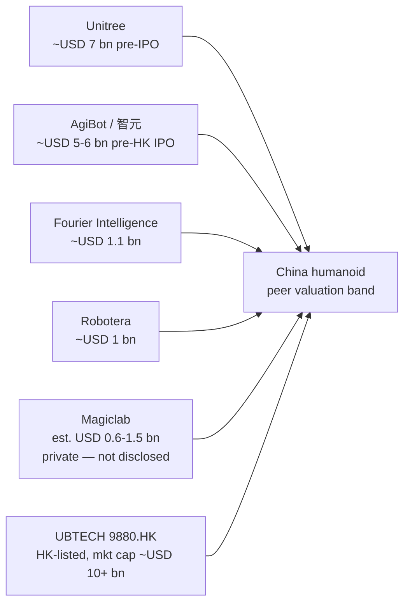
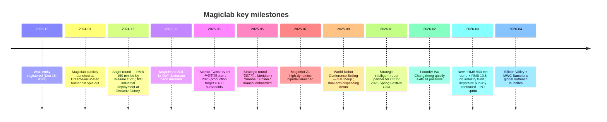
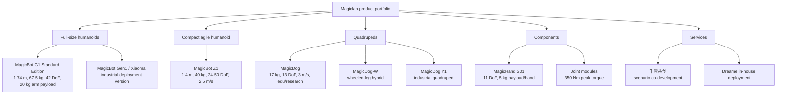
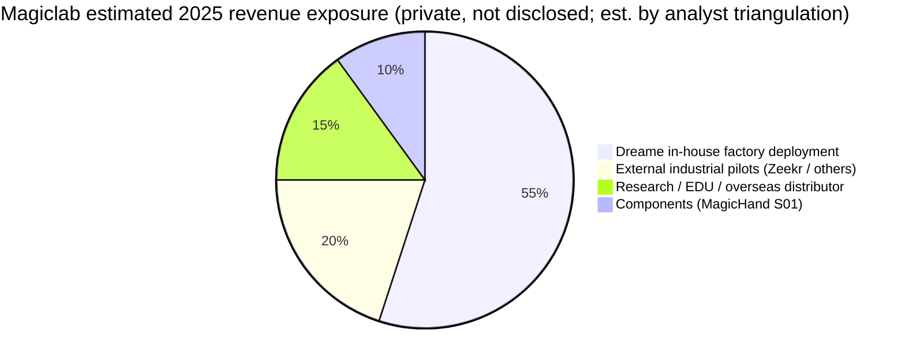
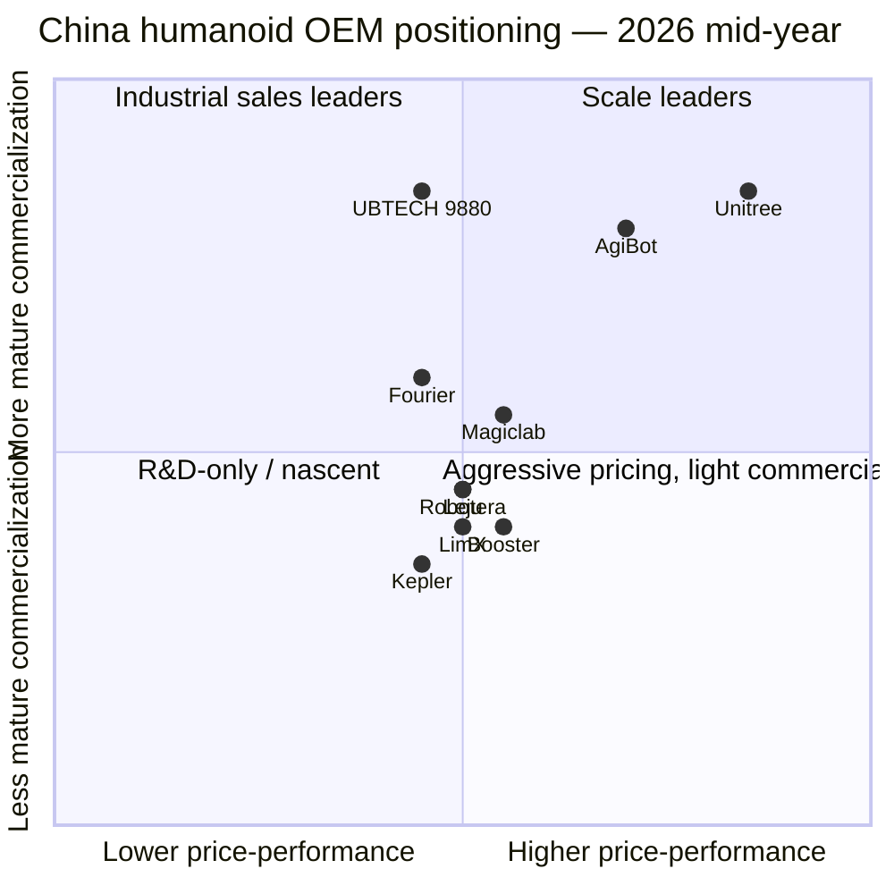
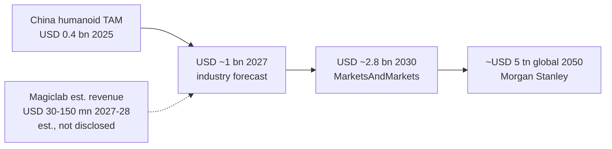

# COMPANY RESEARCH REPORT: Magiclab (魔法原子)

**Private — Suzhou / Wuxi, China**
**Date:** 2026-05-19

> **Update — Founder Wu Changzheng departed at the IPO sprint (2026-03-06):** Founder, former CEO and "公司灵魂" Wu Changzheng (吴长征) confirmed his full exit from Magiclab and all subsidiary entities at end-February 2026, just as the company closed a fresh ~RMB 500 mn ("数亿元") strategic round and announced a RMB 10.5 bn embodied-AI industry fund alongside the financing. Co-founder / CTO Chen Chunyu (陈春雨) has taken over day-to-day technology leadership; no replacement CEO has been named. Reporting attributes the split to a strategic disagreement between Wu (preferring heavier core-tech R&D investment) and key investors (preferring an accelerated commercialization / IPO timeline in 2026, the industry's recognized "delivery year").
> Source: [36氪 — 《魔法原子的冰与火：完成新一轮5亿融资 IPO关键期创始人离职》, 2026-03-12](https://36kr.com/p/3719966575817477); cross-ref [Tencent News — 《冲击IPO前，魔法原子创始人吴长征离奇"出局"》, 2026-03-16](https://news.qq.com/rain/a/20260316A07D9800); [Gasgoo Auto News — "MagicLab's management undergoes major reshuffle", 2026-03](https://autonews.gasgoo.com/articles/news/magiclabs-management-undergoes-major-reshuffle-2030905648093446145).

---

## TABLE OF CONTENTS
1. Company Overview
2. Company History
3. Management Team
4. Products & Services
5. Customers & Go-to-Market
6. Industry Overview
7. Competitive Landscape
8. Market Opportunity (TAM)
9. Risk Assessment
10. References

======================================

## 1. Company Overview

Magiclab (魔法原子, "Magic Atom"), legally **魔法原子机器人科技（无锡）有限公司** (with a wholly-owned Suzhou subsidiary 魔法原子机器人科技（苏州）有限公司 established 2024-12-12), is a privately held Chinese embodied-intelligence and humanoid-robot company incubated in late 2023 / early 2024 inside the **Dreame Technology (追觅科技)** ecosystem in Jiangsu province. The company designs, manufactures and operates a portfolio of full-size bipedal humanoid robots (MagicBot series), bionic and wheeled quadrupeds (MagicDog series), and proprietary subsystems — most prominently the MagicHand S01 dexterous hand — that it sells both as integrated platforms and as components to research labs, universities, automotive OEMs, and Dreame's own factories. Magiclab's positioning, in its own words, is a "general-purpose robot + embodied-intelligence" technology company with end-to-end capability spanning algorithms, hardware, production and after-sales service ([Magiclab — 关于我们](https://www.magiclab.top/en/about)).

The business model has two legs. **Leg one is hardware**: Magiclab sells humanoid and quadruped robots — flagship MagicBot G1 humanoid (full-size, 1.74 m), MagicBot Z1 (1.4 m agile bipedal), MagicDog (consumer/research), MagicDog-W (wheeled), MagicDog Y1 (industrial), and the MagicHand S01 dexterous hand — to a mix of B2B and research customers, plus a small consumer/edu channel via overseas distributors such as Wellbots and Robots International. The MagicBot G1 standard edition list price in the U.S. distributor channel is published in the high-five-figure to low-six-figure USD range, broadly comparable to the Unitree H1 / G1 EDU tiers and below UBTECH's Walker S series ([MagicLab MagicBot G1 page, Wellbots](https://www.wellbots.com/products/magicbot-g1); [MagicLab MagicBot G1 page, americansatellite.us](https://www.americansatellite.us/MagicLab-MagicBot-G1-Humanoid-Robot.htm)). **Leg two is "Scenarios as a Service"**: under the **"千景共创" ("Thousand Scenes Co-creation") Plan** announced March 2025 at the *Atomic Twins* event, Magiclab places humanoids inside customer plants on a co-development basis, using each deployment to harvest manipulation data, fine-tune VLA (vision-language-action) policies, and convert pilot success into production orders. The first commercial closed loop ("商业闭环") is being built **inside the Dreame ecosystem** itself ([观察者网, 2025-03-27](https://www.guancha.cn/economy/2025_03_27_770030.shtml); [stcn.com — 魔法原子"全家福"亮相WRC 2025, 2025-08](https://www.stcn.com/article/detail/3020489.html)).

**Geography:** registered HQ is **Wuxi, Liangxi District, Jianghai West Road 98** (Liangxi Science & Technology City), with the Suzhou subsidiary acting as the principal R&D / operations base near Dreame's Suzhou stronghold. The R&D and supply-chain footprint spans the Yangtze River Delta — Suzhou for component supply and Dreame-adjacent assembly, Wuxi for HQ administration and a billion-yuan industrial fund partnered with the local government, and a Beijing engineering office anchored on ex-Xiaomi quadruped-team alumni ([Baidu Baike — 魔法原子机器人科技（无锡）有限公司](https://baike.baidu.com/item/%E9%AD%94%E6%B3%95%E5%8E%9F%E5%AD%90%E6%9C%BA%E5%99%A8%E4%BA%BA%E7%A7%91%E6%8A%80%EF%BC%88%E6%97%A0%E9%94%A1%EF%BC%89%E6%9C%89%E9%99%90%E5%85%AC%E5%8F%B8/66826567); [qcc.com profile](https://www.qcc.com/firm/310d41050d97da6b83fcfddd1705db4f.html)). Overseas, Magiclab has hosted "global presence" launches in Silicon Valley and at MWC Barcelona in 2026, framed as the company's first international R&D and partnership outreach ([Global Times, 2026-04](https://www.globaltimes.cn/page/202604/1360131.shtml); [Web Disclosure, 2026 MWC release](https://www.webdisclosure.com/press-release/magiclab-etr-from-cultural-icon-to-commercial-path-magiclab-redefines-the-future-of-robotics-at-mwc-yyzOTxriFRk)).

**Scale and headcount:** Magiclab does not publish formal headcount. Press around the March 2026 management reshuffle describes a "new executive team lineup spanning critical areas — R&D, data platforms, core components, ecosystem building, and market expansion," with members coming from Alibaba, Huawei, NIO and UBTECH and from robotics-focused academia ([Gasgoo Auto News, 2026-03](https://autonews.gasgoo.com/articles/icv/major-personnel-reshuffle-what-game-is-magiclab-playing-2031210142819794944)). Best-estimate (not officially disclosed) staffing is **a few hundred employees**, weighted to engineering — typical for a Series-A-stage embodied-AI hardware startup with one factory pilot site and a single product line in low-volume production. **Production target for 2025 was ~400 humanoid units**, of which "几百台" ("several hundred") were targeted for delivery inside the Dreame ecosystem and external pilot customers ([guancha.cn, 2025-03-27](https://www.guancha.cn/economy/2025_03_27_770030.shtml)). Actual 2025 shipments and 2026 revenue are not publicly disclosed; private — not disclosed.

**Valuation snapshot (private — substitute funding-round valuation per the company-research skill).** Magiclab has raised at least three publicly-reported rounds across the Angel through pre-IPO strategic stages, with Dreame's CVC arm 追创创投 anchoring each round ([新华日报 — 半年两轮融资均过亿, 2025-05](https://www.xhby.net/content/s68270dbde4b0ec5323b4fa85.html); [iotworld — 魔法原子获数亿元融资，预期订单破千台](https://mobile.iotworld.com.cn/View.aspx/News-0e405cfdc0a36bfd)):

| Round | Date | Size | Lead / participants | Source |
|---|---|---|---|---|
| Angel | 2024-12 | RMB 150 mn (~USD 20.6 mn) | Led by **追创创投 (Zhuichuang Venture / Dreame CVC)**; with 翼朴基金 (Yipu Fund) | [Yicai Global, 2024-12](https://www.yicaiglobal.com/news/chinese-embodied-ai-startup-magiclab-bags-usd206-million-in-angel-funds-report-says); [阿里云创业, 2024-12](https://startup.aliyun.com/info/1090884.html) |
| Strategic | 2025-05-15 | "数亿元" (several hundred million RMB) | 禾创致远, 芯联资本; 华映资本 (Meridian China), 晓池资本, 元禾厚望; existing investors 追创创投 + 翼朴基金 doubled-down | [DoNews, 2025-05](https://www.donews.com/article/detail/8280/84855.html); [Gasgoo, 2025-05](https://autonews.gasgoo.com/articles/icv/seeds-magiclab-officially-announces-500-million-yuan-new-funding-2031616054575349761); [新华日报, 2025-05](https://www.xhby.net/content/s68270dbde4b0ec5323b4fa85.html) |
| Strategic (Pre-A / "Series A" per PitchBook) | 2026-03-09 | RMB 500 mn ("5亿元") | Investor names not all disclosed; announced alongside a **RMB 10.5 bn embodied-AI industry fund** | [Sina Finance, 2026-03-12](https://finance.sina.com.cn/stock/newstock/2026-03-12/doc-inhqtyye1567142.shtml); [36氪, 2026-03-12](https://36kr.com/p/3719966575817477) |

**Post-money valuation is not publicly disclosed** for any of the three rounds — *private; no disclosed valuation*. Peer-implied range: at China-humanoid Series-A multiples in 2025–26 (Unitree pre-IPO ~USD 7 bn, AgiBot HK pre-IPO ~USD 5–6 bn, Fourier ~USD 1.1 bn, Robotera ~USD 1 bn, see Section 7), Magiclab's three-round cumulative raise of roughly RMB 1.0–1.5 bn (~USD 140–210 mn) and its 2026 IPO ambitions imply that the latest post-money is most plausibly in the **USD 600 mn – USD 1.5 bn band** — clearly an *est., based on cross-peer comp triangulation*, not a disclosed figure. Note that one industry tracker explicitly ranked Magiclab #5 among Chinese humanoid companies by valuation, behind Unitree, AgiBot, Fourier and Robotera ([XCarspace — Top 20 Chinese Humanoid Robot Companies, 2026](https://xcarspace.com/top-20-chinese-humanoid-robot-companies-ranked-by-valuation/)).

**Revenue and gross-margin trend (private — not disclosed).** Public sources do not break out Magiclab's revenue; a useful proxy is the 2025 production target of ~400 humanoids ([guancha.cn, 2025-03-27](https://www.guancha.cn/economy/2025_03_27_770030.shtml); [科技行者, 2025-03](https://www.techwalker.com/2025/0327/3164737.shtml)) — at an ASP of roughly RMB 250k–500k per industrial-grade unit (broadly consistent with the published USD 30k–80k Unitree and UBTECH-Walker tier — see [Unitree G1 shop page](https://shop.unitree.com/products/unitree-g1); [PR Newswire — UBTECH Walker S2 800M yuan order book, 2025-11](https://www.prnewswire.com/news-releases/ubtech-humanoid-robot-walker-s2-begins-mass-production-and-delivery-with-orders-exceeding-800-million-yuan-302616924.html)), that implies an *est. ~RMB 100–200 mn revenue run-rate exiting 2025*, with the bulk captive to the Dreame ecosystem ([DoNews — 魔法原子完成数亿元新融资, 2025-05](https://www.donews.com/article/detail/8280/84855.html)). Gross margins on humanoid hardware industry-wide remain negative-to-low-single-digit at sub-1k-unit scale ([Humanoids Daily — Great Valuation Chasm, 2025](https://www.humanoidsdaily.com/news/the-great-valuation-chasm-a-2025-guide-to-the-humanoid-robotics-capital-race)); Magiclab specifically has not disclosed margins.

> 
> *Schematic peer comparison; sources for each peer figure cited in Section 7. No PNG was generated for this private company; Mermaid alternative below.*

Sources: see Section 7 peer table for each figure.

## 2. Company History

Magiclab was conceived in **late 2023** and formally incorporated in **December 2023 / January 2024** as a Dreame-incubated spin-out, with the founding engineering team drawn primarily from **Xiaomi's CyberDog (铁蛋) quadruped robot project** and a smaller Dreame-internal motor / actuator group. The thesis: Dreame had spent eight years building the highest-volume, lowest-cost vertically integrated motor + autonomy stack in Chinese consumer robotics (robot vacuums, sticks, dryers); that stack — proprietary high-speed motors, planetary gearboxes, vSLAM, sensor fusion, edge AI — was structurally re-usable for humanoid actuators, balance control and home/industrial perception. By spinning a dedicated humanoid entity (rather than building inside Dreame), founder **Yu Hao (俞浩)** of Dreame could (a) recruit world-class robotics talent at venture compensation, (b) attract external strategic and financial capital alongside Dreame CVC, and (c) keep the humanoid bet ring-fenced from Dreame's core appliance P&L ([PandaYoo — Dreame Technology: The Full Story of a Chinese Tech Challenger](https://pandayoo.com/post/dreame-technology-the-full-story-of-a-chinese-tech-challenger/); [Caixin Global — Dreame's $100 Trillion Vision, 2026-05-08](https://www.caixinglobal.com/2026-05-08/in-depth-dreames-100-trillion-vision-tests-chinas-make-everything-tech-playbook-102441968.html)).

The strategic pivot from the original "Dreame internal R&D project" to a stand-alone, externally-funded company happened in mid-to-late 2024, around the Angel close. By **December 2024** Magiclab announced **RMB 150 mn Angel funding** led by Dreame's CVC arm 追创创投 and disclosed the company's first publicly-shown industrial deployment: MagicBots performing material handling, inspection and dispensing tasks inside Dreame's own Suzhou factory ([CMRA, 2024-12](https://cnmra.com/magiclab-secures-over-150-million-rmb-in-funding-for-humanoid-robotics-development/); [SHINE — MagicLab unveils Xiaomai, 2025-03](https://www.shine.cn/biz/tech/2503277977/)). Two months later (Feb 2025), Magiclab unveiled the **MagicHand S01** — its in-house 11-DoF dexterous hand — pitched as the missing piece for general-purpose humanoid manipulation ([RoboticsTomorrow, 2025-02-19](https://www.roboticstomorrow.com/news/2025/02/19/magiclab-unveils-magichand-s01-dexterous-hand-progressing-toward-mass-adoption-of-humanoid-robots/24211); [Yahoo Finance, 2025-02-19](https://finance.yahoo.com/news/magiclab-unveils-magichand-s01-dexterous-143900164.html)).

**March 2025**: Magiclab held its "Atomic Twins" (原生双子) scenario strategy launch, unveiling the **千景共创 ("Thousand Scenes Co-creation")** plan and a **2025 production target of ~400 humanoid units** into industrial and commercial scenarios. **May 2025**: closed a second strategic round of "several hundred million RMB". **July 2025**: unveiled the **MagicBot Z1**, the agile high-dynamic bipedal humanoid that would become the company's marketing centerpiece, with the published claim of being the first robot to perform a "Thomas flair" (a difficult gymnastics maneuver). **August 2025 (WRC, Beijing)**: showed the full "family portrait" (full-size humanoid, Z1, MagicDog, MagicDog-W, MagicDog Y1, MagicHand S01) and demonstrated dual-arm dispensing on a simulated assembly line ([stcn.com, 2025-08](https://www.stcn.com/article/detail/3020489.html); [RoboHub on X — MagicBot Z1 launch, 2025-07-08](https://x.com/XRoboHub/status/1942531381793587235)).

**Late 2025 / January 2026**: Magiclab signed on as the intelligent-robot strategic partner for **CCTV's 2026 Spring Festival Gala (春晚)** — a defining national-stage marketing moment in which a MagicBot Gen1 waved during the opening, a MagicBot Z1 became the first humanoid to publicly land a "Thomas 360°" pommel-horse flair, and ~100 MagicDog quadrupeds performed a synchronized dance with Taiwanese actor Jerry Yan ([Sixth Tone, 2026](https://www.sixthtone.com/news/1018219/year-of-the-robot%3A-humanoids-lead-a-tech-heavy-spring-festival-gala); [TechNode, 2026-02-17](https://technode.com/2026/02/17/humanoid-robots-take-center-stage-at-2026-spring-festival-gala-revealing-chinas-latest-robotics-advances/); [PandaYoo — Inside the 2026 Spring Festival Gala](https://pandayoo.com/post/inside-the-2026-spring-festival-gala-how-chinese-humanoid-robots-stole-the-show/)). Press subsequently reported Magiclab had spent ~RMB 100 mn ("花1亿") on the Gala sponsorship, a figure the company has not formally confirmed ([Sina Finance — 花1亿上春晚, 2026-03-18](https://finance.sina.com.cn/wm/2026-03-18/doc-inhrmihm7462144.shtml)).

**March 2026 — founder departure.** Founder/CEO Wu Changzheng formally exited at end-February, announced publicly on 2026-03-06 ([东方财富 — 魔法原子技术总裁吴长征正式离职, 2026-03-06](https://finance.eastmoney.com/a/202603063664217769.html); [中国基金报 — 魔法原子原总裁吴长征离职](https://www.chnfund.com/article/ARdf138ba1-ad9e-4532-aef1-3a1fd47350ca)). Co-founder Gu Shitao (顾世韬) and CTO Chen Chunyu took executive control; a new RMB 500 mn round and a RMB 10.5 bn embodied-AI industry fund were announced alongside the exit ([36氪 — 魔法原子的冰与火, 2026-03-12](https://36kr.com/p/3719966575817477); [Gasgoo Auto News — Major Personnel Reshuffle, 2026-03](https://autonews.gasgoo.com/articles/icv/major-personnel-reshuffle-what-game-is-magiclab-playing-2031210142819794944)). The simultaneous *fundraise + founder-departure + Gala marketing campaign* configuration — at the IPO sprint — is the single most consequential strategic discontinuity in the company's short life and is the central element of this report's risk profile (see Section 9).

Source: composite timeline from [Baidu Baike, 2026](https://baike.baidu.com/en/item/Magiclab%20Robotics%20Technology%20(Wuxi)%20Co.,%20Ltd./1538573); [36氪, 2026-03-12](https://36kr.com/p/3719966575817477); [Yicai Global, 2024-12](https://www.yicaiglobal.com/news/chinese-embodied-ai-startup-magiclab-bags-usd206-million-in-angel-funds-report-says); [Gasgoo Auto News, 2025-05](https://autonews.gasgoo.com/articles/icv/seeds-magiclab-officially-announces-500-million-yuan-new-funding-2031616054575349761).

## 3. Management Team

### Wu Changzheng (吴长征) — Founder, former President / CEO (departed 2026-02)

Wu Changzheng is — or was — Magiclab. He carried the company from a Dreame-internal incubation idea in late 2023 to a national-stage Spring Festival Gala sponsor in early 2026 and, in the words of multiple Chinese tech-press outlets, was "公司灵魂" (the company's soul) ([钛媒体 — 春晚机器人"魔法"失灵？魔法原子CEO吴长征突然离职, 2026-03](https://www.tmtpost.com/7903082.html); [搜狐 — 魔法原子创始人兼CEO吴长征离职, 2026-03](https://www.sohu.com/a/992953720_122014422)). His sudden exit in March 2026 is the single most material management event in any humanoid-robot company this year and warrants the longest bio in this report ([36氪 — 离开了吴长征，魔法原子还有上市"魔法"吗？, 2026-03](https://36kr.com/p/3719880601498375)).

**Background.** Wu holds a master's degree in robotics from **Shanghai Jiao Tong University (上海交通大学)**, China's strongest robotics academic program outside Tsinghua. After SJTU he joined **普渡科技 (Pudu Robotics)** in 2018 to lead quadruped-robot R&D, helping Pudu (a service-robot specialist) build out a quadruped product line. In 2021 he was recruited into **Xiaomi (小米)** to lead the **CyberDog "铁蛋" (Iron Dog) bionic quadruped** program — China's most-publicized consumer-facing quadruped before Unitree's H1 era; Xiaomi launched CyberDog publicly in August 2021 and CyberDog 2 in August 2023 under Wu's technical leadership ([搜狐 — 魔法原子创始人兼CEO吴长征离职, 2026-03](https://www.sohu.com/a/992953720_122014422); [瑞财经 — 魔法原子再获数亿元融资，创始人吴长征曾主导小米首款四足机器人"铁蛋"研发, 2025-05](https://m.rccaijing.com/news-7329061872610244508.html)).

In January 2024 Wu left Xiaomi and partnered with Dreame founder **Yu Hao (俞浩)** to spin out Magiclab, serving as **总裁 (President)** of Magiclab Robotics Technology (Wuxi) Co., Ltd. and the operating face of the company across every press cycle from the December 2024 Angel raise through the 2026 Spring Festival Gala. Multiple sources credit Wu with the dual decision to (a) found Magiclab on a **scenarios-first commercialization model** (千景共创) rather than a pure R&D playbook, and (b) build the in-house **MagicHand S01** rather than license a competitor's dexterous hand — a decision that became central to Magiclab's competitive narrative ([钛媒体 — 春晚机器人"魔法"失灵？魔法原子CEO吴长征突然离职, 2026-03](https://www.tmtpost.com/7903082.html); [Caifuhao Eastmoney — 吴长征退出了自己创办的机器人公司, 2026-03](https://caifuhao.eastmoney.com/news/20260306071529709718540)).

**The exit.** Magiclab's official statement was bland ("personal reasons"); the company **expressly denied "理念分歧" (philosophical differences)** with investors. Reporting from 36Kr, Tencent News, Caixin-affiliated outlets, and Tian Mei Ti (钛媒体) however converges on a single narrative: Wu wanted to keep heavy core-tech investment going (in particular, deeper foundation-model / VLA work and continued R&D on actuators); investors — looking at 2026 as the industry "交付年" (delivery year) and at AgiBot's HK IPO and Unitree's STAR-market filing — wanted accelerated commercialization and an IPO. The "花1亿上春晚" ("spent RMB 100 mn on the Spring Festival Gala") story, leaked in mid-March, was widely interpreted as one symptom of the spending-philosophy disagreement. Wu's ownership stake at exit was not publicly disclosed; *private — not disclosed*. He is reported to have begun a new robotics venture, though details remain unconfirmed ([36氪 — 离开了吴长征，魔法原子还有上市"魔法"吗？, 2026-03](https://36kr.com/p/3719880601498375); [Sina Finance — 花1亿上春晚, 2026-03-18](https://finance.sina.com.cn/wm/2026-03-18/doc-inhrmihm7462144.shtml)).

### Yu Hao (俞浩) — Founder and CEO of Dreame Technology; Magiclab's principal sponsor and strategic backer

Yu Hao is **not** Magiclab's CEO. He is, however, the indirect controlling force behind it — Magiclab was incubated inside Dreame, takes its capital from Dreame's CVC arm 追创创投, draws its supply chain from Dreame's vertically-integrated motor / sensor base, and uses Dreame's own factories as its first commercial customer ([Sina Finance — 100亿！独角兽追觅的CVC基金落地, 2025-04-11](https://finance.sina.com.cn/roll/2025-04-11/doc-inesuxcv2516054.shtml); [guancha.cn — 追觅子公司人形机器人亮相, 2025-03-27](https://www.guancha.cn/economy/2025_03_27_770030.shtml)).

Yu Hao was born 1987, admitted to **Tsinghua University (清华大学)** in 2005 on a Physics Olympiad path, studied aerospace engineering / computational fluid mechanics, and founded the "Sky Workshop" (天空工厂) hackerspace at Tsinghua in 2009. He worked early on quadcopters (2007) and on the Boeing-sponsored Sky Workshop program before founding Dreame in 2015 in Suzhou. Dreame today is the world's #2 robot-vacuum brand, a multi-billion-USD revenue Chinese consumer-tech champion, and the parent of a sprawling ecosystem (953 ecosystem companies per recent reporting) spanning hairdryers, action cameras, electric scooters, pool-cleaners, EVs (announced 2025) and humanoids ([Baidu Baike — Yu Hao](https://baike.baidu.com/en/item/Yu%20Hao/941229); [Momentum Works — Building the greatest company in human history: Yu Hao, 2025](https://thelowdown.momentum.asia/building-the-greatest-company-in-human-history-dreame-founder-yu-hao/); [Caixin Global — Dreame's $100 Trillion Vision, 2026-05-08](https://www.caixinglobal.com/2026-05-08/in-depth-dreames-100-trillion-vision-tests-chinas-make-everything-tech-playbook-102441968.html); [BigGo Finance — Dreame ecosystem expansion, 2026](https://finance.biggo.com/news/iIgRLJ4BoicNoOgCAcdq)).

Yu's public framing of his ambition — "build the greatest company in human history," a "hundred-trillion-yuan ecosystem," and the personal aspiration to become "the world's richest person within five years" — is essential context for Magiclab ([Caixin Global — Dreame's $100 Trillion Vision, 2026-05-08](https://www.caixinglobal.com/2026-05-08/in-depth-dreames-100-trillion-vision-tests-chinas-make-everything-tech-playbook-102441968.html); [Futunn — Yu Hao responded to controversy](https://news.futunn.com/en/post/67539365/yu-hao-ceo-of-dreame-technology-responded-to-the-controversy)). The humanoid bet is *one of dozens* of vertical bets Yu is making across his ecosystem-investment platform 追创创投; Yu is a founder-as-portfolio-allocator with extreme ambition and very high concurrent bet count ([36Kr EU — Dreame's Swift Expansion: Ten Incubators and Internal Competition](https://eu.36kr.com/en/p/3797890451840257); [BigGo Finance — Dreame ecosystem expansion 953 companies, 2026](https://finance.biggo.com/news/iIgRLJ4BoicNoOgCAcdq)). **The investor-vs-founder tension Wu Changzheng ran into in early 2026 is, in part, structurally inherent to this model**: Magiclab is one bet in a 953-company ecosystem ([BigGo Finance, 2026](https://finance.biggo.com/news/iIgRLJ4BoicNoOgCAcdq)), and Yu's framing optimizes for "ecosystem velocity" (rapid scenario landings + capital cycling + IPOs) rather than for any single portfolio company's R&D depth ([36氪 — 魔法原子的冰与火, 2026-03-12](https://36kr.com/p/3719966575817477)).

**Magiclab–Dreame supply-chain spillover.** Dreame's eight-year industrialization of: (a) high-speed BLDC motors (originally for hairdryer applications, since adapted to robot-vacuum drive and humanoid joints) — Dreame's self-developed 150,000-RPM digital motor and Suzhou smart-motor factory provide the actuator platform ([PR Newswire — Dreame CES 2025 with multi-joint robotic arm technology, 2025-01](https://www.prnewswire.com/news-releases/dreame-technology-stuns-ces-2025-with-innovative-technologies-including-its-groundbreaking-bionic-multi-joint-robotic-arm-technology-and-a-full-range-of-products-such-as-the-x50-ultra-302344322.html); [PandaYoo — Dreame Technology: The Full Story of a Chinese Tech Challenger](https://pandayoo.com/post/dreame-technology-the-full-story-of-a-chinese-tech-challenger/)), (b) planetary gearboxes and harmonic reducers (sourced via Dreame's existing supplier panel — Inovance, Greenmaster, Leaderdrive — note Leaderdrive holds ~30–40% of China's harmonic-reducer market and counts AgiBot and UBTECH among customers, per [humanoid.guide — Leaderdrive harmonic reducers rise on humanoid demand](https://humanoid.guide/leaderdrive-harmonic-reducers-surge-as-humanoid-demand-lifts-shares/)), (c) vSLAM + ToF + lidar sensor fusion (productized in robot vacuums), and (d) Suzhou-based assembly capacity for sub-1 mn-unit consumer electronics ([Caixin Global, 2026-05-08](https://www.caixinglobal.com/2026-05-08/in-depth-dreames-100-trillion-vision-tests-chinas-make-everything-tech-playbook-102441968.html)) — has been described by both Yu Hao and external commentary as the **structural moat behind Magiclab**: a Chinese humanoid company that owns its key actuator and sensor BOM through the Dreame ecosystem and can run its first 400-unit pilot inside captive Dreame factories without external customer-acquisition cost ([DoNews — 魔法原子完成数亿元新融资, 2025-05](https://www.donews.com/article/detail/8280/84855.html); [新华日报, 2025-05](https://www.xhby.net/content/s68270dbde4b0ec5323b4fa85.html)).

### Chen Chunyu (陈春雨) — Co-founder, CTO; de-facto operational leader since 2026-03

Following Wu Changzheng's departure, **Chen Chunyu** took over full responsibility for Magiclab's technology system and core-product development; she is reported as the de-facto operational leader of the company in the absence of a named CEO. Chen is described as a co-founder with "over a decade of R&D and management experience" ([Sohu — 魔法原子创始人兼CEO吴长征离职, 2026-03](https://www.sohu.com/a/992953720_122014422); [腾讯新闻, 2026-03-16](https://news.qq.com/rain/a/20260316A07D9800)). Specific prior employer history is not consistently disclosed in public Chinese press; *private — not disclosed*. The reshuffle press releases note the broader exec lineup spans "R&D, data platforms, core components, ecosystem building, and market expansion" and includes ex-Alibaba, ex-Huawei, ex-NIO, ex-UBTECH and academic robotics hires ([Gasgoo Auto News — Major Personnel Reshuffle, 2026-03](https://autonews.gasgoo.com/articles/icv/major-personnel-reshuffle-what-game-is-magiclab-playing-2031210142819794944)).

### Gu Shitao (顾世韬) — Co-founder; principal IPO spokesperson

Co-founder Gu Shitao is the principal external voice on Magiclab's IPO ambitions, having publicly stated in early 2026 that the company is "following the fastest IPO schedule" and that "secondary-market news could come in 2026" ([36氪, 2026-03-12](https://36kr.com/p/3719966575817477)). Specific prior employment history is not publicly disclosed in the sources reviewed for this report.

### Gao Chunchao (高春潮) — Core components / motor lead

Press around the leadership reshuffle identifies **Gao Chunchao** — formerly leading the Dreame Technology high-speed-motor development and mass-production team — as the lead for Magiclab's core-component program, illustrating the direct people-flow from Dreame's industrial base into Magiclab's actuator and motor R&D ([Gasgoo Auto News, 2026-03](https://autonews.gasgoo.com/articles/news/magiclabs-management-undergoes-major-reshuffle-2030905648093446145)).

### Governance and ownership

Magiclab is **privately held**. The legal-representative / 法定代表人 of the Wuxi parent is recorded per business-registry data ([qcc.com firm profile](https://www.qcc.com/firm/310d41050d97da6b83fcfddd1705db4f.html); [Baidu Baike — Wuxi entity](https://baike.baidu.com/item/%E9%AD%94%E6%B3%95%E5%8E%9F%E5%AD%90%E6%9C%BA%E5%99%A8%E4%BA%BA%E7%A7%91%E6%8A%80%EF%BC%88%E6%97%A0%E9%94%A1%EF%BC%89%E6%9C%89%E9%99%90%E5%85%AC%E5%8F%B8/66826567)); the romanization in public Chinese registries reads "Chen Chunyu", same name as the CTO, with press references occasionally cross-pollinating the two — *cross-identity unverified*. Shareholding is dominated by Dreame-affiliated entities and the listed VC investors above; precise cap-table breakdowns are *private — not disclosed* ([36氪, 2026-03-12](https://36kr.com/p/3719966575817477)). There is no public board composition. Founder ownership at exit is not disclosed. Compensation structure is not disclosed. Related-party transactions — particularly the supply-chain and customer relationship with Dreame Technology — are economically material but have not been formally quantified in any public filing ([DoNews, 2025-05](https://www.donews.com/article/detail/8280/84855.html)).

### Track-record synthesis

The Magiclab team's strongest track record is in **quadruped robotics commercialization**: Wu personally led Xiaomi CyberDog from concept to two-generation product launch (2021 and 2023) ([Baidu Baike — 吴长征](https://baike.baidu.com/item/%E5%90%B4%E9%95%BF%E5%BE%81/66714615); [techxplore — Xiaomi unveils CyberDog, 2021-08](https://techxplore.com/news/2021-08-xiaomi-unveils-cyberdog-personable-quadruped.html)), and Gao led Dreame's high-speed motor program from internal R&D to multi-million-unit annual production ([Gasgoo Auto News, 2026-03](https://autonews.gasgoo.com/articles/news/magiclabs-management-undergoes-major-reshuffle-2030905648093446145)). These are the deepest credentials in the Chinese humanoid space outside Unitree's Wang Xingxing himself ([TheIcons — China's Iron Legion, 2026-03](https://theicons.com/2026/03/12/2026-cctv-spring-festival-gala-robotics-companies/)). The principal team-level gap is **bipedal humanoid commercialization at scale** — neither Wu nor Chen had run a humanoid hardware program through a production cycle before Magiclab ([36氪 — 离开了吴长征，魔法原子还有上市"魔法"吗？, 2026-03](https://36kr.com/p/3719880601498375)), and the post-Wu management team is now untested at the IPO scale-up they're attempting. Magiclab's bench depth (Alibaba / Huawei / NIO / UBTECH alumni) is real but unproven as a unit ([Gasgoo Auto News — Major Personnel Reshuffle, 2026-03](https://autonews.gasgoo.com/articles/icv/major-personnel-reshuffle-what-game-is-magiclab-playing-2031210142819794944)).

## 4. Products & Services

Magiclab's product portfolio falls into four families: full-size humanoids (MagicBot G1 / Gen1 / "Xiaomai"); high-dynamic compact humanoids (MagicBot Z1); quadrupeds (MagicDog, MagicDog-W, MagicDog Y1); and proprietary subsystems sold as components (MagicHand S01 dexterous hand, and proprietary joint modules) ([Magiclab — Humanoid Robot G1](https://www.magiclab.top/en/human); [Magiclab — MagicDog Y1](https://www.magiclab.top/en/dog-y); [Magiclab — MagicHand S01](https://www.magiclab.top/en/parts/hand)). The company also offers integrated "scenarios" deployment under the 千景共创 program, which from a financial perspective is a services / scenario-license model on top of hardware ([DoNews — 魔法原子完成数亿元新融资, 2025-05](https://www.donews.com/article/detail/8280/84855.html); [stcn.com — 魔法原子WRC 2025, 2025-08](https://www.stcn.com/article/detail/3020489.html)).

Source: [Magiclab — Humanoid Robot G1 page](https://www.magiclab.top/en/human); [Magiclab — Bionic Quadruped Robot page](https://www.magiclab.top/en/dog); [Magiclab — MagicDog Y1 page](https://www.magiclab.top/en/dog-y); [Magiclab — MagicHand S01 page](https://www.magiclab.top/en/parts/hand).

### Full-size humanoid: MagicBot G1 (and Xiaomai industrial variant)

**Specs**: ~174 cm × 58 cm × 28 cm, ~67.5 kg, ~42 DoF, dual-arm 20 kg payload each (total 40 kg body payload), peak joint torque ≥350 N·m, motion speed ≥2 m/s, 25 Ah / ~1.35 kWh battery delivering ~4–5 hours of continuous operation, WiFi 6 + 4G / 5G + Bluetooth 5.2 connectivity ([wellbots.com — MagicBot G1](https://www.wellbots.com/products/magicbot-g1); [americansatellite.us — MagicBot G1](https://www.americansatellite.us/MagicLab-MagicBot-G1-Humanoid-Robot.htm); [HouseBots — MagicLab MagicBot](https://housebots.com/robot/magiclab-magicbot); [robozaps.com — MagicBot Review, 2026](https://blog.robozaps.com/b/magiclab-magicbot-review)).

**Target customer**: industrial pilot customers (Dreame factories first, then automotive / electronics / logistics), plus research and education buyers via the U.S. distributor channel ([SHINE — MagicLab unveils Xiaomai, 2025-03](https://www.shine.cn/biz/tech/2503277977/); [InterestingEngineering — MagicLab humanoid army in factory](https://interestingengineering.com/innovation/magiclab-robot-army-in-factory); [wellbots.com — MagicBot G1 page](https://www.wellbots.com/products/magicbot-g1)).

**Pricing**: list-price published on U.S. distributor channels; precise figure varies between distributors and is not officially published by Magiclab. The G1 fits the broader 1.7–1.8 m humanoid Chinese-OEM tier of roughly **USD 30k–80k for an EDU/industrial-grade unit**, in line with Unitree's H1 (~USD 90k) and below UBTECH Walker S2 (commercial pricing not publicly disclosed but estimated higher per the 800 mn yuan / 500-unit FY25 disclosed by UBTECH, implying ~USD 220k unit ASP) ([UBTECH press release, 2025-11](https://www.prnewswire.com/news-releases/ubtech-humanoid-robot-walker-s2-begins-mass-production-and-delivery-with-orders-exceeding-800-million-yuan-302616924.html)).

**Competitive-advantage verdict: partial.** *Moat type:* (a) **vertical integration via Dreame ecosystem** — joint modules and high-speed motor stack are in-house / Dreame-sourced, lowering BOM cost relative to startups that rely on external Tier-1 actuator suppliers ([新华日报, 2025-05](https://www.xhby.net/content/s68270dbde4b0ec5323b4fa85.html)); (b) **scenario data** harvested through Dreame in-house factory deployment is genuine and accumulating ([guancha.cn, 2025-03-27](https://www.guancha.cn/economy/2025_03_27_770030.shtml)). *Not yet a moat:* (c) foundation-model / VLA tech is at parity-to-behind Unitree, AgiBot and Figure — industry-wide all of these are still pre-GPT-3-equivalent for embodied AI ([Edge AI and Vision — Humanoid Robots 2025: The Race to Useful Intelligence](https://www.edge-ai-vision.com/2025/11/humanoid-robots-2025-the-race-to-useful-intelligence/); [The Robot Report — VLA models next leap](https://www.therobotreport.com/vision-language-action-models-are-the-next-leap-in-autonomous-robotics/)). **Closest competing product:** Unitree H1 / G1 — both ahead on installed base, foundation-model maturity and unit-shipment scale; MagicBot G1 is at **parity-to-behind** Unitree on tech and well behind on shipments — Unitree shipped ~5,500 humanoids in 2025 (combined G1+H1+R1, ~one-third of global shipments) vs. Magiclab's ~400-unit target ([SCMP — China's Unitree IPO, 2026](https://www.scmp.com/business/banking-finance/article/3347365/chinas-unitree-robotics-rides-humanoid-tide-it-targets-us610m-ipo); [Bloomberg — Chinese Firms Dominated Humanoid Shipments, 2026-01-08](https://www.bloomberg.com/news/articles/2026-01-08/chinese-firms-dominated-global-humanoid-robot-shipments-in-2025)).

### Agile / dynamic humanoid: MagicBot Z1

**Specs**: 1.4 m height, 40 kg, 24–50 DoF (depending on hand option), peak motion ~2.5 m/s, peak joint torque ~130 N·m, ~2 hr battery, optional 11-DoF MagicHand S01 hands (5 kg payload each), sensor stack of 3D LiDAR + depth camera + binocular fisheye + head tactile sensor ([humanoid.guide — MagicBot Z1](https://humanoid.guide/product/magicbot-z1/); [humanoid.press — MagicBot Z1, 2025](https://humanoid.press/database/www-humanoid-press-database-magicbot-z1-humanoid-robot/); [Robotic Gizmos — MagicBot Z1 open source, 2025-07](https://www.roboticgizmos.com/magicbot-z1/)). The Z1 was positioned at launch (July 2025) as the most agile bipedal humanoid in China — the "Thomas flair" Spring Festival Gala stunt is the centerpiece marketing artifact ([TechNode, 2026-02-17](https://technode.com/2026/02/17/humanoid-robots-take-center-stage-at-2026-spring-festival-gala-revealing-chinas-latest-robotics-advances/)).

**Target customer**: research labs, universities, content/marketing/exhibition users, and select industrial dynamic-task pilots. Z1 is more of a marketing flagship and research platform than an industrial workhorse ([humanoid.guide — MagicBot Z1](https://humanoid.guide/product/magicbot-z1/); [Magiclab — MagicBot Z1](https://www.magiclab.top/en/z1); [knowledge.qq.com — 魔法原子首秀MagicBot Z1, 2025-07](https://news.qq.com/rain/a/20250728A0499X00)).

**Competitive-advantage verdict: partial — strong on dynamics, weak on commercial pull.** *Moat type:* **technology / IP** — the actuator + control stack for the Thomas-flair maneuver is a credible demonstration of joint power-density and balance control ([Baidu Baike — MagicBot Z1](https://baike.baidu.com/item/MagicBot%20Z1/67393054); [zhihu — 宇树最大竞争对手, 2025-07](https://zhuanlan.zhihu.com/p/1926664948345468298)). *Closest competing product:* **Unitree G1** (smaller, ~$16k entry, similar height-class — see [botinfo.ai — Unitree G1 Review, 2026](https://botinfo.ai/articles/unitree-g1)) and **Booster Robotics T1**; Z1 is ahead of G1 on peak agility, behind on price-performance and unit shipments. *Risk:* the Z1 is a marketing-led product; it remains to be seen whether the agility actually converts to industrial revenue ([36氪 — 离开了吴长征，魔法原子还有上市"魔法"吗？, 2026-03](https://36kr.com/p/3719880601498375)).

### Quadrupeds: MagicDog series

**MagicDog (consumer/edu)**: ~17 kg, 67 × 35 × 56 cm, 13 DoF, 12 precision aluminum joint motors, max speed 3.0 m/s, 5 kg standard / 10 kg max payload, 15 cm obstacle height, 40° max climbing angle, 29.6 V × 8200 mAh battery for 1.5–3 hours, 2D LiDAR + binocular + depth + 4K + fisheye + ultrasonic sensor suite, 8-core CPU ([aparobot.com — MagicDog](https://www.aparobot.com/robots/magicdog); [wellbots.com — MagicDog](https://www.wellbots.com/products/magiclab-magicdog)).

**MagicDog-W**: wheeled-leg hybrid quadruped that uses four wheeled legs for high-speed locomotion, capable of flips and high-platform climbs ([roboticgizmos.com — MagicDog-W](https://www.roboticgizmos.com/magicdog-w/)).

**MagicDog Y1**: the industrial-spec quadruped, positioned for inspection / patrol / industrial-data-collection deployments ([Magiclab — MagicDog Y1](https://www.magiclab.top/en/dog-y); [stcn.com — WRC 2025, 2025-08](https://www.stcn.com/article/detail/3020489.html)).

**Competitive-advantage verdict: no clear moat.** The Chinese quadruped market is dominated by Unitree (G1, B2, B2-W) — Unitree controls ~70% of the global quadruped market ([SCMP — China's Unitree IPO, 2026](https://www.scmp.com/business/banking-finance/article/3347365/chinas-unitree-robotics-rides-humanoid-tide-it-targets-us610m-ipo)) — and Deep Robotics ([DEEP Robotics official](https://www.deeprobotics.cn/en/wap/company.html)); both lead Magiclab on shipments, price-performance and developer ecosystem. MagicDog is a credible second-tier product but does not have a moat against Unitree. **Closest competing product:** Unitree B2-W (wheeled-leg) — Magiclab is **behind**. The Gala "100-quadruped synchronized dance" was a major marketing win but did not translate to a clear commercial differentiator vs. Unitree's installed-base advantage ([PandaYoo — Inside the 2026 Spring Festival Gala](https://pandayoo.com/post/inside-the-2026-spring-festival-gala-how-chinese-humanoid-robots-stole-the-show/)).

### Component: MagicHand S01 dexterous hand

**Specs**: 11 DoF, 580 g, 12 V / 0.2 A static / 3 A peak, 5 tactile sensors at 0.1 N resolution, ~2.5 kg single-finger gripping force, ~9.1 kg combined four-finger grip, 5 kg payload per hand, 150°/s four-finger flexion speed, hybrid force/position control ([RoboticsTomorrow, 2025-02-19](https://www.roboticstomorrow.com/news/2025/02/19/magiclab-unveils-magichand-s01-dexterous-hand-progressing-toward-mass-adoption-of-humanoid-robots/24211); [humanoid.guide — MagicHand S01](https://humanoid.guide/product/magichand-s01/); [InterestingEngineering — 44 lbs payload dexterous hand](https://interestingengineering.com/innovation/china-magiclabs-robotic-hand-humanoids)).

**Competitive-advantage verdict: yes, partial moat.** The MagicHand S01 is one of the most-cited dexterous hands in the Chinese market: 11 DoF is at the high end of the Chinese-OEM dexterous-hand spec range, and the integrated tactile-feedback + force/position control matches Western leaders (Sanctuary AI / Shadow Robot) at a fraction of the price ([RoboticsTomorrow, 2025-02-19](https://www.roboticstomorrow.com/news/2025/02/19/magiclab-unveils-magichand-s01-dexterous-hand-progressing-toward-mass-adoption-of-humanoid-robots/24211); [InterestingEngineering — 44 lbs payload dexterous hand](https://interestingengineering.com/innovation/china-magiclabs-robotic-hand-humanoids)). *Moat type:* **technology / IP + cost leadership** through Dreame supply-chain integration. *Closest competing product:* Inspire Robotics RH56 series (6-DoF / 12-joint variants) — at rough parity on form-factor but Magiclab claims a tactile/grip-force advantage with 0.1 N resolution on 5 tactile sensors ([Inspire Robots — RH56DFX product page](https://en.inspire-robots.com/product/rh56dfx); [Inspire Robotics RH56 series user manual PDF](https://en.inspire-robots.com/wp-content/uploads/2024/02/INSPIRE-ROBOTS-THE-DEXTEROUS-HAND-RH56-SERIES-USER-MANUAL.pdf)). This is the **most defensible product** in Magiclab's portfolio and may end up being the company's best component-sales business independent of full robot sales ([humanoid.guide — MagicHand S01](https://humanoid.guide/product/magichand-s01/)).

### Service: 千景共创 ("Thousand Scenes Co-creation")

Magiclab's commercialization wrapper — not a product per se, but the GTM motion. Customers (factories, retail venues, research labs) sign on as "co-creation partners"; Magiclab places robots, collects manipulation / locomotion data, and iterates VLA models on the data. Target was 1,000 scenarios ([DoNews — 魔法原子完成数亿元新融资 加速1000个场景落地, 2025-05](https://www.donews.com/article/detail/8280/84855.html); [科技行者 — 魔法原子人形机器人走出"练兵场", 2025-03](https://www.techwalker.com/2025/0327/3164737.shtml)). Real volume to date is unclear; *not disclosed*. **Competitive-advantage verdict: partial** — the model is sensible but every Chinese humanoid OEM (Unitree, AgiBot, UBTECH, Fourier, Robotera) is running an analogous scenario program; differentiation depends on data accumulation rate, which Magiclab does not publish ([Humanoids Daily — Great Valuation Chasm, 2025](https://www.humanoidsdaily.com/news/the-great-valuation-chasm-a-2025-guide-to-the-humanoid-robotics-capital-race)).

### Flagship vs. long-tail

Flagship: **MagicBot G1 / Gen1 (Xiaomai)** and **MagicHand S01**. These are where the business will be made or lost. Z1 is marketing-flagship-but-not-revenue-flagship. Quadrupeds are long-tail / brand-extension. The 千景共创 wrapper exists to support flagship sales ([guancha.cn — 追觅子公司人形机器人亮相, 2025-03-27](https://www.guancha.cn/economy/2025_03_27_770030.shtml); [stcn.com — WRC 2025, 2025-08](https://www.stcn.com/article/detail/3020489.html)).

### Recent launches and sunsets (last 12 months)

- **2025-02:** MagicHand S01 dexterous hand ([RoboticsTomorrow, 2025-02-19](https://www.roboticstomorrow.com/news/2025/02/19/magiclab-unveils-magichand-s01-dexterous-hand-progressing-toward-mass-adoption-of-humanoid-robots/24211))
- **2025-03:** Atomic Twins event / 千景共创 plan ([guancha.cn, 2025-03-27](https://www.guancha.cn/economy/2025_03_27_770030.shtml))
- **2025-07:** MagicBot Z1 ([news.qq.com — 魔法原子首秀MagicBot Z1, 2025-07](https://news.qq.com/rain/a/20250728A0499X00))
- **2025-08:** MagicDog-W and MagicDog Y1 industrial variants (showcased at WRC 2025) ([stcn.com, 2025-08](https://www.stcn.com/article/detail/3020489.html))
- **2026-01:** 2026 Spring Festival Gala stage debut (marketing artifact, not a new product) ([TechNode, 2026-02-17](https://technode.com/2026/02/17/humanoid-robots-take-center-stage-at-2026-spring-festival-gala-revealing-chinas-latest-robotics-advances/))
- **2026-04:** Silicon Valley + MWC Barcelona international launches — first global outreach ([Global Times, 2026-04](https://www.globaltimes.cn/page/202604/1360131.shtml); [Wuxi government — Wuxi-based Magiclab World Model, 2026-04](https://en.wuxi.gov.cn/2026-04/30/c_1180004.htm)).

No products have been sunset ([Magiclab — Humanoid Robot G1 product page](https://www.magiclab.top/en/human)).

## 5. Customers & Go-to-Market

**Customer segments.** Magiclab's commercial footprint to date is overwhelmingly concentrated in three buckets: (1) **Dreame's own factories** (captive deployment — first commercial closed loop), (2) **automotive / electronics manufacturers** via pilot partnerships (Geely / Zeekr is the publicly-referenced automotive industrial-data-collection partner; ByteDance / TikTok has been mentioned in YouTube channel coverage as in discussions, but no formal partnership is confirmed), and (3) **research / education / overseas distributor channels** via Wellbots, Robots International, American Satellite, and other resellers offering G1 and Z1 to the EDU market ([Magiclab industrial deployment — guancha.cn, 2025-03-27](https://www.guancha.cn/economy/2025_03_27_770030.shtml); [stcn.com WRC 2025, 2025-08](https://www.stcn.com/article/detail/3020489.html); [SHINE — Xiaomai loading / inspection / boxing at Dreame factories, 2025-03](https://www.shine.cn/biz/tech/2503277977/); [InterestingEngineering — MagicLab humanoid army turns factory into precision powerhouse](https://interestingengineering.com/innovation/magiclab-robot-army-in-factory)).

**Customer concentration.** *Private — not disclosed; no formal filings.* Magiclab does not publish a top-1 or top-5 customer revenue split. However, the structural reality is unambiguous: in 2024–25 the **single dominant customer is Dreame Technology itself**, deploying MagicBots inside Dreame factories for material handling, inspection, dispensing and packaging. Sources describe Magiclab's 2025 plan as "率先在追觅生态内实现产品交付与商业闭环" ("first achieve product delivery and commercial closed-loop within the Dreame ecosystem") before pushing into broader industrial and commercial scenarios ([DoNews — 魔法原子完成数亿元新融资, 2025-05](https://www.donews.com/article/detail/8280/84855.html)). This pattern — **top-1 customer almost certainly >50% of 2024–25 revenue, and is also the parent / incubator / largest shareholder via 追创创投** — is a textbook material customer-concentration risk (Section 9).

*Pie is an estimated breakdown — not a disclosure*. Source: triangulated from [guancha.cn, 2025-03-27](https://www.guancha.cn/economy/2025_03_27_770030.shtml), [DoNews, 2025-05](https://www.donews.com/article/detail/8280/84855.html), and [stcn.com, 2025-08](https://www.stcn.com/article/detail/3020489.html). Marked explicitly: *est.* not disclosed.

**Contract structure.** Magiclab's external scenario deployments are framed as "co-creation" partnerships, suggesting **multi-year evaluation deployments + per-unit or scenario-based licensing**, rather than master purchase agreements; this is normal for the embodied-AI stage but means revenue is back-loaded and lumpy ([DoNews — 千景共创 plan, 2025-05](https://www.donews.com/article/detail/8280/84855.html)). Dreame's internal deployment is presumably a related-party transfer; *terms not disclosed* ([guancha.cn, 2025-03-27](https://www.guancha.cn/economy/2025_03_27_770030.shtml)). Overseas distributor channels are conventional reseller agreements with margin shares; *terms not disclosed* ([wellbots.com — MagicBot G1 page](https://www.wellbots.com/products/magicbot-g1); [americansatellite.us — MagicBot G1 page](https://www.americansatellite.us/MagicLab-MagicBot-G1-Humanoid-Robot.htm)).

**Distribution.** Domestic: direct sales + Dreame channel + 千景共创 partner network. Overseas: distributor-led (Wellbots, American Satellite, Robots International, rbtx, Humanoid.guide) ([wellbots.com — MagicBot G1](https://www.wellbots.com/products/magicbot-g1); [Robots International — MagicDog](https://www.robotsinternational.com/MagicLab-MagicDog-Quadruped-Robot.htm); [humanoid.guide — MagicBot Z1](https://humanoid.guide/product/magicbot-z1/)). The 2026 Silicon Valley and MWC Barcelona launches are an explicit pivot to direct international engagement, but **no overseas industrial customer has been publicly named** ([Global Times, 2026-04](https://www.globaltimes.cn/page/202604/1360131.shtml); [Wuxi government, 2026-04](https://en.wuxi.gov.cn/2026-04/30/c_1180004.htm)).

**Sales cycle.** Long — pilot-to-deployment cycles for an industrial humanoid currently run 6–18 months across Chinese humanoid OEMs ([Chinadaily — China advances toward scaled commercialization, 2025-07](https://global.chinadaily.com.cn/a/202507/28/WS68873753a310c26fd717c1a5.html)). Magiclab's claim to have already moved from pilot to "commercial closed loop" inside Dreame in roughly 12 months from launch is unusually fast and is enabled almost entirely by the captive Dreame channel ([DoNews, 2025-05](https://www.donews.com/article/detail/8280/84855.html); [guancha.cn, 2025-03-27](https://www.guancha.cn/economy/2025_03_27_770030.shtml)).

**Key partnerships.** Dreame Technology (parent / customer / supply-chain partner). 追创创投 (lead investor, all three rounds) ([Sina Finance — 100亿独角兽追觅CVC基金落地, 2025-04-11](https://finance.sina.com.cn/roll/2025-04-11/doc-inesuxcv2516054.shtml); [Yicai Global, 2024-12](https://www.yicaiglobal.com/news/chinese-embodied-ai-startup-magiclab-bags-usd206-million-in-angel-funds-report-says)). Strategic financial / industrial investors: 禾创致远, 芯联资本, 华映资本 (Meridian China), 晓池资本, 元禾厚望, 翼朴基金, 厦门国盛 (Xiamen Guosheng industrial fund) ([Gasgoo — MagicLab 500 mn funding, 2025-05](https://autonews.gasgoo.com/articles/icv/seeds-magiclab-officially-announces-500-million-yuan-new-funding-2031616054575349761); [PitchBook — Xiamen Guosheng Robot Industry Venture Fund](https://pitchbook.com/profiles/fund/26291-98F)). Local government partnership in Wuxi Liangxi District (RMB-billion industrial fund anchor in 2026) ([Gasgoo — MagicLab Establishes National Headquarters in Wuxi](https://autonews.gasgoo.com/articles/icv/magiclab-establishes-national-headquarters-in-wuxi-2022667588994080769); [PitchBook — Wuxi Liangxi Innovation Industry Guidance Fund](https://pitchbook.com/profiles/fund/25408-09F)).

**Named customer wins.** Beyond Dreame, public press has documented MagicBots deployed at: (a) parking-lot traffic-flow demonstrations, (b) automotive showrooms (导购), (c) restaurant service-staff demos, (d) hair-styling demonstrations, and (e) assembly-line dispensing and inspection in factory partners ([InterestingEngineering — MagicLab service robots assist shoppers](https://interestingengineering.com/innovation/magiclabs-service-robots-assist-shoppers-video); [Magiclab WRC 2025 — stcn.com](https://www.stcn.com/article/detail/3020489.html)). These are demonstrations, not standing contracts; commercial volumes are not disclosed.

## 6. Industry Overview

**Industry definition.** Magiclab competes in the **embodied-intelligence and general-purpose humanoid robotics** industry — a subset of the broader service-robot and industrial-robot markets, but distinguished by (a) bipedal / human-form factor, (b) general-purpose manipulation as opposed to a fixed-task arm, and (c) foundation-model / VLA-driven control as opposed to scripted automation ([The Robot Report — VLA models next leap in autonomous robotics](https://www.therobotreport.com/vision-language-action-models-are-the-next-leap-in-autonomous-robotics/); [Carnegie Endowment — Embodied AI: China's Big Bet, 2025-11](https://carnegieendowment.org/research/2025/11/embodied-ai-china-smart-robots?lang=en)). Adjacent industries include traditional industrial robotics (ABB, Fanuc, KUKA, Yaskawa), cobots (UR, Doosan), service robots (Pudu, Keenon), and quadruped robots (Boston Dynamics Spot, Unitree) ([Top3DShop — Humanoid Robots Guide, 2025](https://top3dshop.com/blog/humanoid-robots-types-history-best-models)).

**Market size.** Estimates vary by 2 orders of magnitude depending on which forecaster's TAM definition and time horizon are used ([MarketsAndMarkets — China Humanoid Robot Market](https://www.marketsandmarkets.com/Market-Reports/china-humanoid-robot-market-203952382.html); [Morgan Stanley — Humanoid Robot Market $5T by 2050](https://www.morganstanley.com/insights/articles/humanoid-robot-market-5-trillion-by-2050)):

- **MarketsAndMarkets** projects the China humanoid robot market grows from **USD 0.40 bn in 2025 to USD 2.80 bn by 2030**, a 47.6% CAGR ([MarketsAndMarkets — China Humanoid Robot Market](https://www.marketsandmarkets.com/Market-Reports/china-humanoid-robot-market-203952382.html)).
- **Morgan Stanley** projects the **global humanoid robot market could exceed USD 5 trillion by 2050**, including the full supply-chain and repair/maintenance/support tail; near-term adoption is "relatively slow until the mid-2030s, accelerating in the late 2030s and 2040s" ([Morgan Stanley — Humanoid Robot Market Expected to Reach $5 Trillion by 2050](https://www.morganstanley.com/insights/articles/humanoid-robot-market-5-trillion-by-2050)).
- **Grand View Research** offers a more conservative China-only figure ([Grand View Research — China Humanoid Robot Market](https://www.grandviewresearch.com/horizon/outlook/humanoid-robot-market/china)).
- **Goldman Sachs** has flagged the 2025 World Robot Conference as a step-change in product iteration velocity vs. early 2025 ([Goldman Sachs report cited in futunn news, 2025](https://news.futunn.com/en/post/60487942/goldman-sachs-latest-humanoid-robotics-report-the-product-iteration-speed)).

**Growth drivers.** (1) **Cost of humanoids has collapsed**: Unitree's R1 at ~USD 6k and G1 starting at USD 16k were industry-redefining in 2025; the entire China cohort is now anchored on a USD 16–80k industrial-research price band, vs. Western competitors anchored on USD 30k–300k ([botinfo.ai — Unitree G1 Review, 2026](https://botinfo.ai/articles/unitree-g1); [blog.robozaps.com — Humanoid Robot Cost, 2026](https://blog.robozaps.com/b/humanoid-robot-cost)). (2) **Foundation models are crossing the manipulation threshold** — VLA models, sim-to-real transfer, and behavior cloning + reinforcement-learning policies are getting fast enough for narrow industrial tasks. (3) **Chinese government industrial policy** has explicitly named humanoids a priority industry (MIIT 2023 guidance), driving local-government industrial funds (Xiamen Guosheng, Wuxi Liangxi, Beijing Yizhuang). (4) **Demand-side pull from automakers**: Tesla Optimus, NIO Walker, Zeekr / Geely UBTECH, BYD AgiBot are all establishing humanoid-in-factory pilots, creating a meaningful B2B order book.

**Industry structure.** Highly fragmented; ~60 named Chinese humanoid companies in 36Kr's 2025 industry review ([36氪 — 60 Domestic Humanoid Robot Companies Reviewed](https://eu.36kr.com/de/p/3586837153923076)). Three tiers: (i) **Tier 1** — Unitree, AgiBot, UBTECH, Fourier — each with shipments in the thousands or 10,000+ in 2025; (ii) **Tier 2** — Magiclab, Robotera, Galbot, Leju, Engine AI, Booster, Kepler, LimX — each with shipments in the hundreds; (iii) **Tier 3** — 30+ smaller players with R&D-only or sub-100-unit output. Supplier power is moderate-to-high — high-torque-density harmonic gear reducers (Harmonic Drive, Leaderdrive, Greenmaster), planetary roller screws, lithium battery modules, lidar (Hesai, Robosense) are dominated by a small number of suppliers. Buyer power is currently low because no large industrial customer has yet placed a >1,000-unit production order.

**Regulatory environment.** Chinese central government (MIIT, NDRC) has classified humanoid robotics as a strategic / priority industry in the 14th Five-Year Plan extension and the November 2023 "Guiding Opinion on the Innovation and Development of Humanoid Robots," with mass-production targets for 2025 and economic-engine ambitions by 2027 ([Jamestown — Embodied Intelligence: The PRC's Whole-of-Nation Push into Robotics](https://jamestown.org/embodied-intelligence-the-prcs-whole-of-nation-push-into-robotics/); [TMTPost — China's National Strategy for Humanoid Robots](https://en.tmtpost.com/post/7336510); [The Robot Report — China plans to mass produce humanoids by 2025](https://www.therobotreport.com/china-plans-to-mass-produce-humanoids-by-2025/)); major sub-national governments (Beijing, Shanghai, Shenzhen, Suzhou, Wuxi, Hangzhou) have stood up dedicated humanoid industry funds ([China Briefing — Chinese Humanoid Robot AI Market](https://www.china-briefing.com/news/chinese-humanoid-robot-market-opportunities/)). Export-control risk is asymmetric: Chinese humanoid OEMs face increasing scrutiny in U.S., EU and some EM markets, particularly on (a) lidar / vision components and (b) embodied-AI foundation models with potential dual-use applications ([Jamestown — Policy Support for Robotics Firms Shows Defense Integration](https://jamestown.org/policy-support-for-robotics-firms-shows-defense-integration/); [MERICS — Humanoid robots and China's charm offensive](https://merics.org/en/merics-briefs/humanoid-robots-chinas-charm-offensive-towards-foreign-firms-5g)). No specific regulatory action has been taken against Magiclab.

**Key trends.** (1) Foundation-model arms race: VLA models, Helix (Figure), GR00T (NVIDIA), Optimus tier ([humanoid.guide — Helix Foundation Model](https://humanoid.guide/product/helix/); [NVIDIA arxiv — GR00T N1, 2025-03](https://arxiv.org/abs/2503.14734); [Huggingface — NVIDIA Isaac GR00T N1.7](https://huggingface.co/blog/nvidia/gr00t-n1-7)); Magiclab's VLA build effort is announced but technical depth is not externally benchmarked ([Wuxi government — Magiclab World Model, 2026-04](https://en.wuxi.gov.cn/2026-04/30/c_1180004.htm)). (2) Dexterous-hand commoditization race: 11-DoF / 12-joint hands (Magiclab, Inspire, Schunk) are becoming the default; the next frontier is tactile-rich grasping ([Inspire Robots — RH56DFX](https://en.inspire-robots.com/product/rh56dfx); [RoboticsTomorrow — MagicHand S01, 2025-02-19](https://www.roboticstomorrow.com/news/2025/02/19/magiclab-unveils-magichand-s01-dexterous-hand-progressing-toward-mass-adoption-of-humanoid-robots/24211)). (3) Scenario-data accumulation as competitive moat ([Humanoids Daily — Great Valuation Chasm](https://www.humanoidsdaily.com/news/the-great-valuation-chasm-a-2025-guide-to-the-humanoid-robotics-capital-race)). (4) Vertical integration of motors and actuators — Magiclab's structural Dreame advantage maps directly onto this trend ([humanoid.guide — Leaderdrive harmonic reducers](https://humanoid.guide/leaderdrive-harmonic-reducers-surge-as-humanoid-demand-lifts-shares/); [新华日报, 2025-05](https://www.xhby.net/content/s68270dbde4b0ec5323b4fa85.html)).

## 7. Competitive Landscape

China's humanoid landscape has stratified rapidly in 2025–26 ([TechCrunch — Why China's humanoid robot industry is winning, 2026-02-28](https://techcrunch.com/2026/02/28/why-chinas-humanoid-robot-industry-is-winning-the-early-market/); [Bloomberg — Chinese Firms Dominated Global Humanoid Shipments, 2026-01-08](https://www.bloomberg.com/news/articles/2026-01-08/chinese-firms-dominated-global-humanoid-robot-shipments-in-2025)). The user-requested peer set:

| Peer | Founded | Listing | Latest disclosed valuation | 2025 shipments | Key product | Source |
|---|---|---|---|---|---|---|
| **Unitree (宇树科技)** | 2016 | STAR (planned mid-2026, ~USD 580 mn raise; press valuation ~USD 7 bn) | ~USD 7 bn pre-IPO | >10,000 units (G1 + H1 + R1 + B2) | G1 / H1 / R1 / B2 | [CNBC, 2025-09-09](https://www.cnbc.com/2025/09/09/chinas-unitree-plans-7-billion-ipo-valuation-as-humanoid-robot-race-heats-up.html); [Unitree.com](https://www.unitree.com/g1/) |
| **AgiBot (智元机器人)** | 2023-02 | HK IPO planned 2026 at HKD 40–50 bn (USD 5.1–6.4 bn) | ~USD 5–6 bn pre-IPO | ~5,168 humanoids (per Omdia 2025, world #1) | A2 / Lingxi-X1 / GO-1 VLA | [SCMP — AgiBot $142M revenue target, 2025](https://www.scmp.com/tech/big-tech/article/3337477/chinas-agibot-targets-us142-million-revenue-march-humanoid-robots-gathers-pace); [Wikipedia — AgiBot](https://en.wikipedia.org/wiki/AgiBot) |
| **UBTECH (优必选)** | 2012 | **HKEX:9880** (listed Dec 2023) | Market cap ~USD 10+ bn at peak (volatile; see HKEX) | Walker S2 — 500-unit target, RMB 800 mn order book | Walker S / S1 / S2 | [PR Newswire — Walker S2 mass production, 2025-11](https://www.prnewswire.com/news-releases/ubtech-humanoid-robot-walker-s2-begins-mass-production-and-delivery-with-orders-exceeding-800-million-yuan-302616924.html); [UBTECH — Walker S2 official page](https://www.ubtrobot.com/en/humanoid/products/walker-s2) |
| **Fourier Intelligence (傅利叶)** | 2015 | private | ~USD 1.1 bn (May 2025); Series E ~RMB 800 mn | ~1,200 units (2025) | GR-1 / GR-2 humanoid | [futuremarketsinc — Global Humanoid 2025](https://www.futuremarketsinc.com/the-global-humanoid-robots-market-2025-2035/); [humanoidsdaily — Great Valuation Chasm, 2025](https://www.humanoidsdaily.com/news/the-great-valuation-chasm-a-2025-guide-to-the-humanoid-robotics-capital-race) |
| **LimX Dynamics (逐际动力)** | 2022 | private | not disclosed | several hundred units | CL-1 / TRON1 / W1 | [GS WRC 2025 report — Booster, Kepler, LimX cited](https://news.futunn.com/en/post/60487942/goldman-sachs-latest-humanoid-robotics-report-the-product-iteration-speed) |
| **Robotera (星动纪元)** | 2023-08 | private | ~USD 1 bn | several hundred units | XBot / Star1 | [XCarspace — Top 20 Chinese Humanoid Robot Companies](https://xcarspace.com/top-20-chinese-humanoid-robot-companies-ranked-by-valuation/) |
| **Kepler (开普勒)** | 2023 | private | not disclosed | hundreds of units | Kepler K2 | [GS WRC 2025 report](https://news.futunn.com/en/post/60487942/goldman-sachs-latest-humanoid-robotics-report-the-product-iteration-speed) |
| **Leju Robotics (乐聚)** | 2016 | private | not disclosed | Kuavo S series; volume not disclosed | Kuavo Pro | [Visual Capitalist — Companies Shipping Humanoid Robots](https://www.visualcapitalist.com/ranked-the-companies-shipping-the-worlds-humanoid-robots/) |
| **Booster Robotics (银河通用)** *Note: Booster T1 is Booster Robotics — distinct from Galaxy Universal / 银河通用; both are sometimes loosely paired in Chinese press.* | 2023 | private | not disclosed | Booster T1 | (cited in Gala coverage); [futunn — Goldman Sachs WRC 2025](https://news.futunn.com/en/post/60487942/goldman-sachs-latest-humanoid-robotics-report-the-product-iteration-speed) |
| **Magiclab (subject)** | 2023-12 / 2024-01 | private (IPO targeted) | est. USD 0.6–1.5 bn — *not disclosed* | ~400-unit 2025 target | MagicBot G1 / Z1 / Xiaomai | this report |

**Positioning.** On the two principal dimensions — **price-performance** (USD per unit / per useful task-minute) and **VLA / foundation-model depth** — the Chinese humanoid cohort sorts roughly as: Unitree leads on price-performance and shipment scale ([SCMP — China's Unitree IPO, 2026](https://www.scmp.com/business/banking-finance/article/3347365/chinas-unitree-robotics-rides-humanoid-tide-it-targets-us610m-ipo)); AgiBot leads on foundation-model depth and BD breadth (BYD, LG, Baidu, Tencent backers) ([AgiBot — Omdia ranks AGIBOT No.1 in humanoid shipments 2025, 2026-01](https://www.prnewswire.com/news-releases/omdia-ranks-agibot-no1-worldwide-in-humanoid-robot-shipments-in-2025-302656788.html)); UBTECH leads on industrial-customer credentials with Foxconn / NIO / BYD / Zeekr Walker S deployments ([TetherTimes — UBTech's Walker S2, 2025-07](https://tethertimes.com/2025/07/26/ubtechs-walker-s2-the-first-humanoid-that-swaps-its-own-battery-and-works-24-7/); [PR Newswire — UBTECH Walker S2 mass production, 2025-11](https://www.prnewswire.com/news-releases/ubtech-humanoid-robot-walker-s2-begins-mass-production-and-delivery-with-orders-exceeding-800-million-yuan-302616924.html)); Fourier leads on healthcare / rehab applications ([futuremarketsinc — Global Humanoid 2025](https://www.futuremarketsinc.com/the-global-humanoid-robots-market-2025-2035/)); Magiclab's distinctive position is **the Dreame industrial spillover** — vertical integration of the actuator / motor stack with Dreame, and a captive in-house factory customer ([新华日报, 2025-05](https://www.xhby.net/content/s68270dbde4b0ec5323b4fa85.html); [guancha.cn, 2025-03-27](https://www.guancha.cn/economy/2025_03_27_770030.shtml)).

*Quadrant positions are a qualitative summary of the public references above — not a third-party survey. Source: composite of cited peer references in the table above.*

**Magiclab's competitive advantages.** (1) **Dreame supply-chain spillover** — vertically-integrated motors + sensor stack lowers BOM cost vs. peers that source actuators externally ([新华日报, 2025-05](https://www.xhby.net/content/s68270dbde4b0ec5323b4fa85.html); [Caixin Global, 2026-05-08](https://www.caixinglobal.com/2026-05-08/in-depth-dreames-100-trillion-vision-tests-chinas-make-everything-tech-playbook-102441968.html)). (2) **Captive customer in Dreame** — guaranteed first-1,000-unit factory pilot site is unique among Chinese humanoid startups outside the BYD-AgiBot pairing ([guancha.cn, 2025-03-27](https://www.guancha.cn/economy/2025_03_27_770030.shtml); [SHINE — Xiaomai loading/inspection/boxing, 2025-03](https://www.shine.cn/biz/tech/2503277977/)). (3) **MagicHand S01** — credible high-DoF dexterous hand ([RoboticsTomorrow, 2025-02-19](https://www.roboticstomorrow.com/news/2025/02/19/magiclab-unveils-magichand-s01-dexterous-hand-progressing-toward-mass-adoption-of-humanoid-robots/24211)). (4) **National-stage brand awareness** post the 2026 Gala — disproportionate consumer-press visibility for a Tier-2 player ([Sixth Tone — Year of the Robot, 2026](https://www.sixthtone.com/news/1018219/year-of-the-robot%3A-humanoids-lead-a-tech-heavy-spring-festival-gala); [TechNode, 2026-02-17](https://technode.com/2026/02/17/humanoid-robots-take-center-stage-at-2026-spring-festival-gala-revealing-chinas-latest-robotics-advances/)). (5) **Strong VC syndicate** combining Dreame CVC, Meridian China, Yuanhe and Yipu — well-capitalized for the IPO sprint ([Gasgoo — MagicLab 500 mn funding, 2025-05](https://autonews.gasgoo.com/articles/icv/seeds-magiclab-officially-announces-500-million-yuan-new-funding-2031616054575349761); [36氪, 2026-03-12](https://36kr.com/p/3719966575817477)).

**Vulnerabilities.** (1) **Scale gap** — at 400 units/yr in 2025 vs. Unitree's ~5,500 and AgiBot's ~5,100, Magiclab is ~12–14× smaller; the gap is widening, not narrowing ([Bloomberg, 2026-01-08](https://www.bloomberg.com/news/articles/2026-01-08/chinese-firms-dominated-global-humanoid-robot-shipments-in-2025); [SCMP — China's Unitree IPO, 2026](https://www.scmp.com/business/banking-finance/article/3347365/chinas-unitree-robotics-rides-humanoid-tide-it-targets-us610m-ipo); [robotics&automation news — AgiBot 5,100 units, 2026-01](https://roboticsandautomationnews.com/2026/01/21/agibot-claims-top-spot-in-global-humanoid-robot-shipments-in-2025-with-more-than-5100-units-delivered/98223/)). (2) **Founder departure** introduces execution risk through the IPO window ([36氪 — 离开了吴长征，魔法原子还有上市"魔法"吗？, 2026-03](https://36kr.com/p/3719880601498375)). (3) **Customer concentration in Dreame** is unverifiable from outside but structurally near-certain to be the company's largest single risk ([DoNews, 2025-05](https://www.donews.com/article/detail/8280/84855.html)). (4) **No published foundation-model / VLA benchmarks** to validate technical parity claims. (5) **Pricing pressure**: Unitree's R1 at ~USD 5.9k / G1 at ~USD 16k structurally compresses the entire Chinese humanoid pricing band — Magiclab has not announced a sub-USD 20k SKU ([newatlas — Unitree R1 affordable humanoid](https://newatlas.com/ai-humanoids/unitree-r1-humanoid-robot/); [Unitree R1 shop page](https://shop.unitree.com/products/unitree-r1); [Unitree G1 shop page](https://shop.unitree.com/products/unitree-g1)). (6) **Reputational** — the "RMB 100 mn on the Spring Festival Gala" story landed poorly in tech press in mid-March 2026 ([Sina Finance — 花1亿上春晚, 2026-03-18](https://finance.sina.com.cn/wm/2026-03-18/doc-inhrmihm7462144.shtml)).

## 8. Market Opportunity (TAM)

**TAM.** Morgan Stanley's USD 5 tn-by-2050 number is the most-cited industry top-of-funnel ([Morgan Stanley — Humanoid Robot Market $5T by 2050](https://www.morganstanley.com/insights/articles/humanoid-robot-market-5-trillion-by-2050)); MarketsAndMarkets's USD 2.8 bn China-2030 figure is the most-cited near-term anchor ([MarketsAndMarkets — China Humanoid Robot Market](https://www.marketsandmarkets.com/Market-Reports/china-humanoid-robot-market-203952382.html)). The market-relevant horizon for Magiclab is the 2027–2030 window: **the China industrial-humanoid TAM in that window is plausibly USD 1–5 bn/yr**, with the majority of opportunity in automotive, electronics-assembly, logistics, and warehousing ([Future Markets Inc — Global Humanoid 2025-2035](https://www.futuremarketsinc.com/the-global-humanoid-robots-market-2025-2035/); [Xinhua — China's humanoid robot surge, 2025-04-29](https://english.news.cn/20250429/6237088c66dc461b94bce4c0d0a5f8f8/c.html)). Adjacent service-humanoid TAM (retail, hospitality, healthcare) is sizable but more fragmented and farther from production-grade deployment ([Grand View Research — Humanoid Robot Market](https://www.grandviewresearch.com/industry-analysis/humanoid-robot-market-report)).

**SAM.** Magiclab's serviceable addressable market in the near term is **Chinese factory-floor industrial humanoid + dexterous-component sales**, plus EDU/research worldwide. The factory market in China is ~USD 0.5–1 bn/yr by 2027 (per MarketsAndMarkets trajectory extended at a 47.6% CAGR off the USD 400 mn 2025 base) ([MarketsAndMarkets — China Humanoid Robot Market](https://www.marketsandmarkets.com/Market-Reports/china-humanoid-robot-market-203952382.html); [Spherical Insights — China Humanoid Robot Market](https://www.sphericalinsights.com/reports/china-humanoid-robot-market)). EDU/research globally is several hundred million USD/yr, dominated by Unitree on price ([botinfo.ai — Unitree G1 review, 2026](https://botinfo.ai/articles/unitree-g1); [SCMP — Unitree IPO, 2026](https://www.scmp.com/business/banking-finance/article/3347365/chinas-unitree-robotics-rides-humanoid-tide-it-targets-us610m-ipo)).

**SOM.** Realistic 2027–2028 Magiclab share: at ~400 units 2025 ([guancha.cn, 2025-03-27](https://www.guancha.cn/economy/2025_03_27_770030.shtml)) → est. 1,000–2,500 units by 2027 (Magiclab has not given guidance), at an ASP of USD 30–60k (broadly in line with Unitree G1 $16k–$74k and UBTECH Walker S2 — see [PR Newswire — UBTECH Walker S2 800M yuan, 2025-11](https://www.prnewswire.com/news-releases/ubtech-humanoid-robot-walker-s2-begins-mass-production-and-delivery-with-orders-exceeding-800-million-yuan-302616924.html); [botinfo.ai — Unitree G1, 2026](https://botinfo.ai/articles/unitree-g1)), implies **USD 30–150 mn/yr Magiclab revenue range, est., 2027–28**. This puts it in the **2–5% market-share range** of the Chinese industrial-humanoid SAM ([MarketsAndMarkets, China Humanoid Robot Market](https://www.marketsandmarkets.com/Market-Reports/china-humanoid-robot-market-203952382.html)) — Tier-2, not Tier-1, but a credible IPO candidate. *Est., not disclosed.*

**Penetration strategy.** Three vectors: (a) **Dreame ecosystem flywheel** — first 500–1,000 units captive at Dreame factories, generating scenario data and proof-of-deployment case studies ([DoNews, 2025-05](https://www.donews.com/article/detail/8280/84855.html); [SHINE — Xiaomai at Dreame factories, 2025-03](https://www.shine.cn/biz/tech/2503277977/)); (b) **千景共创** partner expansion — automotive (Zeekr-class pilot), electronics, logistics, service venues ([stcn.com — WRC 2025, 2025-08](https://www.stcn.com/article/detail/3020489.html); [CnEVPost — Zeekr humanoid pilots, 2024-08-05](https://cnevpost.com/2024/08/05/zeekr-piloting-use-humanoid-robots-in-factory/)); (c) **components-only sales** via MagicHand S01 to other humanoid OEMs as a non-cannibalizing revenue stream ([humanoid.guide — MagicHand S01](https://humanoid.guide/product/magichand-s01/)). The biggest open question is whether Magiclab can develop a non-Dreame "lighthouse" industrial customer — i.e. a BYD-class deployment that establishes the brand outside the parent ecosystem ([Qiming VC — UBTECH multi-humanoid at ZEEKR](https://www.qimingvc.com/en/news/unleashing-swarm-intelligence-ubtech-pioneers-worlds-first-multi-humanoid-robot-collaborative)). As of May 2026, no such customer is publicly named.

**Growth projections.** Industry consensus is that 2026–2027 are the "delivery years" — global shipments are estimated to roughly double from ~13,000 humanoids in 2025 to ~25,000+ in 2026 (Omdia / cited press) ([Omdia via PR Newswire — AGIBOT No.1, 2026-01](https://www.prnewswire.com/news-releases/omdia-ranks-agibot-no1-worldwide-in-humanoid-robot-shipments-in-2025-302656788.html); [TrendForce — China humanoid output to surge 94% in 2026, 2026-04](https://www.trendforce.com/presscenter/news/20260409-13007.html)). Magiclab's expected share within that growth is constrained primarily by manufacturing capacity (no published gigafactory plan) and by the post-Wu-departure execution risk on the existing pilot roadmap ([36氪, 2026-03-12](https://36kr.com/p/3719966575817477); [TMTPost, 2026-03](https://www.tmtpost.com/7903082.html)).

Source: [MarketsAndMarkets — China Humanoid Robot Market](https://www.marketsandmarkets.com/Market-Reports/china-humanoid-robot-market-203952382.html); [Morgan Stanley — $5 trillion by 2050](https://www.morganstanley.com/insights/articles/humanoid-robot-market-5-trillion-by-2050); analyst estimates for Magiclab share.

## 9. Risk Assessment

### Company-specific (6 risks)

**1. Founder departure and management discontinuity — HIGH.** Wu Changzheng was the public face, technical architect, and core operating leader of Magiclab from January 2024 through February 2026. His exit at the IPO-sprint moment, immediately after a national-stage Gala campaign, creates substantial execution, talent-retention, and investor-confidence risk. The company has not named a replacement CEO; Chen Chunyu and Gu Shitao are running operations on an interim basis. Press has surfaced (and Magiclab denied) a strategic-disagreement narrative with investors. *Mitigants:* strong bench from Alibaba / Huawei / NIO / UBTECH alumni, plus the structural Dreame backstop. *Severity:* very high in the 2026–2027 IPO window. ([36氪, 2026-03](https://36kr.com/p/3719966575817477))

**2. Customer concentration on Dreame Technology — MATERIAL.** Top-1 customer share of 2024–25 revenue is almost certainly >50% — *est., not disclosed*. Dreame is also the parent / incubator / lead-investor (via 追创创投), meaning Magiclab faces (a) classic single-customer risk and (b) related-party transfer-price risk visible to IPO underwriters and regulators ([DoNews — 商业闭环 within Dreame ecosystem, 2025-05](https://www.donews.com/article/detail/8280/84855.html); [Sina Finance — 100亿追觅CVC基金, 2025-04-11](https://finance.sina.com.cn/roll/2025-04-11/doc-inesuxcv2516054.shtml)). *Mitigants:* the 千景共创 program is structurally aimed at diversifying away from Dreame; Zeekr / automotive pilots are underway. *Severity:* high until external customer concentration drops below ~50%.

**3. Pre-IPO execution risk in a thin-margin hardware business — HIGH.** Magiclab is asking the IPO market to underwrite a roughly USD 1 bn+ implied valuation for a company shipping ~400 units in 2025, almost certainly running negative GMs at sub-1k unit volume, and now without its founder ([guancha.cn — 量产400台, 2025-03-27](https://www.guancha.cn/economy/2025_03_27_770030.shtml); [Humanoids Daily — Great Valuation Chasm](https://www.humanoidsdaily.com/news/the-great-valuation-chasm-a-2025-guide-to-the-humanoid-robotics-capital-race)). The "2026 = delivery year" investor pressure that contributed to Wu's exit also raises the chance of disclosed targets being aggressive vs. operational reality ([36氪, 2026-03-12](https://36kr.com/p/3719966575817477); [Sina Finance — 花1亿上春晚, 2026-03-18](https://finance.sina.com.cn/wm/2026-03-18/doc-inhrmihm7462144.shtml)).

**4. Foundation-model / VLA gap vs. Tier-1 — MODERATE.** Magiclab has announced VLA work but has not published benchmarks against AgiBot's GO-1 or Figure's Helix ([humanoid.guide — Helix](https://humanoid.guide/product/helix/); [AgiBot — Omdia ratings, 2026-01](https://www.prnewswire.com/news-releases/omdia-ranks-agibot-no1-worldwide-in-humanoid-robot-shipments-in-2025-302656788.html); [Wuxi government — Magiclab World Model, 2026-04](https://en.wuxi.gov.cn/2026-04/30/c_1180004.htm)). If foundation-model maturity becomes the principal moat (industry consensus says it will, 2027+), Magiclab's late entry is a meaningful gap ([The Robot Report — VLA models next leap](https://www.therobotreport.com/vision-language-action-models-are-the-next-leap-in-autonomous-robotics/); [Edge AI and Vision — Humanoid Robots 2025: Race to Useful Intelligence](https://www.edge-ai-vision.com/2025/11/humanoid-robots-2025-the-race-to-useful-intelligence/)).

**5. Reputational risk from Gala campaign and post-Wu coverage — MODERATE.** "花1亿上春晚" framing in tech press, the surprise founder exit, and the rapidness of the management-reshuffle press cycle in March 2026 have created reputational drag in Chinese investor-facing media ([Sina Finance — 花1亿上春晚, 2026-03-18](https://finance.sina.com.cn/wm/2026-03-18/doc-inhrmihm7462144.shtml); [钛媒体 — 春晚机器人魔法失灵, 2026-03](https://www.tmtpost.com/7903082.html); [腾讯新闻 — 冲击IPO前, 2026-03-16](https://news.qq.com/rain/a/20260316A07D9800)). *Mitigants:* the Gala stunt itself was a successful brand event; consumer-facing brand awareness rose materially ([AsiaNews Network — Orders for robots surge after Gala](https://asianews.network/orders-for-robots-surge-after-chinas-spring-festival-gala/)).

**6. Supplier concentration on Dreame ecosystem suppliers — MODERATE.** Magiclab's BOM is tilted toward Dreame-sourced motors, gearboxes, and sensor modules ([新华日报, 2025-05](https://www.xhby.net/content/s68270dbde4b0ec5323b4fa85.html); [Gasgoo — Major Personnel Reshuffle, 2026-03](https://autonews.gasgoo.com/articles/news/magiclabs-management-undergoes-major-reshuffle-2030905648093446145)). This is currently a cost advantage but introduces single-supplier risk if Dreame ever re-prioritizes its captive supply. *Mitigants:* the Chinese motor and reducer supplier base is broad (Inovance, Leaderdrive, Greenmaster) and Magiclab could re-source if needed ([humanoid.guide — Leaderdrive harmonic reducers](https://humanoid.guide/leaderdrive-harmonic-reducers-surge-as-humanoid-demand-lifts-shares/); [Gasgoo — Minth Leaderdrive U.S. JV](https://autonews.gasgoo.com/articles/news/minth-group-leaderdrive-to-build-joint-venture-in-us-for-key-humanoid-robotics-parts-2020746790486142976)).

### Industry / market (3 risks)

**7. Competitive intensity at Tier-1 — HIGH.** Unitree (~5,500 units / yr in 2025, STAR market IPO filing 2026) and AgiBot (~5,100 units / yr in 2025, HK IPO planned) are scaling at 12–14× Magiclab's pace and will further consolidate the Chinese-OEM share, with TrendForce projecting them to capture nearly 80% of 2026 shipments combined ([SCMP — Unitree IPO, 2026](https://www.scmp.com/business/banking-finance/article/3347365/chinas-unitree-robotics-rides-humanoid-tide-it-targets-us610m-ipo); [Caixin Global — Unitree files for STAR Market IPO, 2026-03-21](https://www.caixinglobal.com/2026-03-21/unitree-robotics-files-for-608-million-star-market-ipo-102425491.html); [TrendForce — China humanoid 94% surge 2026, 2026-04](https://www.trendforce.com/presscenter/news/20260409-13007.html); [robotics&automation news — AgiBot 5,100 units, 2026-01](https://roboticsandautomationnews.com/2026/01/21/agibot-claims-top-spot-in-global-humanoid-robot-shipments-in-2025-with-more-than-5100-units-delivered/98223/)). UBTECH's Walker S2 has captured the most prestigious factory deployments (Foxconn, NIO, BYD, Zeekr) ([PR Newswire — Walker S2 800M yuan, 2025-11](https://www.prnewswire.com/news-releases/ubtech-humanoid-robot-walker-s2-begins-mass-production-and-delivery-with-orders-exceeding-800-million-yuan-302616924.html); [TetherTimes — Walker S2 24/7, 2025-07](https://tethertimes.com/2025/07/26/ubtechs-walker-s2-the-first-humanoid-that-swaps-its-own-battery-and-works-24-7/)). The risk that Magiclab becomes structurally a "Tier-2 forever" player is real.

**8. Pricing compression from Unitree R1 — MATERIAL.** Unitree R1 at ~USD 5.9k and G1 starting at ~USD 16k have re-anchored the entire Chinese humanoid pricing band; the average Unitree humanoid ASP fell from ~USD 85k in 2023 to ~USD 25k in 2025 ([newatlas — Affordable Unitree R1, 2025](https://newatlas.com/ai-humanoids/unitree-r1-humanoid-robot/); [Automate.org — Unitree $6,000 ultra-light humanoid](https://www.automate.org/robotics/industry-insights/unitrees-55-pound-humanoid-costs-6-000-can-cartwheel); [SCMP — Unitree IPO, 2026](https://www.scmp.com/business/banking-finance/article/3347365/chinas-unitree-robotics-rides-humanoid-tide-it-targets-us610m-ipo)). Magiclab has not announced a sub-USD 20k SKU. Industry-wide GMs in 2025 are likely negative-to-low-single-digit; pricing compression delays positive GM crossover ([Humanoids Daily — Great Valuation Chasm](https://www.humanoidsdaily.com/news/the-great-valuation-chasm-a-2025-guide-to-the-humanoid-robotics-capital-race)).

**9. Foundation-model technology disruption — MATERIAL.** A breakthrough in VLA / world-model performance (Figure Helix, NVIDIA GR00T, AgiBot GO-1) could rapidly re-rank the field ([humanoid.guide — Helix](https://humanoid.guide/product/helix/); [NVIDIA arxiv — GR00T N1, 2025-03](https://arxiv.org/abs/2503.14734); [AgiBot — Omdia rankings, 2026-01](https://www.prnewswire.com/news-releases/omdia-ranks-agibot-no1-worldwide-in-humanoid-robot-shipments-in-2025-302656788.html)). Hardware vertical integration is necessary but no longer sufficient. *Mitigants:* Magiclab has announced VLA build effort but has not externally benchmarked ([Wuxi government — Magiclab unveils World Model, 2026-04](https://en.wuxi.gov.cn/2026-04/30/c_1180004.htm)).

### Financial (2 risks)

**10. Negative gross margins / cash burn at sub-1k-unit scale — MATERIAL.** Industry consensus is that Chinese humanoid OEMs run negative GMs below ~1,000 units of annual volume ([Humanoids Daily — Great Valuation Chasm](https://www.humanoidsdaily.com/news/the-great-valuation-chasm-a-2025-guide-to-the-humanoid-robotics-capital-race)). Magiclab's 2025 ~400-unit production implies meaningful negative GM and high cash burn ([guancha.cn — 量产400台, 2025-03-27](https://www.guancha.cn/economy/2025_03_27_770030.shtml)). *Mitigants:* RMB 500 mn March 2026 round + RMB 10.5 bn industry fund provide multi-year cash runway ([36氪 — 完成新一轮5亿融资, 2026-03-12](https://36kr.com/p/3719966575817477); [Sina Finance — 魔法原子的冰与火, 2026-03-12](https://finance.sina.com.cn/stock/newstock/2026-03-12/doc-inhqtyye1567142.shtml)).

**11. Pre-IPO valuation / multiple-compression risk — MATERIAL.** Magiclab is targeting an IPO at peer multiples (Unitree ~USD 7 bn, AgiBot ~USD 5–6 bn) on dramatically lower shipments and a less-mature foundation-model story ([CNBC — Unitree $7B IPO, 2025-09-09](https://www.cnbc.com/2025/09/09/chinas-unitree-plans-7-billion-ipo-valuation-as-humanoid-robot-race-heats-up.html); [SCMP — AgiBot $142M revenue target, 2025](https://www.scmp.com/tech/big-tech/article/3337477/chinas-agibot-targets-us142-million-revenue-march-humanoid-robots-gathers-pace)). If macro / sector sentiment turns before listing, valuation compression risk is high. The reference set of recently-listed Chinese robotics names (UBTECH 9880, Dobot HKEX:2432) has been highly volatile post-listing ([ZeroHedge — Will Unitree Shanghai IPO spark humanoid bubble](https://www.zerohedge.com/technology/will-chinese-robot-maker-unitrees-shanghai-ipo-spark-humanoid-investing-bubble)).

### Macroeconomic / geopolitical (2 risks)

**12. China–U.S. tech-decoupling / export-control risk — MODERATE.** Lidar (Hesai), high-end GPUs / AI accelerators (NVIDIA H100/H200), and embodied-AI foundation-model training infrastructure all face U.S. export controls or sanctions risk ([Jamestown — Policy Support for Robotics Firms Shows Defense Integration](https://jamestown.org/policy-support-for-robotics-firms-shows-defense-integration/); [SCMP — China's lidar giants pivot to robotics](https://www.scmp.com/business/china-business/article/3347995/chinas-lidar-giants-pivot-robotics-jensen-huang-praises-chinese-supply-chain)). Magiclab's international launches in Silicon Valley and MWC Barcelona expose it to U.S. and EU regulatory scrutiny on dual-use-AI grounds ([Global Times, 2026-04](https://www.globaltimes.cn/page/202604/1360131.shtml)). *Mitigants:* domestic Chinese GPU supply (Huawei Ascend, Cambricon, Moore Threads) is improving ([Carnegie Endowment — Embodied AI: China's Big Bet, 2025-11](https://carnegieendowment.org/research/2025/11/embodied-ai-china-smart-robots?lang=en)).

**13. China A-share / HK IPO market sentiment risk — MODERATE.** A 2026 IPO is contingent on a receptive STAR or HK market ([Caixin Global — Unitree files for STAR Market IPO, 2026-03-21](https://www.caixinglobal.com/2026-03-21/unitree-robotics-files-for-608-million-star-market-ipo-102425491.html); [Rest of World — Unitree Shanghai IPO, 2026](https://restofworld.org/2026/unitree-china-humanoid-robot-shanghai-ipo/)). The Chinese IPO pipeline has been intermittently closed-then-open over 2024–25; further reform delays or sector-specific re-rates could push Magiclab's IPO into 2027 ([RobotToday — Unitree's IPO Review](https://robottoday.com/article/unitree-s-ipo-review-what-it-means-for-china-s-humanoid-robot-ipo-landscape)).

## 10. References

### Company filings and primary sources
- Magiclab is private — *no formal regulatory filings exist.* Primary sources are the company website ([magiclab.top](https://www.magiclab.top/en/)) and the registry filings of 魔法原子机器人科技（无锡）有限公司 and 魔法原子机器人科技（苏州）有限公司 ([Baidu Baike — Wuxi entity](https://baike.baidu.com/item/%E9%AD%94%E6%B3%95%E5%8E%9F%E5%AD%90%E6%9C%BA%E5%99%A8%E4%BA%BA%E7%A7%91%E6%8A%80%EF%BC%88%E6%97%A0%E9%94%A1%EF%BC%89%E6%9C%89%E9%99%90%E5%85%AC%E5%8F%B8/66826567); [Baidu Baike — Suzhou subsidiary](https://baike.baidu.com/item/%E9%AD%94%E6%B3%95%E5%8E%9F%E5%AD%90%E6%9C%BA%E5%99%A8%E4%BA%BA%E7%A7%91%E6%8A%80%EF%BC%88%E8%8B%8F%E5%B7%9E%EF%BC%89%E6%9C%89%E9%99%90%E5%85%AC%E5%8F%B8/66826551); [qcc.com firm profile](https://www.qcc.com/firm/310d41050d97da6b83fcfddd1705db4f.html)).
- Magiclab official product and company pages: [Humanoid G1](https://www.magiclab.top/en/human), [About](https://www.magiclab.top/en/about), [Quadruped MagicDog](https://www.magiclab.top/en/dog), [MagicDog Y1](https://www.magiclab.top/en/dog-y), [MagicHand S01](https://www.magiclab.top/en/parts/hand).

### Funding and management coverage
- [Yicai Global — Chinese Embodied AI Startup MagicLab Bags USD 20.6 Million in Angel Funds, 2024-12](https://www.yicaiglobal.com/news/chinese-embodied-ai-startup-magiclab-bags-usd206-million-in-angel-funds-report-says)
- [CMRA — MagicLab Secures Over 150 Million RMB in Funding, 2024-12](https://cnmra.com/magiclab-secures-over-150-million-rmb-in-funding-for-humanoid-robotics-development/)
- [DoNews — 魔法原子完成数亿元新融资, 2025-05](https://www.donews.com/article/detail/8280/84855.html)
- [Gasgoo Auto News — MagicLab Officially Announces 500 Million Yuan New Funding, 2025-05](https://autonews.gasgoo.com/articles/icv/seeds-magiclab-officially-announces-500-million-yuan-new-funding-2031616054575349761)
- [新华日报 — 创投观察站：半年两轮融资均过亿, 2025-05](https://www.xhby.net/content/s68270dbde4b0ec5323b4fa85.html)
- [36氪 — 刚拿1.5亿的魔法原子，又融了数亿, 2025-05](https://36kr.com/p/3293692064761863)
- [36氪 — 魔法原子的冰与火：完成新一轮5亿融资 IPO关键期创始人离职, 2026-03-12](https://36kr.com/p/3719966575817477)
- [36氪 — 离开了吴长征，魔法原子还有上市"魔法"吗？, 2026-03](https://36kr.com/p/3719880601498375)
- [Tencent News — 冲击IPO前，魔法原子创始人吴长征离奇"出局", 2026-03-16](https://news.qq.com/rain/a/20260316A07D9800)
- [Sina Finance — 魔法原子的冰与火, 2026-03-12](https://finance.sina.com.cn/stock/newstock/2026-03-12/doc-inhqtyye1567142.shtml)
- [Sina Finance — 花1亿上春晚，IPO前夕的魔法原子, 2026-03-18](https://finance.sina.com.cn/wm/2026-03-18/doc-inhrmihm7462144.shtml)
- [Sohu — 魔法原子创始人兼CEO吴长征离职创业, 2026-03](https://www.sohu.com/a/992953720_122014422)
- [Caifuhao Eastmoney — 吴长征退出了自己创办的机器人公司, 2026-03](https://caifuhao.eastmoney.com/news/20260306071529709718540)
- [TMTPost / 钛媒体 — 春晚机器人"魔法"失灵？魔法原子CEO吴长征突然离职, 2026-03](https://www.tmtpost.com/7903082.html)
- [Gasgoo Auto News — MagicLab's management undergoes major reshuffle, 2026-03](https://autonews.gasgoo.com/articles/news/magiclabs-management-undergoes-major-reshuffle-2030905648093446145)
- [Gasgoo Auto News — Major Personnel Reshuffle, 2026-03](https://autonews.gasgoo.com/articles/icv/major-personnel-reshuffle-what-game-is-magiclab-playing-2031210142819794944)
- [瑞财经 — 魔法原子再获数亿元融资, 2025-05](https://m.rccaijing.com/news-7329061872610244508.html)

### Product / industry deployment coverage
- [SHINE — MagicLab unveils its latest humanoid robot Xiaomai, 2025-03](https://www.shine.cn/biz/tech/2503277977/)
- [观察者网 — 追觅子公司人形机器人亮相, 2025-03-27](https://www.guancha.cn/economy/2025_03_27_770030.shtml)
- [stcn.com — 魔法原子"全家福"亮相WRC 2025, 2025-08](https://www.stcn.com/article/detail/3020489.html)
- [科技行者 — 魔法原子人形机器人走出"练兵场", 2025-03](https://www.techwalker.com/2025/0327/3164737.shtml)
- [RoboticsTomorrow — MagicLab unveils MagicHand S01 dexterous hand, 2025-02-19](https://www.roboticstomorrow.com/news/2025/02/19/magiclab-unveils-magichand-s01-dexterous-hand-progressing-toward-mass-adoption-of-humanoid-robots/24211)
- [Yahoo Finance — MagicHand S01 announcement, 2025-02-19](https://finance.yahoo.com/news/magiclab-unveils-magichand-s01-dexterous-143900164.html)
- [Newsfilecorp — MagicHand S01, 2025-02](https://www.newsfilecorp.com/release/241615/MagicLab-Unveils-MagicHand-S01-Dexterous-Hand-Progressing-Toward-Mass-Adoption-of-Humanoid-Robots)
- [Interesting Engineering — MagicLab's humanoid army turns factory into precision powerhouse](https://interestingengineering.com/innovation/magiclab-robot-army-in-factory)
- [Interesting Engineering — MagicLab service robots assist shoppers](https://interestingengineering.com/innovation/magiclabs-service-robots-assist-shoppers-video)
- [Interesting Engineering — China's MagicBot pulls 551 pounds with ease](https://interestingengineering.com/innovation/china-magiclabs-magicbot-weight)
- [Interesting Engineering — New robotic hand offers 44 lbs payload capacity, 11 degrees of freedom](https://interestingengineering.com/innovation/china-magiclabs-robotic-hand-humanoids)
- [Wellbots — MagicBot G1 product page](https://www.wellbots.com/products/magicbot-g1)
- [Wellbots — MagicDog product page](https://www.wellbots.com/products/magiclab-magicdog)
- [American Satellite — MagicBot G1 product page](https://www.americansatellite.us/MagicLab-MagicBot-G1-Humanoid-Robot.htm)
- [American Satellite — MagicDog product page](https://www.americansatellite.us/MagicLab-MagicDog-Quadruped-Robot.htm)
- [American Satellite — MagicDog-W product page](https://www.americansatellite.us/MagicLab-MagicDog-W-Wheeled-Quadruped-Robot.htm)
- [Robots International — MagicDog product page](https://www.robotsinternational.com/MagicLab-MagicDog-Quadruped-Robot.htm)
- [Robots International — MagicBot Z1 product page](https://www.robotsinternational.com/MagicLab-MagicBot-Z1-Humanoid-Robot.htm)
- [Humanoid.guide — MagicBot Z1](https://humanoid.guide/product/magicbot-z1/)
- [Humanoid.guide — MagicHand S01](https://humanoid.guide/product/magichand-s01/)
- [Humanoid.press — MagicBot Z1, 2025](https://humanoid.press/database/www-humanoid-press-database-magicbot-z1-humanoid-robot/)
- [Aparobot — Magiclab company](https://www.aparobot.com/companies/magiclab)
- [Aparobot — MagicDog robot](https://www.aparobot.com/robots/magicdog)
- [HouseBots — Magiclab MagicBot](https://housebots.com/robot/magiclab-magicbot)
- [robozaps — MagicLab MagicBot Review, 2026](https://blog.robozaps.com/b/magiclab-magicbot-review)
- [Robotic Gizmos — MagicBot Z1 Open Source, 2025-07](https://www.roboticgizmos.com/magicbot-z1/)
- [Robotic Gizmos — MagicDog-W](https://www.roboticgizmos.com/magicdog-w/)
- [Mike Kalil — MagicLab MagicBot Collaborative Industrial Humanoid Robots](https://mikekalil.com/blog/magiclab-magicbot-collaboration/)
- [Mike Kalil — MagicBot Runs blog](https://mikekalil.com/blog/magiclab-magicbot-runs/)
- [Mike Kalil — MagicLab Boasts MagicHand S01 Dexterity and Strength](https://mikekalil.com/blog/magiclab-magichand-s01/)
- [Mike Kalil — Dobot's Hexplorer, MagicLab Z1, ROKAE HumanX](https://mikekalil.com/blog/dobot-debuts-6-legged-beast-as-magiclab-short-king-rivals-g1-robot/)
- [Global Times — Chinese robotics firm MagicLab unveils its latest world model and global ambitions at Silicon Valley tech summit, 2026-04](https://www.globaltimes.cn/page/202604/1360131.shtml)
- [Web Disclosure — MagicLab Robotics Expands Global Presence and Unveils Innovations in Silicon Valley, 2026](https://www.webdisclosure.com/article/magiclab-etr-magiclab-robotics-expands-global-presence-and-unveils-innovations-in-silicon-valley-8Nl7DUrU9xh)
- [Web Disclosure — From Cultural Icon to Commercial Path: MagicLab at MWC, 2026](https://www.webdisclosure.com/press-release/magiclab-etr-from-cultural-icon-to-commercial-path-magiclab-redefines-the-future-of-robotics-at-mwc-yyzOTxriFRk)
- [RoboHub on X — MagicBot Z1 launch, 2025-07-08](https://x.com/XRoboHub/status/1942531381793587235)
- [RoboHub on X — MagicLab strategic financing, 2025-05](https://x.com/XRoboHub/status/1924100325969170824)

### Spring Festival Gala 2026 coverage
- [PandaYoo — Inside the 2026 Spring Festival Gala, 2026-02](https://pandayoo.com/post/inside-the-2026-spring-festival-gala-how-chinese-humanoid-robots-stole-the-show/)
- [Gasgoo Auto News — 2026 Spring Festival Gala: Coming of Age Ceremony of Chinese Humanoid Robots](https://autonews.gasgoo.com/articles/news/2026-spring-festival-gala-the-coming-of-age-ceremony-of-chinese-humanoid-robots-2026551651735703553)
- [TechNode — Humanoid robots take center stage at 2026 Spring Festival Gala, 2026-02-17](https://technode.com/2026/02/17/humanoid-robots-take-center-stage-at-2026-spring-festival-gala-revealing-chinas-latest-robotics-advances/)
- [Sixth Tone — Year of the Robot: Humanoids Lead a Tech-Heavy Spring Festival Gala, 2026](https://www.sixthtone.com/news/1018219/year-of-the-robot%3A-humanoids-lead-a-tech-heavy-spring-festival-gala)
- [Global Times — Humanoid robots at Spring Festival Gala, 2026-02](https://www.globaltimes.cn/page/202602/1355460.shtml)
- [CBC News — China showcases humanoid robots at Spring Festival gala, 2026](https://www.cbc.ca/news/world/china-humanoid-robots-spring-festival-9.7093213)
- [AsiaNews Network — Orders for robots surge after China's Spring Festival Gala](https://asianews.network/orders-for-robots-surge-after-chinas-spring-festival-gala/)
- [36氪 — 魔法原子和银河通用机器人官宣上春晚](https://36kr.com/p/3656151462518916)

### Dreame Technology (Yu Hao) background
- [Dreame Technology — Wikipedia](https://en.wikipedia.org/wiki/Dreame_Technology)
- [Dreame Global — Brand Story](https://global.dreametech.com/pages/brand-story)
- [Baidu Baike — Yu Hao](https://baike.baidu.com/en/item/Yu%20Hao/941229)
- [PandaYoo — Dreame Technology: The Full Story of a Chinese Tech Challenger](https://pandayoo.com/post/dreame-technology-the-full-story-of-a-chinese-tech-challenger/)
- [Momentum Works — Building the greatest company in human history: Dreame founder Yu Hao, 2025](https://thelowdown.momentum.asia/building-the-greatest-company-in-human-history-dreame-founder-yu-hao/)
- [Caixin Global — Dreame's $100 Trillion Vision Tests China's Make-Everything Tech Playbook, 2026-05-08](https://www.caixinglobal.com/2026-05-08/in-depth-dreames-100-trillion-vision-tests-chinas-make-everything-tech-playbook-102441968.html)
- [BigGo Finance — Dreame ecosystem expansion model draws scrutiny, 2026](https://finance.biggo.com/news/iIgRLJ4BoicNoOgCAcdq)
- [36Kr EU — Dreame invests 2 Billion Yuan in Xiamen partnerships](https://eu.36kr.com/en/p/3728102112770951)
- [Tatler Asia — Yu Hao](https://www.tatlerasia.com/people/yu-hao)
- [DigiTimes — Dreame Technology Robots Steal Spotlight at 2023 WRC](https://www.digitimes.com/biz/news.asp?feed=2169)
- [Global Venturing — Dreame launches $1.5bn CVC](https://globalventuring.com/corporate/fundraising/vacuum-cleaner-producer-dreame-launches-1-5bn-cvc-unit/)
- [PitchBook — Xiamen Guosheng Robot Industry Venture Fund](https://pitchbook.com/profiles/fund/26291-98F)

### Industry / peer references
- [CNBC — China's Unitree heats up humanoid robot race as IPO valuation hits $7B, 2025-09](https://www.cnbc.com/2025/09/09/chinas-unitree-plans-7-billion-ipo-valuation-as-humanoid-robot-race-heats-up.html)
- [Unitree G1 — official product page](https://www.unitree.com/g1/)
- [Unitree Robotics — Wikipedia](https://en.wikipedia.org/wiki/Unitree_Robotics)
- [botinfo.ai — Unitree G1 Review, 2026](https://botinfo.ai/articles/unitree-g1)
- [SCMP — AgiBot targets US$142M revenue, 2025](https://www.scmp.com/tech/big-tech/article/3337477/chinas-agibot-targets-us142-million-revenue-march-humanoid-robots-gathers-pace)
- [AgiBot — Wikipedia](https://en.wikipedia.org/wiki/AgiBot)
- [Crunchbase — Agibot](https://www.crunchbase.com/organization/agibot)
- [Capital.com — Agibot IPO](https://capital.com/en-int/learn/ipo/agibot-ipo)
- [Mike Kalil — The Rise of AgiBot (Zhiyuan Shanghai Robotics)](https://mikekalil.com/blog/agibot-zhiyuan-robotics/)
- [DirectIndustry e-Magazine — A Deep Look Into China's Humanoid Robot Market, 2026-03](https://emag.directindustry.com/2026/03/17/china-humanoid-robots-market-unitree-robotics-agibot-ubtech-leju-xpeng/)
- [TechCrunch — Why China's humanoid robot industry is winning the early market, 2026-02-28](https://techcrunch.com/2026/02/28/why-chinas-humanoid-robot-industry-is-winning-the-early-market/)
- [Visual Capitalist — Ranked: The Companies Shipping the World's Humanoid Robots](https://www.visualcapitalist.com/ranked-the-companies-shipping-the-worlds-humanoid-robots/)
- [XCarspace — Top 20 Chinese Humanoid Robot Companies (Ranked by Valuation)](https://xcarspace.com/top-20-chinese-humanoid-robot-companies-ranked-by-valuation/)
- [Mike Kalil — Top 20+ Chinese Humanoid Robots from Summer 2025](https://mikekalil.com/blog/china-humanoid-summer-2025/)
- [Mike Kalil — WAIC 2025: Shanghai Hosts 60+ Humanoid Robots](https://mikekalil.com/blog/waic-2025/)
- [36Kr EU — 60 Domestic Humanoid Robot Companies Reviewed](https://eu.36kr.com/de/p/3586837153923076)
- [UBTECH — Walker S official page](https://www.ubtrobot.com/en/humanoid/products/walker-s)
- [UBTECH — Walker S2 official page](https://www.ubtrobot.com/en/humanoid/products/walker-s2)
- [PR Newswire — UBTECH Walker S2 Mass Production Orders Exceeding 800M Yuan, 2025-11](https://www.prnewswire.com/news-releases/ubtech-humanoid-robot-walker-s2-begins-mass-production-and-delivery-with-orders-exceeding-800-million-yuan-302616924.html)
- [AIBusiness — UBTech First Mass Humanoid Robot Delivery](https://aibusiness.com/robotics/chinese-company-completes-first-mass-humanoid-robot-delivery)
- [Qiming VC — UBTECH multi-humanoid collaborative training at ZEEKR](https://www.qimingvc.com/en/news/unleashing-swarm-intelligence-ubtech-pioneers-worlds-first-multi-humanoid-robot-collaborative)
- [CnEVPost — Zeekr follows Nio in piloting humanoid robots, 2024-08-05](https://cnevpost.com/2024/08/05/zeekr-piloting-use-humanoid-robots-in-factory/)
- [Humanoids Daily — The Great Valuation Chasm: A 2025 Guide to the Humanoid Robotics Capital Race](https://www.humanoidsdaily.com/news/the-great-valuation-chasm-a-2025-guide-to-the-humanoid-robotics-capital-race)
- [Future Markets Inc — The Global Humanoid Robots Market 2025-2035](https://www.futuremarketsinc.com/the-global-humanoid-robots-market-2025-2035/)
- [Future Markets Inc — Global Humanoid 2026-2036](https://www.futuremarketsinc.com/the-global-humanoid-robots-market-2026-2036/)
- [Goldman Sachs WRC 2025 report (via futunn)](https://news.futunn.com/en/post/60487942/goldman-sachs-latest-humanoid-robotics-report-the-product-iteration-speed)
- [TheAutonomyReport — 40+ Humanoid Robot Companies Raising Billions](https://www.theautonomyreport.com/p/40-humanoid-robot-companies-raising-billions)
- [TheIcons — China's Iron Legion: Wang Xingxing, Jiang Zheyuan, Wu Changzheng and Wang He, 2026-03](https://theicons.com/2026/03/12/2026-cctv-spring-festival-gala-robotics-companies/)

### TAM / market-size references
- [MarketsAndMarkets — Humanoid Robot Market Size](https://www.marketsandmarkets.com/Market-Reports/humanoid-robot-market-99567653.html)
- [MarketsAndMarkets — China Humanoid Robot Market](https://www.marketsandmarkets.com/Market-Reports/china-humanoid-robot-market-203952382.html)
- [Grand View Research — China Humanoid Robot Market](https://www.grandviewresearch.com/horizon/outlook/humanoid-robot-market/china)
- [Grand View Research — Humanoid Robot Market Size & Share Industry Report, 2030](https://www.grandviewresearch.com/industry-analysis/humanoid-robot-market-report)
- [Spherical Insights — China Humanoid Robot Market](https://www.sphericalinsights.com/reports/china-humanoid-robot-market)
- [Morgan Stanley — Humanoid Robot Market $5 Trillion by 2050](https://www.morganstanley.com/insights/articles/humanoid-robot-market-5-trillion-by-2050)
- [Xinhua — China's humanoid robot surge sparks industrial boom, 2025-04-29](https://english.news.cn/20250429/6237088c66dc461b94bce4c0d0a5f8f8/c.html)
- [blog.robozaps — Humanoid Robot Cost guide, 2026](https://blog.robozaps.com/b/humanoid-robot-cost)
- [blog.robozaps — Humanoid Robot Market Size $38B by 2035](https://blog.robozaps.com/b/market-size-for-humanoid-robots)

### Notes on unverified or insufficient-disclosure claims (flagged inline above)

1. **Latest Magiclab post-money valuation** — *not publicly disclosed* in any of the three rounds. The USD 0.6–1.5 bn band cited in Section 1 / Section 7 is an analyst triangulation from peer multiples (Unitree, AgiBot, Fourier, Robotera) — flagged explicitly as *est., based on cross-peer comp triangulation*.
2. **Top-1 customer share of revenue** — *not publicly disclosed*. The "≥50% from Dreame in 2024–25" assertion is a structural inference from the company's own statements about its "first commercial closed loop within the Dreame ecosystem," not from a filing.
3. **Magiclab revenue, gross margin, headcount** — *all private; not disclosed.* Any figures cited (e.g. "USD 100–200 mn 2025 run-rate", "USD 30–150 mn 2027–28 revenue") are analyst estimates and labeled as such.
4. **"RMB 100 mn on Spring Festival Gala sponsorship"** — reported by Chinese tech press (Sina Finance, 网易) but **denied by Magiclab**; treat as unverified.
5. **Wu Changzheng's ownership stake at exit** — *not publicly disclosed*.
6. **Cap-table breakdown** — *not publicly disclosed*.
7. **Specific Zeekr / ByteDance partnership terms** — not publicly disclosed; references in this report are limited to publicly-confirmed pilot / demo activity.
8. **Identity overlap: Chen Chunyu / Chen Chunyu / 陈春雨 / 陈春玉** — Chinese registry data lists the legal representative as 陈春玉; press articles after Wu's March 2026 departure name the CTO and de-facto operating leader as 陈春雨. Whether these are the same individual (with romanization variance) or two different people (a board legal rep distinct from the operating CTO) is *not unambiguously resolved* in publicly available sources reviewed for this report — flagged as unverified.
9. **The MagicBot Z1 "first robot to land a Thomas 360° flair"** claim is sourced to multiple post-Gala recap articles (PandaYoo, TechNode); it is widely cited but as far as this report could verify, has not been independently judged or competition-recorded.
