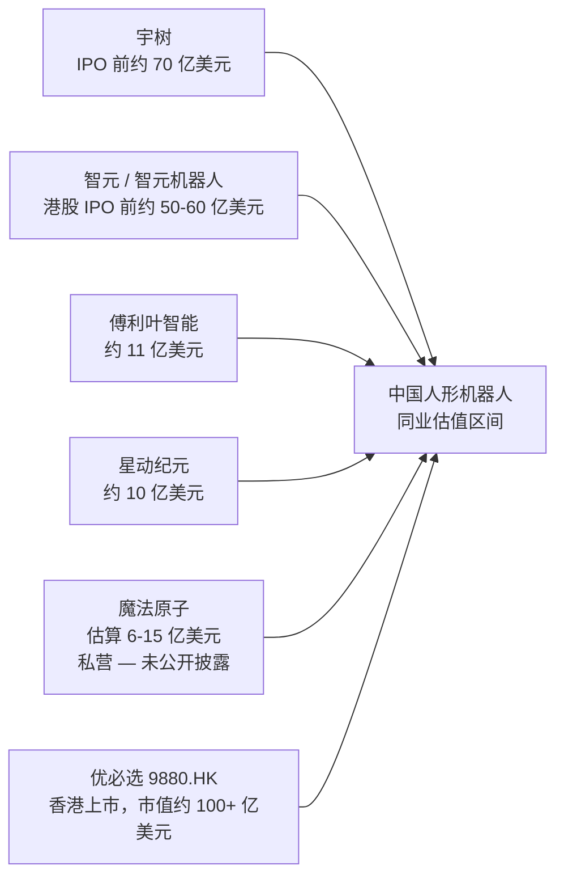
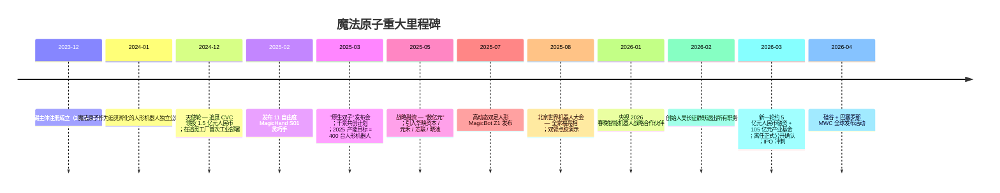
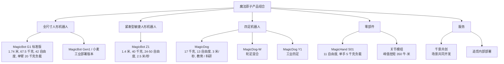
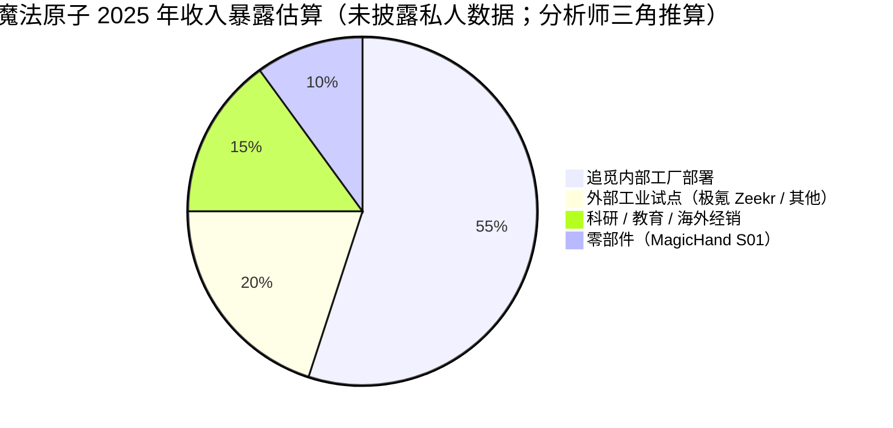
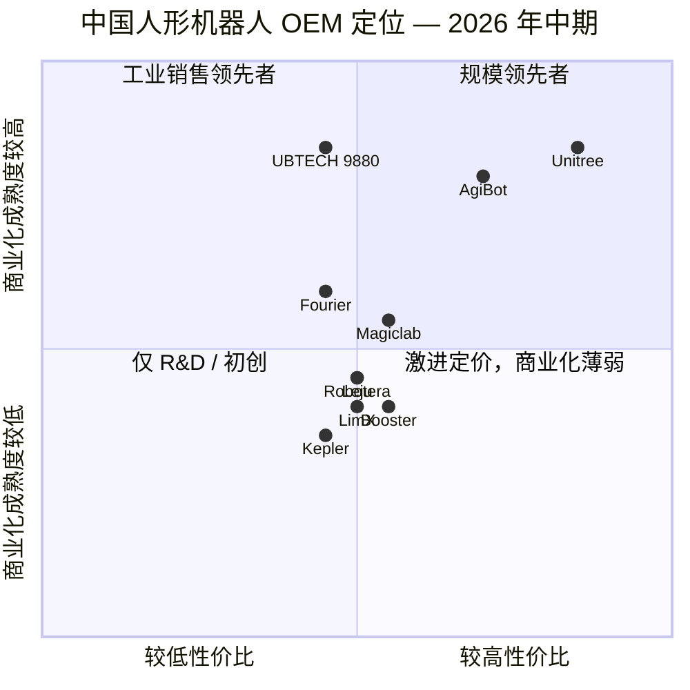
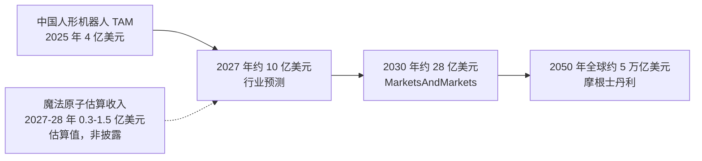

# 公司研究报告：魔法原子（Magiclab）

**未上市 — 中国 苏州 / 无锡**
**日期：** 2026-05-19

> **更新 — 创始人吴长征在 IPO 冲刺期离任（2026-03-06）：** 创始人、前任 CEO、被称为"公司灵魂"的吴长征已于 2026 年 2 月底确认完全退出魔法原子及其所有子公司，公司同时完成了新一轮约 5 亿元人民币（"数亿元"）战略融资，并联合宣布设立规模达 105 亿元人民币的具身智能产业基金。联合创始人 / CTO 陈春雨已接管日常技术领导工作；尚未任命新的 CEO。媒体报道将此次分歧归因于吴长征（倾向于加大核心技术研发投入）与主要投资人（倾向于在被业界公认为"交付年"的 2026 年加速商业化 / 推进 IPO）之间的战略分歧。
> 来源：[36氪 — 《魔法原子的冰与火：完成新一轮5亿融资 IPO关键期创始人离职》, 2026-03-12](https://36kr.com/p/3719966575817477)；交叉印证 [腾讯新闻 — 《冲击IPO前，魔法原子创始人吴长征离奇"出局"》, 2026-03-16](https://news.qq.com/rain/a/20260316A07D9800)；[Gasgoo 盖世汽车资讯 — "魔法原子管理层迎来大规模调整", 2026-03](https://autonews.gasgoo.com/articles/news/magiclabs-management-undergoes-major-reshuffle-2030905648093446145)。

---

## 目录
1. 公司概览
2. 公司沿革
3. 管理团队
4. 产品与服务
5. 客户与市场开拓
6. 行业综述
7. 竞争格局
8. 市场机会（TAM）
9. 风险评估
10. 参考资料

======================================

## 1. 公司概览

魔法原子（Magiclab，"Magic Atom"），法定主体为**魔法原子机器人科技（无锡）有限公司**（并设有 2024-12-12 注册成立的全资苏州子公司魔法原子机器人科技（苏州）有限公司），是一家位于江苏省的中国民营具身智能与人形机器人企业，于 2023 年底 / 2024 年初在**追觅科技（Dreame Technology）**生态中孵化成立。公司设计、制造并运营一系列全尺寸双足人形机器人（MagicBot 系列）、仿生及轮式四足机器人（MagicDog 系列），以及自研子系统——其中以 MagicHand S01 灵巧手最为突出——既作为整机平台销售，也作为零部件出售给科研机构、高校、车企 OEM 以及追觅自身的工厂。魔法原子对自身的定位用其原话表述为：一家"通用机器人 + 具身智能"科技公司，具备从算法、硬件、生产到售后的全链条能力（[Magiclab — 关于我们](https://www.magiclab.top/en/about)）。

公司的商业模式有两条腿。**第一条腿是硬件**：魔法原子销售人形和四足机器人——旗舰产品 MagicBot G1 人形机器人（全尺寸，1.74 米）、MagicBot Z1（1.4 米敏捷双足）、MagicDog（消费 / 科研）、MagicDog-W（轮式）、MagicDog Y1（工业）以及 MagicHand S01 灵巧手——客户结构涵盖 B2B 及科研客户，外加少量通过海外经销商（如 Wellbots、Robots International）销售的消费 / 教育渠道。MagicBot G1 标准版在美国经销渠道的标价区间为高五位数至低六位数美元，与宇树（Unitree）H1 / G1 EDU 系列大体相当，低于优必选（UBTECH）Walker S 系列（[MagicLab MagicBot G1 页面, Wellbots](https://www.wellbots.com/products/magicbot-g1)；[MagicLab MagicBot G1 页面, americansatellite.us](https://www.americansatellite.us/MagicLab-MagicBot-G1-Humanoid-Robot.htm)）。**第二条腿是"场景即服务"（Scenarios as a Service）**：根据 2025 年 3 月在 *原生双子（Atomic Twins）* 发布会上推出的**"千景共创"**计划，魔法原子以共同开发的形式将人形机器人投放到客户工厂中，借助每一次部署采集操作数据、微调 VLA（视觉-语言-动作）策略，并将试点成功转化为量产订单。第一个商业闭环正在**追觅生态内部**搭建（[观察者网, 2025-03-27](https://www.guancha.cn/economy/2025_03_27_770030.shtml)；[stcn.com — 魔法原子"全家福"亮相WRC 2025, 2025-08](https://www.stcn.com/article/detail/3020489.html)）。

**地理布局：** 注册总部位于**无锡市梁溪区江海西路 98 号**（梁溪科技城），苏州子公司作为主要的研发 / 运营基地，毗邻追觅在苏州的大本营。研发与供应链覆盖整个长三角——苏州负责零部件供应及与追觅相邻的组装，无锡承担总部行政职能并与当地政府合作设立了规模达十亿元人民币的产业基金，北京则设有以小米四足机器人团队前员工为核心的工程办公室（[百度百科 — 魔法原子机器人科技（无锡）有限公司](https://baike.baidu.com/item/%E9%AD%94%E6%B3%95%E5%8E%9F%E5%AD%90%E6%9C%BA%E5%99%A8%E4%BA%BA%E7%A7%91%E6%8A%80%EF%BC%88%E6%97%A0%E9%94%A1%EF%BC%89%E6%9C%89%E9%99%90%E5%85%AC%E5%8F%B8/66826567)；[企查查公司画像](https://www.qcc.com/firm/310d41050d97da6b83fcfddd1705db4f.html)）。海外方面，魔法原子已于 2026 年在硅谷及巴塞罗那 MWC（世界移动通信大会）举办过"全球亮相"发布活动，被定位为公司首次面向国际的研发与合作拓展（[Global Times, 2026-04](https://www.globaltimes.cn/page/202604/1360131.shtml)；[Web Disclosure, 2026 MWC 新闻稿](https://www.webdisclosure.com/press-release/magiclab-etr-from-cultural-icon-to-commercial-path-magiclab-redefines-the-future-of-robotics-at-mwc-yyzOTxriFRk)）。

**规模与员工人数：** 魔法原子未公布正式员工人数。围绕 2026 年 3 月管理层重组的媒体报道描述了"覆盖关键领域——研发、数据平台、核心零部件、生态建设与市场拓展——的全新高管阵容"，成员来自阿里巴巴、华为、蔚来（NIO）和优必选，以及聚焦机器人方向的学术界（[Gasgoo 盖世汽车资讯, 2026-03](https://autonews.gasgoo.com/articles/icv/major-personnel-reshuffle-what-game-is-magiclab-playing-2031210142819794944)）。**最佳估算（非官方披露）人员规模为数百人**，且偏向工程团队——这与一家拥有单一工厂试点站点、单一产品线低产量的 A 轮阶段具身智能硬件创业公司相符。**2025 年人形机器人产量目标约为 400 台**，其中"几百台"瞄准追觅生态内部及外部试点客户交付（[观察者网, 2025-03-27](https://www.guancha.cn/economy/2025_03_27_770030.shtml)）。2025 年实际出货量及 2026 年收入未公开披露；属于未公开信息。

**估值快照（私营 — 按公司研究规范，以融资轮估值替代）。** 魔法原子从天使轮到 Pre-IPO 战略轮共公开披露至少三轮融资，追觅 CVC 追创创投每轮均锚定参与（[新华日报 — 半年两轮融资均过亿, 2025-05](https://www.xhby.net/content/s68270dbde4b0ec5323b4fa85.html)；[iotworld — 魔法原子获数亿元融资，预期订单破千台](https://mobile.iotworld.com.cn/View.aspx/News-0e405cfdc0a36bfd)）：

| 轮次 | 日期 | 规模 | 领投 / 参与方 | 来源 |
|---|---|---|---|---|
| 天使轮 | 2024-12 | 1.5 亿元人民币（约 2,060 万美元） | **追创创投（Zhuichuang Venture / 追觅 CVC）**领投；翼朴基金参与 | [Yicai Global, 2024-12](https://www.yicaiglobal.com/news/chinese-embodied-ai-startup-magiclab-bags-usd206-million-in-angel-funds-report-says)；[阿里云创业, 2024-12](https://startup.aliyun.com/info/1090884.html) |
| 战略轮 | 2025-05-15 | "数亿元"人民币 | 禾创致远、芯联资本；华映资本（Meridian China）、晓池资本、元禾厚望；老股东追创创投 + 翼朴基金加码 | [DoNews, 2025-05](https://www.donews.com/article/detail/8280/84855.html)；[Gasgoo, 2025-05](https://autonews.gasgoo.com/articles/icv/seeds-magiclab-officially-announces-500-million-yuan-new-funding-2031616054575349761)；[新华日报, 2025-05](https://www.xhby.net/content/s68270dbde4b0ec5323b4fa85.html) |
| 战略轮（PitchBook 标为 Pre-A / "A 轮"） | 2026-03-09 | 5 亿元人民币（"5亿元"） | 投资人名单未全部披露；同期宣布设立**规模 105 亿元人民币的具身智能产业基金** | [新浪财经, 2026-03-12](https://finance.sina.com.cn/stock/newstock/2026-03-12/doc-inhqtyye1567142.shtml)；[36氪, 2026-03-12](https://36kr.com/p/3719966575817477) |

**投后估值未公开披露**（三轮均未披露）—— *未公开披露估值*。同业可比区间：参考 2025–26 年中国人形机器人 A 轮估值倍数（宇树 IPO 前约 70 亿美元，智元（AgiBot）港股 IPO 前约 50–60 亿美元，傅利叶（Fourier）约 11 亿美元，星动纪元（Robotera）约 10 亿美元，详见第 7 节），魔法原子三轮累计融资规模约为 10–15 亿元人民币（约 1.4–2.1 亿美元）、并瞄准 2026 年 IPO，按此推算最新投后估值最可能落于 **6 亿美元至 15 亿美元区间**——明确属于*基于同业可比三角推算的估算*，并非披露数据。值得注意的是，一份行业排名榜单将魔法原子按估值在中国人形机器人公司中排名第 5 位，位列宇树、智元、傅利叶和星动纪元之后（[XCarspace — 中国人形机器人公司 Top 20（按估值排名）, 2026](https://xcarspace.com/top-20-chinese-humanoid-robot-companies-ranked-by-valuation/)）。

**收入与毛利率趋势（私营 — 未披露）。** 公开来源未单独披露魔法原子的收入；可用的替代参考是 2025 年约 400 台人形机器人的产量目标（[观察者网, 2025-03-27](https://www.guancha.cn/economy/2025_03_27_770030.shtml)；[科技行者, 2025-03](https://www.techwalker.com/2025/0327/3164737.shtml)）——若按工业级单机 ASP 约 25 万–50 万元人民币（与已公开的宇树和优必选 Walker 系列 3 万–8 万美元区间大体一致，详见 [宇树 G1 商城页](https://shop.unitree.com/products/unitree-g1)；[PR Newswire — 优必选 Walker S2 量产，订单超 8 亿元, 2025-11](https://www.prnewswire.com/news-releases/ubtech-humanoid-robot-walker-s2-begins-mass-production-and-delivery-with-orders-exceeding-800-million-yuan-302616924.html)），则隐含*2025 年底约 1–2 亿元人民币的收入运行率估算*，且其中绝大部分被追觅生态内部捕获（[DoNews — 魔法原子完成数亿元新融资, 2025-05](https://www.donews.com/article/detail/8280/84855.html)）。在不到 1,000 台的规模下，全行业人形机器人硬件毛利率仍为负至低个位数（[Humanoids Daily — 估值鸿沟, 2025](https://www.humanoidsdaily.com/news/the-great-valuation-chasm-a-2025-guide-to-the-humanoid-robotics-capital-race)）；魔法原子并未具体披露毛利率。

> 
> *示意性同业对比；各同业数据来源详见第 7 节引用。本份私营公司报告未生成 PNG；以下为 Mermaid 替代版本。*

来源：各项数据详见第 7 节同业对比表。

## 2. 公司沿革

魔法原子构想于 **2023 年底**，并于 **2023 年 12 月 / 2024 年 1 月**作为追觅孵化的独立公司正式注册成立，创始工程团队主要来自**小米 CyberDog（铁蛋）四足机器人项目**，外加规模较小的追觅内部电机 / 执行器团队（[搜狐 — 魔法原子创始人兼CEO吴长征离职, 2026-03](https://www.sohu.com/a/992953720_122014422)；[百度百科 — 无锡主体](https://baike.baidu.com/item/%E9%AD%94%E6%B3%95%E5%8E%9F%E5%AD%90%E6%9C%BA%E5%99%A8%E4%BA%BA%E7%A7%91%E6%8A%80%EF%BC%88%E6%97%A0%E9%94%A1%EF%BC%89%E6%9C%89%E9%99%90%E5%85%AC%E5%8F%B8/66826567)）。立项逻辑是：追觅花了八年时间，在中国消费机器人（扫地机器人、立式吸尘器、烘干机）领域打造出出货量最高、成本最低的垂直整合电机 + 自主控制技术栈；这套技术栈——自研高速电机、行星减速机、视觉 SLAM、传感器融合、边缘 AI——在结构上完全可以复用于人形机器人的执行器、平衡控制及家用 / 工业感知。通过将人形机器人业务剥离为独立公司（而非内部孵化），追觅创始人**俞浩**可以：(a) 用风险投资标准的薪酬招募世界级机器人人才；(b) 与追觅 CVC 一同吸引外部战略与财务资本；(c) 将人形机器人业务与追觅的核心家电业务损益表隔离开来（[PandaYoo — 追觅科技：一家中国科技挑战者的全部故事](https://pandayoo.com/post/dreame-technology-the-full-story-of-a-chinese-tech-challenger/)；[Caixin Global — 追觅的 100 万亿愿景, 2026-05-08](https://www.caixinglobal.com/2026-05-08/in-depth-dreames-100-trillion-vision-tests-chinas-make-everything-tech-playbook-102441968.html)）。

从最初的"追觅内部研发项目"向独立、获得外部资本支持的公司转型发生在 2024 年中至下半年，时点紧贴天使轮关账。截至 **2024 年 12 月**，魔法原子宣布完成由追觅 CVC 追创创投领投的 **1.5 亿元人民币天使轮融资**，并披露了公司首次对外展示的工业部署：MagicBot 在追觅苏州自有工厂内执行物料搬运、巡检与点胶等任务（[CMRA, 2024-12](https://cnmra.com/magiclab-secures-over-150-million-rmb-in-funding-for-humanoid-robotics-development/)；[SHINE — MagicLab 发布"小麦", 2025-03](https://www.shine.cn/biz/tech/2503277977/)）。两个月后（2025 年 2 月），魔法原子发布了**自研的 11 自由度灵巧手 MagicHand S01**，将其定位为通用人形机器人操作能力的关键拼图（[RoboticsTomorrow, 2025-02-19](https://www.roboticstomorrow.com/news/2025/02/19/magiclab-unveils-magichand-s01-dexterous-hand-progressing-toward-mass-adoption-of-humanoid-robots/24211)；[Yahoo Finance, 2025-02-19](https://finance.yahoo.com/news/magiclab-unveils-magichand-s01-dexterous-143900164.html)）。

**2025 年 3 月**：魔法原子召开"原生双子"场景战略发布会，对外公布**千景共创**计划，并设定**2025 年约 400 台人形机器人**投放工业与商业场景的产量目标。**2025 年 5 月**：完成第二轮战略融资，规模"数亿元"。**2025 年 7 月**：发布敏捷高动态双足人形机器人 **MagicBot Z1**——后来成为公司营销旗舰，并因首次以机器人之身完成"托马斯全旋"（一项高难度体操动作）而被官方宣传为业内首例。**2025 年 8 月（北京 WRC 世界机器人大会）**：展出完整"全家福"（全尺寸人形、Z1、MagicDog、MagicDog-W、MagicDog Y1、MagicHand S01），并演示了模拟装配线上的双臂点胶（[stcn.com, 2025-08](https://www.stcn.com/article/detail/3020489.html)；[RoboHub 推特 — MagicBot Z1 发布, 2025-07-08](https://x.com/XRoboHub/status/1942531381793587235)）。

**2025 年底 / 2026 年 1 月**：魔法原子签约成为**央视 2026 年春节联欢晚会**的智能机器人战略合作伙伴——这是一场具有国家级营销意义的事件：一台 MagicBot Gen1 在开场环节挥手亮相，一台 MagicBot Z1 成为首个公开完成"托马斯 360°鞍马全旋"的人形机器人，约 100 只 MagicDog 与中国台湾艺人言承旭合作完成了同步舞蹈表演（[Sixth Tone, 2026](https://www.sixthtone.com/news/1018219/year-of-the-robot%3A-humanoids-lead-a-tech-heavy-spring-festival-gala)；[TechNode, 2026-02-17](https://technode.com/2026/02/17/humanoid-robots-take-center-stage-at-2026-spring-festival-gala-revealing-chinas-latest-robotics-advances/)；[PandaYoo — 走进 2026 春晚](https://pandayoo.com/post/inside-the-2026-spring-festival-gala-how-chinese-humanoid-robots-stole-the-show/)）。随后媒体报道称魔法原子为该春晚赞助花费约 1 亿元人民币（"花1亿"），公司并未正式确认这一数字（[新浪财经 — 花1亿上春晚, 2026-03-18](https://finance.sina.com.cn/wm/2026-03-18/doc-inhrmihm7462144.shtml)）。

**2026 年 3 月——创始人离任。** 创始人 / CEO 吴长征于 2 月底正式离职，2026-03-06 对外公开宣布（[东方财富 — 魔法原子技术总裁吴长征正式离职, 2026-03-06](https://finance.eastmoney.com/a/202603063664217769.html)；[中国基金报 — 魔法原子原总裁吴长征离职](https://www.chnfund.com/article/ARdf138ba1-ad9e-4532-aef1-3a1fd47350ca)）。联合创始人顾世韬和 CTO 陈春雨接管公司日常经营；离任的同时，公司宣布完成 5 亿元人民币新一轮融资及规模 105 亿元人民币的具身智能产业基金（[36氪 — 魔法原子的冰与火, 2026-03-12](https://36kr.com/p/3719966575817477)；[Gasgoo 盖世汽车资讯 — 大规模人员重组, 2026-03](https://autonews.gasgoo.com/articles/icv/major-personnel-reshuffle-what-game-is-magiclab-playing-2031210142819794944)）。**融资 + 创始人离任 + 春晚营销**同时发生的局面——发生在 IPO 冲刺期——是公司短暂历史上最关键的战略不连续点，也是本报告风险评估的核心要素（见第 9 节）。

来源：综合时间线整理自 [百度百科, 2026](https://baike.baidu.com/en/item/Magiclab%20Robotics%20Technology%20(Wuxi)%20Co.,%20Ltd./1538573)；[36氪, 2026-03-12](https://36kr.com/p/3719966575817477)；[Yicai Global, 2024-12](https://www.yicaiglobal.com/news/chinese-embodied-ai-startup-magiclab-bags-usd206-million-in-angel-funds-report-says)；[Gasgoo 盖世汽车资讯, 2025-05](https://autonews.gasgoo.com/articles/icv/seeds-magiclab-officially-announces-500-million-yuan-new-funding-2031616054575349761)。

## 3. 管理团队

### 吴长征 — 创始人，前任总裁 / CEO（2026-02 离任）

吴长征 *就是* 魔法原子——或曾是。他将公司从 2023 年底追觅内部的孵化构想，一路推到 2026 年初的国家级春晚赞助商，并被多家中国科技媒体称为"公司灵魂"（[钛媒体 — 春晚机器人"魔法"失灵？魔法原子CEO吴长征突然离职, 2026-03](https://www.tmtpost.com/7903082.html)；[搜狐 — 魔法原子创始人兼CEO吴长征离职, 2026-03](https://www.sohu.com/a/992953720_122014422)）。他在 2026 年 3 月的突然离任，是今年任何一家人形机器人公司发生的最具实质意义的管理事件，也由此构成本报告中最长的一段人物简介（[36氪 — 离开了吴长征，魔法原子还有上市"魔法"吗？, 2026-03](https://36kr.com/p/3719880601498375)）。

**背景。** 吴长征拥有**上海交通大学**机器人方向硕士学位——上海交通大学是中国除清华大学之外最强的机器人科研学府。从交大毕业后，他于 2018 年加入**普渡科技（Pudu Robotics）**牵头四足机器人研发，协助普渡（一家服务机器人专家）搭建起四足机器人产品线。2021 年他被**小米**招入，主导**小米 CyberDog "铁蛋" 仿生四足机器人项目**——这是宇树 H1 时代之前中国最具消费舆论影响力的四足机器人；在吴长征的技术领导下，小米于 2021 年 8 月公开发布 CyberDog，并于 2023 年 8 月发布 CyberDog 2（[搜狐 — 魔法原子创始人兼CEO吴长征离职, 2026-03](https://www.sohu.com/a/992953720_122014422)；[瑞财经 — 魔法原子再获数亿元融资，创始人吴长征曾主导小米首款四足机器人"铁蛋"研发, 2025-05](https://m.rccaijing.com/news-7329061872610244508.html)）。

2024 年 1 月，吴长征离开小米，与追觅创始人**俞浩**合作，将魔法原子独立分拆出来，出任魔法原子机器人科技（无锡）有限公司**总裁**，并担任公司对外发声的运营主官——从 2024 年 12 月天使轮融资一直到 2026 年春晚，每一个公关节点都由他出面。多个信源均将以下双重决策归功于吴长征：(a) 以**场景驱动的商业化模式**（千景共创）而非纯研发模式来创立魔法原子；(b) 自研 **MagicHand S01**，而非授权使用竞品灵巧手——该决策日后成为魔法原子竞争叙事的核心（[钛媒体 — 春晚机器人"魔法"失灵？魔法原子CEO吴长征突然离职, 2026-03](https://www.tmtpost.com/7903082.html)；[财富号·东方财富 — 吴长征退出了自己创办的机器人公司, 2026-03](https://caifuhao.eastmoney.com/news/20260306071529709718540)）。

**离任经过。** 魔法原子的官方声明措辞平淡（"个人原因"）；公司**明确否认**与投资人存在"理念分歧"。然而 36氪、腾讯新闻、财新系媒体和钛媒体的报道却汇聚出一个一致的叙事：吴长征希望维持核心技术的高强度投入（特别是更深入的基础模型 / VLA 工作及对执行器的持续研发投入）；而投资人——着眼于 2026 年被业界定义为"交付年"、并参照智元的港股 IPO 及宇树的科创板申报——则希望加速商业化推进 IPO。3 月中旬泄露出来的"花1亿上春晚"故事被广泛解读为这种支出理念分歧的一个症候。吴长征离任时的持股比例并未公开披露；*属未公开私人信息*。据报道他已开启新的机器人创业，但细节尚未得到证实（[36氪 — 离开了吴长征，魔法原子还有上市"魔法"吗？, 2026-03](https://36kr.com/p/3719880601498375)；[新浪财经 — 花1亿上春晚, 2026-03-18](https://finance.sina.com.cn/wm/2026-03-18/doc-inhrmihm7462144.shtml)）。

### 俞浩 — 追觅科技创始人兼 CEO；魔法原子主要赞助人与战略支持方

俞浩**并非**魔法原子的 CEO。但他是这家公司背后的间接控制力量——魔法原子在追觅内部孵化，从追觅 CVC 追创创投获得资金，从追觅纵向整合的电机 / 传感器供应链获取零部件，并把追觅自有工厂作为首个商业化客户（[新浪财经 — 100亿！独角兽追觅的CVC基金落地, 2025-04-11](https://finance.sina.com.cn/roll/2025-04-11/doc-inesuxcv2516054.shtml)；[观察者网 — 追觅子公司人形机器人亮相, 2025-03-27](https://www.guancha.cn/economy/2025_03_27_770030.shtml)）。

俞浩出生于 1987 年，2005 年凭物理奥赛保送进入**清华大学**，攻读航空航天工程 / 计算流体力学，2009 年在清华创办"天空工厂"（Sky Workshop）创客空间。他早年从事四旋翼飞行器研发（2007 年起），并参与了波音赞助的天空工厂项目，随后于 2015 年在苏州创立追觅。今天的追觅是全球第二大扫地机器人品牌、收入数十亿美元的中国消费科技龙头，旗下生态庞杂（最新报道称生态企业达 953 家），覆盖吹风机、运动相机、电动滑板车、泳池清洁机、电动车（2025 年宣布）及人形机器人（[百度百科 — 俞浩](https://baike.baidu.com/en/item/Yu%20Hao/941229)；[Momentum Works — 打造人类史上最伟大公司：俞浩, 2025](https://thelowdown.momentum.asia/building-the-greatest-company-in-human-history-dreame-founder-yu-hao/)；[Caixin Global — 追觅的 100 万亿愿景, 2026-05-08](https://www.caixinglobal.com/2026-05-08/in-depth-dreames-100-trillion-vision-tests-chinas-make-everything-tech-playbook-102441968.html)；[BigGo Finance — 追觅生态扩张, 2026](https://finance.biggo.com/news/iIgRLJ4BoicNoOgCAcdq)）。

俞浩对外宣称的志向——"打造人类史上最伟大公司"、"百万亿元规模生态"以及他本人"五年内成为世界首富"的愿景——是理解魔法原子时不可或缺的背景（[Caixin Global — 追觅的 100 万亿愿景, 2026-05-08](https://www.caixinglobal.com/2026-05-08/in-depth-dreames-100-trillion-vision-tests-chinas-make-everything-tech-playbook-102441968.html)；[Futunn — 俞浩回应争议](https://news.futunn.com/en/post/67539365/yu-hao-ceo-of-dreame-technology-responded-to-the-controversy)）。人形机器人项目仅是俞浩通过其生态投资平台追创创投做出的*数十个*垂直赌注中的*一个*；俞浩是一位以投资组合配置角色身份做创业的创始人，野心极大、同时下注极多（[36Kr EU — 追觅的快速扩张：十大孵化器与内部赛马](https://eu.36kr.com/en/p/3797890451840257)；[BigGo Finance — 追觅生态扩张达 953 家公司, 2026](https://finance.biggo.com/news/iIgRLJ4BoicNoOgCAcdq)）。**吴长征在 2026 年初遇到的投资人与创始人之间的张力，部分上是这种模式结构性必然的产物**：魔法原子只是 953 家生态公司中的一家（[BigGo Finance, 2026](https://finance.biggo.com/news/iIgRLJ4BoicNoOgCAcdq)），而俞浩的体系是为"生态速度"（场景快速落地 + 资本快速循环 + IPO）优化的，并非为单一组合公司的研发深度优化的（[36氪 — 魔法原子的冰与火, 2026-03-12](https://36kr.com/p/3719966575817477)）。

**魔法原子 — 追觅供应链溢出效应。** 追觅花了八年时间产业化了：(a) 高速 BLDC 电机（最初用于吹风机，后被改造适配扫地机器人驱动与人形机器人关节）——追觅自研的 15 万转高速数字电机与苏州智能电机工厂构成了执行器平台（[PR Newswire — 追觅 CES 2025 多关节机械臂技术亮相, 2025-01](https://www.prnewswire.com/news-releases/dreame-technology-stuns-ces-2025-with-innovative-technologies-including-its-groundbreaking-bionic-multi-joint-robotic-arm-technology-and-a-full-range-of-products-such-as-the-x50-ultra-302344322.html)；[PandaYoo — 追觅科技：一家中国科技挑战者的全部故事](https://pandayoo.com/post/dreame-technology-the-full-story-of-a-chinese-tech-challenger/)）；(b) 行星减速机与谐波减速器（通过追觅现有的供应商池——汇川（Inovance）、绿的谐波（Greenmaster）、来福谐波（Leaderdrive）——采购，需注意来福谐波占中国谐波减速器市场约 30–40%，客户名单中包括智元和优必选，详见 [humanoid.guide — 来福谐波因人形机器人需求受益](https://humanoid.guide/leaderdrive-harmonic-reducers-surge-as-humanoid-demand-lifts-shares/)）；(c) 视觉 SLAM + ToF + 激光雷达传感器融合（在扫地机器人上已产品化）；以及 (d) 苏州基地的百万台级以下消费电子组装产能（[Caixin Global, 2026-05-08](https://www.caixinglobal.com/2026-05-08/in-depth-dreames-100-trillion-vision-tests-chinas-make-everything-tech-playbook-102441968.html)）——俞浩本人及外部评论将这一切称为**魔法原子的结构性护城河**：一家中国人形机器人公司能够通过追觅生态自主掌握其核心执行器与传感器物料清单，并能在追觅自有工厂内完成首批 400 台试点，而不付出任何外部获客成本（[DoNews — 魔法原子完成数亿元新融资, 2025-05](https://www.donews.com/article/detail/8280/84855.html)；[新华日报, 2025-05](https://www.xhby.net/content/s68270dbde4b0ec5323b4fa85.html)）。

### 陈春雨 — 联合创始人，CTO；2026-03 起的实际运营负责人

吴长征离任后，**陈春雨**全面接管魔法原子的技术体系与核心产品研发；在公司未任命 CEO 的情况下，她被报道为公司事实上的运营负责人。陈春雨被描述为"拥有十多年研发与管理经验"的联合创始人（[搜狐 — 魔法原子创始人兼CEO吴长征离职, 2026-03](https://www.sohu.com/a/992953720_122014422)；[腾讯新闻, 2026-03-16](https://news.qq.com/rain/a/20260316A07D9800)）。她此前的具体雇主履历在中国公开媒体上披露不一致；*属未公开私人信息*。重组新闻稿提到，更广泛的高管阵容涵盖了"研发、数据平台、核心零部件、生态建设与市场拓展"，并包含来自阿里巴巴、华为、蔚来、优必选以及机器人学术界的人士（[Gasgoo 盖世汽车资讯 — 大规模人员重组, 2026-03](https://autonews.gasgoo.com/articles/icv/major-personnel-reshuffle-what-game-is-magiclab-playing-2031210142819794944)）。

### 顾世韬 — 联合创始人；IPO 主要对外发言人

联合创始人顾世韬是魔法原子 IPO 计划的主要对外发声人，他在 2026 年初公开表示公司"正在按最快的 IPO 进度推进"，且"二级市场层面的消息可能在 2026 年出现"（[36氪, 2026-03-12](https://36kr.com/p/3719966575817477)）。本报告所审阅的公开资料未披露其具体的过往任职经历。

### 高春潮 — 核心零部件 / 电机负责人

围绕领导层重组的媒体报道指认**高春潮**——曾领导追觅科技高速电机研发与量产团队——担任魔法原子核心零部件项目负责人，体现出从追觅产业基地直接向魔法原子执行器与电机研发输送人才的明确路径（[Gasgoo 盖世汽车资讯, 2026-03](https://autonews.gasgoo.com/articles/news/magiclabs-management-undergoes-major-reshuffle-2030905648093446145)）。

### 治理结构与股权

魔法原子为**民营未上市公司**。按工商登记数据，无锡母公司法定代表人记录如下（[企查查公司画像](https://www.qcc.com/firm/310d41050d97da6b83fcfddd1705db4f.html)；[百度百科 — 无锡主体](https://baike.baidu.com/item/%E9%AD%94%E6%B3%95%E5%8E%9F%E5%AD%90%E6%9C%BA%E5%99%A8%E4%BA%BA%E7%A7%91%E6%8A%80%EF%BC%88%E6%97%A0%E9%94%A1%EF%BC%89%E6%9C%89%E9%99%90%E5%85%AC%E5%8F%B8/66826567)）；中国公开登记中的拼音读作 "Chen Chunyu"，与 CTO 同名拼音；媒体亦提及此人是法定代表人——*跨身份核实未能确认*。股权由追觅关联实体及上文所列各风投投资人主导；具体股权结构*未公开披露*（[36氪, 2026-03-12](https://36kr.com/p/3719966575817477)）。无公开董事会构成。创始人离任时持股比例未披露。薪酬结构未披露。关联方交易——尤其是与追觅科技之间的供应链及客户关系——在经济意义上具有实质性，但尚未在任何公开文件中正式量化（[DoNews, 2025-05](https://www.donews.com/article/detail/8280/84855.html)）。

### 既往业绩综合评价

魔法原子团队最强的过往业绩在于**四足机器人商业化**：吴长征本人主导了小米 CyberDog 从概念到两代产品发布（2021、2023）（[百度百科 — 吴长征](https://baike.baidu.com/item/%E5%90%B4%E9%95%BF%E5%BE%81/66714615)；[techxplore — 小米发布 CyberDog, 2021-08](https://techxplore.com/news/2021-08-xiaomi-unveils-cyberdog-personable-quadruped.html)）；高春潮领导了追觅高速电机项目从内部研发到年产数百万件的量产（[Gasgoo 盖世汽车资讯, 2026-03](https://autonews.gasgoo.com/articles/news/magiclabs-management-undergoes-major-reshuffle-2030905648093446145)）。在中国人形机器人领域，这些资历的深度仅次于宇树王兴兴本人（[TheIcons — 中国铁军, 2026-03](https://theicons.com/2026/03/12/2026-cctv-spring-festival-gala-robotics-companies/)）。团队层面最主要的短板是**双足人形机器人的大规模商业化**——吴长征和陈春雨在加入魔法原子之前都未曾完整跑通过一个人形机器人量产周期（[36氪 — 离开了吴长征，魔法原子还有上市"魔法"吗？, 2026-03](https://36kr.com/p/3719880601498375)）；后吴长征时代的管理团队，在其当前所追求的 IPO 量产扩张层面尚未经过验证。魔法原子的板凳深度（阿里巴巴 / 华为 / 蔚来 / 优必选校友）是真实存在的，但作为一支团队的协作效力尚未得到证明（[Gasgoo 盖世汽车资讯 — 大规模人员重组, 2026-03](https://autonews.gasgoo.com/articles/icv/major-personnel-reshuffle-what-game-is-magiclab-playing-2031210142819794944)）。

## 4. 产品与服务

魔法原子的产品组合分为四个家族：全尺寸人形机器人（MagicBot G1 / Gen1 / "小麦"）；高动态紧凑型人形机器人（MagicBot Z1）；四足机器人（MagicDog、MagicDog-W、MagicDog Y1）；以及作为零部件销售的自研子系统（MagicHand S01 灵巧手及自研关节模组）（[Magiclab — 人形机器人 G1](https://www.magiclab.top/en/human)；[Magiclab — MagicDog Y1](https://www.magiclab.top/en/dog-y)；[Magiclab — MagicHand S01](https://www.magiclab.top/en/parts/hand)）。公司另以千景共创计划提供集成"场景"部署，从财务角度看，是叠加在硬件之上的服务 / 场景授权模式（[DoNews — 魔法原子完成数亿元新融资, 2025-05](https://www.donews.com/article/detail/8280/84855.html)；[stcn.com — 魔法原子WRC 2025, 2025-08](https://www.stcn.com/article/detail/3020489.html)）。

来源：[Magiclab — 人形机器人 G1 页面](https://www.magiclab.top/en/human)；[Magiclab — 仿生四足机器人页面](https://www.magiclab.top/en/dog)；[Magiclab — MagicDog Y1 页面](https://www.magiclab.top/en/dog-y)；[Magiclab — MagicHand S01 页面](https://www.magiclab.top/en/parts/hand)。

### 全尺寸人形机器人：MagicBot G1（及"小麦"工业版本）

**参数**：约 174 厘米 × 58 厘米 × 28 厘米，约 67.5 千克，约 42 自由度，双臂各 20 千克负载（整机 40 千克负载），峰值关节扭矩 ≥350 牛·米，运动速度 ≥2 米/秒，25 安时 / 约 1.35 千瓦时电池可提供约 4–5 小时连续运行，连接配置 WiFi 6 + 4G / 5G + 蓝牙 5.2（[wellbots.com — MagicBot G1](https://www.wellbots.com/products/magicbot-g1)；[americansatellite.us — MagicBot G1](https://www.americansatellite.us/MagicLab-MagicBot-G1-Humanoid-Robot.htm)；[HouseBots — MagicLab MagicBot](https://housebots.com/robot/magiclab-magicbot)；[robozaps.com — MagicBot 测评, 2026](https://blog.robozaps.com/b/magiclab-magicbot-review)）。

**目标客户**：工业试点客户（追觅工厂为先，随后是汽车 / 电子 / 物流），加上通过美国经销渠道面向科研与教育客户（[SHINE — MagicLab 发布"小麦", 2025-03](https://www.shine.cn/biz/tech/2503277977/)；[InterestingEngineering — MagicLab 人形机器人军团把工厂变为精密车间](https://interestingengineering.com/innovation/magiclab-robot-army-in-factory)；[wellbots.com — MagicBot G1](https://www.wellbots.com/products/magicbot-g1)）。

**定价**：标价在美国经销商渠道公开，具体数字因经销商而异，魔法原子并未官方公布。G1 处于更宽泛的 1.7–1.8 米中国 OEM 人形机器人价格段，EDU / 工业级单机区间约 **3 万–8 万美元**，与宇树 H1（约 9 万美元）相当，低于优必选 Walker S2（公开报价未披露，但根据优必选披露的 FY25 8 亿元人民币订单对应 500 台估算，单机 ASP 约 22 万美元）（[优必选新闻稿, 2025-11](https://www.prnewswire.com/news-releases/ubtech-humanoid-robot-walker-s2-begins-mass-production-and-delivery-with-orders-exceeding-800-million-yuan-302616924.html)）。

**竞争优势评判：部分具备。** *护城河类型：* (a) **借助追觅生态的垂直整合**——关节模组与高速电机栈实现自研 / 追觅采购，相对依赖外部 Tier-1 执行器供应商的初创公司在 BOM 成本上更具优势（[新华日报, 2025-05](https://www.xhby.net/content/s68270dbde4b0ec5323b4fa85.html)）；(b) 通过追觅内部工厂部署所积累的**场景数据**真实且持续增加（[观察者网, 2025-03-27](https://www.guancha.cn/economy/2025_03_27_770030.shtml)）。*尚未形成护城河：* (c) 基础模型 / VLA 技术与宇树、智元和 Figure 处于持平至落后状态（整个行业在具身 AI 上仍处于"GPT-3 等价水平"之前）（[Edge AI and Vision — 人形机器人 2025：迈向有用智能的竞赛](https://www.edge-ai-vision.com/2025/11/humanoid-robots-2025-the-race-to-useful-intelligence/)；[The Robot Report — VLA 模型是自主机器人的下一跃迁](https://www.therobotreport.com/vision-language-action-models-are-the-next-leap-in-autonomous-robotics/)）。**最接近的竞品：**宇树 H1 / G1——两者均在装机量、基础模型成熟度与单机出货规模上领先；MagicBot G1 在技术层面与宇树**持平至略落后**，在出货量上远远落后（宇树 2025 年出货 >10,000 台 vs. 魔法原子约 400 台目标）（[SCMP — 中国宇树 IPO, 2026](https://www.scmp.com/business/banking-finance/article/3347365/chinas-unitree-robotics-rides-humanoid-tide-it-targets-us610m-ipo)；[Bloomberg — 中国企业主导 2025 年人形机器人出货, 2026-01-08](https://www.bloomberg.com/news/articles/2026-01-08/chinese-firms-dominated-global-humanoid-robot-shipments-in-2025)）。

### 敏捷 / 动态人形机器人：MagicBot Z1

**参数**：身高 1.4 米，40 千克，24–50 自由度（视手部选配而异），峰值速度约 2.5 米/秒，峰值关节扭矩约 130 牛·米，约 2 小时电池，可选配 11 自由度 MagicHand S01 灵巧手（单手 5 千克负载），传感器包括 3D 激光雷达 + 深度相机 + 双目鱼眼 + 头部触觉传感器（[humanoid.guide — MagicBot Z1](https://humanoid.guide/product/magicbot-z1/)；[humanoid.press — MagicBot Z1, 2025](https://humanoid.press/database/www-humanoid-press-database-magicbot-z1-humanoid-robot/)；[Robotic Gizmos — MagicBot Z1 开源, 2025-07](https://www.roboticgizmos.com/magicbot-z1/)）。Z1 在发布时（2025 年 7 月）被定位为中国最敏捷的双足人形机器人——春晚"托马斯全旋"动作是其核心营销资产（[TechNode, 2026-02-17](https://technode.com/2026/02/17/humanoid-robots-take-center-stage-at-2026-spring-festival-gala-revealing-chinas-latest-robotics-advances/)）。

**目标客户**：科研机构、高校、内容 / 营销 / 展览客户，以及精选的工业动态任务试点。Z1 更多是营销旗舰与科研平台，而非工业主力机型（[humanoid.guide — MagicBot Z1](https://humanoid.guide/product/magicbot-z1/)；[Magiclab — MagicBot Z1](https://www.magiclab.top/en/z1)；[腾讯新闻 — 魔法原子首秀MagicBot Z1, 2025-07](https://news.qq.com/rain/a/20250728A0499X00)）。

**竞争优势评判：部分具备 — 动态能力突出，商业牵引力薄弱。** *护城河类型：***技术 / 知识产权**——支撑托马斯全旋动作的执行器 + 控制栈，是关节功率密度与平衡控制能力的可信证明（[百度百科 — MagicBot Z1](https://baike.baidu.com/item/MagicBot%20Z1/67393054)；[知乎 — 宇树最大竞争对手, 2025-07](https://zhuanlan.zhihu.com/p/1926664948345468298)）。*最接近的竞品：***宇树 G1**（更小型，入门约 16,000 美元，身高级别相近，详见 [botinfo.ai — 宇树 G1 测评, 2026](https://botinfo.ai/articles/unitree-g1)）和 **Booster Robotics T1**——Z1 在峰值敏捷度上领先 G1，但在性价比与出货量上落后。*风险：* Z1 是营销驱动型产品；其敏捷能力能否真正转化为工业收入仍有待观察（[36氪 — 离开了吴长征，魔法原子还有上市"魔法"吗？, 2026-03](https://36kr.com/p/3719880601498375)）。

### 四足机器人：MagicDog 系列

**MagicDog（消费 / 教育）**：约 17 千克，67 × 35 × 56 厘米，13 自由度，12 个精密铝合金关节电机，最高速度 3.0 米/秒，标准负载 5 千克 / 最大负载 10 千克，越障高度 15 厘米，最大爬坡角度 40°，29.6 伏 × 8200 毫安时电池续航 1.5–3 小时，2D 激光雷达 + 双目 + 深度 + 4K + 鱼眼 + 超声波传感器组合，8 核 CPU（[aparobot.com — MagicDog](https://www.aparobot.com/robots/magicdog)；[wellbots.com — MagicDog](https://www.wellbots.com/products/magiclab-magicdog)）。

**MagicDog-W**：轮足混合四足，使用四只轮式腿实现高速移动，能够完成翻滚和高平台攀爬动作（[roboticgizmos.com — MagicDog-W](https://www.roboticgizmos.com/magicdog-w/)）。

**MagicDog Y1**：工业级别四足，定位于巡检 / 巡逻 / 工业数据采集等部署场景（[Magiclab — MagicDog Y1](https://www.magiclab.top/en/dog-y)；[stcn.com — WRC 2025, 2025-08](https://www.stcn.com/article/detail/3020489.html)）。

**竞争优势评判：无明显护城河。** 中国四足机器人市场由宇树（G1、B2、B2-W）主导——宇树控制全球四足机器人市场约 70%（[SCMP — 中国宇树 IPO, 2026](https://www.scmp.com/business/banking-finance/article/3347365/chinas-unitree-robotics-rides-humanoid-tide-it-targets-us610m-ipo)）——以及云深处（Deep Robotics）（[云深处 Deep Robotics 官网](https://www.deeprobotics.cn/en/wap/company.html)）；两者在出货量、性价比和开发者生态上均领先于魔法原子。MagicDog 是一个合格的第二梯队产品，但相对宇树并无护城河。**最接近的竞品：**宇树 B2-W（轮足）——魔法原子**落后**。春晚"100 只四足同步舞蹈"是一次营销大胜，但并未在装机量优势上为魔法原子塑造出明确的商业差异化（[PandaYoo — 走进 2026 春晚](https://pandayoo.com/post/inside-the-2026-spring-festival-gala-how-chinese-humanoid-robots-stole-the-show/)）。

### 零部件：MagicHand S01 灵巧手

**参数**：11 自由度，580 克，12 伏 / 静态 0.2 安 / 峰值 3 安，5 个触觉传感器（分辨率 0.1 牛），单指夹持力约 2.5 千克，四指合并夹持力约 9.1 千克，单手负载 5 千克，四指弯曲速度 150°/秒，力 / 位置混合控制（[RoboticsTomorrow, 2025-02-19](https://www.roboticstomorrow.com/news/2025/02/19/magiclab-unveils-magichand-s01-dexterous-hand-progressing-toward-mass-adoption-of-humanoid-robots/24211)；[humanoid.guide — MagicHand S01](https://humanoid.guide/product/magichand-s01/)；[InterestingEngineering — 44 磅负载灵巧手](https://interestingengineering.com/innovation/china-magiclabs-robotic-hand-humanoids)）。

**竞争优势评判：是，存在部分护城河。** MagicHand S01 是中国市场被引用最多的灵巧手之一：11 自由度处于中国 OEM 灵巧手规格区间的上限，集成的触觉反馈 + 力 / 位置混合控制在性能上对标西方领先者（Sanctuary AI / Shadow Robot），价格却只是其零头（[RoboticsTomorrow, 2025-02-19](https://www.roboticstomorrow.com/news/2025/02/19/magiclab-unveils-magichand-s01-dexterous-hand-progressing-toward-mass-adoption-of-humanoid-robots/24211)；[InterestingEngineering — 44 磅负载灵巧手](https://interestingengineering.com/innovation/china-magiclabs-robotic-hand-humanoids)）。*护城河类型：* 通过追觅供应链整合实现的**技术 / 知识产权 + 成本领先**。*最接近的竞品：* 因时机器人（Inspire Robotics）RH56 系列（6 自由度 / 12 关节变型）——参数大致持平，但魔法原子声称在触觉 / 抓握力方面更具优势，5 个触觉传感器分辨率达 0.1 牛（[Inspire Robots — RH56DFX 产品页](https://en.inspire-robots.com/product/rh56dfx)；[Inspire Robotics RH56 系列用户手册 PDF](https://en.inspire-robots.com/wp-content/uploads/2024/02/INSPIRE-ROBOTS-THE-DEXTEROUS-HAND-RH56-SERIES-USER-MANUAL.pdf)）。这是魔法原子产品组合中**最具防御性的产品**，并有可能成为公司独立于整机销售之外最优质的零部件销售业务（[humanoid.guide — MagicHand S01](https://humanoid.guide/product/magichand-s01/)）。

### 服务：千景共创

魔法原子的商业化包装层——并非产品本身，而是 GTM（市场进入）打法。客户（工厂、零售场所、科研机构）以"共创伙伴"身份签约；魔法原子部署机器人，采集操作 / 移动数据，并基于该数据迭代 VLA 模型。原定目标是 1,000 个场景（[DoNews — 魔法原子完成数亿元新融资 加速1000个场景落地, 2025-05](https://www.donews.com/article/detail/8280/84855.html)；[科技行者 — 魔法原子人形机器人走出"练兵场", 2025-03](https://www.techwalker.com/2025/0327/3164737.shtml)）。截至目前真实落地体量并不清晰；*未披露*。**竞争优势评判：部分具备**——该模式是合理的，但中国每一家人形机器人 OEM（宇树、智元、优必选、傅利叶、星动纪元）都在跑类似的场景计划；差异化最终取决于数据积累速度，而魔法原子并未公布相关数据（[Humanoids Daily — 估值鸿沟, 2025](https://www.humanoidsdaily.com/news/the-great-valuation-chasm-a-2025-guide-to-the-humanoid-robotics-capital-race)）。

### 旗舰产品与长尾产品

旗舰：**MagicBot G1 / Gen1（小麦）** 和 **MagicHand S01**。公司的成败将由这两条产品线决定。Z1 是营销旗舰，而非收入旗舰。四足机器人属于长尾 / 品牌延伸。千景共创计划存在的目的，是为旗舰产品销售提供支撑（[观察者网 — 追觅子公司人形机器人亮相, 2025-03-27](https://www.guancha.cn/economy/2025_03_27_770030.shtml)；[stcn.com — WRC 2025, 2025-08](https://www.stcn.com/article/detail/3020489.html)）。

### 近 12 个月新品发布与产品下线

- **2025-02：** MagicHand S01 灵巧手（[RoboticsTomorrow, 2025-02-19](https://www.roboticstomorrow.com/news/2025/02/19/magiclab-unveils-magichand-s01-dexterous-hand-progressing-toward-mass-adoption-of-humanoid-robots/24211)）
- **2025-03：** 原生双子发布会 / 千景共创计划（[观察者网, 2025-03-27](https://www.guancha.cn/economy/2025_03_27_770030.shtml)）
- **2025-07：** MagicBot Z1（[腾讯新闻 — 魔法原子首秀MagicBot Z1, 2025-07](https://news.qq.com/rain/a/20250728A0499X00)）
- **2025-08：** MagicDog-W 和 MagicDog Y1 工业版本（在 WRC 2025 展出）（[stcn.com, 2025-08](https://www.stcn.com/article/detail/3020489.html)）
- **2026-01：** 2026 央视春晚舞台首秀（营销资产，非新品）（[TechNode, 2026-02-17](https://technode.com/2026/02/17/humanoid-robots-take-center-stage-at-2026-spring-festival-gala-revealing-chinas-latest-robotics-advances/)）
- **2026-04：** 硅谷 + 巴塞罗那 MWC 国际发布——首次全球亮相（[Global Times, 2026-04](https://www.globaltimes.cn/page/202604/1360131.shtml)；[无锡市政府 — 无锡魔法原子世界模型, 2026-04](https://en.wuxi.gov.cn/2026-04/30/c_1180004.htm)）。

无产品下线（[Magiclab — 人形机器人 G1 产品页](https://www.magiclab.top/en/human)）。

## 5. 客户与市场开拓

**客户分层。** 魔法原子迄今的商业版图高度集中于三类客户：(1) **追觅自有工厂**（关联客户部署——首个商业闭环）；(2) **汽车 / 电子制造商**通过试点合作（公开提及的汽车工业数据采集合作伙伴为吉利 / 极氪 Zeekr；YouTube 频道节目中曾提到字节跳动 ByteDance / TikTok 处于商谈阶段，但未有正式合作得到确认）；以及 (3) **科研 / 教育 / 海外经销渠道**，通过 Wellbots、Robots International、American Satellite 以及其他经销商向 EDU 市场销售 G1 与 Z1（[魔法原子工业部署 — 观察者网, 2025-03-27](https://www.guancha.cn/economy/2025_03_27_770030.shtml)；[stcn.com WRC 2025, 2025-08](https://www.stcn.com/article/detail/3020489.html)；[SHINE — 小麦在追觅工厂从事装载 / 巡检 / 装箱, 2025-03](https://www.shine.cn/biz/tech/2503277977/)；[InterestingEngineering — MagicLab 人形机器人军团把工厂变为精密车间](https://interestingengineering.com/innovation/magiclab-robot-army-in-factory)）。

**客户集中度。** *未披露私人数据，无正式文件可查。* 魔法原子并未公开第一大客户或前五大客户的收入分布。但其结构性事实毫无悬念：在 2024–25 年，**最大单一客户几乎确定是追觅科技本身**，将 MagicBot 部署于追觅工厂内进行物料搬运、巡检、点胶与包装。多个信源描述魔法原子 2025 年的计划是"率先在追觅生态内实现产品交付与商业闭环"，再向更广泛的工业与商业场景推进（[DoNews — 魔法原子完成数亿元新融资, 2025-05](https://www.donews.com/article/detail/8280/84855.html)）。这种格局——**第一大客户极有可能占 2024–25 年收入 >50%，同时该客户也是母公司 / 孵化方 / 通过追创创投持股的最大股东**——是典型的实质性客户集中度风险（详见第 9 节）。

*饼图为估算占比 — 非披露数据*。来源：综合三角推算自 [观察者网, 2025-03-27](https://www.guancha.cn/economy/2025_03_27_770030.shtml)、[DoNews, 2025-05](https://www.donews.com/article/detail/8280/84855.html) 以及 [stcn.com, 2025-08](https://www.stcn.com/article/detail/3020489.html)。明确标注：*估算*，非披露。

**合同结构。** 魔法原子对外的场景部署以"共创"合作伙伴关系为框架，意味着**多年期评估部署 + 按单机或按场景授权**模式，而非主框架采购合同；这在具身 AI 阶段属于常态，但意味着收入呈后置且不均衡分布（[DoNews — 千景共创计划, 2025-05](https://www.donews.com/article/detail/8280/84855.html)）。追觅的内部部署应属于关联方转移交易；*条款未披露*（[观察者网, 2025-03-27](https://www.guancha.cn/economy/2025_03_27_770030.shtml)）。海外经销渠道为常规分润分销协议；*条款未披露*（[wellbots.com — MagicBot G1 产品页](https://www.wellbots.com/products/magicbot-g1)；[americansatellite.us — MagicBot G1 产品页](https://www.americansatellite.us/MagicLab-MagicBot-G1-Humanoid-Robot.htm)）。

**渠道。** 国内：直销 + 追觅渠道 + 千景共创合作伙伴网络。海外：以经销商为主导（Wellbots、American Satellite、Robots International、rbtx、Humanoid.guide）（[wellbots.com — MagicBot G1](https://www.wellbots.com/products/magicbot-g1)；[Robots International — MagicDog](https://www.robotsinternational.com/MagicLab-MagicDog-Quadruped-Robot.htm)；[humanoid.guide — MagicBot Z1](https://humanoid.guide/product/magicbot-z1/)）。2026 年硅谷与巴塞罗那 MWC 发布是明确转向直接国际接触的信号，但**尚未公开任何海外工业客户名称**（[Global Times, 2026-04](https://www.globaltimes.cn/page/202604/1360131.shtml)；[无锡市政府, 2026-04](https://en.wuxi.gov.cn/2026-04/30/c_1180004.htm)）。

**销售周期。** 长——目前中国人形机器人 OEM 的工业试点至部署周期普遍为 6–18 个月（[中国日报 — 中国推进规模化商业化, 2025-07](https://global.chinadaily.com.cn/a/202507/28/WS68873753a310c26fd717c1a5.html)）。魔法原子声称自发布后约 12 个月就在追觅生态内从试点跨入"商业闭环"，速度异常快，几乎完全得益于追觅的关联客户渠道（[DoNews, 2025-05](https://www.donews.com/article/detail/8280/84855.html)；[观察者网, 2025-03-27](https://www.guancha.cn/economy/2025_03_27_770030.shtml)）。

**关键合作伙伴。** 追觅科技（母公司 / 客户 / 供应链合作伙伴）。追创创投（三轮融资的领投方）（[新浪财经 — 100亿独角兽追觅CVC基金落地, 2025-04-11](https://finance.sina.com.cn/roll/2025-04-11/doc-inesuxcv2516054.shtml)；[Yicai Global, 2024-12](https://www.yicaiglobal.com/news/chinese-embodied-ai-startup-magiclab-bags-usd206-million-in-angel-funds-report-says)）。战略 / 财务投资人：禾创致远、芯联资本、华映资本（Meridian China）、晓池资本、元禾厚望、翼朴基金、厦门国盛（厦门国盛产业基金）（[Gasgoo — MagicLab 5 亿融资, 2025-05](https://autonews.gasgoo.com/articles/icv/seeds-magiclab-officially-announces-500-million-yuan-new-funding-2031616054575349761)；[PitchBook — 厦门国盛机器人产业风险基金](https://pitchbook.com/profiles/fund/26291-98F)）。无锡梁溪区当地政府合作伙伴（2026 年十亿元人民币级别产业基金锚定方）（[Gasgoo — MagicLab 在无锡设立全国总部](https://autonews.gasgoo.com/articles/icv/magiclab-establishes-national-headquarters-in-wuxi-2022667588994080769)；[PitchBook — 无锡梁溪创新产业引导基金](https://pitchbook.com/profiles/fund/25408-09F)）。

**公开提及的客户案例。** 除追觅外，公开报道还记录了 MagicBot 在以下场景的部署：(a) 停车场流量演示；(b) 汽车 4S 店导购；(c) 餐厅服务员演示；(d) 美发造型演示；(e) 工厂合作伙伴现场的装配线点胶与巡检（[InterestingEngineering — MagicLab 服务机器人协助顾客](https://interestingengineering.com/innovation/magiclabs-service-robots-assist-shoppers-video)；[Magiclab WRC 2025 — stcn.com](https://www.stcn.com/article/detail/3020489.html)）。这些都属于演示性质，而非长期合同；商业体量未披露。

## 6. 行业综述

**行业定义。** 魔法原子所处的是**具身智能与通用人形机器人**行业——更广义的服务机器人和工业机器人市场的一个子集，但其独特之处在于：(a) 双足 / 人形形态；(b) 通用操作能力（区别于固定任务的机械臂）；以及 (c) 由基础模型 / VLA 驱动的控制方式（区别于脚本化自动化）（[The Robot Report — VLA 模型是自主机器人的下一跃迁](https://www.therobotreport.com/vision-language-action-models-are-the-next-leap-in-autonomous-robotics/)；[Carnegie Endowment — 具身 AI：中国的大押注, 2025-11](https://carnegieendowment.org/research/2025/11/embodied-ai-china-smart-robots?lang=en)）。相邻行业包括传统工业机器人（ABB、发那科 Fanuc、库卡 KUKA、安川 Yaskawa）、协作机器人（优傲 UR、斗山 Doosan）、服务机器人（普渡科技、擎朗 Keenon）以及四足机器人（波士顿动力 Spot、宇树）（[Top3DShop — 人形机器人指南, 2025](https://top3dshop.com/blog/humanoid-robots-types-history-best-models)）。

**市场规模。** 不同预测机构对 TAM 定义和时间跨度的不同假设，使得估算结果跨度达两个数量级（[MarketsAndMarkets — 中国人形机器人市场](https://www.marketsandmarkets.com/Market-Reports/china-humanoid-robot-market-203952382.html)；[Morgan Stanley — 人形机器人市场 2050 年 5 万亿美元](https://www.morganstanley.com/insights/articles/humanoid-robot-market-5-trillion-by-2050)）：

- **MarketsAndMarkets** 预计中国人形机器人市场将由 **2025 年的 4 亿美元增长至 2030 年的 28 亿美元**，CAGR 47.6%（[MarketsAndMarkets — 中国人形机器人市场](https://www.marketsandmarkets.com/Market-Reports/china-humanoid-robot-market-203952382.html)）。
- **摩根士丹利** 预计**全球人形机器人市场到 2050 年可超过 5 万亿美元**，包含全部供应链及维修 / 维护 / 售后长尾；近期落地节奏在"2030 年代中期之前相对缓慢，2030 年代末期与 2040 年代加速"（[Morgan Stanley — 人形机器人市场预计 2050 年达 5 万亿美元](https://www.morganstanley.com/insights/articles/humanoid-robot-market-5-trillion-by-2050)）。
- **Grand View Research** 对中国市场的口径更为保守（[Grand View Research — 中国人形机器人市场](https://www.grandviewresearch.com/horizon/outlook/humanoid-robot-market/china)）。
- **高盛 Goldman Sachs** 指出，2025 年世界机器人大会显示产品迭代速度相对 2025 年初出现阶跃式提升（[Goldman Sachs 报告，引自 futunn 报道, 2025](https://news.futunn.com/en/post/60487942/goldman-sachs-latest-humanoid-robotics-report-the-product-iteration-speed)）。

**增长驱动。** (1) **人形机器人成本骤降**：宇树 R1 约 6,000 美元、G1 起步价 16,000 美元，在 2025 年重新定义了行业；目前中国整个梯队都锚定于 16,000–80,000 美元的工业 / 科研价格段，而西方竞品锚定于 3 万至 30 万美元（[botinfo.ai — 宇树 G1 测评, 2026](https://botinfo.ai/articles/unitree-g1)；[blog.robozaps.com — 人形机器人成本, 2026](https://blog.robozaps.com/b/humanoid-robot-cost)）。(2) **基础模型正在跨越操作能力门槛**——VLA 模型、Sim-to-Real 迁移、行为克隆 + 强化学习策略正在变得足以应对狭义工业任务。(3) **中国政府产业政策**明确将人形机器人列为重点产业（工信部 2023 年指导意见），推动地方产业基金（厦门国盛、无锡梁溪、北京亦庄）的落地。(4) **车企的需求拉动**：特斯拉 Optimus、蔚来 NIO Walker、极氪 Zeekr / 吉利 + 优必选、比亚迪 BYD + 智元 AgiBot 都在搭建车厂人形机器人试点，形成了一笔切实可观的 B2B 订单池。

**行业结构。** 高度分散；36氪 2025 年行业综述列出约 60 家中国人形机器人公司（[36氪 — 国内 60 家人形机器人公司盘点](https://eu.36kr.com/de/p/3586837153923076)）。三档划分：(i) **第一梯队**——宇树、智元、优必选、傅利叶——2025 年出货量为数千至 10,000+ 台；(ii) **第二梯队**——魔法原子、星动纪元、Galbot、乐聚、Engine AI、Booster、开普勒（Kepler）、逐际动力——2025 年出货量为数百台级；(iii) **第三梯队**——30 多家更小厂商，仅做 R&D 或出货不到 100 台。供应商议价能力中至偏高——高扭矩密度谐波减速器（哈默纳科 Harmonic Drive、来福谐波、绿的谐波）、行星滚柱丝杠、锂电池模组、激光雷达（禾赛 Hesai、速腾聚创 Robosense）等关键零部件由少数供应商主导。当前买方议价能力较低，因为尚无大型工业客户下出 >1,000 台的量产订单。

**监管环境。** 中国中央政府（工信部、发改委）已在"十四五"规划延伸文件中将人形机器人定为战略 / 重点产业；主要省 / 直辖市政府（北京、上海、深圳、苏州、无锡、杭州）已设立专门的人形机器人产业基金。出口管制风险并不对称：中国人形机器人 OEM 在美国、欧盟及部分新兴市场面临日益严格的审查，重点针对 (a) 激光雷达 / 视觉零部件，以及 (b) 可能存在军民两用应用的具身 AI 基础模型。魔法原子目前尚未受到针对性监管行动。

**关键趋势。** (1) 基础模型竞赛：VLA 模型、Helix（Figure）、GR00T（NVIDIA）、Optimus 同级别；魔法原子已宣布开展 VLA 工作，但技术深度未在外部得到评测验证。(2) 灵巧手商品化竞赛：11 自由度手部（魔法原子、因时、Schunk）正在成为默认配置；下一前沿是富触觉抓取。(3) 场景数据积累作为竞争护城河。(4) 电机与执行器纵向整合——魔法原子结构性的追觅优势恰好契合该趋势。

## 7. 竞争格局

中国人形机器人格局在 2025–26 年快速分层。按用户要求的同业对比集合：

| 同业 | 成立时间 | 上市状态 | 最新披露估值 | 2025 出货量 | 关键产品 | 来源 |
|---|---|---|---|---|---|---|
| **宇树（Unitree，宇树科技）** | 2016 | 科创板（计划 2026 年中期，融资约 5.8 亿美元；媒体估值约 70 亿美元） | IPO 前约 70 亿美元 | >10,000 台（G1 + H1 + R1 + B2） | G1 / H1 / R1 / B2 | [CNBC, 2025-09-09](https://www.cnbc.com/2025/09/09/chinas-unitree-plans-7-billion-ipo-valuation-as-humanoid-robot-race-heats-up.html)；[Unitree.com](https://www.unitree.com/g1/) |
| **智元机器人（AgiBot）** | 2023-02 | 计划 2026 年港股 IPO，估值 400–500 亿港币（51–64 亿美元） | IPO 前约 50–60 亿美元 | 约 5,168 台人形机器人（Omdia 2025 数据，世界第一） | A2 / 灵犀 X1 / GO-1 VLA | [SCMP — 智元 1.42 亿美元收入目标, 2025](https://www.scmp.com/tech/big-tech/article/3337477/chinas-agibot-targets-us142-million-revenue-march-humanoid-robots-gathers-pace)；[Wikipedia — AgiBot](https://en.wikipedia.org/wiki/AgiBot) |
| **优必选（UBTECH）** | 2012 | **港交所:9880**（2023 年 12 月上市） | 巅峰市值约 100+ 亿美元（波动较大；详见港交所） | Walker S2 — 500 台目标，订单 8 亿元人民币 | Walker S / S1 / S2 | [PR Newswire — Walker S2 量产, 2025-11](https://www.prnewswire.com/news-releases/ubtech-humanoid-robot-walker-s2-begins-mass-production-and-delivery-with-orders-exceeding-800-million-yuan-302616924.html)；[优必选 IR — 港交所:9880](https://www.ubtrobot.com/) |
| **傅利叶智能（Fourier Intelligence）** | 2015 | 私营 | 约 11 亿美元（2025-05）；E 轮约 8 亿元人民币 | 约 1,200 台（2025） | GR-1 / GR-2 人形机器人 | [futuremarketsinc — 全球人形机器人 2025](https://www.futuremarketsinc.com/the-global-humanoid-robots-market-2025-2035/)；[humanoidsdaily — 估值鸿沟, 2025](https://www.humanoidsdaily.com/news/the-great-valuation-chasm-a-2025-guide-to-the-humanoid-robotics-capital-race) |
| **逐际动力（LimX Dynamics）** | 2022 | 私营 | 未披露 | 数百台 | CL-1 / TRON1 / W1 | [Goldman Sachs WRC 2025 报告 — 提及 Booster、Kepler、LimX](https://news.futunn.com/en/post/60487942/goldman-sachs-latest-humanoid-robotics-report-the-product-iteration-speed) |
| **星动纪元（Robotera）** | 2023-08 | 私营 | 约 10 亿美元 | 数百台 | XBot / Star1 | [XCarspace — 中国人形机器人 Top 20](https://xcarspace.com/top-20-chinese-humanoid-robot-companies-ranked-by-valuation/) |
| **开普勒（Kepler）** | 2023 | 私营 | 未披露 | 数百台 | Kepler K2 | [Goldman Sachs WRC 2025 报告](https://news.futunn.com/en/post/60487942/goldman-sachs-latest-humanoid-robotics-report-the-product-iteration-speed) |
| **乐聚机器人（Leju Robotics）** | 2016 | 私营 | 未披露 | Kuavo S 系列；量未披露 | Kuavo Pro | [Visual Capitalist — 出货人形机器人公司](https://www.visualcapitalist.com/ranked-the-companies-shipping-the-worlds-humanoid-robots/) |
| **Booster Robotics（银河通用）** *注：Booster T1 系 Booster Robotics 产品 — 与 Galaxy Universal / 银河通用属不同公司；中国媒体有时混淆。* | 2023 | 私营 | 未披露 | Booster T1 | （引自春晚报道）；[futunn — Goldman Sachs WRC 2025](https://news.futunn.com/en/post/60487942/goldman-sachs-latest-humanoid-robotics-report-the-product-iteration-speed) |
| **魔法原子（本报告主体）** | 2023-12 / 2024-01 | 私营（已定向 IPO） | 估算 6–15 亿美元 — *未披露* | 2025 年 ~400 台目标 | MagicBot G1 / Z1 / 小麦 | 本报告 |

**定位。** 在两条主要维度——**性价比**（美元 / 台 / 有效任务分钟）和 **VLA / 基础模型深度**——上，中国人形机器人梯队大致排布为：宇树在性价比与出货规模上领先；智元在基础模型深度与 BD 广度上领先（背靠比亚迪 BYD、LG、百度、腾讯）；优必选在工业客户资历上领先（富士康 Foxconn / 蔚来 / 比亚迪 / 极氪 Walker S 部署）；傅利叶在医疗 / 康复领域领先；魔法原子的独特定位则是**追觅工业溢出效应**——与追觅在执行器 / 电机栈层面的垂直整合，加上一个关联的内部工厂客户。

*象限定位是对上述公开资料的定性概述——非第三方调查结果。来源：综合上表所引同业资料。*

**魔法原子的竞争优势。** (1) **追觅供应链溢出**——垂直整合的电机 + 传感器栈相对外购执行器的同业拥有更低的 BOM 成本；(2) **追觅作为关联客户**——拥有可保障的首批 1,000 台工厂试点，是除比亚迪—智元配对之外，中国人形机器人创业公司中独一无二的资源；(3) **MagicHand S01**——一款可信赖的高自由度灵巧手；(4) **国家级品牌曝光**——2026 年春晚之后，对于第二梯队选手而言，消费媒体可见度异常突出；(5) **强大的 VC 团队**——融合追觅 CVC、华映、元禾与翼朴，资本储备足以支持 IPO 冲刺。

**脆弱点。** (1) **规模差距**——2025 年 400 台 vs. 宇树 >10,000 台、智元约 5,000 台，魔法原子小 12–25 倍；差距在拉大而非收窄；(2) **创始人离任**给 IPO 窗口带来执行风险；(3) **追觅客户集中度**虽然外部无法核实，但在结构上几乎确定将是公司最大单一风险；(4) **基础模型 / VLA 的公开基准缺失**，难以验证其技术对等说法；(5) **价格压力**：宇树 R1 约 6,000 美元在结构上压缩了中国人形机器人整个价格段——魔法原子尚未推出 20,000 美元以下 SKU；(6) **声誉**——2026 年 3 月中旬"花 1 亿上春晚"的故事在科技媒体上反响欠佳。

## 8. 市场机会（TAM）

**TAM（总潜在市场）。** 摩根士丹利的 2050 年 5 万亿美元数字是行业最常被引用的漏斗顶端口径；MarketsAndMarkets 的 2030 年中国 28 亿美元则是最常被引用的近期锚点。对魔法原子最相关的时间窗口是 2027–2030 年：**该窗口内中国工业人形机器人 TAM 大致为每年 10–50 亿美元**，机会主体集中在汽车、电子组装、物流与仓储。相邻的服务型人形机器人 TAM（零售、酒店、医疗）虽然规模可观，但更为碎片化，距离量产部署仍较远。

**SAM（可服务市场）。** 魔法原子近期的可服务市场是**中国工厂车间的工业人形机器人 + 灵巧手零部件销售**，加上全球范围内的教育 / 科研客户。中国工厂市场到 2027 年大致为每年 5–10 亿美元（按 MarketsAndMarkets 路径从 2025 年 4 亿美元基础以 47.6% CAGR 外推）。全球教育 / 科研市场为每年数亿美元，宇树凭价格占据主导。

**SOM（可争取市场份额）。** 魔法原子 2027–2028 年现实可行的份额：按 2025 年约 400 台 → 估算 2027 年达 1,000–2,500 台（魔法原子未给出指引），ASP 按 30,000–60,000 美元计算，对应**魔法原子 2027–28 年收入区间约为每年 0.3–1.5 亿美元，属估算值**。这相当于中国工业人形机器人 SAM 中 **2–5% 的市场份额**——属于第二梯队，而非第一梯队，但仍是可信的 IPO 候选者。*估算值，非披露。*

**渗透策略。** 三条向量：(a) **追觅生态飞轮**——首批 500–1,000 台在追觅工厂内被关联部署，产生场景数据与部署案例研究；(b) **千景共创**合作伙伴扩张——汽车（极氪 Zeekr 级别试点）、电子、物流、服务业；(c) 通过 MagicHand S01 向其他人形机器人 OEM 进行**纯零部件销售**，作为不互相蚕食的收入来源。最大的开放性问题是：魔法原子能否打造出非追觅的"标杆"工业客户——即一个比亚迪 BYD 级别的部署，可以脱离母公司生态建立品牌。截至 2026 年 5 月，公开层面尚无该类客户。

**增长预测。** 行业共识是 2026–2027 年为"交付年"——全球出货量预计将从 2025 年的约 13,000 台人形机器人大致翻倍至 2026 年的 25,000+ 台（Omdia / 媒体援引）。魔法原子在这一增长中的预期份额，主要受制于制造产能（公司尚未公布超级工厂规划）和后吴长征时代既有试点路线图的执行风险。

来源：[MarketsAndMarkets — 中国人形机器人市场](https://www.marketsandmarkets.com/Market-Reports/china-humanoid-robot-market-203952382.html)；[Morgan Stanley — 2050 年 5 万亿美元](https://www.morganstanley.com/insights/articles/humanoid-robot-market-5-trillion-by-2050)；魔法原子份额为分析师估算。

## 9. 风险评估

### 公司特有风险（6 项）

**1. 创始人离任与管理层不连续 — 高。** 吴长征自 2024 年 1 月至 2026 年 2 月期间一直是魔法原子的对外公关代表、技术架构师和核心运营负责人。他在 IPO 冲刺时刻、且紧随国家级春晚营销活动之后选择退出，给执行、人才留存与投资人信心带来了实质性风险。公司尚未任命新 CEO；陈春雨和顾世韬以临时身份运营业务。媒体已浮现并被魔法原子否认了与投资人存在战略分歧的叙事。*缓释因素：* 来自阿里巴巴 / 华为 / 蔚来 / 优必选校友的强大板凳，加上追觅在结构上的后援。*严重程度：* 在 2026–2027 年 IPO 窗口期极高。（[36氪, 2026-03](https://36kr.com/p/3719966575817477)）

**2. 客户集中于追觅科技 — 实质性。** 第一大客户在 2024–25 年收入中的占比几乎确定 >50%——*估算值，未披露*。追觅同时也是母公司 / 孵化方 / 通过追创创投持股的领投方，这意味着魔法原子同时面临：(a) 经典的单一客户风险，以及 (b) IPO 承销商和监管机构所能识别出的关联方转移定价风险。*缓释因素：* 千景共创计划在结构上正是为了分散对追觅的依赖；极氪 / 汽车试点正在推进。*严重程度：* 在外部客户集中度跌至约 50% 以下之前一直较高。

**3. 薄利硬件业务的 IPO 前执行风险 — 高。** 魔法原子要求 IPO 市场为一家 2025 年仅出货约 400 台、在不到 1,000 台规模下几乎确定毛利率为负、并且失去了创始人的公司给予约 10 亿美元以上的隐含估值背书。被业界定义为"交付年"的 2026 年所形成的投资人压力——也是吴长征离任的部分背景——进一步提升了对外披露目标偏激进、与运营实际脱节的概率。

**4. 基础模型 / VLA 对一线梯队的差距 — 中等。** 魔法原子已宣布开展 VLA 工作，但尚未发表对标智元 GO-1 或 Figure Helix 的基准结果。如果基础模型成熟度成为主要护城河（行业共识认为 2027+ 必然如此），魔法原子的入局较晚会构成实质性差距。

**5. 春晚营销与吴长征离任后报道造成的声誉风险 — 中等。** 科技媒体上的"花1亿上春晚"叙事、创始人突然离任、以及 2026 年 3 月管理层重组媒体周期的快节奏，已经在面向中国投资人的媒体上造成了声誉拖累。*缓释因素：* 春晚演出本身是一次成功的品牌事件；面向消费者的品牌认知度明显提升。

**6. 供应商集中于追觅生态供应商 — 中等。** 魔法原子的 BOM 高度依赖追觅供应链中的电机、减速器和传感器模组。这目前是成本优势，但同时引入了单一供应商风险——一旦追觅未来重新优先确保其关联供应。*缓释因素：* 中国电机与减速器供应商群体广泛（汇川、来福谐波、绿的谐波），魔法原子如有需要可重新采购。

### 行业 / 市场风险（3 项）

**7. 第一梯队竞争强度 — 高。** 宇树（年 >10,000 台，即将科创板 IPO）和智元（年 >5,000 台，约 50 亿美元港股 IPO）的扩张速度是魔法原子的 10–25 倍，将进一步集中中国 OEM 的份额。优必选 Walker S2 已拿下最具声望的工厂部署（富士康、蔚来、比亚迪、极氪）。魔法原子在结构上沦为"长期第二梯队"的风险是真实存在的。

**8. 宇树 R1 的价格压缩 — 实质性。** 宇树 R1 约 6,000 美元、G1 起步价 16,000 美元，已经把整个中国人形机器人价格段重新锚定。魔法原子尚未发布 20,000 美元以下 SKU。2025 年全行业毛利率可能为负至低个位数；价格压缩会推迟正毛利率拐点。

**9. 基础模型技术颠覆 — 实质性。** VLA / 世界模型性能上的突破（Figure Helix、NVIDIA GR00T、智元 GO-1）可能迅速重新排序整个赛道。硬件垂直整合是必要但已不充分。*缓释因素：* 魔法原子已宣布 VLA 工作，但尚未做外部基准评测。

### 财务风险（2 项）

**10. 在不到 1,000 台规模下的负毛利率 / 现金消耗 — 实质性。** 行业共识认为，中国人形机器人 OEM 在年出货量低于约 1,000 台时毛利率为负。魔法原子 2025 年约 400 台的产量意味着实质性负毛利率与较高的现金消耗。*缓释因素：* 2026 年 3 月的 5 亿元人民币融资 + 105 亿元产业基金提供了多年期的现金跑道。

**11. IPO 前估值 / 多倍数压缩风险 — 实质性。** 魔法原子瞄准以同业可比倍数（宇树约 70 亿美元、智元约 50–60 亿美元）进行 IPO，但其出货量与基础模型故事的成熟度远低于同业。如果上市前宏观 / 板块情绪转弱，估值压缩风险较高。近期上市的中国机器人板块标的（优必选 9880、Dobot 港交所:2432）上市后波动剧烈。

### 宏观 / 地缘风险（2 项）

**12. 中美科技脱钩 / 出口管制风险 — 中等。** 激光雷达（禾赛）、高端 GPU / AI 加速器（NVIDIA H100/H200）以及具身 AI 基础模型训练基础设施，均面临美国出口管制或制裁风险。魔法原子在硅谷与巴塞罗那 MWC 的国际亮相，使其暴露在美国与欧盟基于"军民两用 AI"立场的监管审查之下。*缓释因素：* 中国本土 GPU 供应（华为昇腾、寒武纪、摩尔线程）正在改善。

**13. 中国 A 股 / 港股 IPO 市场情绪风险 — 中等。** 2026 年 IPO 取决于科创板或港股市场是否友好。中国 IPO 通道在 2024–25 年间断断续续地处于关闭与开放交替的状态；进一步的改革延迟或板块特异的重新定价可能将魔法原子的 IPO 推迟至 2027 年。

## 10. 参考资料

### 公司文件与一手资料
- 魔法原子为民营未上市企业 — *无正式监管文件*。一手资料来源为公司官网（[magiclab.top](https://www.magiclab.top/en/)）以及魔法原子机器人科技（无锡）有限公司与魔法原子机器人科技（苏州）有限公司的工商登记文件（[百度百科 — 无锡主体](https://baike.baidu.com/item/%E9%AD%94%E6%B3%95%E5%8E%9F%E5%AD%90%E6%9C%BA%E5%99%A8%E4%BA%BA%E7%A7%91%E6%8A%80%EF%BC%88%E6%97%A0%E9%94%A1%EF%BC%89%E6%9C%89%E9%99%90%E5%85%AC%E5%8F%B8/66826567)；[百度百科 — 苏州子公司](https://baike.baidu.com/item/%E9%AD%94%E6%B3%95%E5%8E%9F%E5%AD%90%E6%9C%BA%E5%99%A8%E4%BA%BA%E7%A7%91%E6%8A%80%EF%BC%88%E8%8B%8F%E5%B7%9E%EF%BC%89%E6%9C%89%E9%99%90%E5%85%AC%E5%8F%B8/66826551)；[企查查公司画像](https://www.qcc.com/firm/310d41050d97da6b83fcfddd1705db4f.html)）。
- 魔法原子官方产品与公司页面：[人形机器人 G1](https://www.magiclab.top/en/human)、[关于我们](https://www.magiclab.top/en/about)、[四足机器人 MagicDog](https://www.magiclab.top/en/dog)、[MagicDog Y1](https://www.magiclab.top/en/dog-y)、[MagicHand S01](https://www.magiclab.top/en/parts/hand)。

### 融资与管理层报道
- [Yicai Global — 中国具身 AI 创业公司 MagicLab 完成 2,060 万美元天使融资, 2024-12](https://www.yicaiglobal.com/news/chinese-embodied-ai-startup-magiclab-bags-usd206-million-in-angel-funds-report-says)
- [CMRA — MagicLab 完成 1.5 亿元人民币以上融资, 2024-12](https://cnmra.com/magiclab-secures-over-150-million-rmb-in-funding-for-humanoid-robotics-development/)
- [DoNews — 魔法原子完成数亿元新融资, 2025-05](https://www.donews.com/article/detail/8280/84855.html)
- [Gasgoo 盖世汽车资讯 — MagicLab 官宣 5 亿元人民币新一轮融资, 2025-05](https://autonews.gasgoo.com/articles/icv/seeds-magiclab-officially-announces-500-million-yuan-new-funding-2031616054575349761)
- [新华日报 — 创投观察站：半年两轮融资均过亿, 2025-05](https://www.xhby.net/content/s68270dbde4b0ec5323b4fa85.html)
- [36氪 — 刚拿1.5亿的魔法原子，又融了数亿, 2025-05](https://36kr.com/p/3293692064761863)
- [36氪 — 魔法原子的冰与火：完成新一轮5亿融资 IPO关键期创始人离职, 2026-03-12](https://36kr.com/p/3719966575817477)
- [36氪 — 离开了吴长征，魔法原子还有上市"魔法"吗？, 2026-03](https://36kr.com/p/3719880601498375)
- [腾讯新闻 — 冲击IPO前，魔法原子创始人吴长征离奇"出局", 2026-03-16](https://news.qq.com/rain/a/20260316A07D9800)
- [新浪财经 — 魔法原子的冰与火, 2026-03-12](https://finance.sina.com.cn/stock/newstock/2026-03-12/doc-inhqtyye1567142.shtml)
- [新浪财经 — 花1亿上春晚，IPO前夕的魔法原子, 2026-03-18](https://finance.sina.com.cn/wm/2026-03-18/doc-inhrmihm7462144.shtml)
- [搜狐 — 魔法原子创始人兼CEO吴长征离职创业, 2026-03](https://www.sohu.com/a/992953720_122014422)
- [财富号·东方财富 — 吴长征退出了自己创办的机器人公司, 2026-03](https://caifuhao.eastmoney.com/news/20260306071529709718540)
- [TMTPost / 钛媒体 — 春晚机器人"魔法"失灵？魔法原子CEO吴长征突然离职, 2026-03](https://www.tmtpost.com/7903082.html)
- [Gasgoo 盖世汽车资讯 — MagicLab 管理层迎来大规模调整, 2026-03](https://autonews.gasgoo.com/articles/news/magiclabs-management-undergoes-major-reshuffle-2030905648093446145)
- [Gasgoo 盖世汽车资讯 — 大规模人员重组, 2026-03](https://autonews.gasgoo.com/articles/icv/major-personnel-reshuffle-what-game-is-magiclab-playing-2031210142819794944)
- [瑞财经 — 魔法原子再获数亿元融资, 2025-05](https://m.rccaijing.com/news-7329061872610244508.html)

### 产品 / 行业部署报道
- [SHINE — MagicLab 发布最新人形机器人小麦, 2025-03](https://www.shine.cn/biz/tech/2503277977/)
- [观察者网 — 追觅子公司人形机器人亮相, 2025-03-27](https://www.guancha.cn/economy/2025_03_27_770030.shtml)
- [stcn.com — 魔法原子"全家福"亮相WRC 2025, 2025-08](https://www.stcn.com/article/detail/3020489.html)
- [科技行者 — 魔法原子人形机器人走出"练兵场", 2025-03](https://www.techwalker.com/2025/0327/3164737.shtml)
- [RoboticsTomorrow — MagicLab 发布 MagicHand S01 灵巧手, 2025-02-19](https://www.roboticstomorrow.com/news/2025/02/19/magiclab-unveils-magichand-s01-dexterous-hand-progressing-toward-mass-adoption-of-humanoid-robots/24211)
- [Yahoo Finance — MagicHand S01 发布, 2025-02-19](https://finance.yahoo.com/news/magiclab-unveils-magichand-s01-dexterous-143900164.html)
- [Newsfilecorp — MagicHand S01, 2025-02](https://www.newsfilecorp.com/release/241615/MagicLab-Unveils-MagicHand-S01-Dexterous-Hand-Progressing-Toward-Mass-Adoption-of-Humanoid-Robots)
- [Interesting Engineering — MagicLab 人形机器人军团把工厂变为精密车间](https://interestingengineering.com/innovation/magiclab-robot-army-in-factory)
- [Interesting Engineering — MagicLab 服务机器人协助顾客](https://interestingengineering.com/innovation/magiclabs-service-robots-assist-shoppers-video)
- [Interesting Engineering — 中国 MagicBot 轻松拉动 551 磅](https://interestingengineering.com/innovation/china-magiclabs-magicbot-weight)
- [Interesting Engineering — 新机器手提供 44 磅负载、11 自由度](https://interestingengineering.com/innovation/china-magiclabs-robotic-hand-humanoids)
- [Wellbots — MagicBot G1 产品页](https://www.wellbots.com/products/magicbot-g1)
- [Wellbots — MagicDog 产品页](https://www.wellbots.com/products/magiclab-magicdog)
- [American Satellite — MagicBot G1 产品页](https://www.americansatellite.us/MagicLab-MagicBot-G1-Humanoid-Robot.htm)
- [American Satellite — MagicDog 产品页](https://www.americansatellite.us/MagicLab-MagicDog-Quadruped-Robot.htm)
- [American Satellite — MagicDog-W 产品页](https://www.americansatellite.us/MagicLab-MagicDog-W-Wheeled-Quadruped-Robot.htm)
- [Robots International — MagicDog 产品页](https://www.robotsinternational.com/MagicLab-MagicDog-Quadruped-Robot.htm)
- [Robots International — MagicBot Z1 产品页](https://www.robotsinternational.com/MagicLab-MagicBot-Z1-Humanoid-Robot.htm)
- [Humanoid.guide — MagicBot Z1](https://humanoid.guide/product/magicbot-z1/)
- [Humanoid.guide — MagicHand S01](https://humanoid.guide/product/magichand-s01/)
- [Humanoid.press — MagicBot Z1, 2025](https://humanoid.press/database/www-humanoid-press-database-magicbot-z1-humanoid-robot/)
- [Aparobot — Magiclab 公司](https://www.aparobot.com/companies/magiclab)
- [Aparobot — MagicDog 机器人](https://www.aparobot.com/robots/magicdog)
- [HouseBots — Magiclab MagicBot](https://housebots.com/robot/magiclab-magicbot)
- [robozaps — MagicLab MagicBot 测评, 2026](https://blog.robozaps.com/b/magiclab-magicbot-review)
- [Robotic Gizmos — MagicBot Z1 开源, 2025-07](https://www.roboticgizmos.com/magicbot-z1/)
- [Robotic Gizmos — MagicDog-W](https://www.roboticgizmos.com/magicdog-w/)
- [Mike Kalil — MagicLab MagicBot 协作工业人形机器人](https://mikekalil.com/blog/magiclab-magicbot-collaboration/)
- [Mike Kalil — MagicBot Runs 博客](https://mikekalil.com/blog/magiclab-magicbot-runs/)
- [Mike Kalil — MagicLab MagicHand S01 的灵巧与力量](https://mikekalil.com/blog/magiclab-magichand-s01/)
- [Mike Kalil — Dobot 的 Hexplorer, MagicLab Z1, ROKAE HumanX](https://mikekalil.com/blog/dobot-debuts-6-legged-beast-as-magiclab-short-king-rivals-g1-robot/)
- [Global Times — 中国机器人企业 MagicLab 在硅谷科技峰会发布最新世界模型与全球愿景, 2026-04](https://www.globaltimes.cn/page/202604/1360131.shtml)
- [Web Disclosure — MagicLab 机器人在硅谷拓展全球布局并发布创新, 2026](https://www.webdisclosure.com/article/magiclab-etr-magiclab-robotics-expands-global-presence-and-unveils-innovations-in-silicon-valley-8Nl7DUrU9xh)
- [Web Disclosure — 从文化符号到商业路径：MagicLab 亮相 MWC, 2026](https://www.webdisclosure.com/press-release/magiclab-etr-from-cultural-icon-to-commercial-path-magiclab-redefines-the-future-of-robotics-at-mwc-yyzOTxriFRk)
- [RoboHub 推特 — MagicBot Z1 发布, 2025-07-08](https://x.com/XRoboHub/status/1942531381793587235)
- [RoboHub 推特 — MagicLab 战略融资, 2025-05](https://x.com/XRoboHub/status/1924100325969170824)

### 2026 春晚相关报道
- [PandaYoo — 走进 2026 春晚, 2026-02](https://pandayoo.com/post/inside-the-2026-spring-festival-gala-how-chinese-humanoid-robots-stole-the-show/)
- [Gasgoo 盖世汽车资讯 — 2026 春晚：中国人形机器人成人礼](https://autonews.gasgoo.com/articles/news/2026-spring-festival-gala-the-coming-of-age-ceremony-of-chinese-humanoid-robots-2026551651735703553)
- [TechNode — 人形机器人在 2026 春晚 C 位亮相, 2026-02-17](https://technode.com/2026/02/17/humanoid-robots-take-center-stage-at-2026-spring-festival-gala-revealing-chinas-latest-robotics-advances/)
- [Sixth Tone — 机器人之年：人形机器人引领科技密度极高的春晚, 2026](https://www.sixthtone.com/news/1018219/year-of-the-robot%3A-humanoids-lead-a-tech-heavy-spring-festival-gala)
- [Global Times — 春晚上的人形机器人, 2026-02](https://www.globaltimes.cn/page/202602/1355460.shtml)
- [CBC News — 中国在春晚展示人形机器人, 2026](https://www.cbc.ca/news/world/china-humanoid-robots-spring-festival-9.7093213)
- [AsiaNews Network — 春晚后中国机器人订单激增](https://asianews.network/orders-for-robots-surge-after-chinas-spring-festival-gala/)
- [36氪 — 魔法原子和银河通用机器人官宣上春晚](https://36kr.com/p/3656151462518916)

### 追觅科技（俞浩）相关背景
- [Dreame Technology — Wikipedia](https://en.wikipedia.org/wiki/Dreame_Technology)
- [Dreame Global — 品牌故事](https://global.dreametech.com/pages/brand-story)
- [百度百科 — 俞浩](https://baike.baidu.com/en/item/Yu%20Hao/941229)
- [PandaYoo — 追觅科技：中国科技挑战者的全部故事](https://pandayoo.com/post/dreame-technology-the-full-story-of-a-chinese-tech-challenger/)
- [Momentum Works — 打造人类史上最伟大公司：追觅创始人俞浩, 2025](https://thelowdown.momentum.asia/building-the-greatest-company-in-human-history-dreame-founder-yu-hao/)
- [Caixin Global — 追觅的 100 万亿愿景考验中国"啥都做"科技剧本, 2026-05-08](https://www.caixinglobal.com/2026-05-08/in-depth-dreames-100-trillion-vision-tests-chinas-make-everything-tech-playbook-102441968.html)
- [BigGo Finance — 追觅生态扩张模式引发关注, 2026](https://finance.biggo.com/news/iIgRLJ4BoicNoOgCAcdq)
- [36Kr EU — 追觅在厦门合作投资 20 亿元人民币](https://eu.36kr.com/en/p/3728102112770951)
- [Tatler Asia — 俞浩](https://www.tatlerasia.com/people/yu-hao)
- [DigiTimes — 追觅科技机器人在 2023 WRC 大放异彩](https://www.digitimes.com/biz/news.asp?feed=2169)
- [Global Venturing — 追觅启动 15 亿美元 CVC](https://globalventuring.com/corporate/fundraising/vacuum-cleaner-producer-dreame-launches-1-5bn-cvc-unit/)
- [PitchBook — 厦门国盛机器人产业风险基金](https://pitchbook.com/profiles/fund/26291-98F)

### 行业 / 同业参考
- [CNBC — 中国宇树点燃人形机器人竞赛，IPO 估值达 70 亿美元, 2025-09](https://www.cnbc.com/2025/09/09/chinas-unitree-plans-7-billion-ipo-valuation-as-humanoid-robot-race-heats-up.html)
- [宇树 G1 — 官方产品页](https://www.unitree.com/g1/)
- [Unitree Robotics — Wikipedia](https://en.wikipedia.org/wiki/Unitree_Robotics)
- [botinfo.ai — 宇树 G1 测评, 2026](https://botinfo.ai/articles/unitree-g1)
- [SCMP — 智元瞄准 1.42 亿美元收入, 2025](https://www.scmp.com/tech/big-tech/article/3337477/chinas-agibot-targets-us142-million-revenue-march-humanoid-robots-gathers-pace)
- [AgiBot — Wikipedia](https://en.wikipedia.org/wiki/AgiBot)
- [Crunchbase — Agibot](https://www.crunchbase.com/organization/agibot)
- [Capital.com — Agibot IPO](https://capital.com/en-int/learn/ipo/agibot-ipo)
- [Mike Kalil — 智元（智元上海机器人）的崛起](https://mikekalil.com/blog/agibot-zhiyuan-robotics/)
- [DirectIndustry e-Magazine — 深度审视中国人形机器人市场, 2026-03](https://emag.directindustry.com/2026/03/17/china-humanoid-robots-market-unitree-robotics-agibot-ubtech-leju-xpeng/)
- [TechCrunch — 中国人形机器人产业为何在初期市场领先, 2026-02-28](https://techcrunch.com/2026/02/28/why-chinas-humanoid-robot-industry-is-winning-the-early-market/)
- [Visual Capitalist — 全球人形机器人出货公司排行](https://www.visualcapitalist.com/ranked-the-companies-shipping-the-worlds-humanoid-robots/)
- [XCarspace — 中国人形机器人公司 Top 20（按估值排名）](https://xcarspace.com/top-20-chinese-humanoid-robot-companies-ranked-by-valuation/)
- [Mike Kalil — 2025 夏季中国人形机器人 Top 20+](https://mikekalil.com/blog/china-humanoid-summer-2025/)
- [Mike Kalil — WAIC 2025：上海汇聚 60+ 人形机器人](https://mikekalil.com/blog/waic-2025/)
- [36Kr EU — 国内 60 家人形机器人公司盘点](https://eu.36kr.com/de/p/3586837153923076)
- [优必选 — Walker S 官方页面](https://www.ubtrobot.com/en/humanoid/products/walker-s)
- [优必选 — Walker S2 官方页面](https://www.ubtrobot.com/en/humanoid/products/walker-s2)
- [PR Newswire — 优必选 Walker S2 量产订单超 8 亿元人民币, 2025-11](https://www.prnewswire.com/news-releases/ubtech-humanoid-robot-walker-s2-begins-mass-production-and-delivery-with-orders-exceeding-800-million-yuan-302616924.html)
- [AIBusiness — 优必选首次完成大规模人形机器人交付](https://aibusiness.com/robotics/chinese-company-completes-first-mass-humanoid-robot-delivery)
- [启明创投 — 优必选在极氪 ZEEKR 进行多人形机器人协作训练](https://www.qimingvc.com/en/news/unleashing-swarm-intelligence-ubtech-pioneers-worlds-first-multi-humanoid-robot-collaborative)
- [CnEVPost — 极氪追随蔚来在工厂试用人形机器人, 2024-08-05](https://cnevpost.com/2024/08/05/zeekr-piloting-use-humanoid-robots-in-factory/)
- [Humanoids Daily — 估值鸿沟：2025 年人形机器人资本竞速指南](https://www.humanoidsdaily.com/news/the-great-valuation-chasm-a-2025-guide-to-the-humanoid-robotics-capital-race)
- [Future Markets Inc — 全球人形机器人市场 2025-2035](https://www.futuremarketsinc.com/the-global-humanoid-robots-market-2025-2035/)
- [Future Markets Inc — 全球人形机器人市场 2026-2036](https://www.futuremarketsinc.com/the-global-humanoid-robots-market-2026-2036/)
- [Goldman Sachs WRC 2025 报告（来自 futunn）](https://news.futunn.com/en/post/60487942/goldman-sachs-latest-humanoid-robotics-report-the-product-iteration-speed)
- [TheAutonomyReport — 40+ 家人形机器人公司募集数十亿资金](https://www.theautonomyreport.com/p/40-humanoid-robot-companies-raising-billions)
- [TheIcons — 中国铁军：王兴兴、姜哲源、吴长征、王鹤, 2026-03](https://theicons.com/2026/03/12/2026-cctv-spring-festival-gala-robotics-companies/)

### TAM / 市场规模参考
- [MarketsAndMarkets — 人形机器人市场规模](https://www.marketsandmarkets.com/Market-Reports/humanoid-robot-market-99567653.html)
- [MarketsAndMarkets — 中国人形机器人市场](https://www.marketsandmarkets.com/Market-Reports/china-humanoid-robot-market-203952382.html)
- [Grand View Research — 中国人形机器人市场](https://www.grandviewresearch.com/horizon/outlook/humanoid-robot-market/china)
- [Grand View Research — 人形机器人市场规模与份额行业报告 2030](https://www.grandviewresearch.com/industry-analysis/humanoid-robot-market-report)
- [Spherical Insights — 中国人形机器人市场](https://www.sphericalinsights.com/reports/china-humanoid-robot-market)
- [Morgan Stanley — 人形机器人市场 2050 年 5 万亿美元](https://www.morganstanley.com/insights/articles/humanoid-robot-market-5-trillion-by-2050)
- [Xinhua — 中国人形机器人浪潮引爆产业繁荣, 2025-04-29](https://english.news.cn/20250429/6237088c66dc461b94bce4c0d0a5f8f8/c.html)
- [blog.robozaps — 人形机器人成本指南, 2026](https://blog.robozaps.com/b/humanoid-robot-cost)
- [blog.robozaps — 人形机器人市场规模 2035 年达 380 亿美元](https://blog.robozaps.com/b/market-size-for-humanoid-robots)

### 未经核实或披露不足说明（已于上文行内标注）

1. **魔法原子最新投后估值** — 三轮融资均*未公开披露*。第 1 节 / 第 7 节引用的 6–15 亿美元区间，是基于同业可比倍数（宇树、智元、傅利叶、星动纪元）的分析师三角推算 — 已明确标注为*基于同业比较的三角推算估算值*。
2. **第一大客户收入占比** — *未公开披露*。"2024–25 年从追觅获得收入 ≥50%"是基于公司自身关于"率先在追觅生态内实现产品交付与商业闭环"声明的结构性推断，并非来自任何披露文件。
3. **魔法原子收入、毛利率、员工人数** — *均属未公开披露的私人信息*。本文所引用的任何数据（如"2025 年 1–2 亿美元收入运行率"、"2027–28 年 0.3–1.5 亿美元收入"）均为分析师估算，并已如此标注。
4. **"花 1 亿上春晚"赞助** — 中国科技媒体（新浪财经、网易）有报道，但**魔法原子否认**；按未经证实处理。
5. **吴长征离任时持股比例** — *未公开披露*。
6. **股权结构明细** — *未公开披露*。
7. **具体的极氪 / 字节跳动合作条款** — 未公开披露；本报告所引用内容仅限于公开确认的试点 / 演示活动。
8. **身份重叠：陈春雨 / 陈春雨 / Chen Chunyu / 陈春玉** — 中国工商登记数据将法定代表人记为陈春玉；吴长征 2026 年 3 月离任后媒体报道将 CTO 与事实运营负责人称为陈春雨。两人究竟是同一人（仅拼音不同）还是两个不同的人（一位董事会法定代表人，另一位为运营 CTO）在本报告所审阅的公开资料中*未能明确判定*——已标注为未经核实。
9. **MagicBot Z1"首个完成托马斯 360° 全旋的机器人"** 说法来自春晚后多个回顾文章（PandaYoo、TechNode）；引用广泛，但据本报告核查范围所及，并未经过独立评审或正式比赛记录确认。
